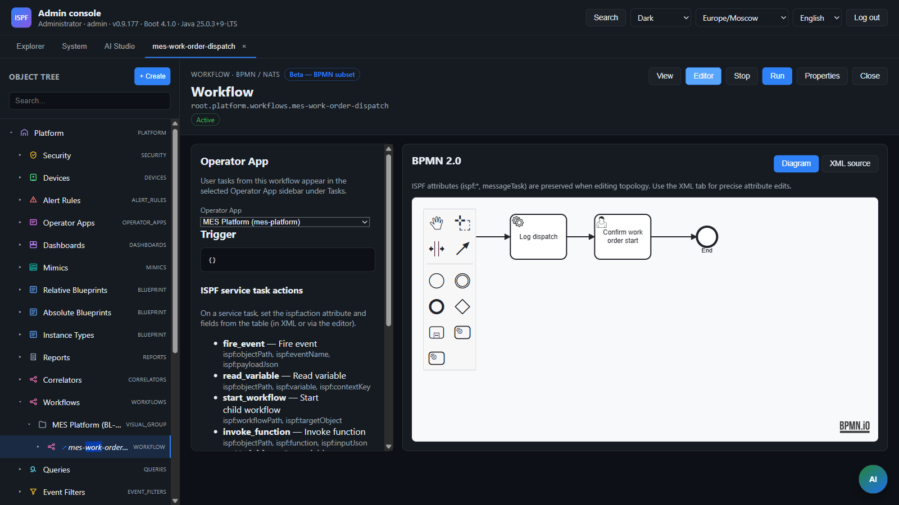
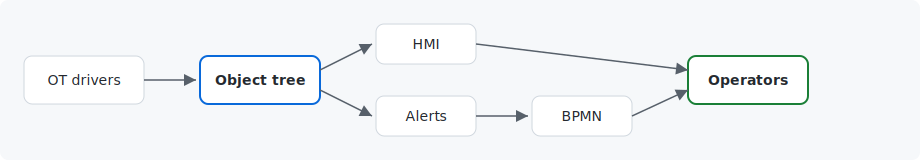

# ISPF — Open-source industrial IoT / SCADA

**Self-hosted platform for devices, HMI, alarms, historian, and workflows — one object tree, one API, one UI.**

Website: [ispf.ai](https://ispf.ai) · Repo: [github.com/iot-solutions-ru/ispf](https://github.com/iot-solutions-ru/ispf)

[](LICENSE)
[](docs/README.md)
[](docs/en/architecture.md)

Most SCADA stacks glue together OPC, historian, HMI, alarms, and workflow as separate products. **ISPF** puts them on a hierarchical **object tree**: a device, dashboard, alert rule, correlator, and BPMN workflow are all nodes with the same API.

<!-- Hero: when ready, drop docs/assets/ispf-hero.gif and change src below (script: docs/assets/README.md). -->

<p align="center">
  
  &nbsp;
  
</p>

<p align="center">
  
  &nbsp;
  
</p>


> **Business logic lives on the platform** — models, variables, events, functions, and workflows. The core ships generic engines; solutions are declarative configuration (bundle deploy), not core forks. See [architecture](docs/en/architecture.md).

<p align="center">
  
</p>

## Why try it

| You want… | ISPF gives you… |
| ----------- | ---------------- |
| One model instead of tag soup + side systems | Object tree + CEL bindings |
| Real HMI, not only a device gateway | Admin Explorer + operator mode |
| Alarms that do something | CEL alert rules → correlators → BPMN |
| Industry solutions without forking the core | Declarative **bundles** |
| Modern self-hosted stack | Spring Boot 4, Java 25, React 19, PostgreSQL/TimescaleDB |

Honest positioning: closer to an **open Ignition-class application platform** than to a pure MQTT broker or Node-RED flow tool. See the [competitive scorecard](docs/en/competitive-scorecard.md).

## Features at a glance

- **Object tree** — typed variables, events, functions; REST + WebSocket
- **~58 drivers** — Modbus, OPC UA, MQTT, SNMP, JDBC, and more ([drivers](docs/en/drivers.md))
- **HMI** — dashboard builder, charts with variable history, SCADA mimics
- **Automation** — alert rules, correlators, BPMN workflows as tree nodes
- **Applications** — bundle deploy, reports, BFF functions, scheduler
- **Storage** — H2 for local; PostgreSQL + TimescaleDB for prod; Redis/NATS optional
- **AI-assisted solution tooling** — agent / generator paths in docs ([ai-development](docs/en/ai-development.md))

## Quick start

### All-in-one release (Windows / Linux / macOS)

**Portable zip** (JDK **25**): download `ispf-*-portable.zip` from [GitHub Releases](https://github.com/iot-solutions-ru/ispf/releases), unzip, then `start.bat` (Windows) or `./start.sh` (Linux/macOS).

Uses an **embedded H2** file DB (no PostgreSQL to install). After first start: `data/ispf-local.mv.db` next to the JAR.

**Container** ([GitHub Packages](https://github.com/iot-solutions-ru/ispf/pkgs/container/ispf-server)):

```bash
docker pull ghcr.io/iot-solutions-ru/ispf-server:latest
docker run --rm -p 8080:8080 -v ispf-data:/opt/ispf/data ghcr.io/iot-solutions-ru/ispf-server:latest
```

Open http://localhost:8080 — login `admin` / `admin`. Operator HMI: http://localhost:8080?mode=operator

### From source (dev)

**Requirements:** JDK **25**, Node.js 20+, Docker optional (Postgres/NATS/Keycloak for fuller stacks).

```bash
# API — local profile (H2, no OAuth; syncs a small set of dev driver packs)
./gradlew :packages:ispf-server:bootRun --args="--spring.profiles.active=local"

# Web console (separate terminal)
cd apps/web-console && npm install && npm run dev
```

| URL | Purpose |
| --- | ------- |
| http://localhost:8080 | Admin console (all-in-one JAR) |
| http://localhost:5173 | Admin console (Vite dev) |
| http://localhost:8080?mode=operator | Operator HMI (all-in-one JAR) |
| http://localhost:5173?mode=operator | Operator HMI (Vite dev) |
| http://localhost:8080/api/v1/info | Version / capabilities |
| http://localhost:8080/actuator/health | Health |

Full guide: [Getting started](docs/en/getting-started.md) · [Начать работу](docs/ru/getting-started.md)

> Avoid a cold `./gradlew test` on first day — it builds the full driver matrix and can take a long time. Prefer `bootRun` + the console, or `./tools/ci/pr-fast.sh` / `.\tools\ci\pr-fast.ps1` before a PR.

### Demo objects (local profile)

| Path | Purpose |
| ---- | ------- |
| `root.platform.devices.demo-sensor-01` | Virtual sensor + alarm |
| `root.platform.dashboards.demo-sensor` | HMI dashboard |
| `root.platform.alert-rules.temperature-threshold-exceeded` | CEL alert rule |
| `root.platform.correlators.alarm-handler-on-threshold-event` | Correlator → workflow |
| `root.platform.workflows.demo-alarm-handler` | BPMN demo |
| `root.platform.devices.snmp-localhost` | SNMP agent |

## Documentation

**Start here:** [Try ISPF (≈15 min)](docs/en/getting-started.md#try-ispf-15-minutes) · [Docs hub by role](docs/en/readme.md)

| | English (canonical) | Русский |
| --- | ------------------- | ------- |
| Hub | [docs/en/readme.md](docs/en/readme.md) | [docs/ru/readme.md](docs/ru/readme.md) |
| Product | [product.md](docs/en/product.md) | [product.md](docs/ru/product.md) |
| Getting started | [getting-started.md](docs/en/getting-started.md) | [getting-started.md](docs/ru/getting-started.md) |
| Architecture | [architecture.md](docs/en/architecture.md) | [architecture.md](docs/ru/architecture.md) |
| Drivers | [drivers.md](docs/en/drivers.md) | [drivers.md](docs/ru/drivers.md) |
| Solution developer | [solution-developer-guide.md](docs/en/solution-developer-guide.md) | [solution-developer-guide.md](docs/ru/solution-developer-guide.md) |
| API | [api.md](docs/en/api.md) | [api.md](docs/ru/api.md) |
| License | [license.md](docs/en/license.md) | [license.md](docs/ru/license.md) |
| Roadmap | [roadmap.md](docs/en/roadmap.md) | [roadmap.md](docs/ru/roadmap.md) |

More: [operator guide](docs/en/operator-guide.md) · [glossary](docs/en/glossary.md) · [ADRs](docs/en/decisions/readme.md) · [doc hub](docs/README.md)

## Repository layout

```text
iot-solutions-platform-framework/
├── packages/           # Core, CEL, drivers, server (Spring Boot)
├── apps/web-console/   # React admin + operator UI
├── examples/           # demo-app, MES/HVAC references, labs
├── docs/en · docs/ru   # Canonical EN + Russian docs
├── site/               # Project GitHub Pages (EN + RU)
├── deploy/             # Compose, VPS, Grafana, edge
└── docker-compose.yml
```

## License

**[GNU Affero General Public License v3.0](LICENSE)** — platform (`ispf-server`, `web-console`, core packages).

Optional **Enterprise** dual-license: [LICENSE-COMMERCIAL.md](LICENSE-COMMERCIAL.md) · [commercial licensing](docs/en/commercial-licensing.md).

Driver packs and application bundles may use separate terms. Details: [license](docs/en/license.md) · [NOTICE](NOTICE).

## Contributing & feedback

Issues and PRs welcome — especially driver/HMI bugs, docs fixes, and real-plant pilot feedback.

If ISPF helps your project, a GitHub ★ helps others discover it. For OT / integrator discussions, open an issue with your stack (protocols, historian size, HMI constraints).
