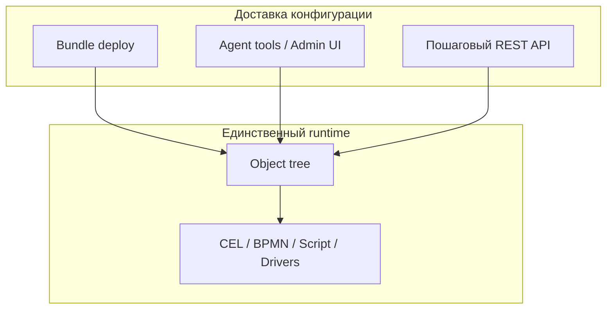

# Принципы создания приложения на ISPF

Канонический свод правил для **разработчиков решений** и **AI-агентов** (tree-first agent, AI Studio, MCP). Объединяет north star из [ARCHITECTURE.md](ARCHITECTURE.md), границу platform/solution ([ADR-0001](decisions/0001-app-platform-boundary.md)), жизненный цикл из [SOLUTION_DEVELOPER_GUIDE.md](SOLUTION_DEVELOPER_GUIDE.md), подходы A–H из [AGENT_KNOWLEDGE.md](AGENT_KNOWLEDGE.md) и единую модель логики из [PLATFORM_LOGIC.md](PLATFORM_LOGIC.md).

**Для деталей API и виджетов** — специализированные документы; этот файл — hub «как создавать приложение».

**Агент:** `search_context(query=..., topic=application-principles)`.

---

## Северная звезда

**Бизнес-логика прикладного решения живёт в declarative-конфигурации дерева объектов; платформа поставляет generic-движки; bundle deploy — упаковка и доставка конфигурации, а не отдельный runtime.**

---

## Принципы P1–P10

Каждый принцип — два слоя: narrative для человека и actionable rules для агента.

### P1. Object tree — единственный runtime

**Для человека:** После deploy всё исполняется через узлы дерева (`root.platform.devices.*`, `{appId}.functions.*`, `DASHBOARD`, `WORKFLOW`, `ALERT`). Запись в таблице `applications` — **реестр + изолированная SQL-schema**, не отдельный движок. Invoke, alerts, dashboards, bindings — через tree API и WebSocket.

**Для агента:**

- Адресовать функции по tree path: `{appId}.functions.{name}`; `invoke_bff` / `invoke_tree_function` — не выдумывать REST.
- `list_applications` — только для appId/schema; runtime — `list_objects`, `get_object`, `list_variables`.



---

### P2. Платформа — движки; решение — конфигурация

**Для человека:** ISPF — middleware/framework. Платформа (`main`) реализует generic-механизмы **один раз**: CEL, bindings, historian, BPMN, script runtime, drivers, event bus. Ваше решение **наполняет** их declarative JSON: models, variables, events, functions, workflows, dashboards.

**Для агента:**

- **Запрещено:** Java в `ispf-server`, React в `apps/web-console`, Flyway platform для app-таблиц, hardcoded BFF routes.
- Новая platform-возможность — только REQ-PF, не workaround в bundle.

См. [ADR-0001](decisions/0001-app-platform-boundary.md), [PLUGINS.md](PLUGINS.md).

---

### P3. Declarative over custom code

**Для человека:** Если задачу можно выразить CEL, binding rule, BPMN, script function или driver mapping — **не пишите** custom Java. Чем больше логики в object tree, тем проще deploy, audit и AI-assisted editing.

**Для агента:**

- Перед script function: проверить CEL / `create_variable` / binding rules / `configure_alert`.
- Script steps — для CRUD по app schema (`selectMany`, `insert`, `update`), не для UI-логики.

---

### P4. Bundle = упаковка, не параллельный runtime

**Для человека:** Bundle manifest — **способ доставить** конфигурацию в дерево и app schema. После import всё адресуется tree paths; bundle не «живёт отдельно» от платформы.

**Для агента:**

- Production path: `validate_bundle` → `dry_run_deploy` → `import_package` (в одном run).
- POC/lab: tree-first tools без bundle — допустимо; bundle import только после gates OK.

Секции manifest: `objects[]`, `models[]`, `dashboards[]`, `workflows[]`, `migrations[]`, `functions[]`, `bindings[]`, `operatorUi`, … — см. [SOLUTION_DEVELOPER_PUBLIC_API.md](SOLUTION_DEVELOPER_PUBLIC_API.md).

---

### P5. Одна модель логики: Platform Rule

**Для человека:** Вся реактивная логика — один mental model:

```text
КОГДА (activator)  →  ЕСЛИ (CEL condition)  →  ТОГДА (effect)
```

Три effect (`target.kind`): `variable` (переменная), `context` (`@dashboardContext`), `event` (journal/workflow). Не добавлять параллельные DSL на виджетах (`showWhen`, `behaviorJson`, `visibleWhen`).

**Для агента:**

- Dashboard show/hide → rules с `target.kind=context`, path `widgets.{id}.visible`.
- UI mode/selection → `context.params.*`, `context.selection.*`.
- Activators: `onVariableChange`, `onContextChange`, `onEvent`, `onStartup`, `periodicMs`.
- `search_context topic=platform-logic`.

См. [PLATFORM_LOGIC.md](PLATFORM_LOGIC.md), [ADR-0019](decisions/0019-platform-rule-unification.md).

---

### P6. Одна задача — один механизм

**Для человека:** Не дублировать логику в нескольких местах.

| Задача | Механизм | Не использовать |
|--------|----------|-----------------|
| Вычисление переменной | CEL / binding rules | Java handler |
| UI show/hide, режим HMI | Platform Rule → `@dashboardContext` | Поля на виджете |
| Порог → событие | ALERT + CEL | Custom polling |
| Паттерн событий | Correlator | Ad-hoc scripts |
| Процесс с задачами | BPMN WORKFLOW | Imperative chain |
| CRUD по SQL | Script function | Platform Java |
| SQL → live variable | `sqlBinding` / bindings[] | Manual sync |
| Телеметрия | Driver + mappings | Fake variables |

**Для агента:** `get_automation_schema` перед `configure_alert` / `configure_correlator`; layout только в variable `layout`, не `set_variable name=widgets`.

---

### P7. Выбор пути доставки по потребностям

**Для человека:** Нет «единственного правильного» способа — есть **подход по контексту**:

```text
Нужна изолированная SQL-schema (orders, batches)?
  ├─ ДА → Bundle (C) / REST по шагам (D) / AI generate (E) / reference (F)
  └─ НЕТ → Tree-first (A) / Admin Console (B) / Platform HMI only (G)

Нужен CI/CD и повторяемый релиз?
  └─ Bundle + validate gates (C/E)

Интерактивная сессия в AI Studio?
  └─ Tree-first tools (A), bundle — в конце после validate
```

| # | Подход | Когда |
|---|--------|-------|
| A | Tree-first (agent tools / Explorer) | POC, SNMP, lab, интерактив с пользователем |
| B | Admin Console | Инженер без bundle, итеративный HMI |
| C | Bundle deploy | Production, CI/CD |
| D | Пошаговый REST API | Automation без ZIP |
| E | AI Studio generate → validate → import | Черновик manifest из промпта |
| F | Reference example | Обучение, MES/lab шаблон |
| G | Platform HMI only | Мониторинг без app schema |
| H | Commercial bundle | Лицензируемое решение |

Полная таблица с delivery и Operator UI — [AGENT_KNOWLEDGE.md § Подходы](AGENT_KNOWLEDGE.md#подходы-к-созданию-приложений-выбор-стратегии).

**Для агента:** `search_context topic=agent-knowledge`; `get_example_bundle` для MES/lab; playbooks SNMP/virtual cluster/MES — в system prompt.

---

### P8. Tree-first convergence

**Для человека:** После deploy функции живут на `{appId}.functions.*`; повторный deploy **обновляет** существующие узлы (reconcile); SQL bindings — через `sqlBinding('appId','var')` на переменной.

**Для агента:**

- Legacy `POST .../functions/invoke` по appId — deprecated; prefer `invoke_bff` / tree path.
- `operatorUi` в manifest, не legacy `operatorManifest`.
- Reconcile: повторный deploy обновляет nodes, не только create.

| Было (legacy) | Стало (north star) |
|---------------|-------------------|
| Только `POST .../functions/invoke` по appId | `POST /bff/invoke` или tree path `{appId}.functions.*` |
| `screens[]` в operator manifest | `operatorUi` + dashboards |
| Новые `objects[]` только create | Reconcile при redeploy |
| Imperative sync Java → variables | CEL, `sqlBinding()`, script steps |

---

### P9. Operator UI — declarative, из bundle или tools

**Для человека:** Operator HMI: `?mode=operator&app={appId}`. Меню и default dashboard — из `operatorUi` в bundle или `configure_operator_ui`. Приоритет: DB `operator_app_ui` → bundle `operatorUi` → autogen из dashboards.

**Для агента:** После tree-first POC — `configure_operator_ui`; в `finish` — URL с `?mode=operator&app=...&dashboard=...`.

---

### P10. Validate before mutate

**Для человека:** Любой deploy проходит semantic validation. CI: validate → dry-run → import. CEL: `POST /api/v1/expressions/validate`.

**Для агента:**

- `import_package` только после `validate_bundle` + `dry_run_deploy` OK **в том же run**.
- Не invent REST paths — только documented tools/endpoints.
- Commercial bundle: sign after edits — [COMMERCIAL_LICENSING.md](COMMERCIAL_LICENSING.md).

См. [ADR-0004](decisions/0004-ai-artifact-generation-gates.md).

---

## Где выражать логику

| Задача | Механизм | Документ |
|--------|----------|----------|
| Вычисление переменной | CEL / platform bindings / binding rules | [BINDINGS.md](BINDINGS.md) |
| UI дашборда (show/hide, mode) | Platform Rule → `@dashboardContext` | [PLATFORM_LOGIC.md](PLATFORM_LOGIC.md), [DASHBOARDS.md](DASHBOARDS.md) |
| Порог → событие | ALERT node + CEL | [AUTOMATION.md](AUTOMATION.md) |
| Паттерн событий → workflow | Correlator | [AUTOMATION.md](AUTOMATION.md) |
| Процесс с задачами оператора | BPMN WORKFLOW | [WORKFLOWS.md](WORKFLOWS.md) |
| CRUD по SQL app schema | Script function (steps) | [APPLICATIONS.md](APPLICATIONS.md), [OBJECT_FUNCTIONS.md](OBJECT_FUNCTIONS.md) |
| SQL → variable poll | sqlBinding / bindings[] | [APPLICATIONS.md](APPLICATIONS.md) |
| Телеметрия устройства | Driver + point mappings | [DRIVERS.md](DRIVERS.md) |
| Таблица на HMI | Widget `object-table` + `selectionKey` | [DASHBOARDS.md](DASHBOARDS.md), [WIDGETS.md](WIDGETS.md) |
| Legacy mini-DSL на виджете | **Deprecated** → Platform rules | [PLATFORM_LOGIC.md](PLATFORM_LOGIC.md) § legacy |

---

## Анти-паттерны

| Анти-паттерн | Почему плохо | Правильно |
|--------------|--------------|-----------|
| Отраслевой Java в server | Ломает границу platform/solution | Script function + tree |
| App layer как runtime | Дублирует object tree | Tree paths |
| Логика на виджете | N mini-DSL, AI/люди путаются | Platform Rule |
| sessionStorage-only context | Не durable, не multi-client | `@dashboardContext` + WS |
| Bundle без validate | Silent breakage | Gates [0004](decisions/0004-ai-artifact-generation-gates.md) |
| Platform Flyway для app tables | Смешивает schemas | `migrations[]` в app schema |

---

## Чеклисты для агента

### «Создай приложение / решение» (с SQL)

1. Уточнить appId, нужен ли operator UI.
2. `search_context topic=application-principles` + `topic=agent-knowledge`; `get_example_bundle` если похоже на MES/lab.
3. register (или bundle) → migrations → functions → objects/dashboards.
4. `validate_bundle` → `dry_run_deploy` → `import_package`.
5. `configure_operator_ui` если не в manifest.
6. `finish` с `?mode=operator&app=...` и путями dashboards.

### «Создай мониторинг / SNMP / дашборд» (без app schema)

1. Tree-first playbook (SNMP / virtual cluster).
2. Driver + dashboard template.
3. Platform rules при необходимости (detail mode, widget visibility).
4. `configure_operator_ui` для platform app.

### «Не ломай platform» (P2, P10)

- Не invent REST paths — только tools.
- Bundle import только после validate + dry_run OK в том же run.
- Не platform Flyway для app tables.
- Prefer `operatorUi` over legacy `operatorManifest`.

---

## Связанные документы

| Документ | Назначение |
|----------|------------|
| [SOLUTION_DEVELOPER_GUIDE.md](SOLUTION_DEVELOPER_GUIDE.md) | Жизненный цикл: register → migrate → deploy → operator |
| [AGENT_KNOWLEDGE.md](AGENT_KNOWLEDGE.md) | Подходы A–H, карта docs, search_context topics |
| [ARCHITECTURE.md](ARCHITECTURE.md) | Слои platform, core domain model |
| [PLATFORM_LOGIC.md](PLATFORM_LOGIC.md) | Platform Rule, `@dashboardContext` |
| [AI_DEVELOPMENT.md](AI_DEVELOPMENT.md) | Agent tools, ContextPack, MCP |
| [SOLUTION_DEVELOPER_PUBLIC_API.md](SOLUTION_DEVELOPER_PUBLIC_API.md) | Стабильный контракт manifest |
| [decisions/README.md](decisions/README.md) | ADR-0001, 0004, 0005, 0019 |

---

*Обновлять при изменении north star (ADR, REQ-PF) и расширении agent tools.*
