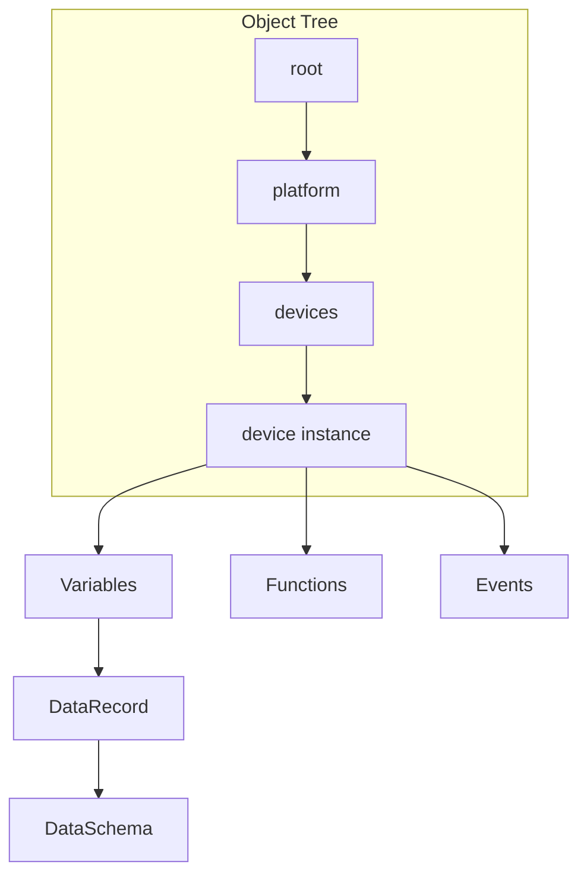

# ISPF Architecture

## Vision

**IoT Solutions Platform Framework (ISPF)** — это middleware-платформа для IoT, промышленной автоматизации и IT-операций. Цель — дать единую модель данных и API для устройств, дашбордов, алертов и автоматизации без привязки к монолитному legacy-стеку.

## Core Domain Model



### Platform Object

Адресуемый узел в дереве объектов: `root.platform.devices.pump-01`. Каждый объект имеет тип (`DEVICE`, `DASHBOARD`, `WORKFLOW`, …), переменные, функции и события.

### DataRecord

Типизированная табличная структура:

- `DataSchema` — описание полей (`FieldType`: BOOLEAN, DOUBLE, STRING, RECORD, …)
- `DataRecord` — строки данных с валидацией по схеме

### Templates

`ObjectTemplate` — blueprint для создания экземпляров. Содержит переменные, события, функции и binding-выражения.

### Expressions

Google CEL (Common Expression Language) для вычисляемых привязок:

```
self.temperature.value > 80.0
```

## Runtime Layers

```
┌─────────────────────────────────────────────────────────┐
│  Web Console (React 19 + Vite + TanStack Query)         │
├─────────────────────────────────────────────────────────┤
│  API Gateway (Spring Boot 3.4)                          │
│  REST / WebSocket / OAuth2 JWT                          │
├─────────────────────────────────────────────────────────┤
│  Core Services                                          │
│  ObjectTree │ ExpressionEngine │ EventBus │ Scheduler  │
├─────────────────────────────────────────────────────────┤
│  Driver Runtime (SPI)                                   │
│  MQTT │ Modbus* │ OPC UA* │ SNMP*                       │
├─────────────────────────────────────────────────────────┤
│  Persistence & Messaging                                │
│  PostgreSQL/TimescaleDB │ Redis │ NATS JetStream          │
└─────────────────────────────────────────────────────────┘
```

## Security Model

- OAuth2 Resource Server (JWT)
- Per-object RBAC (planned)
- Driver sandboxing via isolated classloaders (planned)

## Deployment Topology

**Development:** `docker compose` + local Gradle bootRun

**Production (target):**

- `ispf-server` — stateless replicas behind ingress
- `ispf-gateway` — protocol adapters (MQTT, Modbus)
- `ispf-agent` — edge connectivity
- Managed PostgreSQL, Redis, NATS

## Extension Points

1. **DeviceDriver** — реализуйте SPI, зарегистрируйте в runtime
2. **ObjectTemplate** — определите модель устройства/сервиса
3. **REST/Webhook** — интеграции через стандартные API
4. **NATS subjects** — event-driven automation (planned)
