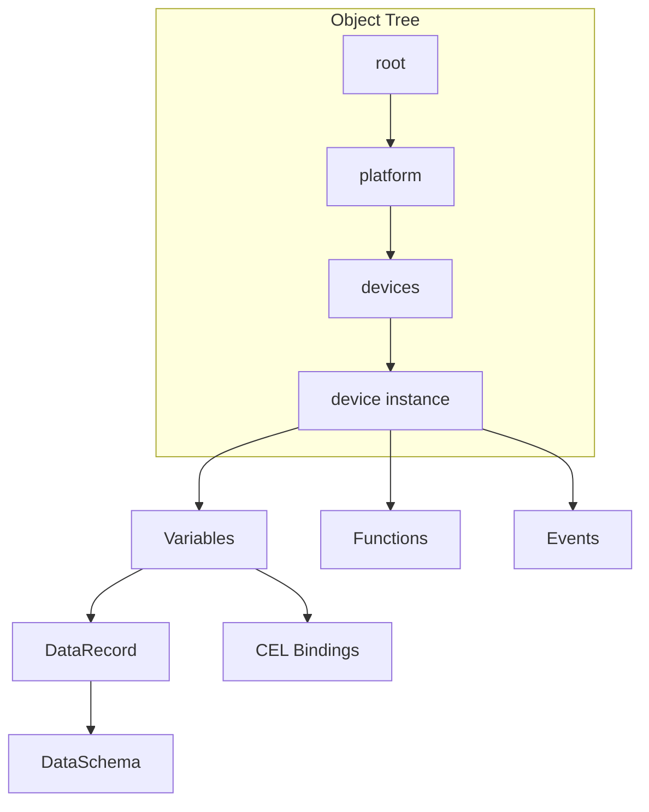

# ISPF Architecture

## Vision

**IoT Solutions Platform Framework (ISPF)** — middleware-платформа для IoT, промышленной автоматизации и IT-операций. Единая модель данных и API для устройств, HMI-дашбордов, алертов и BPMN-автоматизации.

## Core Domain Model



Подробнее: [OBJECT_MODEL.md](OBJECT_MODEL.md).

### Platform Object

Адресуемый узел: `root.platform.devices.pump-01`. Типы: `DEVICE`, `DASHBOARD`, `WORKFLOW`, `CUSTOM`, …

### DataRecord

- `DataSchema` — поля (`FieldType`)
- `DataRecord` — строки с валидацией

### Models (Templates)

`ModelDefinition` — blueprint: variables, events, functions, bindings.  
См. [MODELS.md](MODELS.md).

### Expressions

Google CEL для bindings, alert rules, workflow gateways:

```
self.temperature.value > self.threshold.value
```

## Runtime Layers

```
┌─────────────────────────────────────────────────────────┐
│  Web Console (React 19 + Vite + TanStack Query)         │
│  Admin │ Operator HMI │ Dashboard/Workflow builders     │
├─────────────────────────────────────────────────────────┤
│  API Layer (Spring Boot 3.4)                            │
│  REST / WebSocket / OAuth2 JWT / RBAC                   │
├─────────────────────────────────────────────────────────┤
│  Domain Services                                        │
│  ObjectManager │ EventService │ WorkflowService         │
│  DashboardService │ AlertRuleService │ CorrelatorService│
│  DriverRuntimeService │ ModelEngine                     │
│  ApplicationPlatform (functions, data, BFF, scheduler)  │
├─────────────────────────────────────────────────────────┤
│  Plugins & Libraries                                    │
│  ispf-core │ ispf-expression │ ispf-plugin-model         │
│  ispf-plugin-workflow                                   │
├─────────────────────────────────────────────────────────┤
│  Driver SPI                                             │
│  virtual │ mqtt │ modbus-tcp │ snmp                     │
├─────────────────────────────────────────────────────────┤
│  Persistence & Messaging                                │
│  PostgreSQL/H2 │ Flyway │ NATS* │ MQTT*                 │
└─────────────────────────────────────────────────────────┘
```

## Package Map

| Package | Role |
|---------|------|
| `ispf-core` | ObjectTree, PlatformObject, DataRecord |
| `ispf-expression` | CEL engine, BindingEvaluator |
| `ispf-driver-*` | Device protocol adapters |
| `ispf-plugin-model` | Model registry & engine |
| `ispf-plugin-workflow` | BPMN parser & executor |
| `ispf-server` | Spring Boot wiring, REST, JPA, security |

## Security Model

OAuth2 JWT (Keycloak) или header-based RBAC (`local`).  
Roles: `admin`, `operator`.  
См. [SECURITY.md](SECURITY.md).

## Data Flow: Telemetry

```
DeviceDriver.readPoints()
  → DriverRuntimeService
  → ObjectManager.setVariableValue()
  → BindingEvaluator (CEL)
  → AlertRuleListener
  → ObjectChangeEvent → WebSocket → Web Console
```

## Data Flow: Automation

```
Event fire → event_history
  → EventCorrelatorListener → WorkflowService.run
  → UserTask → WorkQueue → Operator HMI
```

## Deployment Topology

**Development:** `docker compose` + Gradle bootRun + Vite dev server.

**Production (target):**

- `ispf-server` — stateless replicas
- Managed PostgreSQL, Redis, NATS
- Keycloak / OIDC
- Static web-console behind CDN/ingress

См. [DEPLOYMENT.md](DEPLOYMENT.md).

## Extension Points

1. **DeviceDriver** — новый протокол ([DRIVERS.md](DRIVERS.md))
2. **ModelDefinition** — шаблон устройства/процесса ([MODELS.md](MODELS.md))
3. **FunctionHandler** — бизнес-операции на объектах
4. **Dashboard widgets** — новые типы в web-console ([DASHBOARDS.md](DASHBOARDS.md))
5. **REST / Webhook** — внешние интеграции ([API.md](API.md))
6. **NATS subjects** — messageTask в BPMN ([WORKFLOWS.md](WORKFLOWS.md))
7. **Application bundle** — deploy функций и миграций **вне** ядра ([APPLICATIONS.md](APPLICATIONS.md), [PLUGINS.md](PLUGINS.md))

Коммерческие и отраслевые расширения **не** входят в Apache 2.0-дерево `main`.

## Reference Stands

| Stand | Branch | Description |
|-------|--------|-------------|
| Demo sensor | `main` | virtual driver, alert, workflow |

## Documentation Index

Полный комплект: [docs/README.md](README.md).
