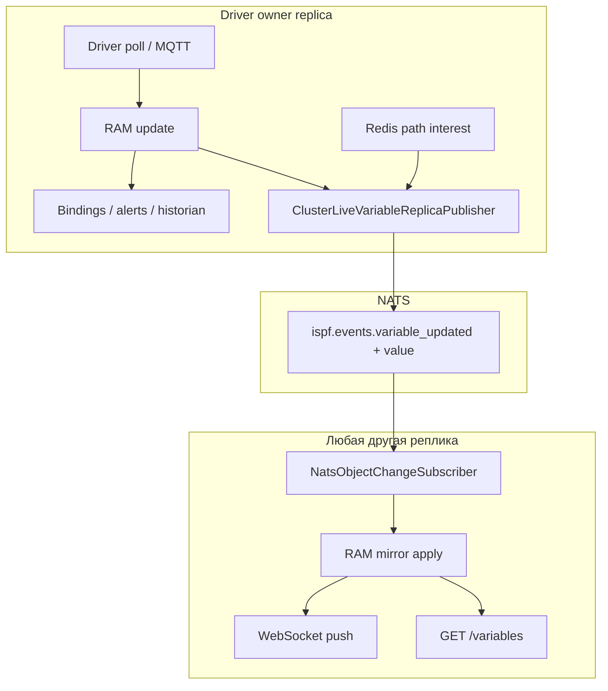

# Кластер ISPF (multi-replica)

Руководство по горизонтальному масштабированию API: несколько JVM-реплик, одно дерево объектов в PostgreSQL, синхронизация live-значений через NATS ([ADR-0029](decisions/0029-cluster-live-variable-replica-sync.md)).

См. также: [ADR-0028](decisions/0028-horizontal-active-active-cluster.md), [DEPLOYMENT.md](DEPLOYMENT.md), [MESSAGING.md](MESSAGING.md), [BINDINGS.md](BINDINGS.md).

## Кластер ≠ федерация

| | **Кластер** | **Федерация** |
|---|-------------|---------------|
| Дерево объектов | Одно `root.platform.*` в одной БД | Несколько площадок / edge-агентов |
| Реплики | N stateless JVM за LB | Связь hub ↔ spoke |
| Драйвер | Exactly-one poll на устройство | См. [FEDERATION.md](FEDERATION.md) |

## Топология (пример VPS / lab)

```text
                    nginx :8080
           REST ip_hash  │  WS ip_hash (одна реплика на клиента)
        ┌──────────┬───────┴───────┬──────────┐
        ▼          ▼               ▼          │
   replica-1   replica-2      replica-3      │
   :8081       :8082           :8083          │
        └──────────┴───────┬───┴──────────────┘
                           │
              PostgreSQL (одно дерево)
              NATS (fan-out между репликами)
              Redis (path interest, ACL, correlator)
```

Compose: [`deploy/docker-compose.cluster.yml`](../deploy/docker-compose.cluster.yml), VPS: [`deploy/docker-compose.vps-cluster.yml`](../deploy/docker-compose.vps-cluster.yml).

Каждая реплика при старте:

1. Flyway (один раз на БД).
2. `loadFromDatabase()` — одинаковое дерево на всех узлах.
3. Регистрация в `platform_cluster_replicas` + heartbeat.
4. Захват `platform_driver_locks` для устройств, назначенных этому узлу.

## Где живут данные

| Данные | Хранение | Кластерное поведение |
|--------|----------|----------------------|
| Структура объектов, config, bindings | PostgreSQL | Запись на любой реплике → NATS fan-out → reload на peers ([ADR-0030](decisions/0030-cluster-config-structure-replica-sync.md): `reloadPathFromDatabase`, config vars: `syncVariableFromDatabase`) |
| **Live telemetry** (`ifInOctets`, `temperature`, …) | **RAM на owner-реплике** | Не пишется в PG на каждый tick |
| **Live mirror на follower** | RAM (копия snapshot) | ADR-0029: NATS payload с `value` |
| Historian / event journal | PG / ClickHouse / Cassandra | Пишет **только owner** |
| Bindings / alerts / functions cascade | RAM + automation pipeline | Выполняется **только на owner** |

### Driver ownership

Ровно одна реплика опрашивает каждое DEVICE (`platform_driver_locks`, TTL + renew). При падении узла lock истекает, другая реплика забирает устройство.

Проверка: `GET /api/v1/platform/cluster/health` (admin) — поле `heldDevicePaths` на каждом узле.

## Bindings, variables, functions, dashboards

### Переменные

- **Raw telemetry** приходит с драйвера на owner → `setDriverTelemetryValue()` → RAM.
- **REST** `GET /api/v1/objects/{path}/variables` читает **локальный RAM** реплики, обслужившей запрос.
- **WebSocket** `/ws/objects` — push `VARIABLE_UPDATED` клиентам, подписанным на path.

До ADR-0029 follower RAM для telemetry был пуст → round-robin REST мог вернуть `null`/устаревшее значение.

### Bindings

**Локальные** (на том же DEVICE):

```cel
counterRate(ifInOctets)   → переменная ifInOctetsRate
```

**Cross-object** (на hub-объекте):

```cel
refAt("root.platform.devices.snmp-router-01", ifInOctetsRate)   → routerNetDown
```

Цепочка на **owner** реплике, где живёт исходное устройство:

```text
SNMP poll → ifInOctets (RAM)
         → binding counterRate → ifInOctetsRate (RAM)
         → (если hub на том же owner или ref читается с owner RAM) → derived vars
```

Follower **не пересчитывает** bindings — получает уже вычисленные значения через NATS mirror (`replicaIngress` events без automation).

### Functions

`INVOKE_FUNCTION`, script handlers, platform functions — выполняются на реплике, принявшей HTTP-запрос. Для side-effect функций учитывайте идемпотентность. Live-read переменных device — с любой реплики после ADR-0029.

### Dashboards

Дашборд — объект `DASHBOARD` с layout JSON. Виджеты ссылаются на `objectPath` / bindings. HMI:

1. WS subscribe на paths таблицы/графиков.
2. Push `VARIABLE_UPDATED` (локально или после NATS mirror).
3. Иногда REST refetch — должен попасть на реплику с актуальным RAM (после ADR-0029 — любая).

## ADR-0029: live variable replica sync

### Проблема (до 0029)

| Механизм | Пробел |
|----------|--------|
| NATS `ispf.events.*` | Только `path` + `variableName`, **без value** |
| `NatsEventBridge` | Пропускал `telemetry=true` |
| REST vs WS LB | `ip_hash` на REST и WS — один клиент (IP) → одна JVM; failover через `max_fails` + `proxy_next_upstream` |
| WS path interest | Только per-JVM — owner не знал о подписчиках на другой реплике |

### Решение

```text
Owner (driver)
  → RAM update
  → automation (bindings, alerts, historian) — только здесь
  → ClusterLiveVariableReplicaPublisher (coalesced NATS + full DataRecord)

Follower
  → ClusterVariableReplicaApplier → RAM mirror
  → ObjectChangeEvent(replicaIngress=true) → WS push
  → REST GET /variables — свежее значение
```



### replicaIngress

События с `replicaIngress=true` на follower:

| Consumer | Поведение |
|----------|-----------|
| NATS / `ClusterLiveVariableReplicaPublisher` | Пропуск (нет loop) |
| Bindings / historian / alerts | Пропуск |
| WebSocket | Push клиентам |

### Cluster-wide path interest (Redis)

При `ispf.cluster.cluster-path-interest-enabled=true` и Redis:

- WS `subscribe` / `unsubscribe` обновляет ref-count в Redis (`ispf:cluster:ws:interest:{path}`).
- Owner публishes NATS sync, даже если все браузеры на других репликах.

Без Redis — только local interest; рекомендуется sticky REST+WS или включить Redis.

## Пример: SNMP fleet monitoring (3 реплики)

### Объекты

| Path | Тип | Назначение |
|------|-----|------------|
| `root.platform.devices.snmp-router-01` | DEVICE | SNMP router, model `snmp-agent-v1` |
| `root.platform.devices.snmp-switch-02` | DEVICE | SNMP switch |
| `root.platform.devices.snmp-fleet.hub` | CUSTOM | Cross-object агрегатор |
| `root.platform.dashboards.snmp-host-monitoring` | DASHBOARD | btop-таблица + графики |

### Bindings

На каждом DEVICE (локальные):

```json
{
  "targetVariable": "ifInOctetsRate",
  "expression": "counterRate(ifInOctets)"
}
```

На hub (cross-object):

```json
{
  "targetVariable": "routerNetDown",
  "expression": "refAt(\"root.platform.devices.snmp-router-01\", ifInOctetsRate)"
}
```

```json
{
  "targetVariable": "totalNetDown",
  "expression": "routerNetDown + switchNetDown"
}
```

### Сценарий по шагам

**T0 — старт:** R1, R2, R3 загружают одно дерево из PG. R1 захватывает lock на `snmp-router-01`, R2 — на `snmp-switch-02`.

**T1 — оператор открывает HMI:** браузер → nginx → WS на R3 (`ip_hash`), subscribe на paths дашборда. Redis фиксирует global interest → owners R1/R2 начинают публиковать updates.

**T2 — SNMP poll на R1:** `ifInOctets` обновляется → `counterRate` binding → `ifInOctetsRate`. Demand-driven: есть interest → `ObjectChangeEvent` → coalesced NATS с полным `value`.

**T3 — REST refetch на R2:** `GET .../snmp-router-01/variables/ifInOctetsRate` — follower уже применил NATS snapshot → актуальное значение (без sticky REST).

**T4 — hub `totalNetDown`:** вычисляется на owner hub-объекта (или owner исходных device). Derived value тоже уходит в NATS → все реплики показывают одну сумму на дашборде.

**T5 — падение R1:** lock истекает → R2/R3 перераспределяют устройства; краткий gap telemetry до reclaim; structure и config не теряются (PG).

## Настройки

### Обязательные (каждая реплика)

```bash
# /opt/ispf/ispf-server.env
ISPF_CLUSTER_ENABLED=true
ISPF_REPLICA_ID=replica-1          # уникально на узел
ISPF_DB_URL=jdbc:postgresql://postgres:5432/ispf
ISPF_NATS_ENABLED=true
ISPF_NATS_REPLICA_EVENTS=true
ISPF_REDIS_ENABLED=true
ISPF_CLUSTER_LIVE_VARIABLE_SYNC=true
ISPF_CLUSTER_PATH_INTEREST=true
```

### Coalesce: два независимых параметра

| Параметр | Env | Default | Где применяется |
|----------|-----|---------|-----------------|
| `ispf.runtime-telemetry.coalesce-ms` | `ISPF_RUNTIME_TELEMETRY_COALESCE_MS` | **250** | Ingress на owner: слияние tick'ов драйвера |
| `ispf.cluster.live-variable-sync-coalesce-ms` | `ISPF_CLUSTER_LIVE_VARIABLE_SYNC_COALESCE_MS` | **500** | NATS fan-out owner → followers |

**Зачем раздельно:** telemetry coalesce оптимизирует CPU/automation на owner; cluster coalesce — **межрепликовый трафик NATS**. Для HMI часто достаточно 500–1000 ms на cluster, оставив 250 ms на ingress.

Пример агрессивного ingress + экономный NATS:

```bash
ISPF_RUNTIME_TELEMETRY_COALESCE_MS=250
ISPF_CLUSTER_LIVE_VARIABLE_SYNC_COALESCE_MS=1000
```

Per-device override (только ingress, **не** NATS):

```json
{
  "host": "192.168.1.1",
  "community": "public",
  "telemetryCoalesceMs": 1000
}
```

### Runtime settings UI

Admin → Platform → Runtime settings → секция **Cluster**:

- `cluster.live-variable-sync-coalesce-ms` — hot-reloadable
- `cluster.live-variable-sync`, `cluster.path-interest`, driver lock TTL

### Отключение live sync (отладка)

```bash
ISPF_CLUSTER_LIVE_VARIABLE_SYNC=false
```

Followers снова без RAM mirror; нужен sticky session для REST+WS или чтение только с owner.

## Нагрузка и tuning

### Demand-driven (ADR-0024)

NATS sync только если есть подписчики: historian, bindings, alerts, UI (local или Redis global interest). «Мёртвый» telemetry без history и без открытого дашборда — **0 NATS**.

### Оценка msg/s

```text
NATS_msg_per_sec ≈ (N_variables_with_interest × replicas_followers) / cluster_coalesce_ms × 1000
```

Пример: 200 переменных на экране, 2 follower, coalesce 500 ms:

```text
200 × 2 / 0.5 ≈ 800 msg/s  (worst case, все vars меняются каждый coalesce window)
```

На практике counterRate/SNMP меняются реже; coalesce last-value-wins сильно снижает пик.

### Когда беспокоиться

- 10k+ historized vars с interest и coalesce &lt; 250 ms.
- Очень большие `DataRecord` (wide tables) в каждом NATS message.

Mitigation: увеличить `ISPF_CLUSTER_LIVE_VARIABLE_SYNC_COALESCE_MS`, сузить historian flags, проверить JetStream vs core NATS.

## Профили реплик и platform jobs (ADR-0031 / ADR-0032)

По умолчанию **unified** (`ISPF_REPLICA_PROFILE=unified` или `ISPF_REPLICA_ROLE=all`): полный стек на одной JVM.

### Profiles (ADR-0032)

| Profile | Env | API/WS | Config write | Drivers | Jobs | Schedulers |
|---------|-----|--------|--------------|---------|------|------------|
| unified | `ISPF_REPLICA_PROFILE=unified` | да | да | да | да | да |
| edge-api | `edge-api` (alias: `api`) | да | да | нет | нет | да |
| hmi-read | `hmi-read` | да | нет | нет | нет | нет |
| io | `io` | нет | нет | да | нет | да |
| compute | `compute` (alias: `worker`) | internal | нет | нет | да | нет |

Явный override: `ISPF_REPLICA_CAPABILITIES=http-public,ws,replica-sync`.

```bash
# edge tier (за nginx)
ISPF_REPLICA_PROFILE=edge-api

# driver I/O (internal, не в LB)
ISPF_REPLICA_PROFILE=io

# async reports worker
ISPF_REPLICA_PROFILE=compute
ISPF_CLUSTER_JOB_MAX_CONCURRENT=4
```

### Async reports

```http
POST /api/v1/reports/by-path/run-async?path=root.platform.reports.daily
→ 202 { "jobId": "…", "status": "QUEUED" }

GET /api/v1/platform/jobs/{jobId}
→ { "status": "COMPLETED", "result": { … same as sync run … } }
```

Web console вызывает `run-async` и poll до `COMPLETED`. Sync `POST …/run` сохранён для тестов.

Jobs хранятся в `platform_jobs` (PostgreSQL). Worker claim: `FOR UPDATE SKIP LOCKED`. Просроченный `RUNNING` возвращается в `QUEUED`.

Подробнее: [ADR-0031](decisions/0031-cluster-replica-roles-platform-jobs.md), [ADR-0032](decisions/0032-replica-profiles-and-capabilities.md).

### VPS prod (single unified node)

```text
Internet → nginx :8080 → replica-1 (unified / legacy role all, :8081)
```

`ISPF_CLUSTER_ENABLED=false` — одна JVM со всеми возможностями (drivers + jobs + HTTP/WS). ADR-0032 запрещает `unified` при `cluster.enabled=true`.

`deploy/docker-compose.vps-cluster.yml` + `deploy/nginx-vps-cluster.conf`. Rollout: `vps-cluster-rollout.sh`. Verify: `vps-cluster-verify.sh` (`replicaRole=all`, `clusterEnabled=false`).

## Операции

### Health API

```http
GET /api/v1/platform/cluster/health
GET /api/v1/platform/cluster/diagnostics
Authorization: Bearer …
```

Ответ health: `liveVariableSyncEnabled`, `liveVariableSyncCoalesceMs`, `clusterPathInterestEnabled`, список узлов, driver locks.

Ответ diagnostics: CPU по репликам, `clusterTopSuspect`, drill-down (потоки, привязки драйверов, jobs, workflows).

**Drill-down (expand ноды):**

| Блок | Поля |
|------|------|
| Suspects | `kind` (subsystem/driver/thread/job/workflow), `severity`, `score` |
| Thread groups | `ispf-driver-io`, `driver-ingress`, `object-change`, …; CPU Δ за окно ~20s |
| Drivers | `ingressPending`, `pressureScore` (≥100 — горячий драйвер) |
| Jobs / workflows | `RUNNING` на этой реплике, `runningSeconds` |

UI: Admin → System → Metrics → **«Диагностика нагрузки»** (CPU) и карточка «Кластер» (health). Опционально: чекбокс **Sync metrics to probe device** — runtime probe в дерево (см. [OBSERVABILITY.md](OBSERVABILITY.md)); выключается при уходе со страницы.

При 100% CPU: expand горячую реплику в diagnostics; первый sample thread CPU — warmup (~20s refresh); если все JVM низкие — `docker stats` на хосте (Scylla/CH/Postgres).

```bash
curl -s -H "Authorization: Bearer $TOKEN" http://127.0.0.1:8083/api/v1/platform/metrics | jq '.diagnostics'
```

### Smoke / CI

```bash
bash deploy/cluster-smoke-test.sh
bash deploy/cluster-smoke-test.sh --config-sync
python deploy/cluster-scale-load-test.py --scale-factor-floor 1.8
```

### Failover checklist

1. `curl https://ispf.example/api/v1/info` — 200 с любой живой реплики.
2. Остановить одну реплику — REST через LB без 502.
3. Driver locks мигрируют в пределах TTL + failover scan.
4. HMI на других репликах продолжает получать live values (ADR-0029).

### nginx

REST и WS **могут** использовать разные политики LB при включённом ADR-0029 — значения зеркалируются на всех JVM.

REST и WS используют один upstream с `ip_hash` — меньше cross-replica NATS interest, стабильная сессия оператора.

При падении реплики nginx помечает upstream down (`max_fails`) и направляет клиента на другую; после deploy все реплики перезапускаются с новой версией — достаточно Ctrl+F5.

## Troubleshooting (desync)

| Симптом | Вероятная причина | Действие |
|--------|-------------------|----------|
| Объект удалён, но снова виден в дереве | Follower RAM не получил `DELETED` (до v0.9.93 — demand-driven gate) | Обновить до 0.9.93+; Ctrl+F5; **не** factory reset |
| Mimic/diagram пустой после save | Config var не синхронизирована на follower | 0.9.92+ fix; проверить `bash deploy/vps-cluster-verify.sh --config-sync` |
| Разные значения REST при refresh | Round-robin до ADR-0029 на telemetry | Убедиться что `liveVariableSyncEnabled=true` в cluster health |
| «Всё сломано» после экспериментов | Накопившийся RAM drift | `bash /opt/ispf/bin/vps-cluster-factory-reset.sh --no-fixtures` (prod) |

### VPS deploy (кластер)

```powershell
.\deploy\vps-deploy-direct.ps1 -Version 0.9.93 -SkipTests -Cluster
```

Rollout использует [`vps-cluster-rollout.sh`](../deploy/vps-cluster-rollout.sh) (restart реплик, без `docker-compose --force-recreate`).

Первичная установка кластера: [`vps-cluster-bootstrap.sh`](../deploy/vps-cluster-bootstrap.sh).

Обнулить БД: [`vps-cluster-factory-reset.sh`](../deploy/vps-cluster-factory-reset.sh).

## Связанные ADR и backlog

- [ADR-0028](decisions/0028-horizontal-active-active-cluster.md) — topology, driver locks
- [ADR-0029](decisions/0029-cluster-live-variable-replica-sync.md) — live RAM mirror
- [ADR-0030](decisions/0030-cluster-config-structure-replica-sync.md) — config/structure CRUD sync
- [ADR-0024](decisions/0024-demand-driven-variable-change-pubsub.md) — demand-driven publish
- ROADMAP BL-134…143
