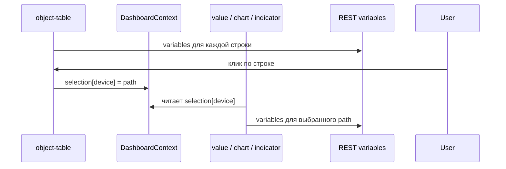

# Дашборды и виджеты

## Обзор

Дашборд — объект типа `DASHBOARD` с моделью `dashboard-v1`. Layout хранится в переменной `layout` (JSON string).

Переменные модели:

| Имя | Описание |
|-----|----------|
| `title` | Заголовок экрана |
| `layout` | JSON сетки виджетов |
| `refreshIntervalMs` | Интервал опроса (мс), по умолчанию 5000 |

Демо:

| Дашборд | Назначение |
|---------|------------|
| `root.platform.dashboards.demo-sensor` | один объект, статический `objectPath` |
| `root.platform.dashboards.snmp-host-monitoring` | таблица устройств + `selectionKey: "device"` |

Layout по умолчанию: `packages/ispf-server/.../DashboardLayouts.java`.

## Привязка к объектам: `objectPath` и `selectionKey`

Виджеты (`value`, `indicator`, `chart`, …) читают переменные **конкретного** объекта платформы (`DEVICE`, `CUSTOM`, …). Путь к этому объекту задаётся двумя способами.

### Откуда берётся `objectPath`

`objectPath` — **поле в JSON виджета** внутри переменной `layout` объекта `DASHBOARD`. Его не передаёт родительский React-компонент в runtime.

| Источник | Когда |
|----------|--------|
| Bootstrap | `DashboardLayouts.java` записывает layout при первом запуске |
| Dashboard Builder | админ выбирает объект в поле «Объект» (`WidgetEditorPanel`) → `PUT .../layout` |
| Ручное редактирование | правка JSON layout |

Пример статической привязки (один датчик):

```json
{
  "type": "value",
  "objectPath": "root.platform.devices.demo-sensor-01",
  "variableName": "temperature",
  "valueField": "value"
}
```

### Что такое `selectionKey`

`selectionKey` — **имя слота** в общем состоянии дашборда (`DashboardContext`), а не замена поля `objectPath`.

```typescript
selection: Record<string, string>
// { "device": "root.platform.devices.snmp-localhost" }
```

При отрисовке виджета путь вычисляется так (`resolveWidgetPath` в `dashboardUtils.ts`):

1. Если задан `selectionKey` **и** `selection[selectionKey]` не пуст → используется **выбранный путь**.
2. Иначе → используется **статический** `objectPath` из layout.
3. Если оба пусты → виджет показывает подсказку «Выберите …» / «—».

`objectPath` не «перезаписывается» ключом: ключ лишь указывает, из какого слота контекста взять путь, когда пользователь что-то выбрал.

### Publish / subscribe внутри дашборда

Связка **не** «виджет A → виджет B». Связка по **совпадению строки** `selectionKey`:

| Роль | Тип виджета | Поле | Действие |
|------|-------------|------|----------|
| **Источник выбора** | `object-table` | `selectionKey`, `parentPath` | при клике по строке: `setSelection(key, child.path)` |
| **Потребитель** | `value`, `indicator`, `chart`, `sparkline`, `progress`, `gauge`, `status-badge`, `function`, `function-form` | тот же `selectionKey` | читает `selection[key]` как `objectPath` |

Все виджеты с **одинаковым** `selectionKey` показывают данные **одного и того же** выбранного объекта — это нормально (детализация выбора).

Для **нескольких независимых выборов** на одном экране используйте **разные имена** слотов, например `"device"` и `"order"`.

### Пример: SNMP Host Monitoring

Дашборд `root.platform.dashboards.snmp-host-monitoring`:

```json
{
  "id": "device-table",
  "type": "object-table",
  "parentPath": "root.platform.devices",
  "selectionKey": "device",
  "columnsJson": "[{\"variable\":\"sysName\",\"label\":\"Имя хоста\"},{\"variable\":\"driverStatus\",\"label\":\"Драйвер\"}]"
}
```

Графики **net ↓ / net ↑** ссылаются на переменные объекта `ifInOctetsRate` / `ifOutOctetsRate` (B/s). Они вычисляются platform binding `counterRate(ifInOctets)` / `counterRate(ifOutOctets)` в модели `snmp-agent-v1` при каждом poll SNMP; сырые Counter32 остаются в `ifInOctets` / `ifOutOctets`. Подробнее: [BINDINGS.md](BINDINGS.md#counterrate).

```json
{
  "id": "hostname-value",
  "type": "value",
  "selectionKey": "device",
  "variableName": "sysName",
  "valueField": "value"
}
```

- Таблица загружает детей `parentPath`, в колонках — переменные **каждой** строки.
- Клик по строке публикует путь в `selection.device`.
- Виджеты с `selectionKey: "device"` опрашивают переменные **только выбранного** `DEVICE`.

Статический `objectPath` у потребителей в этом layout **не задан** — путь полностью из выбора.

### Откуда значения переменных (данные на экране)

Дашборд **не** опрашивает протоколы (SNMP, Modbus, …) напрямую.

```text
Драйвер (poll) → переменные DEVICE на сервере
       ↓
GET /api/v1/objects/by-path/variables?path=...
       ↓
Виджет: variableName + valueField → отображение
```

Для SNMP-устройства нужны: модель с переменными (`snmp-agent-v1`), запущенный драйвер и `driverPointMappingsJson`. Имена в `columnsJson` / `variableName` должны **совпадать** с именами переменных объекта.

Обновление UI: polling по `refreshIntervalMs` + WebSocket `/ws/objects` (`VARIABLE_UPDATED` инвалидирует кэш `variables`).

### Типичные ошибки конфигурации

| Ситуация | Результат |
|----------|-----------|
| Таблица `selectionKey: "device"`, виджет `selectionKey: "device"` | Работает |
| Таблица `"device"`, виджет `"order"` | Не связаны |
| Две таблицы с одним `selectionKey` | Один слот; побеждает последний клик |
| `selectionKey` без таблицы-источника | Пустой слот → fallback на `objectPath` или «—» |
| Заданы и `objectPath`, и `selectionKey` | При непустом выборе **приоритет у selection** |
| В колонке имя переменной не совпадает с моделью | Ячейка «—» |

В редакторе виджета: поле **«Ключ выбора (selectionKey)»** (`WidgetEditorPanel`). Пустая строка отключает привязку к контексту.

## Навигация между дашбордами

Виджеты могут открывать другой дашборд **переходом** (`navigate`) или **модальным окном** (`modal`).

| Механизм | type | Поля |
|----------|------|------|
| Кнопка | `dashboard-link` | `targetDashboardPath`, `openMode`, `buttonLabel`, `modalTitle` |
| Клик по строке таблицы | `object-table` | `rowTargetDashboard`, `rowOpenMode` (+ `selectionKey` для передачи выбора) |
| Клик по карточке | `card-grid` | `cardTargetDashboard`, `cardOpenMode`, `cardSelectionKey` |

Контекст выбора (`selectionKey`) **сохраняется** при переходе между дашбордами в operator mode — детализирующий дашборд может читать тот же ключ.

Пример: SNMP overview → клик по устройству в таблице → переход на detail-дашборд с `selectionKey: "device"`.

```json
{
  "type": "dashboard-link",
  "title": "Детали",
  "targetDashboardPath": "root.platform.dashboards.snmp-host-monitoring",
  "openMode": "modal",
  "buttonLabel": "Мониторинг SNMP",
  "modalTitle": "SNMP Host Monitoring"
}
```

В admin-консоли переход открывает дашборд в новой вкладке редактора; в operator mode — меняет активную вкладку приложения или показывает модальное окно поверх HMI.

### Схема потока данных



## Связанный выбор (`selectionKey`) — кратко

См. раздел **«Привязка к объектам»** выше. Исторический пример с нарядами: таблица + `progress` + `function-form` с `selectionKey: "order"`.

```json
{
  "columns": 12,
  "rowHeight": 72,
  "widgets": [
    {
      "id": "temp-value",
      "type": "value",
      "title": "Температура",
      "x": 0, "y": 0, "w": 3, "h": 2,
      "objectPath": "root.platform.devices.demo-sensor-01",
      "variableName": "temperature",
      "valueField": "value",
      "decimals": 1,
      "unit": "°C"
    }
  ]
}
```

- Сетка: 12 колонок, позиция `x,y`, размер `w,h` в единицах сетки
- `rowHeight` — высота строки в пикселях

## Grid Layout: форма function-form (Lab Task 6)

Пример сетки из пакета **Lab Training** — дашборд `root.platform.dashboards.lab-form-grid`. Один виджет `function-form` вызывает функцию `appendTableRow` на virtual lab device и добавляет строку в переменную `table`:

```json
{
  "columns": 12,
  "rowHeight": 72,
  "widgets": [
    {
      "id": "append-row",
      "type": "function-form",
      "title": "Append table row",
      "x": 0,
      "y": 0,
      "w": 6,
      "h": 4,
      "objectPath": "root.platform.devices.lab-userA-01",
      "functionName": "appendTableRow",
      "buttonLabel": "Append",
      "fieldsJson": "[{\"name\":\"int\",\"label\":\"Int\",\"type\":\"number\"},{\"name\":\"string\",\"label\":\"String\",\"type\":\"text\"}]"
    }
  ]
}
```

Поля `fieldsJson` соответствуют аргументам функции модели `virtual-lab-v1`. Размер `w:6` на сетке 12 колонок — половина ширины экрана; `h:4` задаёт высоту в строках сетки (`rowHeight` × 4 px).

Импорт готового layout: `POST /api/v1/platform/packages/import?packageId=lab-training` (см. [LAB_TRAINING.md](LAB_TRAINING.md)).

## Типы виджетов

| type | Описание | Ключевые поля |
|------|----------|---------------|
| `value` | Число/текст | `objectPath` или `selectionKey`, `variableName`, `valueField`, `decimals`, `unit`, `stylesJson` |
| `indicator` | Индикатор bool | `trueLabel`, `falseLabel`, `trueColor` |
| `toggle` | Переключатель (write) | `trueLabel`, `falseLabel` |
| `chart` | График (line/area) | `chartStyle`, `maxPoints`, `color` |
| `sparkline` | Мини-тренд | `maxPoints`, `color` |
| `function` | Кнопка вызова функции | `functionName`, `buttonLabel`, `inputJson` |
| `function-form` | Форма → invoke | `functionName`, `fieldsJson` |
| `progress` | Прогресс-бар | `currentVariable`, `maxVariable`, `unit` |
| `object-table` | Таблица дочерних объектов | `parentPath`, `columnsJson`, `selectionKey`, `rowTargetDashboard`, `rowOpenMode` |
| `event-feed` | Лента событий | `objectPathPrefix`, `eventNamesJson`, `payloadFilterExpr`, `maxItems` |
| `work-queue` | Очередь BPMN-задач | `operatorId`, `maxItems` |
| `status-badge` | Badge статуса | `variableName`, `selectionKey` |
| `gauge` | Шкала min–max | `minVariable`, `maxVariable`, `unit` |
| `card-grid` | Карточки объектов | `parentPath`, `variablesJson`, `cardTargetDashboard`, `cardOpenMode`, `cardSelectionKey` |
| `dashboard-link` | Переход / модальный дашборд | `targetDashboardPath`, `openMode`, `buttonLabel`, `modalTitle` |
| `report` | Таблица отчёта | `reportPath`, `emptyMessage` |
| `pie-chart` | Круговая диаграмма (RECORD_LIST) | `variableName`, `labelField`, `valueField` |
| `history-table` | История переменной за 5 мин + среднее | `variableName`, `valueField`, `decimals` |
| `variable-editor` | Список переменных с inline write | `variablesJson` |
| `svg-widget` | SVG-кнопка / иконка | `svgUrl`, `clickAction`, `toggleVariable`, `functionName` |
| `composite-widget` | Вложенные виджеты | `childrenJson` |

Исходники типов: `apps/web-console/src/types/dashboard.ts`  
View-компоненты: `apps/web-console/src/components/dashboard/widgets/`  
Разрешение пути: `apps/web-console/src/components/dashboard/dashboardUtils.ts` (`resolveWidgetPath`), `hooks/useWidgetObjectPath.ts`

## function-form fieldsJson

```json
[
  {
    "name": "devicePath",
    "label": "Устройство",
    "type": "select",
    "optionsFrom": "root.platform.devices.demo-sensor-01",
    "defaultValue": "demo-sensor-01"
  },
  {
    "name": "threshold",
    "label": "Порог",
    "type": "number"
  }
]
```

## object-table columnsJson

Колонки ссылаются на **имя переменной** дочернего объекта (не OID и не поле драйвера). Значение для ячейки: поле `value` в `DataRecord` (см. `readFieldValue` в web-console).

```json
[
  { "variable": "sysName", "label": "Имя хоста" },
  { "variable": "driverStatus", "label": "Драйвер" },
  { "variable": "sysUpTime", "label": "Uptime" }
]
```

Для привязки таблицы к детализирующим виджетам задайте `selectionKey` (см. § «Привязка к объектам»).

## Стили элементов (`stylesJson`)

У любого виджета в layout можно задать поле **`stylesJson`** — JSON-объект со стилями отдельных частей карточки. Редактируется в Dashboard Builder (поле «Стили элементов») или вручную в layout.

### Ключи элементов

| Ключ | Элемент | Типы виджетов |
|------|---------|---------------|
| `card` | Корневая карточка | все |
| `title` | Заголовок | все |
| `body` | Основной контейнер | все |
| `value` | Значение / кнопка / текущее число | value, chart, sparkline, gauge, progress, function |
| `unit` | Единица измерения | value, progress |
| `meta` | Подпись внизу | value, gauge |
| `label` | Текст статуса | indicator |
| `dot` | Точка индикатора | indicator |
| `badge` | Badge статуса | status-badge |
| `table` | Таблица | object-table |
| `chart` | Область графика | chart, sparkline |

Значения — **camelCase CSS-свойства** (`fontSize`, `color`, `whiteSpace`, `overflowY`, `display`…). Неразрешённые свойства игнорируются.

### Пример: длинный текст в value

```json
{
  "value": {
    "fontSize": "0.82rem",
    "whiteSpace": "normal",
    "overflowY": "auto"
  },
  "meta": {
    "display": "none"
  }
}
```

В layout виджета:

```json
{
  "type": "value",
  "title": "Описание ОС",
  "variableName": "sysDescr",
  "selectionKey": "device",
  "stylesJson": "{\"value\":{\"fontSize\":\"0.82rem\",\"whiteSpace\":\"normal\",\"overflowY\":\"auto\"},\"meta\":{\"display\":\"none\"}}"
}
```

Стили из `stylesJson` **дополняют** классы по умолчанию (`dash-widget-metric`, `dash-widget-text`…), а не заменяют их. Для чисел по умолчанию — крупный шрифт; для строк — компактный; длинный текст — прокрутка внутри карточки.

Исходники: `widgetStyles.ts`, `DashWidgetShell.tsx`.

## Dashboard Builder (UI)

- **Режим просмотра** — live-данные, refresh по `refreshIntervalMs`
- **Режим редактирования** — drag-and-drop, resize, панель свойств виджета
- Сохранение: `PUT /api/v1/dashboards/by-path/layout`

Компоненты: `DashboardBuilder`, `DashboardGrid`, `WidgetEditorPanel`.

## Operator HMI

`?mode=operator&app=<appId>` — навигация по дашбордам из `operatorUi`, только просмотр layout (`DashboardBuilder` + `operatorMode`).  
Боковая панель: work queue + event journal.

Привязка дашборда: query param `dashboard` или вкладки в `OperatorDashboardApp` (см. `OperatorView.tsx`).

## API

```http
GET /api/v1/dashboards/by-path?path=root.platform.dashboards.demo-sensor
PUT /api/v1/dashboards/by-path/layout?path=...  (body: layout JSON string)
PUT /api/v1/dashboards/by-path/title?path=...     (body: { "title": "..." })
```

## Стили

CSS виджетов: `apps/web-console/src/styles.css` (секция `dash-*`, `function-form-*`).
