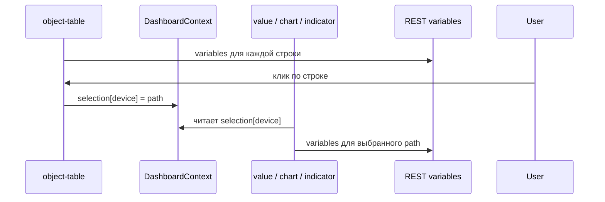

# Дашборды и виджеты

**Справочник всех виджетов** (назначение, настройки, примеры): **[WIDGETS.md](WIDGETS.md)**.

## Обзор

Дашборд — объект типа `DASHBOARD` с моделью `dashboard-v1`. Layout хранится в переменной `layout` (JSON string).

Переменные модели:

| Имя | Описание |
|-----|----------|
| `title` | Заголовок экрана |
| `layout` | JSON сетки виджетов |
| `refreshIntervalMs` | Интервал опроса (мс), по умолчанию 5000 |

Демо:

| Дашборд | Назначение |
|---------|------------|
| `root.platform.dashboards.demo-sensor` | один объект, статический `objectPath` |
| `root.platform.dashboards.snmp-host-monitoring` | таблица устройств + `selectionKey: "device"` |

Layout по умолчанию: `packages/ispf-server/.../DashboardLayouts.java`.

## Привязка к объектам: `objectPath` и `selectionKey`

Виджеты (`value`, `indicator`, `chart`, …) читают переменные **конкретного** объекта платформы (`DEVICE`, `CUSTOM`, …). Путь к этому объекту задаётся двумя способами.

### Откуда берётся `objectPath`

`objectPath` — **поле в JSON виджета** внутри переменной `layout` объекта `DASHBOARD`. Его не передаёт родительский React-компонент в runtime.

| Источник | Когда |
|----------|--------|
| Bootstrap | `DashboardLayouts.java` записывает layout при первом запуске |
| Dashboard Builder | админ выбирает объект в поле «Объект» (`WidgetEditorPanel`) → `PUT .../layout` |
| Ручное редактирование | правка JSON layout |

Пример статической привязки (один датчик):

```json
{
  "type": "value",
  "objectPath": "root.platform.devices.demo-sensor-01",
  "variableName": "temperature",
  "valueField": "value"
}
```

### Что такое `selectionKey`

`selectionKey` — **имя слота** в общем состоянии дашборда (`DashboardContext`), а не замена поля `objectPath`.

```typescript
selection: Record<string, string>
// { "device": "root.platform.devices.snmp-localhost" }
```

При отрисовке виджета путь вычисляется так (`resolveWidgetPath` в `dashboardUtils.ts`):

1. Если задан `selectionKey` **и** `selection[selectionKey]` не пуст → используется **выбранный путь**.
2. Иначе → используется **статический** `objectPath` из layout.
3. Если оба пусты → виджет показывает подсказку «Выберите …» / «—».

`objectPath` не «перезаписывается» ключом: ключ лишь указывает, из какого слота контекста взять путь, когда пользователь что-то выбрал.

### Publish / subscribe внутри дашборда

Связка **не** «виджет A → виджет B». Связка по **совпадению строки** `selectionKey`:

| Роль | Тип виджета | Поле | Действие |
|------|-------------|------|----------|
| **Источник выбора** | `object-table` | `selectionKey`, `parentPath` | при клике по строке: `setSelection(key, child.path)` |
| **Потребитель** | `value`, `indicator`, `chart`, `sparkline`, `progress`, `gauge`, `status-badge`, `function`, `function-form` | тот же `selectionKey` | читает `selection[key]` как `objectPath` |

Все виджеты с **одинаковым** `selectionKey` показывают данные **одного и того же** выбранного объекта — это нормально (детализация выбора).

Для **нескольких независимых выборов** на одном экране используйте **разные имена** слотов, например `"device"` и `"order"`.

### Пример: SNMP Host Monitoring

Дашборд `root.platform.dashboards.snmp-host-monitoring`:

```json
{
  "id": "device-table",
  "type": "object-table",
  "parentPath": "root.platform.devices",
  "selectionKey": "device",
  "columnsJson": "[{\"variable\":\"sysName\",\"label\":\"Имя хоста\"},{\"variable\":\"driverStatus\",\"label\":\"Драйвер\"}]"
}
```

Графики **net ↓ / net ↑** ссылаются на переменные объекта `ifInOctetsRate` / `ifOutOctetsRate` (B/s). Они вычисляются platform binding `counterRate(ifInOctets)` / `counterRate(ifOutOctets)` в модели `snmp-agent-v1` при каждом poll SNMP; сырые Counter32 остаются в `ifInOctets` / `ifOutOctets`. Подробнее: [BINDINGS.md](BINDINGS.md#counterrate).

```json
{
  "id": "hostname-value",
  "type": "value",
  "selectionKey": "device",
  "variableName": "sysName",
  "valueField": "value"
}
```

- Таблица загружает детей `parentPath`, в колонках — переменные **каждой** строки.
- Клик по строке публикует путь в `selection.device`.
- Виджеты с `selectionKey: "device"` опрашивают переменные **только выбранного** `DEVICE`.

Статический `objectPath` у потребителей в этом layout **не задан** — путь полностью из выбора.

### Откуда значения переменных (данные на экране)

Дашборд **не** опрашивает протоколы (SNMP, Modbus, …) напрямую.

```text
Драйвер (poll) → переменные DEVICE на сервере
       ↓
GET /api/v1/objects/by-path/variables?path=...
       ↓
Виджет: variableName + valueField → отображение
```

Для SNMP-устройства нужны: модель с переменными (`snmp-agent-v1`), запущенный драйвер и `driverPointMappingsJson`. Имена в `columnsJson` / `variableName` должны **совпадать** с именами переменных объекта.

Обновление UI: polling по `refreshIntervalMs` + WebSocket `/ws/objects` (`VARIABLE_UPDATED` инвалидирует кэш `variables`).

### Типичные ошибки конфигурации

| Ситуация | Результат |
|----------|-----------|
| Таблица `selectionKey: "device"`, виджет `selectionKey: "device"` | Работает |
| Таблица `"device"`, виджет `"order"` | Не связаны |
| Две таблицы с одним `selectionKey` | Один слот; побеждает последний клик |
| `selectionKey` без таблицы-источника | Пустой слот → fallback на `objectPath` или «—» |
| Заданы и `objectPath`, и `selectionKey` | При непустом выборе **приоритет у selection** |
| В колонке имя переменной не совпадает с моделью | Ячейка «—» |

В редакторе виджета: поле **«Ключ выбора (selectionKey)»** (`WidgetEditorPanel`). Пустая строка отключает привязку к контексту.

## Навигация между дашбордами

Виджеты могут открывать другой дашборд **переходом** (`navigate`) или **модальным окном** (`modal`).

| Механизм | type | Поля |
|----------|------|------|
| Кнопка | `dashboard-link` | `targetDashboardPath`, `openMode`, `buttonLabel`, `modalTitle` |
| Клик по строке таблицы | `object-table` | `rowTargetDashboard`, `rowOpenMode` (+ `selectionKey` для передачи выбора) |
| Клик по карточке | `card-grid` | `cardTargetDashboard`, `cardOpenMode`, `cardSelectionKey` |

Контекст выбора (`selectionKey`) **сохраняется** при переходе между дашбордами в operator mode — детализирующий дашборд может читать тот же ключ.

Пример: SNMP overview → клик по устройству в таблице → переход на detail-дашборд с `selectionKey: "device"`.

```json
{
  "type": "dashboard-link",
  "title": "Детали",
  "targetDashboardPath": "root.platform.dashboards.snmp-host-monitoring",
  "openMode": "modal",
  "buttonLabel": "Мониторинг SNMP",
  "modalTitle": "SNMP Host Monitoring"
}
```

В admin-консоли переход открывает дашборд в новой вкладке редактора; в operator mode — меняет активную вкладку приложения или показывает модальное окно поверх HMI.

### Схема потока данных



## Связанный выбор (`selectionKey`) — кратко

См. раздел **«Привязка к объектам»** выше. Исторический пример с нарядами: таблица + `progress` + `function-form` с `selectionKey: "order"`.

```json
{
  "columns": 12,
  "rowHeight": 72,
  "widgets": [
    {
      "id": "temp-value",
      "type": "value",
      "title": "Температура",
      "x": 0, "y": 0, "w": 3, "h": 2,
      "objectPath": "root.platform.devices.demo-sensor-01",
      "variableName": "temperature",
      "valueField": "value",
      "decimals": 1,
      "unit": "°C"
    }
  ]
}
```

- Сетка: 12 колонок, позиция `x,y`, размер `w,h` в единицах сетки
- `rowHeight` — высота строки в пикселях

## Grid Layout: форма function-form (Lab Task 6)

Пример сетки из пакета **Lab Training** — дашборд `root.platform.dashboards.lab-form-grid`. Один виджет `function-form` вызывает функцию `appendTableRow` на virtual lab device и добавляет строку в переменную `table`:

```json
{
  "columns": 12,
  "rowHeight": 72,
  "widgets": [
    {
      "id": "append-row",
      "type": "function-form",
      "title": "Append table row",
      "x": 0,
      "y": 0,
      "w": 6,
      "h": 4,
      "objectPath": "root.platform.devices.lab-userA-01",
      "functionName": "appendTableRow",
      "buttonLabel": "Append",
      "fieldsJson": "[{\"name\":\"int\",\"label\":\"Int\",\"type\":\"number\"},{\"name\":\"string\",\"label\":\"String\",\"type\":\"text\"}]"
    }
  ]
}
```

Поля `fieldsJson` соответствуют аргументам функции модели `virtual-lab-v1`. Размер `w:6` на сетке 12 колонок — половина ширины экрана; `h:4` задаёт высоту в строках сетки (`rowHeight` × 4 px).

Импорт готового layout: `POST /api/v1/platform/packages/import?packageId=lab-training` (см. [LAB_TRAINING.md](LAB_TRAINING.md)).

## Типы виджетов

Полный каталог с описанием каждого поля и примерами — **[WIDGETS.md](WIDGETS.md)**.

Краткий указатель:

| type | Описание | Документация |
|------|----------|--------------|
| `value`, `indicator`, `toggle` | Метрики и состояния | [§ value](WIDGETS.md#value--значение) |
| `chart`, `sparkline` | Тренды (historian) | [§ chart](WIDGETS.md#chart--график--тренд) |
| `gauge`, `linear-gauge`, `liquid-gauge`, `progress` | Шкалы и прогресс | [§ gauge](WIDGETS.md#gauge--радиальная-шкала) |
| `function`, `function-form`, `input-form` | Действия и формы | [§ function](WIDGETS.md#function--кнопка-вызова-функции) |
| `object-table`, `card-grid`, `map`, `object-tree` | Каталоги объектов | [§ object-table](WIDGETS.md#object-table--таблица-объектов) |
| `dashboard-link`, `sub-dashboard`, `nav-menu` | Навигация | [§ dashboard-link](WIDGETS.md#dashboard-link--переход-на-дашборд) |
| `report`, `event-feed`, `work-queue` | Отчёты, события, BPMN | [§ report](WIDGETS.md#report--sql-отчёт) |
| `spreadsheet` | Таблица с формулами | [WIDGETS.md § spreadsheet](WIDGETS.md#spreadsheet--электронная-таблица) + [SPREADSHEET_WIDGET.md](SPREADSHEET_WIDGET.md) |
| `panel`, `tab-panel`, `carousel`, … | Композиция экрана | [§ composition](WIDGETS.md#composition--композиция-экрана) |
| `label`, `image`, `html-snippet` | Оформление | [§ session/static](WIDGETS.md#session--static--оформление) |
| `mini-tec-sld` | SCADA mimic mini-TEC | [§ mini-tec-sld](WIDGETS.md#mini-tec-sld--однолинейная-схема-mini-tec) |

## Контекст дашборда (DashboardSession)

При открытии дашборда (navigate/modal) передаётся **атомарный** контекст:

- `selection` — `{ "device": "root...devices.snmp-01" }` для `selectionKey`
- `params` — произвольный JSON (`clusterPath`, …)

Поля layout:

| Поле | Назначение |
|------|------------|
| `rowSelectionKey` / `rowParamsJson` | object-table / card-grid / map при клике |
| `contextSelectionJson` / `contextParamsJson` | dashboard-link |
| `paramKey` / `contextPathKey` | чтение из session в виджете |
| `modelHintPath` | образец объекта для dropdown переменных в редакторе |

Operator URL: `?ctx.device=root.platform.devices.d1` или `?ctx={"selection":{"device":"..."}}`

Исходники типов: `apps/web-console/src/types/dashboard.ts`  
View-компоненты: `apps/web-console/src/components/dashboard/widgets/`  
Разрешение пути: `apps/web-console/src/components/dashboard/dashboardUtils.ts` (`resolveWidgetPath`), `hooks/useWidgetObjectPath.ts`

## function-form fieldsJson

```json
[
  {
    "name": "devicePath",
    "label": "Устройство",
    "type": "select",
    "optionsFrom": "root.platform.devices.demo-sensor-01",
    "defaultValue": "demo-sensor-01"
  },
  {
    "name": "threshold",
    "label": "Порог",
    "type": "number"
  }
]
```

## object-table columnsJson

Колонки ссылаются на **имя переменной** дочернего объекта (не OID и не поле драйвера). Значение для ячейки: поле `value` в `DataRecord` (см. `readFieldValue` в web-console).

```json
[
  { "variable": "sysName", "label": "Имя хоста" },
  { "variable": "driverStatus", "label": "Драйвер" },
  { "variable": "sysUpTime", "label": "Uptime" }
]
```

Для привязки таблицы к детализирующим виджетам задайте `selectionKey` (см. § «Привязка к объектам»).

## spreadsheet sheetConfigJson

Виджет **электронная таблица** — фиксированная сетка `rows × cols` с адресацией A1. Пересчёт на клиенте (встроенный `ispfSheetEval`).

## Электронная таблица (spreadsheet)

Виджет типа `spreadsheet` — HMI-таблица с формулами. Подходит для калькуляторов смен, сводок, простых расчётов на экране оператора без Excel.

**Lab:** `root.platform.dashboards.lab-calculator` (режим **configured**).  
**Подробно:** [SPREADSHEET_WIDGET.md](SPREADSHEET_WIDGET.md). Операторский сценарий: [OPERATOR_GUIDE.md](OPERATOR_GUIDE.md).

### Интерфейс на экране

```
┌─ Calculator ─────────────────────────────────────────┐
│ [Отменить][Повтор][Копир.][Вставить][CSV]  ← free   │
│  B2  │ =A2*1.1                          ← formula bar│
├──────┴───────────────────────────────────────────────┤
│    │  A  │  B  │  C  │  D  │                        │
│  1 │ A  │ B  │ Sum│ ... │                        │
│  2 │ 10 │5.5 │15.5│ 11  │  ← значения / результаты │
└──────────────────────────────────────────────────────┘
```

| Область | Описание |
|---------|----------|
| **Строка формул** | Слева — адрес (A1, B2…). Справа — сырое содержимое ячейки: число, текст или формула с `=`. |
| **Заголовки столбцов** | A, B, C… (как в Excel). |
| **Номера строк** | 1, 2, 3… слева от сетки. |
| **Панель инструментов** | Только в режиме **free**: undo/redo, copy/paste, выгрузка CSV. |
| **Фильтры столбцов** | Если заданы в layout — поля фильтра над таблицей (режим **configured**). |

Ячейки **binding** (live-данные с объекта) отображаются курсивом и **не редактируются**.

### Как пользоваться (оператор)

#### Режим «Свободная сетка» (`sheetMode: free`, по умолчанию)

Разработчик задаёт только размер сетки и опциональные начальные значения. **Формулы и данные вводит оператор** на экране.

1. **Выделить ячейку** — одиночный клик. Адрес и содержимое появятся в строке формул.
2. **Ввести значение** — двойной клик, **F2** или **Enter** (при уже выделенной ячейке):
   - число: `10`, `3.14`
   - текст: `OK`, `Смена 1`
   - формула: начинается с `=`, например `=A1+A2`, `=SUM(A1:A10)`, `=A2*1.1`
3. **Подтвердить** — **Enter** (переход на ячку ниже) или клик вне ячейки. В строке формул — **Enter** / **Tab** / потеря фокуса.
4. **Отменить ввод** — **Esc** (в ячейке или в строке формул).
5. **Перемещение** — **Tab** / **Shift+Tab**, стрелки ↑↓←→ (фокус должен быть на таблице: клик по сетке).
6. **Копирование** — выделить ячейку → **Ctrl+C** или кнопка «Копировать» → выделить цель → **Ctrl+V** или «Вставить».
7. **Экспорт** — кнопка **CSV** скачивает текущие **отображаемые** значения (результаты формул, не сырые `=...`).

Формулы пересчитываются сразу при изменении зависимых ячеек (как в Excel).

**Пример сценария:** в A1 ввести `100`, в B1 `=A1*0.2`, в C1 `=A1+B1` → C1 покажет `120`.

#### Режим «Настроенный шаблон» (`sheetMode: configured`)

Layout задаёт роли ячеек (`label`, `input`, `formula`, `binding`). Оператор редактирует только ячейки **`input`** (поля ввода в сетке). Формулы и подписи заданы разработчиком; строка формул **только для просмотра**.

1. Клик по полю ввода → изменить значение → **Tab** / **Enter** для перехода к следующему полю.
2. Ячейки **formula** обновляются автоматически.
3. Ячейки **binding** показывают live-значение переменной объекта.

**Lab-калькулятор:** измените A2 и B2 → пересчитаются Sum (C2), A×110% (D2) и итог по столбцу A (C4).

### Сохранение данных

| `persistMode` | Где хранится | Когда пропадает |
|---------------|--------------|-----------------|
| `session` (по умолчанию) | Параметры сессии дашборда (`sessionKey`, обычно `sheet:{widgetId}`) | При закрытии вкладки / сбросе session |
| `variable` | Переменная объекта (`valuesVariable`, RECORD_LIST `{cell, value}`) | Не пропадает при F5; общая для всех операторов этого объекта |

В режиме **free** в `value` сохраняются и формулы: `{ "cell": "B2", "value": "=A2*2" }`.

Автосохранение с небольшой задержкой (~400 ms) после редактирования. Если виджет с `editable: false` — таблица только для просмотра.

### Формулы

Поддерживается подмножество функций Excel через `ispfSheetEval`: `SUM`, `AVERAGE`, `IF`, `ROUND`, ссылки на ячейки (`A1`, `B2:B10`) и ISPF-функции.

**Функции платформы ISPF** (чтение данных объектов в формуле):

| Функция | Пример | Назначение |
|---------|--------|------------|
| `ISPREF` | `=ISPREF("root.platform.devices.lab-userA-01","intValue","value")` | Текущее значение переменной |
| `ISPSUM` | `=ISPSUM("ordersTable","int")` | Сумма столбца RECORD_LIST (по binding-ячейкам) |
| `ISPHIST` | `=ISPHIST("root...device","temperature",5)` | Значение из historian за последние N минут |

Ошибки формулы отображаются как `#ERROR` в ячейке.

### Настройка в Dashboard Builder

| Поле | Описание |
|------|----------|
| `sheetMode` | `free` — свободная сетка; `configured` — шаблон с `kind` |
| `sheetConfigJson` | JSON: `rows`, `cols`, `cells`, опционально `columnFilters`, `dataRegion`, `conditionalStyles` |
| `persistMode` | `session` \| `variable` |
| `valuesVariable` | Имя переменной при `persistMode: variable` (напр. `sheetValues`) |
| `sessionKey` | Ключ session (по умолчанию `sheet:{id}`) |
| `editable` | `false` — запрет редактирования на HMI |
| `objectPath` | Объект для variable persist и binding |

Кнопки шаблонов в редакторе: «Свободная сетка», «Базовая сетка», «Калькулятор».

### Режимы (`sheetMode`) — справочник

| Режим | Поведение |
|-------|-----------|
| `free` (по умолчанию) | **Свободная сетка** — оператор вводит значение или формулу `=...` в любую ячейку; formula bar редактируемая; F2 / двойной клик |
| `configured` | **Шаблон** — ячейки с `kind` в layout; редактируются только `input`; formula bar read-only |

В `free` режиме `cells` в `sheetConfigJson` — только **начальные seed**-значения (опционально) и `binding` для live-данных.

### configured: пример sheetConfigJson

```json
{
  "rows": 6,
  "cols": 4,
  "frozenRows": 1,
  "cells": {
    "A1": { "kind": "label", "text": "A" },
    "A2": { "kind": "input", "default": "10" },
    "B2": { "kind": "formula", "expr": "=A2*2" },
    "C2": { "kind": "formula", "expr": "=SUM(A2:A10)" },
    "D3": {
      "kind": "binding",
      "objectPath": "root.platform.devices.lab-userA-01",
      "variableName": "intValue",
      "valueField": "value"
    }
  },
  "columnFilters": [{ "column": "A" }]
}
```

| `kind` | Назначение |
|--------|------------|
| `label` | Статический заголовок |
| `input` | Ввод оператора |
| `formula` | Выражение `=SUM(A1:A10)` и т.п. |
| `readonly` | Только отображение |
| `binding` | Live-значение переменной объекта |

**Персистенция:** `persistMode: "session"` (ключ `sessionKey`, по умолчанию `sheet:{widgetId}`) или `"variable"` (`valuesVariable` — RECORD_LIST строк `[{cell, value}]`). В `free` режиме в `value` сохраняются и формулы (`"=A2*2"`).

**Функции платформы в формулах:** `ISPREF(path, var, [field])`, `ISPSUM(tableVar, column)`, `ISPHIST(path, var, [minutes])`.

**dataRegion** (опционально): блок строк из RECORD_LIST переменной — `variableName`, `startRow`, `startCol`, `columnFields`.

**conditionalStyles**: `[{ "when": "=B2>80", "style": { "backgroundColor": "#fee" } }]` — простые условия `>`, `<` для подсветки ячеек.

Lab demo: `root.platform.dashboards.lab-calculator` (`sheetMode: configured`), переменная `sheetValues` на lab device.

**Эталонный bundle:** [examples/spreadsheet-demo](../examples/spreadsheet-demo/) — модель `sheet-storage-v1`, устройство `root.platform.devices.sheet-demo-01`, два дашборда (session / variable persist).

Полный справочник полей `sheetConfigJson`, `dataRegion`, `conditionalStyles` — в [SPREADSHEET_WIDGET.md](SPREADSHEET_WIDGET.md).

## Стили элементов (`stylesJson`)

У любого виджета в layout можно задать поле **`stylesJson`** — JSON-объект со стилями отдельных частей карточки. Редактируется в Dashboard Builder (поле «Стили элементов») или вручную в layout.

### Ключи элементов

| Ключ | Элемент | Типы виджетов |
|------|---------|---------------|
| `card` | Корневая карточка | все |
| `title` | Заголовок | все |
| `body` | Основной контейнер | все |
| `value` | Значение / кнопка / текущее число | value, chart, sparkline, gauge, progress, function |
| `unit` | Единица измерения | value, progress |
| `meta` | Подпись внизу | value, gauge |
| `label` | Текст статуса | indicator |
| `dot` | Точка индикатора | indicator |
| `badge` | Badge статуса | status-badge |
| `table` | Таблица | object-table |
| `chart` | Область графика | chart, sparkline |

Значения — **camelCase CSS-свойства** (`fontSize`, `color`, `whiteSpace`, `overflowY`, `display`…). Неразрешённые свойства игнорируются.

### Пример: длинный текст в value

```json
{
  "value": {
    "fontSize": "0.82rem",
    "whiteSpace": "normal",
    "overflowY": "auto"
  },
  "meta": {
    "display": "none"
  }
}
```

В layout виджета:

```json
{
  "type": "value",
  "title": "Описание ОС",
  "variableName": "sysDescr",
  "selectionKey": "device",
  "stylesJson": "{\"value\":{\"fontSize\":\"0.82rem\",\"whiteSpace\":\"normal\",\"overflowY\":\"auto\"},\"meta\":{\"display\":\"none\"}}"
}
```

Стили из `stylesJson` **дополняют** классы по умолчанию (`dash-widget-metric`, `dash-widget-text`…), а не заменяют их. Для чисел по умолчанию — крупный шрифт; для строк — компактный; длинный текст — прокрутка внутри карточки.

Исходники: `widgetStyles.ts`, `DashWidgetShell.tsx`.

## Dashboard Builder (UI)

- **Режим просмотра** — live-данные, refresh по `refreshIntervalMs`
- **Режим редактирования** — drag-and-drop, resize, панель свойств виджета
- Сохранение: `PUT /api/v1/dashboards/by-path/layout`
- **Federated dashboards** (`root.platform.federation.*` или bind на `DASHBOARD`): сохранение layout/title проксируется на remote peer; пути виджетов в UI остаются локальными (см. [FEDERATION.md](FEDERATION.md#dashboard-write-через-proxy-bl-46))

Компоненты: `DashboardBuilder`, `DashboardGrid`, `WidgetEditorPanel`.

## Operator HMI

`?mode=operator&app=<appId>` — навигация по дашбордам из `operatorUi`, только просмотр layout (`DashboardBuilder` + `operatorMode`).  
Боковая панель: work queue + event journal.

Привязка дашборда: query param `dashboard` или вкладки в `OperatorDashboardApp` (см. `OperatorView.tsx`).

## API

```http
GET /api/v1/dashboards/by-path?path=root.platform.dashboards.demo-sensor
PUT /api/v1/dashboards/by-path/layout?path=...  (body: { "layoutJson": "..." })
PUT /api/v1/dashboards/by-path/title?path=...     (body: { "title": "..." })
```

Для federated path (`federationProxy=true`) те же `PUT` — сервер unremap'ит layout и пишет на remote.

## Стили

CSS виджетов: `apps/web-console/src/styles.css` (секция `dash-*`, `function-form-*`).
