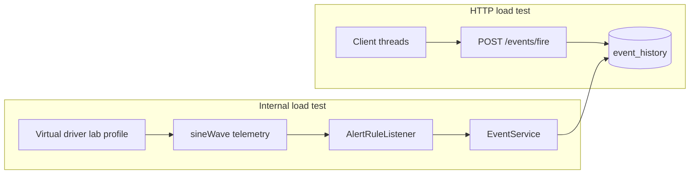

# Load testing ISPF automation

Нагрузочные сценарии для измерения пропускной способности **HTTP events API** и **внутреннего конвейера автоматизации** (driver → alert rule → event journal).

Baseline зафиксирован на prod VPS `ispf.iot-solutions.ru`, версия **0.9.8**, июнь 2026.

См. также [OBSERVABILITY.md](OBSERVABILITY.md) — Prometheus scrape и OTLP export.

## Два контура

| Контур | Скрипт | Что измеряет |
|--------|--------|--------------|
| **HTTP** | `deploy/events-load-test.py` | `POST /api/v1/events/fire` + `GET /api/v1/events` с клиента |
| **Internal** | `deploy/events-internal-load-test.py` | Virtual driver → `sineWave` → alert rule → `EventService.fire` → PostgreSQL journal |

Internal load test ближе к реальному SCADA/IoT: события рождаются на сервере, без HTTP на каждый fire.



## Подготовка окружения

### 1. Loadtest-устройства

```powershell
python deploy/vps-load-test.py --seed-only --devices 60
```

Создаёт `root.platform.devices.loadtest-dev-*` (шаблон `virtual-lab-v1`).

### 2. Мониторинг (probe + dashboard)

```powershell
python deploy/setup-platform-metrics-monitor.py --base-url https://ispf.iot-solutions.ru
```

- Probe: `root.platform.devices.platform-metrics-probe`
- Dashboard: `root.platform.dashboards.platform-metrics`
- Синхронизирует `GET /api/v1/platform/metrics` → переменные probe (events/s, alert fires/s, heap, DB pool, queue depth)

Для prod включите probe syncer на VPS или запускайте syncer из load-test скриптов (они делают это автоматически).

### 3. Platform metrics API

Admin-only: `GET /api/v1/platform/metrics` — секция `automation`:

| Поле | Смысл |
|------|--------|
| `eventHistoryRecords` | Размер журнала событий (PostgreSQL) |
| `alertFiresTotal` | Счётчик срабатываний alert rules (in-memory, platform-wide) |
| `objectChangeQueueSize` | Глубина async-очереди object-change bus |
| `eventJournalQueueSize` | Очередь async writer журнала |

Prometheus: `/actuator/prometheus` (admin role) — counters `ispf.events.fired.total`, `ispf.alert.fires.total`, gauges `ispf.object_change.queue.size{lane=telemetry|automation|total}`, `ispf.event_history.records`, `ispf.workflow_instances.running`, `ispf.variable_history.samples`, `ispf.drivers.active`, `ispf.database.connections.*`.

## HTTP load test

```powershell
python deploy/events-load-test.py `
  --base-url https://ispf.iot-solutions.ru `
  --concurrency 40 `
  --duration-seconds 60
```

**Baseline (0.9.5, 60 devices, concurrency 40):** ~147–164 RPS на `POST /events/fire`.

JUnit-аналог: `EventFireLoadTest` (150 concurrent HTTP).

## Internal load test

```powershell
# Максимальная пропускная способность (condition always true)
python deploy/events-internal-load-test.py --skip-monitor-setup --poll-ms 1000 --phase-seconds 60

# Реалистичное CEL-условие (без проблем с кавычками в PowerShell)
python deploy/events-internal-load-test.py `
  --skip-monitor-setup `
  --condition-expr-file deploy/loadtest-sinewave-condition.txt `
  --poll-ms 1000 `
  --phase-seconds 45 `
  --warmup-seconds 20
```

Файл `deploy/loadtest-sinewave-condition.txt`:

```cel
self.sineWave["value"] > -1000.0
```

### Параметры

| Флаг | Default | Описание |
|------|---------|----------|
| `--warmup-seconds` | 15 | Ожидание после configure driver (coalesce + async journal) |
| `--condition-expr` | `true` | CEL для alert rules |
| `--condition-expr-file` | — | Условие из файла |
| `--poll-ms` | `3000,1000,500` | Интервалы опроса virtual driver |
| `--max-devices` | 0 (all) | Лимит loadtest-устройств |

### Baseline (0.9.5, 60 devices, poll=1000ms)

| conditionExpr | Events/s | Alert fires/s |
|---------------|----------|---------------|
| `true` | ~20.7 | ~20.7 |
| `self.sineWave["value"] > -1000.0` | ~17.4 | ~17.6 |

Разница ~15% — coalescer пропускает неизменившиеся значения sine и задержка async journal (~10–15 s до стабильного delta).

### Важно для интерпретации

1. **Drivers** должны быть в RUNNING с `autoStart: true` (`PUT /api/v1/drivers/runtime/configure`).
2. **`alertFiresTotal`** — глобальный счётчик платформы; при параллельных тестах учитывайте фоновые алерты (mini-TEC и т.д.).
3. **`eventHistoryRecords`** — async write; используйте warmup перед измерением.
4. Dot-notation `self.sineWave.value` в CEL для alert rules ненадёжна; предпочитайте `self.sineWave["value"]` или binding → derived var → alert (как `demo-sensor-01` / `alarmActive`).

## Архитектура конвейера (кратко)

См. [ADR-0021 automation pipeline evolution](decisions/0021-automation-pipeline-evolution.md):

- **Sync:** bindings, WebSocket
- **Async bus (dual lane):** telemetry (historian) vs automation (alerts, workflows, correlators)
- **Coalesce:** `RuntimeTelemetryCoalescer` (1 s default) перед publish `ObjectChangeEvent`
- **Alert path:** `AlertRuleListener` → CEL → `EventService.fire` → `EventJournalAsyncWriter`

## Связанные документы

- [AUTOMATION.md](AUTOMATION.md) — события, alert rules, correlators
- [DEPLOYMENT.md](DEPLOYMENT.md) — VPS deploy, env vars
- [API.md](API.md) — `/api/v1/platform/metrics`
- [TESTING.md](TESTING.md) — JUnit / CI
