# Эволюция ISPF — ретроспективный backlog

Хронологический чеклист того, **что было сделано** за время существования платформы. Все пункты отмечены как выполненные — это не план, а **ретроспектива развития**.

**Baseline:** `main` → `0.9.41`.  
**Источники:** git history, [ROADMAP.md](ROADMAP.md), [PLATFORM_DEVELOPER_BACKLOG.md](PLATFORM_DEVELOPER_BACKLOG.md), релизные теги.

---

## Как читать документ

| Символ | Значение |
|--------|----------|
| `[x]` | Реализовано и в baseline `main` |
| `[~]` | Частично / in progress (см. [ROADMAP.md](ROADMAP.md)) |
| `[ ]` | Запланировано, ещё не закрыто |

Эволюция идёт **сверху вниз** — от фундамента к текущему состоянию.

---

## Вехи версий

| Версия | Смысл |
|--------|-------|
| **v0.1.x** | Первый runnable baseline: object tree, drivers, dashboards |
| **v0.2.0** | Phase 5 closure — declarative chains, models, bundle convergence |
| **v0.3.0** | Production readiness: federation, driver maturity, PF-09/11 |
| **v0.5.x** | Federation bind overlay, outbound tunnel |
| **v0.6.0** | Persistent binding state (`@bindingState`) |
| **v0.7.x** | AI Development Layer, tree-first agent, MCP, licensed drivers |
| **v0.8.0** | `@bindingRules` / BindingRuleEngine вместо legacy `bindingExpression` |
| **v0.8.27+** | Visual groups, mini-TEC, operator alarm bar |
| **v0.9.x** | Scale & observability: Redis, NATS, ClickHouse, automation pipeline, spreadsheet |
| **0.9.41** | Текущий baseline |

---

## 1. Зарождение — ядро и первая модель

- [x] **Initial commit** — монорепозиторий ISPF: `ispf-core`, `ispf-server`, `ispf-expression`, driver SPI
- [x] **Object tree** — иерархия `root.platform.*`, REST API, JPA-персистентность
- [x] **DataRecord + DataSchema** — типизированные переменные на объектах
- [x] **Google CEL** (`ispf-expression`) — вычисляемые привязки и alert rules
- [x] **DeviceDriver SPI** — первые протокольные драйверы (Modbus, SNMP, …)
- [x] **SNMP driver** + sequence correlator (паттерны автоматизации)
- [x] **Dashboard builder** — первый набор виджетов HMI
- [x] **BPMN workflow engine** — процессы, user tasks, work queue
- [x] **Web Console (React + Vite)** — Explorer, редакторы моделей и дашбордов
- [x] **WebSocket live-updates** — push изменений переменных в UI
- [x] **Полная документация** — ARCHITECTURE, API, OBJECT_MODEL, GETTING_STARTED
- [x] **Лицензия** — MIT → Apache 2.0 → позже AGPL-3.0 (см. §10)

---

## 2. Application Platform — REQ-PF

Поворот: решения живут **на платформе** через bundle deploy, а не в отраслевом Java сервера.

- [x] **REQ-PF спецификация** — [PLATFORM_DEVELOPER_BACKLOG.md](PLATFORM_DEVELOPER_BACKLOG.md), ADR [0001](decisions/0001-app-platform-boundary.md)
- [x] **Sprint A** — script runtime: `selectMany`, `setVar`, `when`/`if`, транзакции; изоляция app schema (PF-02)
- [x] **Sprint B** — bundle metadata, BFF wire profile `anima-operator-v1`, `cancel_workflows` (PF-06, PF-10)
- [x] **Sprint C** — manifest-driven operator shell через generic `POST /bff/invoke`
- [x] **Sprint C P2** — SQL bindings, function rollback, virtual simulator profiles (PF-08, PF-09)
- [x] **Sprint D** — bundle rollback, operator manifest API, terminal parity tests
- [x] **Application deploy API** — `POST /applications/{appId}/deploy`: migrations, functions, objects, dashboards, workflows, models
- [x] **Platform scheduler** — cron через `platform_schedules`, не `@Scheduled` в Java (PF-05)
- [x] **Script functions** — JSON steps + SQL, без custom `FunctionHandler` в `main` (PF-01)
- [x] **Reference apps** — `examples/demo-app`, `warehouse-app` (dogfooding gate [0002](decisions/0002-dogfooding-gate.md))

---

## 3. Admin UX и операторский слой

- [x] **Platform auth** — local token + роли admin/operator
- [x] **Security в дереве** — `root.platform.security`: users, roles
- [x] **Model editor** — blueprint variables/events/functions/bindings
- [x] **Application reports** — первый слой отчётности в app layer
- [x] **Device driver admin UI** — конфигурация драйверов из Explorer
- [x] **Object tree UX** — persist expansion/selection across tabs и refresh
- [x] **Tree icons** — визуальная семантика типов узлов
- [x] **Operator Apps** — `root.platform.operator-apps`, autostart per user
- [x] **Operator HMI shell** — manifest screens, dashboard navigation, skip admin on login
- [x] **Explorer create actions** — создание дочерних узлов из контекстного меню

---

## 4. Драйверы и интеграции

- [x] **Wave 1** — HTTP, ICMP, SSH, CoAP, SNMP v3
- [x] **Waves 2–4** — SCADA, IT, integration modules
- [x] **REQ-PF-14 closure** — **58 driverId** в каталоге (Modbus, OPC UA, MQTT, JDBC, BACnet, …)
- [x] **Driver maturity labels** — production / beta / stub
- [x] **DEVICE driver provisioning** — deploy driver config из bundle
- [x] **Widget stylesJson** — стилизация виджетов дашборда
- [x] **SNMP optional OIDs** + rate variables через platform bindings

---

## 5. Historian, автоматизация, системные типы

- [x] **Variable historian** — samples, export CSV/JSON, агрегации
- [x] **Historian widgets** — графики с историей на дашбордах
- [x] **Historian stages 6–8** — retention, batch write, dashboard integration
- [x] **Platform metrics** — `GET /api/v1/platform/metrics`, вкладка System в admin
- [x] **Automation → object tree** — alert rules и correlators как узлы дерева (не отдельная вкладка)
- [x] **Semantic ObjectType** — `PLATFORM`, `DEVICES`, `ALERT_RULES`, `CORRELATORS`, `APPLICATIONS`, …
- [x] **Drag-and-drop sortOrder** — порядок соседей на одном уровне дерева
- [x] **BPMN signal catch** — межпроцессные сигналы
- [x] **Object protections** — защита системных узлов от случайного удаления

---

## 6. Phase 0 — стабилизация и CI

- [x] **GitHub Actions CI** — server build + web-console build
- [x] **Gradle test memory limits** — стабильные integration tests
- [x] **PF-01c** — `map` / `buildRecord` в script runtime
- [x] **PF-03** — `models[]` в bundle deploy
- [x] **Leader locks** — singleton schedulers в multi-instance
- [x] **WebSocket auth** — token query param
- [x] **Reference app #2** — warehouse-app acceptance
- [x] **System folder list panels** — Explorer для системных каталогов

---

## 7. Production gate — Phase 2–4

- [x] **Keycloak / OIDC** — JWT resource server, login в Web Console
- [x] **Per-object ACL** — OWNER / EDITOR / VIEWER на поддеревьях
- [x] **TimescaleDB hypertables** — historian + retention policies (prod)
- [x] **NATS event bus** — события между репликами платформы
- [x] **Multi-tenant spike** — `root.tenant.*` namespaces
- [x] **Federation design** — peer registry, catalog sync, proxy read (objects, dashboards, history)
- [x] **React Router / deep links** — навигация admin без потери состояния
- [x] **Frontend vitest** — unit/smoke tests web-console

---

## 8. Platform baseline — Java 25 / Spring Boot 4

- [x] **Java 25 toolchain** + CI на Linux (`gradlew` wrapper fix)
- [x] **Spring Boot 4.0.7** migration
- [x] **Jackson 3 native** — `tools.jackson` stack
- [x] **PostgreSQL prod profile** — Flyway migrations, VPS setup scripts
- [x] **Remote deploy tooling** — bootstrap script, direct SCP staging, GitHub release checks
- [x] **Platform runtime bindings** — registry built-in transforms (`counterRate`, `scale`, `clamp`, …)
- [x] **Time-series / cross-object bindings** — rates, smoothing, remote refs без raw CEL
- [x] **Observability UI** — diagnostics, federation ops, API error polish

---

## 9. Phase 5–6 — усиление механизмов

North star: **больше declarative в object tree**, меньше custom Java.

- [x] **Модели** — `extendsModelId`, bulk upgrade API, vendor demo
- [x] **Функции** — расширенные script steps; declarative SQL bindings
- [x] **События + correlators** — EVENT_CHAIN, sequenceGapSeconds, N-in-window
- [x] **Workflow serviceTask** — `fire_event`, `read_variable`, `start_workflow`, …
- [x] **Bundle convergence** — bundle = упаковка дерева; tree-first invoke; reconcile `objects[]`
- [x] **v0.2.0 baseline** — Phase 5 acceptance tests
- [x] **v0.3.0 baseline** — federation production, PF-09 virtual profiles, PF-11 function rollback UI
- [x] **Driver maturity** — CWMP, flexible, gps-tracker → production

---

## 10. Federation и масштаб

- [x] **Phase 7** — federation auth refresh, 401 retry, service account lifecycle
- [x] **Outbound NAT tunnel** — edge WebSocket → public hub, full proxy
- [x] **Federation bind (PF-13c)** — overlay на local path, same-path remote, unbind restore
- [x] **Federation secrets-key UI** + tunnel reconnect hardening
- [x] **Federation binding** — remote variable refs в CEL/platform bindings
- [x] **Phase 10** — persistent `@bindingState` (hysteresis, deadband, movingAvg, counterRate)
- [x] **Object tree performance** — index, lazy load, scroll fix для large deployments
- [x] **Scale 1000 devices** — lazy tree, runtime telemetry, indexed listeners, DB pool tuning

---

## 11. Collaboration и отчёты — Phase 11–14

- [x] **Multi-user collaboration** — object revision (If-Match), config audit, stale editor UI
- [x] **WS presence** + subtree leases + model merge preview
- [x] **Change-sets** — preview/apply promotion pipeline ([COLLABORATION.md](COLLABORATION.md))
- [x] **Reports tree-first (Phase 12)** — `report-v1` model, Report Builder, `/api/v1/reports/by-path`
- [x] **YARG export (Phase 13)** — PDF/XLSX/HTML, template upload, widget PDF button
- [x] **Platform catalogs (Phase 14)** — data-sources, schedules, bindings, migrations в дереве
- [x] **Package import** — `POST /platform/packages/import`
- [x] **Script functions on tree** — `FunctionDescriptor.sourceBody`
- [x] **Dashboard report widget** + operatorUi `reports[]`

---

## 12. Lab training и виджеты — Phase 15

- [x] **Virtual driver profile `lab`** + model `virtual-lab-v1`
- [x] **Automation v2** — alert `delaySeconds`/`sustainWhileTrue`, correlator `payloadFilterExpr`, `SET_VARIABLE`, `OPEN_OPERATOR_REPORT`
- [x] **Report type `tree-variables`** — cross-device RECORD_LIST
- [x] **Новые виджеты** — pie-chart, history-table, variable-editor, svg-widget, composite-widget
- [x] **Importable bundle** — `examples/lab-training/` + lab users/ACL bootstrap
- [x] **Docs + integration tests** — [LAB_TRAINING.md](LAB_TRAINING.md)

---

## 13. Platform evolution REQ-FW — Phase 16

- [x] **ADR process** — `docs/decisions/` (18 ADR)
- [x] **Gap registry** — [GAP_REGISTRY.md](GAP_REGISTRY.md) для sprint planning
- [x] **Commercial licensing** — RSA keys, `installationId`, LicenseBuilder ([COMMERCIAL_LICENSING.md](COMMERCIAL_LICENSING.md))
- [x] **MES reference** — walkthrough + synthetic demo ([REFERENCE_MES_WALKTHROUGH.md](REFERENCE_MES_WALKTHROUGH.md))
- [x] **Solution public API** — boundary doc + event catalog в bundle
- [x] **Messaging contract** — event bus vs sync RPC ([MESSAGING.md](MESSAGING.md))
- [x] **Bundle `requires[]`** — dependency manifest для commercial bundles

---

## 14. AI Development Layer

- [x] **LlmProvider SPI** — OpenAI-compatible, local/VPS Qwen
- [x] **ContextPack** — briefing platform knowledge для LLM
- [x] **ToolRegistry** — validate/deploy tools
- [x] **AI Studio UI** — Cursor-like chat, persistent sessions
- [x] **Tree-first agent (FW-44)** — multi-turn sessions, live steps, cancel
- [x] **Agent tools FW-45–48** — knowledge, invoke/search, discovery, automation (alert/correlator/bindings)
- [x] **MCP adapter (ADR 0006)** — agent tools over MCP protocol
- [x] **Licensed driver JAR packs (FW-50)** — pilot pack, [LICENSED_DRIVER_PACKS.md](LICENSED_DRIVER_PACKS.md)
- [x] **Mobile explorer** + roadmap backend (v0.7.7–0.7.13)

---

## 15. Schema cleanup и HMI polish — Phase 17–19

- [x] **v0.8.0** — `@bindingRules` / BindingRuleEngine; Flyway drop legacy `binding_expr`
- [x] **Dashboard session context** — sub-dashboard, expanded widget palette, fullscreen editor
- [x] **Visual groups (ADR 0012)** — typed model catalogs (ADR 0011)
- [x] **MapLibre** — замена Leaflet; platform SQL object editors
- [x] **mini-TEC reference** — operator HMI, SLD widget, platform bootstrap ([REFERENCE_MINI_TEC_WALKTHROUGH.md](REFERENCE_MINI_TEC_WALKTHROUGH.md))
- [x] **YARG + lab reports** — agent report tools
- [x] **Operator alarm bar** (v0.8.27)
- [x] **Web Console i18n (Phase 19)** — en/ru/de/zh, LocaleSwitcher, `npm run i18n:check` ([0013](decisions/0013-web-console-i18n.md))
- [x] **Platform schedules UI** + system catalog i18n

---

## 16. Scale, observability, event journal — v0.9.x

- [x] **Performance hardening (0.9.2–0.9.3)** — server + web-console; optional Redis cache
- [x] **Ordered object-change event bus** — dual-lane automation pipeline ([0014](decisions/0014-automation-pipeline-evolution.md))
- [x] **Automation indexes + async journal** — throughput ~22 events/s prod baseline (0.9.9)
- [x] **Prometheus gauges** — automation pipeline metrics (0.9.6)
- [x] **NATS JetStream fan-out** — optional replica fan-out (0.9.7)
- [x] **Redis correlator sliding windows** — window store abstraction (0.9.8)
- [x] **OpenTelemetry** — OTLP metrics (0.9.9) + tracing handlers (0.9.10)
- [x] **Elastic worker pool** — object-change bus (0.9.11)
- [x] **System runtime settings UI** — ISPF env vars в admin (0.9.12)
- [x] **TimescaleDB event journal hypertable** — P3a (0.9.18, [0015](decisions/0015-event-history-timescale.md))
- [x] **ClickHouse event journal SPI** — P3b high-throughput (0.9.19+, [0016](decisions/0016-clickhouse-event-journal.md))
- [x] **MQTT meter-bus ingest** — historian path, coalesce sweeps
- [x] **AGPL-3.0** — platform license; all drivers as optional packs ([0016-agpl](decisions/0016-agpl-dual-licensing.md))
- [x] **Load testing tooling** — [LOAD_TESTING.md](LOAD_TESTING.md), VPS reports

---

## 17. Spreadsheet, audit, code audit sprint — BL

- [x] **Spreadsheet widget** — XLSX import, multi-sheet, ISPF formula engine, Yandex import
- [x] **Binding/function invoke audit** — unified journal UI
- [x] **Sprint BL-A** — correlator actions UI, workflow refs, schema editor, event catalog viewer
- [x] **Sprint BL-B** — change sets UI, edit leases, chart trim, history range
- [x] **Binding catalog + autocomplete** — 18 platform functions (BL-09)
- [x] **Network-graph widget** — Cytoscape layout (BL-10)
- [x] **System integration toggles** — Redis/NATS/ClickHouse/AI/MCP (BL-13, BL-14)
- [x] **Journal export/diff** — CSV/JSON export, before/after diff (BL-15, BL-16)
- [x] **Binding rule activators** — onEvent, periodicMs editor + runtime (BL-18)
- [x] **Alert/correlator catalog list** — Explorer list view (BL-17)
- [x] **Compile-on-save Java functions** — object tree nodes
- [x] **Driver writes** — Modbus, S7, OPC UA, BACnet, IEC104, DNP3, DLMS + runtime write API
- [x] **Chart widgets** — range, candlestick, bubble, radar
- [x] **Wave D tail** — notifications, federation sync, backup, driver polish
- [x] **Responsive operator shell** — mobile sidebar drawer
- [x] **Operator AI copilot** — scoped reports, memory, interactive clarifications
- [x] **MES demos** — defect demo, OGP events reference

---

## 18. Текущее состояние (baseline 0.9.41)

### Архитектурная эволюция (упрощённо)

```mermaid
flowchart LR
  subgraph v01["v0.1 — Core"]
    OT[Object Tree]
    DRV[Drivers]
    HMI[Dashboards]
  end
  subgraph v02["v0.2–0.3 — REQ-PF + Phase 5"]
    APP[Bundle Deploy]
    WF[BPMN + Script]
  end
  subgraph v05["v0.5–0.6 — Federation"]
    FED[Federation + Bind]
    BS[BindingState]
  end
  subgraph v07["v0.7 — AI"]
    AG[Tree-first Agent]
    MCP[MCP Adapter]
  end
  subgraph v09["v0.9 — Scale"]
    CH[ClickHouse Journal]
    AP[Automation Pipeline]
    SS[Spreadsheet HMI]
  end
  v01 --> v02 --> v05 --> v07 --> v09
```

### Что есть сейчас

- [x] **58 device drivers** (optional packs, AGPL platform)
- [x] **14+ dashboard widget types** + spreadsheet + network-graph + charts
- [x] **Full admin + operator HMI** — Explorer, System, AI Studio, i18n (4 языка)
- [x] **Production profiles** — PostgreSQL/TimescaleDB, Redis, NATS, ClickHouse (optional)
- [x] **Federation** — peers, tunnel, bind overlay, proxy read
- [x] **Collaboration** — revision, presence, leases, change-sets
- [x] **AI agent** — platform tools, MCP, operator copilot
- [x] **Reference solutions** — demo-app, warehouse, MES, lab-training, mini-tec, spreadsheet-demo

### Ещё в работе

- [~] **Playwright e2e smoke** — partial baseline (Phase 18.1, BL-50)
- [~] **Driver stub promotion** — demand-driven (Phase 18.2)
- [~] **ClickHouse variable history** — settings UI done, backend query planned (BL-40)
- [~] **Haystack/Brick semantic layer** — deferred (BL-56…62)
- [ ] **CWMP driver write** — BL-29

Подробный актуальный план: [ROADMAP.md](ROADMAP.md), [CODE_AUDIT_BACKLOG.md](CODE_AUDIT_BACKLOG.md).

---

## 19. Принципы, которые не менялись

Эти решения прошли через всю эволюцию:

- [x] **North star** — бизнес-логика в механизмах object tree, не в отраслевом Java ([ARCHITECTURE.md](ARCHITECTURE.md))
- [x] **Dogfooding gate** — каждый REQ-PF рождается из потребности app-команды ([0002](decisions/0002-dogfooding-gate.md))
- [x] **Tree-first** — alert rules, correlators, reports, schedules, security — узлы дерева
- [x] **Bundle = упаковка** — deploy доставляет конфигурацию в платформу, не отдельный runtime
- [x] **Generic platform / industry solution** — разделение `main` vs `examples/*`

---

## Связанные документы

| Документ | Назначение |
|----------|------------|
| [ROADMAP.md](ROADMAP.md) | Фазы 0–20, статус по темам |
| [PLATFORM_DEVELOPER_BACKLOG.md](PLATFORM_DEVELOPER_BACKLOG.md) | REQ-PF / REQ-FW спецификация |
| [GAP_REGISTRY.md](GAP_REGISTRY.md) | Живой реестр пробелов |
| [CODE_AUDIT_BACKLOG.md](CODE_AUDIT_BACKLOG.md) | BL-01…65 sprint items |
| [docs/decisions/](decisions/README.md) | ADR — ключевые архитектурные развилки |
| [PRODUCT.md](PRODUCT.md) | Обзор продукта для заказчика |

---

*Документ обновляется при крупных релизах. Последняя синхронизация с `main`: версия **0.9.41**.*
