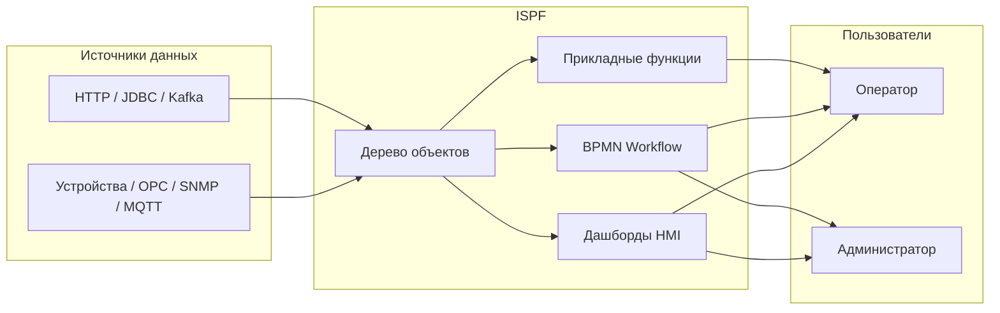
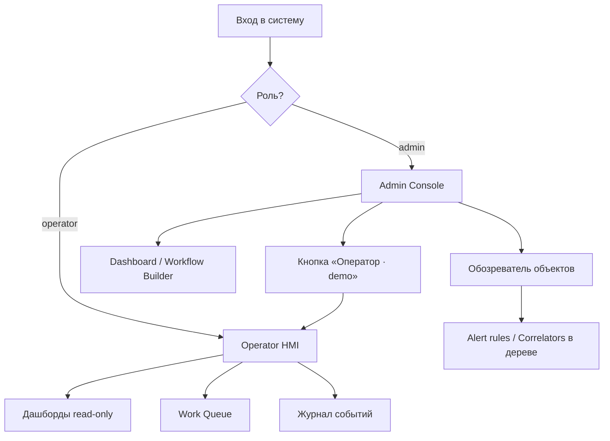

# ISPF — документация по продукту

**IoT Solutions Platform Framework (ISPF)** — middleware-платформа для IoT, SCADA и промышленной автоматизации. Единая модель данных, HMI, автоматизация и слой прикладных решений без отраслевого Java в ядре.

Этот документ — **точка входа для всех ролей**. Технические детали реализации — в остальных разделах [docs/README.md](README.md).

---

## Для кого этот продукт

| Роль | Задачи | С чего начать |
|------|--------|---------------|
| **Оператор** | Мониторинг, управление, work queue, отчёты | [Руководство оператора](OPERATOR_GUIDE.md) |
| **Администратор** | Дерево объектов, дашборды, workflow, пользователи | [Быстрый старт](GETTING_STARTED.md) → [Web Console](WEB_CONSOLE.md) |
| **Разработчик решения** | Deploy приложений, функции, operator UI, отчёты | [Руководство разработчика решений](SOLUTION_DEVELOPER_GUIDE.md) |
| **Разработчик платформы** | Драйверы, REQ-PF, расширение ядра | [Backlog платформы](PLATFORM_DEVELOPER_BACKLOG.md) |
| **DevOps / SRE** | Развёртывание, профили, инфраструктура | [Развёртывание](DEPLOYMENT.md) |

---

## Что решает ISPF

Типичная SCADA/MES-система разрастается отдельными модулями: OPC-сервер, historian, HMI, workflow, отчёты. ISPF объединяет их вокруг **одного дерева объектов** с единым API и UI.



### Ключевые преимущества

- **Единая модель** — устройство, дашборд, workflow и приложение — узлы одного дерева с типизированными переменными и событиями.
- **Расширяемость без форка ядра** — отраслевые решения деплоятся как bundle (SQL, JSON-функции, отчёты, operator UI).
- **Cloud-native стек** — Spring Boot 3.4, PostgreSQL/TimescaleDB, React 19, REST + WebSocket, опционально NATS/MQTT/Keycloak.
- **58 встроенных драйверов** — от Modbus и OPC UA до SNMP, Kafka и JDBC ([каталог](DRIVERS.md)).
- **Apache 2.0 ядро** — коммерческие отраслевые bundle — отдельно ([PLUGINS.md](PLUGINS.md)).

---

## Возможности продукта

### 1. Дерево объектов

Центральная абстракция платформы. Каждый узел имеет путь (`root.platform.devices.pump-01`), тип, переменные, события и функции.

| Тип узла | Назначение |
|----------|------------|
| `PLATFORM`, `DEVICES`, `DASHBOARDS`, … | Системные каталоги (`root.platform.*`) |
| `DEVICE` | Физическое или виртуальное устройство с драйвером |
| `DASHBOARD` | HMI-экран (layout JSON + виджеты) |
| `WORKFLOW` | BPMN-процесс автоматизации |
| `ALERT` / `CORRELATOR` | Правила автоматизации (узлы в дереве) |
| `MODEL` | Шаблон (blueprint) для создания объектов |
| `APPLICATION` | Зарегистрированное deploy-приложение |
| `USER` / `ROLE` | Пользователи и роли (зеркало security API) |
| `CUSTOM` | Произвольный контейнер (fallback) |

Подробнее: [OBJECT_MODEL.md](OBJECT_MODEL.md), [GLOSSARY.md](GLOSSARY.md).

### 2. Модели (шаблоны)

`ModelDefinition` описывает набор переменных, событий, функций и CEL-привязок. Новый датчик создаётся из модели `mqtt-sensor-v1` за секунды.

Подробнее: [MODELS.md](MODELS.md).

### 3. Драйверы устройств

SPI `DeviceDriver` подключает протоколы к переменным объекта. Администратор настраивает `driverId`, конфигурацию и маппинг точек; runtime опрашивает устройство и пишет значения в дерево.

Демо после первого запуска:

| Объект | Драйвер | Назначение |
|--------|---------|------------|
| `demo-sensor-01` | virtual | Синусоида температуры + alarm binding |
| `snmp-localhost` | snmp | SNMP-агент localhost |

Подробнее: [DRIVERS.md](DRIVERS.md).

### 4. Дашборды и HMI

Dashboard Builder (админ) и Operator HMI (read-only) используют одни и те же виджеты:

| Категория | Виджеты |
|-----------|---------|
| Значения | `value`, `indicator`, `sparkline`, `chart`, `gauge` |
| Таблицы | `object-table`, `card-grid`, `work-queue` |
| Навигация | `dashboard-link` (переход между экранами) |
| Прочее | `text`, `iframe`, `image`, `event-log`, `function-button` |

Связь виджетов с данными — через `objectPath` (статический) или `selectionKey` (динамический выбор строки таблицы).

Подробнее: [DASHBOARDS.md](DASHBOARDS.md).

### 5. Workflow (BPMN)

Визуальный редактор BPMN в Web Console. Поддерживаются service tasks (в т.ч. вызов прикладных функций), user tasks (очередь оператора), шлюзы с CEL-условиями, параллельные ветки, сигналы и NATS.

Подробнее: [WORKFLOWS.md](WORKFLOWS.md).

### 6. Автоматизация

- **События** — типизированные уведомления с объектов; журнал + WebSocket.
- **Alert rules** — CEL-условие на переменную → автоматический fire события. Узлы `ALERT` в `root.platform.alert-rules`.
- **Event correlators** — цепочка событий → запуск workflow. Узлы `CORRELATOR` в `root.platform.correlators`.

Подробнее: [AUTOMATION.md](AUTOMATION.md).

### 7. Прикладные решения (Application Platform)

Слой REQ-PF позволяет разворачивать отраслевые приложения **без изменения Java ядра**:

| Этап | API |
|------|-----|
| Регистрация | `POST /applications` |
| Миграции SQL | `POST /applications/{id}/data/migrate` |
| Функции (JSON script) | `POST /applications/{id}/functions/deploy` |
| Bundle deploy | `POST /applications/{id}/deploy` |
| BFF для UI | `POST /bff/invoke` |
| Расписания | `GET/POST /schedules` |
| SQL-отчёты | `GET /applications/{id}/reports/{name}` |

Подробнее: [APPLICATIONS.md](APPLICATIONS.md), [REPORTS.md](REPORTS.md).

### 8. Operator UI

Operator shell — полноэкранный HMI для операторов:

```
http://localhost:5173?mode=operator&app=<appId>
```

Конфигурация operator UI хранится на сервере (`operator_app_ui`) и редактируется в админке → `root.platform.operator-apps`. Приоритет загрузки:

1. `GET /api/v1/operator-apps/{appId}/ui`
2. `GET /api/v1/applications/{appId}/operator-ui` (из bundle)
3. Legacy fallback `public/operator-apps/{appId}.ui.json`

Подробнее: [OPERATOR_GUIDE.md](OPERATOR_GUIDE.md), [WEB_CONSOLE.md](WEB_CONSOLE.md).

### 9. Безопасность

Две роли: **admin** (полный доступ) и **operator** (просмотр, функции, work queue). Профиль `local` — Bearer-токен после login; профиль `dev`/prod — OAuth2 JWT через Keycloak.

Подробнее: [SECURITY.md](SECURITY.md).

---

## Режимы Web Console



| Режим | URL | Кто видит |
|-------|-----|-----------|
| Admin | `http://localhost:5173` | admin (по умолчанию) |
| Operator HMI | `?mode=operator` | operator; admin по ссылке |
| Operator app | `?mode=operator&app=platform` | конкретное приложение |
| Admin явно | `?mode=admin` | admin даже с autostart |

---

## Типовые сценарии

### Сценарий 1: Мониторинг датчика

1. Администратор открывает `devices.demo-sensor-01` — видит температуру, порог, alarm.
2. Дважды кликает `dashboards.demo-sensor` — редактирует HMI.
3. Оператор открывает `?mode=operator` — видит тот же дашборд без редактирования.
4. При превышении порога срабатывает alert rule → событие в журнале → опционально workflow.

### Сценарий 2: Обработка заявки оператором

1. BPMN workflow содержит **user task** «Подтвердить действие».
2. Задача попадает в **Work Queue** в operator sidebar.
3. Оператор нажимает **Claim** → выполняет → **Complete**.
4. Workflow продолжается (service task, gateway, …).

### Сценарий 3: Развёртывание отраслевого приложения

1. Разработчик регистрирует app (`POST /applications`).
2. Деплоит SQL-миграции и JSON-функции.
3. Загружает bundle с `operatorUi` и отчётами.
4. Администратор создаёт operator app в дереве → настраивает дашборды.
5. Операторы работают через `?mode=operator&app=my-terminal`.

Подробный walkthrough: [SOLUTION_DEVELOPER_GUIDE.md](SOLUTION_DEVELOPER_GUIDE.md).

---

## Быстрый старт (5 минут)

```bash
# 1. API (H2 + local auth)
./gradlew :packages:ispf-server:bootRun --args="--spring.profiles.active=local"

# 2. Web Console
cd apps/web-console && npm install && npm run dev
```

| URL | Назначение |
|-----|------------|
| http://localhost:5173 | Admin console (login: `admin` / `admin`) |
| http://localhost:5173?mode=operator | Operator HMI |
| http://localhost:8080/api/v1/info | Версия платформы |
| http://localhost:8080/actuator/health | Health check |

Полная инструкция: [GETTING_STARTED.md](GETTING_STARTED.md).

---

## Архитектура (кратко)

```
Web Console (React)  ←→  REST / WebSocket  ←→  ispf-server (Spring Boot)
                                                      │
                    ObjectManager │ WorkflowService │ DriverRuntime
                    ApplicationPlatform │ EventService │ AlertRules
                                                      │
                    PostgreSQL/H2 │ Flyway │ NATS* │ MQTT*
```

Детали: [ARCHITECTURE.md](ARCHITECTURE.md).

---

## API

Базовый URL: `http://localhost:8080/api/v1`

| Группа | Примеры |
|--------|---------|
| Объекты | `GET /objects`, `PUT /objects/by-path/{path}/variables/{name}` |
| Дашборды | `GET /dashboards/by-path/{path}/layout` |
| Workflow | `POST /workflows/by-path/{path}/run` |
| Приложения | `POST /applications/{id}/deploy` |
| Operator apps | `GET /operator-apps/{id}/ui` |
| Драйверы | `POST /drivers/runtime/start?devicePath=...` |
| События | `GET /events`, `POST /events/fire` |

Полный справочник: [API.md](API.md).

---

## Лицензия и границы

| Компонент | Лицензия |
|-----------|----------|
| Ядро ISPF (`main`) | Apache 2.0 |
| Коммерческие плагины и app bundle | Отдельная лицензия, вне `main` |

Подробнее: [LICENSE.md](LICENSE.md), [PLUGINS.md](PLUGINS.md).

---

## Карта документации

### Продуктовая документация

| Документ | Описание |
|----------|----------|
| **PRODUCT.md** (этот файл) | Обзор продукта, возможности, сценарии |
| [OPERATOR_GUIDE.md](OPERATOR_GUIDE.md) | Работа оператора с HMI |
| [SOLUTION_DEVELOPER_GUIDE.md](SOLUTION_DEVELOPER_GUIDE.md) | Создание прикладных решений |
| [GLOSSARY.md](GLOSSARY.md) | Термины и определения |

### Техническая документация

| Документ | Описание |
|----------|----------|
| [GETTING_STARTED.md](GETTING_STARTED.md) | Установка и первый запуск |
| [OBJECT_MODEL.md](OBJECT_MODEL.md) | Дерево, переменные, CEL |
| [DASHBOARDS.md](DASHBOARDS.md) | Виджеты и layout |
| [WORKFLOWS.md](WORKFLOWS.md) | BPMN-движок |
| [APPLICATIONS.md](APPLICATIONS.md) | REQ-PF deploy API |
| [DRIVERS.md](DRIVERS.md) | Каталог драйверов |
| [SECURITY.md](SECURITY.md) | RBAC и auth |
| [DEPLOYMENT.md](DEPLOYMENT.md) | Production |

Полный индекс: [README.md](README.md).
