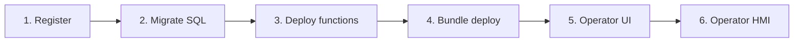

# Руководство разработчика решений

Как создать прикладное решение на ISPF **без изменения Java ядра**: регистрация приложения, SQL-данные, JSON-функции, bundle deploy, operator UI и отчёты.

Обзор продукта: [PRODUCT.md](PRODUCT.md). Полный API: [APPLICATIONS.md](APPLICATIONS.md).

---

## Основной принцип

**Бизнес-логика живёт на платформе** — в моделях, переменных, событиях, функциях и workflow **дерева объектов**. Ваше решение не добавляет Java в server: оно наполняет механизмы ISPF declarative-конфигурацией (модели, BPMN, script-функции, объекты, alert rules). Bundle deploy — способ **доставить** эту конфигурацию в платформу. См. [ARCHITECTURE.md](ARCHITECTURE.md#основной-принцип-бизнес-логика-в-механизмах-платформы).

## Что такое «решение» на ISPF

**Решение (application)** — зарегистрированный app с изолированной SQL-схемой, script-функциями, bundle (объекты, dashboards, BPMN, модели) и operator UI. Логика решения **исполняется** на узлах object tree и через platform runtime; запись `applications` — реестр и app schema, не параллельный движок.

| Концепция | Где живёт | Пример |
|-----------|-----------|--------|
| **Бизнес-логика** | Механизмы object tree | модель, переменная + CEL, `WORKFLOW`, `ALERT`, script-функция |
| **Platform object** | Дерево объектов | `root.platform.devices.pump-01` |
| **Application** | Реестр + schema `app_myapp` | `my-terminal` |
| **Operator app** | `operator_app_ui` + дерево `operator-apps` | `platform`, `oil-terminal` |

**Tree-first convergence (Phase 5.5):** после `POST .../deploy` функции адресуются как `{appId}.functions.{name}` на object path; SQL bindings могут жить как `bindingExpression: sqlBinding('appId','var')` на переменной; `objects[]` в bundle обновляет существующие узлы (reconcile), а не только создаёт новые.

> **Не используйте application layer как runtime.** Запись `applications` — реестр и изолированная SQL-schema; invoke, workflow, alerts и dashboards работают через **object tree API**. Если bundle ещё вызывает только `/applications/{appId}/functions/invoke` без tree paths — мигрируйте на tree-first (см. [APPLICATIONS.md § Deprecation path](APPLICATIONS.md#deprecation-path-pf-03-phase-55)).

### Миграция legacy bundle на tree-first

| Было (legacy) | Стало (north star) |
|---------------|-------------------|
| Только `POST .../functions/invoke` по appId | `POST /bff/invoke` или `objects/by-path/functions/invoke` по `{appId}.functions.*` |
| `screens[]` в operator manifest | `operatorUi` + dashboards в `dashboards[]` / дереве |
| Новые `objects[]` только create | Reconcile: повторный deploy обновляет существующие узлы |
| Imperative sync Java → variables | CEL bindings, `sqlBinding()`, script steps |

---

## Жизненный цикл решения



### Шаг 1. Регистрация

```http
POST /api/v1/applications
Authorization: Bearer <admin-token>
Content-Type: application/json

{
  "appId": "my-terminal",
  "displayName": "Oil Terminal",
  "tablePrefix": "ot_",
  "schemaName": "oil_terminal"
}
```

Или через admin console: выберите `root.platform.applications` → **+ Deploy-приложение**.

### Шаг 2. SQL-миграции

SQL приложения **не** попадает в Flyway платформы. Миграции деплоятся в изолированную schema:

```http
POST /api/v1/applications/my-terminal/data/migrate
Content-Type: application/json

{
  "version": "1.0.0",
  "scripts": [
    {
      "id": "orders",
      "sql": "CREATE TABLE IF NOT EXISTS ot_order (id SERIAL PRIMARY KEY, status VARCHAR(32), created_at TIMESTAMPTZ DEFAULT NOW());"
    }
  ]
}
```

Повторный вызов с тем же `version` + `id` — идемпотентен.

Проверка статуса:

```http
GET /api/v1/applications/my-terminal/data/status
```

### Шаг 3. JSON-функции

Функции — JSON **script** с шагами (`selectOne`, `selectMany`, `update`, `insert`, `return`):

```http
POST /api/v1/applications/my-terminal/functions/deploy
Content-Type: application/json

{
  "functions": [
    {
      "name": "listOrders",
      "description": "Active orders",
      "script": {
        "steps": [
          {
            "type": "selectMany",
            "sql": "SELECT id, status FROM ot_order WHERE status = 'ACTIVE' ORDER BY created_at",
            "into": "rows"
          },
          { "type": "return", "value": "{{rows}}" }
        ]
      }
    }
  ]
}
```

Вызов из BPMN (service task `INVOKE_FUNCTION`) или через BFF.

### Шаг 4. Bundle deploy

Bundle — ZIP с manifest, функциями, SQL, operator UI:

```http
POST /api/v1/applications/my-terminal/deploy
Content-Type: multipart/form-data

file: my-terminal-bundle.zip
```

Manifest (`manifest.yaml`):

```yaml
appId: my-terminal
version: 1.0.0
displayName: Oil Terminal
tablePrefix: ot_
schemaName: oil_terminal
functions:
  - path: functions/listOrders.script.json
migrations:
  - path: sql/V1__orders.sql
operatorUi:
  title: Oil Terminal
  dashboards:
    - path: root.platform.dashboards.terminal-overview
      label: Overview
reports:
  - name: daily-summary
    sql: SELECT status, COUNT(*) FROM ot_order GROUP BY status
```

### Шаг 5. Operator UI

Operator UI определяет, какие дашборды видит оператор и как они организованы.

**Способ A — через API operator-apps (рекомендуется):**

```http
PUT /api/v1/operator-apps/my-terminal/ui
Content-Type: application/json

{
  "title": "Oil Terminal",
  "dashboards": [
    {
      "dashboardPath": "root.platform.dashboards.terminal-overview",
      "label": "Overview"
    },
    {
      "dashboardPath": "root.platform.dashboards.terminal-queue",
      "label": "Queue"
    }
  ],
  "defaultDashboardPath": "root.platform.dashboards.terminal-overview"
}
```

**Способ B — через admin console:**

1. `root.platform.operator-apps` → **+ Operator app**
2. Откройте созданный узел → панель Operator Apps Panel
3. Настройте title, список дашбордов, default dashboard

**Способ C — в bundle** (`operatorUi` в manifest) — подхватывается при deploy.

### Шаг 6. Проверка

```
http://localhost:5173?mode=operator&app=my-terminal
```

---

## Дашборды для решения

Дашборды — **объекты платформы** типа `DASHBOARD`. Создайте их в admin console:

1. `root.platform.dashboards` → **+ Объект**
2. Дважды кликните → Dashboard Builder
3. Добавьте виджеты, привяжите к объектам (`objectPath`) или таблицам (`selectionKey`)
4. Укажите путь дашборда в operator UI

Виджеты для прикладных экранов:

| Виджет | Применение |
|--------|------------|
| `object-table` | Список заказов/устройств с выбором строки |
| `function-button` | Вызов platform function или app function |
| `dashboard-link` | Навигация между экранами |
| `card-grid` | Карточки с KPI |

Подробнее: [DASHBOARDS.md](DASHBOARDS.md).

---

## BFF (Backend-for-Frontend)

Для сложных экранов (таблицы с пагинацией, формы) используйте BFF:

```http
POST /api/v1/bff/invoke
Content-Type: application/json

{
  "appId": "my-terminal",
  "function": "listOrders",
  "params": {}
}
```

Wire profile `anima-operator-v1` — стандартный контракт для legacy manifest shell. Для новых решений предпочтительны **дашборды + function-button** вместо custom manifest.

---

## SQL-отчёты

```http
GET /api/v1/applications/my-terminal/reports/daily-summary?format=csv
```

Отчёт описан в bundle (`reports[]`) или деплоится отдельно. Экспорт — CSV.

Подробнее: [REPORTS.md](REPORTS.md).

---

## Расписания

Периодический вызов функций:

```http
POST /api/v1/schedules
Content-Type: application/json

{
  "name": "nightly-cleanup",
  "cron": "0 0 2 * * *",
  "appId": "my-terminal",
  "function": "archiveOrders",
  "enabled": true
}
```

---

## Интеграция с BPMN

Service task с `ispf:actionType="INVOKE_FUNCTION"`:

```xml
<bpmn:serviceTask id="Task_ListOrders" name="List orders"
  ispf:actionType="INVOKE_FUNCTION"
  ispf:functionAppId="my-terminal"
  ispf:functionName="listOrders"
  ispf:resultVariable="orders"/>
```

User task → задача в Work Queue для оператора.

Подробнее: [WORKFLOWS.md](WORKFLOWS.md).

---

## Структура примера

```
examples/demo-app/
├── manifest.yaml
├── functions/
│   └── demo_listItems.script.json
└── sql/
    └── V1__demo.sql
```

Запуск demo: зарегистрируйте app, выполните migrate + deploy functions по [APPLICATIONS.md](APPLICATIONS.md).

---

## Ограничения и best practices

| Правило | Почему |
|---------|--------|
| SQL только в schema приложения | Изоляция от platform tables |
| Префикс таблиц (`tablePrefix`) | Guard от коллизий |
| Не менять Java `ispf-server` | Отраслевой код — в bundle |
| Дашборды — platform objects | Единый HMI для admin и operator |
| Operator UI на сервере | Не хранить конфиг в `public/` |
| Функции — идемпотентные миграции | Безопасный redeploy |

---

## Чеклист перед production

- [ ] App зарегистрирован, schema создана
- [ ] Миграции применены (`GET .../data/status`)
- [ ] Функции задеплоены и протестированы через BFF
- [ ] Дашборды созданы и привязаны в operator UI
- [ ] Operator app доступен по `?mode=operator&app=<id>`
- [ ] RBAC: операторы имеют роль `operator`, не `admin`
- [ ] Keycloak настроен (профиль `dev`/prod)

---

## Связанные документы

- [APPLICATIONS.md](APPLICATIONS.md) — полный REQ-PF API
- [REPORTS.md](REPORTS.md) — SQL reports
- [DASHBOARDS.md](DASHBOARDS.md) — виджеты
- [WEB_CONSOLE.md](WEB_CONSOLE.md) — admin UI для настройки
- [GLOSSARY.md](GLOSSARY.md) — термины
- [PLATFORM_DEVELOPER_BACKLOG.md](PLATFORM_DEVELOPER_BACKLOG.md) — статус REQ-PF
