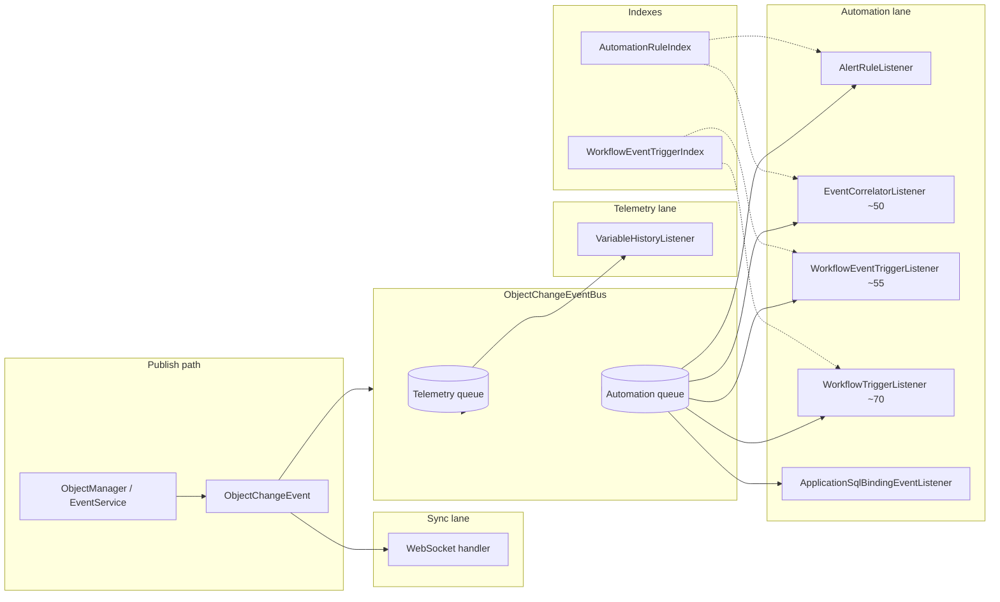

# ADR-0020: Automation pipeline evolution

## Status

Accepted (2026-06-25)

## Context

ISPF reacts to object changes (variable updates, fired events) through a growing set of listeners: alert rules, event correlators, workflow triggers, SQL bindings, variable history, and WebSocket fan-out. As device count and event rate increase, a linear scan of workflow/correlator definitions per event becomes costly, and telemetry writes can starve automation handlers on a shared async queue.

## Decision

Evolve the automation pipeline in layers:

1. **Dual-lane object-change bus** — when `ispf.object-change.split-lanes-enabled=true`, route high-volume telemetry handlers (`VariableHistoryListener`, lane `TELEMETRY`) on a separate queue/worker pool from automation handlers (lane `AUTOMATION`). Telemetry updates may still be coalesced per `(path, variable)`.
2. **Async journal** — `ObjectChangeEventBus` decouples publishers from heavy handlers; queue overflow falls back to synchronous dispatch on the publisher thread with a warning.
3. **In-memory indexes** — automation rules and workflow triggers are indexed at startup and rebuilt on configuration changes:
   - `AutomationRuleIndex` — alert rules by `(objectPath, watchVariable)`, correlators by `eventName`
   - `WorkflowEventTriggerIndex` — ACTIVE workflows by `(objectPath, eventName)` and `(objectPath, variableName)` parsed from `triggerJson`
4. **Workflow event triggers** — extend `triggerJson` with `{"triggerType":"event","objectPath":"...","eventName":"..."}` alongside legacy variable triggers; `WorkflowEventTriggerListener` (async handler order ~55) starts matching workflows on `EVENT_FIRED`.
5. **Metrics** — Micrometer gauges on queue depth and processed event count (`ispf.object_change.*`); extend per-lane metrics as split-lane bus lands fully.
6. **Future transport** — JetStream (NATS) or Redis Streams as optional durable fan-out for cross-node automation; current in-process bus remains the default for single-node deployments.

## Pipeline diagram

## triggerJson schema

| triggerType | Required fields | Optional |
|-------------|-----------------|----------|
| *(legacy / variable)* | `objectPath`, `variableName` | `expectedValue`, `valueField` |
| `variable` | `objectPath`, `variableName` | `expectedValue`, `valueField` |
| `event` | `objectPath`, `eventName` | — |

Legacy objects without `triggerType` but with `variableName` continue to work as variable triggers.

## Consequences

- Workflow and correlator lookup is O(1) by key instead of scanning all definitions.
- Event-triggered workflows can start without an intermediate correlator or alert rule.
- Index rebuild is required after workflow `triggerJson` / `status` changes (`WorkflowTriggerIndexListener`, `WorkflowService.updateStatus`).
- Split-lane bus and external journal (JetStream/Redis) are incremental; ADR documents direction without mandating immediate migration.
- Event journal Timescale tier — [ADR-0022](0022-event-history-timescale.md) (P3a); optional ClickHouse backend — future P3b.

## Related

- [AutomationRuleIndex](../../packages/ispf-server/src/main/java/com/ispf/server/automation/AutomationRuleIndex.java)
- [WorkflowEventTriggerIndex](../../packages/ispf-server/src/main/java/com/ispf/server/workflow/WorkflowEventTriggerIndex.java)
- [ObjectChangeEventBus](../../packages/ispf-server/src/main/java/com/ispf/server/object/bus/ObjectChangeEventBus.java)
