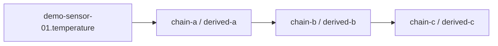
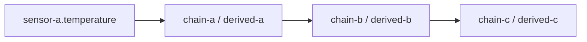

> **Language:** Canonical English. Russian edition: [ru/analytics-historian-cookbook.md](../ru/analytics-historian-cookbook.md).

# Historian computations cookbook

Recipes for **historian binding rules** (`kind: historian` in `@bindingRules`). Each rule is one analytics tag with its own output variable, schedule, and expression.

See [0041-multi-tag-historian-computations](decisions/0041-multi-tag-historian-computations.md) and [analytics-tag-catalog](analytics-tag-catalog.md).

**Formula catalog (PI AF–style):** unified catalog, extension packs, and site formulas — [0042-analytics-function-catalog](decisions/0042-analytics-function-catalog.md) (BL-212–216). Use the expression editor catalog for insert/apply; manage saved formulas under **System → Analytics formulas**.

**Full guide (Tier A/B/C, APIs, marketplace packs):** [analytics-formulas-and-packs](analytics-formulas-and-packs.md).

---

## Mental model

| Concept | Value |
|---------|--------|
| Storage | `@bindingRules` on the **target device** (same JSON array as reactive rules) |
| Kind | `"historian"` — skipped by `BindingRuleEngine`, compiled by analytics engine |
| Tag path | `objectPath/tag/ruleId` (e.g. `root.devices.sensor-a/tag/avg-temp-5m`) |
| Live output | `target.variableName` on that device (any name — not fixed to `derivedValue`) |
| Metadata | `@historianRuleMeta` — quality and last eval **per rule id** (see below) |
| Reactive vs historian | Reactive = immediate CEL on change; historian = windowed aggregates / DAG |

---

## Rule shape

```json
{
  "id": "avg-temp-5m",
  "name": "Rolling average 5m",
  "enabled": true,
  "order": 10,
  "kind": "historian",
  "activators": {
    "onStartup": false,
    "onVariableChange": [
      { "ref": "root.platform.devices.sensor-a/temperature" }
    ],
    "onEventRef": null,
    "periodicMs": 60000
  },
  "condition": "",
  "expression": "avg(root.platform.devices.sensor-a/temperature, 5m)",
  "windowBucket": "5m",
  "target": { "kind": "variable", "variableName": "avgTemp5m", "field": "value" }
}
```

### Expression forms

| Form | Example | Helper |
|------|---------|--------|
| Aggregate | `avg(root.../temperature, 5m)` | `avg` |
| Aggregate | `rateOfChange(root.../level, 1h)` | `rateOfChange` |
| Builtin | `oee('path', 'avail', 'perf', 'qual', 8h)` | `oee` |
| CEL composite | `(avg(root.../sensor-a/temperature, 5m) + avg(root.../sensor-b/temperature, 5m)) / 2.0` | `cel` |
| Live | `live(@/temperature)` | `live` |

Use **double literals** in CEL (`2.0`, not `2`) when mixing with historian expansions.

### Custom formulas (summary)

| Goal | Mechanism | Doc |
|------|-----------|-----|
| Reusable template (`{{path}}`, `{{window}}`) | Tier B — **Save as formula** or **System → Analytics formulas** | [§ Tier B](analytics-formulas-and-packs.md#tier-b--user-defined-formulas) |
| New aggregate primitive | Tier C — Java SPI pack; commercial packs via **marketplace** | [§ Tier C](analytics-formulas-and-packs.md#tier-c--extension-packs-java-spi) |

Compose with `avg(ref, window)` / `live(ref)`, save as Tier B, or ship Tier C.

---

## Save rules (REST)

```http
GET  /api/v1/objects/by-path/binding-rules?path={devicePath}
PUT  /api/v1/objects/by-path/binding-rules?path={devicePath}
```

Body: JSON array of rules (reactive + historian). Historian rules auto-create the target variable if missing.

**Web console:** Object inspector → **Computations** → **+ Rule** → type **Historian** → modal expression editor (**Validate** / **Apply**). Built-in helpers (`avg`, `live`, …) appear in the editor catalog.

---

## Built-in presets (server / editor catalog)

Static recipes in code (`HistorianComputationPresets`). **Not** object-tree templates and **not** toolbar buttons on the Computations tab — only hints in the modal expression editor function catalog and in API/cookbook.

| Preset id | Output (default) | Expression template |
|-----------|------------------|---------------------|
| `rollingAvg` | `avgValue` | `avg({objectPath}/{sourceVariable}, {windowBucket})` |
| `rateOfChange` | `rocValue` | `rateOfChange({objectPath}/{sourceVariable}, {windowBucket})` |
| `oee` | `oeePct` | `oee('{sourcePath}', '{availabilityVariable}', …, '{windowBucket}')` |
| `customCel` | `computedValue` | user CEL with `avg(ref, window)` |

---

## Recipe 1 — Rolling average on one sensor {#recipe-rolling-avg}

**Goal:** 5-minute average of `temperature` on `sensor-a`, written to `avgTemp5m`.

```json
{
  "id": "avg-temp-5m",
  "kind": "historian",
  "enabled": true,
  "order": 10,
  "activators": {
    "onStartup": false,
    "onVariableChange": [
      { "ref": "root.platform.devices.sensor-a/temperature" }
    ],
    "onEventRef": null,
    "periodicMs": 60000
  },
  "condition": "",
  "expression": "avg(root.platform.devices.sensor-a/temperature, 5m)",
  "windowBucket": "5m",
  "target": { "kind": "variable", "variableName": "avgTemp5m", "field": "value" }
}
```

**Catalog tag path:** `root.platform.devices.sensor-a/tag/avg-temp-5m`

**Chart widget:** object path = device, variable = `avgTemp5m`, mode = live or history as needed.

**Prerequisite:** `temperature` has `historyEnabled=true` and samples in historian.

---

## Recipe: rate of change {#recipe-rate-of-change}

Builtin `rateOfChange(path.var, window)` — delta between first and last bucket average over the window.

```json
"expression": "rateOfChange(root.platform.devices.sensor-a.temperature, 1h)",
"windowBucket": "1h"
```

---

## Recipe: window min {#recipe-min}

Builtin `min(path.var, window)` — minimum bucket `min` over the window.

```json
"expression": "min(root.platform.devices.sensor-a.temperature, 1h)",
"windowBucket": "1h"
```

---

## Recipe: window max {#recipe-max}

Builtin `max(path.var, window)` — maximum bucket `max` over the window.

```json
"expression": "max(root.platform.devices.sensor-a.temperature, 1h)",
"windowBucket": "1h"
```

---

## Recipe: totalizer {#recipe-totalizer}

Builtin `totalizer(path.var, window)` — sum of bucket averages × sample count over the window.

```json
"expression": "totalizer(root.platform.devices.sensor-a.flow, 1h)",
"windowBucket": "1h"
```

---

## Recipe: last sample {#recipe-last}

Builtin `last(path.var, window)` — most recent historian sample (24h lookback), else live value.

```json
"expression": "last(root.platform.devices.sensor-a.temperature, 1h)",
"windowBucket": "1h"
```

---

## Recipe 2 — OEE composite (A × P × Q)

**Goal:** Shift-level OEE on a line device from three historian-backed KPI variables.

Assume device `root.platform.devices.line-01` already has live/historian variables:

- `availabilityPct` (0–100)
- `performancePct` (0–100)
- `qualityPct` (0–100)

```json
{
  "id": "shift-oee",
  "kind": "historian",
  "enabled": true,
  "order": 20,
  "activators": {
    "onStartup": false,
    "onVariableChange": [
      { "ref": "root.platform.devices.line-01/availabilityPct" },
      { "ref": "root.platform.devices.line-01/performancePct" },
      { "ref": "root.platform.devices.line-01/qualityPct" }
    ],
    "onEvent": null,
    "periodicMs": 300000
  },
  "condition": "",
  "expression": "oee('root.platform.devices.line-01', 'availabilityPct', 'performancePct', 'qualityPct', '8h')",
  "windowBucket": "8h",
  "target": { "kind": "variable", "variableName": "oeePct", "field": "value" }
}
```

**Formula:** `oeePct = (A/100) × (P/100) × (Q/100) × 100` over the last historian buckets in `windowBucket`.

**MES integration:** seed A/P/Q from MES OEE reference bundle or BFF; bind alarms/dashboards to `oeePct` like any other variable.

**Tag path:** `root.platform.devices.line-01/tag/shift-oee`

---

## Recipe 3 — Tag chain (three-level KPI pipeline)

**Goal:** Rolling average of a raw sensor → smooth again → threshold input for a downstream KPI.

Pattern used in `AnalyticsEngineIntegrationTest`:



### Step A — first hop (raw → derived-a)

Device: `root.platform.devices.analytics-chain-a`

```json
{
  "id": "analytics-chain-a-rule",
  "kind": "historian",
  "enabled": true,
  "order": 10,
  "activators": {
    "onStartup": false,
    "onVariableChange": [
      { "ref": "root.platform.devices.demo-sensor-01/temperature" }
    ],
    "onEvent": null,
    "periodicMs": 60000
  },
  "condition": "",
  "expression": "avg(root.platform.devices.demo-sensor-01/temperature, 1h)",
  "windowBucket": "1h",
  "target": { "kind": "variable", "variableName": "derived-a", "field": "value" }
}
```

Tag: `root.platform.devices.analytics-chain-a/tag/analytics-chain-a-rule`

### Step B — second hop (derived-a → derived-b)

Device: `root.platform.devices.analytics-chain-b`

```json
{
  "id": "analytics-chain-b-rule",
  "kind": "historian",
  "expression": "avg(root.platform.devices.analytics-chain-a/derived-a, 1h)",
  "windowBucket": "1h",
  "target": { "kind": "variable", "variableName": "derived-b", "field": "value" }
}
```

(Add the same `kind`, `activators`, `enabled` fields as step A; trigger on `analytics-chain-a.derived-a`.)

Each hop is a separate device; rule ids are unique within that device's `@bindingRules`.

> **Test fixture names:** `analytics-chain-a` / `demo-sensor-01`. **On prod:** `root.platform.devices.analytics-demo.chain-a` and `sensor-a` — see [Recipe 5](#recipe-5--full-production-example-analytics-demo).

### Step C — third hop

Device: `root.platform.devices.analytics-chain-c` — source `analytics-chain-b.derived-b` → `derived-c`.

**DAG:** analytics engine topologically sorts tags; upstream quality `disabled` / `error` propagates as `uncertain` to downstream catalog entries.

**Inspect chain:**

```http
GET /api/v1/platform/analytics/tags/by-path?path=root.platform.devices.analytics-chain-c/tag/analytics-chain-c-rule
```

Response includes `upstreamTagPaths`, `downstreamTagPaths`, and `lineage` graph.

---

## Recipe 4 — Cross-device CEL composite {#recipe-cel}

**Goal:** Average temperature of two sensors on a third **virtual** device.

Device: `root.platform.devices.analytics-demo.sensor-c`

```json
{
  "id": "avg-ab-5m",
  "kind": "historian",
  "enabled": true,
  "order": 10,
  "activators": {
    "onStartup": false,
    "onVariableChange": [
      { "ref": "root.platform.devices.analytics-demo.sensor-a/temperature" },
      { "ref": "root.platform.devices.analytics-demo.sensor-b/temperature" }
    ],
    "onEvent": null,
    "periodicMs": 60000
  },
  "condition": "",
  "expression": "(avg(root.platform.devices.analytics-demo.sensor-a/temperature, 5m) + avg(root.platform.devices.analytics-demo.sensor-b/temperature, 5m)) / 2.0",
  "windowBucket": "5m",
  "target": { "kind": "variable", "variableName": "temperature", "field": "value" }
}
```

**Validate before save:**

```http
POST /api/v1/platform/analytics/expression/validate
{ "expression": "...", "objectPath": "root.platform.devices.analytics-demo.sensor-c" }
```

---

## `@historianRuleMeta` — purpose and misuse

Each device with historian rules has system variable `@historianRuleMeta` — a JSON object **keyed by rule id**:

```json
{
  "chain-a-rule": {
    "quality": "ok",
    "lastEvalAt": "2026-07-09T15:19:14.477Z",
    "lastEvalStatus": "ok"
  }
}
```

| Field | Meaning |
|-------|---------|
| `quality` | `ok`, `uncertain`, `error`, `disabled` — catalog + downstream propagation |
| `lastEvalAt` | Last analytics engine evaluation time |
| `lastEvalStatus` | `ok`, `error`, `skipped` |

**Do not** use `@historianRuleMeta` as an expression source. Sources are PlatformRef addresses (`root.../temperature`, `root.../derived-a`, …). Metadata is for diagnostics and catalog quality only.

---

## Recipe 5 — full production example: `analytics-demo`

Reference deployment on ${ISPF_BASE_URL:-https://ispf.example.invalid} (scripts in repo). Demonstrates ADR-0041 chain + dashboard + multi-tag query.

### Object tree

| Path | Type | Role |
|------|------|------|
| `root.platform.devices.analytics-demo` | CUSTOM | Example folder |
| `…analytics-demo.sensor-a` | DEVICE | Virtual sensor (`virtual-lab-v1`, `temperature`) |
| `…analytics-demo.chain-a` | DEVICE | Rule `chain-a-rule` → `derived-a` |
| `…analytics-demo.chain-b` | DEVICE | Rule `chain-b-rule` → `derived-b` |
| `…analytics-demo.chain-c` | DEVICE | Rule `chain-c-rule` → `derived-c` |
| `root.platform.dashboards.analytics-demo` | DASHBOARD | Chain widgets |

### Chain diagram



Each hop is a separate device with its own `@bindingRules` entry, window **5m**:

```text
avg(root.platform.devices.analytics-demo.sensor-a/temperature, 5m)  → derived-a
avg(root.platform.devices.analytics-demo.chain-a/derived-a, 5m)   → derived-b
avg(root.platform.devices.analytics-demo.chain-b/derived-b, 5m)     → derived-c
```

CEL equivalent: `avg(root.platform.devices.analytics-demo.chain-a/derived-a, 5m)`.

### Catalog tag paths

- `…chain-a/tag/chain-a-rule`
- `…chain-b/tag/chain-b-rule` (upstream: chain-a)
- `…chain-c/tag/chain-c-rule` (upstream: chain-b)

Check: `GET /api/v1/platform/analytics/tags?path=root.platform.devices.analytics-demo`

### Historian prerequisites

| Variable | `historyEnabled` | Why |
|----------|------------------|-----|
| `sensor-a/temperature` | yes | Raw series for `avg` and charts |
| `chain-a.derived-a` | yes | After rule save (variable auto-created) |
| `chain-b.derived-b` | yes | same |
| `chain-c.derived-c` | yes | same |

Enable historian on outputs **after** rules create the variables — otherwise PATCH history returns «Unknown variable».

### Deploy scripts

From repo root:

```powershell
python deploy/local/tools/setup-historian-chain-example.py ${ISPF_BASE_URL:-https://ispf.example.invalid}
python deploy/local/tools/setup-historian-chain-dashboard.py ${ISPF_BASE_URL:-https://ispf.example.invalid}
```

Default credentials: `admin` / `admin` (lab/prod only where configured).

### Dashboard `analytics-demo`

| Widget | Binding |
|--------|---------|
| 4× **value** | live `temperature`, `derived-a`, `derived-b`, `derived-c` |
| **chart** (multi-tag) | `analyticsQueryTagsJson`, `chartStyle: line`, `historyRange: 6h` |
| 2× **chart** (area) | raw `temperature` and final `derived-c`, `historyRange: live` |

Sample `analyticsQueryTagsJson`:

```json
[
  {"path": "root.platform.devices.analytics-demo.sensor-a", "variable": "temperature", "field": "value", "label": "raw"},
  {"path": "root.platform.devices.analytics-demo.chain-a", "variable": "derived-a", "field": "value", "label": "chain-a"},
  {"path": "root.platform.devices.analytics-demo.chain-b", "variable": "derived-b", "field": "value", "label": "chain-b"},
  {"path": "root.platform.devices.analytics-demo.chain-c", "variable": "derived-c", "field": "value", "label": "chain-c"}
]
```

Uses `POST /api/v1/platform/analytics/query` (BL-206). Refresh ≥ ~30 s (rate limiter).

**Why multi-tag chart may show one line at first:** the API returns all series, but `derived-*` historian rows are sparse until rules run and `historyEnabled` is on. With a coarse bucket (`1h` over `6h`), derived series often have a single non-null bucket — with `connectNulls: false` the line is nearly invisible. **Mitigation:** wait for history accumulation (`periodicMs: 60000`), enable historian on all outputs, use per-variable chart widgets for debugging, or shorter window / `5m` bucket.

---

## Implementation checklist (ADR-0040 / ADR-0041)

| Planned item | Status | Notes |
|--------------|--------|-------|
| `kind: historian` in `@bindingRules` | Done | `BindingRuleKind`, REST |
| Multiple rules / variable names per DEVICE | Done | e.g. `derived-a`, `derived-b` |
| Tag path `objectPath/tag/ruleId` | Done | Catalog, lineage, DAG |
| Unified **Computations** tab | Done | `ObjectComputationsPanel` |
| Reactive engine skips historian | Done | `BindingRuleEngine` |
| Analytics engine evaluates historian | Done | `AnalyticsEngineService` |
| `@historianRuleMeta` per rule id | Done | Not an expression source |
| Remove `ANALYTICS_TEMPLATE` bootstrap | Done | New configs use binding rules only |
| Presets in code, not tree / toolbar | Done | Editor catalog only |
| Modal expression editor | Done | `BindingExpressionEditorModal` |
| Historian vs CEL validation | Done | UI + `/analytics/expression/validate` |
| Operator ACL on binding-rules save | Done | Read roles can PUT |
| Lowercase JSON `kind: "historian"` | Done | Jackson `@JsonCreator` |
| Multi-tag charts | Done | `analyticsQueryTagsJson` |
| Prod reference (`analytics-demo`) | Done | deploy/tools scripts |
| OEE / cross-device CEL on prod | Documented only | Recipes 2 & 4 |
| `/templates/*` API | Deprecated | Kept for compatibility |
| Multi-line chart on sparse derived history | UX gap | Data in API; UI improves as history grows |

---

## Catalog API

| Method | Path | Description |
|--------|------|-------------|
| GET | `/api/v1/platform/analytics/tags?path=` | List tags (optional prefix) |
| GET | `/api/v1/platform/analytics/tags/by-path?path=` | One tag; `path` = `objectPath/tag/ruleId` or device path (first tag) |
| POST | `/api/v1/platform/analytics/tags/backfill?path=&from=&to=` | Recompute historian window |
| POST | `/api/v1/platform/analytics/expression/validate` | CEL + historian aggregate validation |
| POST | `/api/v1/platform/analytics/expression/evaluate` | One-shot evaluate |
| POST | `/api/v1/platform/analytics/query` | Multi-tag aligned historian query (charts) |

---

## Dashboard binding

- **Live value:** chart/value widget → device path + **output variable name** from the rule (`derived-a`, not `derivedValue`).
- **Single historian series:** chart/sparkline → `ref` or `objectPath` + `variableName` + `historyRange`.
- **Multiple series:** chart with `chartStyle: line` + `analyticsQueryTagsJson` → `POST /api/v1/platform/analytics/query`.
- Reference: [Recipe 5](#recipe-5--full-production-example-analytics-demo), dashboard `root.platform.dashboards.analytics-demo`.
- Do **not** reference `root.platform.analytics.*` or `analyticsTemplateId` — removed per ADR-0041.

---

## Deprecated: `ANALYTICS_TEMPLATE` workflow

Pre-0041 flow (`root.platform.analytics.rollingAvg` → **Apply template** → fixed `derivedValue`) is **deprecated**:

- No bootstrap of `root.platform.analytics.*` for new installs
- `/api/v1/platform/analytics/templates/*` kept temporarily; prefer binding rules
- [reference-asset-analytics](reference-asset-analytics.md) describes legacy BL-160; use this cookbook for new work

---

## Related

- [bindings](bindings.md) — reactive rules + `kind` field
- [0040-unified-computations-ui](decisions/0040-unified-computations-ui.md) — Computations tab
- [0041-multi-tag-historian-computations](decisions/0041-multi-tag-historian-computations.md) — binding-rule model
- [examples/analytics-rolling-avg/README.md](../../examples/analytics-rolling-avg/README.md) — updated walkthrough
