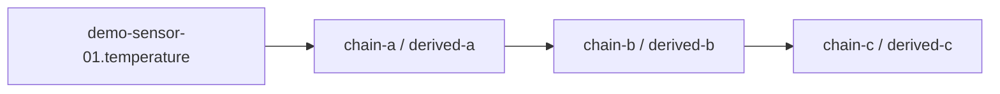

> **Language:** Canonical English. Russian edition: [ru/analytics-historian-cookbook.md](../ru/analytics-historian-cookbook.md).

# Historian computations cookbook

Recipes for **historian binding rules** (`kind: historian` in `@bindingRules`). Each rule is one analytics tag with its own output variable, schedule, and expression.

See [ADR-0041](decisions/0041-multi-tag-historian-computations.md) and [analytics-tag-catalog.md](analytics-tag-catalog.md).

---

## Mental model

| Concept | Value |
|---------|--------|
| Storage | `@bindingRules` on the **target device** (same JSON array as reactive rules) |
| Kind | `"historian"` — skipped by `BindingRuleEngine`, compiled by analytics engine |
| Tag path | `objectPath#ruleId` (e.g. `root.devices.sensor-a#avg-temp-5m`) |
| Live output | `target.variableName` on that device (any name — not fixed to `derivedValue`) |
| Metadata | `@historianRuleMeta` JSON keyed by rule id (quality, last eval) |
| Reactive vs historian | Reactive = immediate CEL on change; historian = windowed aggregates / DAG |

---

## Rule shape

```json
{
  "id": "avg-temp-5m",
  "name": "Rolling average 5m",
  "enabled": true,
  "order": 10,
  "kind": "historian",
  "activators": {
    "onStartup": false,
    "onVariableChange": [
      { "objectPath": "root.platform.devices.sensor-a", "variableName": "temperature" }
    ],
    "onEvent": null,
    "periodicMs": 60000
  },
  "condition": "",
  "expression": "rollingAvg(root.platform.devices.sensor-a.temperature, 5m)",
  "windowBucket": "5m",
  "target": { "kind": "variable", "variableName": "avgTemp5m", "field": "value" }
}
```

### Expression forms

| Form | Example | Helper |
|------|---------|--------|
| Builtin | `rollingAvg(path.var, 5m)` | `rollingAvg` |
| Builtin | `rateOfChange(path.var, 1h)` | `rateOfChange` |
| Builtin | `oee('path', 'avail', 'perf', 'qual', 8h)` | `oee` |
| CEL + historian | `hist.avg('path', 'var', '5m')` | `cel` |
| CEL composite | `(hist.avg('a', 't', '5m') + hist.avg('b', 't', '5m')) / 2.0` | `cel` |

Use **double literals** in CEL (`2.0`, not `2`) when mixing with historian expansions.

---

## Save rules (REST)

```http
GET  /api/v1/objects/by-path/binding-rules?path={devicePath}
PUT  /api/v1/objects/by-path/binding-rules?path={devicePath}
```

Body: JSON array of rules (reactive + historian). Historian rules auto-create the target variable if missing.

**Web console:** Object inspector → **Computations** → add rule or pick a preset toolbar button.

---

## Built-in presets

Static recipes (not object-tree templates). Ids match `HistorianComputationPresets` on the server (API / cookbook).

| Preset id | Output (default) | Expression template |
|-----------|------------------|---------------------|
| `rollingAvg` | `avgValue` | `hist.avg('{objectPath}', '{sourceVariable}', '{windowBucket}')` |
| `rateOfChange` | `rocValue` | `rateOfChange({objectPath}.{sourceVariable}, {windowBucket})` |
| `oee` | `oeePct` | `oee('{sourcePath}', '{availabilityVariable}', …, '{windowBucket}')` |
| `customCel` | `computedValue` | user CEL with `hist.*` |

---

## Recipe 1 — Rolling average on one sensor

**Goal:** 5-minute average of `temperature` on `sensor-a`, written to `avgTemp5m`.

```json
{
  "id": "avg-temp-5m",
  "kind": "historian",
  "enabled": true,
  "order": 10,
  "activators": {
    "onStartup": false,
    "onVariableChange": [
      { "objectPath": "root.platform.devices.sensor-a", "variableName": "temperature" }
    ],
    "onEvent": null,
    "periodicMs": 60000
  },
  "condition": "",
  "expression": "rollingAvg(root.platform.devices.sensor-a.temperature, 5m)",
  "windowBucket": "5m",
  "target": { "kind": "variable", "variableName": "avgTemp5m", "field": "value" }
}
```

**Catalog tag path:** `root.platform.devices.sensor-a#avg-temp-5m`

**Chart widget:** object path = device, variable = `avgTemp5m`, mode = live or history as needed.

**Prerequisite:** `temperature` has `historyEnabled=true` and samples in historian.

---

## Recipe 2 — OEE composite (A × P × Q)

**Goal:** Shift-level OEE on a line device from three historian-backed KPI variables.

Assume device `root.platform.devices.line-01` already has live/historian variables:

- `availabilityPct` (0–100)
- `performancePct` (0–100)
- `qualityPct` (0–100)

```json
{
  "id": "shift-oee",
  "kind": "historian",
  "enabled": true,
  "order": 20,
  "activators": {
    "onStartup": false,
    "onVariableChange": [
      { "objectPath": "root.platform.devices.line-01", "variableName": "availabilityPct" },
      { "objectPath": "root.platform.devices.line-01", "variableName": "performancePct" },
      { "objectPath": "root.platform.devices.line-01", "variableName": "qualityPct" }
    ],
    "onEvent": null,
    "periodicMs": 300000
  },
  "condition": "",
  "expression": "oee('root.platform.devices.line-01', 'availabilityPct', 'performancePct', 'qualityPct', '8h')",
  "windowBucket": "8h",
  "target": { "kind": "variable", "variableName": "oeePct", "field": "value" }
}
```

**Formula:** `oeePct = (A/100) × (P/100) × (Q/100) × 100` over the last historian buckets in `windowBucket`.

**MES integration:** seed A/P/Q from MES OEE reference bundle or BFF; bind alarms/dashboards to `oeePct` like any other variable.

**Tag path:** `root.platform.devices.line-01#shift-oee`

---

## Recipe 3 — Tag chain (three-level KPI pipeline)

**Goal:** Rolling average of a raw sensor → smooth again → threshold input for a downstream KPI.

Pattern used in `AnalyticsEngineIntegrationTest`:



### Step A — first hop (raw → derived-a)

Device: `root.platform.devices.analytics-chain-a`

```json
{
  "id": "analytics-chain-a-rule",
  "kind": "historian",
  "enabled": true,
  "order": 10,
  "activators": {
    "onStartup": false,
    "onVariableChange": [
      { "objectPath": "root.platform.devices.demo-sensor-01", "variableName": "temperature" }
    ],
    "onEvent": null,
    "periodicMs": 60000
  },
  "condition": "",
  "expression": "rollingAvg(root.platform.devices.demo-sensor-01.temperature, 1h)",
  "windowBucket": "1h",
  "target": { "kind": "variable", "variableName": "derived-a", "field": "value" }
}
```

Tag: `root.platform.devices.analytics-chain-a#analytics-chain-a-rule`

### Step B — second hop (derived-a → derived-b)

Device: `root.platform.devices.analytics-chain-b`

```json
{
  "id": "analytics-chain-b-rule",
  "kind": "historian",
  "expression": "rollingAvg(root.platform.devices.analytics-chain-a.derived-a, 1h)",
  "windowBucket": "1h",
  "target": { "kind": "variable", "variableName": "derived-b", "field": "value" }
}
```

(Add the same `kind`, `activators`, `enabled` fields as step A; trigger on `analytics-chain-a.derived-a`.)

### Step C — third hop

Device: `root.platform.devices.analytics-chain-c` — source `analytics-chain-b.derived-b` → `derived-c`.

**DAG:** analytics engine topologically sorts tags; upstream quality `disabled` / `error` propagates as `uncertain` to downstream catalog entries.

**Inspect chain:**

```http
GET /api/v1/platform/analytics/tags/by-path?path=root.platform.devices.analytics-chain-c#analytics-chain-c-rule
```

Response includes `upstreamTagPaths`, `downstreamTagPaths`, and `lineage` graph.

---

## Recipe 4 — Cross-device CEL composite

**Goal:** Average temperature of two sensors on a third **virtual** device.

Device: `root.platform.devices.analytics-demo.sensor-c`

```json
{
  "id": "avg-ab-5m",
  "kind": "historian",
  "enabled": true,
  "order": 10,
  "activators": {
    "onStartup": false,
    "onVariableChange": [
      { "objectPath": "root.platform.devices.analytics-demo.sensor-a", "variableName": "temperature" },
      { "objectPath": "root.platform.devices.analytics-demo.sensor-b", "variableName": "temperature" }
    ],
    "onEvent": null,
    "periodicMs": 60000
  },
  "condition": "",
  "expression": "(hist.avg('root.platform.devices.analytics-demo.sensor-a', 'temperature', '5m') + hist.avg('root.platform.devices.analytics-demo.sensor-b', 'temperature', '5m')) / 2.0",
  "windowBucket": "5m",
  "target": { "kind": "variable", "variableName": "temperature", "field": "value" }
}
```

**Validate before save:**

```http
POST /api/v1/platform/analytics/expression/validate
{ "expression": "...", "objectPath": "root.platform.devices.analytics-demo.sensor-c" }
```

---

## Catalog API

| Method | Path | Description |
|--------|------|-------------|
| GET | `/api/v1/platform/analytics/tags?path=` | List tags (optional prefix) |
| GET | `/api/v1/platform/analytics/tags/by-path?path=` | One tag; `path` = `objectPath#ruleId` or device path (first tag) |
| POST | `/api/v1/platform/analytics/tags/backfill?path=&from=&to=` | Recompute historian window |
| POST | `/api/v1/platform/analytics/expression/validate` | CEL + `hist.*` validation |
| POST | `/api/v1/platform/analytics/expression/evaluate` | One-shot evaluate |
| POST | `/api/v1/platform/analytics/query` | Multi-tag aligned historian query (charts) |

---

## Dashboard binding

- **Live value:** chart/value widget → device path + **output variable name** from the rule (`avgTemp5m`, `oeePct`, …).
- **Multi-tag history:** chart `historyRange` + analytics tag paths in widget config; uses `/analytics/query` (not template id).
- Do **not** reference `root.platform.analytics.*` template paths — catalog removed per ADR-0041.

---

## Deprecated: `ANALYTICS_TEMPLATE` workflow

Pre-0041 flow (`root.platform.analytics.rollingAvg` → **Apply template** → fixed `derivedValue`) is **deprecated**:

- No bootstrap of `root.platform.analytics.*` for new installs
- `/api/v1/platform/analytics/templates/*` kept temporarily; prefer binding rules
- [reference-asset-analytics.md](reference-asset-analytics.md) describes legacy BL-160; use this cookbook for new work

---

## Related

- [bindings.md](bindings.md) — reactive rules + `kind` field
- [ADR-0040](decisions/0040-unified-computations-ui.md) — Computations tab
- [ADR-0041](decisions/0041-multi-tag-historian-computations.md) — binding-rule model
- [examples/analytics-rolling-avg/README.md](../../examples/analytics-rolling-avg/README.md) — updated walkthrough
