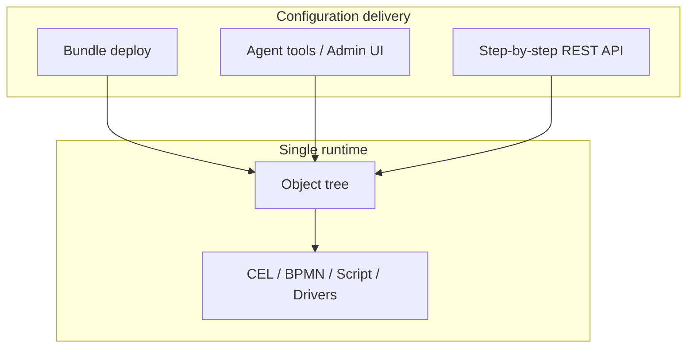

> **Language:** Canonical English. Russian edition: [ru/application-principles.md](../ru/application-principles.md).

# ISPF application development principles

> **Status:** Stable — P1–P10 target approach. Hub: [doc-status.md](doc-status.md).

Canonical rules for **solution developers** and **AI agents** (tree-first agent, AI Studio, MCP). Hub links: [architecture.md](architecture.md), [ADR-0001](decisions/0001-app-platform-boundary.md), [solution-developer-guide.md](solution-developer-guide.md), [agent-knowledge.md](agent-knowledge.md), [platform-logic.md](platform-logic.md).

API and widget details live in linked docs below.

**Agent:** `search_context(query=..., topic=application-principles)`.

---

## Target approach

**Application business logic lives in declarative object-tree configuration; the platform supplies generic engines; bundle deploy is packaging and delivery of configuration, not a separate runtime.**

---

## Principles P1–P10

Each principle has two layers: narrative for humans and actionable rules for agents.

### P1. Object tree is the only runtime

**For humans:** After deploy everything runs through tree nodes (`root.platform.devices.*`, `{appId}.functions.*`, `DASHBOARD`, `WORKFLOW`, `ALERT`). A row in `applications` is **registry + isolated SQL schema**, not a separate engine. Invoke, alerts, dashboards, bindings — via tree API and WebSocket.

**For agents:**

- Address functions by tree path: `{appId}.functions.{name}`; use `invoke_bff` / `invoke_tree_function` — do not invent REST.
- `list_applications` — for appId/schema only; runtime — `list_objects`, `get_object`, `list_variables`.



---

### P2. Platform is engines; solution is configuration

**For humans:** ISPF is middleware/framework. Platform (`main`) implements generic mechanisms **once**: CEL, bindings, historian, BPMN, script runtime, drivers, event bus. Your solution **fills** them with declarative JSON: models, variables, events, functions, workflows, dashboards.

**For agents:**

- **Forbidden:** Java in `ispf-server`, React in `apps/web-console`, platform Flyway for app tables, hardcoded BFF routes.
- New platform capability requires explicit platform approval, not a bundle workaround.

See [0001-app-platform-boundary](decisions/0001-app-platform-boundary.md), [plugins](plugins.md).

Manufacturing depth follows the same boundary: traceability DAG, BoM, CTO, QMS lite, reports-as-documents, operations DAG, Level 4 outbox, and agent-facing capability maps are [solution patterns](manufacturing-patterns.md), not platform Java domains. See [ADR-0050](decisions/0050-manufacturing-patterns-as-solutions.md) and [MES capability MCP map](mes-capability-mcp.md).

---

### P3. Declarative over custom code

**For humans:** If a task can be expressed with CEL, a binding rule, BPMN, a script function, or driver mapping — **do not write** custom Java. The more logic in the object tree, the easier deploy, audit, and AI-assisted editing.

**For agents:**

- Before a script function: check CEL / `create_variable` / binding rules / `configure_alert`.
- Script steps — for CRUD on app schema (`selectMany`, `insert`, `update`), not UI logic.

---

### P4. Bundle = packaging, not a parallel runtime

**For humans:** A bundle manifest is a **way to deliver** configuration into the tree and app schema. After import everything is addressed by tree paths; the bundle does not “live separately” from the platform.

**For agents:**

- Production path: `validate_bundle` → `dry_run_deploy` → `import_package` (in one run).
- POC/lab: tree-first tools without bundle — allowed; bundle import only after gates OK.

Manifest sections: `objects[]`, `models[]`, `dashboards[]`, `workflows[]`, `migrations[]`, `functions[]`, `bindings[]`, `operatorUi`, … — see [solution-developer-public-api](solution-developer-public-api.md).

---

### P5. One logic model: Platform Rule

**For humans:** All reactive logic follows one workflow:

```text
WHEN (activator)  →  IF (CEL condition)  →  THEN (effect)
```

Three effects (`target.kind`): `variable`, `context` (`@dashboardContext`), `event` (journal/workflow). Do not add parallel DSLs on widgets (`showWhen`, `behaviorJson`, `visibleWhen`).

**For agents:**

- Dashboard show/hide → rules with `target.kind=context`, path `widgets.{id}.visible`.
- UI mode/selection → `context.params.*`, `context.selection.*`.
- Activators: `onVariableChange`, `onContextChange`, `onEvent`, `onStartup`, `periodicMs`.
- `search_context topic=platform-logic`.

See [platform-logic](platform-logic.md), [0019-platform-rule-unification](decisions/0019-platform-rule-unification.md).

---

### P6. One task — one mechanism

**For humans:** Do not duplicate logic in multiple places.

| Task | Mechanism | Do not use |
|------|-----------|------------|
| Variable computation | CEL / binding rules | Java handler |
| UI show/hide, HMI mode | Platform Rule → `@dashboardContext` | Widget fields |
| Threshold → event | ALERT + CEL | Custom polling |
| Event pattern | Correlator | Ad-hoc scripts |
| Process with tasks | BPMN WORKFLOW | Imperative chain |
| SQL CRUD | Script function | Platform Java |
| SQL → live variable | `sqlBinding` / bindings[] | Manual sync |
| Telemetry | Driver + mappings | Fake variables |

**For agents:** `get_automation_schema` before `configure_alert` / `configure_correlator`; layout only in variable `layout`, not `set_variable name=widgets`.

---

### P7. One creation stack — four layers, one default path

**For humans:** Blueprint, bundle, change set, agent, and Admin UI are **not five alternative ways to build an application**. They answer **four different questions**. Treating them as peers is the main cognitive tax for newcomers and for weak models.

| Layer | Question | Mechanism | Document |
|-------|----------|-----------|----------|
| **AUTHOR** | Who is editing right now, and how? | Admin UI **or** Agent (AI Studio / MCP) | [ai-development](ai-development.md) |
| **SHAPE** | What structure should this typed object have? | **Blueprint** (mixin / singleton / intrinsic) | [blueprints](blueprints.md) |
| **SHIP** | What is the durable, repeatable delivery artifact? | **Bundle** (manifest + migrations + gates) | [solution-developer-guide](solution-developer-guide.md), P4 |
| **PROMOTE** | How do I preview and apply a batch of already-authored ops? | **Change set** | [collaboration](collaboration.md) § change-sets |

```text
AUTHOR  = UI | Agent      → writes into the tree and/or drafts a bundle
SHAPE   = Blueprint       → defines typed object structure
SHIP    = Bundle          → canonical repeatable delivery (+ app SQL / CI)
PROMOTE = Change set      → preview/apply of existing ops (not greenfield bootstrap)
DONE    = validate → dry-run/preview → apply  (P10)
```

**Hard rule:** Do not choose a mechanism until you know which layer you are on.

- UI and Agent are two **clients** of the same tree/bundle contracts — not two platforms.
- Blueprint is **shape**, never “another way to ship an app.”
- Change set is **promotion/review**, never “another way to create from scratch.”
- Bundle is **packaging into the one runtime** (P1, P4), not a parallel engine.

#### Intent → default path

| Intent | Default | Allowed | Not the same thing |
|--------|---------|---------|--------------------|
| Lab / SNMP / monitoring **without** app schema | **AUTHOR** tree-first (UI or Agent) | Platform HMI only | Bundle “because bundles exist” |
| Production solution with **SQL** and/or **CI** | **SHIP** bundle: `validate → dry_run → import` | AUTHOR only as draft until gates pass | Live-tree-only with no packaging |
| Draft from a natural-language prompt | Agent / AI Studio → **bundle gates** | Short tree-first POC, then export/import | Import without validate |
| Start from a known baseline (MES / lab / commercial) | Reference or commercial **bundle** | Adapt after import | Hand-copy dozens of objects |
| Give a typed object its variables / events / functions | **SHAPE** — blueprint apply / instantiate (or `models[]` in bundle) | — | Re-create the same variables by hand each time |
| Review or promote a package of existing tree ops | **PROMOTE** — change set `preview → apply` | `force` only when explicit | Change set as greenfield app bootstrap |
| Iterative HMI without a release train | **AUTHOR** Admin UI on the tree | Agent in ask/plan | Change set as a substitute for Explorer |

#### Decision flow (one pass)

```text
Need isolated app SQL and/or repeatable release?
  YES → SHIP = bundle
        (use reference/commercial bundle when a baseline exists)
  NO  → AUTHOR = tree-first (UI or Agent)
        SHAPE  = blueprints for typed objects

Moving or reviewing already-authored ops (people / environments)?
  → PROMOTE = change set (preview → apply)

Before any shipping mutate: validate → dry-run/preview → apply (P10)
```

Labels A–H (tree-first, console, bundle, REST, AI Studio, reference, platform HMI, commercial) are **AUTHOR/SHIP variants** under this stack — tool and Operator UI detail only. Canonical selection is this section; the expanded table lives in [agent-knowledge § Approaches](agent-knowledge.md).

Quality doctrine for this stack (prevention over guards): [ADR-0051](decisions/0051-poka-yoke-constraints-over-guards.md).

**For agents:**

1. Resolve **layer** first (AUTHOR / SHAPE / SHIP / PROMOTE), then pick tools.
2. If `needAppSchema` or `needCi` → **SHIP** bundle path; else **AUTHOR** tree-first.
3. Creating typed objects → prefer blueprint / model apply for **SHAPE**; do not invent parallel variable sets.
4. Never offer blueprint or change set as peer alternatives to bundle for greenfield solutions.
5. Path selection: `search_context topic=application-principles` (this section), then `topic=agent-knowledge` for A–H tool detail; use `get_example_bundle` / playbooks when the default is a baseline bundle.

---

### P8. Tree-first convergence

**For humans:** After deploy functions live on `{appId}.functions.*`; redeploy **updates** existing nodes (reconcile); SQL bindings — via `sqlBinding('appId','var')` on the variable.

**For agents:**

- Legacy `POST .../functions/invoke` by appId — deprecated; prefer `invoke_bff` / tree path.
- `operatorUi` in manifest, not legacy `operatorManifest`.
- Reconcile: redeploy updates nodes, not create-only.

| Was (legacy) | Now (target approach) |
|--------------|------------------|
| Only `POST .../functions/invoke` by appId | `POST /bff/invoke` or tree path `{appId}.functions.*` |
| `screens[]` in operator manifest | `operatorUi` + dashboards |
| New `objects[]` create-only | Reconcile on redeploy |
| Imperative sync Java → variables | CEL, `sqlBinding()`, script steps |

---

### P9. Operator UI — declarative, from bundle or tools

**For humans:** Operator HMI: `?mode=operator&app={appId}`. Menu and default dashboard — from `operatorUi` in bundle or `configure_operator_ui`. Priority: DB `operator_app_ui` → bundle `operatorUi` → autogen from dashboards.

**For agents:** After tree-first POC — `configure_operator_ui`; in `finish` — URL with `?mode=operator&app=...&dashboard=...`.

---

### P10. Validate before mutate

**For humans:** Every deploy passes semantic validation. CI: validate → dry-run → import. CEL: `POST /api/v1/expressions/validate`.

**For agents:**

- `import_package` only after `validate_bundle` + `dry_run_deploy` OK **in the same run**.
- Do not invent REST paths — only documented tools/endpoints.
- Commercial bundle: sign after edits — [commercial-licensing](commercial-licensing.md).

See [0004-ai-artifact-generation-gates](decisions/0004-ai-artifact-generation-gates.md).

---

## Where to express logic

| Task | Mechanism | Document |
|------|-----------|----------|
| Variable computation | CEL / platform bindings / binding rules | [bindings](bindings.md) |
| Dashboard UI (show/hide, mode) | Platform Rule → `@dashboardContext` | [platform-logic](platform-logic.md), [dashboards](dashboards.md) |
| Threshold → event | ALERT node + CEL | [automation](automation.md) |
| Event pattern → workflow | Correlator | [automation](automation.md) |
| Process with operator tasks | BPMN WORKFLOW | [workflows](workflows.md) |
| SQL CRUD on app schema | Script function (steps) | [applications](applications.md), [object-functions](object-functions.md) |
| SQL → variable poll | sqlBinding / bindings[] | [applications](applications.md) |
| Device telemetry | Driver + point mappings | [drivers](drivers.md) |
| HMI table | Widget `object-table` + `selectionKey` | [dashboards](dashboards.md), [widgets](widgets.md) |
| Legacy mini-DSL on widget | **Deprecated** → Platform rules | [platform-logic](platform-logic.md) § legacy |

---

## Anti-patterns

| Anti-pattern | Why it is bad | Correct approach |
|--------------|---------------|------------------|
| Industry Java in server | Breaks platform/solution boundary | Script function + tree |
| App layer as runtime | Duplicates object tree | Tree paths |
| Logic on widget | N mini-DSL, AI/people get confused | Platform Rule |
| sessionStorage-only context | Not durable, not multi-client | `@dashboardContext` + WS |
| Bundle without validate | Silent breakage | Gates [0004-ai-artifact-generation-gates](decisions/0004-ai-artifact-generation-gates.md) |
| Platform Flyway for app tables | Mixes schemas | `migrations[]` in app schema |
| Blueprint / change set / UI / agent as peer “ways to build an app” | Five doors, no rule of the game (P7) | Layers: AUTHOR → SHAPE → SHIP → PROMOTE |
| Change set for greenfield bootstrap | Wrong layer; no durable ship artifact | Bundle (SHIP) or tree-first AUTHOR |
| Hand-duplicating blueprint structure | Breaks SHAPE; drift across instances | Blueprint apply / `models[]` |

---

## Agent checklists

### “Create application / solution” (with SQL)

1. P7: layer = **SHIP** (app schema / release). Prefer reference/commercial bundle when a baseline exists.
2. Clarify appId, whether operator UI is needed.
3. `search_context topic=application-principles` + `topic=agent-knowledge`; `get_example_bundle` if MES/lab-like.
4. register (or bundle) → migrations → functions → objects/dashboards; **SHAPE** via blueprints / `models[]`.
5. `validate_bundle` → `dry_run_deploy` → `import_package`.
6. `configure_operator_ui` if not in manifest.
7. `finish` with `?mode=operator&app=...` and dashboard paths.

### “Create monitoring / SNMP / dashboard” (no app schema)

1. P7: layer = **AUTHOR** tree-first (not bundle-for-its-own-sake); **SHAPE** via blueprints for typed devices.
2. Tree-first playbook (SNMP / virtual cluster).
3. Driver + dashboard template.
4. Platform rules as needed (detail mode, widget visibility).
5. `configure_operator_ui` for platform app.

### “Do not break platform” (P2, P10)

- Do not invent REST paths — tools only.
- Bundle import only after validate + dry_run OK in the same run.
- No platform Flyway for app tables.
- Prefer `operatorUi` over legacy `operatorManifest`.

---

## Related documents

| Document | Purpose |
|----------|---------|
| [solution-developer-guide](solution-developer-guide.md) | Lifecycle: register → migrate → deploy → operator |
| [agent-knowledge](agent-knowledge.md) | AUTHOR/SHIP variants A–H, docs map, search_context topics |
| [blueprints](blueprints.md) | SHAPE — object structure templates |
| [collaboration](collaboration.md) | PROMOTE — change sets, preview/apply |
| [architecture](architecture.md) | Platform layers, core domain model |
| [platform-logic](platform-logic.md) | Platform Rule, `@dashboardContext` |
| [ai-development](ai-development.md) | Agent tools, ContextPack, MCP |
| [manufacturing-patterns](manufacturing-patterns.md) | MES solution patterns and boundary |
| [mes-capability-mcp](mes-capability-mcp.md) | Agent capability to MES function mapping |
| [solution-developer-public-api](solution-developer-public-api.md) | Stable manifest contract |
| [decisions/readme.md](decisions/readme.md) | ADR-0001, 0004, 0005, 0019, **0051** (poka-yoke) |
| [0051-poka-yoke-constraints-over-guards](decisions/0051-poka-yoke-constraints-over-guards.md) | Constraints over guards; guard demount inventory |

---

*Update when the target approach changes (ADR, platform approval process) and agent tools expand.*
