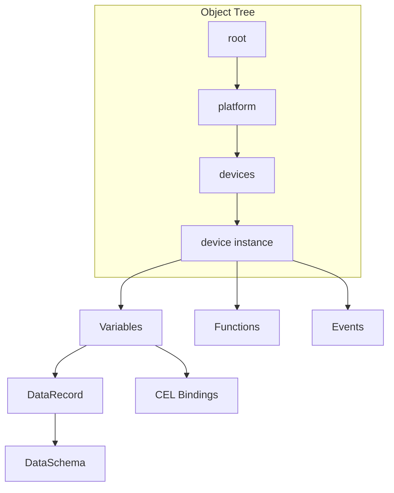

> **Language:** Canonical English. Russian edition: [ru/architecture.md](../ru/architecture.md).

# ISPF Architecture

**See also:** [object-model](object-model.md), [cluster](cluster.md), [application-principles](application-principles.md), [decisions/readme.md](decisions/readme.md).

## Vision

**IoT Solutions Platform Framework (ISPF)** — middleware for IoT, industrial automation, and IT operations. A unified data model and API for devices, HMI dashboards, alerts, and BPMN automation.

## Core principle: business logic in platform mechanisms

Application business logic **lives on the platform** — in declarative **object tree** configuration, not in domain-specific Java in the server.

| Mechanism | What it describes |
|-----------|-------------------|
| **Models** | Blueprint: variables, events, functions, bindings |
| **Variables** | State, computations (CEL, platform bindings), historian |
| **Events** | Event types; alert rules and correlators are tree nodes |
| **Functions** | Callable logic on an object (script, `INVOKE_FUNCTION`) |
| **Workflow** | BPMN processes, user tasks, escalation |

The **platform (framework)** implements **generic engines once**: CEL, bindings, historian, BPMN, script runtime, drivers, event bus.

A **solution** fills those mechanisms with configuration: models, thresholds, processes, functions, dashboards.

Bundle deploy ([applications](applications.md)) is **packaging and delivery** of configuration into the object tree and app schema — not a separate runtime outside the platform.

**Forbidden in `main`:** domain Java in `ispf-server`, hardcoded BFF routes, duplicating logic outside the object tree. See [0001-app-platform-boundary](decisions/0001-app-platform-boundary.md).

**Platform evolution:** richer object-tree mechanisms (Phase 5). See [roadmap.md § Phase 5](roadmap.md).

## Core domain model



Details: [object-model](object-model.md).

### Platform object

Addressable node: `root.platform.devices.pump-01`. Types: `DEVICE`, `DASHBOARD`, `WORKFLOW`, `ALERT`, `CORRELATOR`, `PLATFORM`, `ALERT_RULES`, … System catalogs use semantic `ObjectType`, not `CUSTOM`.

### DataRecord

- `DataSchema` — fields (`FieldType`)
- `DataRecord` — rows with validation

### Models (templates)

`BlueprintDefinition` — blueprint: variables, events, functions, bindings.  
See [blueprints](blueprints.md).

### Expressions

Google CEL for bindings, alert rules, workflow gateways. Object variables also support **platform bindings** (`counterRate`, `scale`, `clamp`, …) — see [bindings](bindings.md).

```
self.temperature.value > self.threshold.value
counterRate(ifInOctets)
```

## Runtime layers

```
┌─────────────────────────────────────────────────────────┐
│  Web Console (React 19 + Vite + TanStack Query)         │
│  Admin │ Operator HMI │ Dashboard/Workflow builders     │
├─────────────────────────────────────────────────────────┤
│  API Layer (Spring Boot 4.0, Java 25)                   │
│  REST / WebSocket / OAuth2 JWT / RBAC                   │
├─────────────────────────────────────────────────────────┤
│  Domain Services                                        │
│  ObjectManager │ EventService │ WorkflowService         │
│  DashboardService │ AlertRuleService │ CorrelatorService│
│  DriverRuntimeService │ BlueprintEngine                     │
│  ApplicationPlatform (functions, data, BFF, scheduler)  │
├─────────────────────────────────────────────────────────┤
│  Plugins & Libraries                                    │
│  ispf-core │ ispf-expression │ ispf-plugin-blueprint         │
│  ispf-plugin-workflow                                   │
├─────────────────────────────────────────────────────────┤
│  Driver SPI                                             │
│  virtual │ mqtt │ modbus-tcp │ snmp                     │
├─────────────────────────────────────────────────────────┤
│  Persistence & Messaging                                │
│  PostgreSQL/H2 │ Flyway │ NATS* │ MQTT*                 │
└─────────────────────────────────────────────────────────┘
```

## Package map

| Package | Role |
|---------|------|
| `ispf-core` | ObjectTree, PlatformObject, DataRecord |
| `ispf-expression` | CEL engine, BindingExpressionEvaluator |
| `ispf-driver-*` | Device protocol adapters |
| `ispf-plugin-blueprint` | Model registry & engine |
| `ispf-plugin-workflow` | BPMN parser & executor |
| `ispf-server` | Spring Boot wiring, REST, JPA, security |

## Security model

OAuth2 JWT (Keycloak) or header-based RBAC (`local`).  
Roles: `admin`, `operator`.  
See [security](security.md).

## Data flow: telemetry

```
DeviceDriver.readPoints()
  → DriverRuntimeService
  → ObjectManager.setVariableValue() / setDriverTelemetryValue()
  → BindingPropagationListener → BindingRuleEngine
  → AlertRuleListener
  → ObjectChangeEvent → WebSocket → Web Console
```

## Data flow: automation

```
Event fire → event_history
  → EventCorrelatorListener → WorkflowService.run
  → UserTask → WorkQueue → Operator HMI
```

## Deployment topology

**Development:** `docker compose` + Gradle bootRun + Vite dev server.

**Production (target):**

- `ispf-server` — stateless replicas
- Managed PostgreSQL, Redis, NATS
- Keycloak / OIDC
- Static web-console behind CDN/ingress

**Horizontal scale ≠ federation:** replicas share one DB and one `root.platform.*` tree. Multi-replica: driver ownership, NATS live mirror — see **[cluster](cluster.md)**. Multiple sites / edge agents — [federation](federation.md), [roadmap.md § Phase 4–8](roadmap.md).

See [deployment](deployment.md).

## Extension points

1. **DeviceDriver** — new protocol ([drivers](drivers.md))
2. **BlueprintDefinition** — device/process template ([blueprints](blueprints.md))
3. **FunctionHandler** — business operations on objects
4. **Dashboard widgets** — new types in web-console ([dashboards](dashboards.md))
5. **REST / Webhook** — external integrations ([api](api.md))
6. **NATS subjects** — messageTask in BPMN ([workflows](workflows.md))
7. **Application bundle** — deploy functions and migrations **outside** core ([applications](applications.md), [plugins](plugins.md))

Commercial and domain extensions **do not** belong in the Apache 2.0 `main` tree.

## Reference stands

| Stand | Branch | Description |
|-------|--------|-------------|
| Demo sensor | `main` | virtual driver, alert, workflow |

## Documentation index

Full set: [docs/en/readme.md](readme.md).
