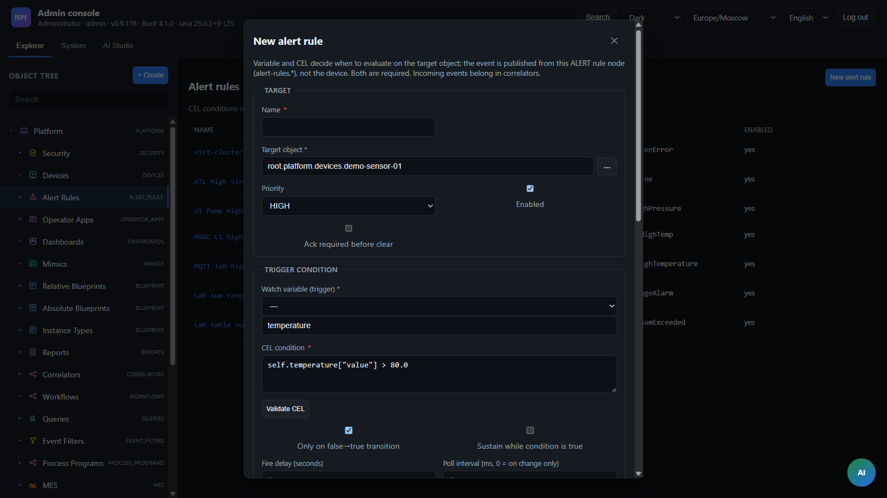
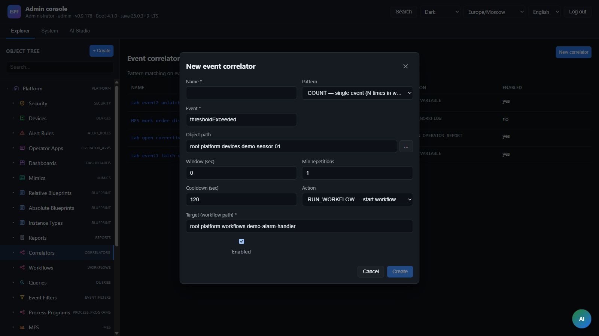

> **Language:** Canonical English. Russian edition: [ru/automation.md](../ru/automation.md).

# Automation: events, alerts, correlators

> **Status:** Stable — Alerts, correlators. Hub: [doc-status.md](doc-status.md).

**See also:** [workflows](workflows.md), [0039-unified-alarm-architecture](decisions/0039-unified-alarm-architecture.md), [0014-automation-pipeline-evolution](decisions/0014-automation-pipeline-evolution.md), [operator-guide](operator-guide.md).

## Events

### Descriptor

An object defines an `EventDescriptor`: name, payload schema, level.

Levels (`EventLevel`): `DEBUG`, `INFO`, `WARNING`, `ERROR`, `CRITICAL`.

### Publishing

**API (manual fire, integrations):**

```http
POST /api/v1/events/fire
```

**Driver ingress (high frequency, no HTTP):** when `telemetryPublishMode=EVENT_JOURNAL_ONLY`, each driver variable update triggers `EventService.fireIngress` → async journal. The event name comes from `ingressEventName` in the driver configuration (default `messageReceived`). See [0027-event-journal-ingress-fast-path](decisions/0027-event-journal-ingress-fast-path.md).

Shared hot path after descriptor validation:

1. Write to `event_history` (async batch — Timescale [0015-event-history-timescale](decisions/0015-event-history-timescale.md) or ClickHouse [0016-clickhouse-event-journal](decisions/0016-clickhouse-event-journal.md))
2. `ObjectChangeEvent` → WebSocket
3. Listeners: correlators, UI.

### Journal

```http
GET /api/v1/events?objectPath=root.platform.devices.demo-sensor-01&limit=50
```

Without `objectPath` — global journal (up to 200 entries).

### Demo

`mqtt-sensor-v1` → `thresholdExceeded` when the threshold is exceeded (via alert rule or manual fire); `messageReceived` — for loadtest/audit ingress ([0027-event-journal-ingress-fast-path](decisions/0027-event-journal-ingress-fast-path.md)).

---

## Storage in the object tree

Alert rules and event correlators are **tree nodes** under `root.platform`, like dashboards and workflows:

```
root.platform
├── root.platform.alert-rules
│   └── root.platform.alert-rules.temperature-threshold-exceeded
└── root.platform.correlators
    ├── root.platform.correlators.alarm-handler-on-threshold-event
    └── root.platform.correlators.threshold-then-alarm-active-sequence-demo
```

| Entity | Node type | Model | Folder |
|----------|----------|--------|-------|
| Alert rule | `ALERT` | `alert-rule-v1` | `root.platform.alert-rules` |
| Correlator | `CORRELATOR` | `correlator-v1` | `root.platform.correlators` |

Configuration is stored on the object request (`objectPath`, `watchVariable`, `conditionExpr`, …). `AutomationTreeService` reads and writes nodes; on startup `AutomationBootstrap` migrates legacy rows from `alert_rules` / `event_correlators` tables (if present) and creates demo rules.

UI: **Explorer** → select a node in `alert-rules` or `correlators` → inspector (`AlertRuleInspector`, `CorrelatorInspector`). Create via tree context menu or `POST /api/v1/alert-rules` / `POST /api/v1/correlators`.

---

## Alert rules

CEL rule on variable change. When the condition is true — fire events.



### Fields

| Field | Description |
|------|----------|
| `objectPath` | Object |
| `watchVariable` | Variable name |
| `conditionExpr` | CEL (context: variable fields) |
| `eventName` | Event name to fire |
| `payloadVariable` | Variable for payload (optional) |
| `enabled` | On/off |
| `edgeTrigger` | Only on false→true edge |
| `delaySeconds` | Seconds condition must stay true before activate (0 = immediate) |
| `sustainWhileTrue` | Re-fire while condition stays true (subject to `rateLimitSeconds`) |
| `rateLimitSeconds` | Minimum interval between repeated fires when sustaining |
| `priority` | `CRITICAL` / `HIGH` / `MEDIUM` / `LOW` |
| `ackRequired` | Operator acknowledgement metadata |
| `deactivateExpr` | CEL clear condition (optional; empty = clear when `conditionExpr` is false) |
| `deactivateDelaySeconds` | Seconds `deactivateExpr` must stay true before clear (0 = immediate) |
| `clearEventName` | Event fired on deactivate (optional; e.g. `thresholdCleared`) |
| `pollIntervalMs` | Periodic re-evaluation interval (0 = only on `watchVariable` change) |
| `triggerMessage` | Static or CEL message stored on the event payload when raised |
| `latchedActive` | Runtime: rule is in latched active state (read-only in inspector) |
| `notificationWebhookUrl` | URL for HTTP POST on trigger (optional) |
| `notificationEmailTarget` | Email: `to@host\|subject\|body` (optional, relay required) |

**Latch mode** activates when any of `deactivateExpr`, `clearEventName`, or `deactivateDelaySeconds > 0` is set. In latch mode the rule stays active after the activate condition fires until the deactivate path completes (with optional delay), then fires `clearEventName` if set.

When events fire, if webhook and/or email are set — `NotificationDispatchService` runs additionally (errors are logged; the alert is not blocked).

### Example (simple edge)

Object: `demo-sensor-01`, watch: `alarmActive`, condition: `self.alarmActive["value"] == true`, event: `thresholdExceeded`.

### Example (temperature latch, ADR-0039 phase B)

Object: `demo-sensor-01`, watch: `temperature`, activate: `self.temperature["value"] > 80.0`, deactivate: `self.temperature["value"] < 70.0`, events: `thresholdExceeded` / `thresholdCleared`. See [`examples/alert-rule-evolution/temperature-high.json`](../../examples/alert-rule-evolution/temperature-high.json).

`AlertRuleListener` reacts to `VARIABLE_UPDATED`; rules with `pollIntervalMs > 0` are also evaluated by `AlertRulePeriodicScheduler`.

### API

| Method | Path | Roles |
|--------|------|------|
| GET | `/api/v1/alert-rules` | admin |
| GET | `/api/v1/alert-rules/by-path?path=` | admin |
| POST | `/api/v1/alert-rules` | admin |
| PUT | `/api/v1/alert-rules/by-path?path=` | admin |
| DELETE | `/api/v1/alert-rules/by-path?path=` | admin |

---

## Event correlators



Aggregate multiple events → action (start workflow).

### Patterns (`CorrelatorPatternType`)

| Type | Description |
|-----|----------|
| `COUNT` | N events of `eventName` within `windowSeconds` |
| `SEQUENCE` | Event A, then B on the same object |
| `EVENT_CHAIN` | Ordered chain of 3+ events (`eventName` + comma-separated `secondEventName`) within `windowSeconds` |
| `WINDOW` | Set of events (A + list in `secondEventName`) — each at least once within `windowSeconds` |

### WINDOW / EVENT_CHAIN (BL-171)

**WINDOW (unordered):** all listed events must occur on one object within `windowSeconds`; order does not matter.

**EVENT_CHAIN (ordered):** events must appear in order (gaps allowed for unrelated events) within `windowSeconds`.

| Field | Role for WINDOW / EVENT_CHAIN |
|------|-----------------|
| `eventName` | First required event |
| `secondEventName` | Additional events comma-separated (e.g. `workOrderReleased,workOrderStarted`) |
| `windowSeconds` | Sliding window width (> 0) |
| `minOccurrences` | Not used (leave 1) |
| `sequenceGapSeconds` | Optional max gap between consecutive chain steps (`EVENT_CHAIN`) |

Example: MES dispatch — `workOrderCreated` + `workOrderReleased` + `workOrderStarted` within 120 s on `mes-platform-hub` → `RUN_WORKFLOW`.

`EventCorrelatorService.processWindowPattern` / `processEventChainPattern` record hits in the window store and fire when the pattern matches.

### Fields

| Field | Description |
|------|----------|
| `name` | Name |
| `patternType` | COUNT / SEQUENCE / EVENT_CHAIN / WINDOW |
| `eventName` | First event (A) |
| `secondEventName` | Second (for SEQUENCE) or additional (for WINDOW) |
| `windowSeconds` | Observation window |
| `minOccurrences` | Threshold (COUNT) |
| `cooldownSeconds` | Pause after trigger |
| `actionType` | See table below |
| `actionTarget` | Depends on `actionType` |
| `enabled` | On/off |

### Action types (`CorrelatorActionType`)

| `actionType` | `actionTarget` | Description |
|--------------|----------------|----------|
| `RUN_WORKFLOW` | workflow path | Start BPMN |
| `FIRE_EVENT` | event name | `EventService.fire` on object |
| `SET_VARIABLE` | `varName=value` | Write variable |
| `OPEN_OPERATOR_REPORT` | report path | `openOperatorReport` event |
| `SEND_WEBHOOK` | URL | HTTP POST JSON (`NotificationDispatchService`) |
| `SEND_EMAIL` | `to\|subject\|body` | POST to email relay (see config below) |

### SEQUENCE example

A = `thresholdExceeded`, B = `thresholdExceeded` (repeat), window = 60s → start `demo-alarm-handler`.

`EventCorrelatorListener` on `EVENT_FIRED`. Hits in `correlator_hits` table.

### API

| Method | Path | Roles |
|--------|------|------|
| GET | `/api/v1/correlators` | admin |
| GET | `/api/v1/correlators/by-path?path=` | admin |
| POST | `/api/v1/correlators` | admin |
| PUT | `/api/v1/correlators/by-path?path=` | admin |
| DELETE | `/api/v1/correlators/by-path?path=` | admin |

---

## Notification channels (BL-44)

`NotificationDispatchService` — HTTP webhook and optional email relay for alert rules and correlator actions.

### Configuration

| Property | Env (relaxed binding) | Description |
|----------|----------------------|----------|
| `ispf.notifications.email-relay-url` | `ISPF_NOTIFICATIONS_EMAIL_RELAY_URL` | HTTP relay endpoint: accepts JSON `{ "to", "subject", "body", ...context }` |
| `ispf.notifications.timeout-seconds` | `ISPF_NOTIFICATIONS_TIMEOUT_SECONDS` | HTTP timeout (default 15) |

Without `email-relay-url`, `SEND_EMAIL` and alert-rule email fail in the log; webhooks work without a relay.

### Webhook payload / email context

Base fields (`NotificationDispatchService.baseContext`):

```json
{
  "source": "alert-rule | correlator",
  "sourceId": "<rule/correlator node path>",
  "objectPath": "<object where triggered>",
  "eventName": "<event name>",
  "timestamp": "2026-06-28T12:00:00Z"
}
```

### Where to configure

| Source | UI | Variables / fields |
|----------|-----|-------------------|
| Alert rule | Explorer → `alert-rules` → inspector | `notificationWebhookUrl`, `notificationEmailTarget` |
| Correlator | Explorer → `correlators` → inspector | `actionType` = `SEND_WEBHOOK` / `SEND_EMAIL`, `actionTarget` |

Alert rules API accepts the same fields in `POST/PUT` body (`CreateAlertRuleRequest` / `UpdateAlertRuleRequest`).

---

## Process programs (BL-172)

Cyclic control loops under `root.platform.process-programs` (`PROCESS_PROGRAM` / `process-program-v1`).

| Field | Role |
|------|------|
| `cycleIntervalMs` | Tick interval |
| `targetObjectPath` | Plant object for CEL context + actuator write |
| `outputVariable` | Variable on target written each cycle |
| `controlExpression` | CEL result written to `outputVariable` |
| `interlockExpression` | Optional CEL; write skipped when false (`lastError=interlock blocked`) |
| `enabled` | On/off |
| `lastCycleAt` / `lastOutput` / `lastError` | Runtime |

Scheduler: leader-locked `ProcessProgramRunner` (`ispf.process-program.tick-ms`).

## Event filters (BL-174)

Reusable journal filters under `root.platform.event-filters` (`EVENT_FILTER` / `event-filter-v1`).

| Field | Role |
|------|------|
| `eventNamePattern` | Glob (`*`, `?`) |
| `sourceObjectPathPattern` | Object path glob (`*`, `**`) |
| `minSeverity` / `maxSeverity` | 0–100 scale (DEBUG=10 … CRITICAL=90) |
| `timeWindowMs` | Keep only events newer than now−window (0 = all) |
| `filterExpression` | Optional CEL on `payload.*` (includes `eventName`, `severity`, …) |

Apply:

| Method | Path |
|--------|------|
| GET | `/api/v1/events?filterPath=root.platform.event-filters.*` |
| GET | `/api/v1/event-filters/by-path/events?path=…` |

CRUD: `/api/v1/event-filters`.

## ML hooks (BL-175)

`com.ispf.core.ml.AnomalyDetectionSpi` with reference `ThresholdAnomalyDetectionSpi` (`ispf.ml.anomaly.enabled=true`). Alert rules may set `anomalyModelId` for SPI scoring via `AnomalyAlertRuleEvaluator`.

## CEL in automation

| Place | Context |
|-------|----------|
| Variable binding | `self.var.field` |
| Alert rule | watched variable fields |
| Process program | target object `self.*` |
| Event filter | `payload.*` |
| Workflow gateway | process instance variables |
| Expression validate API | arbitrary schema |

Validation: `POST /api/v1/expressions/validate`.

---

## Operator HMI

In `?mode=operator`:

- **EventJournalPanel** — live events
- **WorkQueuePanel** — tasks from user tasks.

Dashboard widgets `event-feed` and `work-queue` duplicate functionality on the HMI screen.

## Related

- [0039-unified-alarm-architecture](decisions/0039-unified-alarm-architecture.md) — alert rule field evolution
- [reference-escalation-templates](reference-escalation-templates.md) — workflow escalation
- [variable-history](variable-history.md) — event journal storage ([0015-event-history-timescale](decisions/0015-event-history-timescale.md), [0016-clickhouse-event-journal](decisions/0016-clickhouse-event-journal.md))
