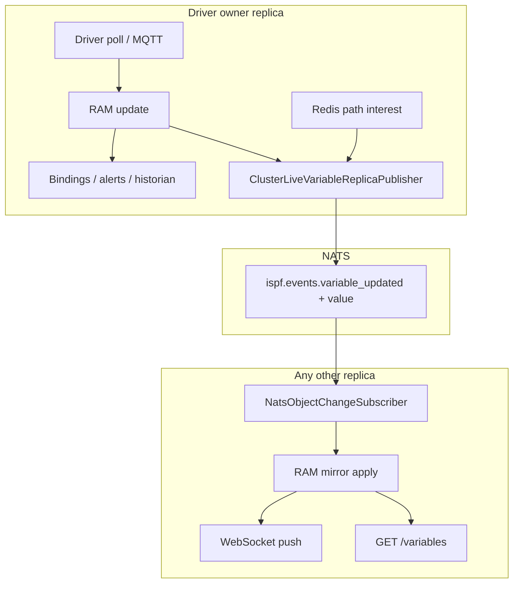

> **Language:** Canonical English. Russian edition: [ru/cluster.md](../ru/cluster.md).

# ISPF cluster (multi-replica)

> **Status:** Beta — Multi-replica HA (capability vs demostand). Hub: [doc-status.md](doc-status.md).

Guide to horizontal API scaling: multiple JVM replicas, one object tree in PostgreSQL, live value synchronization via NATS ([0029-cluster-live-variable-replica-sync](decisions/0029-cluster-live-variable-replica-sync.md)).

See also: [0028-horizontal-active-active-cluster](decisions/0028-horizontal-active-active-cluster.md), [deployment](deployment.md), [messaging](messaging.md), [bindings](bindings.md), [cluster-chaos-soak-runbook](cluster-chaos-soak-runbook.md) (Wave 6 evidence: REAL vs PARTIAL).

## Cluster ≠ federation

| | **Cluster** | **Federation** |
|---|-------------|------------------|
| Object tree | Single `root.platform.*` in one DB | Multiple sites / edge agents |
| Replicas | N stateless JVMs behind LB | Hub ↔ spoke communication |
| Driver | Exactly one poll per device | See [federation](federation.md) |

## Topology (VPS / lab example)

```text
                    nginx :8080
           REST ip_hash  │  WS ip_hash (one replica per client)
        ┌──────────┬───────┴───────┬──────────┐
        ▼          ▼               ▼          │
   replica-1   replica-2      replica-3      │
   :8081       :8082           :8083          │
        └──────────┴───────┬───┴──────────────┘
                           │
              PostgreSQL (one tree)
              NATS (fan-out between replicas)
              Redis (path interest, ACL, correlator)
```

Compose: [`deploy/docker-compose.cluster.yml`](../../deploy/docker-compose.cluster.yml); VPS: [`deploy/docker-compose.vps-cluster.yml`](../../deploy/docker-compose.vps-cluster.yml).

Each replica on startup:

1. Flyway migrations (once per DB).
2. `loadFromDatabase()` — identical tree on all nodes.
3. Registration in `platform_cluster_replicas` + heartbeat.
4. Acquire `platform_driver_locks` for devices assigned to this node.

## Where data lives

| Data | Storage | Cluster behavior |
|------|---------|------------------|
| Object structure, configs, bindings | PostgreSQL | Write on any replica → NATS fan-out → reload on peers ([0030-cluster-config-structure-replica-sync](decisions/0030-cluster-config-structure-replica-sync.md): `reloadPathFromDatabase`, config variables: `syncVariableFromDatabase`) |
| **Real-time telemetry** (`ifInOctets`, `temperature`, …) | **RAM on owner replica** | Not written to PG on every tick |
| **Live mirror on subscriber** | RAM (copy snapshot) | ADR-0029: NATS payload includes `value` |
| Historian / event journal | PG / ClickHouse / Cassandra | Written **only by owner** |
| Bindings / alerts / cascading functions | RAM + automation pipeline | Executed **only on owner** |

### Driver ownership

Exactly one replica polls each DEVICE (`platform_driver_locks`, TTL + refresh). When a node fails, its lock expires and another replica takes the device.

Check: `GET /api/v1/platform/cluster/health` (admin) — `heldDevicePaths` per node.

## Bindings, variables, functions, dashboards

### Variables

- **Raw telemetry** arrives from the driver on the owner → `setDriverTelemetryValue()` → RAM.
- **REST** `GET /api/v1/objects/{path}/variables` reads **local RAM** of the replica that served the request.
- **WebSocket** `/ws/objects` — pushes `VARIABLE_UPDATED` to clients subscribed to the path.

Before ADR-0029, follower RAM for telemetry was empty → round-robin REST could return `null` / stale values.

### Bindings

**Local** (on the same DEVICE):

```cel
counterRate(ifInOctets)   → variable ifInOctetsRate
```

**Cross-object** (on a hub object):

```cel
read(root.platform.devices.snmp-router-01/ifInOctetsRate)   → routerNetDown
```

Chain on the **owner** replica where the source device lives:

```text
SNMP poll → ifInOctets (RAM)
         → binding counterRate → ifInOctetsRate (RAM)
         → (if hub on same owner or ref reads owner RAM) → derived vars
```

Followers **do not recompute** bindings — they receive computed values via the NATS mirror (NATS events without automation).

### Functions

`INVOKE_FUNCTION`, script handlers, platform functions — run on the replica that accepted the HTTP request. For side effects, design for idempotency. Real-time device reads work from any replica after ADR-0029.

### Dashboards

A dashboard is a `DASHBOARD` object with layout JSON. Widgets reference `objectPath` / bindings. HMI flow:

1. WS subscribes to table/chart paths.
2. Receive `VARIABLE_UPDATED` (local or after NATS mirror).
3. Occasional REST refetch — should hit a replica with current RAM (after ADR-0029 — any replica).

## ADR-0029: live variable replica sync

### Problem (before 0029)

| Mechanism | Gap |
|-----------|-----|
| NATS `ispf.events.*` | Only `path` + `variableName`, **no value** |
| `NatsEventBridge` | Skipped `telemetry=true` |
| REST vs WS LB | `ip_hash` on REST and WS — one client (IP) → one JVM; failover via `max_fails` + `proxy_next_upstream` |
| WS path interest | Local to one JVM — owner did not know about subscribers on other replicas |

### Solution

```text
Owner (driver)
  → RAM update
  → automation (bindings, alerts, historian) — only here
  → ClusterLiveVariableReplicaPublisher (coalesced NATS + full DataRecord)

Follower
  → ClusterVariableReplicaApplier → RAM mirror
  → ObjectChangeEvent(replicaIngress=true) → WS push
  → REST GET /variables — fresh value
```



### replicaIngress

Events with `replicaIngress=true` on followers:

| Consumer | Behavior |
|----------|----------|
| NATS / `ClusterLiveVariableReplicaPublisher` | Skip (no loop) |
| Bindings / historian / alerts | Skip |
| WebSocket | Push to clients |

### Cluster-wide path interest (Redis)

When `ispf.cluster.cluster-path-interest-enabled=true` and Redis:

- WS `subscribe` / `unsubscribe` updates ref-count in Redis (`ispf:cluster:ws:interest:{path}`).
- Owner publishes NATS sync even if all browsers are on other replicas.

Without Redis — local interest only; pin REST+WS to the same replica or enable Redis.

## Example: SNMP fleet monitoring (3 replicas)

### Objects

| Path | Type | Role |
|------|------|------|
| `root.platform.devices.snmp-router-01` | DEVICE | SNMP router, model `snmp-agent-v1` |
| `root.platform.devices.snmp-switch-02` | DEVICE | SNMP switch |
| `root.platform.devices.snmp-fleet.hub` | CUSTOM | Cross-object aggregator |
| `root.platform.dashboards.snmp-host-monitoring` | DASHBOARD | btop table + charts |

### Bindings

On each DEVICE (local):

```json
{
  "targetVariable": "ifInOctetsRate",
  "expression": "counterRate(ifInOctets)"
}
```

On the hub (cross-object):

```json
{
  "targetVariable": "routerNetDown",
  "expression": "read(root.platform.devices.snmp-router-01/ifInOctetsRate)"
}
```

```json
{
  "targetVariable": "totalNetDown",
  "expression": "routerNetDown + switchNetDown"
}
```

### Step-by-step scenario

**T0 — startup:** R1, R2, R3 load the same tree from PG. R1 acquires lock on `snmp-router-01`, R2 on `snmp-switch-02`.

**T1 — operator opens HMI:** browser → nginx → WS on R3 (`ip_hash`), subscribe to dashboard paths. Redis records global interest → owners R1/R2 start publishing updates.

**T2 — SNMP poll on R1:** `ifInOctets` updates → `counterRate` binding → `ifInOctetsRate`. Demand-driven: interest present → `ObjectChangeEvent` → coalesced NATS with full `value`.

**T3 — REST refresh on R2:** `GET .../snmp-router-01/variables/ifInOctetsRate` — follower already applied NATS snapshot → current value (no sticky REST required).

**T4 — hub `totalNetDown`:** computed on the hub-object owner (or source-device owner). Derived value also goes to NATS → all replicas show the same value on the dashboard.

**T5 — R1 failure:** lock expires → R2/R3 redistribute device; brief telemetry gap until recovery; structure and config unchanged (PG).

## Configuration

### Required (each replica)

```bash
# /opt/ispf/ispf-server.env
ISPF_CLUSTER_ENABLED=true
ISPF_REPLICA_ID=replica-1          # unique per node
ISPF_DB_URL=jdbc:postgresql://postgres:5432/ispf
ISPF_NATS_ENABLED=true
ISPF_NATS_REPLICA_EVENTS=true
ISPF_REDIS_ENABLED=true
ISPF_CLUSTER_LIVE_VARIABLE_SYNC=true
ISPF_CLUSTER_PATH_INTEREST=true
```

### Coalescing: two separate knobs

| Property | Environment | Default | Where it applies |
|----------|-------------|---------|------------------|
| `ispf.runtime-telemetry.coalesce-ms` | `ISPF_RUNTIME_TELEMETRY_COALESCE_MS` | **250** | Owner ingress: merge driver ticks |
| `ispf.cluster.live-variable-sync-coalesce-ms` | `ISPF_CLUSTER_LIVE_VARIABLE_SYNC_COALESCE_MS` | **500** | NATS fan-out owner → followers |

**Why separate:** Telemetry coalescing optimizes owner CPU/automation; cluster coalescing optimizes **inter-replica NATS traffic**. For HMI, 500–1000 ms on the cluster is often enough while keeping 250 ms on ingress.

Example: aggressive ingress + economical NATS:

```bash
ISPF_RUNTIME_TELEMETRY_COALESCE_MS=250
ISPF_CLUSTER_LIVE_VARIABLE_SYNC_COALESCE_MS=1000
```

Per-device override (ingress only, **not** NATS):

```json
{
  "host": "10.0.0.1",
  "community": "public",
  "telemetryCoalesceMs": 1000
}
```

### Runtime settings UI

Admin → Platform → Runtime settings → **Cluster** section:

- `cluster.live-variable-sync-coalesce-ms` — hot-reloadable
- `cluster.live-variable-sync`, `cluster.path-interest`, driver lock TTL

### Disabling live sync (debug)

```bash
ISPF_CLUSTER_LIVE_VARIABLE_SYNC=false
```

Followers lose RAM mirror again; sticky REST+WS session or read only from owner required.

## Load and tuning

### Demand-driven (ADR-0024)

NATS sync only when subscribers exist: historian, bindings, alerts, UI (local or Redis global interest). “Dead” telemetry with no history and no open dashboard — **0 NATS**.

### Message rate estimate

```text
NATS_msg_per_sec ≈ (N_variables_with_interest × replicas_followers) / cluster_coalesce_ms × 1000
```

Example: 200 paths on screen, 2 followers, coalesce 500 ms:

```text
200 × 2 / 0.5 ≈ 800 msg/s  (worst case, all vars change every coalesce window)
```

In practice counterRate/SNMP changes less often; coalescing and last-value wins strongly reduce peaks.

### When to worry

- More than 10k historian variables with interest and coalesce &lt; 250 ms.
- Very large `DataRecord` (wide tables) in every NATS message.

Mitigation: increase `ISPF_CLUSTER_LIVE_VARIABLE_SYNC_COALESCE_MS`, narrow history flags, check JetStream and NATS core.

## Replica profiles and platform jobs (ADR-0031 / ADR-0032)

Default **unified** (`ISPF_REPLICA_PROFILE=unified` or `ISPF_REPLICA_ROLE=all`): full stack on one JVM.

### Profiles (ADR-0032)

| Profile | Environment | API/WS | Config write | Drivers | Jobs | Schedulers | Analytics |
|---------|-------------|--------|--------------|---------|------|------------|-----------|
| unified | `ISPF_REPLICA_PROFILE=unified` | yes | yes | yes | yes | yes | yes |
| edge-api | `edge-api` (alias: `api`) | yes | yes | no | no | yes | no |
| hmi-read | `hmi-read` | yes | no | no | no | no | no |
| io | `io` | no | no | yes | no | yes | no |
| compute | `compute` (alias: `worker`) | internal | no | no | yes | no | no |
| analytics | `analytics` | internal | no | no | no | yes | yes |

**analytics** — rollup materializer and heavy historian backfill ([0038-analytics-platform-architecture](decisions/0038-analytics-platform-architecture.md), BL-207). When UP analytics replicas exist, `io` and `edge-api` replicas do **not** run the materializer. Single-node `unified` still runs analytics workloads.

**edge-api** without local drivers — see [demostands](demostands.md) (Edge B). Local drivers on a weak CPU — **unified** + [demostands](demostands.md) (Edge A).

Explicit override: `ISPF_REPLICA_CAPABILITIES=http-public,ws,replica-sync`.

```bash
# edge tier (behind nginx)
ISPF_REPLICA_PROFILE=edge-api

# driver I/O (internal, not in LB)
ISPF_REPLICA_PROFILE=io

# async reports worker
ISPF_REPLICA_PROFILE=compute
ISPF_CLUSTER_JOB_MAX_CONCURRENT=4

# analytics engine (rollup materializer, heavy backfill)
ISPF_REPLICA_PROFILE=analytics
ISPF_ANALYTICS_MATERIALIZER_ENABLED=true
```

### Async reports

```http
POST /api/v1/reports/by-path/run-async?path=root.platform.reports.daily
→ 202 { "jobId": "…", "status": "QUEUED" }

GET /api/v1/platform/jobs/{jobId}
→ { "status": "COMPLETED", "result": { … same as sync run … } }
```

Web console calls `run-async` and polls until `COMPLETED`. Sync `POST …/run` retained for tests.

Job storage in `platform_jobs` (PostgreSQL). Worker claim: `FOR UPDATE SKIP LOCKED`. Stale `RUNNING` returns to `QUEUED`.

Details: [0031-cluster-replica-roles-platform-jobs](decisions/0031-cluster-replica-roles-platform-jobs.md), [0032-replica-profiles-and-capabilities](decisions/0032-replica-profiles-and-capabilities.md).

## Cluster startup and configuration

This section is the **canonical order** for bringing up a multi-profile cluster: shared infrastructure first, staggered JVM replicas, ingress last. Applies to VPS (`network_mode: host`, unique ports) and lab Docker stacks ([`deploy/lab-cluster-compose.yml`](../../deploy/lab-cluster-compose.yml)).

### Design rules

| Rule | Why |
|------|-----|
| **One PostgreSQL** for all replicas | Single `root.platform.*` tree, driver locks, cluster registry ([0028-horizontal-active-active-cluster](decisions/0028-horizontal-active-active-cluster.md)) |
| **Unique `ISPF_REPLICA_ID`** per JVM | Heartbeat, locks, diagnostics |
| **`ISPF_CLUSTER_ENABLED=true`** on every replica | `unified` profile is not allowed when cluster mode is on |
| **Profile separation** | `edge-api` in nginx; `io` / `analytics` / `compute` internal ([0032-replica-profiles-and-capabilities](decisions/0032-replica-profiles-and-capabilities.md)) |
| **Staggered replica start** | Avoid concurrent `AssetAnalyticsBootstrap` / Flyway on cold DB (PostgreSQL deadlock on `object_nodes`) |
| **Host network or unique HTTP ports** | Cluster diagnostics fan-out uses `http://127.0.0.1:{httpPort}/api/v1/platform/metrics` per registered port |

### Reference topology (Enterprise L / analytics scale-out)

```text
                         nginx :8000 (lab) / :8080 (VPS)
              /api/, /ws/           ──► edge-api pool (replica-1, replica-2 only)
              /hmi/api/, /hmi/ws/  ──► hmi-read (replica-5) — operator HMI only
              materializer paths only ──► analytics (replica-3)
              (no public ingress)     io (replica-4) — drivers
                                        compute (replica-6) — jobs

        ┌──────────┬──────────┬──────────┬──────────────┬─────────────┬─────────────┐
        ▼          ▼          ▼          ▼              ▼             ▼             │
   edge-api    edge-api   hmi-read   analytics          io        compute          │
   replica-1   replica-2  replica-5  replica-3      replica-4     replica-6         │
        └──────────┴──────────┴──────────┴──────┬───────┴─────────────┴─────────────┘
                                     │
              PostgreSQL (one)  NATS  Redis  ClickHouse (optional)
```

| Node | Profile | In nginx? | Responsibilities |
|------|---------|-----------|------------------|
| replica-1, replica-2 | `edge-api` | yes | REST, WS, config write, schedulers |
| replica-5 | `hmi-read` | `/hmi/api/`, `/hmi/ws/` only | Read-optimized operator ingress; `config-write` disabled — never in edge-api upstream |
| replica-3 | `analytics` | internal only (`/api/v1/platform/analytics/rollups/materializer/*`) | Rollup materializer, heavy historian backfill |
| replica-4 | `io` | no | Driver ownership, replica-sync, schedulers |
| replica-6 | `compute` | no | `platform_jobs` consumer (async reports) |

Lab compose + nginx: [`deploy/lab-cluster-compose.yml`](../../deploy/lab-cluster-compose.yml), [`deploy/local/nginx/cluster-lab.conf`](../../deploy/local/nginx/cluster-lab.conf).  
VPS host-network example: [`deploy/docker-compose.vps-cluster.yml`](../../deploy/docker-compose.vps-cluster.yml) (ports `8081`…`8084`).

### Startup order (staged bootstrap)

Automated: [`deploy/lab-cluster-bootstrap.sh`](../../deploy/lab-cluster-bootstrap.sh), [`deploy/vps-cluster-bootstrap.sh`](../../deploy/vps-cluster-bootstrap.sh).

```text
Phase 0  Stop conflicting stacks (free ingress port)
Phase 1  Shared services: postgres → redis → nats → clickhouse (wait healthy)
Phase 2  replica-1 only (bootstrap leader)
         └─ Flyway, admin user, optional fixtures (fixtures only on leader wave)
Phase 3  replica-2 + analytics replica + nginx
         └─ Wait /api/v1/info via nginx, admin login
Phase 4  io replica (replica-4) — delay ~15s after Phase 3
         └─ Wait fresh heartbeat in platform_cluster_replicas
Phase 5  Optional: LAN peer / compute worker (best effort)
Phase 6  Verify: cluster health 4/4 UP, smoke test
```

**Do not** `docker compose up -d` all ISPF replicas at once on a fresh database. Parallel `ApplicationReadyEvent` bootstrap (`AssetAnalyticsBootstrap`, `SystemObjectDescriptionReconciler`) can deadlock on `object_nodes`.

**Do not** expect all replica IDs in round-robin `/api/v1/info` — nginx upstream lists **edge-api only** (by design). Check `GET /api/v1/platform/cluster/health` for the full node list.

### Per-replica environment (minimum)

Shared on every JVM:

```bash
ISPF_CLUSTER_ENABLED=true
ISPF_DB_URL=jdbc:postgresql://postgres:5432/ispf   # same URL on all nodes
ISPF_NATS_ENABLED=true
ISPF_NATS_URL=nats://nats:4222
ISPF_NATS_REPLICA_EVENTS=true
ISPF_REDIS_ENABLED=true
ISPF_REDIS_HOST=redis
ISPF_CLUSTER_LIVE_VARIABLE_SYNC=true
ISPF_CLUSTER_PATH_INTEREST=true
```

Per profile (examples):

```bash
# edge-api (×2 behind nginx)
ISPF_REPLICA_ID=replica-1
ISPF_REPLICA_PROFILE=edge-api
ISPF_SERVER_PORT=8080          # lab Docker bridge; VPS: 8081, 8082, …

# analytics
ISPF_REPLICA_ID=replica-3
ISPF_REPLICA_PROFILE=analytics
ISPF_ANALYTICS_MATERIALIZER_ENABLED=true

# io (drivers) — not in nginx
ISPF_REPLICA_ID=replica-4
ISPF_REPLICA_PROFILE=io
```

VPS production uses **`network_mode: host`** and **distinct `ISPF_SERVER_PORT`** per replica so diagnostics peer probes work. Lab Docker bridge uses internal port `8080` in each container; diagnostics for `io`/`analytics` may show **Unreachable** from edge nodes even when heartbeats are UP — use **Cluster nodes** card (`/api/v1/platform/cluster/health`) as source of truth.

### Memory on a shared host (example: 120 GB total)

RAM is for the **whole machine** (OS + all containers), not per replica. Lab defaults in `lab-cluster-compose.yml`:

| Service | cgroup limit | JVM `-Xmx` (typical) |
|---------|--------------|----------------------|
| ClickHouse | 34g | — |
| PostgreSQL | 6g | — |
| edge-api ×2 | 6g each | 4g each |
| hmi-read | 10g | 6g |
| analytics | 10g | 6g |
| io | 8g | 6g |
| compute | 10g | 6g |

Override via `ISPF_LAB_CH_MEM_LIMIT`, `ISPF_LAB_EDGE_MEM_LIMIT`, `ISPF_LAB_HMI_MEM_LIMIT`, `ISPF_LAB_ANALYTICS_MEM_LIMIT`, `ISPF_LAB_IO_MEM_LIMIT`, `ISPF_LAB_COMPUTE_MEM_LIMIT`, `ISPF_LAB_JVM_XMX_*`.

### nginx ingress rules

| Path | Upstream |
|------|----------|
| `/api/` (default) | `edge-api` replicas (`least_conn` or `ip_hash` for WS) |
| `/api/v1/platform/analytics/rollups/materializer/` | `analytics` replica |
| `/ws/` | `edge-api` (`ip_hash`) |

Writes for catalog seeding and operator API must hit **edge-api**, not `io` or `analytics` (otherwise `503 REPLICA_CAPABILITY_DENIED`).

### Lab scenario preflight (clean slate)

Before **each** isolated load/functional scenario on the lab cluster: full wipe (`docker compose down -v` on cluster + stress stacks), staged bootstrap, readiness gates (object tree HTTP 200, 6/6 replicas, empty CH). Script: [`deploy/lab-cluster-reset.sh`](../../deploy/lab-cluster-reset.sh); wrapper: [`deploy/lab-scenario-run.sh`](../../deploy/lab-scenario-run.sh). Policy: [load-testing.md § Clean slate](load-testing.md#clean-slate-policy-lab-cluster).

### Lab BL-210 pipeline (after cluster is UP)

From workstation (SSH alias `lab-host` in `~/.ssh/config`; see [lab-event-journal-stress](lab-event-journal-stress.md#workstation-ssh-one-time)):

```powershell
python deploy/run_lab_bl210_launch.py --force   # full reset + remote nohup
python deploy/run_lab_bl210_seeds.py            # seeds+gates on running cluster
```

Remote logs: `~/ispf/loadtest/bl210-full.log`, `bl210-seed-50k.log`, `bl210-ch-1b.log`.

### Post-start verification

```bash
# Ingress
curl -sf http://127.0.0.1:8000/api/v1/info | jq '.clusterEnabled,.replicaProfile'

# All nodes (admin token)
curl -sf -H "Authorization: Bearer $TOKEN" \
  http://127.0.0.1:8000/api/v1/platform/cluster/health | jq '.nodesUp,.nodesTotal,.nodes[].replicaId,.nodes[].status'

# Smoke
ISPF_CLUSTER_COMPOSE_FILE=~/ispf/lab-cluster-compose.yml \
ISPF_CLUSTER_PORT=8000 bash deploy/cluster-smoke-test.sh
```

Expected healthy lab cluster: **`nodesUp` = `nodesTotal` = 6**, profiles `edge-api`, `edge-api`, `hmi-read`, `analytics`, `io`, `compute`.

### VPS prod (single unified node)

> **Profiles:** production / throughput / demo-simple / edge — [demostands](demostands.md). Below — **demo-idle** example for one node.

```text
Internet → nginx :8080 → replica-1 (unified / role all, :8081)
```

`ISPF_CLUSTER_ENABLED=false` — one JVM with all capabilities (drivers + jobs + HTTP/WS). ADR-0032 disallows `unified` when `cluster.enabled=true`.

| Artifact | Path |
|----------|------|
| Compose | [`deploy/docker-compose.vps-single.yml`](../../deploy/docker-compose.vps-single.yml) |
| Nginx | [`deploy/nginx-vps-single.conf`](../../deploy/nginx-vps-single.conf) |
| Rollout | [`deploy/vps-single-rollout.sh`](../../deploy/vps-single-rollout.sh) |
| Prod-idle env | [`deploy/ispf-server.prod-idle.env`](../../deploy/ispf-server.prod-idle.env) + [`vps-apply-prod-idle-env.sh`](../../deploy/vps-apply-prod-idle-env.sh) |
| Driver tuning | [`deploy/vps-demostand-tune-drivers.sh`](../../deploy/vps-demostand-tune-drivers.sh) |

Verify: `curl -sf ${ISPF_BASE_URL:-https://ispf.example.invalid}/api/v1/info` → `clusterEnabled=false`, `replicaRole=all`.

**Multi-replica** (lab / HA): [`deploy/docker-compose.vps-cluster.yml`](../../deploy/docker-compose.vps-cluster.yml), `vps-cluster-rollout.sh`, `vps-cluster-verify.sh`.

## Operations

### Health API

```http
GET /api/v1/platform/cluster/health
GET /api/v1/platform/cluster/diagnostics
Authorization: Bearer …
```

Health response: `liveVariableSyncEnabled`, `liveVariableSyncCoalesceMs`, `clusterPathInterestEnabled`, node list, driver locks.

Diagnostics response: CPU per replica, `clusterTopSuspect`, drill-down (threads, driver bindings, jobs, workflows).

**Drill-down (expand nodes):**

| Block | Fields |
|-------|--------|
| Suspects | `kind` (subsystem/driver/thread/job/workflow), `severity`, `score` |
| Thread groups | `ispf-driver-io`, `driver-ingress`, `object-change`, …; CPU Δ over ~20s window |
| Drivers | `ingressPending`, `pressureScore` (≥100 — hot driver) |
| Jobs / workflows | `RUNNING` on this replica, `runningSeconds` |

UI: Admin → System → Metrics → **Load diagnostics** (CPU) and Cluster card (health). Optional: **Sync metrics with audit device** checkbox — audit runtime in the tree (see [observability](observability.md)); disabled when leaving the page.

At 100% CPU: expand the hot replica in diagnostics; first thread sample CPU is warmup (refresh ~20s); if all JVMs are low — `docker stats` on host (Scylla/CH/Postgres).

```bash
curl -s -H "Authorization: Bearer $TOKEN" http://127.0.0.1:8083/api/v1/platform/metrics | jq '.diagnostics'
```

### Smoke / CI

```bash
ISPF_CLUSTER_REQUIRE_DRIVER_LOCKS=1 \
  bash deploy/cluster-smoke-test.sh --config-sync --live-var-lag
python deploy/cluster-scale-load-test.py --scale-factor-floor 1.8
```

Chaos under load and 30–60 min soak (lab journal): [cluster-chaos-soak-runbook](cluster-chaos-soak-runbook.md).

### Failover checklist

1. `curl https://ispf.example/api/v1/info` — 200 from any live replica.
2. Stop one replica — REST through LB without 502.
3. Driver locks migrate within TTL + failover scan (compose smoke SLO default 45s).
4. HMI on other replicas keeps receiving current values (ADR-0029); smoke `--live-var-lag` covers the API/config path.

### nginx

Split ingress by role (see [`deploy/nginx-cluster-lab.conf`](../../deploy/nginx-cluster-lab.conf)):

| Path | Upstream | Use |
|------|----------|-----|
| `/api/`, `/ws/` | edge-api (replica-1, replica-2) | Admin console, config writes, seed scripts |
| `/hmi/api/`, `/hmi/ws/` | hmi-read (replica-5) | Operator mode (`?mode=operator`) — web console prefixes REST/WS automatically |

Do **not** put `hmi-read` in the `/api/` or `/ws/` upstream — `POST /api/objects` and similar mutations return `503 REPLICA_CAPABILITY_DENIED`.

When a replica fails, nginx marks upstream down (`max_fails`) and routes the client elsewhere; after deploy all replicas restart with the new build — Ctrl+F5 is enough.

### Operator HMI ingress (`/hmi`)

Operator and admin traffic use **different URL prefixes** on purpose ([ADR-0032](decisions/0032-replica-profiles-and-capabilities.md)):

| Console | REST | WebSocket |
|---------|------|-----------|
| Admin (`?mode=admin` or default) | `/api/...` | `/ws/...` |
| Operator (`?mode=operator`) | `/hmi/api/...` | `/hmi/ws/...` |

Implementation: `resolveIngressPath()` in [`apps/web-console/src/utils/ingressPath.ts`](../../apps/web-console/src/utils/ingressPath.ts). The browser always talks to **one origin**; it does not pick individual replicas.

#### Client-side fallback (no nginx / single JVM / Caddy)

Ingress is not always nginx. The web console probes `/hmi` on first operator requests and **falls back to `/api`** when the `/hmi` path is not wired (SPA HTML, 502/504, etc.):

- [`fetchWithIngressFallback()`](../../apps/web-console/src/utils/ingressFetch.ts) — REST
- WebSocket — try `/hmi/ws/objects`, then `/ws/objects` on failed connect
- Result cached in `sessionStorage` (`ispf-ingress-route`) for the browser session; cleared on logout

| Deployment | Typical behaviour |
|------------|-------------------|
| **Cluster** with split ingress | First JSON from `/hmi/api` → cache `hmi`; LB chooses replica |
| **All-in-one** (`unified` profile) | Either nginx aliases `/hmi/api` → same JVM ([`nginx-vps-single.conf`](../../deploy/nginx-vps-single.conf)), or client fallback to `/api` |
| **Dev** (`vite`) | Proxy rewrites `/hmi` → `localhost:8080` ([`vite.config.ts`](../../apps/web-console/vite.config.ts)) |

The client does **not** implement client-side round-robin across hmi replicas. That is always the job of the reverse proxy upstream.

#### Multiple `hmi-read` replicas

Scale operator read load by adding JVMs with `ISPF_REPLICA_PROFILE=hmi-read` and listing them in `upstream ispf_hmi_backend` (same pattern as multiple `edge-api` nodes):

```nginx
upstream ispf_hmi_backend {
    least_conn;                    # REST /hmi/api/
    server ispf-hmi-1:8080 max_fails=2 fail_timeout=10s;
    server ispf-hmi-2:8080 max_fails=2 fail_timeout=10s;
}

upstream ispf_hmi_ws {
    ip_hash;                       # sticky WS /hmi/ws/
    server ispf-hmi-1:8080 max_fails=3 fail_timeout=30s;
    server ispf-hmi-2:8080 max_fails=3 fail_timeout=30s;
}
```

Lab reference (single hmi node today): [`deploy/nginx-cluster-lab.conf`](../../deploy/nginx-cluster-lab.conf). Live tag values stay consistent across hmi replicas via NATS RAM mirror ([ADR-0029](decisions/0029-cluster-live-variable-replica-sync.md)) when `ISPF_CLUSTER_LIVE_VARIABLE_SYNC=true`.

If the **entire** hmi upstream is down and the client falls back to `/api` on `edge-api`, reads still work; config mutations from operator UI may hit `503 REPLICA_CAPABILITY_DENIED` on paths that require `config-write` (edge-api only).

## Troubleshooting (desync)

| Symptom | Likely cause | Action |
|---------|--------------|--------|
| Object deleted but visible again in tree | Follower RAM missed `DELETED` (before v0.9.93 — demand-gated valve) | Upgrade to 0.9.93+; Ctrl+F5; **do not** factory reset |
| Mimic/diagram empty after save | Config not synced to follower | 0.9.92+ fix; run `bash deploy/vps-cluster-verify.sh --config-sync` |
| Different REST values on refresh | Round-robin before ADR-0029 for telemetry | Ensure `liveVariableSyncEnabled=true` in cluster health |
| Operator shell blank / HTML instead of API | Single-node ingress without `/hmi/` and fallback not run yet | Add `/hmi/api/` + `/hmi/ws/` to nginx, or reload operator tab after first `/api` fallback; check Network tab for `/hmi/api/v1/...` |
| “Everything broken” after experiments | Accumulated RAM drift | `bash /opt/ispf/bin/vps-cluster-factory-reset.sh --no-fixtures` (prod) |

### VPS deployment

**Single-node demostand (current prod):** see [vps-demostand](vps-demostand.md). Hotfix path: SCP + `docker-compose` recreate, not `apply-platform-update.sh`.

**Multi-replica cluster:**

```powershell
.\deploy\vps-deploy-direct.ps1 -Version 0.9.93 -SkipTests -Cluster
```

Deploy uses [`vps-cluster-rollout.sh`](../../deploy/vps-cluster-rollout.sh) (rolling replica restart, no `docker-compose --force-recreate`).

Initial cluster install: [`vps-cluster-bootstrap.sh`](../../deploy/vps-cluster-bootstrap.sh).

Reset DB: [`vps-cluster-factory-reset.sh`](../../deploy/vps-cluster-factory-reset.sh).

## Related ADRs and backlog

- [ADR-0028](decisions/0028-horizontal-active-active-cluster.md) — topology, driver locks
- [ADR-0029](decisions/0029-cluster-live-variable-replica-sync.md) — RAM mirror
- [ADR-0030](decisions/0030-cluster-config-structure-replica-sync.md) — config/structure CRUD sync
- [ADR-0031](decisions/0031-cluster-replica-roles-platform-jobs.md), [ADR-0032](decisions/0032-replica-profiles-and-capabilities.md) — replica roles
- [roadmap.md](roadmap.md) — BL-134…143
