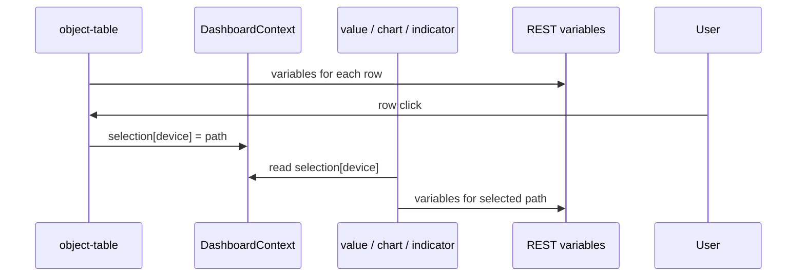
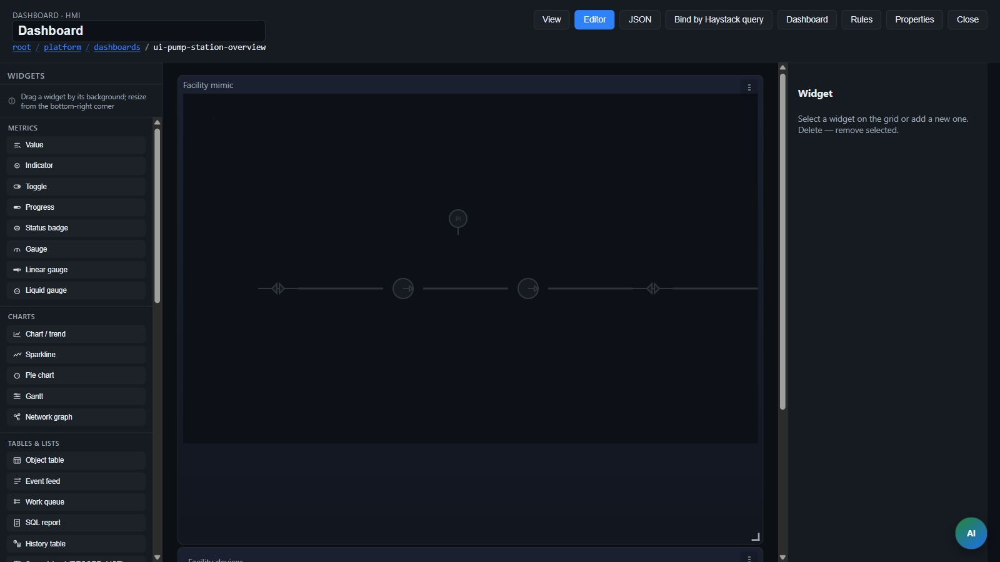

> **Language:** Canonical English. Russian edition: [ru/dashboards.md](../ru/dashboards.md).

# Dashboards and widgets

> **Status:** Stable — 84×8 grid is canonical. Screenshots: [assets/README](../assets/README.md).

**Full widget reference** (purpose, settings, examples): **[widgets](widgets.md)**.

## Overview

A dashboard is a `DASHBOARD` object with the `dashboard-v1` model. Layout is stored in the `layout` variable (JSON string).

Model variables:

| Name | Description |
|------|-------------|
| `title` | Screen title |
| `layout` | Widget grid JSON |
| `refreshIntervalMs` | Poll interval (ms), default 5000 |
| `@dashboardContext` | **Planned** — JSON session (selection, params, widgets); see [platform-logic](platform-logic.md) |

Demos:

| Dashboard | Purpose |
|-----------|---------|
| `root.platform.dashboards.demo-sensor` | single object, static `objectPath` |
| `root.platform.dashboards.snmp-host-monitoring` | device table + `selectionKey: "device"` |

Default layouts: `packages/ispf-server/.../DashboardLayouts.java`.

## Grid

Canonical layout JSON:

| Field | Value |
|-------|-------|
| `columns` | **84** (12×7 fine columns) |
| `rowHeight` | **8** (px per height unit) |
| `x`, `y`, `w`, `h` | fine-grid units (full width = `w: 84`) |

There is no automatic migration from older 12×72 drafts — author layouts in **84×8** only.

### Screen composition (Builder and AI)

Dashboards must read as an operator board, not a pile of tiny cards.

| Role | Typical `w`×`h` |
|------|-----------------|
| KPI (value / indicator / gauge) | **21×14** or **28×14** (3–4 tiles, sum w = 84) |
| Chart / table / report | **≥42×28** |
| Nav chip / badge | **9–14×7** |
| SCADA mimic | **84×56…70** |

Rules: align rows (same `y` and `h`); fill the width; prefer multiples of 7; 4–10 widgets on an overview; KPI strip → primary widget → actions. Never use legacy `w=3,h=2` on the 84-column grid — it renders as a crumb.

## Object binding: `objectPath` and `selectionKey`

Widgets (`value`, `indicator`, `chart`, …) read variables from a **specific** platform object (`DEVICE`, `CUSTOM`, …). The path to that object is set in two ways.

### Where `objectPath` comes from

`objectPath` is a **field in the widget JSON** inside the `DASHBOARD` object's `layout` variable. It is not passed by a parent React component at runtime.

| Source | When |
|--------|------|
| Bootstrap | `DashboardLayouts.java` writes layout on first start |
| Dashboard Builder | admin picks an object in the **Object** field (`WidgetEditorPanel`) → `PUT .../layout` |
| Manual edit | edit layout JSON |

Static binding example (one sensor):

```json
{
  "type": "value",
  "objectPath": "root.platform.devices.demo-sensor-01",
  "variableName": "temperature",
  "valueField": "value"
}
```

### What `selectionKey` is

`selectionKey` is a **slot name** in shared dashboard state (`DashboardContext`), not a replacement for `objectPath`.

```typescript
selection: Record<string, string>
// { "device": "root.platform.devices.snmp-localhost" }
```

When rendering a widget, path resolution (`resolveWidgetPath` in `dashboardUtils.ts`):

1. If `selectionKey` is set **and** `selection[selectionKey]` is non-empty → use the **selected path**.
2. Otherwise → use the static `objectPath` from layout.
3. If both are empty → widget shows a hint such as "Select…" / "—".

`objectPath` is not overwritten by the key: the key only selects which context slot supplies the path after the user makes a selection.

### Publish/subscribe within a dashboard

Binding is **not** "widget A → widget B". It works by **matching** the `selectionKey` string:

| Role | Widget type | Field | Action |
|------|-------------|-------|--------|
| **Selection source** | `object-table` | `selectionKey`, `parentPath` | on row click: `setSelection(key, child.path)` |
| **Consumer** | `value`, `indicator`, `chart`, `sparkline`, `progress`, `gauge`, `status-badge`, `function`, `function-form` | same `selectionKey` | reads `selection[key]` as `objectPath` |

All widgets with the **same** `selectionKey` show data from the **same** object — that is expected (detail selection).

For **multiple independent selections** on one screen use **different** slot names, e.g. `"device"` and `"order"`.

### Example: SNMP host monitoring

Dashboard `root.platform.dashboards.snmp-host-monitoring`:

```json
{
  "id": "device-table",
  "type": "object-table",
  "parentPath": "root.platform.devices",
  "selectionKey": "device",
  "columnsJson": "[{\"variable\":\"sysName\",\"label\":\"Host name\"},{\"variable\":\"driverStatus\",\"label\":\"Driver\"}]"
}
```

**Net ↓ / net ↑** charts reference `ifInOctetsRate` / `ifOutOctetsRate` (B/s). Platform bindings `counterRate(ifInOctets)` / `counterRate(ifOutOctets)` in `snmp-agent-v1` models update on each SNMP poll; raw Counter32 values remain in `ifInOctets` / `ifOutOctets`. Details: [bindings](bindings.md).

```json
{
  "id": "hostname-value",
  "type": "value",
  "selectionKey": "device",
  "variableName": "sysName",
  "valueField": "value"
}
```

- The table loads children of `parentPath`; columns show variables on **each** row object.
- Row click publishes the path to `selection.device`.
- Widgets with `selectionKey: "device"` poll variables on the **selected** `DEVICE` only.

Consumers in this layout have **no** static `objectPath` — path comes entirely from selection.

### Where function values come from (on-screen data)

A dashboard does **not** call protocols (SNMP, Modbus, …) directly.

```text
Driver (poll) → DEVICE variables on server
       ↓
GET /api/v1/objects/by-path/variables?path=...
       ↓
Widget: variableName + valueField → display
```

For an SNMP device you need: a model with variables (`snmp-agent-v1`), an active driver, and `driverPointMappingsJson`. Names in `columnsJson` / `variableName` must **match** object variable names.

UI refresh: polling via `refreshIntervalMs` + WebSocket `/ws/objects` (`VARIABLE_UPDATED` invalidates the `variables` cache).

### Common configuration mistakes

| Situation | Result |
|-----------|--------|
| Table `selectionKey: "device"`, widget `selectionKey: "device"` | Works |
| Table `"device"`, widget `"order"` | Not linked |
| Two tables with one `selectionKey` | One slot; last click wins |
| `selectionKey` without a source table | Empty slot → fallback to `objectPath` or "—" |
| Both `objectPath` and `selectionKey` set | Non-empty selection **takes priority** |
| Column variable name does not match model | Cell shows "—" |

In the widget editor: **Selection key (selectionKey)** field (`WidgetEditorPanel`). Empty string disables context binding.

## Navigation between dashboards

Widgets can open another dashboard by **navigate** or **modal**.

| Mechanism | type | Fields |
|-----------|------|--------|
| Button | `dashboard-link` | `targetDashboardPath`, `openMode`, `buttonLabel`, `modalTitle` |
| Table row click | `object-table` | `rowTargetDashboard`, `rowOpenMode` (+ `selectionKey` to pass selection) |
| Card click | `card-grid` | `cardTargetDashboard`, `cardOpenMode`, `cardSelectionKey` |

Context selection (`selectionKey`) **persists** when navigating between dashboards in operator mode — a detail dashboard can read the same key.

Example: SNMP overview → device row click → detail panel with `selectionKey: "device"`.

```json
{
  "type": "dashboard-link",
  "title": "Details",
  "targetDashboardPath": "root.platform.dashboards.snmp-host-monitoring",
  "openMode": "modal",
  "buttonLabel": "SNMP monitoring",
  "modalTitle": "SNMP Host Monitoring"
}
```

In admin console, navigation opens a new editor tab; in operator mode it changes the active app tab or shows a modal over the HMI.

### Data flow diagram



## Dashboard logic (platform rules)

**Status:** specification (ADR [0019-platform-rule-unification](decisions/0019-platform-rule-unification.md)); runtime rollout is phased.

Today `DashboardContext` in web-console is React state + `sessionStorage`. Target model:

1. **`@dashboardContext`** — reserved JSON variable on the `DASHBOARD` object (durable session source).
2. **Platform rules** on the same object with `target.kind: context` or `event` — show/hide, modes, journal events.
3. **Widgets** — layout and data addressing only (`selectionKey`, `paramKey`); no `behaviorJson` / mini-DSL.

| Task | Mechanism (planned) |
|------|---------------------|
| Table → details | `selectionKey` + publishers write `selection.*` to context |
| Hide panel on alarm | rule → `widgets.alarm-panel.visible = false` |
| Fire event on mode change | rule → `target.kind: event` |
| Filter event-feed | CEL `condition`, not `payloadFilterExpr` |

More: [platform-logic](platform-logic.md), [bindings](bindings.md).

## Linked selection (`selectionKey`) — summary

See **Object binding** above. Historical work-order example: table + `progress` + `function-form` with `selectionKey: "order"`.

```json
{
  "columns": 84,
  "rowHeight": 8,
  "widgets": [
    {
      "id": "temp-value",
      "type": "value",
      "title": "Temperature",
      "x": 0, "y": 0, "w": 21, "h": 14,
      "objectPath": "root.platform.devices.demo-sensor-01",
      "variableName": "temperature",
      "valueField": "value",
      "decimals": 1,
      "unit": "°C"
    }
  ]
}
```

- Grid: **84** fine columns, position `x,y`, size `w,h` in fine-grid units (full width = `w: 84`)
- `rowHeight` — **8** px per grid row

## Grid layout: function-form (Lab Training exercise 6)

Example grid from **Lab Training** — dashboard `root.platform.dashboards.lab-form-grid`. One `function-form` widget invokes `appendTableRow` on the virtual lab device and writes into the `table` variable:

```json
{
  "columns": 84,
  "rowHeight": 8,
  "widgets": [
    {
      "id": "append-row",
      "type": "function-form",
      "title": "Append table row",
      "x": 0,
      "y": 0,
      "w": 42,
      "h": 28,
      "objectPath": "root.platform.devices.lab-userA-01",
      "functionName": "appendTableRow",
      "buttonLabel": "Append",
      "fieldsJson": "[{\"name\":\"int\",\"label\":\"Int\",\"type\":\"number\"},{\"name\":\"string\",\"label\":\"String\",\"type\":\"text\"}]"
    }
  ]
}
```

`fieldsJson` matches function arguments on the `virtual-lab-v1` model. Size `w:42` on an 84-column grid is half the screen; `h:28` is height in grid rows (`rowHeight` × 28 pixels).

Import ready-made layout: `POST /api/v1/platform/packages/import?packageId=lab-training` (see [lab-training](lab-training.md)).

## Widget types

Full catalog with every field and examples — **[widgets](widgets.md)**.

Quick index:

| type | Description | Documentation |
|------|-------------|---------------|
| `value`, `indicator`, `toggle` | Metrics and states | [§ value](widgets.md) |
| `chart`, `sparkline` | Trends (historian) | [§ chart](widgets.md) |
| `gauge`, `linear-gauge`, `liquid-gauge`, `progress` | Scales and progress | [§ gauge](widgets.md) |
| `function`, `function-form`, `input-form` | Actions and forms | [§ function](widgets.md) |
| `object-table`, `card-grid`, `map`, `object-tree` | Object catalogs | [§ object-table](widgets.md) |
| `dashboard-link`, `sub-dashboard`, `nav-menu` | Navigation | [§ dashboard-link](widgets.md) |
| `report`, `event-feed`, `work-queue` | Reports, events, BPMN | [§ report](widgets.md) |
| `spreadsheet` | Formula grid | [widgets.md § spreadsheet](widgets.md) + [spreadsheet-widget](spreadsheet-widget.md) |
| `panel`, `tab-panel`, `carousel`, … | Screen composition | [§ composition](widgets.md) |
| `label`, `image`, `html-snippet` | Decoration | [§ session/static](widgets.md) |
| `scada-mimic` | SCADA mimic diagram | [§ scada-mimic](widgets.md), [scada](scada.md) |

## Dashboard context (DashboardSession)

When opening a dashboard (navigate/modal) an **ephemeral** context is passed:

- `selection` — `{ "device": "root...devices.snmp-01" }` for `selectionKey`
- `params` — arbitrary JSON (`clusterPath`, …)

Field placement:

| Field | Purpose |
|-------|---------|
| `rowSelectionKey` / `rowParamsJson` | object-table / card-grid / map on click |
| `contextSelectionJson` / `contextParamsJson` | dashboard-link |
| `paramKey` / `contextPathKey` | read from session in widget |
| `modelHintPath` | sample object for variable dropdown in editor |

Operator URL: `?ctx.device=root.platform.devices.d1` or `?ctx={"selection":{"device":"..."}}`

Type sources: `apps/web-console/src/types/dashboard.ts`  
View components: `apps/web-console/src/components/dashboard/widgets/`  
Path resolution: `apps/web-console/src/components/dashboard/dashboardUtils.ts` (`resolveWidgetPath`), `hooks/useWidgetObjectPath.ts`

## `fieldsJson` (function-form)

```json
[
  {
    "name": "devicePath",
    "label": "Device",
    "type": "select",
    "optionsFrom": "root.platform.devices.demo-sensor-01",
    "defaultValue": "demo-sensor-01"
  },
  {
    "name": "threshold",
    "label": "Threshold",
    "type": "number"
  }
]
```

## `columnsJson` (object-table)

Columns reference **variable names** on the child object (not OID or driver fields). Cell value uses the `value` field on `DataRecord` (see `readFieldValue` in web-console).

```json
[
  { "variable": "sysName", "label": "Host name" },
  { "variable": "driverStatus", "label": "Driver" },
  { "variable": "sysUpTime", "label": "Uptime" }
]
```

To link tables to detail widgets set `selectionKey` (see § Object binding).

### Multi-pen trend (BL-89)

In runtime (not in the editor), right-click a row on an `object-table` with `variable` columns opens **Trend: …** context menu. Opens `MultiPenTrendModal`:

| Capability | Description |
|------------|-------------|
| Up to 4 pens | Add other variables from the same row via dropdown |
| Ranges | 1h, 6h, 24h, today, 7d (calendar ranges with user TZ — BL-70) |
| Pan/zoom | Recharts `Brush` under chart; double-click resets |
| Export | CSV of all pens |
| Point limit | 1000 per pen (historian API) |

Components: `MultiPenTrendModal.tsx`, `useMultiPenTrendData.ts`, `types/trendPen.ts`.

## Spreadsheet `sheetConfigJson`

The **spreadsheet** widget is a fixed `rows × cols` grid with A1 addressing. Recalculation runs on the client (built-in `ispfSheetEval`).

## Spreadsheet

The `spreadsheet` widget is an HMI table with formulas. Use it for shift calculators, summaries, and simple operator-screen math without Excel.

**Lab:** `root.platform.dashboards.lab-calculator` (**configured** mode).  
**Details:** [spreadsheet-widget](spreadsheet-widget.md). Operator usage: [operator-guide](operator-guide.md).

### On-screen UI

```
┌─ Calculator ─────────────────────────────────────────┐
│ [Undo][Redo][Copy][Paste][CSV]  ← free               │
│  B2  │ =A2*1.1                          ← formula bar│
├──────┴───────────────────────────────────────────────┤
│    │  A  │  B  │  C  │  D  │                        │
│  1 │ A  │ B  │ Sum│ ... │                        │
│  2 │ 10 │5.5 │15.5│ 11  │  ← values / results      │
└──────────────────────────────────────────────────────┘
```

| Area | Description |
|------|-------------|
| **Formula bar** | Address on the left (A1, B2…). Raw cell definition on the right: number, text, or formula with `=`. |
| **Column headers** | A, B, C… (Excel-style). |
| **Row numbers** | 1, 2, 3… left of the grid. |
| **Toolbar** | **free** mode only: undo/redo, copy/paste, CSV export. |
| **Column filters** | When set in layout — filter fields above the table (**configured** mode). |

**Binding** cells (live object data) are italic and **not editable**.

### Operator usage

#### Free grid mode (`sheetMode: free`, default)

Developer sets only grid size and optional seed values. **Operator enters formulas and data** on screen.

1. **Select a cell** — single click. Address and content appear in the formula bar.
2. **Enter a value** — double-click, **F2**, or **Enter** (when cell already selected):
   - number: `10`, `3.14`
   - text: `OK`, `Shift 1`
   - formula: start with `=`, e.g. `=A1+A2`, `=SUM(A1:A10)`, `=A2*1.1`
3. **Confirm** — **Enter** (move down) or click outside the cell. In the formula bar — **Enter** / **Tab** / blur.
4. **Cancel edit** — **Esc** (in cell or formula bar).
5. **Move** — **Tab** / **Shift+Tab**, arrow keys (focus must be on the grid: click the grid).
6. **Copy** — select cell → **Ctrl+C** or Copy button → select target → **Ctrl+V** or Paste.
7. **Export** — **CSV** downloads current **displayed** values (formula results, not raw `=...`).

Formulas recalculate immediately when dependent cells change (Excel-like).

**Example:** enter `100` in A1, `=A1*0.2` in B1, `=A1+B1` in C1 → C1 shows `120`.

#### Configured template mode (`sheetMode: configured`)

Layout defines cell kinds (`label`, `input`, `formula`, `binding`). Operator edits only **`input`** cells. Developer-defined formulas and bindings; formula bar is **read-only**.

1. Click an input field → change value → **Tab** / **Enter** for next field.
2. **formula** cells update automatically.
3. **binding** cells show live variable values.

**Lab calculator:** change A2 and B2 → Sum (C2), A×110% (D2), and column A total (C4) recalculate.

### Data persistence

| `persistMode` | Stored in | Cleared when |
|---------------|-----------|--------------|
| `session` (default) | Dashboard session params (`sessionKey`, usually `sheet:{widgetId}`) | Tab close / session reset |
| `variable` | Object variable (`valuesVariable`, RECORD_LIST `{cell, value}`) | Survives F5; shared for all operators on that object |

In **free** mode formulas are stored in `value` too: `{ "cell": "B2", "value": "=A2*2" }`.

Auto-save after a short debounce (~400 ms). Widget with `editable: false` is view-only.

### Formulas

Subset of Excel functions via `ispfSheetEval`: `SUM`, `AVERAGE`, `IF`, `ROUND`, cell refs (`A1`, `B2:B10`), and ISPF functions.

**ISPF platform functions** (read object data in formulas):

| Function | Example | Purpose |
|----------|---------|---------|
| `ISPREF` | `=ISPREF("root.platform.devices.lab-userA-01","intValue","value")` | Current variable value |
| `ISPSUM` | `=ISPSUM("ordersTable","int")` | Sum RECORD_LIST column (via binding cells) |
| `ISPHIST` | `=ISPHIST("root...device","temperature",5)` | Historian value for last N minutes |

Formula errors display as `#ERROR` in the cell.

### Dashboard Builder settings

| Field | Description |
|-------|-------------|
| `sheetMode` | `free` — free grid; `configured` — template with `kind` |
| `sheetConfigJson` | JSON: `rows`, `cols`, `cells`, optional `columnFilters`, `dataRegion`, `conditionalStyles` |
| `persistMode` | `session` \| `variable` |
| `valuesVariable` | Variable name when `persistMode: variable` (e.g. `sheetValues`) |
| `sessionKey` | Session key (default `sheet:{id}`) |
| `editable` | `false` — no HMI editing |
| `objectPath` | Object for variable persist and binding |

Editor template buttons: "Free grid", "Basic grid", "Calculator".

### Modes (`sheetMode`) — reference

| Mode | Behavior |
|------|----------|
| `free` (default) | **Free grid** — operator enters value or `=...` formula in any cell; editable formula bar; F2 / double-click |
| `configured` | **Template** — cells with `kind` in layout; only `input` editable; formula bar read-only |

In `free` mode `cells` in `sheetConfigJson` are **optional seed** values and `binding` for live data.

### Configured `sheetConfigJson` example

```json
{
  "rows": 6,
  "cols": 4,
  "frozenRows": 1,
  "cells": {
    "A1": { "kind": "label", "text": "A" },
    "A2": { "kind": "input", "default": "10" },
    "B2": { "kind": "formula", "expr": "=A2*2" },
    "C2": { "kind": "formula", "expr": "=SUM(A2:A10)" },
    "D3": {
      "kind": "binding",
      "objectPath": "root.platform.devices.lab-userA-01",
      "variableName": "intValue",
      "valueField": "value"
    }
  },
  "columnFilters": [{ "column": "A" }]
}
```

| `kind` | Purpose |
|--------|---------|
| `label` | Static header |
| `input` | Operator input |
| `formula` | Expression `=SUM(A1:A10)` etc. |
| `readonly` | Display only |
| `binding` | Live object variable value |

**Persistence:** `persistMode: "session"` (key `sessionKey`, default `sheet:{widgetId}`) or `"variable"` (`valuesVariable` — RECORD_LIST `[{cell, value}]`). In `free` mode `value` stores formulas too (`"=A2*2"`).

**Platform functions in formulas:** `ISPREF(path, var, [field])`, `ISPSUM(tableVar, column)`, `ISPHIST(path, var, [minutes])`.

**dataRegion** (optional): row block from RECORD_LIST variable — `variableName`, `startRow`, `startCol`, `columnFields`.

**conditionalStyles**: `[{ "when": "=B2>80", "style": { "backgroundColor": "#fee" } }]` — simple `>`, `<` conditions for cell highlight.

Lab demo: `root.platform.dashboards.lab-calculator` (`sheetMode: configured`), `sheetValues` on lab device.

**Reference package:** [examples/spreadsheet-demo](../../examples/spreadsheet-demo/) — `sheet-storage-v1` model, device `root.platform.devices.sheet-demo-01`, two dashboards (session/variable persist).

Full `sheetConfigJson`, `dataRegion`, `conditionalStyles` reference — [spreadsheet-widget](spreadsheet-widget.md).

## Element styles (`stylesJson`)

Any widget in layout may include **`stylesJson`** — a JSON object styling parts of the card. Edit in Dashboard Builder (**Element styles**) or manually in layout.

### Element keys

| Key | Element | Widget types |
|-----|---------|--------------|
| `card` | Root card | all |
| `title` | Title | all |
| `body` | Main container | all |
| `value` | Value / button / current number | value, chart, sparkline, gauge, progress, function |
| `unit` | Unit | value, progress |
| `meta` | Footer caption | value, gauge |
| `label` | Status text | indicator |
| `dot` | Indicator dot | indicator |
| `badge` | Status badge | status-badge |
| `table` | Table | object-table |
| `chart` | Chart area | chart, sparkline |

Values are **camelCase CSS properties** (`fontSize`, `color`, `whiteSpace`, `overflowY`, `display`…). Unknown properties are dropped.

### Example: long text in value

```json
{
  "value": {
    "fontSize": "0.82rem",
    "whiteSpace": "normal",
    "overflowY": "auto"
  },
  "meta": {
    "display": "none"
  }
}
```

In widget layout:

```json
{
  "type": "value",
  "title": "OS description",
  "variableName": "sysDescr",
  "selectionKey": "device",
  "stylesJson": "{\"value\":{\"fontSize\":\"0.82rem\",\"whiteSpace\":\"normal\",\"overflowY\":\"auto\"},\"meta\":{\"display\":\"none\"}}"
}
```

`stylesJson` styles apply **before** default classes (`dash-widget-metric`, `dash-widget-text`…), not instead of them. Numbers default to large font; strings compact; long text scrolls inside the card.

Sources: `widgetStyles.ts`, `DashWidgetShell.tsx`.

## Dashboard Builder (UI)



- **View mode** — live data, refresh per `refreshIntervalMs`
- **Edit mode** — drag, resize, widget property panel
- Save: `PUT /api/v1/dashboards/by-path/layout`
- **Federated dashboards** (`root.platform.federation.*` or federated `DASHBOARD`): layout/title save proxies to remote node; widget paths in UI stay local (see [federation](federation.md))

Components: `DashboardBuilder`, `DashboardGrid`, `WidgetEditorPanel`.

## Operator HMI

`?mode=operator&app=<appId>` — navigate dashboards from `operatorUi`, view-only layout (`DashboardBuilder` + `operatorMode`).  
Sidebar: work queue + event journal.

Dashboard binding: query param `dashboard` or tabs in `OperatorDashboardApp` (see `OperatorView.tsx`).

## API

```http
GET /api/v1/dashboards/by-path?path=root.platform.dashboards.demo-sensor
PUT /api/v1/dashboards/by-path/layout?path=...  (body: { "layoutJson": "..." })
PUT /api/v1/dashboards/by-path/title?path=...     (body: { "title": "..." })
```

For federated paths (`federationProxy=true`) the same `PUT` unmaps layout and writes on the remote node.

## Styles

Widget CSS: `apps/web-console/src/styles.css` (`dash-*`, `function-form-*` sections).
