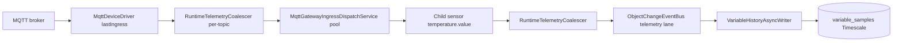

# ADR-0017: Telemetry ingest pipeline (MQTT gateway, thread pools, JDBC historian)

## Status

Accepted (2026-06-25)

## Context

High-rate MQTT telemetry exposed bottlenecks in the automation/historian path:

1. **N×MQTT drivers** — one broker connection per device.
2. **Single-thread binding executors** — async rules could not scale.
3. **Gateway `lastIngress`** — one coalesce slot capped dispatch rate (~20/s).
4. **JPA `saveAll` on `variable_samples`** — `IDENTITY` id prevented JDBC batching (~300 samples/s ceiling on prod VPS).

Event journal already uses `JdbcTemplate.batchUpdate` ([0016-clickhouse-event-journal](0016-clickhouse-event-journal.md)); historian still used JPA.

## Decision

### MQTT gateway orchestrator (`mqtt-gateway-v1`, fixture)

Fixture MIXIN model (registered when `ispf.bootstrap.fixtures-enabled=true`). See [0018-fixture-models-and-cel-applicability](0018-fixture-models-and-cel-applicability.md).

- One MQTT connection; driver writes ingress to `lastIngress` (`topic` + `raw`).
- Driver config: `ingressVariable=lastIngress`, `ingressTopicLanes=true` — per-topic coalesce keys in `RuntimeTelemetryCoalescer`.
- `MqttGatewayIngressDispatchService` — fixed thread pool (`ispf.mqtt-gateway.ingress-dispatch-threads`, default 8) calls `dispatchTelemetry` → `setDriverTelemetryValue` on child sensors (parsed `temperature.value`, no extra parse-binding hop on hot path).
- Legacy path: binding `dispatch-on-ingress` with `activators.async: true` when `ingressTopicLanes=false`.

### Thread pools (shared, not per-rule single-thread)

| Component | Config | Role |
|-----------|--------|------|
| `BindingRuleAsyncExecutor` | `ispf.binding.async-threads` (16) | Shared pool; per-rule burst coalesce |
| `RuntimeTelemetryCoalescer` | `coalesce-scheduler-threads` (4) | Per `(path\|variable\|topic)` debounce |
| `MqttGatewayIngressDispatchService` | `ingress-dispatch-threads` (8) | Parallel gateway dispatch |
| `ObjectChangeEventBus` | elastic workers + coalesce/scale schedulers | Telemetry vs automation lanes |
| `VariableHistoryAsyncWriter` | `writer-threads`, `batch-size`, `flush-interval-ms` | Async batch enqueue |

**Sync by design:** `BindingPropagationListener` — ordering before historian enqueue.

**Bus coalesce off by default:** `ispf.object-change.coalesce-telemetry-updates=false` — avoid double coalesce with `RuntimeTelemetryCoalescer`.

### Historian write path (`ispf.variable-history.store`)

| Store | Implementation | Use |
|-------|----------------|-----|
| `jdbc` (default) | `JdbcVariableHistoryWriteStore` — `JdbcTemplate.batchUpdate` | Prod high throughput |
| `jpa` | `JpaVariableHistoryWriteStore` — `saveAll` | Legacy / debug |
| `clickhouse` | Planned | Future ADR |

Defaults: `batch-size=500`, `flush-interval-ms=50`, `writer-threads=4`.  
PostgreSQL URL: `reWriteBatchedInserts=true`.

Timescale: hypertable `variable_samples`, retention 90d, compression segmentby `(object_path, variable_name, field_name)` after 7d.

### Telemetry publish mode

Per-device `telemetryPublishMode`:

| Mode | Historian | Automation bus | Event journal |
|------|-----------|----------------|---------------|
| `FULL` (default) | yes | yes | via alerts, API, correlators |
| `TELEMETRY_ONLY` | yes (fast path) | telemetry lane only | no |
| `EVENT_JOURNAL_ONLY` | no | skipped | yes (`fireIngress` fast path, [0027-event-journal-ingress-fast-path](0027-event-journal-ingress-fast-path.md)) |

Per-device `telemetryCoalesceMs` caps sample/event rate before downstream tiers (loadtest knob).

## Pipeline diagram

## Consequences

- Gateway loadtest with JDBC store and minimal coalesce shows higher historian throughput than JPA `saveAll` on the same topology; absolute rates depend on hardware, coalesce, and `min-interval-ms`.
- Throughput is bounded by `telemetryCoalesceMs`, device count, and store I/O; tune coalesce for production dashboards (typical tens of ms).
- Loadtest on prod often sets `ISPF_VARIABLE_HISTORY_MIN_INTERVAL_MS=1` (platform debounce default is much higher).
- ClickHouse / Cassandra historian stores are optional; see [0025-cassandra-scylla-timeseries-store](0025-cassandra-scylla-timeseries-store.md), [variable-history](../variable-history.md).

## Related

- [load-testing](../load-testing.md) — baselines and scripts
- [variable-history](../variable-history.md) — configuration
- [bindings](../bindings.md) — `activators.async`
- [0014-automation-pipeline-evolution](0014-automation-pipeline-evolution.md) — dual-lane bus
- [0009-timescaledb-retention](0009-timescaledb-retention.md) — Timescale retention
