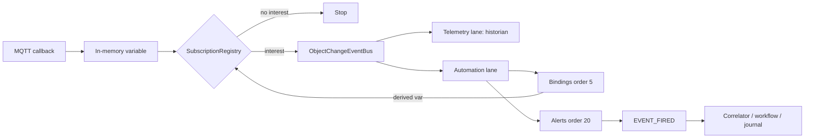

# ADR-0024: Demand-driven object change pub/sub (single JVM)

## Status

Accepted (2026-07-02)

## Context

High-rate MQTT telemetry exposed bottlenecks (see [ADR-0017](0017-telemetry-ingest-pipeline.md)):

- Every coalesced variable update published `ObjectChangeEvent` with `telemetry=true`, even when no historian subscriber exists.
- `BindingPropagationListener` ran **synchronously** at `HIGHEST_PRECEDENCE` on every variable update — blocking MQTT callback threads before the async event bus.
- Alert / workflow handlers received events even when no rule subscribed to `(path, variable)`.
- Planned BL-112 sidecar duplicated process boundaries; product direction is **one dedicated JVM** with core + plugin JARs.

Integrators expect broker-like semantics:

1. MQTT → in-memory value update (cheap).
2. **Event materializes only if a subscriber exists** (historian, binding, alert, workflow, UI, federation, …).
3. Async chain: binding → derived variable event → alert → `EVENT_FIRED` (gated) → correlator / workflow / SQL binding.
4. No subscriber → no platform `ObjectChangeEvent` (no CEL, no async handler work). Event journal rows still written for explicit `fire()` API calls.

## Decision

### 1. Single JVM, no sidecar

All ingress and automation stays in `ispf-server`. Horizontal scale = **N stateless JVM replicas** sharing one PostgreSQL (+ optional Redis/NATS), or a larger dedicated host with tuned thread pools — not a separate ingress worker process. See [ADR-0028](0028-horizontal-active-active-cluster.md).

### 2. Subscription registries

All publishers route through `ObjectChangePublicationService` (gate before `ApplicationEventPublisher`).

**`VariableChangeSubscriptionRegistry`** — `(objectPath, variableName)`:

| Source | Subscriber type |
| ------ | ---------------- |
| `Variable.historyEnabled` | Historian (telemetry lane) |
| `BindingDependencyIndex.consumers` | Platform bindings (automation lane) |
| `AutomationRuleIndex.findAlertRules` | Alert rules (automation lane) |
| `WorkflowEventTriggerIndex.findVariableWorkflows` | BPMN variable triggers (automation lane) |
| Workflow config vars `triggerJson` / `status` | Workflow trigger index rebuild |
| `ObjectWebSocketPathInterestRegistry` | Live UI refresh |
| `FederationExportInterestRegistry` | Outbound tunnel fanout |

**`EventFiredSubscriptionRegistry`** — `(objectPath, eventName)`:

| Source | Subscriber type |
| ------ | ---------------- |
| `BindingDependencyIndex.eventConsumers` | Platform binding `onEvent` activators |
| `AutomationRuleIndex.findCorrelatorsForEvent` | Event correlators |
| `WorkflowEventTriggerIndex.findEventWorkflows` | BPMN event triggers |
| `ApplicationSqlBindingEventIndex` | Application SQL bindings (`refresh_mode=on_event`) |

**`StructureChangeSubscriptionRegistry`** — `CREATED` / `UPDATED` / `DELETED`:

| Source | Subscriber type |
| ------ | ---------------- |
| Platform cache / visual groups | Internal maintenance (always) |
| `ObjectWebSocketPathInterestRegistry` | Live tree UI |
| `FederationExportInterestRegistry` | Outbound tunnel |
| `NatsEventBridge` (when enabled) | Cross-replica fanout |

### 3. Gate before publish

`ObjectChangePublicationService`:

- `publishVariableChange()` — runtime telemetry / binding cascade
- `publishConfigVariableChange()` — API config writes (ObjectManager)
- `publishEventFired()` — `EventService.fire*` (journal enqueue is unconditional)
- `publishStructureChange()` — tree CRUD

For variable updates:

- Publishes **only if** `interest.hasAny()` and at least one lane is active (`telemetry`, `automationEligible`, or `uiRefresh`).
- Sets `telemetry = interest.historian()`, `automationEligible = policy.automationEligible(path) && interest.automation()`.

For `EVENT_FIRED`:

- Publishes only when bindings, correlators, workflows, or SQL bindings subscribe.

### 4. Async binding chain

- `BindingPropagationAsyncHandler` (order 5, automation lane) handles `VARIABLE_UPDATED` and `EVENT_FIRED` when demand-driven.
- `BindingPropagationListener` retains dashboard context + legacy sync mode only.
- `AlertRuleListener` (order 20) runs after bindings on the same async lane.
- Binding-derived updates re-enter via `ObjectChangePublicationService` (cascade).

### 5. Configuration

```yaml
ispf:
  object-change:
    demand-driven-publication: true   # default true
```

When `false`, legacy behaviour: coalescer always sets `telemetry=true`; sync binding listener handles all variable updates.

## Pipeline (demand-driven)



## Expected throughput impact

| Scenario | Before | After (expected) |
| -------- | ------ | ---------------- |
| MQTT, no rules, no history | Events + sync binding overhead | **~0 platform events** — largest win under fan-in |
| Historian only (`TELEMETRY_ONLY`) | Sync binding + false automation flag | **~160+ samples/s** (no sync CEL on hot path) |
| FULL + alerts + bindings | ~100 events/s (sync CEL + async alerts) | **2–5×** — bindings off hot path; less garbage on bus |
| Alerts on derived binding output | Same event as driver tick | Correct cascade via second gated event |

Exact numbers depend on coalesce ms, device count, and CEL complexity — BL-113 CI gate tracks regression.

## Consequences

- Broker semantics aligned with integrator expectations.
- MQTT hot path no longer blocked by sync bindings.
- Zero-subscriber MQTT fan-in avoids useless platform work.


Risks:

- Live WebSocket UI still needs in-memory values (always updated); event-driven UI refresh only when interest exists (acceptable for HMI polling/WebSocket variable subscriptions).
- Subscription index must stay consistent when rules/workflows/history flags change (rebuild hooks already exist).

## Related

- [ADR-0017](0017-telemetry-ingest-pipeline.md)
- [ADR-0014](0014-automation-pipeline-evolution.md)
- BL-111…113 (EX-SCALE, sidecar superseded by this ADR)
