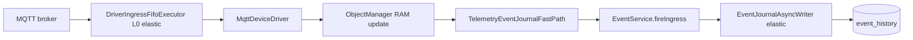

# ADR-0027: Event journal ingress fast path

## Status

Accepted (2026-07-04)

## Context

High-rate driver telemetry can be persisted as **event journal** records (one ingress update → one `event_history` row), not only as historian samples or automation-side effects.

Two anti-patterns were observed under flood load:

1. **HTTP per message** — external tap calling `POST /api/v1/events/fire` adds REST serialization and connection overhead on top of journal I/O; useful for API smoke tests, not representative of in-process driver ingress.
2. **FULL automation path** — coalesced telemetry → object-change bus → alert CEL → `EventService.fire` couples journal throughput to binding evaluation and dual-lane scheduling.

Production event journal already uses async batch writers ([0016-clickhouse-event-journal](0016-clickhouse-event-journal.md), [0015-event-history-timescale](0015-event-history-timescale.md)). The missing piece was a **driver-native hot path** that enqueues journal writes without HTTP and without traversing the telemetry/automation bus.

## Decision

### Telemetry publish mode `EVENT_JOURNAL_ONLY`

Third per-device mode alongside `FULL` and `TELEMETRY_ONLY`:

| Mode | RAM live value | Historian | Object-change bus | Event journal |
|------|----------------|-----------|-------------------|---------------|
| `FULL` | yes | yes (via bus / bindings) | yes (automation lane) | via alerts, API, correlators |
| `TELEMETRY_ONLY` | yes | yes (fast path) | telemetry lane only | no |
| `EVENT_JOURNAL_ONLY` | yes | no | skipped | yes (fast path) |

Configure on driver binding:

```json
{
  "driverId": "mqtt",
  "telemetryPublishMode": "EVENT_JOURNAL_ONLY",
  "telemetryCoalesceMs": 1,
  "configuration": {
    "brokerUrl": "tcp://127.0.0.1:1883",
    "ingressEventName": "messageReceived"
  }
}
```

- `ingressEventName` — event descriptor on the device (default `messageReceived`). Payload includes MQTT `raw` when present on the updated variable.
- Object must define the event (`EventDescriptor`) before fire; loadtest model `mqtt-sensor-v1` registers `messageReceived`.

### `TelemetryEventJournalFastPath`

After `ObjectManager.setDriverTelemetryValueInMemory`, when mode is `EVENT_JOURNAL_ONLY`:

1. Resolve event name from driver binding.
2. Call `EventService.fireIngress()` — same async journal enqueue as alerts, **without** surrounding transaction (hot path).
3. Return immediately; skip `TelemetryHistorianFastPath`, `TelemetryIngressDispatcher`, and `RuntimeTelemetryCoalescer`.

Metric source tag: `EventFireSource.INGRESS` (`ispf.automation.events_fired` by source).

### Direct ingress (skip L1 buffer)

Same rule as historian fast path ([0026-elastic-telemetry-ingress](0026-elastic-telemetry-ingress.md)): devices on `EVENT_JOURNAL_ONLY` bypass the server `DriverIngressBuffer` (L1) so MQTT L0 and platform tiers are not stacked.

### Elastic L0 (0.9.87+)

Journal load tests default to **`ingressCoalesceEnabled=false`** (FIFO per message, no last-value-wins on L0). Each Paho callback enqueues into `DriverIngressFifoExecutor` with elastic threads (platform default 4→32). With coalesce enabled, L0 uses elastic `DriverIngressBuffer` with eager per-lane drain instead.

L1 remains bypassed for `EVENT_JOURNAL_ONLY`; elastic L3 does not apply because the telemetry ingress queue is skipped. Bottlenecks under sustained load are therefore **L0 FIFO** and **L5′ journal writer / store**, not L1/L3.

## Pipeline diagram



Contrast with HTTP tap (load test only):


Internal path removes HTTP and API transaction layers; absolute throughput still depends on CPU, journal store, and batch tuning.

## Load testing

Scripts (no fixed throughput claims — measure on your hardware):

| Script | Path measured |
|--------|----------------|
| `deploy/mqtt-event-journal-test-remote.sh` | mqtt driver → `fireIngress` → journal |
| `deploy/mqtt-event-ingest-test-remote.sh` | External MQTT tap → HTTP fire (API baseline) |
| `deploy/lab-mqtt-event-journal-multi-test.sh` | **Lab:** 16× mqtt → Scylla journal + Mosquitto `$SYS` metrics |
| `deploy/vps-ispf-fair-bench.sh` | **VPS:** 1× mqtt, sustained + peak emqtt phases, Scylla delta + `eventsFired` |
| `deploy/vps-ispf-fair-run.sh` | Orchestration: stack prep, restart ISPF, invoke fair bench |
| `deploy/vps-event-journal-peak-tuning.sh` | Idempotent VPS env: journal queue/batch/flush + elastic writers |

Setup helper: `deploy/setup-mqtt-event-journal.py` (single device); multi-device: `deploy/setup-mqtt-event-journal-devices.py` with `--bench-no-l0-coalesce`.

See [load-testing](../load-testing.md) and **[lab-event-journal-stress](../lab-event-journal-stress.md)** (Scylla lab host, multi-device emqtt, metrics interpretation).

**Lab baseline (2026-07-04, ISPF 0.9.88, 16 mqtt devices, Scylla):** sustained journal **~110k events/s** (~6.8k/device); `eventsFired` → flushed → Scylla meta **100%** (no journal loss). Apparent «~17% efficiency vs configured MQTT target» is an emqtt formula / CPU-cap artifact, not ISPF dropping messages. Bottleneck at peak: Scylla write CPU.

**VPS prod single-device (2026-07-05, ISPF 0.9.87, Scylla 1 SMP / 750 MB, `EVENT_JOURNAL_ONLY`, `ingressCoalesceEnabled=false`):**

| Phase | emqtt params | eventsFired/s | Notes |
|-------|--------------|---------------|-------|
| Before elastic L0 (fixed 4 threads) | 65s, 20×10ms | **~384** | L0 thread pool saturated |
| After elastic L0 + L5′ (defaults) | 65s, 20×10ms | **~1878** | ~4.9×; `eventJournalSyncFallbackTotal=0` |
| After journal peak tuning | 65s, 32×1ms | **~15k** (eventsFired delta) | Queue 500k, batch 1k, flush 20ms; no sync fallback |

Journal peak tuning on VPS (`deploy/vps-event-journal-peak-tuning.sh`): `ISPF_EVENT_JOURNAL_QUEUE_CAPACITY=500000`, `BATCH_SIZE=1000`, `FLUSH_INTERVAL_MS=20`, elastic writers 4→32. Without larger queue, peak overload caused `Event journal queue full` and sync persist on L0 FIFO threads.

Interpretation: use **`eventsFired` delta** and **`eventJournalSyncFallbackTotal`** during/after run; `SELECT COUNT(*)` on Scylla may timeout while the node is hot (1 SMP). Allow settle (25s+) before partition counts on peak phases.

## Consequences

- **Use case:** audit trail of raw ingress (messages, frames) at high rate without historian or alert rules.
- **Not a replacement for** `FULL` automation or `TELEMETRY_ONLY` dashboards — orthogonal modes.
- **Coalesce:** per-device `telemetryCoalesceMs` still applies before platform tiers; for near 1:1 message→event use minimal coalesce in lab only.
- **Bench L0:** set `ingressCoalesceEnabled=false` on the mqtt driver (loadtest scripts default) so L0 last-value-wins coalesce is off; elastic workers via server defaults (`ISPF_DRIVER_MQTT_CALLBACK_ELASTIC`, min/max threads, scale thresholds) or per-device `callbackElasticEnabled` / `callbackThreadsMin/Max`. Optional `deploy/vps-event-journal-peak-tuning.sh` for journal queue under peak. High-rate fast paths skip RAM live-value updates when event journal or historian-only handles ingress.
- **WebSocket:** `publishEventFired` still runs on fast path; UI fan-out may become a limiter at extreme rates — tune separately ([0024-demand-driven-variable-change-pubsub](0024-demand-driven-variable-change-pubsub.md)).

## Related

- [0026-elastic-telemetry-ingress](0026-elastic-telemetry-ingress.md) — multi-level telemetry ingress
- [0017-telemetry-ingest-pipeline](0017-telemetry-ingest-pipeline.md) — publish modes and gateway
- [0016-clickhouse-event-journal](0016-clickhouse-event-journal.md) — ClickHouse journal store
- [AUTOMATION](../AUTOMATION.md) — events API and descriptors
- [load-testing](../load-testing.md) — measurement scripts
