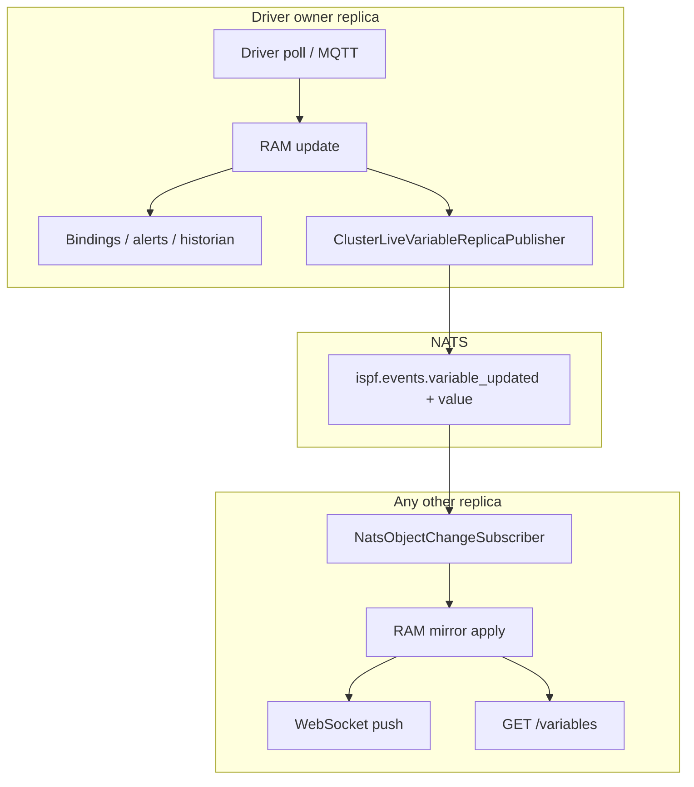

# ADR-0029: Cluster live variable replica sync

## Status

Accepted (2026-07-05)

## Context

[0028-horizontal-active-active-cluster](0028-horizontal-active-active-cluster.md) scales REST/API across N replicas with **exactly-one driver ownership**. Runtime telemetry (`setDriverTelemetryValue`) updates **in-memory values only on the driver owner** — not PostgreSQL per tick.

Cross-replica behaviour today:

| Mechanism | Gap |
| --------- | --- |
| NATS `ispf.events.*` | Notification only (`path`, `variableName`) — **no value** |
| `NatsEventBridge` | Skips `telemetry=true` events — raw historian variables never fan-out |
| `GET /variables` | Reads **local RAM** — round-robin REST hits stale replicas |
| WS `ip_hash` vs REST `least_conn` | Push and refetch may land on different JVMs |
| `ObjectWebSocketPathInterestRegistry` | **Per-JVM** — owner does not publish when UI watches another replica |

Result: multi-replica HMI is best-effort unless clients stick to the driver owner.

## Decision

### 1. Single-writer live values, cluster-wide read mirror

```text
Driver owner (replica-A)
  → RAM update
  → automation (bindings, alerts, historian) — owner only
  → NATS replica sync (coalesced payload with value snapshot)

Follower (replica-B)
  → apply value to local RAM (no DB flush, no automation re-run)
  → local WS push (replicaIngress event)
  → REST GET /variables returns fresh RAM
```

**Owner remains the sole writer** for driver I/O and automation cascade. Followers are **read mirrors** for live values.

### 2. NATS payload extension (backward compatible)

Replica fan-out subject unchanged: `ispf.events.variable_updated` (and JetStream stream when enabled).

Additional optional fields:

```json
{
  "type": "VARIABLE_UPDATED",
  "path": "root.platform.devices.snmp-router-01",
  "variableName": "ifInOctets",
  "timestamp": "2026-07-05T12:00:00Z",
  "source": "replica-2",
  "observedAt": "2026-07-05T12:00:00.123Z",
  "value": { "schema": { "...": "..." }, "rows": [ { "value": 1234567890 } ] }
}
```

Messages **without** `value` keep legacy behaviour (WS notify only).

Outbound publishes are **coalesced** per `(path, variableName)` using **`ispf.cluster.live-variable-sync-coalesce-ms`** (default **500 ms**, independent of `ispf.runtime-telemetry.coalesce-ms`).

### 3. `replicaIngress` events

Follower RAM apply publishes `ObjectChangeEvent` with `replicaIngress=true`:

| Consumer | Behaviour |
| -------- | --------- |
| `NatsEventBridge` / `ClusterLiveVariableReplicaPublisher` | Skip (no loop) |
| `BindingPropagationAsyncHandler` | Skip automation |
| `VariableHistoryListener` | Skip (historian runs on owner only) |
| `ObjectWebSocketHandler` | Push to local WS clients |
| `ClusterObjectTreeReplicaSync` | Structure/config CRUD via PG reload ([0030-cluster-config-structure-replica-sync](0030-cluster-config-structure-replica-sync.md)); skips telemetry + `replicaIngress` |

Config/API variable writes (`revision` present) also replicate value snapshots so followers stay consistent without full path reload.

### 4. Cluster-wide WebSocket path interest (Redis)

When `ispf.cluster.enabled=true` and `ispf.redis.enabled=true`:

- Each WS `subscribe` / `unsubscribe` updates Redis ref-counts for path prefixes (`ispf:cluster:ws:interest:{path}`).
- `VariableChangeSubscriptionRegistry` treats **global** interest like local interest for demand-driven publish on the **owner**.

This ensures the driver owner publishes (and NATS-syncs) even when all UI clients are on other replicas.

Fallback without Redis: local interest only (same as pre-0029); sticky REST+WS recommended ([deployment](../deployment.md)).

### 5. Configuration

| Property | Env | Default |
| -------- | --- | ------- |
| `ispf.cluster.live-variable-sync-enabled` | `ISPF_CLUSTER_LIVE_VARIABLE_SYNC` | `true` when cluster enabled |
| `ispf.cluster.cluster-path-interest-enabled` | `ISPF_CLUSTER_PATH_INTEREST` | `true` when cluster + Redis enabled |
| `ispf.cluster.live-variable-sync-coalesce-ms` | `ISPF_CLUSTER_LIVE_VARIABLE_SYNC_COALESCE_MS` | `500` |

Disable live sync only for debugging or single-replica-equivalent deployments.

See [cluster](../cluster.md) for tuning examples and bandwidth estimates.

### 6. Ingress (nginx)

REST and WS **may** use independent load balancing when ADR-0029 is enabled — values are mirrored on all replicas.

Optional: unified upstream + affinity remains valid for lower NATS traffic.

## Pipeline



## Consequences

- True active-active HMI: any replica serves fresh live telemetry.
- Cross-object bindings on owner; consumers read mirrored values on any replica.
- Backward compatible NATS payload; gradual rollout.
- Redis interest closes demand-driven gap without sticky REST.

Risks:

- NATS bandwidth scales with `(variables × replicas × rate / cluster_coalesce)` — monitor in cluster load tests.
- Followers hold duplicate RAM (acceptable for typical device counts).
- Redis recommended for full UX; without it, owner may under-publish when UI is remote.

## Related

- [0028-horizontal-active-active-cluster](0028-horizontal-active-active-cluster.md) — cluster topology (update: live sync supersedes sticky REST requirement)
- [0024-demand-driven-variable-change-pubsub](0024-demand-driven-variable-change-pubsub.md) — demand-driven publish + global interest extension
- [0030-cluster-config-structure-replica-sync](0030-cluster-config-structure-replica-sync.md) — structure/config CRUD replica sync
- [cluster](../cluster.md) — operator guide with SNMP walkthrough and tuning
- [MESSAGING](../MESSAGING.md) — NATS payload fields
- BL-140…142 — implementation backlog
