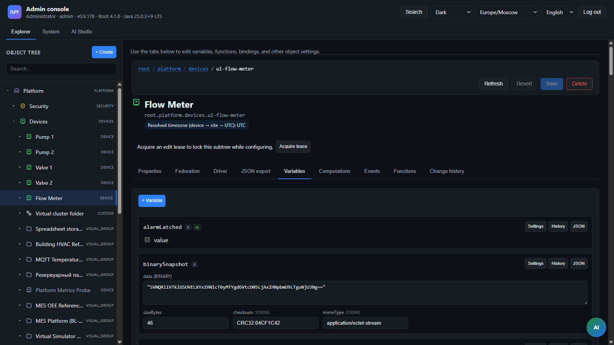

> **Language:** Canonical English. Russian edition: [ru/drivers.md](../ru/drivers.md).

# Device drivers

> **Status:** Beta — pack catalog is real; maturity varies (see PRODUCTION matrix / [driver-promotion](driver-promotion.md)). Hub: [doc-status.md](doc-status.md).

Candidate catalog for new drivers (roadmap.md): [roadmap](roadmap.md), full list below (REQ-PF-14).

## Driver maturity



| Level | Meaning |
|-------|---------|
| **production** | Full poll/read/write, tests, documented config |
| **beta** | Working connectivity, limited feature set |
| **stub** | TCP/session check or connectivity shell (v0.1) |
| **simulator** | Virtual/profile-based (see PF-09) |

Many REQ-PF-14 catalog entries are marked as stub — see the table below and [driver-promotion](driver-promotion.md).

Production readiness matrix — [0022-driver-production-matrix](decisions/0022-driver-production-matrix.md), `DriverProductionMatrix` + CI gate `DriverProductionMatrixTest`. Interop lab — [driver-interop-lab](driver-interop-lab.md) (BL-141).

### Top-20 industrial (BL-140, Phase 25)

In `DriverProductionMatrix` — **62** drivers at **PRODUCTION** (including `cwmp` / notification packs `email`/`sms`/`webhook` / `smb` outside top-20), **3** at **BETA** (`opc-da`, `opc-bridge`, `corba`), plus **97** individual catalog **STUB** packs (`ispf-driver-<id>`, Apache-2.0 TCP reachability shells). Top-20 industrial: **18** **PRODUCTION** + **2** **BETA** (`opc-da`, `opc-bridge`). List: `DriverProductionMatrix.TOP_20_INDUSTRIAL`. Full 162-pack audit: [driver-readiness](../evidence/ot-trust/driver-readiness.md).

> **Honesty (BL-191):** shells and incomplete stacks are **BETA**/**STUB** in the registry — `opc-da` / `opc-bridge` (connectivity shell + parser tests); protocol catalog stubs (`sparkplug-b`, `iec61850`, `profinet`, `beckhoff-ads`, …) are **STUB** until demand-driven promotion. Registry **PRODUCTION** still ≠ ready-for-field; promote via [driver-promotion](driver-promotion.md). See [competitive-scorecard](competitive-scorecard.md) OT dimension.

| `driverId` | Maturity (registry) | Notes / interop |
| ---------- | ------------------- | --------------- |
| `virtual`, `mqtt`, `modbus-tcp`, `modbus-rtu`, `modbus-udp` | PRODUCTION | see interop lab |
| `opcua`, `opcua-server`, `snmp`, `bacnet`, `s7`, `http`, `flexible` | PRODUCTION | see interop lab; OPC UA often SecurityPolicy None in lab |
| `iec104`, `dlms`, `gps-tracker` | PRODUCTION | see interop lab |
| `cwmp` | PRODUCTION | outside top-20; Inform + Get/SetParameterValues |
| `dnp3` | PRODUCTION | **Poll/read only** — `writePoint` not implemented |
| `haystack`, `kafka`, `coap` | PRODUCTION | poll-only clients; loopback tests |
| `icmp`, `ip-host`, `telnet`, `ssh`, `modem-at` | PRODUCTION | IT/remote checks; read-only |
| `file`, `folder`, `application` | PRODUCTION | local host monitoring; read-only |
| `imap`, `pop3`, `jms` | PRODUCTION | mail/messaging clients; read-only |
| `soap`, `web-transaction`, `http-server` | PRODUCTION | HTTP-based; read-only |
| `jdbc`, `graph-db` | PRODUCTION | SELECT-only / query read; read-only |
| `sip`, `asterisk`, `radius` | PRODUCTION | telecom probes; read-only |
| `ldap`, `jmx`, `nmea`, `message-stream`, `dhcp` | PRODUCTION | IT/network checks; read-only |
| `ingress-syslog`, `ingress-snmp-trap`, `ingress-sflow` | PRODUCTION | UDP listeners, raw capture; `observed_at` |
| `iec104-server` | PRODUCTION | slave/server; write + quality; interop partner for `iec104` |
| `omron-fins`, `mbus` | PRODUCTION | industrial read; loopback tests |
| `smpp`, `xmpp` | PRODUCTION | messaging; `smpp` SMSC; loopback tests |
| `email`, `sms`, `webhook` | PRODUCTION | notification gateways (HTTP relay / webhook); per-device config |
| `ipmi`, `wmi` | PRODUCTION | hardware/OS probes; `wmi` Windows-only |
| `odbc` | PRODUCTION | SQL read; requires external ODBC-JDBC bridge JAR |
| `ethernet-ip` | PRODUCTION | UCMM CIP Read/Write Tag (atomic types); loopback CIP emulator test |
| `smi-s`, `vmware` | PRODUCTION | CIM-XML parse / vSphere SOAP (Login + RetrieveProperties); loopback tests |
| `opc-da`, `opc-bridge` | BETA | **Shell / mapping tests** — not full DA stack |

### observedAt (source timestamps, BL-79)

Poll drivers pass `updateVariable(name, value, observedAt)` to the historian ([0020-time-and-timezones](decisions/0020-time-and-timezones.md)):

| Driver id | observedAt | Source |
| --------- | ---------- | ------ |
| virtual | yes | unified poll tick |
| mqtt | yes | JSON `observedAt` / `timestamp` / epoch |
| modbus-tcp/rtu/udp | yes | shared instant on poll tick |
| opcua | yes | OPC UA SourceTime / ServerTime |
| s7 | yes | poll tick |
| snmp | yes | poll tick |
| bacnet | yes | poll tick |

## Architecture

Drivers implement the `DeviceDriver` SPI (`packages/ispf-driver-api`):

```java
public interface DeviceDriver {
    DriverMetadata metadata();
    void initialize(DriverObject driverObject);
    void connect() throws DriverException;
    void disconnect();
    boolean isConnected();
    void readPoints(Map<String, String> pointMappings) throws DriverException;
    void writePoint(String pointId, DataRecord value) throws DriverException;

    interface DriverObject {
        PlatformObject deviceObject();
        void updateVariable(String name, DataRecord value);
        default void updateVariable(String name, DataRecord value, Instant observedAt) { … }
        Optional<DataRecord> getVariable(String name);
        void log(DriverLogLevel level, String message);
        default Map<String, String> configuration() { return Map.of(); }
    }
}
```

**Ingress contract:** hot path `updateVariable` must not write DB/historian/disk — durable storage is async in the server. Full source: [`DeviceDriver.java`](../../packages/ispf-driver-api/src/main/java/com/ispf/driver/DeviceDriver.java). SDK walkthrough: [driver-ddk](driver-ddk.md).

Registration via **driver packs** in `${ISPF_DRIVER_PACKS_DIR}` (`LicensedDriverPackLoader` → `LicensedDriverRegistry` → `DriverCatalog`). Runtime — `DriverRuntimeService`: poll loop at `pollIntervalMs`.

Build packs: `./gradlew syncAllDriverPacks` → `build/driver-packs/<packId>/`. See [licensed-driver-packs](licensed-driver-packs.md).

## Device variables (driver group)

On a `DEVICE` object, variables in the `driver` group appear when **provisioning the driver** (`POST /objects` with `driverId` or `PUT .../drivers/runtime/configure`), not via auto-apply of MIXIN models.

### Auto-start on server boot

By default, configured drivers **start automatically** after `ApplicationReady`:

| Level | Setting | Default |
|-------|---------|---------|
| Global | `ispf.driver.auto-start-on-boot` / `ISPF_DRIVER_AUTO_START_ON_BOOT` (Platform Settings → Drivers) | `true` |
| Per DEVICE | variable `driverAutoStart` (checkbox in driver inspector) | `true` |

Disable one device: set `driverAutoStart=false`. Disable all: global `false` (requires server restart). Stopping a driver at runtime does **not** clear `driverAutoStart` — after reboot it starts again if the preference is on.

Device create: `autoStartDriver` defaults to `true` (start now + keep preference).

`DeviceProvisioningService` → `SystemObjectStructureService.ensureDeviceDriverStructure()` embeds the schema (`driverId`, `driverStatus`, `driverPollIntervalMs`, `driverConfigJson`, `driverPointMappingsJson`, `status`) from a blueprint without writing to the model catalog and without `appliedBlueprintIds`.

Fixture MIXIN model `device-driver-v1` (when `fixtures-enabled`) — for demo/lab and explicit apply; see [0018-fixture-models-and-cel-applicability](decisions/0018-fixture-models-and-cel-applicability.md).

| Variable | Description |
|----------|-------------|
| `driverId` | Driver ID — full list in the table below |
| `driverStatus` | `STOPPED` / `RUNNING` / `ERROR` |
| `driverPollIntervalMs` | Poll interval |
| `driverConfigJson` | Configuration JSON |
| `driverPointMappingsJson` | JSON: `variableName → pointId` (legacy string) or extended object with Haystack metadata (BL-59) |

### Extended point mappings (BL-59)

Legacy format — a string with protocol address per variable:

```json
{
  "temperature": "HOLDING:1:40001",
  "status": "COIL:1:0"
}
```

Extended object adds Haystack tags for export (`GET /api/v1/platform/haystack/export`) without separate variables per point:

```json
{
  "sineWave": {
    "point": "sim",
    "haystackTags": ["point", "sensor", "temp"],
    "unit": "°C",
    "dis": "Sine wave"
  },
  "status": "sim"
}
```

| Field | Aliases | Purpose |
|-------|---------|---------|
| `point` | `address`, `pointId` | Protocol address (same as legacy string) |
| `haystackTags` | `tags` | Marker tags for Haystack export |
| `unit` | — | Unit of measure (`°C`, `kW`, …) |
| `dis` | — | Display name of the point in export |

Runtime poll/write uses only the protocol address; Haystack fields are ignored by the driver but included in semantic export. Variables with `historyEnabled` are always exported; without history — only if the mapping includes Haystack metadata.

**BACnet example** (`analog-value:1:present-value`):

```json
{
  "supplyTemp": {
    "address": "analog-value:1:present-value",
    "haystackTags": ["point", "sensor", "temp", "supply"],
    "unit": "°C",
    "dis": "Supply air temperature"
  }
}
```

**OPC UA example** (`ns=2;s=TagName`):

```json
{
  "chillerKw": {
    "point": "ns=2;s=Chiller/ElectricPower",
    "tags": ["point", "sensor", "power"],
    "unit": "kW",
    "dis": "Chiller electric power"
  }
}
```

Demo: `root.platform.devices.lab-userA-01` (`HaystackBlueprintBootstrap.DEMO_POINT_MAPPINGS`).

Brick export (BL-60): apply `brick-metadata-v1` mixin, set `brickClass` URI on device → `GET /api/v1/platform/brick/export?format=jsonld|turtle`. `brick:hasPoint` from the same point mappings.

## REST Runtime API

```http
POST /api/v1/drivers/runtime/start?devicePath=root.platform.devices.demo-sensor-01
POST /api/v1/drivers/runtime/stop?devicePath=...
POST /api/v1/drivers/runtime/poll?devicePath=...&pointId=<optional>
POST /api/v1/drivers/runtime/write?devicePath=...&pointId=<variableName>
PUT  /api/v1/drivers/runtime/configure?devicePath=...
GET  /api/v1/drivers/runtime/status?devicePath=...
GET  /api/v1/drivers/runtime/browse?devicePath=...&nodeId=<optional>
```

`poll` without `pointId` refreshes all mapped points; with `pointId` — single mapping key only (BL-84).

`write` body — `DataRecord` with a `value` field (number, boolean, or string). `pointId` — key from `driverPointMappingsJson` (variable name).

## Driver packs (not bundled in server JAR)

Each protocol is a separate pack (`ispf-driver-*`). Without installed packs, `GET /api/v1/drivers` is empty.

### virtual (`ispf-driver-virtual`)

Out-of-the-box simulator for stands without hardware. **No profiles** — one poll path writes multi-type telemetry
(`temperature`+quality, waves, meter/flow, geo, tables, binary, booleans, `status`). Amplitudes/period come from
`driverConfigJson`. Domain plants (Mini-TEC, tank-farm, OGP) enrich the object via **mixin blueprints**
(variables + binding rules / functions), not via `driverConfigJson.profile`.

Example config:

```json
{
  "baseTemperature": "22.0",
  "amplitude": "15.0",
  "periodSec": "60",
  "sineAmplitude": "10.0",
  "sawtoothAmplitude": "5.0",
  "litersPerSecond": "120",
  "filling": "true"
}
```

Recommended model: `virtual-unified-v1` (or thinner `virtual-lab-v1` for waves). Agent: `create_virtual_device`.

### mqtt (`ispf-driver-mqtt`)

Eclipse Paho, topic subscription.

Config: `brokerUrl`, `topicPrefix`, `clientId`, credentials.

Point mapping: `variableName → mqttTopicSuffix`.

Loopback test: `MqttDeviceDriverTest` (embedded moquette broker, subscribe + publish write).

### modbus-tcp (`ispf-driver-modbus`)

j2mod, Modbus TCP. Poll/read/write via `readPoints` / `writePoint`.

Point format: `slaveId:registerType:address[:count]`

Register types: `HOLDING`, `INPUT`, `COIL`, `DISCRETE`.

Write (`writePoint`):

| Type | Modbus function | Field in `DataRecord` |
|------|-----------------|----------------------|
| `HOLDING` | Write Single Register (FC6) | `raw` or `value` (number) |
| `COIL` | Write Single Coil (FC5) | `value` (boolean) |
| `INPUT`, `DISCRETE` | — | read-only, error |

Config: `host`, `port`, `timeoutMs`, `pollIntervalMs`.

### modbus-rtu (`ispf-driver-modbus-rtu`)

j2mod, Modbus RTU serial. Same point format and write matrix as `modbus-tcp`.

Write: `HOLDING` (FC6), `COIL` (FC5); `INPUT`/`DISCRETE` read-only.

Config: `serialPort`, `baudRate`, `dataBits`, `stopBits`, `parity`, `timeoutMs`, `pollIntervalMs`.

### snmp (`ispf-driver-snmp`)

SNMP4J, v1/v2c/v3 GET/SET (v3: USM MD5/SHA + DES/AES128).

Point format: `oid`, `oid:VALUE_KIND` (`STRING`, `INTEGER`, …), or `oid:VALUE_KIND:optional` — the last variant does not abort poll when the OID is missing (for example `hrProcessorLoad` on a Windows SNMP agent).

Loopback test: `SnmpDeviceDriverTest` + in-process `SnmpLoopbackAgent` (GET/SET v2c).

Demo `snmp-localhost`: MIB-II + HOST-RESOURCES-MIB + IF-MIB (see model `snmp-agent-v1` and dashboard `snmp-host-monitoring`):

| Variable | OID |
|----------|-----|
| `sysName` | 1.3.6.1.2.1.1.5.0 |
| `sysDescr` | 1.3.6.1.2.1.1.1.0 |
| `sysUpTime` | 1.3.6.1.2.1.1.3.0 |
| `sysLocation` | 1.3.6.1.2.1.1.6.0 |
| `sysContact` | 1.3.6.1.2.1.1.4.0 |
| `hrMemorySize` | 1.3.6.1.2.1.25.2.2.0 |
| `hrSystemProcesses` | 1.3.6.1.2.1.25.1.6.0 |
| `hrSystemNumUsers` | 1.3.6.1.2.1.25.1.5.0 |
| `ifNumber` | 1.3.6.1.2.1.2.1.0 |
| `ifInOctets` | 1.3.6.1.2.1.2.2.1.10.2 (typical Linux NIC index 2) |
| `ifOutOctets` | 1.3.6.1.2.1.2.2.1.16.2 |
| `hrProcessorLoad` | 1.3.6.1.2.1.25.3.3.1.2.196608 (optional — Linux hrDevice index) |

Config v2c:

```json
{
  "host": "127.0.0.1",
  "port": "161",
  "community": "public",
  "version": "2c",
  "timeoutMs": "3000",
  "retries": "1"
}
```

Config v3 (additional fields; defaults `authProtocol: SHA`, `privProtocol: AES` — legacy `MD5`/`DES` remain selectable explicitly):

```json
{
  "version": "3",
  "securityName": "snmpuser",
  "authProtocol": "SHA",
  "authPassphrase": "authpass",
  "privProtocol": "AES",
  "privPassphrase": "privpass"
}
```

### http (`ispf-driver-http`)

HTTP/HTTPS client (Java HttpClient). Polls REST endpoints and can **write** POST/PUT/PATCH bodies to mapped URLs.

For **email / SMS / webhook notifications**, prefer dedicated drivers `email`, `sms`, `webhook` (separate packs and DEVICE config) — see below.

Point mapping: `path`, `GET:path`, `HEAD:path`, `POST:path`, full URL, `:json` suffix for a JSON scalar string on poll.

Write: `writePoint` posts a body to the mapped URL (GET/HEAD mappings upgrade to POST). Optional config `writePath` overrides the write URL.

```json
{
  "baseUrl": "http://127.0.0.1:8080",
  "timeoutMs": "5000",
  "writePath": "/v1/custom"
}
```

Example mappings: `{"platformVersion": "GET:/api/v1/info:json"}`

Capabilities: **read**, **write**. Maturity: **production**.

### email (`ispf-driver-email`)

Email notification gateway. POSTs JSON `{to,subject,body}` to a **per-device** HTTP relay.

Config: `relayUrl` (required), `timeoutMs`, optional `defaultTo`, `defaultSubject`.

Point mapping: `outbound` / `send` / `email` (poll = ready; no mail sent). Write fields: `to`, `subject`, `body`.

```json
{
  "relayUrl": "https://relay.example/email",
  "timeoutMs": "15000",
  "defaultTo": "noc@example.com"
}
```

Capabilities: **read**, **write**. Maturity: **production**. Loopback: `EmailDeviceDriverTest`. Distinct from inbound `imap`/`pop3` and from correlator global `email-relay-url`.

### sms (`ispf-driver-sms`)

SMS notification gateway via **HTTP SMS relay** (JSON `{to,body}`). Not SMPP — use `smpp` for SMSC bind/submit.

Config: `relayUrl` (required), `timeoutMs`, optional `defaultTo`.

Point mapping: `outbound` / `send` / `sms`. Write fields: `to`/`destination`, `body`/`text`/`message`.

```json
{
  "relayUrl": "https://sms-gw.example/send",
  "timeoutMs": "15000"
}
```

Capabilities: **read**, **write**. Maturity: **production**. Loopback: `SmsDeviceDriverTest`.

### webhook (`ispf-driver-webhook`)

Webhook notification gateway. POSTs JSON to a **per-device** `targetUrl` (aliases `relayUrl` / `url`).

Point mapping: `outbound` / `send` / `webhook`. Write: JSON object from fields, or raw JSON in `value`/`payload`/`body`.

```json
{
  "targetUrl": "https://hooks.example.com/alerts",
  "timeoutMs": "15000"
}
```

Capabilities: **read**, **write**. Maturity: **production**. Loopback: `WebhookDeviceDriverTest`. Distinct from generic `http` poll client.

### haystack (`ispf-driver-haystack`)

Project Haystack HTTP JSON client (SkySpark, FIN, Haxall). Poll-only v0.1: batch `read` by ref, connect probe via `about`.

Point mapping: Haystack ref id (`site.equip.supplyTemp` or `@site.equip.supplyTemp`).

```json
{
  "baseUrl": "https://skyspark.example.com",
  "project": "demo",
  "username": "su",
  "password": "secret",
  "timeoutMs": "5000"
}
```

Alternative: `authToken` (Bearer) instead of username/password.

Example mappings:

```json
{
  "supplyTemp": "site.mainAhu.supplyTemp",
  "runStatus": "@site.mainAhu.run"
}
```

Variable: `value` (number), `valueText` (bool/string), `ref`, `unit`, `dis`. Read-only (v0.1).

Loopback test: `HaystackDeviceDriverTest` (embedded `HttpServer` + JSON grid).

Maturity: **production** (poll/read). Out of scope v0.1: `watch`/subscribe, `pointWrite`, `hisRead`, Zinc codec.

### icmp (`ispf-driver-icmp`)

Host reachability (ICMP / `InetAddress.isReachable`).

Point mapping: hostname or IP per variable; empty value — `host` from config.

```json
{
  "host": "127.0.0.1",
  "timeoutMs": "3000"
}
```

Variable receives: `reachable`, `latencyMs`, `host`.

Maturity: **production**. Loopback test: `IcmpDeviceDriverTest` (localhost reachability).

### ssh (`ispf-driver-ssh`)

Remote shell command execution (JSch). Poll runs mapped commands; **write is opt-in**.

Point mapping: command per variable, for example `uptime`.

```json
{
  "host": "10.0.0.10",
  "port": "22",
  "username": "admin",
  "password": "secret",
  "timeoutMs": "10000",
  "writeEnabled": "true",
  "writeCommandAllowlist": "uptime,df -h,systemctl restart nginx"
}
```

Variable: `value` (stdout), `exitCode`, `stderr`.

Write (`writePoint`): requires `writeEnabled=true` and a non-empty `writeCommandAllowlist` (comma/newline-separated **full-match** regexes). Command from field `command` / `value` / `raw`, else the point mapping. Schedule can use `actionType: write_point`.

Capabilities: **read**, **write**. Maturity: **production**. Loopback: `SshDeviceDriverTest`. Limitation: `StrictHostKeyChecking=no`.

### coap (`ispf-driver-coap`)

CoAP client (Eclipse Californium), GET resources from IoT devices.

Point mapping: path `/sensor/temp` or full `coap://host:5683/...`

```json
{
  "host": "127.0.0.1",
  "port": "5683",
  "timeoutMs": "5000"
}
```

Loopback test: `CoapDeviceDriverTest` (in-process Californium CoAP server).

Maturity: **production** (poll/read; Observe not supported).

## Registered driver catalog (162)

The `maturity` field in `GET /api/v1/drivers`: `PRODUCTION` (default), `BETA`, `STUB`. Labels are set in `DriverMaturityRegistry` on the server and shown in the Web Console when selecting a driver.

The `capabilities` field — string set from `DriverProductionMatrix` (ADR-0022): `read`, `write`, `subscribe`, `discovery`, `observed_at`, `quality`. Example: `opcua` → `read`, `write`, `subscribe`, `discovery`, `observed_at`.

### Stub promotion (demand-driven)

58 core `driverId` values are in the production matrix; **97** additional protocol-catalog stubs ship as individual `ispf-driver-<id>` packs (**STUB**, TCP reachability only, **Apache-2.0**). Promotion to **PRODUCTION** is **not** on a roadmap schedule, but **on request from the app team** through the gate [0002-dogfooding-gate](decisions/0002-dogfooding-gate.md):

1. The app team describes the scenario (device, point mapping, acceptance test).
2. A platform PR adds protocol logic (replace the stub class in `ispf-driver-<id>`).
3. `DriverMaturityRegistry` / stub id list is updated; documentation in this file.

Current STUB/BETA candidates:

| `driverId` | Maturity | Note |
|------------|----------|------|
| `corba` | BETA | CORBA IIOP TCP shell — needs a third-party ORB |
| `opc-da`, `opc-bridge` | BETA | Classic OPC shells — prefer `opcua` or external DA→UA |
| Protocol catalog (`sparkplug-b`, `iec61850`, `profinet`, `beckhoff-ads`, `knx`, `lorawan`, …) | STUB | Generated one pack per id from `tools/driver-stubs/protocol-stubs.yaml` (shared base `ispf-driver-stub-kit`) |
| `vmware` | PRODUCTION | vSphere SOAP: Login + RetrieveProperties |
| `smi-s` | PRODUCTION | SMI-S CIM-XML parse |

Loopback tests (BL-26): `EthernetIpDeviceDriverTest`, `OpcDaDeviceDriverTest`, `OpcBridgeDeviceDriverTest`, `CorbaDeviceDriverTest`, `VmwareDeviceDriverTest` (`useHttp`), `SmisDeviceDriverTest` (`useHttp`).

See [ROADMAP.md § Phase 17.4](roadmap.md).

### Complete `driverId` catalog

What each driver does (all packs from `gradle/driver-packs.json`):

| `driverId` | Module | Maturity | License | What it does |
|------------|--------|----------|---------|--------------|
| `amqp` | `ispf-driver-amqp` | STUB | Apache-2.0 | AMQP 0-9-1 / 1.0 broker stub |
| `ansi-c12` | `ispf-driver-ansi-c12` | STUB | Apache-2.0 | ANSI C12.18/C12.22 meter stub |
| `application` | `ispf-driver-application` | PRODUCTION | Apache-2.0 | Local shell/script execution mapped to variables |
| `as-interface` | `ispf-driver-as-interface` | STUB | Apache-2.0 | AS-Interface master/gateway stub |
| `asterisk` | `ispf-driver-asterisk` | PRODUCTION | Apache-2.0 | Asterisk Manager Interface (AMI) commands |
| `aws-iot-core` | `ispf-driver-aws-iot-core` | STUB | Apache-2.0 | AWS IoT Core MQTT/HTTP stub |
| `azure-iot-hub` | `ispf-driver-azure-iot-hub` | STUB | Apache-2.0 | Azure IoT Hub device/service stub |
| `bacnet` | `ispf-driver-bacnet` | PRODUCTION | Apache-2.0 | BACnet/IP client (clean-room codec) |
| `bacnet-mstp` | `ispf-driver-bacnet-mstp` | STUB | Apache-2.0 | BACnet MS/TP serial stub (BACnet/IP pack is separate) |
| `barcode-scanner` | `ispf-driver-barcode-scanner` | STUB | Apache-2.0 | Barcode/QR TCP/serial scanner stub |
| `beckhoff-ads` | `ispf-driver-beckhoff-ads` | STUB | Apache-2.0 | Beckhoff TwinCAT ADS/AMS stub |
| `bluetooth-le` | `ispf-driver-bluetooth-le` | STUB | Apache-2.0 | Bluetooth Low Energy gateway stub |
| `camera-ai` | `ispf-driver-camera-ai` | STUB | Apache-2.0 | Edge vision/AI inference endpoint stub |
| `canbus-gateway` | `ispf-driver-canbus-gateway` | STUB | Apache-2.0 | Generic CAN/CAN-FD TCP gateway stub |
| `canopen` | `ispf-driver-canopen` | STUB | Apache-2.0 | CANopen / CAN gateway stub |
| `cc-link` | `ispf-driver-cc-link` | STUB | Apache-2.0 | Mitsubishi CC-Link field network stub |
| `cc-link-ie` | `ispf-driver-cc-link-ie` | STUB | Apache-2.0 | Mitsubishi CC-Link IE Field/Control stub |
| `coap` | `ispf-driver-coap` | PRODUCTION | Apache-2.0 | CoAP GET client (read-only) |
| `codesys` | `ispf-driver-codesys` | STUB | Apache-2.0 | CODESYS gateway / PLCHandler stub |
| `controlnet` | `ispf-driver-controlnet` | STUB | Apache-2.0 | ODVA ControlNet gateway stub |
| `corba` | `ispf-driver-corba` | BETA | Apache-2.0 | CORBA IIOP TCP reachability shell (no ORB in modern JDK) |
| `cwmp` | `ispf-driver-cwmp` | PRODUCTION | Apache-2.0 | TR-069/CWMP Inform + Get/SetParameterValues |
| `dali` | `ispf-driver-dali` | STUB | Apache-2.0 | DALI lighting gateway stub |
| `delta-dvp` | `ispf-driver-delta-dvp` | STUB | Apache-2.0 | Delta DVP / AS series PLC stub |
| `device-net` | `ispf-driver-device-net` | STUB | Apache-2.0 | ODVA DeviceNet gateway stub |
| `dhcp` | `ispf-driver-dhcp` | PRODUCTION | Apache-2.0 | DHCP discover probe |
| `dlms` | `ispf-driver-dlms` | PRODUCTION | Apache-2.0 | DLMS/COSEM meter master (TCP WRAPPER) |
| `dnp3` | `ispf-driver-dnp3` | PRODUCTION | Apache-2.0 | DNP3 TCP master — class poll/read (write not implemented) |
| `eebus` | `ispf-driver-eebus` | STUB | Apache-2.0 | EEBUS / SHIP energy management stub |
| `email` | `ispf-driver-email` | PRODUCTION | Apache-2.0 | Outbound email via HTTP relay gateway |
| `enocean` | `ispf-driver-enocean` | STUB | Apache-2.0 | EnOcean ESP3 / USB gateway stub |
| `ethercat` | `ispf-driver-ethercat` | STUB | Apache-2.0 | EtherCAT master/gateway stub |
| `ethernet-ip` | `ispf-driver-ethernet-ip` | PRODUCTION | Apache-2.0 | EtherNet/IP CIP UCMM Read/Write Tag (Allen-Bradley class) |
| `ethernet-powerlink` | `ispf-driver-ethernet-powerlink` | STUB | Apache-2.0 | Ethernet POWERLINK stub |
| `fanuc-focas` | `ispf-driver-fanuc-focas` | STUB | Apache-2.0 | Fanuc FOCAS CNC stub |
| `fatek` | `ispf-driver-fatek` | STUB | Apache-2.0 | Fatek FACON protocol stub |
| `file` | `ispf-driver-file` | PRODUCTION | Apache-2.0 | Local file metadata/content poll |
| `flexible` | `ispf-driver-flexible` | PRODUCTION | Apache-2.0 | Flexible TCP/UDP custom framing poller |
| `folder` | `ispf-driver-folder` | PRODUCTION | Apache-2.0 | Local directory listing poll |
| `foundation-fieldbus` | `ispf-driver-foundation-fieldbus` | STUB | Apache-2.0 | Foundation Fieldbus H1/HSE stub |
| `fuji-sph` | `ispf-driver-fuji-sph` | STUB | Apache-2.0 | Fuji Electric SPH / MICREX stub |
| `ge-srtp` | `ispf-driver-ge-srtp` | STUB | Apache-2.0 | Emerson/GE Fanuc SRTP stub |
| `genicam` | `ispf-driver-genicam` | STUB | Apache-2.0 | GenICam / GigE Vision stub |
| `gps-tracker` | `ispf-driver-gps-tracker` | PRODUCTION | Apache-2.0 | GPS/M2M TCP tracker listener |
| `graph-db` | `ispf-driver-graph-db` | PRODUCTION | Apache-2.0 | Graph DB query (Neo4j / Gremlin) |
| `graphql` | `ispf-driver-graphql` | STUB | Apache-2.0 | GraphQL HTTP stub |
| `grpc` | `ispf-driver-grpc` | STUB | Apache-2.0 | Generic gRPC telemetry stub |
| `hart-ip` | `ispf-driver-hart-ip` | STUB | Apache-2.0 | HART-IP (UDP/TCP) stub |
| `hart-serial` | `ispf-driver-hart-serial` | STUB | Apache-2.0 | HART FSK serial/modem stub |
| `haystack` | `ispf-driver-haystack` | PRODUCTION | Apache-2.0 | Project Haystack HTTP JSON client |
| `hitachi-hidic` | `ispf-driver-hitachi-hidic` | STUB | Apache-2.0 | Hitachi HIDIC / EH-150 stub |
| `http` | `ispf-driver-http` | PRODUCTION | Apache-2.0 | HTTP/HTTPS client poll (GET/POST JSON/text) |
| `http-server` | `ispf-driver-http-server` | PRODUCTION | Apache-2.0 | Embedded HTTP server endpoint for inbound requests |
| `icmp` | `ispf-driver-icmp` | PRODUCTION | Apache-2.0 | ICMP ping reachability / RTT probe |
| `idec-microsmart` | `ispf-driver-idec-microsmart` | STUB | Apache-2.0 | IDEC MicroSmart FC6A stub |
| `iec101` | `ispf-driver-iec101` | STUB | Apache-2.0 | IEC 60870-5-101 serial/TCP stub |
| `iec103` | `ispf-driver-iec103` | STUB | Apache-2.0 | IEC 60870-5-103 protection stub |
| `iec104` | `ispf-driver-iec104` | PRODUCTION | Apache-2.0 | IEC 60870-5-104 client (telecontrol) |
| `iec104-server` | `ispf-driver-iec104-server` | PRODUCTION | Apache-2.0 | IEC 60870-5-104 server/slave |
| `iec61850` | `ispf-driver-iec61850` | STUB | Apache-2.0 | IEC 61850 MMS client stub |
| `iec61850-goose` | `ispf-driver-iec61850-goose` | STUB | Apache-2.0 | IEC 61850 GOOSE subscriber stub |
| `iec61850-sv` | `ispf-driver-iec61850-sv` | STUB | Apache-2.0 | IEC 61850 Sampled Values stub |
| `iec62056` | `ispf-driver-iec62056` | STUB | Apache-2.0 | IEC 62056 DLMS companion / push stub (beyond existing DLMS pack) |
| `ieee2030-5` | `ispf-driver-ieee2030-5` | STUB | Apache-2.0 | IEEE 2030.5 (SEP2) stub |
| `imap` | `ispf-driver-imap` | PRODUCTION | Apache-2.0 | IMAP mailbox poll |
| `ingress-sflow` | `ispf-driver-ingress-sflow` | PRODUCTION | Apache-2.0 | sFlow v5 UDP listener (raw capture ingress) |
| `ingress-snmp-trap` | `ispf-driver-ingress-snmp-trap` | PRODUCTION | Apache-2.0 | SNMP trap UDP listener (raw capture ingress) |
| `ingress-syslog` | `ispf-driver-ingress-syslog` | PRODUCTION | Apache-2.0 | Syslog UDP listener (raw capture ingress) |
| `interbus` | `ispf-driver-interbus` | STUB | Apache-2.0 | INTERBUS fieldbus gateway stub |
| `io-link` | `ispf-driver-io-link` | STUB | Apache-2.0 | IO-Link master REST/MQTT bridge stub |
| `ip-host` | `ispf-driver-ip-host` | PRODUCTION | Apache-2.0 | Multi-check host probe (PING/HTTP/TCP/DNS/SMTP/FTP) |
| `ipmi` | `ispf-driver-ipmi` | PRODUCTION | Apache-2.0 | IPMI LAN BMC probe |
| `isa100` | `ispf-driver-isa100` | STUB | Apache-2.0 | ISA100 wireless gateway stub |
| `j1939` | `ispf-driver-j1939` | STUB | Apache-2.0 | SAE J1939 vehicle network stub |
| `jdbc` | `ispf-driver-jdbc` | PRODUCTION | Apache-2.0 | SQL JDBC SELECT poll |
| `jms` | `ispf-driver-jms` | PRODUCTION | Apache-2.0 | JMS client (ActiveMQ-class) |
| `jmx` | `ispf-driver-jmx` | PRODUCTION | Apache-2.0 | JMX local/remote MBean attribute poll |
| `kafka` | `ispf-driver-kafka` | PRODUCTION | Apache-2.0 | Apache Kafka consumer/poll |
| `keyence-hostlink` | `ispf-driver-keyence-hostlink` | STUB | Apache-2.0 | Keyence PLC Host Link / KV stub |
| `knx` | `ispf-driver-knx` | STUB | Apache-2.0 | KNX/IP tunneling/routing stub |
| `knx-tp` | `ispf-driver-knx-tp` | STUB | Apache-2.0 | KNX Twisted Pair interface stub |
| `ldap` | `ispf-driver-ldap` | PRODUCTION | Apache-2.0 | LDAP search probe |
| `lonworks` | `ispf-driver-lonworks` | STUB | Apache-2.0 | LonWorks/LonTalk IP stub |
| `lorawan` | `ispf-driver-lorawan` | STUB | Apache-2.0 | LoRaWAN network/application server gateway stub |
| `ls-xgt` | `ispf-driver-ls-xgt` | STUB | Apache-2.0 | LS Electric XGT FEnet stub |
| `lwm2m` | `ispf-driver-lwm2m` | STUB | Apache-2.0 | OMA LwM2M client/server stub |
| `matter` | `ispf-driver-matter` | STUB | Apache-2.0 | Matter / CHIP controller stub |
| `mbus` | `ispf-driver-mbus` | PRODUCTION | Apache-2.0 | M-Bus meter protocol (read-only v0.1) |
| `message-stream` | `ispf-driver-message-stream` | PRODUCTION | Apache-2.0 | Generic TCP/UDP message stream framing |
| `mitsubishi-melsec` | `ispf-driver-mitsubishi-melsec` | STUB | Apache-2.0 | Mitsubishi MELSEC communication stub (MC Protocol / SLMP path planned) |
| `mitsubishi-slmp` | `ispf-driver-mitsubishi-slmp` | STUB | Apache-2.0 | Mitsubishi SLMP (Seamless Message Protocol) stub |
| `modbus-rtu` | `ispf-driver-modbus-rtu` | PRODUCTION | Apache-2.0 | Modbus RTU master over serial |
| `modbus-tcp` | `ispf-driver-modbus` | PRODUCTION | Apache-2.0 | Modbus TCP master (FC read/write holding/input/coils) |
| `modbus-udp` | `ispf-driver-modbus-udp` | PRODUCTION | Apache-2.0 | Modbus UDP master |
| `modem-at` | `ispf-driver-modem-at` | PRODUCTION | Apache-2.0 | GSM/cellular modem AT commands over TCP/serial |
| `mqtt` | `ispf-driver-mqtt` | PRODUCTION | Apache-2.0 | MQTT client: subscribe topics and optional publish/write |
| `mqtt-sn` | `ispf-driver-mqtt-sn` | STUB | Apache-2.0 | MQTT For Sensor Networks stub |
| `mtconnect` | `ispf-driver-mtconnect` | STUB | Apache-2.0 | MTConnect agent HTTP stub |
| `nats` | `ispf-driver-nats` | STUB | Apache-2.0 | NATS messaging stub (cluster messaging is separate) |
| `nmea` | `ispf-driver-nmea` | PRODUCTION | Apache-2.0 | NMEA 0183 GNSS/sensor sentence parse |
| `ocpp` | `ispf-driver-ocpp` | STUB | Apache-2.0 | Open Charge Point Protocol (CSMS) stub |
| `odata` | `ispf-driver-odata` | STUB | Apache-2.0 | OData v4 REST stub |
| `odbc` | `ispf-driver-odbc` | PRODUCTION | Apache-2.0 | ODBC via external JDBC bridge JAR (SQL read) |
| `omron-fins` | `ispf-driver-omron-fins` | PRODUCTION | Apache-2.0 | Omron FINS PLC (read-only v0.1) |
| `onvif` | `ispf-driver-onvif` | STUB | Apache-2.0 | ONVIF Profile S/T device stub |
| `opc-ae` | `ispf-driver-opc-ae` | STUB | Apache-2.0 | OPC Classic A&E stub (DCOM/bridge required) |
| `opc-bridge` | `ispf-driver-opc-bridge` | BETA | Apache-2.0 | OPC/LON TCP bridge connectivity shell |
| `opc-da` | `ispf-driver-opc-da` | BETA | Apache-2.0 | OPC Classic DA connectivity shell (needs Windows DCOM/bridge) |
| `opc-hda` | `ispf-driver-opc-hda` | STUB | Apache-2.0 | OPC Classic HDA stub (DCOM/bridge required) |
| `opcua` | `ispf-driver-opcua` | PRODUCTION | Apache-2.0 | OPC UA client (Eclipse Milo): poll/subscribe/write/browse |
| `opcua-pubsub` | `ispf-driver-opcua-pubsub` | STUB | Apache-2.0 | OPC UA PubSub (UDP/MQTT) stub — connectivity shell only |
| `opcua-server` | `ispf-driver-opcua-server` | PRODUCTION | Apache-2.0 | OPC UA server (Eclipse Milo) exposing ISPF variables |
| `openadr` | `ispf-driver-openadr` | STUB | Apache-2.0 | OpenADR 2.0b VTN/VEN stub |
| `panasonic-mewto` | `ispf-driver-panasonic-mewto` | STUB | Apache-2.0 | Panasonic MEWTOCOL-COM/DAT stub |
| `plcnext` | `ispf-driver-plcnext` | STUB | Apache-2.0 | Phoenix Contact PLCnext Engineer/RSC stub |
| `pop3` | `ispf-driver-pop3` | PRODUCTION | Apache-2.0 | POP3 mailbox poll |
| `profibus` | `ispf-driver-profibus` | STUB | Apache-2.0 | PROFIBUS DP/PA gateway stub (serial/fieldbus bridge required) |
| `profibus-pa` | `ispf-driver-profibus-pa` | STUB | Apache-2.0 | PROFIBUS PA instrument network stub |
| `profinet` | `ispf-driver-profinet` | STUB | Apache-2.0 | PROFINET IO controller/device stub (DCP/RPC not implemented) |
| `pulsar` | `ispf-driver-pulsar` | STUB | Apache-2.0 | Apache Pulsar client stub |
| `radius` | `ispf-driver-radius` | PRODUCTION | Apache-2.0 | RADIUS authentication check |
| `redis` | `ispf-driver-redis` | STUB | Apache-2.0 | Redis key/stream telemetry stub |
| `rockwell-csp` | `ispf-driver-rockwell-csp` | STUB | Apache-2.0 | Allen-Bradley CSP (legacy Ethernet) stub |
| `rockwell-df1` | `ispf-driver-rockwell-df1` | STUB | Apache-2.0 | Allen-Bradley DF1 serial/TCP bridge stub |
| `rtsp` | `ispf-driver-rtsp` | STUB | Apache-2.0 | RTSP media/metadata stub |
| `s7` | `ispf-driver-s7` | PRODUCTION | Apache-2.0 | Siemens S7 ISO-on-TCP PLC read/write |
| `schneider-umac` | `ispf-driver-schneider-umac` | STUB | Apache-2.0 | Schneider Electric Unity/Modicon advanced services stub (beyond Modbus) |
| `scpi` | `ispf-driver-scpi` | STUB | Apache-2.0 | IEEE 488.2 SCPI instrument stub |
| `secs-gem` | `ispf-driver-secs-gem` | STUB | Apache-2.0 | SEMI SECS-I/HSMS/GEM stub |
| `sigfox` | `ispf-driver-sigfox` | STUB | Apache-2.0 | Sigfox backend callback stub |
| `sip` | `ispf-driver-sip` | PRODUCTION | LicenseRef-NIST-PublicDomain | SIP OPTIONS/REGISTER reachability probe |
| `smb` | `ispf-driver-smb` | PRODUCTION | Apache-2.0 | SMB/CIFS file share access |
| `smi-s` | `ispf-driver-smis` | PRODUCTION | Apache-2.0 | SMI-S storage CIM-XML poll |
| `smpp` | `ispf-driver-smpp` | PRODUCTION | Apache-2.0 | SMPP SMSC client |
| `sms` | `ispf-driver-sms` | PRODUCTION | Apache-2.0 | Outbound SMS via HTTP relay gateway |
| `snmp` | `ispf-driver-snmp` | PRODUCTION | Apache-2.0 | SNMP v1/v2c/v3 GET/SET poll client |
| `soap` | `ispf-driver-soap` | PRODUCTION | Apache-2.0 | SOAP HTTP client |
| `someip` | `ispf-driver-someip` | STUB | Apache-2.0 | AUTOSAR SOME/IP stub |
| `sparkplug-b` | `ispf-driver-sparkplug-b` | STUB | Apache-2.0 | MQTT Sparkplug B host/edge stub (MQTT session + Sparkplug payload parsing not implemented) |
| `ssh` | `ispf-driver-ssh` | PRODUCTION | Apache-2.0 | SSH remote command execution (JSch) |
| `telnet` | `ispf-driver-telnet` | PRODUCTION | Apache-2.0 | Telnet remote command session |
| `thread` | `ispf-driver-thread` | STUB | Apache-2.0 | Thread Border Router stub |
| `toshiba-t-series` | `ispf-driver-toshiba-t-series` | STUB | Apache-2.0 | Toshiba T-series PLC stub |
| `uds` | `ispf-driver-uds` | STUB | Apache-2.0 | Unified Diagnostic Services over DoIP stub |
| `unitronics` | `ispf-driver-unitronics` | STUB | Apache-2.0 | Unitronics PCOM stub |
| `virtual` | `ispf-driver-virtual` | PRODUCTION | Apache-2.0 | Simulator / virtual device profiles for demos and tests |
| `visa` | `ispf-driver-visa` | STUB | Apache-2.0 | IVI/VISA instrument resource stub |
| `vmware` | `ispf-driver-vmware` | PRODUCTION | Apache-2.0 | VMware vSphere SOAP (Login + RetrieveProperties) |
| `wago` | `ispf-driver-wago` | STUB | Apache-2.0 | WAGO PFC / e!COCKPIT stub |
| `weather-station` | `ispf-driver-weather-station` | STUB | Apache-2.0 | Davis/Vaisala-class weather station stub |
| `web-transaction` | `ispf-driver-web-transaction` | PRODUCTION | Apache-2.0 | Multi-step HTTP transaction script |
| `webhook` | `ispf-driver-webhook` | PRODUCTION | Apache-2.0 | Outbound webhook POST JSON notifications |
| `websocket` | `ispf-driver-websocket` | STUB | Apache-2.0 | Generic WebSocket telemetry stub |
| `weighbridge` | `ispf-driver-weighbridge` | STUB | Apache-2.0 | Truck scale / weighbridge protocol stub |
| `wirelesshart` | `ispf-driver-wirelesshart` | STUB | Apache-2.0 | WirelessHART gateway stub |
| `wisun` | `ispf-driver-wisun` | STUB | Apache-2.0 | Wi-SUN FAN border router stub |
| `wmbus` | `ispf-driver-wmbus` | STUB | Apache-2.0 | Wireless M-Bus (OMS) stub |
| `wmi` | `ispf-driver-wmi` | PRODUCTION | Apache-2.0 | Windows WMI via PowerShell (Windows only) |
| `xmpp` | `ispf-driver-xmpp` | PRODUCTION | Apache-2.0 | XMPP messaging client (Smack) |
| `yaskawa-memobus` | `ispf-driver-yaskawa-memobus` | STUB | Apache-2.0 | Yaskawa Memobus/Modbus-family PLC stub |
| `zigbee` | `ispf-driver-zigbee` | STUB | Apache-2.0 | Zigbee coordinator / ZCL stub |
| `zwave` | `ispf-driver-zwave` | STUB | Apache-2.0 | Z-Wave controller stub |

Detailed configs for base drivers — in the sections below. Others follow the same pattern: `driverConfigJson` + `driverPointMappingsJson`, see `DriverMetadata` in the module.

### v0.1 limitations (native / full stack required)

| `driverId` | What exists now | For production |
|------------|-----------------|----------------|
| `dlms` | TCP WRAPPER + read/write | Gurux association (auth NONE v0.2) |
| `opc-da` | status / proxy TCP | Windows DCOM bridge |
| `corba` | IIOP TCP | JDK CORBA removed; use bridge |
| Protocol catalog stubs | TCP reachability only | Demand-driven codec in dedicated pack |
| `wmi` | PowerShell | Windows only |

### Examples (brief)

### opcua (`ispf-driver-opcua`)

OPC UA client (Eclipse Milo). Poll/read/write via `readPoints` / `writePoint`; optional push via subscriptions.

Point mapping: `ns=2;s=TagName` (NodeId).

Write (`writePoint`): Milo `writeValue` on Value attribute; Variant type is chosen from the current node value (boolean, numeric, string, unsigned). Fields `value` or `raw`.

Config:

| Key | Default | Description |
|-----|---------|-------------|
| `endpointUrl` | `opc.tcp://localhost:4840` | OPC UA endpoint |
| `timeoutMs` | `5000` | Connect/read/write timeout |
| `pollIntervalMs` | `1000` | Scheduler poll interval |
| `readMode` | `poll` | `poll` — synchronous read; `subscribe` — ManagedSubscription push with poll fallback on error |

**Browse / discovery:** `GET /api/v1/drivers/runtime/browse?devicePath=…&nodeId=` (optional). Driver implements `DriverDiscovery`; Web Console inspector — "Browse OPC UA" on connected device.

**Security (v0.2):** production deployments should use Sign/SignAndEncrypt with client certificate and trust store. Current driver connects with **SecurityPolicy None** only (lab/loopback).

**ITM / plant OPC path (BL-229):** prefer this `opcua` driver for monitoring and write-back. Classic `opc-da` / `opc-bridge` remain **BETA** connectivity shells — for DA-only plant assets use an external DA→UA gateway (e.g. Kepware) and attach ISPF via `opcua`.

Maturity: **production**. Loopback tests: `OpcUaDeviceDriverTest` (browse, write, `readMode=subscribe`).

### s7 (`ispf-driver-s7`)

Siemens S7 over ISO-on-TCP. Poll/read/write via `readPoints` / `writePoint`.

Point mapping: `area:dbNumber:offset:type` (for example `DB:1:0:REAL`).

Supported types: `BOOL`, `BYTE`, `SINT`, `USINT`, `INT`, `UINT`, `WORD`, `DINT`, `UDINT`, `DWORD`, `REAL`, `LREAL`.

Write (`writePoint`):

| Type | Field in `DataRecord` |
|------|-------------------------|
| `BOOL` | `value` (boolean); read-modify-write of bit 0 in byte at offset |
| integer types | `raw` or `value` (number) |
| `REAL`, `LREAL` | `value` or `raw` (number) |

Config: `host`, `port` (102), `rack`, `slot`, `timeoutMs`.

### iec104 (`ispf-driver-iec104`)

IEC 60870-5-104 master (ISPF-owned codec). Config: `host`, `port` (2404), `commonAddress`, `timeoutMs`.

Point mapping: `ioa:dataType` (for example `2001:BOOL`, `3001:FLOAT`, `1001:M_ME_NA_1`).

**Write (BL-23):** `BOOL` / `M_SP_NA_1` → `singleCommand`; `FLOAT` / `M_ME_NC_1` → `setShortFloatCommand`; `INT` / `M_ME_NA_1` → `setNormalizedValueCommand`. After write the variable is updated locally (`quality=GOOD`); poll read may return `NOT_AVAILABLE` if the outstation does not respond to read command.

Loopback test: `Iec104DeviceDriverTest` against `iec104-server`.

Maturity: **production** (BL-140).

### iec104-server (`ispf-driver-iec104-server`)

IEC 60870-5-104 **slave/server** (ISPF-owned codec). Config: `listenPort` (2404), `commonAddress` (1). Devices of this driver accept master connections; decoded ASDUs (single command, short-float/normalized setpoints, measured values) update the IOA state and flow to ingress.

Point mapping: `<ioa>` (integer, for example `2001`). Variable: `value`, `quality` (`GOOD`/`NOT_CONNECTED`), `clientConnected`, `clientOriginatorAddress`.

**Write:** `writePoint` mutates the server-side IOA state (numeric from `raw`/`value`) and updates the variable synchronously; it does not emit ASDUs to connected masters.

Maturity: **production** (`POLL` + `WRITE` + `QUALITY`). Loopback test: `Iec104ServerDeviceDriverTest` (ISPF codec end-to-end). Limitations: any accepted TCP connection flips `clientConnected=true` (before the 104 handshake); `clientOriginatorAddress` is not populated from received ASDUs (always 0); `writePoint` has no connected guard.

### bacnet (`ispf-driver-bacnet`)

BACnet/IP read/write property (`present-value`) via ISPF-owned BACnet/IP UDP codec. Config:

| Key | Default | Description |
|-----|---------|-------------|
| `host` | `127.0.0.1` | Remote device IP (required for `discoveryMode=static`) |
| `port` | `47808` | Remote BACnet/IP UDP port |
| `localDeviceId` | `1234` | Local BACnet device instance |
| `remoteDeviceId` | `1001` | Target remote device instance |
| `discoveryMode` | `static` | `static` — use `host`/`port`; `whoIs` — discover via Who-Is/I-Am (host optional on loopback) |
| `timeoutMs` | `5000` | Connect/read timeout |
| `bindAddress` | `0.0.0.0` | Local UDP bind address |
| `bindPort` | same as `port` | Local UDP bind port when different from remote |

Point mapping: `objectType:instance:property` (for example `analog-value:1:present-value`).

**Read output:** `value` (typed string: analog float, binary `active`/`inactive`), `property`, optional `unit` (Haystack-friendly, from BACnet `units` on analog present-value).

**Write:** `analog-value` → `Real`; `binary-value` → `BinaryPV`. Read-only: `analog-input`, `binary-input`.

Maturity: **production**. Tests: guard-rails + owned UDP `BacnetLoopbackServer`; property read/write + discovery — `BacnetDeviceDriverNetworkTest` and `BacnetUdpExchangeTest`.

### dnp3 (`ispf-driver-dnp3`)

DNP3 TCP **master** with integrity poll Class 0/1/2/3 (ISPF-owned codec).

Config: `host`, `port`, `localAddress` (master link address, default `1`), `outstationAddress` (default `1024`), `timeoutMs`.

Point mapping: `index:dataType` — `BINARY_INPUT`, `BINARY_OUTPUT`, `ANALOG_INPUT`, `ANALOG_OUTPUT`, `COUNTER` (for example `0:ANALOG_INPUT`).

On each `readPoints`, `Request.classRequest(0,1,2,3)` runs; values and DNP3 flags (`status`) are updated on the object variables.

Maturity: **production** in registry for Class 0/1/2/3 **poll/read** (loopback `Dnp3DeviceDriverTest`, BL-140). **`writePoint` is not implemented** — do not plan control/write field pilots on DNP3 until write lands; treat as BETA for write scenarios.

### dlms (`ispf-driver-dlms`)

DLMS/COSEM **master** over TCP **WRAPPER** (ISPF-owned codec).

Config: `host`, `port` (default `4059`), `clientAddress` (default `16`), `logicalDevice` (default `1`), `timeoutMs`.

Point mapping: `logicalDevice:obis[:objectType[:attribute]]` — default `REGISTER`, attribute `2`.  
Examples: `1:1.0.1.8.0.255`, `1:0.0.42.0.0.255:DATA:2`.

`readPoints` / `writePoint`: SNRM + AARQ association, Gurux GET/SET. Write: fields `value` or `raw` (numeric for REGISTER).

Maturity: **production** (auth NONE; loopback `DlmsDeviceDriverTest`, BL-140).

### jmx (`ispf-driver-jmx`)

Remote JMX over RMI. Config: `serviceUrl` (`service:jmx:rmi:///jndi/rmi://host:port/jmxrmi`) — or leave empty to build the URL from `host`/`port`. There is no local/platform-MBeanServer mode; `timeoutMs` is declared but currently unused.

Point mapping: `objectName::attribute[.compositeKey]` — for example `java.lang:type=Memory::HeapMemoryUsage.used`. Prefer the `::` separator; the legacy single-colon form mis-parses objectNames (which always contain `:`).

Maturity: **production**. Loopback test: `JmxDeviceDriverTest` (JDK `JMXConnectorServer` + RMI registry in-JVM). Read-only.

### jdbc (`ispf-driver-jdbc`)

SQL scalar/row read over any JDBC driver. Config: `jdbcUrl`, `username`, `password`, `timeoutMs`.

Point mapping: a **full SELECT statement per point** (case-insensitive `SELECT` guard; connection is opened `setReadOnly(true)`). There is no `query` config key.

Variable: single-column result → `value` (first row); multi-column first row → one string field per column label (sanitized `[^a-zA-Z0-9_]` → `_`).

Maturity: **production**. Loopback test: `JdbcDeviceDriverTest` (H2 in-memory). Read-only (`writePoint` throws).

### graph-db (`ispf-driver-graph-db`)

Graph query client: Neo4j Bolt (`bolt://` URI, official neo4j-java-driver) or Gremlin-over-HTTP (`http(s)://` URI), selected by URI scheme. Config: `uri`, `username`, `password`, `timeoutMs`.

Point mapping: query script (Cypher or Gremlin depending on branch). Variable: `value` — Bolt branch: first column of the first record; Gremlin-HTTP branch: the raw response body (parse Gremlin JSON on the caller side).

Maturity: **production** for the Gremlin-HTTP branch (loopback `GraphDbDeviceDriverTest` vs embedded HttpServer); the Bolt branch requires a live Neo4j and is not covered by loopback tests. Read-only.

### file / folder

`file`: point mapping — file path (relative to `basePath` config or absolute). Variable: `exists`, `size`, `lastModified`, `value` (text preview, first 4 KB).  
`folder`: point mapping — directory path. Variable: `exists`, `fileCount`, `totalBytes`.

Maturity: **production**. Loopback tests: `FileDeviceDriverTest`, `FolderDeviceDriverTest` (JUnit temp dirs).

### application (`ispf-driver-application`)

Local process launch (ProcessBuilder; `cmd.exe /c` on Windows, `sh -c` elsewhere).

Config: `workingDir`, `timeoutMs`. **Command is the point mapping**, not a config key — mapping value is the full command line per variable.

Variable: `value` (stdout), `exitCode`, `stderr`.

Maturity: **production**. Loopback test: `ApplicationDeviceDriverTest`. Limitation: `timeoutMs` bounds the wait for process exit; a silently hanging child is killed on timeout but output streamed before the kill is lost.

### message-stream (`ispf-driver-message-stream`)

Raw TCP client or UDP client/listener. Config: `protocol` (`TCP`/`UDP`), `host`, `port`, `listen` (UDP only — TCP listen is explicitly unsupported), `bufferSize`.

Point mapping: mapping values are currently **not interpreted** — each poll reads the stream once and pushes the same record to every mapped point; conventionally map a `feed` point. Variable: `stream` (UTF-8 chunk, empty on timeout), `bytesRead`.

Maturity: **production**. Loopback test: `MessageStreamDeviceDriverTest` (UDP listener + TCP client vs local ServerSocket; blocking read bounded by soTimeout). Read-only.

### nmea (`ispf-driver-nmea`)

NMEA 0183 over **TCP only** (per-poll reconnect, up to 100 lines per poll). Config: `host`, `port` (10110). There is no serial mode — `mode`/`serialPort` keys are not implemented.

Point mapping: sentence-type **prefix**, case-insensitive (`startsWith` on the type token — `GP` matches `GPGGA`, bare `GGA` does not); the last matching line in the poll wins. Variable: `value` (JSON `{"type":…,"f1":…,"fN":…}`, `{}` on no match), `raw` (last matching sentence).

Maturity: **production**. Loopback test: `NmeaDeviceDriverTest` (local ServerSocket streaming GGA/RMC). Read-only.

### telnet / soap

`telnet` (`ispf-driver-telnet`): config `host`, `port`, `username`, `password`, `timeoutMs`; point mapping — shell command per variable. Variable: `value` (output), `exitCode`, `stderr`. Maturity: **production** — loopback `TelnetDeviceDriverTest`. Limitation: exit code is reported as `0` on completed sessions (Telnet has no exit-status channel).  
`soap` (`ispf-driver-soap`): config `endpointUrl`, `soapAction`, `timeoutMs`; point mapping — the **full SOAP envelope XML**, POSTed as-is (`Content-Type: text/xml`; `SOAPAction` header only when configured). Variable: `value` (whole response body), `statusCode`. HTTP 500 is mapped as `statusCode` + fault body, not thrown. Maturity: **production** — loopback `SoapDeviceDriverTest` (embedded HttpServer). Read-only.

### web-transaction (`ispf-driver-web-transaction`)

Multi-step HTTP scenario. Config: `stepsJson` (default steps), `timeoutMs`.

Point mapping: pipe-delimited `name:METHOD:url[:body]` steps or a JSON array `[{"name","method","url","body"}]`; a blank mapping falls back to the `stepsJson` config.

Variable: `statusCode`, `latencyMs`, `value` (final step body). Limitations: no cookies/session between steps, no per-step assertions or extraction, no auth, no per-step headers.

Maturity: **production**. Loopback test: `WebTransactionDeviceDriverTest` (2-step scenario vs embedded HttpServer). Read-only.

### http-server (`ispf-driver-http-server`)

Embedded HTTP server — external systems POST into the platform. Config: `listenPort`, `contextPath`.

Point mapping: `requests` (total count), `lastPath`, `lastBody`. Variable: `value`, `count`. Requests outside `contextPath` get 404 and are not counted.

Maturity: **production**. Loopback test: `HttpServerDeviceDriverTest`. Read-only — the `write` capability previously advertised via the legacy registry was removed (matrix `POLL` only).

### modem-at (`ispf-driver-modem-at`)

GSM modem AT commands over serial port or TCP (RFC2217-style bridge).

Config: `mode` (`tcp`/`serial`), `host`, `port` (TCP mode) or `serialPort`, `baudRate` (serial mode), `timeoutMs`.

Point mapping: AT command per variable (`AT+CSQ`, `AT+COPS?`, …). Variable: `value` (parsed payload), `response` (raw modem answer), `success`.

Maturity: **production**. Loopback test: `ModemAtDeviceDriverTest` (TCP AT stub).

### ip-host (`ispf-driver-ip-host`)

Unified IT monitoring. Config: `defaultHost`, `timeoutMs`. Point mapping prefixes:

| Prefix | Example | Check |
|--------|---------|-------|
| `PING:` | `PING:8.8.8.8` | ICMP |
| `HTTP:` | `HTTP:https://host/` | HTTP HEAD |
| `TCP:` | `TCP:host:443` | TCP connect |
| `DNS:` | `DNS:example.com` | DNS resolve |
| `SMTP:` | `SMTP:host:25` | SMTP banner |
| `FTP:` | `FTP:host:21` | FTP connect |

Maturity: **production**. Loopback test: `IpHostDeviceDriverTest` (local listeners + DNS/PING loopback).

### kafka (`ispf-driver-kafka`)

Config: `bootstrapServers`, `topic`, `groupId`, `timeoutMs`, `eventToVariable`.

Point mapping: `consume` (last message) or `produce:payload`.

Maturity: **production** (poll/read; `writePoint` is read-only — producing is done via `produce:` point mappings). Loopback test: `KafkaDeviceDriverTest`.

### jms (`ispf-driver-jms`)

JMS queue/topic client (ActiveMQ Classic client). Config: `brokerUrl`, `destination`, `destinationType` (`queue`/`topic`), `timeoutMs`.

Point mapping: `consume` (receive with timeout, destructive — AUTO_ACK) or `browse[:depth]` (queue depth, capped scan; queues only — topic browse is rejected).

Variable: `value` (payload / depth-as-string), `depth`.

Maturity: **production**. Loopback test: `JmsDeviceDriverTest` (embedded ActiveMQ `vm://` broker). Read-only (`writePoint` throws).

### imap (`ispf-driver-imap`)

IMAP mailbox monitoring (Jakarta Mail / angus-mail). Config: `host`, `port` (993), `username`, `password`, `folder` (`INBOX`), `useSsl` (`true`).

Point mapping: `messageCount`, `unseen`, `subject:N` (1-based message number). Variable: `value`, `count`.

Maturity: **production**. Loopback test: `ImapDeviceDriverTest` (GreenMail IMAP server). Read-only. Note: the store is re-opened on each poll.

### pop3 (`ispf-driver-pop3`)

POP3 mailbox monitoring (Jakarta Mail / angus-mail). Config: `host`, `port` (110), `username`, `password`.

Point mapping: `stat` (count + total size) or `retr:N` (1-based message number). Variable: `value`, `count`, `sizeBytes`. Note: `retr:N` returns the decoded message content (body), headers are not included.

Maturity: **production**. Loopback test: `Pop3DeviceDriverTest` (GreenMail POP3 server). Read-only.

### cwmp (`ispf-driver-cwmp`) — PRODUCTION

TR-069 CPE client: Periodic Inform to ACS, handles `GetParameterValues` RPC.

Config (`driverConfigJson`):

```json
{
  "acsUrl": "http://acs.example:7547/",
  "deviceId": "000000-000000000000",
  "timeoutMs": "5000",
  "informParameters": "Device.DeviceInfo.SoftwareVersion"
}
```

Point mapping: TR-069 parameter name (for example `Device.DeviceInfo.SoftwareVersion`) or `connected` (status of last Inform).

Write: `POST /api/v1/drivers/runtime/write` with `pointId` and `{ "rows": [{ "value": "..." }] }` — driver applies `SetParameterValues` locally and sends `SetParameterValuesResponse` to ACS. Requires prior poll (point mapping in memory). Pseudo-point `connected` — read-only.

### gps-tracker (`ispf-driver-gps-tracker`)

TCP **server** — devices connect to the platform. Config: `listenPort`, `bufferSize`.

Point mapping: `feed` — last line/buffer.

### flexible (`ispf-driver-flexible`)

Universal TCP/UDP. Version **0.2.0** — legacy mode and **exchange pipeline** for framed request/response.

#### Legacy (unchanged)

Config: `protocol`, `host`, `port`, `encoding` (`hex`|`utf8`|`escapes`), `timeoutMs`.

Point mapping: `request[:responseRegex]` — send and optional regex capture group 1.

#### Exchange pipeline

For ASCII/framed protocols (SOH/ETX, optional checksum, structured extractors). Typical case — **serial computer format over TCP**: ASCII function code + ASCII-hex floats; checksum on the wire is often **not verified** (`checksumAlgorithm: none`), because TCP already provides transport integrity.

Device config:

| Key | Value | Description |
|-----|-------|-------------|
| `readMode` | `idle` (default) \| `delimiter` | `idle` — read while buffer is empty; `delimiter` — until byte `readUntilHex` |
| `readUntilHex` | `03` | terminator (hex), when `readMode=delimiter` |
| `readMaxBytes` | `8192` | response limit |
| `checksumAlgorithm` | `none` \| `sum16-complement-hex` | `none` — typical for serial-over-TCP; `sum16-complement-hex` — when gateway requires verification |
| `checksumMarker` | `&&` | marker before checksum |
| `checksumLength` | `4` | checksum length (hex characters) |
| arbitrary keys | | substitution in `${key}` request templates |

Point mapping (pipeline):

```
req:{template}|var:{k}={v}|verifyChecksum|extract:{type}:{args}
```

| Segment | Example |
|---------|---------|
| `req:` | `\x01${securityCode}i20101` — `\xHH` escapes, `${var}` from config/point |
| `var:` | `tank=01` — per-point variables |
| `verifyChecksum` | explicit verification (or auto when `checksumAlgorithm`) |
| `extract:regex:{pattern}:{group}` | regex capture |
| `extract:asciiHexFloat:{index}` | N-th 8-nibble IEEE float in payload |
| `extract:asciiHexFloat:{index}:after:{marker}` | floats after ASCII marker |
| `extract:slice:{start}:{len}` | substring |
| `extract:literal:{text}` | constant |

Points with the same resolved `req:` are **grouped** — one TCP/UDP exchange per poll.

Example (ASCII serial-over-TCP, no checksum): [examples/framed-serial-tcp](readme.md).

Response schema: `value`, `raw`, `bytesRead` (STRING/STRING/INTEGER).

### mbus (`ispf-driver-mbus`)

M-Bus meter read (ISPF-owned TCP codec). Config: `connectionType` (`tcp`/`serial`), `host`, `port` (10001) or `serialPort` (2400 baud).

Point mapping: `primary:secondary:register` (for example `1:12345678:energy`); a non-zero secondary address switches to broadcast primary `0xFD`. Register matching: DIB/VIB pair or description; no match → first data record. Variable: `value` (raw value — scaling factors are **not** applied), `register`, `unit`.

Maturity: **production**. Loopback test: `MbusDeviceDriverTest` (fake M-Bus TCP meter, RSP_UD frames). Read-only. Limitations: serial path may be unimplemented in v0.1 ISPF codec; one synchronous meter round-trip per point.

### omron-fins (`ispf-driver-omron-fins`)

Omron FINS/TCP read. Config: `host`, `port` (9600), `destNode`, `srcNode`.

Point mapping: `area:address:count` — areas `CIO`, `WR`, `HR`, `AR`, `DM` (for example `DM:100:1`). Variable: `value` (comma-separated big-endian 16-bit words), `memoryArea`, `address`, `count`.

Maturity: **production**. Loopback test: `OmronFinsDeviceDriverTest` (fake FINS/TCP server: handshake + memory read). Read-only. Limitations: `connect()` is lazy (no handshake); a fresh TCP socket per point per poll.

### asterisk (`ispf-driver-asterisk`)

Asterisk AMI over TCP: banner → `Action: Login` → action block → parsed response. Config: `host`, `port` (5038), `username`, `secret`.

Point mapping: verbatim AMI action block (for example `Action: Ping`). Variable: `value` (first `Ping:`/`Message:` header or whole response), `response` (raw), `success`.

Maturity: **production**. Loopback test: `AsteriskDeviceDriverTest` (in-test AMI server). Read-only. Limitations: socket timeouts hardcoded 5 s; one TCP connection per point poll; login response is not validated.

### sip (`ispf-driver-sip`)

SIP probe (JAIN-SIP factories, raw UDP exchange). Config: `host`, `port` (5060), `username`, `domain`, `timeoutMs`.

Point mapping: `options` (OPTIONS ping; reachable on 2xx/3xx) or `register` (REGISTER probe; 200 = `registered`, 401/407 = `challenge`). Variable: `reachable`, `statusCode`, `value`.

Maturity: **production**. Loopback test: `SipDeviceDriverTest` (in-test UDP SIP responder). Read-only. Note: requires the log4j-1.2 API at runtime — the module bundles `reload4j` (jain-sip-ri declares log4j as `provided`).

### radius (`ispf-driver-radius`)

RADIUS authentication check (ISPF-owned PAP client, RFC 2865). Config: `host`, `port` (1812), `secret`, `username`, `password`, `timeoutMs`.

Point mapping: `auth`. Variable: `value` (`success`/`fail`), `success`, `responseCode` (RADIUS packet type; `-1` when no response — errors collapse to failure without exceptions).

Maturity: **production**. Loopback test: `RadiusDeviceDriverTest` (ISPF loopback auth server: Access-Accept / Access-Reject / unreachable). Read-only. Limitations: no CHAP/MS-CHAP, no accounting.

### smpp (`ispf-driver-smpp`)

SMPP 3.x (jsmpp). Config: `host`, `port`, `systemId`, `password`.

Point mapping:

| Mapping | Poll | Write |
|---------|------|-------|
| `bind` | session status | not writable |
| `outbound` / `write` | idle (`value=idle`) — no SMS | `to`/`destination` + `text`/`body`/`message`/`value` → `submit_sm` |
| `destination:message` | send `submit_sm` | optional override of destination/message |

Variable: `value`, `bound`, `messageId`. A fresh bind/session is opened per submit.

Capabilities: **read**, **write**. Maturity: **production**. Loopback test: `SmppDeviceDriverTest`.

### smb (`ispf-driver-smb`)

SMB/CIFS (smbj). Config: `host`, `share`, `username`, `password`, `domain`.

Point mapping: file path in share → `exists`, `size`.

### ldap (`ispf-driver-ldap`)

LDAP directory checks (UnboundID SDK). Config: `host`, `port` (389), `bindDn`, `password`, `useSsl`.

Point mapping: an LDAP filter `(objectClass=person)` → entry count, or `filter:attribute` (split at the last `:`; filter auto-wrapped in parens) → attribute value, for example `cn=admin:mail`. Variable: `value`, `count`.

Maturity: **production**. Loopback test: `LdapDeviceDriverTest` (UnboundID `InMemoryDirectoryServer`). Read-only. Limitations: search base DN is hardcoded to the root DSE (`""`) — real directories may reject anonymous null-base searches; a fresh connection per poll.

### dhcp (`ispf-driver-dhcp`)

DHCP DISCOVER probe (minimal hand-built client). Config: `interfaceName`, `bindAddress`, `timeoutMs`, plus optional `serverPort` (67), `listenPort` (68), `broadcastAddress` (`255.255.255.255`) — the defaults require privileged ports and broadcast capability.

Point mapping: `serverIp` (option 54, falls back to yiaddr) or `lease` (`obtained`/`none`). Variable: `value`, `leased`, `leaseSeconds` (option 51).

Maturity: **production**. Loopback test: `DhcpDeviceDriverTest` (in-test UDP OFFER responder via the injectable ports). Read-only. Limitation: DISCOVER only — no REQUEST/renew, only options 54/51 parsed.

### ingress-syslog (`ispf-driver-ingress-syslog`)

UDP syslog **raw datagram capture** (default port 514; `bindAddress` honored). No RFC5424/3164 field extraction — message text is forwarded unparsed.

Each datagram → fixed variable `lastDatagram` (`message`, `sourceHost`, `sourcePort`, `bytes`) with `observedAt`. `readPoints` publishes stats (`messagesReceived`, `lastMessage`, `listening`) to every mapped point.

Maturity: **production**. Loopback test: `SyslogIngressDeviceDriverTest` (datagram → record + stats). Read-only.

### ingress-snmp-trap (`ispf-driver-ingress-snmp-trap`)

SNMP trap **raw capture** on UDP/162 (privileged on Linux; `bindAddress` honored). BER payload is stored as opaque bytes — OID/varbind decode is deliberately downstream (correlator/rules).

Each trap → fixed variable `lastTrap` (`payloadBase64`, `payloadHex` preview, `sourceHost`, `bytes`) with `observedAt`. `readPoints` → stats (`trapsReceived`, `listening`).

Maturity: **production**. Loopback test: `SnmpTrapIngressDeviceDriverTest`. Read-only.

### ingress-sflow (`ispf-driver-ingress-sflow`)

sFlow v5 **raw datagram capture** on UDP/6343 (`bindAddress` honored). Flow-record decode is downstream by design.

Each datagram → fixed variable `lastDatagram` (`payloadBase64`, `sourceHost`, `bytes`) with `observedAt`. `readPoints` → stats (`datagramsReceived`, `listening`).

Maturity: **production**. Loopback test: `SflowIngressDeviceDriverTest`. Read-only.

### xmpp (`ispf-driver-xmpp`)

XMPP client probe (Smack 4.4). Config: `host`, `port` (5222), `username`, `password`, `domain`, `securityMode`.

Point mapping: `presence` (connected + authenticated) or `rosterCount` (number of roster entries). Variable: `value`, `connected`, `authenticated`.

Maturity: **production**. Loopback test: `XmppDeviceDriverTest` (in-test XMPP server: stream negotiation + SCRAM-SHA-1 + ping end-to-end). Limitations: `SecurityMode.disabled` — **no TLS**; runtime modules `smack-xmlparser-xpp3` and `smack-java8` are required (promoted to `implementation` — without them Smack fails with `ExceptionInInitializerError`).

### ipmi (`ispf-driver-ipmi`)

IPMI over RMCP/RMCP+ (ISPF-owned codec). Config: `host`, `port` (623), `username`, `password`, `timeoutMs`.

Point mapping: `power` (chassis power status) or `sensor:<name>` (`Get Sensor Reading` — real sensor readout; `value` is the raw reading). Variable: `value`, `reachable`, `raw`.

Maturity: **production**. Loopback test: `IpmiDeviceDriverTest` (RMCP ping path + sensor codec seam). Read-only. Limitations: a full authenticated RMCP+ session is not covered end-to-end by the loopback test (codec seam tested instead); RMCP ping is used as the reachability fallback.

### wmi (`ispf-driver-wmi`)

WMI query via local PowerShell/CIM invocation — **Windows-only**. Config: `namespace` (`root\cimv2`), `query`, `timeoutMs`.

Point mapping: `WQL[:property]` — for example `SELECT FreePhysicalMemory FROM Win32_OperatingSystem:FreePhysicalMemory`. Variable: `value`, `supported` (false on non-Windows), `status`.

Maturity: **production**. Loopback test: `WmiDeviceDriverTest` (happy-path tests are gated on Windows; other OSes assert `supported=false`). Read-only. Known issue: console encoding on non-English locales can mangle Cyrillic output (mojibake) — cosmetic, values still parse.

### odbc (`ispf-driver-odbc`)

Generic ODBC read via a JDBC bridge. **Requires an external ODBC-JDBC bridge JAR** — the JDK has not shipped one since Java 8; without it the driver reports `NOT_AVAILABLE`. Config: `url`, `username`, `password`, `query`, `timeoutMs`.

Point mapping: column name of the first result row. Variable: `value`, `status`.

Maturity: **production**. Loopback test: `OdbcDeviceDriverTest` (against H2 in bridge-compatibility mode — validates the query/mapping path, **not** a real ODBC bridge). Read-only.

### ethernet-ip (`ispf-driver-ethernet-ip`)

EtherNet/IP CIP client over the encapsulation protocol (default TCP/44818): `RegisterSession`, then UCMM (unconnected) `SendRRData` exchanges. Config: `host`, `port`, `timeoutMs`.

Point mapping: CIP tag path (dot-separated symbolic segments, for example `Program:MainProgram.Counter`). CIP Read Tag (0x4C) decodes atomic types BOOL/SINT/INT/DINT/REAL little-endian; `writePoint` issues CIP Write Tag (0x4D) with the type learned from the last read of the tag (fallback: Java value type inference). Variable: `value`, `quality` (`GOOD` / `BAD:0x..` / `NOT_AVAILABLE`), `connected`, `sessionHandle`, `tagPath`.

Maturity: **production**. Loopback test: `EthernetIpDeviceDriverTest` (in-test CIP emulator: read / write / error status / refused). Limitations: UCMM only (no connected Class-3 messaging), element count 1 (no arrays/structures/UDTs, no fragmentation), one exchange per point per poll, no ListIdentity discovery.

### vmware (`ispf-driver-vmware`)

VMware vSphere SOAP (vim25) client over HTTP(S): `RetrieveServiceContent` on connect, `SessionManager.Login` with the `vmware_soap_session` cookie, `PropertyCollector.RetrieveProperties` per poll; one re-login + retry on a `NotAuthenticated` fault; `Logout` on disconnect. Config: `host`, `username`, `password`, `timeoutMs`, `useHttp`.

Point mapping: property path — `about.X` expands to `content.about.X` (for example `about.version`), or `connected`. Variable: `value`, `statusCode`.

Maturity: **production**. Loopback test: `VmwareDeviceDriverTest` (fake vSphere endpoint enforcing the session flow). Read-only. Limitations: hand-rolled XML (no WSDL codegen); the object set is the ServiceInstance only; complex/array values are flattened to text.

### smi-s (`ispf-driver-smis`)

SMI-S client: CIM-XML over HTTP(S) — `EnumerateInstances` of `CIM_RegisteredProfile` against `/cimom`; `INSTANCE` properties are flattened to `Class:Property` keys, CIM `ERROR` responses fail the read. Config: `host`, `port` (5989), `username`, `password`, `namespace` (`root/pg`), `timeoutMs`, `useHttp`.

Point mapping: `ClassName:PropertyName` (for example `CIM_RegisteredProfile:RegisteredName`). Variable: `value`, `statusCode`; `PROPERTY.ARRAY` values are comma-joined; missing properties read `NOT_AVAILABLE`.

Maturity: **production**. Loopback test: `SmisDeviceDriverTest` (in-test CIM-XML server: values, arrays, CIM ERROR, refused). Read-only.

## Adding your own driver

1. Create module `packages/ispf-driver-xxx`, dependency on `ispf-driver-api`.
2. Implement `DeviceDriver`.
3. Register in `DriverCatalog` (`ispf-server`).
4. Add `implementation(project(...))` in `ispf-server/build.gradle.kts`.
5. Define a model with driver variables or apply a `MIXIN` model to `DEVICE`.

## Diagnostics

- Logs: `com.ispf.server.driver` (DEBUG level in `local`/`dev`)
- `driverStatus` on the device object
- WARN in log on poll error (SNMP timeout); optional OID — once DEBUG, poll continues
