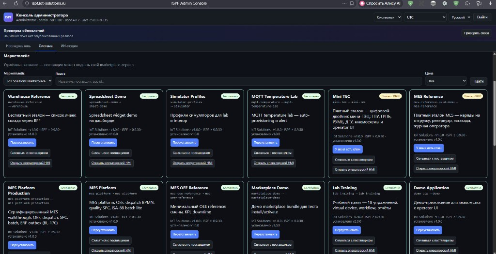

> **Language:** Canonical English. Russian edition: [ru/marketplace.md](../ru/marketplace.md).

# Marketplace integration

> **Status: Done (BL-183).** Remote catalog browse, free/paid install, signing, versioning, local offline install, multi-endpoint partner catalogs, and CI catalog validate are real. Symbol **packs** are Done under BL-185 (`ISPF_SYMBOL_PACKS_DIR` + scada API); `GET /api/v1/marketplace/symbols` lists bundled/local packs (`source`: `bundled` | `local`), not a remote partner symbol store. Partner **directory** (3 seeded DB partners) is Done under BL-184 — see [partner-program](partner-program.md). Seeded partner `marketplaceUrl` values are `.example` placeholders; operators configure real partner hosts via `ispf.marketplace.endpoints`. Partner Portal sync remains external.

ISPF platform can browse **remote marketplace servers**, install free bundles, and activate paid listings with an entitlement key.

Default marketplace URL is **configurable** (`ISPF_MARKETPLACE_DEFAULT_URL`, often `https://marketplace.ispf.ai` in demos). Point it at your own compatible marketplace host for production.

## Configuration

```yaml
ispf:
  marketplace:
    enabled: ${ISPF_MARKETPLACE_ENABLED:true}
    default-id: ${ISPF_MARKETPLACE_DEFAULT_ID:default-publisher}
    endpoints:
      - id: default-publisher
        name: IoT Solutions Marketplace
        base-url: ${ISPF_MARKETPLACE_DEFAULT_URL:https://marketplace.ispf.ai}
        contact-url: ${ISPF_MARKETPLACE_CONTACT_URL:https://vendor.example.invalid}
        default-endpoint: true
      - id: acme
        name: Acme Solutions Store
        base-url: https://marketplace.acme.example
        contact-url: mailto:sales@acme.example
```

| Variable | Default | Description |
|----------|---------|-------------|
| `ISPF_MARKETPLACE_ENABLED` | `true` | Enable remote catalog in System → Solutions |
| `ISPF_MARKETPLACE_DEFAULT_URL` | `https://marketplace.ispf.ai` | Primary catalog base URL |
| `ISPF_MARKETPLACE_CONTACT_URL` | vendor site | Fallback "contact vendor" link |

## Web console

**System → Solutions → Marketplace**



- Select marketplace endpoint
- Search and filter (free / paid)
- **Free** — one-click install (platform proxies download + deploy). Unsigned manifests are accepted only on this marketplace install path when `ispf.license.require-signed-bundles=true`; direct `POST .../deploy` still requires a signed `license` block.
- **Paid** — enter activation code → signed bundle deploy; without key — link to vendor

## Platform API

| Method | Path |
|--------|------|
| GET | `/api/v1/solutions/marketplaces` |
| GET | `/api/v1/solutions/marketplaces/{id}/catalog?q=&pricing=` |
| POST | `/api/v1/solutions/marketplaces/{id}/listings/{slug}/install` |
| POST | `/api/v1/solutions/marketplaces/{id}/listings/{slug}/activate` |

Paid activate body: `{ "activationCode": "..." }` — `installationId` is added server-side.

## Marketplace server contract

Compatible with a remote marketplace catalog API (separate host; configure `ISPF_MARKETPLACE_DEFAULT_URL`):

- `GET /api/v1/catalog` → `{ listings: [...] }`
- `GET /api/v1/catalog/{slug}/download` (free) — optional `?installationId=` returns RSA-signed bundle when marketplace signing key is configured
- `POST /api/v1/entitlements/activate` (paid)

Listing fields used by UI: `slug`, `title`, `description`, `pricing`, `appId`, `artifactKind`, `packId`, `vendorName`, `vendorLegalName`, `vendorInn`, `vendorSellerKind` (`company` | `individual`), `vendorContactPerson`, `vendorContactEmail`, `vendorContactPhone`, `priceCents`, `latestVersion`, `minIspfVersion`, `tags`.

### Artifact kinds

| `artifactKind` | Install target | Doc |
|----------------|----------------|-----|
| *(default / omitted)* | Application bundle deploy | [applications](applications.md) |
| `symbol-pack` | `ISPF_SYMBOL_PACKS_DIR` (REAL — BL-185) | [symbol-marketplace](symbol-marketplace.md) |
| `analytics-pack` | `ISPF_ANALYTICS_PACKS_DIR` | [analytics-formulas-and-packs](analytics-formulas-and-packs.md) |

Paid **analytics extension packs** (Tier C historian functions) use the same install/activate API as apps. After install, helpers appear in `GET /api/v1/platform/analytics/catalog` with `pack: <packId>`.

Local symbol catalog (dev/lab, not remote partner store): `GET /api/v1/marketplace/symbols` → `MarketplaceSymbolListingService` (`source`: `bundled` | `local`). Drop-in install + mimic palette: BL-185 Done — see [symbol-marketplace](symbol-marketplace.md).

## Marketplace readiness checklist (BL-183)

Foundation for Phase 32 marketplace readiness. Track in release planning; not all items required for dev/lab browse. Do not read every “Shipped” row as full external/partner GA.

**BL-183 Done** (Phase 32 in-repo GA). Item 7 remains Foundation (fields present, not schema-hard-enforced). Partner Portal / hosted partner SaaS sync stays out of repo.

| # | Item | Status |
|---|------|--------|
| 1 | Remote catalog browse (System → Solutions) | Shipped |
| 2 | Free one-click install (platform proxies download + deploy) | Shipped |
| 3 | Paid activate with entitlement key | Shipped |
| 4 | Bundle signature verification on install | Shipped — paid activate signs; free `/download?installationId=` signs on marketplace; ISPF trusted path fallback when unsigned |
| 5 | Version pinning + upgrade path (`latestVersion`, semver) | Shipped — `updateAvailable` in catalog, `installedVersion` / `upgrade` on install |
| 6 | `minIspfVersion` enforcement before install | Shipped |
| 7 | Vendor legal fields in listing manifest | Foundation — present in `examples/marketplace-catalog/` + demo; not schema-enforced |
| 8 | Offline/air-gapped bundle import (same manifest) | Shipped via deploy API + local `/api/v1/marketplace/bundles` |
| 9 | Marketplace server artifact reseed runbook | Shipped — see Troubleshooting |
| 10 | 10+ signed production bundles | Shipped — `examples/marketplace-catalog/` (17 listings); `publish-marketplace-catalog.ps1` |
| 11 | 3 external partners / partner catalogs | **Shipped (honest)** — 3 DB partners with `marketplaceUrl` (`PartnerProgramService` `source=db`, BL-184); multi-endpoint `ispf.marketplace.endpoints` is the partner-catalog path (see Configuration). Seeded URLs are `.example` placeholders — not live SaaS hosts. |
| 12 | CI: bundle validate on publish | **Shipped** — `node tools/marketplace-catalog/validate-catalog.mjs` on every PR (`marketplace-catalog` job in `.github/workflows/ci.yml`); live API dry-run remains `tools/bundle-validate-cli/validate.mjs` |

### Demo listing manifest

Reference listing + bundle for marketplace server seeding and integrator tests:

| File | Purpose |
|------|---------|
| [examples/marketplace-demo/listing.manifest.json](../../examples/marketplace-demo/listing.manifest.json) | Catalog entry fields (slug, vendor, pricing) |
| [examples/marketplace-demo/bundle.json](../../examples/marketplace-demo/bundle.json) | Installable application bundle (`appId=marketplace-demo`) |
| [examples/marketplace-analytics-pack-demo/listing.manifest.json](../../examples/marketplace-analytics-pack-demo/listing.manifest.json) | Tier C analytics pack listing (`artifactKind: analytics-pack`) |

Publish flow (marketplace server):

1. Copy `bundle.json` to marketplace artifacts store as `marketplace-demo__1.0.0.json`
2. Register `listing.manifest.json` in catalog index
3. Verify `GET /api/v1/catalog/marketplace-demo/download` and ISPF **Install**

Bulk publish all catalog listings:

```powershell
.\deploy\tools\publish-marketplace-catalog.ps1
```

Paid analytics packs: marketplace `activate` signs `analytics-pack.json` inside zip (`patch-marketplace-analytics-pack-signing.sh`).

## Troubleshooting

### `ENOENT ... warehouse-reference__1.0.0.json` on download / ISPF install 502

Catalog (`GET /api/v1/catalog`) works, but **Download bundle** or ISPF **Install** fails — bundle JSON is missing on the marketplace server (host path vs Docker volume mismatch).

On the **marketplace VPS** (`marketplace.example.invalid`):

```bash
cd /opt/ispf-marketplace
git pull origin main
bash deploy/vps-reseed-artifacts.sh
```

ISPF only proxies the download; fix is always on the marketplace host (see that server’s deploy runbook).

## Related

- [competitive-scorecard](competitive-scorecard.md) — dimension 12 (ecosystem / marketplace)
- [commercial-licensing](commercial-licensing.md)
- [plugins](plugins.md)
- [applications](applications.md)
- [analytics-formulas-and-packs](analytics-formulas-and-packs.md) — Tier C marketplace packs
