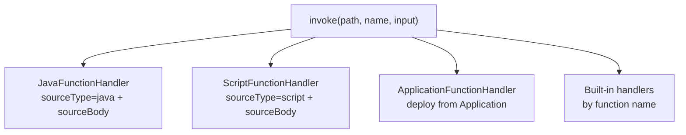

> **Language:** Canonical English. Russian edition: [ru/object-functions.md](../ru/object-functions.md).

# Object Functions

A function is a **named callable** on an object tree node. Addressing is always a pair:

- **object path** — absolute, for example `root.platform.devices.test`
- **function name** — local to the object, for example `calculate`

There is no global path of the form `root/.../myFn`.

See also: [object-model.md](object-model.md), [applications.md](applications.md) (application function deployment), [workflows.md](workflows.md) (BPMN `invoke_function`).

## `FunctionDescriptor`

| Field | Purpose |
|-------|---------|
| `name` | Function identifier on the object |
| `description` | Label in the UI |
| `inputSchema` / `outputSchema` | `DataSchema` for invoke |
| `sourceType` | `null` (built-in handler), `pulse`, `script`, `java` |
| `sourceBody` | JSON steps (script) or Java source |
| `dataSourcePath` | Optional: application data source for script SQL steps |
| `version` | Arbitrary version string |

Save:

```http
PUT /api/v1/objects/by-path/functions?path=root.platform.devices.test
Content-Type: application/json

{
  "name": "myFn",
  "description": "Example",
  "inputSchema": { "name": "myFnInput", "fields": [] },
  "outputSchema": {
    "name": "myFnOutput",
    "fields": [{ "name": "ok", "type": "BOOLEAN", "nullable": false }]
  },
  "sourceType": "java",
  "sourceBody": "..."
}
```

Invoke:

```http
POST /api/v1/objects/by-path/functions/invoke?path=root.platform.devices.test&name=myFn
Content-Type: application/json

{
  "schema": { "name": "myFnInput", "fields": [{ "name": "value", "type": "STRING" }] },
  "rows": [{ "value": "hello" }]
}
```

Empty input (schema with no fields) — the request body may be omitted.

## How implementation is chosen



Order: **java** → **script** → **application deploy** → **built-in** (`AcknowledgeAlarm`, `VirtualLab`, `PulseVariable`, `MqttGateway`, …).

If a descriptor exists but no handler matched → `No handler registered for function: …`.

---

## 1. Built-in platform handlers (empty `sourceType`)

Mode **built-in server handler (by name)** in the UI. The object must have a **descriptor with that name**, and the server code must have a registered `FunctionHandler`.

`sourceBody` is not required. An arbitrary name like `test` **does not work** until a platform handler exists for it.

### 1.1 `acknowledgeAlarm` — alarm acknowledge

Object: sensor with variables `alarmActive`, `alarmAcknowledged` (fixture `demo-sensor-01`).

```json
{
  "name": "acknowledgeAlarm",
  "description": "Acknowledge active alarm",
  "inputSchema": { "name": "voidInput", "fields": [] },
  "outputSchema": {
    "name": "functionResult",
    "fields": [
      { "name": "success", "type": "BOOLEAN" },
      { "name": "message", "type": "STRING" }
    ]
  },
  "sourceType": null,
  "sourceBody": null
}
```

```http
POST /api/v1/objects/by-path/functions/invoke?path=root.platform.devices.demo-sensor-01&name=acknowledgeAlarm
```

Result: `alarmAcknowledged.value = true`, output `{ "success": true, "message": "Alarm acknowledged" }`.

Binding on the same object:

```
callFunction(acknowledgeAlarm)
```

### 1.2 Pulse commands (`sourceType: "pulse"`)

Universal SCADA **command pulse** pattern: write `true` to a bool variable (`cmdStart`, `cmdStop`, …).

```json
{
  "name": "gpu_start",
  "description": "Start GPU",
  "sourceType": "pulse",
  "sourceBody": "{\"variable\":\"cmdStart\"}",
  "inputSchema": { "name": "voidInput", "fields": [] },
  "outputSchema": {
    "name": "functionResult",
    "fields": [
      { "name": "success", "type": "BOOLEAN" },
      { "name": "message", "type": "STRING" }
    ]
  }
}
```

Optional: `"objectPath"` in `sourceBody` to write on another object; `"value": false` to reset.

The reference mini-TEC application uses `pulse` for start/stop; complex logic uses `script` + `writeVariable` ([`MiniTecFunctionScripts.java`](../packages/ispf-server/src/main/java/com/ispf/server/application/reference/minitec/MiniTecFunctionScripts.java)).

### 1.3 Virtual Lab — `calculate`, `fireEvent1`, `fireEvent2`, `appendTableRow`

For virtual-lab objects (model with variables `inputA`, `inputB`, `table`, events `event1`, `event2`).

**`calculate`** — sum two numbers:

```json
{
  "name": "calculate",
  "inputSchema": {
    "name": "calculateInput",
    "fields": [
      { "name": "inputA", "type": "DOUBLE" },
      { "name": "inputB", "type": "DOUBLE" }
    ]
  },
  "outputSchema": {
    "name": "calculateOutput",
    "fields": [{ "name": "result", "type": "DOUBLE" }]
  }
}
```

```json
POST .../invoke?path=<virtual-lab-object>&name=calculate
{ "schema": {...}, "rows": [{ "inputA": 10, "inputB": 3.5 }] }
→ { "rows": [{ "result": 13.5 }] }
```

**`fireEvent1` / `fireEvent2`** — publish an event with payload `{ int, string }`:

```json
{ "rows": [{ "int": 42, "string": "hello" }] }
```

**`appendTableRow`** — append a row to `table` (RECORD_LIST):

```json
{ "rows": [{ "int": 1, "string": "row-a" }] }
```

### 1.3 Mini-TEC — operator commands

Objects under `root.platform.mini-tec-plant.*` only.

| Name | Object | Input | Action |
|------|--------|-------|--------|
| `gpu_start` | GPU | empty | pulse `cmdStart` |
| `gpu_stop` | GPU | empty | pulse `cmdStop` |
| `gpu_sync` | GPU | empty | pulse `cmdSync` |
| `dgu_start` | DGU | empty | pulse `cmdStart` |
| `dgu_stop` | DGU | empty | pulse `cmdStop` |
| `breaker_operate` | RUMB | `{ "action": "close" \| "open" }` | circuit breaker |
| `grpb_valve_control` | GRPB | `{ "action": "open" \| "close" \| "trip" }` | valve |
| `grpb_pzk_reset` | GRPB | empty | PZK reset |
| `load_module_set_load` | Load module | `{ "loadPct": 75, "millMode": true }` | load setpoint |
| `acknowledge_alarm` | Station hub | empty | reset `alarmLatched` |

Example `breaker_operate`:

```http
POST .../invoke?path=root.platform.mini-tec-plant.rumb-10kv&name=breaker_operate

{
  "schema": {
    "name": "actionInput",
    "fields": [{ "name": "action", "type": "STRING" }]
  },
  "rows": [{ "action": "close" }]
}
```

### 1.4 `dispatchTelemetry` — MQTT gateway

Gateway object (model `mqtt-gateway-v1`). Routes ingress MQTT to a child sensor.

```json
{
  "name": "dispatchTelemetry",
  "inputSchema": {
    "name": "mqttIngress",
    "fields": [
      { "name": "topic", "type": "STRING" },
      { "name": "raw", "type": "STRING" }
    ]
  },
  "outputSchema": {
    "name": "dispatchTelemetryResult",
    "fields": [
      { "name": "ok", "type": "BOOLEAN" },
      { "name": "message", "type": "STRING" },
      { "name": "routedPath", "type": "STRING" }
    ]
  }
}
```

```json
{
  "rows": [{
    "topic": "ispf/loadtest/7/temperature",
    "raw": "23.5"
  }]
}
```

Often invoked from a binding: `callFunction(dispatchTelemetry, lastIngress)`.

---

## 2. Script functions (`sourceType: "script"`)

Body — JSON with a `steps` array. Same engine as [applications.md](applications.md), but saved on the object via Inspector / `PUT .../functions`.

Script variables: `input` (invoke fields), plus `var` from steps. Substitutions: `"${input.orderId}"`, `"$row.count"`, `"${item.name}"` in `map`.

The script **must** end with a `return` step (or an early `return` from a `when`/`if` branch).

### 2.1 Minimal echo

```json
{
  "name": "echo",
  "sourceType": "script",
  "sourceBody": "{\"steps\":[{\"type\":\"return\",\"fields\":{\"message\":\"${input.text}\",\"ok\":true}}]}",
  "inputSchema": {
    "name": "echoIn",
    "fields": [{ "name": "text", "type": "STRING" }]
  },
  "outputSchema": {
    "name": "echoOut",
    "fields": [
      { "name": "message", "type": "STRING" },
      { "name": "ok", "type": "BOOLEAN" }
    ]
  }
}
```

### 2.2 `setVar` and `buildRecord`

```json
{
  "steps": [
    { "type": "setVar", "var": "greeting", "value": "Hello" },
    { "type": "setVar", "var": "full", "expression": "greeting + ', ' + ${input.name}" },
    {
      "type": "buildRecord",
      "var": "row",
      "fields": { "message": "${full}", "ok": true }
    },
    { "type": "return", "fields": { "message": "${row.message}", "ok": "${row.ok}" } }
  ]
}
```

### 2.3 `when` / `if` — branching

```json
{
  "steps": [
    {
      "type": "when",
      "var": "input.value",
      "gt": 100,
      "then": [
        { "type": "return", "fields": { "level": "HIGH", "ok": true } }
      ],
      "else": [
        { "type": "return", "fields": { "level": "NORMAL", "ok": true } }
      ]
    }
  ]
}
```

Conditions: `notNull`, `equals`, `notEquals`, `gt`, `lt`, `gte`, `lte`, or truthy `var`.

### 2.4 `readVariable` — read another object's variable

```json
{
  "steps": [
    {
      "type": "readVariable",
      "objectPath": "root.platform.devices.demo-sensor-01",
      "variable": "temperature",
      "field": "value",
      "var": "temp"
    },
    {
      "type": "return",
      "fields": { "temperature": "${temp}", "ok": true }
    }
  ]
}
```

`objectPath: "self"` — the object on which the function is declared.

### 2.5 `writeVariable` — write an object's variable

```json
{
  "steps": [
    {
      "type": "writeVariable",
      "objectPath": "self",
      "variable": "cmdStart",
      "fields": { "value": true }
    },
    {
      "type": "return",
      "fields": { "success": true, "message": "Command sent" }
    }
  ]
}
```

For typical SCADA commands without a script, see **`sourceType: "pulse"`** (§1.2).

### 2.6 `invoke_function` — nested invoke

```json
{
  "steps": [
    {
      "type": "invoke_function",
      "objectPath": "root.platform.devices.demo-sensor-01",
      "functionName": "acknowledgeAlarm",
      "var": "ack"
    },
    {
      "type": "return",
      "fields": {
        "success": "${ack.success}",
        "message": "${ack.message}"
      }
    }
  ]
}
```

If the nested function returns `error_code` ≠ `OK`, the script aborts and returns that error.

### 2.6 SQL steps (`selectOne`, `selectMany`, `exec`)

Requires `dataSourcePath` on the descriptor (application data source path) **or** the default platform catalog.

```json
{
  "name": "loadOrder",
  "dataSourcePath": "root.platform.data-sources.app_myapp",
  "sourceType": "script",
  "sourceBody": "{\n  \"steps\": [\n    {\n      \"type\": \"selectOne\",\n      \"var\": \"order\",\n      \"sql\": \"SELECT id, status FROM orders WHERE id = ?\",\n      \"params\": [\"${input.orderId}\"]\n    },\n    { \"type\": \"failIfNull\", \"var\": \"order\", \"error_code\": \"NOT_FOUND\", \"error_message\": \"Order missing\" },\n    { \"type\": \"return\", \"fields\": { \"status\": \"${order.status}\", \"error_code\": \"OK\", \"error_message\": \"\" } }\n  ]\n}"
}
```

### 2.7 `map` — list transformation

```json
{
  "steps": [
    {
      "type": "selectMany",
      "var": "rows",
      "sql": "SELECT name, value FROM metrics WHERE device_id = ?",
      "params": ["${input.deviceId}"]
    },
    {
      "type": "map",
      "var": "items",
      "source": "${rows}",
      "fields": {
        "label": "${item.name}",
        "value": "${item.value}"
      }
    },
    {
      "type": "return",
      "fields": { "items": "${items}", "count": "${items.size()}" }
    }
  ]
}
```

### 2.8 `jsonParse`

```json
{
  "type": "jsonParse",
  "var": "parsed",
  "source": "${input.payloadJson}",
  "fields": ["temperature", "humidity"]
}
```

### 2.9 `setDriverTelemetry`

Write driver telemetry (as from a device):

```json
{
  "type": "setDriverTelemetry",
  "objectPath": "${input.devicePath}",
  "variable": "temperature",
  "fields": { "value": "${input.value}", "unit": "C" }
}
```

### 2.10 `instantiateModelIfMissing`

```json
{
  "type": "instantiateModelIfMissing",
  "var": "instancePath",
  "modelName": "mqtt-sensor-v1",
  "parentPath": "root.platform.devices",
  "instanceName": "sensor-${input.index}"
}
```

### 2.11 `cancel_workflows`

```json
{
  "type": "cancel_workflows",
  "workflowPath": "root.platform.workflows.demo-alarm-handler",
  "statusIn": ["RUNNING", "WAITING"],
  "reason": "superseded",
  "var": "cancelled"
}
```

### 2.12 Errors: `failIfNull`, `failIfNotEquals`

Standard wire for errors in the output schema:

```json
{
  "fields": [
    { "name": "error_code", "type": "STRING" },
    { "name": "error_message", "type": "STRING" }
  ]
}
```

```json
{ "type": "failIfNull", "var": "order", "error_code": "NOT_FOUND", "error_message": "No order" }
{ "type": "failIfNotEquals", "var": "order.status", "equals": "OPEN", "error_code": "BAD_STATE" }
```

### 2.13 Complete step table

| `type` | Purpose |
|--------|---------|
| `return` | Final output (`fields`) |
| `setVar` | `var` ← literal, `${path}`, or `expression` (`+`, `==`, …) |
| `buildRecord` | Build a `Map` in `var` |
| `when`, `if` | Branching `then` / `else` |
| `map` | List → list with `item` in scope |
| `readVariable` | Read an object variable field |
| `writeVariable` | Write object variable fields (`fields`) |
| `invoke_function` | Invoke another function |
| `selectOne` / `selectMany` / `exec` | SQL |
| `jsonParse` | Parse a JSON string |
| `setDriverTelemetry` | Write a driver variable |
| `instantiateModelIfMissing` | Create an object from a model |
| `cancel_workflows` | Cancel workflow instances |
| `failIfNull` / `failIfNotEquals` | Controlled exit with error |

---

## 3. Java functions (`sourceType: "java"`)

`sourceBody` — one public class implementing `com.ispf.core.function.ObjectJavaFunction`. **Compiled on save**; compilation error → `400`, object is not updated.

Context: `JavaFunctionContext(objectPath, functionName)` — invoking object path and function name.

Restrictions (`JavaFunctionSecurity`): `Runtime`, `ProcessBuilder`, `System.exit`, reflection, `java.net.*` (except `InetAddress`), `java.io.File`, `java.nio.file`, Spring packages, and others are forbidden.

### 3.1 Minimal OK

```java
import com.ispf.core.function.ObjectJavaFunction;
import com.ispf.core.function.JavaFunctionContext;
import com.ispf.core.model.DataRecord;
import com.ispf.core.model.DataSchema;
import com.ispf.core.model.FieldType;
import java.util.Map;

public class TestFunction implements ObjectJavaFunction {
    @Override
    public DataRecord invoke(DataRecord input, JavaFunctionContext context) {
        DataSchema out = DataSchema.builder("testOutput")
                .field("ok", FieldType.BOOLEAN)
                .build();
        return DataRecord.single(out, Map.of("ok", true));
    }
}
```

### 3.2 Echo input

```java
public class EchoInputFn implements ObjectJavaFunction {
    @Override
    public DataRecord invoke(DataRecord input, JavaFunctionContext context) {
        Object value = input != null && input.rowCount() > 0
                ? input.firstRow().get("value")
                : null;
        DataSchema schema = DataSchema.builder("out")
                .field("value", FieldType.STRING)
                .build();
        return DataRecord.single(schema, Map.of(
                "value", value == null ? "" : String.valueOf(value)
        ));
    }
}
```

Input schema: field `value` of type `STRING`.

### 3.3 Input arithmetic

```java
public class SumFn implements ObjectJavaFunction {
    @Override
    public DataRecord invoke(DataRecord input, JavaFunctionContext context) {
        double a = number(input, "inputA");
        double b = number(input, "inputB");
        DataSchema schema = DataSchema.builder("sumOut")
                .field("result", FieldType.DOUBLE)
                .build();
        return DataRecord.single(schema, Map.of("result", a + b));
    }

    private static double number(DataRecord input, String field) {
        if (input == null || input.rowCount() == 0) return 0;
        Object raw = input.firstRow().get(field);
        return raw instanceof Number n ? n.doubleValue() : Double.parseDouble(String.valueOf(raw));
    }
}
```

### 3.4 Conditional result + metadata from context

```java
public class ThresholdFn implements ObjectJavaFunction {
    @Override
    public DataRecord invoke(DataRecord input, JavaFunctionContext context) {
        double value = number(input, "value");
        boolean alarm = value > 80;
        DataSchema schema = DataSchema.builder("thresholdOut")
                .field("alarm", FieldType.BOOLEAN)
                .field("objectPath", FieldType.STRING)
                .field("functionName", FieldType.STRING)
                .build();
        return DataRecord.single(schema, Map.of(
                "alarm", alarm,
                "objectPath", context.objectPath(),
                "functionName", context.functionName()
        ));
    }
    // number() — as in the example above
}
```

### 3.5 When to choose Java vs Script

| | Java | Script |
|---|------|--------|
| Compilation | On save (JDK on server) | None |
| SQL / workflow / readVariable | No (input/output only) | Yes |
| Complex logic | Convenient | `when` + steps |
| Reading tree variables | Via input or script | `readVariable` |

To access object variables without passing everything in input, use **script** or a `callFunction` binding.

---

## 4. Application functions (deploy)

Separate channel: function is deployed from an application (`POST /api/v1/applications/{appId}/functions/deploy`), descriptor appears on a tree object, invoke goes through `ApplicationFunctionHandler`.

Script body and steps are the same as in §2. Details: [applications.md § Function deployment](applications.md).

```http
POST /api/v1/applications/myapp/functions/deploy
```

If the object already has `sourceType=script|java` with a body — the application handler **does not intercept** invoke.

---

## 5. Invocation methods

### 5.1 REST

```http
POST /api/v1/objects/by-path/functions/invoke?path={objectPath}&name={functionName}
```

Requires invoke permission on the object (RBAC).

### 5.2 Bindings

On the **current** object:

```
callFunction(myFn)
callFunction(myFn, sourceVariable)
callFunction(myFn, sourceVariable, fieldName)
```

On **another** object:

```
callFunctionAt("root.platform.devices.test", myFn)
callFunctionAt("root.platform.devices.test", myFn, payloadVar)
```

### 5.3 Workflow service task

```xml
<serviceTask ispf:action="invoke_function"
             ispf:objectPath="root.platform.devices.test"
             ispf:functionName="myFn"
             ispf:inputMap="value=${workflow.lastValue}"
             ispf:outputMap="result=ok"/>
```

### 5.4 BPMN (application)

```xml
<ispf:serviceTask action="invoke_function"
                  objectPath="root.platform.devices.test"
                  functionName="myapp_ping"
                  inputMap="orderId=${workflow.orderId}"/>
```

### 5.5 Dashboard

| Widget | Fields |
|--------|--------|
| `function` | `objectPath`, `functionName`, `inputJson` |
| `function-form` | `functionName`, `fieldsJson` → builds input |
| `svg-widget` | `clickAction=function`, `functionName` |

### 5.6 Application schedule

```json
{
  "actionType": "invoke_function",
  "action": {
    "objectPath": "root.platform.devices.test",
    "functionName": "myFn"
  }
}
```

### 5.7 AI Agent tool

`invokeFunction` with `objectPath` + `functionName` (+ optional input).

---

## 6. Common errors

| Symptom | Cause |
|---------|-------|
| `No handler registered` | Empty `sourceType` and name not from built-in handlers |
| `Unknown function` | No descriptor on the object |
| `Java compilation failed package com.ispf.core…` | Old server version without classpath fix (jar with `JavaFunctionCompileClasspath` required) |
| Save Java without error, but invoke fails | Wrong `sourceType` in UI (built-in handler selected instead of Java) |
| Script `must end with return step` | No final `return` |
| `Script function call depth exceeded` | > 8 nested `invoke_function` |

---

## 7. Extending the platform (for developers)

New built-in handler:

1. `implements FunctionHandler` in `ispf-server`
2. `@Component`, logic in `supports(path, name)` + `invoke(...)`
3. Add `FunctionDescriptor` to objects (model / bootstrap)

Custom functions without a server release: **script** or **java** on the object, or **application deploy**.
