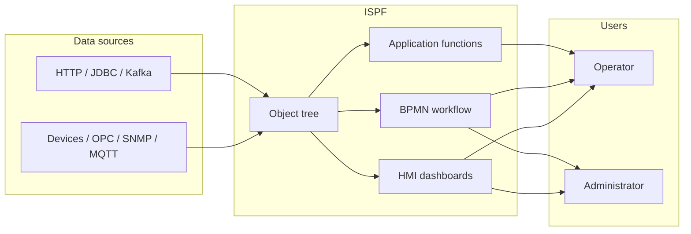
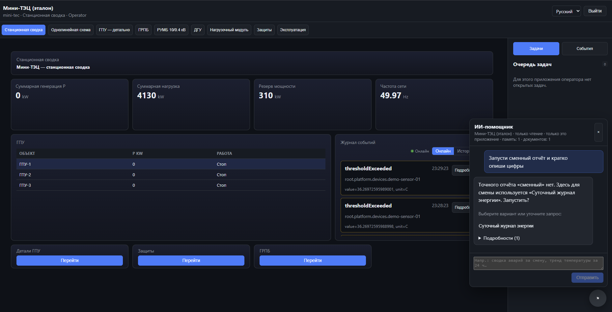
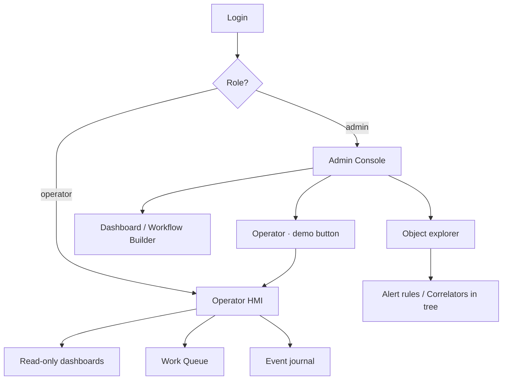

> **Language:** Canonical English. Russian edition: [ru/product.md](../ru/product.md).

# ISPF — Product Documentation

> **Status:** Stable — public product entry. Hub tags: [doc-status.md](doc-status.md).

**IoT Solutions Platform Framework (ISPF)** is middleware for IoT, SCADA, and industrial automation. It provides a unified data model, HMI, automation, and an application layer without domain-specific Java in the core.

This document is the **entry point for all roles**. Implementation details live in the other sections of [docs/en/readme.md](readme.md).

---

## Who This Product Is For

| Role | Responsibilities | Start here |
|------|------------------|------------|
| **Operator** | Monitoring, control, work queue, reports | [Operator guide](operator-guide.md) |
| **Administrator** | Object tree, dashboards, workflow, users | [Getting started](getting-started.md) → [Web Console](web-console.md) |
| **Solution developer** | Deploy applications, functions, operator UI, reports | [Solution developer guide](solution-developer-guide.md) |
| **Platform developer** | Drivers, REQ-PF, core extensions | [Roadmap](roadmap.md) |
| **DevOps / SRE** | Deployment, profiles, infrastructure | [Deployment](deployment.md) |

---

## What ISPF Solves

A typical SCADA/MES stack grows as separate modules: OPC server, historian, HMI, workflow, reports. ISPF unifies them around **one object tree** with a single API and UI.



### Core principle

**Business logic lives on the platform** — in models, variables, events, functions, and workflows of the **object tree**. The platform supplies generic engines (CEL, bindings, BPMN, script runtime, drivers); the solution configures them declaratively. Bundle deploy packages configuration, not a separate runtime. Summary for developers and agents: [application-principles](application-principles.md). Details: [architecture](architecture.md). Backlog: [roadmap](roadmap.md).

### Key capabilities

- **Unified model** — device, dashboard, workflow, and alert rule are tree nodes; logic uses variables, events, functions, and BPMN.
- **Bundles, not core forks** — industry solutions deploy as configuration into platform mechanisms ([applications](applications.md)).
- **Stack** — Spring Boot 4, Java 25, PostgreSQL/TimescaleDB, React 19, REST + WebSocket; optional NATS/MQTT/Keycloak.
- **~60 driver packs** (not inside `ispf-server.jar`; maturity varies — see [drivers](drivers.md)).
- **AGPL v3 platform** — optional Enterprise dual-license; driver packs and application bundles may use separate terms ([license](license.md), [plugins](plugins.md)).

---

## Product Capabilities

### 1. Object tree

The central platform abstraction. Each node has a path (`root.platform.devices.pump-01`), type, variables, events, and functions.

| Node type | Purpose |
|-----------|---------|
| `PLATFORM`, `DEVICES`, `DASHBOARDS`, … | System catalogs (`root.platform.*`) |
| `DEVICE` | Physical or virtual device with a driver |
| `DASHBOARD` | HMI screen (layout JSON + widgets) |
| `WORKFLOW` | BPMN automation process |
| `ALERT` / `CORRELATOR` | Automation rules (tree nodes) |
| `MODEL` | Template (blueprint) for creating objects |
| `APPLICATION` | Registered deploy application |
| `USER` / `ROLE` | Users and roles (mirror of security API) |
| `CUSTOM` | Arbitrary container (fallback) |

Details: [object-model](object-model.md), [glossary](glossary.md).

### 2. Models (templates)

`BlueprintDefinition` describes a set of variables, events, functions, and CEL bindings. RELATIVE mixins auto-apply only when a non-empty *Applicability condition* (CEL) is set. The demo model `mqtt-sensor-v1` is a fixture applied via `templateId`.

Details: [blueprints](blueprints.md), [0018-fixture-models-and-cel-applicability](decisions/0018-fixture-models-and-cel-applicability.md).

### 3. Device drivers

The `DeviceDriver` SPI connects protocols to object variables. The administrator configures `driverId`, configuration, and point mapping; the runtime polls the device and writes values into the tree.

Demo after first startup:

| Object | Driver | Purpose |
|--------|--------|---------|
| `demo-sensor-01` | virtual | Sinusoidal temperature + alarm binding |
| `snmp-localhost` | snmp | localhost SNMP agent |

Details: [drivers](drivers.md).

### 4. Dashboards and HMI

Dashboard Builder (admin) and Operator HMI (read-only) use the same widgets:

| Category | Widgets |
|----------|---------|
| Values | `value`, `indicator`, `sparkline`, `chart`, `gauge` |
| Tables | `object-table`, `card-grid`, `work-queue` |
| Navigation | `dashboard-link` (switch between screens) |
| SCADA | `scada-mimic` (P&ID / single-line mimic diagrams) |
| Other | `text`, `iframe`, `image`, `event-log`, `function-button` |

Widgets bind to data via `objectPath` (static) or `selectionKey` (dynamic row selection from a table).

Details: [dashboards](dashboards.md), [scada](scada.md), widget reference: [widgets](widgets.md).

### 5. Workflow (BPMN)

Visual BPMN editor in the Web Console. Supports service tasks (including application function calls), user tasks (operator queue), gateways with CEL conditions, parallel branches, signals, and NATS.

Details: [workflows](workflows.md).

### 6. Automation

- **Events** — typed notifications from objects; journal + WebSocket.
- **Alert rules** — CEL condition on a variable → automatic event fire. `ALERT` nodes in `root.platform.alert-rules`.
- **Event correlators** — event chain → workflow start. `CORRELATOR` nodes in `root.platform.correlators`.

Details: [automation](automation.md).

### 7. Application solutions (Application Platform)

The REQ-PF layer lets you deploy industry applications **without changing the Java core**:

| Stage | API |
|-------|-----|
| Registration | `POST /applications` |
| SQL migrations | `POST /applications/{id}/data/migrate` |
| Functions (JSON script) | `POST /applications/{id}/functions/deploy` |
| Bundle deploy | `POST /applications/{id}/deploy` |
| BFF for UI | `POST /bff/invoke` |
| Schedules | `GET/POST /schedules` |
| SQL reports | `GET /applications/{id}/reports/{name}` |

Details: [applications](applications.md), [reports](reports.md).

### 8. Operator UI

The operator shell is a full-screen HMI for operators:

```
http://localhost:5173?mode=operator&app=<appId>
```

Operator UI configuration is stored on the server (`operator_app_ui`) and edited in the admin console → `root.platform.operator-apps`. Load priority:

1. `GET /api/v1/operator-apps/{appId}/ui`
2. `GET /api/v1/applications/{appId}/operator-ui` (from bundle)
3. Legacy fallback `public/operator-apps/{appId}.ui.json`

Details: [operator-guide](operator-guide.md), [web-console](web-console.md).

### 9. Security

Two roles: **admin** (full access) and **operator** (view, functions, work queue). Profile `local` — Bearer token after login; profile `dev`/prod — OAuth2 JWT via Keycloak.

Details: [security](security.md).

---

## Web Console Modes





| Mode | URL | Who sees it |
|------|-----|-------------|
| Admin | `http://localhost:5173` | admin (default) |
| Operator HMI | `?mode=operator` | operator; admin via link |
| Operator app | `?mode=operator&app=platform` | specific application |
| Admin explicit | `?mode=admin` | admin even with autostart |

---

## Typical Scenarios

### Scenario 1: Sensor monitoring

1. Administrator opens `devices.demo-sensor-01` — sees temperature, threshold, alarm.
2. Double-clicks `dashboards.demo-sensor` — edits the HMI.
3. Operator opens `?mode=operator` — sees the same dashboard without editing.
4. When the threshold is exceeded, an alert rule fires → event in the journal → optional workflow.

### Scenario 2: Operator task handling

1. A BPMN workflow contains a **user task** “Confirm action”.
2. The task appears in the **Work Queue** in the operator sidebar.
3. Operator clicks **Claim** → performs the action → **Complete**.
4. The workflow continues (service task, gateway, etc.).

### Scenario 3: Deploying an industry application

1. Developer registers the app (`POST /applications`).
2. Deploys SQL migrations and JSON functions.
3. Uploads a bundle with `operatorUi` and reports.
4. Administrator creates an operator app in the tree → configures dashboards.
5. Operators work via `?mode=operator&app=my-terminal`.

Step-by-step walkthrough: [solution-developer-guide](solution-developer-guide.md).

---

## Quick Start (5 minutes)

```bash
# 1. API (H2 + local auth)
./gradlew :packages:ispf-server:bootRun --args="--spring.profiles.active=local"

# 2. Web Console
cd apps/web-console && npm install && npm run dev
```

| URL | Purpose |
|-----|---------|
| http://localhost:5173 | Admin console (login: `admin` / `admin`) |
| http://localhost:5173?mode=operator | Operator HMI |
| http://localhost:8080/api/v1/info | Platform version |
| http://localhost:8080/actuator/health | Health check |

Full instructions: [getting-started](getting-started.md).

---

## Architecture (brief)

```
Web Console (React)  ←→  REST / WebSocket  ←→  ispf-server (Spring Boot)
                                                      │
                    ObjectManager │ WorkflowService │ DriverRuntime
                    ApplicationPlatform │ EventService │ AlertRules
                                                      │
                    PostgreSQL/H2 │ Flyway │ NATS* │ MQTT*
```

Details: [architecture](architecture.md).

---

## API

Base URL: `http://localhost:8080/api/v1`

| Group | Examples |
|-------|----------|
| Objects | `GET /objects`, `PUT /objects/by-path/{path}/variables/{name}` |
| Dashboards | `GET /dashboards/by-path/{path}/layout` |
| Workflow | `POST /workflows/by-path/{path}/run` |
| Applications | `POST /applications/{id}/deploy` |
| Operator apps | `GET /operator-apps/{id}/ui` |
| Drivers | `POST /drivers/runtime/start?devicePath=...` |
| Events | `GET /events`, `POST /events/fire` |

Full reference: [api](api.md).

---

## License and Boundaries

| Component | License |
|-----------|---------|
| ISPF platform (`main`) | GNU AGPL v3 (+ optional Enterprise dual-license) |
| Driver packs / commercial plugins / app bundles | Separate terms — see [license](license.md), [plugins](plugins.md) |

Details: [license](license.md), [plugins](plugins.md).

---

## Documentation Map

### Product documentation

| Document | Description |
|----------|-------------|
| **product.md** (this file) | Product overview, capabilities, scenarios |
| [operator-guide](operator-guide.md) | Operator HMI usage |
| [solution-developer-guide](solution-developer-guide.md) | Building application solutions |
| [glossary](glossary.md) | Terms and definitions |

### Technical documentation

| Document | Description |
|----------|-------------|
| [getting-started](getting-started.md) | Installation and first run |
| [object-model](object-model.md) | Tree, variables, CEL |
| [dashboards](dashboards.md) | Layout, selectionKey, builder |
| [scada](scada.md) | Mimic diagrams, MIMIC objects, mimic editor (align, distribute, flip, resize, smart-snap) |
| [widgets](widgets.md) | Reference for all widgets |
| [workflows](workflows.md) | BPMN engine |
| [applications](applications.md) | REQ-PF deploy API |
| [drivers](drivers.md) | Driver catalog |
| [security](security.md) | RBAC and authentication |
| [deployment](deployment.md) | Production |

Full index: [readme](readme.md).
