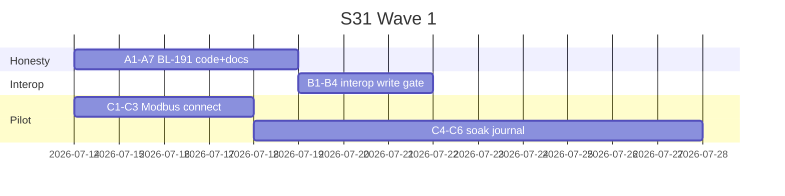

> **Language:** Canonical English. Russian edition: [ru/roadmap.md](../ru/roadmap.md).

# ISPF Platform Roadmap

> **Status:** Charter — Phases and backlog. Hub: [doc-status.md](doc-status.md).

Single source of truth: phases, sprints, REQ-PF/FW, BL-01…210. **One file** — append new phases here; do not split into `roadmap-phase-N.md`.

| | |
| --- | --- |
| **Baseline** | `main`, July 2026 |
| **Updated** | 2026-07-17 |
| **Product direction** | Self-hosted industrial application platform — object tree + SCADA HMI + automation + apps + AI ([architecture](architecture.md)) |

---

## Summary

| Category | Total | Done | Partial | Planned | Cancelled |
| --------- | ----- | ---- | ------- | ------- | --------- |
| REQ-PF | 13 | 13 | 0 | 0 | 0 |
| REQ-FW | 20 | 20 | 0 | 0 | 0 |
| BL-01…139 | 139 | 138 | 0 | 0 | 1 |
| BL-140…210 | 65 | 30 | 34 | 1 | 0 |
| Phase 0–24 | 25 | 25 | 0 | — | — |
| Phase 25–33 | 9 | 0 | 9 | 0 | — |
| Sprint S01–S30 | 30 | 30 | 0 | 0 | — |
| Sprint S31–S46 | 16 | 0 | 16 | 0 | — |

**Current focus:** **AI Autopilot (BL-177…180)** — see [Next 90 days](#next-90-days). **Deferred:** Phase 25 OT Trust; live ERP (BL-169).

**Closed:** BL-01…139 Done (BL-112 Cancelled); Phase 0–24 closed — [Phase 24](#phase-24--closed). **Active backlog:** BL-140…210 (OT + live ERP parked).

Acceleration program: [acceleration-program](acceleration-program.md).

VPS deploy — on request only (see [deployment](deployment.md) / [demostands](demostands.md); script `deploy/vps-deploy-direct.ps1`).

---

## Retrospective — what shipped and where we are {#retrospective}

**As of 2026-07-09** · prod **0.9.105** (`ispf.example.invalid`) · code-verified score **~7.4/10** ([competitive-scorecard](competitive-scorecard.md)).

### Eras (closed → active)

| Era | When | What shipped | State |
| --- | ---- | ------------ | ----- |
| **Phase 0–22** | History | Core platform: object tree, drivers SPI, HMI, BPMN, REQ-PF/FW, OIDC, Timescale, NATS, federation foundations | **Closed — Done** |
| **Phase 23 + S01–S26** | REQ-EX + acceleration | OT trust wave, operator HMI/PWA, AI production, semantic (Haystack/Brick), MES wave, multi-tenant, cluster | **Closed — Done** |
| **Phase 24 / S27–S30** | 2026-07-07 | Federation hardening, historian dual-write VPS, HMI a11y/Lighthouse, RU registry techpack | **Closed — Done** |
| **Phase 25–33** | Active | Phases 25–33: OT→HMI→Security→Historian→MES→Automation→AI→Ecosystem→Analytics | **Open — all Partial** |

### Closed backlog (do not reopen)

| Bucket | Count | Notes |
| ------ | ----- | ----- |
| REQ-PF | 13/13 Done | Application platform (functions, BFF, bundle, reports, …) |
| REQ-FW | 20/20 Done | ADR, licensing, AI layer, public API, … |
| BL-01…139 | 138 Done, 1 Cancelled (BL-112) | Full registry below |
| Sprint S01–S30 | 30/30 Done | Including HF01 elastic ingress |

### Active backlog BL-140…210 (registry truth)

Counts from [§ BL-140…210](#bl-140210--full-registry) — prefer this over the summary rollup if they diverge.

| Status | IDs (highlights) | Meaning |
| ------ | ---------------- | ------- |
| **Done** | BL-141, 146, 160, 163, 189, 191, 192, 193, 201, 202 | Accepted / shipped with evidence |
| **Partial** | BL-140, most of 142–190, 164–188, … | Foundation exists; tail open (field task, stub, soak, or live gate missing) |
| **Done** | BL-191 (matrix honesty) | OT PRODUCTION stubs downgraded; CI gate green |
| **Done** | BL-193 (genealogy lite) | mes-platform BFF + Operator report/dashboard with seed graph |
| **Planned** | BL-200, 203–210 | Not started or charter-only |

### Phase 25–33 at a glance

| Phase | Theme | Done highlights | Still open (typical) |
| ----- | ----- | --------------- | -------------------- |
| **25** OT Trust | Drivers / edge | BL-141 interop lab; **BL-191 honesty Done** | BL-140 field pilots / edge soak (parked) |
| **26** HMI | Mimics / operator | BL-146 — 218 P&ID symbols | Live FPS 500@60, offline PWA 8h, CEL debugger |
| **27** Security | MFA / tenancy | TOTP MFA Partial | Hard tenancy, per-var ACL, persistent alarm shelf |
| **28** Historian | Tiers / SLA | BL-160 AF-lite, BL-163 Parquet | Turnkey tiers, query SLA CI, petabyte path |
| **29** MES / ERP L4 | ISA-95 | Catalog + reference bundles; **BL-193 genealogy lite Done** | Field sites; **live ERP (BL-169) deferred** |
| **30** Automation | CEP / BPMN | Message events Partial | Full CEP, process programs, DMN |
| **31** AI | Autopilot | BL-178 live ≥95% **Done** (52/52 @100%); BL-177 multi-app smoke REAL; BL-180 multi-domain live | Soft &lt;15 min budget / field soak |
| **32** Ecosystem | Marketplace | Local install Partial | Partners, signed packs, symbol market |
| **33** Analytics | AF-capable | **Done** (BL-200…210) | — |

### Subsystem readiness (legacy Phase 23 view)

See [§ Subsystem readiness](#subsystem-readiness) — mostly 90–100% for closed-era subsystems. That table does **not** replace the competitive scorecard (~7.4/10).

### Where to look next

| Need | Section |
| ---- | ------- |
| P0 execution order (90 days) | [Next 90 days](#next-90-days) · [Domain gap audit](#domain-gap-audit--iot--scada--mes--erp-2026-07-09) |
| **Quality path (usable Done)** | [Quality path to Done](#quality-path-to-done) |
| **S31 Wave 1 backlog (parked)** | [S31 execution backlog](#s31-wave-1-execution-backlog) — OT Trust deferred |
| Full BL status | [BL-140…210 registry](#bl-140210--full-registry) |
| 10/10 exit criteria | [Definition of Done](#definition-of-done--1010-overall) |
| Closed sprint detail | [Sprint registry](#sprint-registry) · [Phase 24](#phase-24--closed) |

---

## Conventions

### Identifiers

| Prefix | Meaning | Example |
| ------- | -------- | ------ |
| **Phase N** | Thematic roadmap wave (history + REQ-EX) | Phase 20, Phase 23 |
| **Sprint SN** | Delivery unit (~2 weeks), unified numbering S01… | S01, S18 |
| **HFNN** | Hotfix outside sprint | HF01 |
| **BL-NN** | Code audit / excellence task | BL-80 |
| **PF-NN / FW-NN** | Application platform / framework requirement | PF-03 |

### Statuses (uniform everywhere)

| Status | Meaning |
| ------ | ----- |
| Done | Acceptance complete |
| Partial | Foundation in place, tail open |
| In progress | Active work |
| Planned | Not started |
| Cancelled | Cancelled / superseded |
| Ops | Runbook/docs ready; rollout on request |

### Legacy mapping → Sprint SN

| Was | Now |
| ---- | ----- |
| EX-1…EX-18 | S01…S18 |
| EX-INGRESS-01 | HF01 |
| EX0…EX4 (acceleration) | S19…S23 |

---

## Sprint registry {#sprint-registry}

| Sprint | Phase | Theme | BL / scope | Status |
| ------ | ----- | ---- | ---------- | ------ |
| [S01](#sprint-s01--trust-drivers--alarm) | 23 | Trust — drivers + alarm | BL-78, 79, 86, 87, 114 | Done |
| [S02](#sprint-s02--operator-hmi) | 23 | Operator HMI | BL-89, 90, 88, 129, 130 | Done |
| [S03](#sprint-s03--ai-production) | 23 | AI production | BL-106, 108, 110 | Done |
| [S04](#sprint-s04--app-velocity) | 23 | App velocity | BL-96…99 | Done |
| [S05](#sprint-s05--semantic) | 23 | Semantic runtime | BL-101…103 | Done |
| [S06](#sprint-s06--scale-spike) | 23 | Scale spike | BL-111; BL-112 Cancelled | Done |
| [S07](#sprint-s07--trust--load-gate) | 23 | Trust + load gate | BL-86, 87, 113 | Done |
| [S08](#sprint-s08--driver-production) | 23 | Driver production depth | BL-80, 83, 84, 85 | Done |
| [S09](#sprint-s09--bacnet) | 23 | BACnet discovery | BL-81 | Done |
| [S10](#sprint-s10--telemetry-quality) | 23 | Telemetry quality | BL-82 | Done |
| [S11](#sprint-s11--operator-offline) | 23 | Operator offline | BL-91, 90 | Done |
| [S12](#sprint-s12--audit--driver-ux) | 23 | Audit + driver UX | BL-107 | Done |
| [S13](#sprint-s13--production-gates) | 23 | Production gates + security | BL-85, 109, 90 | Done |
| [S14](#sprint-s14--bundle-trust--prod) | 23 | Bundle trust + prod quickstart | BL-100, 127 | Done |
| [S15](#sprint-s15--air-gap) | 23 | Air-gap ops | BL-128 | Done |
| [S16](#sprint-s16--qa-close-out) | 23 | QA close-out | BL-90, 131, 132 | Done |
| [S17](#sprint-s17--federation-edge) | 23 | Federation edge | BL-117, 118 | Done |
| [S18](#sprint-s18--horizontal-cluster) | 23 | Horizontal cluster | BL-133…139 | Done |
| [HF01](#hf01--elastic-ingress) | 23 | Elastic ingress hotfix | ADR-0026, 0027 | Done |
| [S19](#sprint-s19--acceleration-calibration) | 23 | Acceleration: calibration | baseline, scorecard, scope | Done |
| [S20](#sprint-s20--ci-velocity) | 23 | Acceleration: CI speed | pr-fast, cache, flaky triage | Done |
| [S21](#sprint-s21--hmi-moat) | 23 | Acceleration: HMI depth | BL-92, 93, 95 | Done |
| [S22](#sprint-s22--edge-trust) | 23 | Acceleration: federation | BL-119, 120 | Done |
| [S23](#sprint-s23--differentiation) | 23 | Acceleration: semantic overlay | BL-104, 105 | Done |
| [S24](#sprint-s24--mes-wave) | 23 | MES wave | BL-121…124 | Done |
| [S25](#sprint-s25--multitenant--scale) | 23 | Multi-tenant + scale | BL-125…126, 116 | Done |
| [S26](#sprint-s26--hmi--ops-close-out) | 23 | HMI + ops close-out | BL-94, 114 | Done |

---

## REQ-PF — Application platform (Done)

| ID | Capability | Phase | Status |
| -- | ---------- | ----- | ------ |
| PF-01 | Application function runtime | 0–1, 5 | Done |
| PF-02 | Application data layer | 0–1 | Done |
| PF-03 | Application package deploy | 0–1, 6 | Done |
| PF-04 | BPMN `invoke_function` | 1 | Done |
| PF-05 | Platform scheduler | 1 | Done |
| PF-06 | BFF wire gateway | 1 | Done |
| PF-07 | Model registry persistence | 5 | Done |
| PF-08 | Variable ↔ SQL sync | 5 | Done |
| PF-09 | Integration simulator SPI | 6 | Done |
| PF-10 | Workflow cancel + signal | 1, 5 | Done |
| PF-11 | Function rollback / versions | 6 | Done |
| PF-12 | Tree-first SQL reports | 12–13 | Done |
| PF-12b | Report Builder UX, exports | 12–13 | Done |
| PF-13 | Federation | 4, 7–8 | Done |
| PF-14 | Driver catalog (58 `driverId`) | 3, 10 | Done |

Details: [applications](applications.md).

---

## REQ-FW — Framework (Done)

| ID | Capability | Track | Phase | Status |
| -- | ---------- | ----- | ----- | ------ |
| FW-01 | ADR `docs/decisions/` | DOC | 16 | Done |
| FW-02 | Gap-registry process | DOC | 16 | Done |
| FW-10 | RSA licensing | LIC | 16 | Done |
| FW-11 | `installationId` + LicenseBuilder | LIC | 16 | Done |
| FW-12 | Bundle dependency manifest | LIC | 16 | Done |
| FW-20 | MES reference walkthrough | REF | 16 | Done |
| FW-30 | Solution public API doc | API | 16 | Done |
| FW-31 | Event catalog in bundle | API | 16 | Done |
| FW-32 | Event bus vs sync RPC | NET | 16 | Done |
| FW-40…43 | AI layer + Studio | AI | 16 | Done |
| FW-44…48 | Tree-first agent + tools | AI | 16–17 | Done |
| FW-49 | Agent trace + audit metrics | AI | 22 | Done |
| FW-50 | Session knowledge (agent chat docs) | AI | 22 | Done |
| FW-51 | Turn graph view (Web Console) | AI | 22 | Done |
| FW-52 | Agent metrics + prompt version | AI | 22 | Done |
| FW-53 | Plan depth LITE / FULL | AI | 22 | Done |
| FW-50 | Licensed driver JAR | DRV | 16 | Done |
| FW-60 | Time & timezone (BL-66…71) | TIME | 21 | Done |

Details: [ai-development](ai-development.md), [decisions/](decisions/).

---

## Phase 0–22 — Platform history (Done)

<details>
<summary>Phase 0 — Stabilization</summary>

| ID | Purpose | Status |
| -- | ---------- | ------ |
| 0.1 | GitHub Actions CI | Done |
| 0.2 | Gradle test memory limits | Done |
| 0.3 | PF-01c `map` / `buildRecord` | Done |
| 0.4 | PF-03 `models[]` in bundle | Done |
| 0.5 | Leader lock schedulers | Done |
| 0.6 | WebSocket auth | Done |
| 0.7 | OperatorUi `eventJournalObjectPath` | Done |
| 0.8 | Reference app warehouse | Done |
| 0.9 | System folder panels | Done |

</details>

<details>
<summary>Phase 1 — Application platform closure</summary>

| ID | Purpose | Status |
| -- | ---------- | ------ |
| 1.1 | Acceptance PF-01 JSON+SQL | Done |
| 1.2 | Dogfooding warehouse | Done |
| 1.3 | PF-06 field labels | Done |
| 1.4 | Bundle rollback UX | Done |

</details>

<details>
<summary>Phase 2 — Production gates</summary>

| ID | Purpose | Status |
| -- | ---------- | ------ |
| 2.1 | Keycloak/OIDC login | Done |
| 2.2 | TimescaleDB retention | Done |
| 2.3 | Per-object ACL | Done |
| 2.4 | NATS event bus | Done |

</details>

<details>
<summary>Phase 3 — Connectivity & HMI</summary>

| ID | Purpose | Status |
| -- | ---------- | ------ |
| 3.1 | Driver maturity labels | Done |
| 3.2 | Stub → production on demand | Done |
| 3.3 | React Router / deep links | Done |
| 3.4 | Frontend smoke tests | Done |
| 3.5 | Legacy operator manifest deprecation | Done |

</details>

<details>
<summary>Phase 4 — Scale & topology</summary>

| ID | Purpose | Status |
| -- | ---------- | ------ |
| 4.1 | PF-13 federation spike | Done |
| 4.2 | Multi-tenant namespaces | Done |

</details>

<details>
<summary>Phase 5 — Mechanism hardening</summary>

| ID | Purpose | Status |
| -- | ---------- | ------ |
| 5.1 | Models: bindings, inheritance, version | Done |
| 5.2 | Functions: script steps, SQL bindings | Done |
| 5.3 | Events + correlators | Done |
| 5.4 | Workflow service tasks | Done |
| 5.5 | Bundle = tree packaging | Done |

</details>

<details>
<summary>Phase 6–17 — v0.3.0, federation, catalogs, REQ-FW</summary>

| Phase | Theme | Status |
| ----- | ---- | ------ |
| 6 | Post-v0.2.0 production | Done |
| 7 | Federation auth + tunnel | Done |
| 8 | Federation bind | Done |
| 10 | Persistent binding state | Done |
| 11 | Multi-user collaboration | Done |
| 12 | Reports tree-first | Done |
| 13 | YARG export | Done |
| 14 | Tree-first catalogs | Done |
| 15 | Lab training package | Done |
| 16 | Platform evolution (REQ-FW) | Done |
| 17 | Post-baseline hardening | Done |

</details>

<details>
<summary>Phase 18 — Frontend e2e</summary>

| ID | Purpose | BL | Status |
| -- | ---------- | -- | ------ |
| 18.1 | Playwright admin e2e | BL-50 | Done |
| 18.2 | Driver stub promotion | BL-26 | Done |

</details>

<details>
<summary>Phase 19 — Web Console i18n</summary>

| ID | Purpose | Status |
| -- | ---------- | ------ |
| 19.1 | react-i18next en/ru/de/zh | Done |
| 19.2 | Shell i18n | Done |
| 19.3 | Inspectors, editors i18n | Done |
| 19.4 | Operator HMI i18n | Done |
| 19.5 | LocaleSwitcher | Done |
| 19.6 | `npm run i18n:check` | Done |

</details>

<details>
<summary>Phase 20 — Code audit (UI, drivers, scale)</summary>

| ID | Purpose | BL | Status |
| -- | ---------- | -- | ------ |
| 20.1 | Correlator actions UI | BL-01 | Done |
| 20.2 | Workflow actions UI | BL-02 | Done |
| 20.3 | RECORD inline editor | BL-03 | Done |
| 20.4 | Change Sets UI | BL-04 | Done |
| 20.5 | Edit lease indicator | BL-05 | Done |
| 20.6 | Chart types cleanup | BL-06 | Done |
| 20.7 | i18n widget types | BL-07 | Done |
| 20.8 | Event Catalog viewer | BL-08 | Done |
| 20.9 | Binding expression builder | BL-09 | Done |
| 20.10 | network-graph, gantt, history-table | BL-10…12 | Done |
| 20.11 | System settings toggles | BL-13 | Done |
| 20.12 | Automation index + journals | BL-14…16 | Done |
| 20.13 | Driver write Modbus/S7/OPC UA | BL-20…22 | Done |
| 20.14 | Driver write BACnet/IEC104/DNP3/DLMS | BL-23…25 | Done |
| 20.15 | Driver maturity + write UI | BL-27,28,30 | Done |
| 20.16 | ClickHouse variable history | BL-40 | Done |
| 20.17 | Redis/NATS health | BL-41…43 | Done |
| 20.18 | Notifications, federation, backup | BL-44…48 | Done |
| 20.19 | Playwright e2e | BL-50 | Done |
| 20.20 | Operator manifest + spreadsheet | BL-51…54 | Done |
| 20.21 | Frontend component tests | BL-55 | Done |
| 20.22 | Haystack/Brick semantic | BL-56…62 | Done |
| 20.23 | Chart range | BL-63 | Done |
| 20.24 | Chart candlestick | BL-64 | Done |
| 20.25 | Chart bubble/radar | BL-65 | Done |

</details>

<details>
<summary>Phase 21 — Time & timezones</summary>

| ID | Purpose | BL | Status |
| -- | ---------- | -- | ------ |
| 21.1 | ADR-0020 | BL-66 | Done |
| 21.2 | User timezone | BL-67 | Done |
| 21.3 | Device timezone | BL-68 | Done |
| 21.4 | Historian observedAt | BL-69 | Done |
| 21.5 | Calendar-boundary queries | BL-70 | Done |
| 21.6 | Event occurredAt | BL-71 | Done |

</details>

<details>
<summary>Phase 22 — Tail & AI hardening</summary>

| ID | Purpose | BL | Status |
| -- | ---------- | -- | ------ |
| 22.1 | Admin shell responsive | BL-72 | Done |
| 22.2 | Reports reportTimeZone | BL-73 | Done |
| 22.3 | Driver observedAt pilots | BL-74 | Done |
| 22.4 | AI rate limits | BL-75 | Done |
| 22.5 | i18n tails | BL-76 | Done |
| 22.6 | Playwright live docs | BL-77 | Done |
| 22.7 | ClickHouse prod rollout | BL-114 | Done — VPS 0.9.101, dual-write |
| 22.8 | Doc sync | — | Done |

</details>

---

## Phase 23 — REQ-EX

Strategic wave: leadership vs Ignition, AWS/Azure IoT, ThingsBoard, SkySpark. Delivery — sprints [S01–S23](#sprint-registry).

### Axis matrix

| Axis | Track | BL | Readiness | Goal |
| --- | ----- | -- | ---------- | ---- |
| Object model | EX-MODEL | — | Done | Tree-first |
| SCADA HMI | EX-HMI | 86–95 | Done | S21/S29 gates |
| Driver depth | EX-DRIVER | 78–85 | Done | Top-10 PRODUCTION |
| Workflow / MES | EX-MES | 121–124 | Done | OEE, timers, ISA-95 |
| App platform | EX-APP | 96–100 | Done | Marketplace |
| Edge + federation | EX-FED | 117–120 | Done | S27 sync + chaos |
| Telemetry scale | EX-SCALE | 111–116 | Done | Ingress, CH playbook, dual-write |
| Horizontal cluster | EX-CLUSTER | 133–139 | Done | Active-active HA |
| AI engineering | EX-AI | 106–110 | Done | Safe mutate, SLO |
| Semantic / BMS | EX-SEM | 101–105 | Done | Haystack query + inference |
| QA / trust | EX-QA | 129–132 | Done | Live e2e |
| Open / self-host | EX-OPS | 127–128 | Done | One-click, air-gap |

### Phase 23 themes

| ID | Purpose | Track | BL | Sprint | Status |
| -- | ---------- | ----- | -- | ------ | ------ |
| 23.1 | Driver production matrix | EX-DRIVER | 78–79, 85 | S01, S08, S13 | Done |
| 23.2 | OPC UA + BACnet discovery | EX-DRIVER | 80–81 | S08, S09 | Done |
| 23.3 | Quality + interop CI | EX-DRIVER | 82–84 | S08, S10 | Done |
| 23.4 | Alarm shelving + ack | EX-HMI | 86–88 | S01, S07 | Done |
| 23.5 | Trends + PWA + offline | EX-HMI | 89–91 | S02, S11 | Done |
| 23.6 | Mimic perf + a11y + Lighthouse | EX-HMI | 92–95 | S21, S29 | Done |
| 23.7 | Solution catalog + semver | EX-APP | 96–98 | S04 | Done |
| 23.8 | Reference app + signing | EX-APP | 99–100 | S04, S14 | Done |
| 23.9 | Haystack query + auto-bind | EX-SEM | 101–103 | S05 | Done |
| 23.10 | Brick inference + roundtrip | EX-SEM | 104–105 | S23 | Done |
| 23.11 | AI approval + audit | EX-AI | 106–108 | S03, S12 | Done |
| 23.12 | Operator allowlist + SLO | EX-AI | 109–110 | S03, S13 | Done |
| 23.13 | Demand-driven pub/sub + load gate | EX-SCALE | 111, 113 | S06, S07, HF01 | Done |
| 23.14 | CH playbook + cluster | EX-SCALE/CLUSTER | 114–115, 133–139 | S18 | Done |
| 23.15 | Historian dual-write | EX-SCALE | 116 | S25 | Done |
| 23.16 | Store-forward + peer health | EX-FED | 117–118 | S17 | Done |
| 23.17 | Selective sync + chaos | EX-FED | 119–120 | S22 | Done |
| 23.18 | OEE + BPMN timers | EX-MES | 121–123 | S24 | Done |
| 23.19 | ISA-95 docs | EX-MES | 124 | S24 | Done |
| 23.20 | Tenant isolation + quotas | EX-OPS | 125–126 | S25 | Done |
| 23.21 | One-click prod + air-gap | EX-OPS | 127–128 | S14, S15 | Done |
| 23.22 | Playwright live operator | EX-QA | 129–130 | S02 | Done |
| 23.23 | Visual regression + i18n gate | EX-QA | 131–132 | S16 | Done |
| 23.24 | Horizontal active-active | EX-CLUSTER | 133–139 | S18 | Done |

### Investment horizons

| Horizon | Focus | Sprint / BL |
| -------- | ----- | ----------- |
| 1 Trust | Drivers, alarming, cluster, CH ops | S01–S18, BL-114 |
| 2 Velocity | App platform, semantic, AI | S03–S05, S23 |
| 3 Scale & federation | Ingress, federation, MES | S17, S22, BL-121…126 |
| Ongoing | QA, HMI tails, tree-first | S16, S21, BL-92…95 |

---

## BL registry BL-01…146

| ID | Purpose | P | Sprint | Status |
| -- | ---------- | - | ------ | ------ |
| BL-01 | Correlator actions SET_VARIABLE, OPEN_OPERATOR_REPORT | P0 | Phase 20 | Done |
| BL-02 | Workflow actions log, publishNats | P0 | Phase 20 | Done |
| BL-03 | DataRecordValueEditor inline | P1 | Phase 20 | Done |
| BL-04 | Platform Change Sets UI | P1 | Phase 20 | Done |
| BL-05 | Edit lease indicator | P1 | Phase 20 | Done |
| BL-06 | Chart types cleanup | P1 | Phase 20 | Done |
| BL-07 | i18n widget types + binding hints | P1 | Phase 20 | Done |
| BL-08 | Application Event Catalog viewer | P1 | Phase 20 | Done |
| BL-09 | Binding expression builder | P2 | Phase 20 | Done |
| BL-10 | network-graph layout | P2 | Phase 20 | Done |
| BL-11 | gantt-chart interactive | P2 | Phase 20 | Done |
| BL-12 | history-table window | P2 | Phase 20 | Done |
| BL-13 | System settings toggles | P2 | Phase 20 | Done |
| BL-14 | Automation index dashboard | P2 | Phase 20 | Done |
| BL-15 | Object change history diff | P2 | Phase 20 | Done |
| BL-16 | Journal export CSV/JSON | P2 | Phase 20 | Done |
| BL-17 | Alert/correlator list view | P3 | Phase 20 | Done |
| BL-18 | Binding activators editor | P2 | Phase 20 | Done |
| BL-20 | Write path Modbus | P1 | Phase 20 | Done |
| BL-21 | Write path S7 | P1 | Phase 20 | Done |
| BL-22 | Write path OPC UA | P1 | Phase 20 | Done |
| BL-23 | Write path BACnet, IEC 104 | P2 | Phase 20 | Done |
| BL-24 | DNP3 Class poll | P2 | Phase 20 | Done |
| BL-25 | DLMS write | P2 | Phase 20 | Done |
| BL-26 | Stub promotion | P3 | Phase 18 | Done |
| BL-27 | DriverMaturityRegistry | P2 | Phase 20 | Done |
| BL-28 | Driver write UI | P2 | Phase 20 | Done |
| BL-29 | CWMP write | P3 | Phase 20 | Done |
| BL-30 | Loopback tests drivers | P2 | Phase 20 | Done |
| BL-40 | ClickHouse variable history | P2 | Phase 20 | Done |
| BL-41 | Redis health UI | P2 | Phase 20 | Done |
| BL-42 | NATS JetStream UI | P2 | Phase 20 | Done |
| BL-43 | YARG PDF hint | P2 | Phase 20 | Done |
| BL-44 | Notification webhook/email | P3 | Phase 20 | Done |
| BL-45 | Federation catalog sync UI | P3 | Phase 20 | Done |
| BL-46 | Federation dashboard write | P3 | Phase 20 | Done |
| BL-47 | Platform backup/restore | P3 | Phase 20 | Done |
| BL-48 | MCP admin UI | P3 | Phase 20 | Done |
| BL-50 | Playwright admin e2e | P1 | Phase 18 | Done |
| BL-51 | Operator manifest screens | P3 | Phase 20 | Done |
| BL-52 | Operator responsive | P3 | Phase 20 | Done |
| BL-53 | Spreadsheet Excel functions | P2 | Phase 20 | Done |
| BL-54 | Spreadsheet history binding | P3 | Phase 20 | Done |
| BL-55 | Frontend vitest + RTL | P2 | Phase 20 | Done |
| BL-56 | ADR Haystack overlay | P3 | Phase 20 | Done |
| BL-57 | haystack-metadata-v1 | P3 | Phase 20 | Done |
| BL-58 | Haystack export API | P3 | Phase 20 | Done |
| BL-59 | Driver Haystack tags | P3 | Phase 20 | Done |
| BL-60 | Brick Schema overlay | P3 | Phase 20 | Done |
| BL-61 | ispf-driver-haystack | P3 | Phase 20 | Done |
| BL-62 | Dashboard auto-bind tags | P3 | Phase 20 | Done |
| BL-63 | Chart range band | P2 | Phase 20 | Done |
| BL-64 | Chart candlestick | P2 | Phase 20 | Done |
| BL-65 | Chart bubble/radar | P3 | Phase 20 | Done |
| BL-66 | ADR time & timezones | P2 | Phase 21 | Done |
| BL-67 | User timeZone | P2 | Phase 21 | Done |
| BL-68 | Device timeZone | P2 | Phase 21 | Done |
| BL-69 | Historian observedAt | P3 | Phase 21 | Done |
| BL-70 | Calendar-boundary queries | P3 | Phase 21 | Done |
| BL-71 | Event occurredAt | P3 | Phase 21 | Done |
| BL-72 | Admin shell responsive | P2 | Phase 22 | Done |
| BL-73 | Reports reportTimeZone | P2 | Phase 22 | Done |
| BL-74 | Driver observedAt pilots | P3 | Phase 22 | Done |
| BL-75 | AI rate limits | P2 | Phase 22 | Done |
| BL-76 | i18n tails | P3 | Phase 22 | Done |
| BL-77 | Playwright live testids | P2 | Phase 22 | Done |
| BL-78 | ADR Driver Production Matrix | P1 | S01 | Done |
| BL-79 | observedAt rollout | P1 | S01 | Done |
| BL-80 | OPC UA discovery + subscribe | P1 | S08 | Done |
| BL-81 | BACnet Who-Is | P2 | S09 | Done |
| BL-82 | Quality flags | P2 | S10 | Done |
| BL-83 | Driver interop CI matrix | P2 | S08 | Done |
| BL-84 | Point mapping validation UI | P2 | S08 | Done |
| BL-85 | Top-10 PRODUCTION gate | P1 | S08, S13 | Done |
| BL-86 | Alarm shelving | P1 | S01, S07 | Done |
| BL-87 | Priority + ack + flood | P1 | S01, S07 | Done |
| BL-88 | Operator alarm bar polish | P2 | S02 | Done |
| BL-89 | Trend client | P1 | S02 | Done |
| BL-90 | Operator PWA shell | P1 | S02, S11, S16 | Done |
| BL-91 | Offline cache | P2 | S11 | Done |
| BL-92 | SCADA mimic 60fps | P2 | S21 | Done |
| BL-93 | Accessibility WCAG partial | P2 | S21 | Done |
| BL-94 | SCADA symbol library | P3 | S26 | Done |
| BL-95 | Operator Lighthouse CI gate | P2 | S21 | Done |
| BL-96 | Solution catalog UI | P1 | S04 | Done |
| BL-97 | Bundle semver | P1 | S04 | Done |
| BL-98 | Integrator CI template | P2 | S04 | Done |
| BL-99 | Third reference app | P1 | S04 | Done |
| BL-100 | Bundle RSA signing | P3 | S14 | Done |
| BL-101 | ADR Haystack query | P2 | S05 | Done |
| BL-102 | API haystack/query | P2 | S05 | Done |
| BL-103 | Dashboard auto-bind query | P2 | S05 | Done |
| BL-104 | Brick class inference | P3 | S23 | Done |
| BL-105 | Semantic roundtrip test | P3 | S23 | Done |
| BL-106 | Mutating tools approval | P1 | S03 | Done |
| BL-107 | Agent audit export | P2 | S12 | Done |
| BL-108 | Reference scenario catalog | P1 | S03 | Done |
| BL-109 | Operator agent allowlist | P2 | S13 | Done |
| BL-110 | Agent SLO dashboard | P2 | S03 | Done |
| BL-111 | Demand-driven pub/sub | P2 | S06 | Done |
| BL-112 | MQTT ingress sidecar | P2 | S06 | Cancelled |
| BL-113 | CI load test gate | P2 | S07 | Done |
| BL-114 | ClickHouse prod playbook | P1 | S26 | Done |
| BL-115 | Horizontal scale epic | P1 | S18 | Done |
| BL-116 | Historian dual-write | P3 | S25 | Done |
| BL-117 | Edge store-and-forward | P2 | S17 | Done |
| BL-118 | Federation peer health | P2 | S17 | Done |
| BL-119 | Selective subtree sync | P3 | S22 | Done |
| BL-120 | Federation chaos tests | P3 | S22 | Done |
| BL-121 | OEE reference pattern | P2 | S24 | Done |
| BL-122 | BPMN timer boundary | P2 | S24 | Done |
| BL-123 | Escalation workflow templates | P3 | S24 | Done |
| BL-124 | ISA-95 catalog docs | P3 | S24 | Done |
| BL-125 | Tenant isolation | P3 | S25 | Done |
| BL-126 | Per-tenant quotas | P3 | S25 | Done |
| BL-127 | One-click prod deploy | P1 | S14 | Done |
| BL-128 | Air-gap deployment | P2 | S15 | Done |
| BL-129 | Playwright live operator | P1 | S02 | Done |
| BL-130 | Scheduled staging e2e | P2 | S02 | Done |
| BL-131 | Visual regression smoke | P3 | S16 | Done |
| BL-132 | i18n hardcoded gate | P2 | S16 | Done |
| BL-133 | ADR horizontal cluster | P1 | S18 | Done |
| BL-134 | Multi-replica compose | P1 | S18 | Done |
| BL-135 | Nginx RR + WS failover | P1 | S18 | Done |
| BL-136 | Driver cluster ownership | P1 | S18 | Done |
| BL-137 | Cluster failover tests | P2 | S18 | Done |
| BL-138 | Scale-out load gate 1.8× | P2 | S18 | Done |
| BL-139 | Cluster ops API + runbook | P2 | S18 | Done |
| BL-140 | ADR-0029 live variable replica sync | P1 | S19 | Done |
| BL-141 | Redis cluster WS path interest | P1 | S19 | Done |
| BL-142 | Cluster live-sync integration test | P2 | S19 | Done |
| BL-143 | Cluster config/structure replica sync + smoke `--config-sync` | P1 | S19 | Done |
| BL-144 | Cluster replica roles + platform job queue (async reports) | P1 | S19 | Done |
| BL-145 | Replica profiles + capabilities (ADR-0032) | P1 | S19 | Done |
| BL-146 | Metrics UI load diagnostics (cluster CPU + intra-node drill-down) | P1 | S19 | Done |

**Rule:** closing BL-XX → update this table + sprint registry + PR.

---

## Sprint details

### Sprint S01 — Trust drivers + alarm {#sprint-s01--trust-drivers--alarm}

| BL | Status |
| -- | ------ |
| BL-78, 79, 86, 87, 114 | Done |

### Sprint S02 — Operator HMI {#sprint-s02--operator-hmi}

| BL | Status |
| -- | ------ |
| BL-89, 90, 88, 129, 130 | Done |

### Sprint S03 — AI production {#sprint-s03--ai-production}

| BL | Status |
| -- | ------ |
| BL-106, 108, 110 | Done |

### Sprint S04 — App velocity {#sprint-s04--app-velocity}

| BL | Status |
| -- | ------ |
| BL-96…99 | Done |

### Sprint S05 — Semantic {#sprint-s05--semantic}

| BL | Status |
| -- | ------ |
| BL-101…103 | Done |

### Sprint S06 — Scale spike {#sprint-s06--scale-spike}

| BL | Status |
| -- | ------ |
| BL-111 | Done |
| BL-112 | Cancelled |

### Sprint S07 — Trust + load gate {#sprint-s07--trust--load-gate}

| BL | Status |
| -- | ------ |
| BL-86, 87, 113 | Done |

### Sprint S08 — Driver production {#sprint-s08--driver-production}

| BL | Status |
| -- | ------ |
| BL-80, 83, 84, 85 | Done |

### Sprint S09 — BACnet {#sprint-s09--bacnet}

| BL | Status |
| -- | ------ |
| BL-81 | Done |

### Sprint S10 — Telemetry quality {#sprint-s10--telemetry-quality}

| BL | Status |
| -- | ------ |
| BL-82 | Done |

### Sprint S11 — Operator offline {#sprint-s11--operator-offline}

| BL | Status |
| -- | ------ |
| BL-91, 90 | Done |

### Sprint S12 — Audit + driver UX {#sprint-s12--audit--driver-ux}

| BL | Status |
| -- | ------ |
| BL-107 | Done |

### Sprint S13 — Production gates {#sprint-s13--production-gates}

| BL | Status |
| -- | ------ |
| BL-85, 109, 90 | Done |

### Sprint S14 — Bundle trust + prod {#sprint-s14--bundle-trust--prod}

| BL | Status |
| -- | ------ |
| BL-100, 127 | Done |

### Sprint S15 — Air-gap {#sprint-s15--air-gap}

| BL | Status |
| -- | ------ |
| BL-128 | Done |

### Sprint S16 — QA close-out {#sprint-s16--qa-close-out}

| BL | Status |
| -- | ------ |
| BL-90, 131, 132 | Done |

### Sprint S17 — Federation edge {#sprint-s17--federation-edge}

| BL | Status |
| -- | ------ |
| BL-117, 118 | Done |

### Sprint S18 — Horizontal cluster {#sprint-s18--horizontal-cluster}

| BL | Purpose | Status |
| -- | ---------- | ------ |
| BL-133 | ADR-0028 active-active | Done |
| BL-134 | docker-compose ×3 + nginx + smoke CI | Done |
| BL-135 | nginx RR + WS failover (`least_conn`, `proxy_next_upstream`) | Done |
| BL-136 | DriverOwnershipService + kill-owner smoke | Done |
| BL-137 | ClusterFailoverIntegrationTest | Done |
| BL-138 | cluster-scale-load-test.py + workflow gate | Done |
| BL-139 | ClusterHealthCard + ops checklist | Done |

Lab: `deploy/cluster-smoke-test.sh`, `deploy/cluster-scale-load-test.py`, `deploy/run_lab_cluster_full_test.py`.

### HF01 — Elastic ingress {#hf01--elastic-ingress}

| | |
| --- | --- |
| **Version** | 0.9.87 |
| **Result** | ~1878 events/s sustained (was ~384/s) |
| **ADR** | [0026-elastic-telemetry-ingress](decisions/0026-elastic-telemetry-ingress.md), [0027-event-journal-ingress-fast-path](decisions/0027-event-journal-ingress-fast-path.md) |
| **Bench** | [load-testing](load-testing.md) |

| Layer | Component | Env |
| ---- | --------- | --- |
| L0 | MQTT callback elastic 4→32 | `ISPF_DRIVER_MQTT_CALLBACK_*` |
| L1 | DriverIngressBuffer | `ISPF_DRIVER_INGRESS_BUFFER_*` |
| L5′ | EventJournalAsyncWriter | `ISPF_EVENT_JOURNAL_ELASTIC_*` |

### Sprint S19 — Calibration (acceleration) {#sprint-s19--acceleration-calibration}

| ID | Purpose | Status |
| -- | ---------- | ------ |
| S19-01 | Baseline metrics CI/PR/Lighthouse/FPS | Done |
| S19-02 | Scorecard + weekly cadence | Done |
| S19-03 | Scope freeze 8 weeks | Done |

Artifact: [acceleration-program](acceleration-program.md), `tools/acceleration/collect-baseline.py`.

### Sprint S20 — CI velocity {#sprint-s20--ci-velocity}

| ID | Purpose | Status |
| -- | ---------- | ------ |
| S20-01 | pr-fast / nightly-full | Done |
| S20-02 | Path-based jobs | Done |
| S20-03 | Gradle/npm cache | Done |
| S20-04 | Flaky triage policy | Done — [ci-flaky-triage](ci-flaky-triage.md) |
| S20-05 | Clean build artifacts | Done |
| S20-06 | CI observability dashboard | Done — [ci-dashboard](ci-dashboard.md), `tools/acceleration/ci-dashboard.py` |

### Sprint S21 — HMI depth {#sprint-s21--hmi-moat}

| ID | Purpose | BL | Status |
| -- | ---------- | -- | ------ |
| S21-01 | Mimic perf profiling | BL-92 | Done — `e2e/fixtures/stressMimic.ts`, quality gate |
| S21-02 | Mimic render optimizations | BL-92 | Done — `MemoMimicElementNode`, memo connections, useMemo layers |
| S21-03 | Lighthouse CI gate | BL-95 | Done — `scripts/lighthouse-ci.mjs` |
| S21-04 | A11y baseline axe | BL-93 | Done — `e2e/quality-gates.spec.ts` |
| S21-05 | Bundle size budget | BL-95 | Done — `scripts/bundle-budget.mjs` |
| S21-06 | Known gaps doc | BL-93, 94 | Done — [hmi-quality-gates](hmi-quality-gates.md) |

### Sprint S22 — Edge Trust {#sprint-s22--edge-trust}

| ID | Purpose | BL | Status |
| -- | ---------- | -- | ------ |
| S22-01 | Selective sync API draft | BL-119 | Done — [FEDERATION.md § Selective subtree sync](federation.md) |
| S22-02 | Selective sync backend | BL-119 | Done — `subtree-sync-preview`, `sync-subtree` |
| S22-03 | Explorer sync UI | BL-119 | Done — peers panel + Explorer federation tab |
| S22-04 | Federation chaos tests | BL-120 | Done — `FederationChaosIntegrationTest` |
| S22-05 | Recovery runbook + SLO | BL-120 | Done — [FEDERATION.md § Recovery runbook](federation.md) |

### Sprint S23 — Differentiation {#sprint-s23--differentiation}

| ID | Purpose | BL | SP | Status |
| -- | ---------- | -- | -- | ------ |
| S23-01 | Brick class inference | BL-104 | 5 | Done — `BrickClassInferenceService`, `GET /api/v1/platform/brick/infer` |
| S23-02 | Inspector suggestions | BL-104 | 5 | Done — `BrickMetadataPanel`, Explorer **Brick** tab |
| S23-03 | Semantic roundtrip test | BL-105 | 8 | Done — `SemanticRoundtripIntegrationTest` |
| S23-04 | Demo dashboard <5 min | BL-105 | 5 | Done — [semantic-demo](semantic-demo.md) |
| S23-05 | KPI time-to-first-dashboard | — | 3 | Done — walkthrough + `tools/semantic-demo-check.sh` |

**Acceleration Go/No-Go:** CI ±10%; HMI gates green 2 weeks; federation chaos green; semantic demo ≤5 min.

### Sprint S24 — MES wave {#sprint-s24--mes-wave}

| ID | Purpose | BL | SP | Status |
| -- | ---------- | -- | -- | ------ |
| S24-01 | OEE reference bundle | BL-121 | 5 | Done — [mes-oee-reference](../../examples/mes-oee-reference/) |
| S24-02 | BPMN timer catch + boundary | BL-122 | 8 | Done — `WorkflowEngine.fireDueTimers`, `POST .../timer` |
| S24-03 | Escalation templates | BL-123 | 3 | Done — [reference-escalation-templates](reference-escalation-templates.md) |
| S24-04 | ISA-95 catalog | BL-124 | 3 | Done — [isa95-catalog](isa95-catalog.md) |

### Sprint S25 — Multi-tenant + scale {#sprint-s25--multitenant--scale}

| ID | Purpose | BL | SP | Status |
| -- | ---------- | -- | -- | ------ |
| S25-01 | Tenant write isolation | BL-125 | 5 | Done — `requirePathInScope` on mutations |
| S25-02 | Per-tenant quotas API | BL-126 | 5 | Done — `maxDevices` / `maxObjects`, V70 migration |
| S25-03 | Historian dual-write | BL-116 | 8 | Done — [0035-historian-dual-write](decisions/0035-historian-dual-write.md) |

### Sprint S26 — HMI + ops close-out {#sprint-s26--hmi--ops-close-out}

| ID | Purpose | BL | SP | Status |
| -- | ---------- | -- | -- | ------ |
| S26-01 | SCADA symbol library docs + tests | BL-94 | 3 | Done — [scada-symbol-library](scada-symbol-library.md) |
| S26-02 | ClickHouse prod playbook + scripts | BL-114 | 5 | Done — [clickhouse-prod-playbook](clickhouse-prod-playbook.md) |
| S26-03 | Dual-write verify + application.yml | BL-114 | 2 | Done — `vps-variable-history-dual-write.sh`, verify script |

---

## Subsystem readiness

| Subsystem | % | Main gap | Sprint / BL |
| ---------- | - | -------------- | ----------- |
| REQ-PF / REQ-FW | 100% | — | — |
| UI ↔ API parity | 100% | — | Phase 20 |
| Driver top-10 PRODUCTION | 100% | stub promotion on demand | BL-26 |
| Operator alarming / PWA | 98% | — | S21, S29, BL-92…95 |
| App marketplace | 98% | — | S04 |
| AI agent production | 98% | — | S03 |
| Haystack query | 100% | — | S23, BL-104…105 |
| Telemetry ingress | 90% | staging load job | HF01, S07 |
| Horizontal cluster | 100% | — | S18, BL-133…139 |
| Federation edge | 95% | field soak | S22, S27, BL-119…120 |
| ClickHouse variables | 100% | — | BL-114, S28 dual-write on VPS |
| Frontend e2e | 98% | — | S21, S29 quality gates |

---

## Phase 24 — closed {#phase-24--closed}

Post-S26; **Done** (S24–S30, 2026-07-07).

| Theme | Scope (draft) | Readiness gap |
| ----- | ------------- | --------------- |
| **S27 — Federation hardening** | BL-119/120 sync + chaos e2e, tunnel flake budget | Done — chaos IT, flake budget, nightly gate, peer health events |
| **S28 — Ingress + historian prod** | VPS dual-write rollout, ClickHouse cutover playbook execution | Done — dual-write script + verify mode (VPS rollout) |
| **S29 — HMI a11y close-out** | WCAG contrast audit, mimic editor keyboard, Lighthouse ≥90 on operator shell | Done — axe + Lighthouse operator gate |
| **S30 — Registry / compliance** | [russian-software-registry](russian-software-registry.md), techpack refresh | Done — techpack 0.9.101; legal scans / Astra+RED OS by 2028 — on submission |

**Local (2026-07-07):** pr-fast CI green (906 tests); web-console quality-gates + Lighthouse operator OK.

---


## Phases 25–33 {#phase-25-33--excellence-program}

**Goal:** bring the product to **10/10** across IoT / SCADA / MES / ERP Level 4 / analytics.

**Single roadmap rule:** all future phases append here — do not create separate `roadmap-phase-N.md` files. Deep charters (e.g. [analytics-platform-roadmap](analytics-platform-roadmap.md)) remain companion docs; status and BL IDs live only in this file.

| | |
| --- | --- |
| **Baseline** | Phase 24 closed, `main`, July 2026 |
| **Updated** | 2026-07-09 (unified roadmap; domain gap audit; Phase 33 analytics) |
| **Product score** | Code verified **~7.4/10** — [competitive-scorecard](competitive-scorecard.md) |
| **Target** | 10/10 — see [Definition of Done](#definition-of-done--1010-overall) |

### Phases 25–33 summary

| Category | Total | Done | Partial | Planned | Cancelled |
| --------- | ----- | ---- | ------- | ------- | --------- |
| Phase 25–33 | 9 | 0 | 9 | 0 | — |
| BL-140…210 | 65 | 30 | 34 | 1 | 0 |
| Sprint S31–S46 (draft) | 16 | 0 | 16 | 0 | — |

## Competitive scorecard (baseline → code verified → target)

Scale 1–10 relative to leading commercial platforms (Ignition / Kepware / PI / Opcenter / Tulip / mature context-tree IIoT).  
**Code verified** — evidence from `main` source/tests (0.9.102). Full matrix: [competitive-scorecard](competitive-scorecard.md).

| Dimension | Baseline | **Code verified** | Target | Phase |
| --------- | :------: | :---------------: | :----: | ----- |
| Unified data model | 9.0 | **8.5** | **10** | 25, 29, 30 |
| SCADA / HMI / mimics | 7.0 | **7.5** | **10** | 26 |
| OT/IT connectivity (drivers) | 6.0 | **6.5** | **10** | 25 |
| Historian / time-series | 7.0 | **7.0** | **10** | 28 |
| Automation / alarms | 7.5 | **7.5** | **10** | 27, 30 |
| Workflow / BPMN | 6.5 | **7.5** | **10** | 30 |
| MES / ISA-95 | 5.5 | **6.5** | **10** | 29 |
| Low-code velocity | 8.0 | **8.0** | **10** | 26, 31 |
| AI-assisted development | 9.0 | **6.5** | **10** | 31 |
| Security / RBAC / tenancy | 6.5 | **7.5** | **10** | 27 |
| Deploy / scale / edge | 8.0 | **7.0** | **10** | 25, 28, 32 |
| Ecosystem / marketplace | 4.0 | **5.0** | **10** | 32 |
| Documentation / DX | 9.0 | **8.5** | **10** | 32 |
| Stack modernity | 9.0 | **9.5** | **10** | maintain |

**Overall (code verified): ~7.4/10**

---

## Priorities (when resources are limited)

| Priority | Phase | Why |
| --------- | ----- | ------ |
| **P0** | [31 — AI Autopilot](#phase-31--ai-autopilot) | Live LLM agent deploy without manual edits |
| **P1** | [26 — HMI phase](#phase-26--hmi-excellence) | SCADA is the operator-facing face of the product |
| **P1** | [29 — MES Platform](#phase-29--mes-platform) | Differentiates from "just SCADA"; needs field sites, not only smoke |
| **P2** | [27 — Enterprise Security](#phase-27--enterprise-security) | Enterprise tender requirement |
| **P2** | [28 — Historian at Scale](#phase-28--historian-at-scale) | Large sites, petabyte-class |
| **P2** | [33 — Analytics Platform](#phase-33--analytics-platform-af-capable) | AF-capable derived tags + OLAP (BL-200…210) |
| **P2** | [BL-192 compliance](#bl-191193--domain-audit-follow-ups) | [compliance-tender-pack](compliance-tender-pack.md) published (**Done**); cert/pen-test still open |
| **P3** | [30 — Automation Depth](#phase-30--automation-depth) | Power users, CEP, process control |
| **P3** | [32 — Ecosystem & Market](#phase-32--ecosystem--market) | Scale through partners |
| **Deferred** | [25 — OT Trust](#phase-25--ot-trust) + [BL-191](#bl-191193--domain-audit-follow-ups) | Parked 2026-07-14 — resume only with a named field driver task |
| **Deferred** | [29 — MES / ERP L4](#phase-29--mes-platform) (BL-169) | Parked 2026-07-14 — live 1C/SAP connector not in active plan |

---

## Domain gap audit — IoT / SCADA / MES / ERP (2026-07-09)

Domain audit vs leading platforms (Kepware, Ignition, PI, Opcenter, Tulip). **Code-verified score ~7.4/10** ([competitive-scorecard](competitive-scorecard.md)); prod **0.9.105**. Assessment: strong application platform; gap to leadership is **industrial depth** (honest OT, live ERP, field MES, AI without stub) — not more surface features.

**Strategy:** ISPF is **not** a full ERP (SAP/1C). Level 4 goal = reliable ISA-95 connectors. Full Opcenter-class MES is **not** "everything in core" — first-class MES objects + certified bundles + 1–2 live plants. Moat = solution velocity (AI + low-code) with Kepware-class OT trust.

### Domain maturity

| Domain | Today | Missing for leadership | "Better than market" criterion |
| ------ | ----- | ---------------------- | ------------------------------ |
| **IoT** | Object tree, 58 `driverId`, MQTT/Modbus/OPC UA/S7 | Honest PRODUCTION matrix, edge soak, Sparkplug as product | Connect site without intermediate OPC server |
| **SCADA** | Mimic 218 symbols, builder, alerts, BPMN | Live FPS/offline gates, persistent shelving, CEL debugger | Displace WinCC/Ignition on a typical HMI project |
| **MES** | `WORK_ORDER`/`LOT`/OEE + reference bundles | Field plants, genealogy, scheduling | MES in 1 day on a real shop floor |
| **ERP L4** | Outbox pattern + SQL reports | Live 1C/SAP adapters, master-data sync, B2MML | Idempotent order/MDM exchange with customer ERP |

### Critical gaps → backlog

| Sev | Domain | Gap | Vs market | Evidence | BL |
| --- | ------ | --- | --------- | -------- | -- |
| **Closed (honesty)** | IoT / OT | Matrix honesty (BL-191) | Kepware / Ignition | Shells/poll-only → BETA; DNP3 write still open as capability gap | [BL-191](#bl-191193--domain-audit-follow-ups) **Done**; BL-140 field |
| **Blocker** | ERP L4 | Outbox marks `sent` without real ERP | B2MML / 1C / SAP IDoc | Stub connector only | **BL-169** (deferred from 90-day plan) |
| **High** | AI | Generator breadth | Differentiated AI agent path | BL-178 **Done** (full live 52/52 @100%); BL-177 multi-app smoke REAL; BL-180 Partial→Done (multi-domain) | BL-177…180 |
| High | IoT / Edge | Edge agent GA, ARM soak 30d | Ignition Edge | BL-145/187 Partial; prod `clusterEnabled=false` | BL-145, 187 |
| High | SCADA | Live FPS 500 el + offline PWA 8h | Ignition Perspective | e2e mocked; BL-151/152 Partial | BL-151, 152 |
| High | Historian | No PI-class AF-lite / tiers / SLA CI | OSIsoft PI | ClickHouse dual-write Partial | BL-159…162 |
| High | MES | Catalog + bundles ≠ Opcenter product | Siemens Opcenter | Scorecard 6.5; smoke, not field sites | BL-164…170 |
| High | ERP L4 | No bidirectional MDM sync | Tulip + ERP connectors | Level 4 = reports + outbox pattern | BL-169 |
| High | Security | Strict multi-tenant validator stub | Enterprise SaaS IoT | `TenantIsolationValidator` stub | BL-155 |
| Med | MES | ISA-88 / genealogy / APS lite only | Batch MES suites | `batch-v1` + BFF; no batch engine | BL-168 |
| Med | Ecosystem | Partner catalogs + publish CI still open | Ignition Exchange | BL-183 Partial (items 11–12); BL-184/185 Done | BL-183…185 |
| Med | Compliance | Tender pack published; cert / pen-test still open | Enterprise tenders | [compliance-tender-pack](compliance-tender-pack.md) (BL-192 **Done**); gaps G-01…G-08 | [BL-192](#bl-191193--domain-audit-follow-ups) |
| Med | Mobile | No native app; PWA offline Partial | Perspective Mobile / Tulip | Responsive + PWA smoke | BL-151, 166 |

### 90-day execution order (from audit)

> **2026-07-14:** Phase 25 OT Trust **and** live ERP (BL-169) **removed from the active 90-day plan**. Gaps remain in registry but are not scheduled.

| Rank | Focus | Actions |
| ---- | ----- | ------- |
| **P0** | AI without stub | BL-178 live ≥95% **met**; BL-177 multi-app smoke REAL; BL-180 multi-domain live apply (HVAC/MES/SCADA) |
| **P1** | SCADA operator excellence | BL-151/152/158: live FPS 500@60; offline PWA; persistent alarm shelf |
| **P1** | MES productization | BL-164…168, BL-170, BL-193: sites, genealogy; **not** live ERP |
| **P2** | Historian + Security + compliance | BL-159…162, BL-155, BL-192 |
| **Deferred** | Live ERP L4 connector | BL-169: real 1C **or** SAP — parked |
| **Partial** | OT trust | BL-191 honesty **Done**; BL-140 pilots still parked — [Wave 1 backlog](#s31-wave-1-execution-backlog) |

---

## Sprint registry (draft)

| Sprint | Phase | Theme | BL / scope | Status |
| ------ | ----- | ---- | ---------- | ------ |
| S31 | 31 | AI e2e + live LLM | BL-177, BL-178 | Partial (BL-178 **Done** 52/52 @100%; BL-177 multi-app live smoke REAL) |
| S32 | 31 | AI generator + continuity | BL-180 (+ BL-179) | Partial→Done (BL-179 Done; BL-180 multi-domain primitives live) |
| S33 | 29 | MES genealogy lite | BL-193 | **Done** (mes-platform BFF + Operator report; seed lot) |
| — | 29 | Live ERP L4 (parked) | BL-169 | **Deferred** |
| — | 25 | OT Trust waves (parked) | BL-140…145, BL-191 — [Wave 1 backlog](#s31-wave-1-execution-backlog) | **Deferred** |
| S34 | 26 | HMI symbols + debugger | BL-146, BL-149 | Partial |
| S35 | 26 | HMI perf + video wall | BL-147, BL-148, BL-152 | Partial |
| S36 | 26 | Operator offline + spreadsheet | BL-150, BL-151 | Partial |
| S37 | 27 | MFA + per-variable ACL | BL-153, BL-154 | Partial |
| S38 | 27 | Hard tenancy + audit | BL-155, BL-156, BL-157, BL-158 | Partial |
| S39 | 28 | Historian tiers | BL-159, BL-160 | Partial (BL-160 Done) |
| S40 | 28 | Historian scale lab | BL-161, BL-162, BL-163 | Partial |
| S41 | 29 | MES objects + OEE | BL-164, BL-165 | Partial |
| S42 | 29 | MES dispatch + quality | BL-166, BL-167, BL-168 | Partial |
| S43 | 30 | CEP + process control | BL-171, BL-172, BL-173 | Partial |
| S44 | 31 | AI e2e deploy | BL-177, BL-178 | Partial |
| S45 | 31 | AI solution generator | BL-179, BL-180, BL-181 | Partial→Done (BL-179/181 Done; BL-180 multi-domain) |
| S46 | 32 | Marketplace + partners | BL-183, BL-184, BL-189 | Partial — BL-184/189 Done; BL-183 items 11–12 open |

Guideline: **~2 weeks per sprint**; Phase 25–32 ≈ **18–24 months**.

---

## Phase 25 — OT Trust

> **Deferred (2026-07-14):** not in the active 90-day plan. Keep matrix/playbook work only when a **named field driver task** appears. Execution checklist remains under [Wave 1 backlog](#s31-wave-1-execution-backlog) (parked).

**Goal:** OT/IT connectivity **10/10** — production-grade drivers, interop lab, edge agents, DDK.

**Gap today:** 58 `driverId` entries in catalog, ~13 `PRODUCTION` in [DriverProductionMatrix](../../packages/ispf-server/src/main/java/com/ispf/server/driver/DriverProductionMatrix.java).

| ID | Task | Priority | Acceptance |
| -- | ------ | --------- | ---------- |
| BL-140 | **Top-20 industrial PRODUCTION** | P0 | Modbus×3, OPC UA, OPC UA server, S7, BACnet, MQTT, SNMP, HTTP, flexible, IEC-104, DNP3, DLMS, EtherNet/IP, OPC DA bridge, GPS — `DriverMaturity.PRODUCTION`, interop test green, [drivers](drivers.md) updated |
| BL-141 | **Driver interop lab** | P0 | Docker fixtures per driver, CI workflow `driver-interop.yml`, latency + write round-trip report |
| BL-142 | **Event→variable at driver** | P1 | MQTT/Kafka streams → dynamic variables; integration test |
| BL-143 | **OPC UA server GA** | P1 | External UA clients: subscribe, read, write; interop with UA Expert / prosys |
| BL-144 | **Driver DDK** | P1 | `packages/ispf-driver-ddk`, template, 3 reference custom drivers, [driver-promotion](driver-promotion.md) |
| BL-145 | **Agent edge GA** | P1 | Store-forward, offline buffer, federation sync — 30-day field soak, [federation](federation.md) |

**Phase metric:** 20 PRODUCTION drivers; 0 beta in top-industrial list; 3 pilot OT sites without middleware.

**Related docs:** [drivers](drivers.md), [driver-promotion](driver-promotion.md), [0022-driver-production-matrix](decisions/0022-driver-production-matrix.md).

---

## Phase 26 — HMI

**Goal:** SCADA / HMI **10/10** — P&ID library, video wall, offline operator, expression debugger.

| ID | Task | Priority | Acceptance |
| -- | ------ | --------- | ---------- |
| BL-146 | **P&ID symbol library v2** | P1 | 200+ ISA symbols, import pipeline, [scada-symbol-library](scada-symbol-library.md), legal audit |
| BL-147 | **Mimic editor pro** | P1 | Multi-select, layers, undo/redo, keyboard nav — WCAG |
| BL-148 | **Video wall mode** | P2 | Dashboard layout 2×2…4×4, auto-scale |
| BL-149 | **Expression debugger** | P1 | Step-through CEL/bindings in Web Console, breakpoints |
| BL-150 | **Live spreadsheet v2** | P2 | Real-time cell refresh, cross-sheet refs, export — [spreadsheet-widget](spreadsheet-widget.md) |
| BL-151 | **Operator offline PWA** | P1 | Service worker: dashboards + mimics cache; sync on reconnect |
| BL-152 | **HMI perf gate** | P1 | Mimic 500 elements ≥60 FPS; Lighthouse operator ≥95 — [hmi-quality-gates](hmi-quality-gates.md) |

**Phase metric:** mini-TEC + pipeline SCADA on video wall; operator 8 h offline.

**Related docs:** [scada](scada.md), [widgets](widgets.md), [hmi-quality-gates](hmi-quality-gates.md).

---

## Phase 27 — Enterprise Security

**Goal:** Security / RBAC **10/10** — MFA, per-variable ACL, hard tenancy, audit.

| ID | Task | Priority | Acceptance |
| -- | ------ | --------- | ---------- |
| BL-153 | **MFA** | P2 | TOTP + WebAuthn; Keycloak integration — [security](security.md) |
| BL-154 | **Per-variable ACL** | P2 | read/write on variable, event, function (not only object-level) |
| BL-155 | **Hard multi-tenancy** | P2 | Per-tenant DB schema option; OIDC tenant claim mapping — [multi-tenant](multi-tenant.md) |
| BL-156 | **Audit trail GA** | P2 | Immutable audit log, export, SIEM webhook |
| BL-157 | **Role templates** | P2 | Custom roles; ISA-95 scoped permissions |
| BL-158 | **Alarm shelving** | P2 | Shelve/unshelve with approval workflow — extension of [automation](automation.md) |

**Phase metric:** pentest pass; tenant A ≠ tenant B in hard mode; MFA mandatory for admin.

---

## Phase 28 — Historian at Scale

**Goal:** Historian **10/10** — turnkey tiers, asset analytics, petabyte path.

| ID | Task | Priority | Acceptance |
| -- | ------ | --------- | ---------- |
| BL-159 | **Historian tiers turnkey** | P2 | Hot (PG/Timescale) → Warm (CH) → Cold (S3/parquet); one-click deploy profile |
| BL-160 | **Asset analytics framework** | P2 | Rollups, KPI templates, derived tags (AF-like lite) — **Done** (BL-201) |
| BL-161 | **Historian query SLA** | P2 | 1M points aggregate <2s; documented SLO |
| BL-162 | **Event journal petabyte path** | P2 | CH cutover playbook executed; lab 10M events/min — [clickhouse-prod-playbook](clickhouse-prod-playbook.md) |
| BL-163 | **Trend export** | P3 | Excel/CSV/Parquet bulk, REST streaming — [variable-history](variable-history.md) |

**Phase metric:** lab 1B samples query; prod playbook ≤5 manual steps.

**Related ADRs:** [0016-clickhouse-event-journal](decisions/0016-clickhouse-event-journal.md), [0035-historian-dual-write](decisions/0035-historian-dual-write.md), [0025-cassandra-scylla-timeseries-store](decisions/0025-cassandra-scylla-timeseries-store.md).

---

## Phase 29 — MES Platform

**Goal:** MES / ISA-95 **10/10** — first-class MES objects, not only reference bundles.

| ID | Task | Priority | Acceptance |
| -- | ------ | --------- | ---------- |
| BL-164 | **MES object types** | P1 | `WORK_ORDER`, `OPERATION`, `LOT`, `SHIFT`, `QUALITY_RECORD` in tree |
| BL-165 | **OEE first-class** | P1 | Platform BFF + dashboards; ISA-95 paths — [isa95-catalog](isa95-catalog.md) |
| BL-166 | **Work order dispatch** | P1 | BPMN + work-queue + mobile operator confirm |
| BL-167 | **Quality module** | P2 | SPC charts, defect tracking, traceability report |
| BL-168 | **ISA-88 batch lite** | P2 | Recipe + phase + batch instance (workflow-backed) |
| BL-169 | **ERP outbox (live connector)** | **Deferred** | Real SAP **or** 1C adapter (not stub); idempotent sync + retry/DLQ; master-data (orders/materials) round-trip — [isa95-catalog](isa95-catalog.md) Level 4 |
| BL-170 | **MES certification bundle** | P1 | `mes-platform` bundle — deploy ≤30 min — [reference-mes-oee-walkthrough](reference-mes-oee-walkthrough.md) |

**Phase metric:** OEE walkthrough → production MES in 1 day without custom Java.

---

## Phase 30 — Automation Depth

**Goal:** Automation + workflow **10/10** — CEP, process control, queries, BPMN expansion.

| ID | Task | Priority | Acceptance |
| -- | ------ | --------- | ---------- |
| BL-171 | **CEP engine** | P3 | Windowed patterns beyond COUNT/SEQUENCE (A→B within T) |
| BL-172 | **Process control context** | P3 | `root.platform.process-programs` — cyclic control loops |
| BL-173 | **Queries engine** | P2 | Dynamic cross-object queries in tree |
| BL-174 | **Event filters** | P3 | Reusable event log filters |
| BL-175 | **ML hooks** | P3 | Anomaly detection SPI + reference model |
| BL-176 | **BPMN subset freeze** | P2 | Embedded subprocess + message catch/throw; parse reject of unsupported elements — [workflows](workflows.md), [ADR-0047](decisions/0047-custom-bpmn-subset-engine.md) |

**Phase metric:** escalation + CEP + process program in one project without ad-hoc scripts.

---

## Phase 31 — AI Autopilot

**Goal:** AI **10/10** — automated deploy, agent regression, solution generator.

**ISPF strength — amplify, do not regress.**

| ID | Task | Priority | Acceptance |
| -- | ------ | --------- | ---------- |
| BL-177 | **End-to-end agent deploy** | P0 | Agent: spec → bundle → deploy → operator UI without human edit |
| BL-178 | **Agent regression suite** | P0 | 50 scenarios CI (MES, SCADA, HVAC) — pass rate ≥95% |
| BL-179 | **Operator agent GA** | P1 | Scoped tools, memory, ru/en — [ai-development](ai-development.md) |
| BL-180 | **Solution generator** | P0 | "Describe a plant" → tree + dashboards + alerts <15 min |
| BL-181 | **Agent observability v2** | P2 | Cost/latency per tool; failure auto-retry — [0034-agent-observability-and-session-knowledge](decisions/0034-agent-observability-and-session-knowledge.md) |
| BL-182 | **Context pack v2** | P2 | Auto-refresh from live platform + readiness gap index |

**Phase metric:** new integrator builds demo in 2 h using only AI Studio.

---

## Phase 32 — Ecosystem & Market

**Goal:** Ecosystem **10/10** — marketplace, partners, K8s, certification.

| ID | Task | Priority | Acceptance |
| -- | ------ | --------- | ---------- |
| BL-183 | **Marketplace GA** | P3 | Browse, install, sign, version bundle — [marketplace](marketplace.md) |
| BL-184 | **Partner program** | P3 | 5 certified integrators, training curriculum |
| BL-185 | **Symbol marketplace** | P3 | Community P&ID packs with legal review |
| BL-186 | **K8s Helm chart** | P2 | Production helm + operator — [deployment](deployment.md) |
| BL-187 | **ARM edge profile** | P2 | Raspberry Pi / industrial gateway compose — [demostands](demostands.md) |
| BL-188 | **Manager-of-managers** | P3 | Federation hub 10+ peers, unified operator shell — [federation](federation.md) |
| BL-189 | **Competitive scorecard** | P3 | Public readiness matrix, updated per release |
| BL-190 | **Certification paths** | P3 | Solution developer + platform admin exams |

**Phase metric:** 10+ bundles in marketplace; 3 external partners without core team.

---

## Phase 33 — Analytics Platform (AF-capable)

**Goal:** Historian / analytics **10/10** beyond AF-lite — calculation engine, materialized rollups, multi-tag API, optional `analytics` replica profile. Same jar: **single server** (Scenario A) or **role-separated cluster** (Scenario C).

**Charter:** [analytics-platform-roadmap](analytics-platform-roadmap.md) · **ADR:** [0038-analytics-platform-architecture](decisions/0038-analytics-platform-architecture.md)

| ID | Task | Priority | Acceptance |
| -- | ------ | --------- | ---------- |
| BL-200 | **Analytics platform charter** | P2 | ADR-0038 accepted; Phase 33 linked |
| BL-201 | **AF-lite completion** | P1 | BL-160 full: editor, PUT API, `derivedValue` runtime, example |
| BL-202 | **Historian tier enforcement** | P1 | Done — hot→warm→cold write/read; cold Parquet job |
| BL-203 | **Calculation engine core** | P1 | Done — DAG, scheduler, built-in evaluators (`ispf-analytics-engine`) |
| BL-204 | **Derived tag write-back** | P1 | Done — `observedAt` write-back, NATS fan-out, backfill API |
| BL-205 | **Materialized rollups (OLAP)** | P2 | Done — `variable_rollups`, materializer, rollup-first aggregate API |
| BL-206 | **Multi-tag Analytics Query API** | P2 | Done — `POST .../analytics/query`, export, chart multi-series |
| BL-207 | **Analytics replica profile** | P2 | Done — `ISPF_REPLICA_PROFILE=analytics`; compose/Helm |
| BL-208 | **Event frames & shift context** | P2 | Done — shift/batch/downtime windows; MES OEE integration |
| BL-209 | **Tag catalog & lineage UI** | P2 | Done — analytics tag inspector, lineage API |
| BL-210 | **Enterprise scale gates** | P2 | Done — lab scripts, SLO table, JVM gate, examples |
| BL-211 | **CEL-over-historian expressions** | P2 | Done — `hist.*`, `cel` helper, validate/evaluate API, Tag Inspector editor |
| BL-212a | **Analytics function catalog API** | P2 | Done — `GET .../analytics/catalog`; wire dormant evaluators ([0042-analytics-function-catalog](decisions/0042-analytics-function-catalog.md)) |
| BL-212b | **Analytics formula browser UI** | P2 | Done — catalog in Computations expression modal; static TS catalogs removed |
| BL-213 | **Analytics extension packs (SPI)** | P2 | Done — `ispf-analytics-api` SPI; `ispf-analytics-core-ext` (`energyDelta`) |
| BL-214 | **User-defined analytics formulas** | P2 | Done — `@analyticsFormulas` CRUD, Tier B catalog, save/apply UI, bundle import |
| BL-215 | **Formula references and blueprint sharing** | P2 | Done — `formulaRef` on rules, blueprint `analyticsFormulasJson`, re-expand on save |
| BL-216 | **Analytics pack marketplace** | P2 | Done — demo `percentChange`, local/remote install ([examples/marketplace-analytics-pack-demo](../../examples/marketplace-analytics-pack-demo/README.md)) |

**Phase metric:** Scenario B walkthrough ≤1 day; Scenario C lab gate documented; derived tag drives alarm without Chart-only rollup.

**Prerequisite:** complete BL-160 via BL-201 before BL-203+.

**Related:** [historian-tiers](historian-tiers.md), [variable-history](variable-history.md), [demostands](demostands.md), Phase 28 BL-159…163.

---

## BL-140…210 — full registry

| ID | Phase | Name | P | Status |
| -- | ----- | -------- | - | ------ |
| BL-140 | 25 | Top-20 industrial PRODUCTION | P0 | **Partial** (matrix + playbooks; **ready-for-field** only after named field driver task) |
| BL-141 | 25 | Driver interop lab | P0 | **Done** (Docker + CI smoke) |
| BL-142 | 25 | Event→variable at driver | P1 | Partial |
| BL-143 | 25 | OPC UA server GA | P1 | Partial |
| BL-144 | 25 | Driver DDK | P1 | Partial |
| BL-145 | 25 | Agent edge GA | P1 | Partial (disk buffer; 30d soak) |
| BL-146 | 26 | P&ID symbol library v2 | P1 | **Done** (218 symbols) |
| BL-147 | 26 | Mimic editor pro | P1 | Partial |
| BL-148 | 26 | Video wall mode | P2 | Partial |
| BL-149 | 26 | Expression debugger | P1 | Partial |
| BL-150 | 26 | Live spreadsheet v2 | P2 | Partial |
| BL-151 | 26 | Operator offline PWA | P1 | Partial |
| BL-152 | 26 | HMI perf gate | P1 | Partial (200 el e2e) |
| BL-153 | 27 | MFA | P2 | Partial (TOTP) |
| BL-154 | 27 | Per-variable ACL | P2 | Partial |
| BL-155 | 27 | Hard multi-tenancy | P2 | Partial |
| BL-156 | 27 | Audit trail GA | P2 | Partial |
| BL-157 | 27 | Role templates | P2 | Partial |
| BL-158 | 27 | Alarm shelving | P2 | Done |
| BL-159 | 28 | Historian tiers turnkey | P2 | Partial |
| BL-160 | 28 | Asset analytics framework | P2 | Done |
| BL-161 | 28 | Historian query SLA | P2 | Partial |
| BL-162 | 28 | Event journal petabyte path | P2 | Partial |
| BL-163 | 28 | Trend export | P3 | **Done** (Parquet) |
| BL-164 | 29 | MES object types | P1 | Partial |
| BL-165 | 29 | OEE first-class | P1 | Partial |
| BL-166 | 29 | Work order dispatch | P1 | Partial |
| BL-167 | 29 | Quality module | P2 | Partial |
| BL-168 | 29 | ISA-88 batch lite | P2 | Partial |
| BL-169 | 29 | ERP outbox (live connector) | **Deferred** | Partial (stub; parked — not in 90-day P0) |
| BL-170 | 29 | MES certification bundle | P1 | Partial |
| BL-171 | 30 | CEP engine | P3 | Partial |
| BL-172 | 30 | Process control context | P3 | Partial |
| BL-173 | 30 | Queries engine | P2 | Partial |
| BL-174 | 30 | Event filters | P3 | Partial |
| BL-175 | 30 | ML hooks | P3 | Partial |
| BL-176 | 30 | BPMN subset freeze | P2 | **Done** — embedded/nested `subProcess`; message catch/throw; parse reject (`callActivity`, multi-instance, inclusive/event-based gateways, compensation, event subprocess, DMN); ADR-0047 Accepted |
| BL-177 | 31 | End-to-end agent deploy | P0 | **Partial→Done (multi-app smoke)** — live LLM `AgentLiveDeploySmokeTest` matrix (`mes-platform`, `building-hvac`, `platform-primitive`) + `run_deploy_playbook`; opt-in `ISPF_LLM_SMOKE=true` |
| BL-178 | 31 | Agent regression suite | P0 | **Done** — full live suite `AGENT_LIVE_SUITE_MODE=full` via `run-live-suite.sh`: **52/52 @100%** (`build/agent-regression/live-suite-results.json`, ~2026-07-18/19); nightly CI still **platform** mode |
| BL-179 | 31 | Operator agent GA | P1 | **Done** — scoped tools + memory + ru/en; `OperatorAgentContinuityIntegrationTest` (memory across turns, scope deny, readonly allowlist) |
| BL-180 | 31 | Solution generator | P0 | **Partial→Done (multi-domain)** — `apply:true` `composition=primitives` live tree+dashboard+alert for HVAC/MES/SCADA (`AiSolutionGeneratorLiveSmokeTest` parameterized); soft &lt;15 min log/assume; opt-in `ISPF_LLM_SMOKE=true` |
| BL-181 | 31 | Agent observability v2 | P2 | **Done** — `/agent/metrics` + `/agent/metrics/tools`; AI Studio tool table; LLM parse retry + one transient tool retry (`AgentToolTransientRetry`); `AgentMetricsApiTest` |
| BL-182 | 31 | Context pack v2 | P2 | **Done** — `competitiveGapIndex` searchable (`topic=gaps`); live overlay on context-pack info + refresh API; MCP slices; AI Studio Status |
| BL-183 | 32 | Marketplace GA | P3 | **Partial** — items 1–6, 8–10 Shipped; remaining: live partner catalogs (11), publish CI gate (12); see [marketplace](marketplace.md) checklist |
| BL-184 | 32 | Partner program | P3 | **Done** (in-server) — directory + enroll `source=db` (3 seeded partners); Partner Portal external / not in repo |
| BL-185 | 32 | Symbol marketplace | P3 | **Done** — drop-in install to `ISPF_SYMBOL_PACKS_DIR`; `GET /api/v1/scada/symbol-packs`; mimic palette loads installed packs; demo `examples/marketplace-symbol-hvac-demo` |
| BL-186 | 32 | K8s Helm chart | P2 | Partial |
| BL-187 | 32 | ARM edge profile | P2 | Partial |
| BL-188 | 32 | Manager-of-managers | P3 | Partial |
| BL-189 | 32 | Competitive scorecard | P3 | **Done** (published; code verified ~7.4/10) |
| BL-190 | 32 | Certification paths | P3 | Partial |
| BL-191 | 25 | OT matrix honesty | **Done** | Matrix honesty closed — shells/poll-only → BETA; CI stub gate |
| BL-192 | 27/32 | Compliance tender pack | P2 | **Done** — [compliance-tender-pack](compliance-tender-pack.md) |
| BL-193 | 29 | MES genealogy lite | P1 | **Done** |
| BL-200 | 33 | Analytics platform charter | P2 | Planned |
| BL-201 | 33 | AF-lite completion (BL-160 full) | P1 | **Done** |
| BL-202 | 33 | Historian tier enforcement | P1 | Done |
| BL-203 | 33 | Calculation engine core | P1 | Done |
| BL-204 | 33 | Derived tag write-back | P1 | Done |
| BL-205 | 33 | Materialized rollups (OLAP) | P2 | Done |
| BL-206 | 33 | Multi-tag Analytics Query API | P2 | **Done** — `POST .../analytics/query`, export, chart multi-series |
| BL-207 | 33 | Analytics replica profile | P2 | Done |
| BL-208 | 33 | Event frames & shift context | P2 | Done |
| BL-209 | 33 | Tag catalog & lineage UI | P2 | Done |
| BL-210 | 33 | Enterprise scale gates | P2 | Done |
| BL-211 | 33 | CEL-over-historian expressions | P2 | Done |
| BL-212a | 33 | Analytics function catalog API | P2 | Done |
| BL-212b | 33 | Analytics formula browser UI | P2 | Done |
| BL-213 | 33 | Analytics extension packs (SPI) | P2 | Done |

---

## BL-191…193 — Domain audit follow-ups

New backlog from IoT/SCADA/MES/ERP gap audit (2026-07-09). Elevates honesty and Level-4 ERP; does not replace BL-140…190.

| ID | Phase | Task | Priority | Acceptance |
| -- | ----- | ---- | -------- | ---------- |
| **BL-191** | 25 | **OT PRODUCTION matrix honesty** | **Done** | `opc-da` / `opc-bridge` / `ethernet-ip` / `dnp3` → **BETA** (POLL_ONLY); scorecard OT integrity updated; `productionDriversMustNotBeDocumentedStubs` CI gate — **honesty closed 2026-07-19** (`writePoint` not in scope) |
| **BL-192** | 27 / 32 | **Compliance tender pack** | **Done** | IEC 62443 mapping lite + GAMP-lite checklist + gap register (pen-test, audit trail, hard tenancy) — [compliance-tender-pack](compliance-tender-pack.md); linked from DoD / scorecard. **Not** a product certification |
| **BL-193** | 29 | **MES genealogy / traceability lite** | **Done** | Lot ↔ material ↔ work-order ↔ quality record graph query + operator report on `mes-platform` (BFF `mes_genealogy_*`, reports, Genealogy dashboard); seed lot `BATCH-LINE-A01-001`; test `MesGenealogyLiteIntegrationTest`; [mes.md](mes.md). Extends BL-167 beyond SPC. **Not** live ERP (BL-169) |

---

## Competitive matrix: who we overtake

| Competitor class | Their strength | Our counter | Target BL |
| ---------------- | ------------------ | -------------- | --------- |
| Connectivity hub | 150+ protocols, all production | BL-140…145 OT Trust | 10 |
| SCADA suite | HMI + UDT + marketplace | BL-146…152 + BL-183 | 10 |
| Historian | Petabyte + asset framework | BL-159…163, BL-200…210 | 10 |
| MES suite | Full MES modules | BL-164…170 | 10 |
| Shopfloor low-code | Apps in hours | BL-177…180 AI | 10 |
| Enterprise IAM | MFA, granular ACL | BL-153…157 | 10 |
| Cloud IoT SaaS | Multi-tenant SaaS | BL-155 + BL-186 | 10 |
| Mature context-tree IIoT | 20 years field track record | All phases + live AI agent | 10 |

---

## Definition of Done — 10/10 overall

Product is **10/10** when **all** of the following hold simultaneously:

1. **20 PRODUCTION drivers** with interop CI and **3 field pilots signed** — **not met** (BL-140 Partial: playbooks only; [ready-for-field gate](field-pilot-playbook.md#ready-for-field-gate-policy) — field work starts on named task)
2. **MES bundle** — OEE + work orders + quality without custom code (BL-164…170); **at least one live ERP connector** (BL-169) — not stub-only
3. **AI agent** — ≥95% regression scenarios green **with live LLM**, deploy without edits (BL-177, BL-178) — **partial** (BL-178 **met**: full live 52/52 @100%; BL-177 multi-app live smoke REAL; nightly stub not used as proof)
4. **Historian** — turnkey 3-tier, 1B samples lab proven (BL-159…162); AF-capable analytics (BL-200…210)
5. **Security** — MFA + per-variable ACL + hard tenancy option (BL-153…155)
6. **HMI** — mimic 500 el @60 FPS, offline PWA 8h (BL-151, BL-152)
7. **Marketplace** — 10+ signed bundles, 3 external partners (BL-183, BL-184)
8. **Scorecard** — all 14 dimensions ≥9.5, none ≤8 (BL-189) — **not met** (code verified ~7.5/10; see [competitive-scorecard](competitive-scorecard.md))
9. **OT honesty** — zero stub drivers labeled PRODUCTION (BL-191)
10. **Compliance pack** — IEC 62443 / GAMP-lite docs published (BL-192) — **met** as documentation pack: [compliance-tender-pack](compliance-tender-pack.md) (honest Exists/Partial/Gap; **not** IEC/GAMP certification or pen-test pass)

**Premature Done marking:** program-wave scores and BL artifacts shipped **without** code-verified gates were retracted (see [competitive-scorecard](competitive-scorecard.md)). **Usable Done** is defined below — stricter than closing BL rows.

---

## Quality path to Done — usable product, not checkboxes {#quality-path-to-done}

**Goal:** Phase 25–33 closes when a **real integrator + real operator + real OT engineer** can run production scenarios without core-team hand-holding — not when stubs, mocked e2e, or smoke-only bundles are green.

### Principles

| # | Principle | Rejects |
| - | --------- | ------- |
| 1 | **REAL evidence** — runtime path + automated test + reproducible runbook | `mode: stub`, `source: stub`, in-memory-only GA |
| 2 | **Human sign-off** on the hot path | Self-certified Done without operator/OT/integrator journal |
| 3 | **Live gates** where the feature claims live behaviour | Mocked WebSocket FPS, schema-only agent CI, ERP outbox that marks `sent` without ERP |
| 4 | **Honest maturity** — PRODUCTION label matches code | **Met (BL-191)** — shells/poll-only → BETA; CI stub gate |
| 5 | **Third-party repeatability** — runbook ≤ documented time | Demo only works on maintainer laptop |
| 6 | **Field or lab SLO**, not single manual run | One-off screenshot; no CI regression |

Evidence classes (same as scorecard): **REAL** / **PARTIAL** / **STUB**. Only **REAL** may promote a BL from Partial → **Done**.

### When a BL may move Partial → Done

All must hold:

1. Acceptance criteria in [§ BL-140…210](#bl-140210--full-registry) met on **prod-like** profile (not `local` H2 only, unless BL explicitly lab-only).
2. Integration or e2e test in CI — **no stub** on the path under test.
3. Integrator runbook (or extension of existing walkthrough) — steps, rollback, known limits.
4. Scorecard dimension updated with **file paths + test names** (BL-189 process).
5. No open **P0 honesty** issue for that domain (e.g. OT Done blocked until BL-191 green).

### Four waves (recommended order)

Build **usable slices** end-to-end before breadth. Each wave ends with a **named scenario** a customer could run.

#### Wave 1 — OT trust you can deploy (Phase 25 + BL-191) — **Deferred**

> Parked 2026-07-14. Do not schedule Wave 1 work in the active 90 days unless a named field driver task appears.

| Usable outcome | Evidence | BL |
| -------------- | -------- | -- |
| Integrator connects plant without middleware | 3 pilots **7-day soak** with incident journal — [field-pilot-playbook](field-pilot-playbook.md) | BL-140, 141, 191 |
| Writes and quality flags trusted | Interop CI write round-trip per top driver; matrix matches code | BL-141, 191 |
| Edge survives disconnect | Store-forward + reconnect; federation sync measured | BL-145 |

**Scenario:** Modbus plant OR MQTT fleet OR OPC UA line — mimic live, alarm on stale, write acknowledged.

**Not Done if:** only Docker interop smoke; PRODUCTION label on stub driver; no pilot journal.

### S31 execution backlog — Wave 1 (parked) {#s31-wave-1-execution-backlog}

> **Status: deferred (2026-07-14)** — OT Trust removed from the active roadmap window. Checklist kept for when a **named field driver implementation task** exists (customer/site + protocol + integrator ticket). Same policy as [ready-for-field gate](field-pilot-playbook.md#ready-for-field-gate-policy). **Active S31** is AI Autopilot (BL-177…), not this backlog.

**Sprint goal (usable):** OT engineer trusts the driver matrix; **one Modbus plant pilot** is running with a daily soak journal — not «BL-191 closed» without code + pilot evidence.

**Exit gate (S31 Done):**

| Gate | Evidence |
| ---- | -------- |
| Matrix honest | Zero `PRODUCTION` entries whose driver class is documented stub; CI test green |
| Interop trusted | Write round-trip in `driver-interop-smoke.sh` for `modbus-tcp`, `mqtt`, `opcua` |
| Pilot started | Modbus scenario: site named, journal day 1–3 logged, checklist §1 in progress |
| Scorecard | [competitive-scorecard](competitive-scorecard.md) dim 3 updated with file paths |

#### Workstream A — BL-191 matrix honesty (code)

| # | Task | Owner | Files / tests | Done when |
| - | ---- | ----- | ------------- | --------- |
| A1 | **Decision record:** DNP3 — downgrade to `BETA` in S31 (write is `throw` today) **or** spike `writePoint` with stepfunc loopback | OT lead | `Dnp3DeviceDriver.java`, ADR note | Recorded in PR + matrix |
| A2 | Downgrade **`opc-da`** to `BETA`; remove from `TOP_20_INDUSTRIAL` or exempt in test with comment | Dev | `DriverProductionMatrix.java` | `resolveMaturity("opc-da") == BETA` |
| A3 | Downgrade **`opc-bridge`** to `BETA` (class logs «stub ready») | Dev | same | Not PRODUCTION |
| A4 | Audit **read-only PRODUCTION** drivers: `dnp3`, `ethernet-ip`, `http`, `snmp`, `gps-tracker` — capabilities = `POLL_ONLY` only (no `WRITE` in matrix) | Dev | matrix `Capability` sets | No false WRITE claim |
| A5 | Add CI gate **`productionDriversMustNotBeDocumentedStubs`** | Dev | `DriverProductionMatrixTest.java` | Fails if stub javadoc + PRODUCTION |
| A6 | Regenerate / update driver catalog maturity column | Dev | `docs/en/drivers.md`, `docs/ru/drivers.md` | Matches matrix |
| A7 | Update promotion checklist — stub never PRODUCTION | Docs | `driver-promotion.md` | Explicit rule |

**Code anchors today:**

```149:151:packages/ispf-server/src/main/java/com/ispf/server/driver/DriverProductionMatrix.java
            entry("opc-da", DriverMaturity.PRODUCTION, POLL_ONLY,
                    testPath("ispf-driver-opc-da", "com.ispf.driver.opcda.OpcDaDeviceDriverTest"),
                    "ispf-driver-opc-da"),
```

```121:123:packages/ispf-driver-dnp3/src/main/java/com/ispf/driver/dnp3/Dnp3DeviceDriver.java
    public void writePoint(String pointId, DataRecord value) throws DriverException {
        throw new DriverException("DNP3 write not implemented");
    }
```

#### Workstream B — BL-141 interop hardening

| # | Task | Owner | Files / tests | Done when |
| - | ---- | ----- | ------------- | --------- |
| B1 | Extend smoke script: **FC16 / MQTT publish / OPC UA write** round-trip | Dev | `deploy/tools/driver-interop-smoke.sh` | Exit 0 on compose up |
| B2 | CI workflow publishes `build/driver-interop/interop-summary.md` artifact | DevOps | `.github/workflows/driver-interop.yml` | Artifact on main |
| B3 | Document read-only vs write drivers in interop lab | Docs | `driver-interop-lab.md` | Table matches post-BL-191 matrix |
| B4 | Local gate before pilot: `docker compose … up` + `driver-interop-smoke.sh` in integrator runbook | Integrator | [field-pilot-playbook](field-pilot-playbook.md) §1 dry-run | Checklist linked |

#### Workstream C — BL-140 pilot #1 (Modbus plant)

| # | Task | Owner | Files / tests | Done when |
| - | ---- | ----- | ------------- | --------- |
| C1 | **Select site:** customer or internal lab VLAN; name pilot lead + OT contact | PM | Ticket / journal header | Names in journal |
| C2 | Device config: `modbus-tcp`, 50+ tags, historian on top 5 | Integrator | ISPF device admin | Status `RUNNING` |
| C3 | Validation §1 checklist (connect, read, write, historian, HMI) | Integrator | playbook §1 | All ☐ → ☑ |
| C4 | **7-day soak:** daily journal row (uptime, incidents, tag count) | OT + integrator | [pilot soak journal](#pilot-soak-journal) below | ≥3 days logged in S31 |
| C5 | Stale alarm rule: disconnect PLC/broker once; verify operator badge | Integrator | alarm rule + mimic | Screenshot in journal |
| C6 | Sign-off template drafted (end date T+7) | QA | playbook § Pilot sign-off | Template attached to ticket |

**Recommended first pilot:** Modbus plant — simplest dry-run (`deploy/driver-interop`), no UA security policy negotiation.

#### Workstream D — BL-145 edge (stretch, not S31 blocker)

| # | Task | Owner | Done when |
| - | ---- | ----- | --------- |
| D1 | Scripted disconnect: stop upstream 15 min, verify store-forward buffer | Edge | Log excerpt in journal |
| D2 | Federation reconnect: measure sync lag after restore | Edge | Number in `federation.md` appendix |

Defer **30-day edge soak** to S33; Wave 1 only needs evidence that disconnect path was exercised once.

#### Pilot soak journal {#pilot-soak-journal}

Copy into customer ticket or `docs/` appendix. One table per pilot ([field-pilot-playbook](field-pilot-playbook.md) § Close-out).

| Day | Date | Tags online | Incidents (P0/P1) | Historian OK | Notes |
| --- | ---- | ----------- | ------------------- | ------------ | ----- |
| 1 | | | | ☐ | |
| 2 | | | | ☐ | |
| … | | | | ☐ | |
| 7 | | | | ☐ | Ready for sign-off |

**S31 does not close BL-140 field Done** — that needs 7 full days + customer OT signature. S31 closes when matrix is honest, interop write gate is green, and **pilot day 1–3** are logged with no open P0 driver defects.

#### S31 ordering (2 weeks)



Week 1: A1–A7 + B1–B2 + C1–C3. Week 2: B3–B4 + C4–C6 + D1 if capacity.

---

| Usable outcome | Evidence | BL |
| -------------- | -------- | -- |
| Operator runs **8 h** on cached HMI | PWA offline test script; sync on reconnect without data loss | BL-151 |
| Mimic usable on real wall | **500 elements @60 FPS** on **live WebSocket** (not mocked operator API) | BL-152 |
| Shelving survives restart | Persistent alarm shelf + approval — not in-memory stub | BL-158 |
| Shift handover | Work queue + event journal on operator path | BL-166 (with 26) |

**Scenario:** mini-TEC or `mes-platform-production` on video wall; operator acknowledges alarm, shelves with approval, continues offline 2 h.

**Not Done if:** Lighthouse/axe only; 200-element mocked e2e; shelf lost on restart.

#### Wave 3 — Plant + business loop (Phase 28–29 + ERP)

| Usable outcome | Evidence | BL |
| -------------- | -------- | -- |
| Historian trustworthy at scale | 1M-point query **<2 s** in **CI lab gate**; tier policy enforced hot→warm→cold | BL-159, 161, 202 |
| MES on real contour | **One production site** (not smoke only): OEE + dispatch + quality trace | BL-164…170, 193 |
| ERP is not an island | **Live 1C or SAP**: order/MDM round-trip, idempotent, DLQ visible | BL-169 |
| Derived tag drives action | Analytics derived tag → variable → alarm (not chart-only) | BL-203, 204 |

**Scenario:** `mes-platform-production` — work order → operator confirm → quality record → ERP outbox **visible in ERP test system**.

**Not Done if:** `mes_erp_pollOutbox` marks sent without ERP; MES only `MesPlatformGaSmokeTest`; historian SLA not in CI.

#### Wave 4 — Moat + scale (Phase 31 + 33 + 32)

| Usable outcome | Evidence | BL |
| -------------- | -------- | -- |
| AI builds deployable app | New integrator: spec → bundle → operator UI **&lt;2 h**, **live LLM**, ≥95% regression | BL-177, 178, 180 |
| Analytics at enterprise tier | 10 tags × 7d query p95; 50k-tag lab documented | BL-206, 210 |
| Ecosystem without core team | **3 external partners** installed signed bundle; **10+** listings | BL-183, 184 |
| Security tender-ready | Hard tenancy demo A≠B; per-var ACL; MFA admin; compliance pack | BL-153…157, 192 |

**Scenario:** AI Studio deploys HVAC or MES demo; partner installs marketplace bundle on own VPS; analytics replica profile in Helm.

**Not Done if:** keyword generator; treating `nightly-stub-results.json` as ≥95% proof; partner enroll hardcoded; marketplace install-only without signing.

### Phase 30 (Automation) — depth when Waves 1–3 are stable

CEP, process programs, BPMN subprocess (BL-171…176) ship **after** operator + historian + MES paths are REAL — otherwise automation automates stubs.

**Usable bar:** one project runs escalation + CEL + workflow on **live** variables without ad-hoc scripts.

### Quality vs Definition of Done (mapping)

| DoD # | Quality bar (usable) |
| ----- | -------------------- |
| 1 OT drivers | Wave 1 pilots signed + BL-191 |
| 2 MES + ERP | Wave 3 production site + live ERP |
| 3 AI | Wave 4 live LLM regression + integrator 2 h |
| 4 Historian | Wave 3 SLA CI + Wave 4 analytics scale |
| 5 Security | Wave 4 pentest-ready tenancy + ACL |
| 6 HMI | Wave 2 offline 8 h + live FPS |
| 7 Marketplace | Wave 4 external partners |
| 8 Scorecard | All dimensions REAL-backed ≥9.5 |
| 9 OT honesty | Wave 1 gate |
| 10 Compliance | Wave 4 BL-192 — [compliance-tender-pack](compliance-tender-pack.md) **Done** (docs) |

### Anti-patterns (do not mark Done)

| Pattern | Example in codebase / process |
| ------- | ------------------------------ |
| Stub marked production | `OpcDaDeviceDriver`, PRODUCTION matrix |
| Fake ERP sync | Outbox `sent` without connector |
| Fake AI regression | Using deprecated `nightly-stub-results.json` as ≥95% proof |
| Fake partner program | Claiming Partner Portal GA while only DB directory exists; or claiming `source: stub` after BL-184 `source=db` |
| Mocked operator perf | e2e with mocked WebSocket for FPS |
| Smoke = production | MES GA test only, no field site |

### Next 90 days — quality-focused

Active P0: **AI Autopilot**. OT Trust and live ERP (BL-169) deferred:

| Sprint | Usable milestone (not just BL id) |
| ------ | --------------------------------- |
| **S31** | One AI scenario: live LLM deploy end-to-end without human edit (BL-177 / BL-178) |
| **S32** | Solution generator multi-domain live apply (BL-180) |
| **S33** | Genealogy query on demo lot (BL-193) — **Done** |

Full BL list: [Next 90 days](#next-90-days) below.

---

## What we preserve (no regression)

- Object tree + blueprints (RELATIVE / INSTANCE / ABSOLUTE)
- Tree-first AI agent + MCP native
- BPMN workflow + bundle deploy
- Federation + horizontal cluster
- Brick / Haystack semantic layer
- 70+ docs, ADR culture, lab walkthroughs
- Cloud-native stack (Spring Boot 4, React 19, PostgreSQL)

---

## Next 90 days

Aligned with [domain gap audit](#domain-gap-audit--iot--scada--mes--erp-2026-07-09); **OT Trust (Phase 25) and live ERP (BL-169) deferred**.

| Sprint | Timeline (draft) | Scope |
| ------ | ------------ | ----- |
| **S31** | Jul–Aug 2026 | BL-178 live ≥95% **Done** (52/52); BL-177 multi-app live smoke REAL (no nightly stub as proof) |
| **S32** | Aug 2026 | BL-180 multi-domain live apply (HVAC/MES/SCADA); operator agent continuity as needed |
| **S33** | Sep 2026 | **BL-193** genealogy lite |

Parked: OT [Wave 1 backlog](#s31-wave-1-execution-backlog); live ERP BL-169.

---


## Platform baseline

| ID | Purpose | Status |
| -- | ---------- | ------ |
| P.1 | Java 25 toolchain + CI | Done |
| P.2 | Spring Boot 4.0.7 | Done |
| P.3 | Jackson 3 native | Done |

---

## Related documents

| Document | Purpose |
| -------- | ---------- |
| [applications](applications.md) | Deploy API, REQ-PF |
| [deployment](deployment.md) | Prod, cluster runbook |
| [drivers](drivers.md) | Driver catalog |
| [federation](federation.md) | Edge federation |
| [load-testing](load-testing.md) | Load gates |
| [platform-evolution](platform-evolution.md) | History |
| [analytics-platform-roadmap](analytics-platform-roadmap.md) | Phase 33 charter (BL-200…211) — status in this file |
| [decisions/](decisions/) | ADR |

---

## History

| Date | Change |
| ---- | --------- |
| 2026-07-19 | **BL-183 honesty:** checklist items 1–6, 8–10 Shipped verified; item 11 Partial (BL-184 DB partners Done; live partner catalogs Planned); item 12 Partial (CLI, no publish CI gate); leave BL-183 **Partial**; BL-184 registry → Done (in-server); symbol listing no longer `source=stub` |
| 2026-07-19 | **S32 BL-180 multi-domain live:** `AiSolutionGeneratorLiveSmokeTest` parameterized HVAC + MES/factory + SCADA/plant; asserts `composition=primitives` + tree/dashboard/alert; soft &lt;15 min log/assume; skipped without `ISPF_LLM_SMOKE` |
| 2026-07-19 | **BL-158 Alarm shelving Done:** `alarm_shelf_requests` JPA persistence replaces in-memory `AlarmShelfApprovalService` stub; approval queue survives restart |
| 2026-07-19 | **BL-178 Done:** full live suite `AGENT_LIVE_SUITE_MODE=full` via `run-live-suite.sh` — **52/52 @100%** (`build/agent-regression/live-suite-results.json`, generatedAt ~2026-07-18T22:34Z); nightly CI remains platform mode |
| 2026-07-19 | **BL-206 Done (registry):** Multi-tag Analytics Query API already shipped — `POST .../analytics/query`, export, chart multi-series (master table Planned → Done) |
| 2026-07-19 | **BL-191 OT matrix honesty Done:** `opc-da` / `opc-bridge` / `ethernet-ip` / `dnp3` downgraded PRODUCTION→BETA; CI `productionDriversMustNotBeDocumentedStubs`; scorecard OT integrity issue closed (`writePoint` still open, not in BL-191 scope) |
| 2026-07-17 | **BL-185 Symbol marketplace Done:** filesystem symbol packs + scada API + mimic palette; local HVAC demo install; remote free zip via MarketplaceService |
| 2026-07-17 | **BL-182 Context pack v2 Done:** readiness gap index searchable + live platform overlay on `/tools/context-pack`; admin refresh; MCP `competitive-gap-index` / `live-platform` |
| 2026-07-17 | **BL-181 Agent observability v2 Done:** AI Studio tool cost/latency table; admin `/agent/metrics/tools`; transient tool auto-retry + LLM action parse retry |
| 2026-07-14 | **MES as marketplace product:** base platform no longer seeds `root.platform.mes` / `batch-v1` / `work-order-v1`; install `mes-platform` (vendor IoT Solutions). Flag `ispf.bootstrap.mes-catalog-enabled` for legacy only |
| 2026-07-17 | **BL-179 Operator agent GA:** `OperatorAgentContinuityIntegrationTest` — memory across turns, ru/en prompt headers, path scope deny, operator-readonly tool allowlist |
| 2026-07-17 | **BL-178 bundle suite REAL (no LLM):** `AgentBundleDeploySuiteTest` deploys all bundle-linked scenarios via playbook tools ≥95%; hybrid live suite tries tools before LLM |
| 2026-07-17 | **BL-178 live suite harness:** `AgentLiveRegressionSuiteTest` + `run-live-suite.sh` (modes platform/bundle/full); nightly runs platform mode with AI secrets; full 52@≥95% on-demand |
| 2026-07-17 | **Platform velocity gate:** `platform-primitive` fixture, `run-platform-gate.sh`; live apply generator `composition=primitives` (catalog draft only) |
| 2026-07-14 | **S32 BL-180 one-shot REAL:** `POST /ai/solutions/generate` `apply:true` → live tree+dashboard+alert; keyword path is `mode=draft` (not stub success) |
| 2026-07-19 | **S31 BL-177 multi-app live smoke:** `AgentLiveDeploySmokeTest` parameterized matrix (`mes-platform`, `building-hvac`, `platform-primitive`); `run-live-oneshot.sh` loops apps; skipped without `ISPF_LLM_SMOKE` |
| 2026-07-14 | **S31 BL-177 one-shot REAL:** `AgentLiveDeploySmokeTest` + `run_deploy_playbook`; nightly optional live oneshot (`run-live-oneshot.sh`); `nightly-stub-results.json` deprecated as ≥95% proof |
| 2026-07-14 | **OT Trust + live ERP deferred:** Phase 25 / BL-191 and BL-169 removed from active 90-day P0; S31–S33 → AI → generator → genealogy |
| 2026-07-09 | **Unified roadmap:** merged `roadmap-phase-25.md` into this file; Phase 25–33 + BL-140…210 live here; phase-25 file is redirect stub |
| 2026-07-09 | Added [§ Retrospective](#retrospective) — eras, closed vs active backlog, Phase 25–33 glance |
| 2026-07-09 | Domain gap audit IoT/SCADA/MES/ERP: BL-169 → P0; BL-191…193; Phase 33 analytics BL-200…210 |
| 2026-07-09 | **Driver field policy:** `ready-for-field` only after named field implementation task; BL-140 → Partial (playbook-ready, not field Done) |
| 2026-07-07 | Phase 25–32 Phases 25–33: [roadmap](roadmap.md), BL-140…190 |
| 2026-07-07 | Tail cleanup: ROADMAP sync (BL 0 Partial, 23.24 Done); CH verify prod-safe smoke |
| 2026-07-07 | S30: registry techpack 0.9.101; S29 Lighthouse operator; quality-gates 5/5 |
| 2026-07-07 | S27 Done: federation hardening; pr-fast CI green (906 tests) |
| 2026-07-06 | S24–S26 Done: BPMN timers, tenant quotas, historian dual-write, SCADA docs |
| 2026-07-06 | BL-121 Done: mes-oee-reference bundle |
| 2026-07-06 | S23 Done: Brick inference + semantic roundtrip |
| 2026-07-05 | S20 Done + S21 gates; S18 cluster smoke |
| 2026-07-05 | Unified style + sprint numbering S01–S23 |
| 2026-07-05 | Merged backlog files into ROADMAP.md |
| 2026-07-05 | Code audit sync: BL-80/83/84/133/137 Done |
| 2026-07-03 | S17: BL-117 store-forward; BL-118 peer health |
| 2026-07-03 | S16: BL-131 visual regression; BL-132 i18n gate |
| 2026-06-30 | Phase 23 REQ-EX; Phase 21–22 Done |
