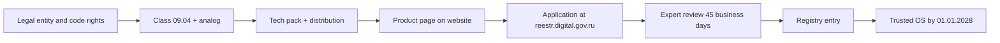

> **Language:** Canonical English. Russian edition: [ru/russian-software-registry.md](../ru/russian-software-registry.md).

# ISPF inclusion in the Russian software registry

Guide for the rights holder: what to prepare, how to assemble the technical package, and how to submit an application at [reestr.digital.gov.ru](https://reestr.digital.gov.ru).

**Not legal advice.** Before submission, align the package with counsel and, if needed, a registry consultant.

See also: [product](product.md), [deployment](deployment.md), [license-compliance](license-compliance.md).

---

## 1. Why it matters

| Effect | Basis |
|--------|-------|
| Preferences in public procurement (national regime) | RF Government Decree No. 1875, registry entry |
| VAT exemption on software sales | accredited IT company status + software registry |
| Listing on MinTsifry marketplace | [reestr.digital.gov.ru](https://reestr.digital.gov.ru) |
| "Trusted software" status (CII procurement) | Federal Law on CII, registry entry meeting requirements |

---

## 2. Regulatory basis (current as of 2026)

| Document | Role |
|----------|------|
| [RF Government Decree No. 1236](https://www.consultant.ru/document/cons_doc_LAW_189116/) (as amended by Decree No. 1937) | Registry rules, applicant and software requirements |
| [MinTsifry Order No. 486](https://www.consultant.ru/document/cons_doc_LAW_366474/) | Software classifier (class code in application) |
| [RF Government Decree No. 1937](https://www.consultant.ru/document/cons_doc_LAW_520975/) of 28.11.2025 | Compatibility with ≥2 trusted OS; repeal of Decree No. 325 |
| RF Government Decree No. 325 (2017) | **Not in effect** from 01.03.2026 — office software requirements do not apply to SCADA |

### Trusted OS compatibility deadlines (Decree No. 1936, para. 6)

For class **09.04** (industrial control / SCADA) — **from 01.01.2028** you must confirm operation on **at least 2 OS** meeting trusted-software requirements.

Until that date the application can be filed without test protocols; after inclusion you must submit compatibility data, otherwise exclusion from the registry is possible.

---

## 3. Software class for ISPF

| Field | Value |
|-------|-------|
| Classifier section | 08 — Industrial software / 09 — Organization process management tools |
| **Primary class** | **09.04** — Technological process control tools (industrial control, SCADA) |
| Class wording | Software for automation of technological equipment control at industrial enterprises |
| OKPD 2 (from classifier) | 62, 58.29.2, 58.29.3, 58.29.32, 58.29.4, 62.01.2, 62.01.29 |
| Additional class (optional) | **04.08** — Integrated platforms for application development |

### Foreign analog for expert review

Name a product in the application for functional comparison, for example:

- Inductive Automation **Ignition**
- AVEVA / Wonderware
- Citect / Schneider Electric

Mapping: object tree, drivers, HMI, historian, alarms, workflow, reports — see [product](product.md).

---

## 4. Applicant requirements (organization)

Before filing, verify against [Decree No. 1236 Rules](https://www.consultant.ru/document/cons_doc_LAW_189116/), para. 5:

| # | Requirement | Action |
|---|-------------|--------|
| 1 | Rights holder — Russian legal entity / RF citizen | Assign exclusive rights to code to RF legal entity |
| 2 | RF control: >50% votes/shares held by RF citizens or RF entities | EGRUL extract, ownership structure |
| 3 | Exclusive software rights with applicant | Employment contracts + work-for-hire **or** assignment/license contracts from authors |
| 4 | Limit on payments to foreign licensors | Statement on share of license payments in revenue (limits in Rules) |
| 5 | Product exists and is available | Working distribution + page on rights holder website |

**IT company benefits** (VAT, accreditation) — separate MinTsifry registry; do not confuse with **software** registry.

---

## 5. Full process (roadmap)



| Stage | Timeline (guide) | Result |
|-------|------------------|--------|
| 0. Rospatent (recommended) | 1–3 months | Computer program registration certificate |
| 1. Legal package | 2–4 weeks | Author contracts, EGRUL extract, payment statement |
| 2. Technical package | 2–3 weeks | Archive per §6 structure |
| 3. Distribution for expert | 1 week | Built prod image (§7) |
| 4. Product page | 1 week | URL on rights holder domain |
| 5. Application filing | 1 day | Qualified electronic signature + Gosuslugi (legal entity) |
| 6. MinTsifry expert review | up to 45 business days | Requests / conclusion |
| 7. Registry maintenance | annually | Notification by 1 June on changes |

---

## 6. Technical package structure

Assemble a directory (ZIP) for upload in the application and for the product page. File names — Russian or bilingual.

```
registry-techpack-ispf-<version>/
├── 00-README.txt                    # Package index, version, support contacts
├── 01-legal/                        # Copies for expert (originals in application legal pack)
│   ├── rights-summary.pdf           # Rights holder, basis of rights
│   ├── authors-and-contracts.pdf    # Author list, employment, acts, assignment
│   └── foreign-payments-note.pdf    # Share of license payments to foreign rights holders
├── 02-product/
│   ├── product-description.pdf      # Purpose, scope, user roles
│   ├── functional-spec.pdf          # Functional characteristics (table §6.1)
│   ├── foreign-analog-comparison.pdf# Comparison with Ignition / analog
│   └── release-notes.pdf            # Version, date, change list
├── 03-installation/
│   ├── system-requirements.pdf      # Hardware, OS, DBMS, browser, network
│   ├── installation-guide.pdf       # Server + UI + infrastructure install
│   ├── upgrade-guide.pdf            # Version upgrade, DB migrations
│   └── uninstall-guide.pdf          # Stop, data removal (brief)
├── 04-operation/
│   ├── administrator-guide.pdf      # Users, roles, Keycloak, backup
│   ├── operator-guide.pdf           # HMI, alarms, work queue
│   ├── solution-developer-guide.pdf # Bundle deploy, applications (brief for registry)
│   └── security-guide.pdf           # RBAC, authentication, prod recommendations
├── 05-api/
│   ├── api-overview.pdf             # REST + WebSocket, base URL
│   └── api-reference-excerpt.pdf    # Key endpoints (or link to full API.md)
├── 06-drivers-and-integration/
│   ├── drivers-catalog-excerpt.pdf  # Protocol list (Modbus, OPC UA, MQTT, …)
│   └── third-party-licenses.pdf     # NOTICE + THIRD_PARTY_NOTICES (required)
├── 07-expert-review/
│   ├── deployment-for-expert.pdf    # Step-by-step: deploy in 30–60 min
│   ├── demo-scenario.pdf            # Expert verification scenario (§8)
│   ├── credentials.txt              # Demo logins (admin/operator) — encrypt separately when transferring
│   └── checksums.sha256             # Hashes of JAR, zip, docker images
└── 08-trusted-os/                   # Complete by 01.01.2028
    ├── os-compatibility-matrix.pdf  # OS × ISPF version × status table
    ├── test-protocol-os-1.pdf       # Test protocol (OS #1)
    └── test-protocol-os-2.pdf       # Test protocol (OS #2)
```

### 6.1. "Functional characteristics" content (functional-spec.pdf)

Table for class **09.04** — fill "Yes" + link to documentation section:

| SCADA / industrial control function | ISPF | Source in repository |
|-------------------------------------|:----:|----------------------|
| Field equipment data acquisition | ✓ | [drivers](drivers.md) — 58 drivers |
| History storage (historian) | ✓ | [variable-history](variable-history.md) |
| Operator HMI / mimic diagrams | ✓ | [scada](scada.md), [dashboards](dashboards.md) |
| Control (write to devices) | ✓ | Driver write, object functions |
| Alarm signaling | ✓ | [automation](automation.md), work queue |
| Event journal | ✓ | Event journal API |
| Reports | ✓ | [reports](reports.md) — PDF, XLSX, HTML |
| Automation / workflow | ✓ | [workflows](workflows.md) |
| Access control | ✓ | [security](security.md) |
| Scaling / cluster | ✓ | [cluster](cluster.md) |
| Application solutions without core fork | ✓ | [solution-developer-guide](solution-developer-guide.md) |

### 6.2. Mapping: sources → PDF for tech pack

| Tech pack file | Basis (Markdown in `docs/`) |
|----------------|----------------------------|
| product-description.pdf | [product](product.md) |
| functional-spec.pdf | §6.1 + [product](product.md) § Capabilities |
| system-requirements.pdf | [getting-started](getting-started.md), [deployment](deployment.md) |
| installation-guide.pdf | [getting-started](getting-started.md), [deployment](deployment.md) § Production quick start |
| upgrade-guide.pdf | [deployment](deployment.md), Flyway migrations |
| administrator-guide.pdf | [web-console](web-console.md), [security](security.md), [demostands](demostands.md) |
| operator-guide.pdf | [operator-guide](operator-guide.md) |
| solution-developer-guide.pdf | [solution-developer-guide](solution-developer-guide.md) (abridged) |
| security-guide.pdf | [security](security.md) |
| api-overview.pdf | [api](api.md) (table of contents + typical scenarios) |
| drivers-catalog-excerpt.pdf | [drivers](drivers.md) — protocol table |
| third-party-licenses.pdf | [third-party-notices](third-party-notices.md), [license-compliance](license-compliance.md) |
| deployment-for-expert.pdf | §7 below + [deployment](deployment.md) |
| demo-scenario.pdf | §8 below + [lab-training](lab-training.md) |

**PDF build:** export from Markdown (pandoc, VS Code, Typora) or print to PDF from CI. Unified style: title with product name, version, rights holder, date.

### 6.3. Automated tech pack build

```bash
node tools/registry-techpack/build-techpack.mjs \
  --holder "OOO Your Company" \
  --support-email support@example.com \
  --product-url "https://example.com/products/ispf" \
  --zip
```

Option `--pdf` (requires [pandoc](https://pandoc.org/)), see [tools/registry-techpack/README.md](readme.md).

Output: `build/registry-techpack-ispf-<version>/` — directory per §6 structure + `00-README.txt`. Templates `01-legal/` and `08-trusted-os/` require manual completion.

---

## 7. Distribution for expert review

The expert must **deploy and verify** operability. Prepare one of:

### Option A — Docker (recommended)

| Artifact | How to obtain |
|----------|---------------|
| `ispf-server.jar` | `./gradlew :packages:ispf-server:bootJar -x test "-Pversion=<ver>"` |
| `web-console.zip` | `cd apps/web-console && npm ci && npm run build` → zip from `dist/` |
| Driver packs | `./gradlew syncAllDriverPacks` → `build/driver-packs/` (profile `permissive`) |
| Compose | `deploy/docker-compose.prod-stack.yml` + `deploy/air-gap-images.env` |
| Instructions | `07-expert-review/deployment-for-expert.pdf` |

Minimal scenario: `bash deploy/prod-quickstart.sh` (see [deployment](deployment.md)).

### Option B — Air-gap archive

See [air-gap-deployment](air-gap-deployment.md) — single tar with images, JAR, UI, scripts.

### System requirements (for system-requirements.pdf)

| Component | Minimum | Recommended |
|-----------|---------|-------------|
| API server | 4 vCPU, 8 GB RAM, 50 GB disk | 8 vCPU, 16 GB RAM, SSD |
| Server OS | Linux x86_64 (Ubuntu 22.04+, Astra, РЕД ОС — per matrix §8) | Ubuntu 24.04 LTS |
| JRE | Temurin 21+ (in Docker image) | 25 |
| DBMS | PostgreSQL 16 + TimescaleDB | Separate PG cluster |
| HMI client | Modern browser (Chromium, Firefox, Yandex Browser) | 1920×1080 |
| Network | TCP 8080 (api), 443 (HTTPS UI), device access per driver protocols | TLS termination on nginx |

---

## 8. Expert demonstration scenario (demo-scenario.pdf)

Step-by-step checklist (~45 min):

1. **Deployment** — `GET /actuator/health` → `UP`, `GET /api/v1/info` → version.
2. **Login** — Web UI, role `admin`.
3. **Object tree** — open `root.platform.devices` (fixtures or import `examples/lab-training/bundle.json`).
4. **Telemetry** — live values on dashboard / mimic (WebSocket).
5. **Historian** — variable chart over period.
6. **Alarm** — trigger alert rule, acknowledge.
7. **Control** — write to device or invoke function from HMI.
8. **Report** — export PDF or XLSX from Report Builder.
9. **Workflow** — start BPMN, task in work queue.
10. **SCADA mimic** — open mimic, binding to variable.
11. **Roles** — login as `operator`, confirm admin editors unavailable.

Import lab-training:

```http
POST /api/v1/platform/packages/import?packageId=lab-training
Content-Type: application/json

<examples/lab-training/bundle.json>
```

---

## 9. Product page on rights holder website

Required public URL (not GitHub — **applicant website**):

| Block | Content |
|-------|---------|
| Name and version | ISPF, release number |
| Description | 2–3 paragraphs + class 09.04 |
| Screenshots | HMI, mimic, object tree |
| System requirements | From §7 |
| Download / order | Contact or form |
| Documentation | Links to PDFs from tech pack or "on request" |
| Terms of use | EULA / license (AGPL + commercial) |
| Technical support | Email, phone, hours (24×7 preferred for government contracts) |
| Installation | Brief instructions + link to full guide |

---

## 10. Application at reestr.digital.gov.ru

1. **Legal entity** account on [Gosuslugi](https://www.gosuslugi.ru).
2. **Qualified electronic signature** of director (or authorized person).
3. [reestr.digital.gov.ru](https://reestr.digital.gov.ru) → "Submit application".
4. Type: **Russian software registry**.
5. Software name (as in marketing and distribution).
6. Class **09.04** (+ 04.08 if needed).
7. Upload tech pack (or links to product page — per form).
8. License payment data, warranties, support, modernization.
9. Confirmation of distribution rights.
10. Submit → respond to expert council requests on time.

**Review period:** up to **45 business days** from application registration date.

---

## 11. Trusted OS (by 01.01.2028)

For class 09.04 prepare **08-trusted-os/**:

| Step | Action |
|------|--------|
| 1 | Choose 2 OS from trusted software registry (different rights holders), e.g. **Astra Linux SE** + **РЕД ОС** |
| 2 | Deploy ISPF per installation-guide on each OS |
| 3 | Run scenario §8, capture screenshots and logs |
| 4 | Issue test protocol (date, ISPF version, OS version, result per §8 item) |
| 5 | Submit data to registry entry (subpara. "f" para. 4 of Rules) |

Current repository state: documented run on **Ubuntu/Linux + Docker**; protocols on domestic OS **must be executed and added**.

---

## 12. Master checklist

### Legal

- [ ] Russian legal entity — rights holder
- [ ] >50% RF control
- [ ] Developer contracts / work assignments
- [ ] Rospatent registration (recommended)
- [ ] Foreign license payment share statement

### Product

- [ ] Stable version (no SNAPSHOT in application)
- [ ] Class **09.04** aligned with description
- [ ] Comparison with foreign analog
- [ ] Product page on rights holder website

### Technical package (§6)

- [ ] 01-legal — copies
- [ ] 02-product — description and functions
- [ ] 03-installation — install, requirements
- [ ] 04-operation — admin, operator, security
- [ ] 05-api — API overview
- [ ] 06-drivers — catalog and dependency licenses
- [ ] 07-expert-review — distribution + scenario

### Expert review

- [ ] Distribution deploys from scratch per instructions
- [ ] Demo scenario reproducible without modifications
- [ ] Support contact for MinTsifry requests

### After inclusion

- [ ] Annual notification by **1 June** (changes, revenue)
- [ ] **08-trusted-os** by **01.01.2028**
- [ ] Update registry entry on major version change

---

## 13. Common rejection reasons

| Reason | How to avoid |
|--------|--------------|
| No exclusive rights | Assign rights before filing |
| Expert could not deploy | Test on clean VM per deployment-for-expert.pdf |
| Link does not lead to software page | Separate URL `/products/ispf` |
| Mismatch with declared class | 09.04 + table §6.1 |
| No response to MinTsifry request | Assign owner, SLA 3 business days |
| Overstated "autonomy" | Honestly list OSS dependencies in third-party-licenses.pdf |

---

## 14. Useful links

- Application: [reestr.digital.gov.ru](https://reestr.digital.gov.ru)
- Registry rules: [Decree No. 1236](https://www.consultant.ru/document/cons_doc_LAW_189116/)
- Classifier: [Order No. 486](https://www.consultant.ru/document/cons_doc_LAW_366474/)
- 2026 changes: [Decree No. 1937](https://www.consultant.ru/document/cons_doc_LAW_520975/)
- Process overview: [Reg.ru article](https://dzen.ru/a/ZQAnsk2R8AYI_xa-)

---

*Document version: 1.0. Product: ISPF. Class: 09.04.*
