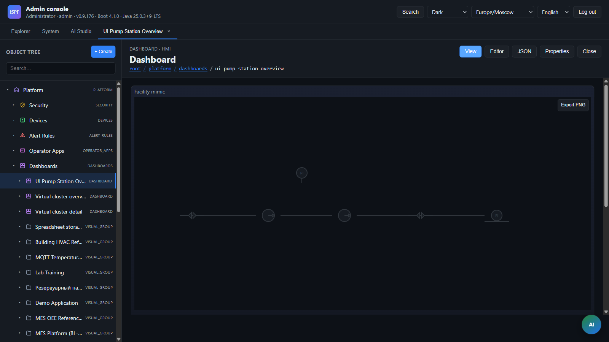

> **Language:** Canonical English. Russian edition: [ru/scada.md](../ru/scada.md).

# SCADA — ISPF mimic diagrams

> **Status:** Stable — Mimics, symbols, bindings. Hub: [doc-status.md](doc-status.md).

Configurable mimic diagrams / P&ID / single-line diagrams with an SVG symbol catalog, live bindings to the object-tree variables, and HMI-driven control.

**See also:** [scada-mimic](scada-mimic.md) (`diagramJson` schema, REST API), [widgets.md § scada-mimic](widgets.md), [dashboards](dashboards.md), [bindings](bindings.md).

---

## Purpose

SCADA mimic in ISPF covers typical operator HMI tasks:

| Task | Mechanism |
|------|-----------|
| Single-line / process diagram | `diagramJson` document + symbols |
| Live display of levels, valve states, alarms | `bindings` to device/model variables |
| Control from the mimic | `actions` (setVariable / toggle / invokeFunction) |
| Reuse one diagram on multiple dashboards | `MIMIC` object in `root.platform.mimics.*` |
| Tie-in to dashboard context | `selectionKey` in binding (same as widgets) |

Logic stays in the **object tree** (devices, bindings, functions). The mimic is a **view**, not a separate runtime.

---

## Three entity levels

Do not confuse three different kinds of “object”:

| Level | Where it lives | Example | How it is created |
|-------|----------------|---------|-------------------|
| **Platform object** | Tree `root.platform.*` | DEVICE, DASHBOARD, **MIMIC** | Explorer, API, bundle, agent tools |
| **Diagram element** | Inside `diagramJson` | tank, valve, label | Editor → **Place** tool |
| **Data on the diagram** | Platform object variables | `level`, `open`, `alarm` | Explorer → device/model; on the diagram only **binding** |

The mimic editor **does not create** devices or write telemetry — it draws symbols and binds **`ref`** (PlatformRef slash address) to symbol properties.

---

## MIMIC objects in the tree

| Path | Type | Model |
|------|------|-------|
| `root.platform.mimics` | `MIMICS` | catalog |
| `root.platform.mimics.{name}` | `MIMIC` | `mimic-v1` |

Variables on a `MIMIC` object:

| Variable | Purpose |
|----------|---------|
| `title` | Title |
| `diagram` | Diagram document JSON (`diagramJson`) |
| `refreshIntervalMs` | Binding poll interval (default 5000) |

### Creating a mimic

1. Explorer → **SCADA Mimics** (`root.platform.mimics`)
2. Right-click → **Create mimic** (or “+” button)
3. Path segment name, e.g. `my-plant` → `root.platform.mimics.my-plant`
4. Full-screen editor opens; save → `PUT /api/v1/mimics/by-path/diagram`

Alternative: `POST /api/v1/objects` with `type: MIMIC`, `templateId: mimic-v1`, `parentPath: root.platform.mimics`.

---

## `scada-mimic` widget on a dashboard

The widget renders a mimic document on the dashboard layout (builder + operator HMI).

| Field | Description |
|-------|-------------|
| `mimicPath` | Path to `MIMIC` object — diagram loaded from server (**recommended** for reuse) |
| `diagramJson` | Inline JSON when `mimicPath` is not set |
| `defaultZoom` | Initial scale (default `1`) |
| `panEnabled` | Pan/zoom with mouse wheel (default `true`) |

**Storage modes:**

- **By reference** — `mimicPath: root.platform.mimics.my-plant`. Editor in Dashboard Builder saves to the server.
- **Inline** — `diagramJson` in widget config. Handy for quick drafts without a tree object.

Example layout fragment:

```json
{
  "id": "m1",
  "type": "scada-mimic",
  "x": 0,
  "y": 0,
  "w": 84,
  "h": 56,
  "mimicPath": "root.platform.mimics.mini-tec-single-line",
  "defaultZoom": 1,
  "panEnabled": true
}
```

> The `mini-tec-sld` widget is **removed**. Use `scada-mimic` only.

---

## Mimic editor



Open from:

- **Explorer** → `MIMIC` object
- **Dashboard Builder** → `scada-mimic` widget → “Open mimic editor”

### Tools

| Tool | Action | Hotkey |
|------|--------|--------|
| **Select** | Select, drag, resize | `V` |
| **Place** | Click palette → click canvas | `P` |
| **Connect** | Two port clicks → orthogonal line | `C` |
| Undo / Redo | Document change history | `Ctrl+Z` / `Ctrl+Y` |
| Delete | Remove selected elements or line | `Del`, `Backspace` |
| Import / Export | JSON `diagramJson` | — |

### Toolbar: transform and alignment

| Group | Buttons | Condition |
|-------|---------|-----------|
| **Transform** | Flip H/V, rotate ±90° | ≥ 1 selected element |
| **Align** | left / center H / right / top / middle V / bottom | ≥ 2 elements |
| **Distribute** | evenly along H / V | ≥ 3 elements |
| **Grid** | show grid, snap to grid (toggle) | always |

Alignment runs **inside the selection bounding box** (like Visio/Figma). After align/distribute and symbol moves, lines are **recomputed** from ports.

### Selection and move

| Action | Behavior |
|--------|----------|
| Click | Select one element (or line) |
| **Shift+click** | Add/remove element from selection |
| Drag | Move selected element; if already in multi-select — **whole group** moves |
| Smart-snap | While dragging, edges/centers/ports snap to other elements (~10 px); dashed guides on canvas |
| Grid snap | When toggle is on — coordinates are multiples of `grid.size` (default 10 px on first enable) |

### Resize

- **Handles** (8 points) on the frame — only with **one** selected element, Select tool.
- Corner handles + **Shift** — preserve aspect ratio.
- Size stored in `element.props.width` / `element.props.height` (px); `scale` reset to `1`.
- Minimum size: **16×16** px.
- **W / H** fields in the properties panel stay in sync with handles.

> Selection frame is the symbol’s **logical bbox** (`symbolSize()`). Some symbols (e.g. vertical tank) do not fill the whole area — labels such as “T” and “— / 100” are included in the bbox.

### Properties panel

**X / Y** coordinates, **W / H** size, rotation, layer, **bindings** (including `qualityField`), **format rules**, **actions** (multiple per element: primary / context), tooltips (`tooltip`), custom SVG. **Layers** panel — visibility, lock, active layer for Place.

### Connections

- Lines attach to symbol **ports** (`from` / `to`: `elementId` + `port`).
- Route is **orthogonal**; when a symbol moves or rotates, the path is **recomputed** from current port positions.
- Line bindings: `flowing`, `alarm` (color / flow animation).

### Editor grid

| `grid` field | Default | Description |
|--------------|---------|-------------|
| `size` | `1` | Grid step (px); when snap enabled via toolbar — **10** if it was `1` |
| `snap` | `false` | Snap placement and drag to grid (toolbar toggle) |
| `visible` | `false` | Show grid on canvas (toolbar toggle) |

Element coordinates are **pixels on the artboard**, not dashboard grid cells.

---

## Bindings ([bindings](bindings.md))

An element or line references live platform data:

```json
"bindings": {
  "fillLevel": {
    "objectPath": "root.platform.devices.demo-sensor-01",
    "variableName": "level",
    "valueField": "value",
    "transform": "number"
  }
}
```

| Field | Description |
|-------|-------------|
| `objectPath` | Static object path |
| `selectionKey` | Instead of `objectPath` — object from dashboard context (table row, etc.) |
| `variableName` | Variable name on the object |
| `valueField` | Field in the record (usually `value`) |
| `qualityField` | OPC/reliability quality field on the same variable (for `{key}Quality` at runtime) |
| `transform` | `bool` / `number` / `string` |

The binding key (`fillLevel`, `open`, `running`, …) must match the key in the symbol’s **`bindingSchema`** (in the pack catalog or in document `customSymbols[]`) and the **`bind`** field in `behaviors[]` when behavior is data-driven.

### Control from the mimic (actions)

An element can define `actions` — operator click on HMI:

| type | Behavior |
|------|----------|
| `setVariable` | Write value |
| `toggleVariable` | Invert bool |
| `invokeFunction` | `POST .../functions/{name}/invoke` |
| `navigate` | Go to another dashboard (`dashboardPath`) or URL |
| `toggleLayer` | Toggle layer visibility on HMI |
| `cycleUnit` | Cycle units in `element.props.unitMode` |
| `toggleExpand` | Expand table (`compact` ↔ `full` in props) |

Supports `trigger` (`primary` / `context`), `label` and `order` for context menu, `objectPath` / `selectionKey`, `confirmMessage`.

---

## Diagram document (`diagramJson`)

Format **version 2** (only supported). v1 documents normalize to v2 on load without a layout runtime migration.

```json
{
  "version": 2,
  "width": 1600,
  "height": 900,
  "background": "var(--bg)",
  "grid": { "size": 1, "snap": false, "visible": false },
  "layers": [{ "id": "layer-default", "name": "Main", "visible": true }],
  "elements": [],
  "connections": [],
  "customSymbols": []
}
```

Full field schema, REST API, and bootstrap JSON re-export: [scada-mimic](scada-mimic.md).

---

## Symbol catalog

All mimic symbols are **SVG**. One renderer: `CustomSvgSymbol` + optional `behaviors` engine.

### Editor palette

| Category | ID | Description |
|----------|-----|-------------|
| **pack-valves**, **pack-pumps**, **pack-tanks**, **pack-pipes**, **pack-sensors**, **pack-electrical**, **pack-isa**, **pack-misc** | `pack.ispf-pid.*` | Standard ISA/ISO P&ID pack (~57), static geometry |
| **common** | `custom.svg` | Empty template; SVG set in `element.props` |
| **Custom SVG** | `custom:{id}` | Only symbols with `inUserLibrary: true` (see below) |

Pack symbols: `apps/web-console/src/scada/symbols/packs/ispf-pid-v1/`. Generator: [`tools/symbol-pack-isa`](readme.md).

**Full guide (upload, library, behaviors):** [scada-symbol-library](scada-symbol-library.md) (BL-94).

### Three placement modes

| Mode | `symbolId` on element | Where SVG is stored |
|------|----------------------|---------------------|
| From pack palette | `pack.ispf-pid.vertical-tank` | In pack catalog (not in document) |
| Inline custom | `custom.svg` | `element.props.svg` |
| Document library reference | `custom:lib-gen-block` | `customSymbols[].svg` |

**“Custom SVG” in the palette** — only `customSymbols[]` entries with `"inUserLibrary": true`. Bootstrap definitions (mini-TEC, pipeline) and pack copies created via “Edit as SVG” **do not** appear in the palette until you save (“Update symbol in library” or SVG upload).

### Editor workflow

1. **Standard symbol** — Place from pack category → `symbolId: pack.ispf-pid.*`, bindings in properties panel.
2. **Pack customization** — select element → “Edit as SVG” → edit markup → **“Update symbol in library”** → symbol appears under Custom SVG.
3. **SVG upload** — Custom SVG category → “Upload SVG” → immediately `inUserLibrary: true`.
4. **Import/Export** — full `diagramJson` in import panel (handy for bootstrap and CI).

---

## Custom SVG and behaviors

HMI dynamics (color, text, level, visibility) come from **SVG markup** + **`behaviors[]`** + element **`bindings`**.

### `customSymbols[]` structure

Document library entry (fragment):

```json
{
  "id": "lib-gen-block",
  "name": "GPU",
  "svg": "<rect id=\"ispf-accent\" data-ispf-accent=\"1\" .../><text id=\"ispf-label\">GEN</text><text id=\"ispf-power\">— kW</text><circle id=\"ispf-status\" .../>",
  "width": 112,
  "height": 112,
  "viewBox": "0 0 112 112",
  "ports": [{ "id": "s", "x": 56, "y": 112 }],
  "bindingSchema": [
    { "key": "running", "labelKey": "bindings.running", "type": "boolean" },
    { "key": "power", "labelKey": "bindings.power", "type": "number" },
    { "key": "label", "labelKey": "bindings.label", "type": "string", "optional": true }
  ],
  "behaviors": [
    { "bind": "running", "type": "stroke", "target": "#ispf-accent", "trueColor": "#3fb950", "falseColor": "#484f58" },
    { "bind": "running", "type": "fill", "target": "#ispf-status", "trueColor": "#3fb950", "falseColor": "#484f58" },
    { "bind": "label", "type": "text", "target": "#ispf-label", "format": "string" },
    { "bind": "power", "type": "text", "target": "#ispf-power", "format": "number", "suffix": " kW", "decimals": 0 }
  ],
  "sourceSymbolId": "gen.block",
  "inUserLibrary": false
}
```

Diagram element references the library entry:

```json
{
  "id": "gpu1",
  "symbolId": "custom:lib-gen-block",
  "x": 120,
  "y": 80,
  "props": { "label": "GPU-1", "width": 112, "height": 112 },
  "bindings": {
    "running": {
      "objectPath": "root.platform.devices.mini-tec-plant.gpu-01",
      "variableName": "running",
      "valueField": "value",
      "transform": "bool"
    },
    "power": {
      "objectPath": "root.platform.devices.mini-tec-plant.gpu-01",
      "variableName": "powerKw",
      "valueField": "value",
      "transform": "number"
    }
  }
}
```

Label **GPU-1** — via `props.label` and behavior `bind: "label"` (see `lib-gen-block` in `mini-tec-mimic.json`).

Full reference: `packages/ispf-server/src/main/resources/bootstrap/mini-tec-mimic.json` → `customSymbols`.

### SVG conventions

| Rule | Why |
|------|-----|
| `id="ispf-*"` on elements changed by behavior | Selector `target: "#ispf-label"` |
| `data-ispf-accent="1"` on symbol frame | `formatRules` highlight (stroke/fill) |
| Inner SVG **without** root `<svg>` | Only inner markup goes in the document |
| CSS variables `var(--border)`, `var(--bg-elevated)` | Light/dark theme (pack symbols) |
| `ports[]` — coordinates in symbol space (0…width/height) | Connect tool |

Per-instance SVG override only: `element.props.svg` (“Apply to instance” button). Reset — “Clear override”.

### `behaviors` types

Implementation: `apps/web-console/src/scada/svgSymbolEngine.ts`. Types: `MimicSymbolBehavior` in `scadaMimic.ts`.

| `type` | Fields | Effect |
|--------|--------|--------|
| `text` | `bind`, `target`, `format` (`string` \| `number`), `suffix`, `decimals`, `formatPattern`, `qualityBind` | Text in SVG element; bad quality → gray |
| `fill` | `bind`, `target`, `trueColor`, `falseColor` | Fill by bool |
| `stroke` | `bind`, `target`, `trueColor`, `falseColor` | Stroke by bool |
| `visibility` | `bind`, `target`, `when` (`truthy` \| `falsy`) | `display: none` |
| `hidden` | same | Inverted visibility |
| `fillLevel` | `bind`, `target` (usually `<rect>`), `maxBind`, `inset` | Rectangle height by ratio (tank level) |
| `blink` | `bind`, `target`, `when` | Blink CSS class on alarm |

`target` — CSS selector (`#ispf-lamp`) or `data-ispf-bind-target` on SVG node.

### `bindingSchema`

Slots the editor shows in the bindings panel:

```json
{ "key": "open", "labelKey": "bindings.open", "type": "boolean", "optional": true }
```

Types: `boolean`, `number`, `string`, `enum`. Key `key` = key in `element.bindings` and in `behaviors[].bind` (for dynamics).

### Pack symbols and bindings

Pack symbols default **without** `behaviors` (static icon). For live state:

- convert to document library and add `behaviors` + `bindingSchema`, or
- define `customSymbols[]` in Import/Export following the mini-TEC pattern.

### Generating new static symbols

```bash
cd tools/symbol-pack-isa && npm install && npm run build
# → apps/web-console/src/scada/symbols/packs/ispf-pid-v1/
```

Legal: [pid-symbols-legal](pid-symbols-legal.md).

---

## REST API

| Method | Path | Purpose |
|--------|------|---------|
| GET | `/api/v1/mimics/by-path?path=` | Load mimic |
| PUT | `/api/v1/mimics/by-path/diagram?path=` | Save `diagramJson` |
| PUT | `/api/v1/mimics/by-path/title?path=` | Save title |

Requires write access to the path (RBAC).

---

## Demo diagrams (bootstrap fixtures)

When `ispf.bootstrap.fixtures-enabled=true`:

| MIMIC object | Dashboard | Description |
|--------------|-----------|-------------|
| `root.platform.mimics.mini-tec-single-line` | `root.platform.dashboards.mini-tec-single-line` | mini-TEC single-line diagram |
| `root.platform.mimics.tank-farm-demo` | `root.platform.dashboards.tank-farm-hmi` | Tank farm (`tank-farm-demo` app, anonymized demo) |
| `root.platform.mimics.pipeline-rp` | `root.platform.dashboards.pipeline-scada-hmi` | Pipeline SCADA — RP screen form (RD-029 §6.4) |
| `root.platform.mimics.pipeline-*` (15 forms) | `root.platform.dashboards.pipeline-*` | Typical main oil pipeline screen forms (RD-029) |

With `pipeline-scada` bootstrap, path `tank-farm-demo` may alias the RP diagram (deprecated alias). Separate `tank-farm-demo` app — devices `root.platform.devices.tank-farm-demo.*`.

App `pipeline-scada`, devices: `root.platform.devices.pipeline-scada.*`. Re-export JSON:

```bash
cd apps/web-console && npx tsx src/scada/templates/pipeline-scada/exportPipelineScadaMimics.ts
```

mini-TEC walkthrough: [reference-mini-tec-walkthrough](reference-mini-tec-walkthrough.md).

Templates in code: `apps/web-console/src/scada/templates/`. In Dashboard Builder — **mini-TEC**, **Pipeline SCADA RP (RD-029)**, **tank farm** buttons.

---

## Typical workflow

### New production mimic

1. Create devices/models with telemetry and control functions.
2. Explorer → `root.platform.mimics` → **Create mimic**.
3. Place symbols, Connect lines, bindings → device variables.
4. Add actions on valves/pumps if needed.
5. Dashboard Builder → `scada-mimic` widget → `mimicPath` → size on fine grid (`columns: 84`, `rowHeight: 8`).
6. Operator HMI: pan/zoom, clicks on elements with actions.

### Quick draft without a MIMIC object

1. Dashboard Builder → `scada-mimic` without `mimicPath`.
2. “Open editor” → save into widget `diagramJson`.

### Bundle / agent

- `MIMIC` object in manifest `objects[]` with `templateId: mimic-v1` and initial `diagram` in variables.
- Agent: `create_object` type `MIMIC` under `root.platform.mimics`, then `set_variable` / mimic API for diagram.

---

## Link to platform logic

- Mimic bindings use the same variables as chart/value/function widgets.
- `selectionKey` works via `@dashboardContext` — see [platform-logic](platform-logic.md).
- Events and alert rules live on source objects, not inside mimic JSON.

---

## Source code (platform)

| Component | Path |
|-----------|------|
| Document types | `apps/web-console/src/types/scadaMimic.ts` |
| Parse / normalize | `apps/web-console/src/scada/document.ts` |
| Align / flip / resize | `apps/web-console/src/scada/layoutOps.ts` |
| Smart-snap on drag | `apps/web-console/src/scada/elementSnap.ts` |
| Line routing | `apps/web-console/src/scada/connectionRouting.ts` |
| Catalog / pack SVG | `apps/web-console/src/scada/symbols/` |
| Behaviors engine | `apps/web-console/src/scada/svgSymbolEngine.ts` |
| Document library | `apps/web-console/src/scada/convertBuiltinToLibrary.ts` |
| Editor | `apps/web-console/src/components/scada/` |
| HMI widget | `apps/web-console/src/components/dashboard/widgets/ScadaMimicWidgetView.tsx` |
| Mimic API | `packages/ispf-server/.../mimic/MimicService.java` |
| Bootstrap JSON | `packages/ispf-server/src/main/resources/bootstrap/*-mimic.json` |
