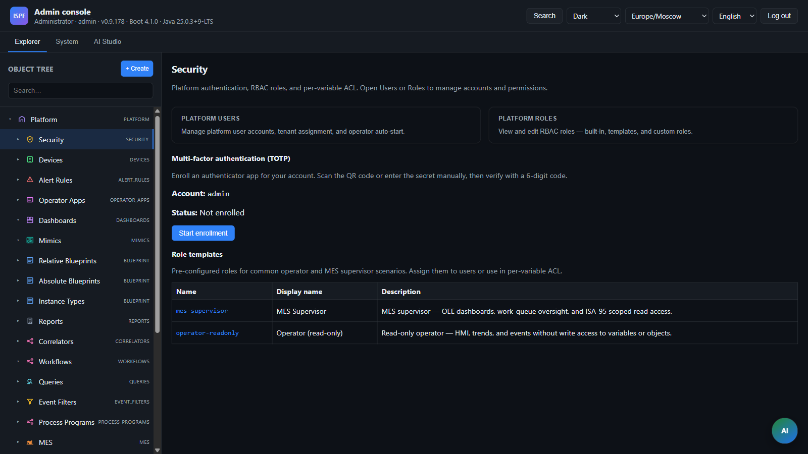

> **Language:** Canonical English. Russian edition: [ru/security.md](../ru/security.md).

# Security and RBAC

> **Status:** Stable — RBAC, MFA. Hub: [doc-status.md](doc-status.md).

## Model



ISPF uses **role-based access** at the HTTP API level:

| Role | Spring authority |
|------|------------------|
| `admin` | `ROLE_admin` |
| `developer` | `ROLE_developer` |
| `operator` | `ROLE_operator` |

Per-object ACL — see [security](security.md) (`object_acl_entries`, **Access** tab in Web Console).

## Authentication profiles

### local

File: `application-local.yml`

- OAuth disabled (dummy issuer)
- RBAC enabled; authentication via **Bearer token** after `POST /api/v1/auth/login`
- `ispf.security.token-auth-enabled: true`
- `ispf.security.local-default-role:` empty — no token means access denied
- `LocalBearerTokenFilter` + optional `X-ISPF-Role` fallback (dev only, **disabled by default** — `ispf.security.local-role-header-enabled`)

Default accounts (if DB is empty): `admin/admin`, `developer/developer`, `operator/operator`.

```bash
curl -X POST http://localhost:8080/api/v1/auth/login \
  -H "Content-Type: application/json" \
  -d '{"username":"admin","password":"admin"}'

curl -H "Authorization: Bearer <token>" http://localhost:8080/api/v1/objects
```

Web Console: login screen; session stored in `localStorage`. In `dev`/prod profile — **OIDC authorization code + PKCE** via Keycloak (**Sign in with Keycloak**). Configuration: `GET /api/v1/auth/config`. Admins manage users in tree `root.platform.security.users`.

**App auto-start:** a user can enable `autoStartEnabled` and set `autoStartApp` (operator app id, list — `GET /api/v1/operator-apps`). After Web Console login, the operator app opens instead of the admin console.

### User management (admin)

| Endpoint | Description |
|----------|----------|
| `GET /api/v1/security/users` | List users |
| `POST /api/v1/security/users` | Create user |
| `PUT /api/v1/security/users/{username}` | Update (roles, enabled, displayName, **autoStartEnabled**, **autoStartApp**) |
| `DELETE /api/v1/security/users/{username}` | Delete |
| `POST /api/v1/security/users/{username}/password` | Change password |
| `POST /api/v1/auth/logout` | End session |
| `GET /api/v1/auth/me` | Current user (with token) |
| `GET /api/v1/auth/config` | Auth mode (`local` / `oidc`) for Web Console |

Users and roles sync into the object tree (see [object-model](object-model.md)).

### dev/default (as in production)

- OAuth2 resource server, JWT from Keycloak
- Issuer: `http://localhost:8180/realms/ispf`
- Roles from JWT: `realm_access.roles` → `ROLE_admin`, `ROLE_operator`

### test

- RBAC disabled (`rbac-enabled: false`)
- All endpoints available without authorization.

## Access matrix

Rules: `IspfAuthorizationRules.java`.

| Endpoint | admin | developer | operator | public |
|----------|:-----:|:---------:|:--------:|:------:|
| `GET /api/v1/info` | ✓ | ✓ | ✓ | ✓ |
| `POST /api/v1/auth/login` | | | | ✓ |
| `GET /api/v1/auth/me` | ✓ | ✓ | ✓ | |
| `GET /actuator/health` | ✓ | ✓ | ✓ | ✓ |
| `WS /ws/**` | ✓ | ✓ | ✓ | ✓ |
| `GET /api/v1/**` | ✓ | ✓ | ✓ | |
| `POST /api/v1/events/**` | ✓ | ✓ | ✓ | |
| `POST .../functions/invoke` | ✓ | ✓ | ✓ | |
| `POST /api/v1/bff/**` | ✓ | ✓ | ✓ | |
| `POST /api/v1/workflows/instances/*/cancel` | ✓ | ✓ | ✓ | |
| `GET/POST /api/v1/work-queue/**` | ✓ | ✓ | ✓ | |
| `POST/PUT/PATCH/DELETE` solution config (`/objects`, `/applications`, data-sources, …) | ✓ | ✓ | | |
| `PUT /api/v1/objects/by-path/acl` | ✓ | | | |
| `/api/v1/platform/backup/**` | ✓ | | | |
| `/api/v1/platform/metrics`, `/runtime-settings`, `/update/**`, … | ✓ | | | |
| `/api/v1/security/**`, `/federation/**`, `/tenants/**` | ✓ | | | |
| `/api/v1/ai/**` (except `GET /ai/provider`) | ✓ | ✓ | | |
| `/api/v1/applications/**` deploy | ✓ | ✓ | | |
| `/api/v1/schedules/**` | ✓ | ✓ | | |
| `/api/v1/alert-rules/**`, `/correlators/**` | ✓ | ✓ | | |
| `/api/v1/blueprints/**` (write) | ✓ | ✓ | | |

**operator** can: read objects/dashboards/workflows, invoke functions (except script-only like `executeQuery`), work queue, fire events, write writable variables.

**developer** can: all solution configuration (objects, applications, platform SQL tools, `executeQuery`, **AI Studio**), but **not** system settings, security, federation, tenants, license/cluster.

**admin** can: everything above + platform administration.

Platform backup remains admin-only. Its export is a SYSTEM-style privileged snapshot, not a MEMBER-filtered full-tree dump available to operators.

## Keycloak (development)

Docker Compose starts Keycloak on port **8180**.

Realm `ispf` setup:

1. Admin console: http://localhost:8180 — user `admin` / `admin`
2. Create realm **ispf**.
3. Create client (public or confidential) for web/API.
4. Realm roles: `admin`, `operator`
5. Assign roles to users
6. Start server: `--spring.profiles.active=dev`

Web Console (`dev` profile): **Sign in with Keycloak** (OIDC PKCE, client `ispf-web-console`). Realm imported from `deploy/keycloak/ispf-realm.json` on `docker compose up`.

### Per-object ACL

| Endpoint | Description |
|----------|----------|
| `GET /api/v1/objects/by-path/acl?path=` | List object ACL rules |
| `PUT /api/v1/objects/by-path/acl?path=` | Replace ACL rules |

Rules: `principalType` (`ROLE`/`USER`), `principalId`, `permission` (`READ`/`WRITE`/`INVOKE`). If no rules on object or ancestor — use global RBAC. `admin` always has full access.

Web Console: **Access** tab in object inspector (admin).

## Variables

| Variable | Description |
|------------|----------|
| `ISPF_OAUTH_ISSUER` | JWT issuer URI |
| `ispf.security.rbac-enabled` | Enable/disable RBAC |
| `ispf.security.token-auth-enabled` | Bearer sessions (local) |
| `ispf.security.local-default-role` | Default role without token (local, dev only) |
| `ispf.security.trusted-proxy-ips` | Reverse-proxy IPs whose `X-Forwarded-For` is trusted for login rate-limiting; empty = header ignored |
| `ispf.security.mfa.enabled` | Enable TOTP enrollment API (`/api/v1/security/mfa/**`) |

## MFA (TOTP)

| Property | Env | Default |
|----------|-----|---------|
| `ispf.security.mfa.enabled` | `ISPF_MFA_ENABLED` | `false` |
| `ispf.security.mfa.required-for-admin` | `ISPF_MFA_REQUIRED_FOR_ADMIN` | `false` |
| `ispf.security.mfa.time-window-steps` | — | `1` (±30s drift) |

When MFA is enabled, authenticated users can:

| Endpoint | Description |
|----------|----------|
| `GET /api/v1/security/mfa/status` | Status; pending enrollments also return `pendingSecret` / `pendingOtpauthUri` for console resume |
| `POST /api/v1/security/mfa/enroll` | Start TOTP enrollment (secret + `otpauth://` URI) |
| `POST /api/v1/security/mfa/verify` | Confirm 6-digit TOTP code (`TotpUtil`) |
| `DELETE /api/v1/security/mfa/enroll` | Cancel pending enrollment |

Local login accepts optional `totpCode` on `POST /api/v1/auth/login`. When `required-for-admin=true`, admin-role logins require an enrolled secret and a valid code.

**REAL today (BL-153 Done — TOTP GA):** persisted enrollments (`mfa_enrollments`), TOTP verify, admin enforcement, Security console enrollment UI + login TOTP field.  
**Follow-up (BL-194 Planned):** WebAuthn / passkeys; Keycloak OTP as the primary IdP MFA path — intent locked in ADR [0056](decisions/0056-webauthn-idp-mfa.md) (**Proposed**, implementation parked until a named tender/customer MFA task). Pen-test prep: [pen-test-scope.md](pen-test-scope.md) (G-01).

## Per-variable ACL

Variables can define `readRoles` / `writeRoles` (JSON array of role names). Empty list = inherit object ACL.

Interactive variable-access paths run in `VariableAclRequestContext.MEMBER` mode and enforce `readRoles` / `writeRoles` through `VariableMemberAccessService`. This includes direct read/write/history/export, Object Query scans and historian columns, HTTP/agent function invocation, interactive binding queries and expression evaluation, Haystack/Brick semantic export and query, analytics query/export/expression, agent history and analytics tools, WebSocket delivery, the object editor, and federated proxy requests made on behalf of a user. Object Query omits denied variable columns and expanded rows instead of returning restricted live or historian values. Events and functions may set optional `invokeRoles` (empty = object INVOKE only); the Web Console exposes the variable ACL and `invokeRoles` editors (**BL-154 Done**).

For HTTP federation peers, channel authentication uses the peer `authToken` (a static or service-account Bearer), or falls back to the forwarded caller Bearer when no peer token is configured. The hub also sends `X-ISPF-On-Behalf-Of-User`, comma-separated `X-ISPF-On-Behalf-Of-Roles`, and `X-ISPF-On-Behalf-Of-Tenant`. On the peer, `FederationOnBehalfOfFilter` installs the delegated principal with only the intersection of the authenticated channel roles and the claimed on-behalf-of roles before `MEMBER` enforcement. The channel identity is therefore an authorization ceiling, not a way to grant the caller its service-account privileges. Tunnel proxy requests retain the trusted-channel principal installation because the WebSocket channel is already authenticated.

Federated hub reads omit remote-only variables that have no local mirror ACL metadata, and non-admin proxy writes require a local variable definition; global admins retain break-glass write access.

Background schedulers, binding-engine evaluations, and materializers remain in `SYSTEM` mode and do not apply an end user's member ACL. Federation health probes authenticate only the channel and send no on-behalf-of identity; they cannot return variable values or history.

## Multi-tenancy isolation

Canonical detail: [multi-tenant](multi-tenant.md). Tender view: [compliance-tender-pack G-03](compliance-tender-pack.md).

| Layer | Status |
| ----- | ------ |
| Logical SaaS A≠B (path + API + `tenant-admin`) | **Done** |
| OIDC `tenant_id` claim + hard mode schema provision/drop | **Done** |
| PostgreSQL RLS on shared platform object tables (`ispf.tenant.db-row-isolation`) | **Done** (no-op on H2) |
| Physical per-tenant table routing | **Optional / not claimed** |

Do **not** claim H2 row isolation or physical schema isolation for shared tables.

## Production recommendations

- Prefer `--spring.profiles.active=prod` (see `application-prod.yml`) or set the env vars below
- Do not expose `local` profile on internet-facing hosts
- Keycloak or another IdP with shortest practical JWT TTL
- TLS at ingress
- Restrict `permitAll` endpoints
- Secrets via vault, not in config files
- Set `ISPF_LICENSE_ENFORCE=true` and `ISPF_LICENSE_REQUIRE_SIGNED_BUNDLES=true`
- Set `ISPF_WEBSOCKET_ALLOWED_ORIGIN_PATTERNS` to your console origin(s) (default is localhost-only; `local`/`test` keep `*`)
- Keep `ispf.security.local-role-header-enabled=false`
- Federation outbound login: `ISPF_FEDERATION_BLOCK_LOOPBACK=true` (prod default) and optional `ISPF_FEDERATION_OUTBOUND_URL_ALLOWLIST`

Default users (`admin`/`admin`, …) are intentional for **local / test / lab** only — not a production defect.

`StartupSecurityGuard` logs warnings at startup when license enforce, signed bundles, WS origins, or RBAC look unsafe outside `local`/`test`.
