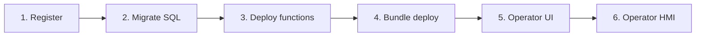

> **Language:** Canonical English. Russian edition: [ru/solution-developer-guide.md](../ru/solution-developer-guide.md).

# Solution Developer Guide

> **Status:** Stable — Deploy, operator UI, bundles. Hub: [doc-status.md](doc-status.md).

How to build an application solution on ISPF **without changing core Java**: application registration, SQL data, JSON functions, bundle deploy, operator UI, and reports.

Product overview: [product](product.md). Full API: [applications](applications.md). **Stable platform ↔ solution boundary:** [solution-developer-public-api](solution-developer-public-api.md).

---

## Core principle


**Business logic lives on the platform** — in models, variables, events, functions, and workflows on the **object tree**. Your solution does not add Java to the server: it configures ISPF mechanisms with declarative configuration (blueprints, BPMN, script functions, objects, alert rules). Bundle deploy is how you **deliver** that configuration to the platform. Full P1–P10 principles (for humans and agents): [application-principles](application-principles.md). See also [architecture](architecture.md).

## What is a "solution" on ISPF

A **solution (application)** is a registered app with an isolated SQL schema, script functions, a bundle (objects, dashboards, BPMN, blueprints), and operator UI. Solution logic **runs** on object tree nodes and through the platform runtime; the `applications` record is a registry and app schema, not a parallel engine.

| Concept | Where it lives | Example |
|---------|----------------|---------|
| **Business logic** | Object tree mechanisms | blueprint, variable + CEL, `WORKFLOW`, `ALERT`, script function |
| **Platform object** | Object tree | `root.platform.devices.pump-01` |
| **Application** | Registry + schema `app_myapp` | `my-terminal` |
| **Operator app** | `operator_app_ui` + `operator-apps` tree | `platform`, `oil-terminal` |

**Tree-first convergence (Phase 5.5):** after `POST .../deploy`, functions are addressed as `{appId}.functions.{name}` on the object path; SQL bindings may live as `bindingExpression: sqlBinding('appId','var')` on a variable; `objects[]` in the bundle updates existing nodes (reconcile), not only creates new ones.

> **Do not use the application layer as runtime.** The `applications` record is a registry and isolated SQL schema; invoke, workflow, alerts, and dashboards run through the **object tree API**. If a bundle still calls only `/applications/{appId}/functions/invoke` without tree paths — migrate to tree-first (see [applications](applications.md)).

### Legacy bundle migration to tree-first

| Was (legacy) | Now (target approach) |
|--------------|------------------|
| Only `POST .../functions/invoke` by appId | `POST /bff/invoke` or `objects/by-path/functions/invoke` on `{appId}.functions.*` |
| `screens[]` in operator manifest | `operatorUi` + dashboards in `dashboards[]` / tree |
| `objects[]` only creates new nodes | Reconcile: redeploy updates existing nodes |
| Imperative Java sync → variables | CEL bindings, `sqlBinding()`, script steps |

---

## Solution lifecycle



### Step 1. Registration

```http
POST /api/v1/applications
Authorization: Bearer <admin-token>
Content-Type: application/json

{
  "appId": "my-terminal",
  "displayName": "Oil Terminal",
  "tablePrefix": "ot_",
  "schemaName": "oil_terminal"
}
```

Or via admin console: select `root.platform.applications` → **+ Deploy application**.

### Step 2. SQL migration

Application SQL is **not** managed by platform Flyway. Migrations deploy to an isolated schema:

```http
POST /api/v1/applications/my-terminal/data/migrate
Content-Type: application/json

{
  "version": "1.0.0",
  "scripts": [
    {
      "id": "orders",
      "sql": "CREATE TABLE IF NOT EXISTS ot_order (id SERIAL PRIMARY KEY, status VARCHAR(32), created_at TIMESTAMPTZ DEFAULT NOW());"
    }
  ]
}
```

Repeat call with the same `version` + `id` is idempotent.

Check result:

```http
GET /api/v1/applications/my-terminal/data/status
```

### Step 3. JSON functions

Functions are JSON **scripts** with steps (`selectOne`, `selectMany`, `exec`, `return`).
Field names are **`sql`** + **`var`** (not `query` / `into`); every script must end with `return.fields`:

```http
POST /api/v1/applications/my-terminal/functions/deploy
Content-Type: application/json

{
  "functions": [
    {
      "name": "listOrders",
      "description": "Active orders",
      "script": {
        "steps": [
          {
            "type": "selectMany",
            "var": "rows",
            "sql": "SELECT id, status FROM ot_order WHERE status = 'ACTIVE' ORDER BY created_at"
          },
          {
            "type": "return",
            "fields": {
              "rows": "${rows}"
            }
          }
        ]
      }
    }
  ]
}
```

Invoke from BPMN (service task `INVOKE_FUNCTION`) or via BFF. For listing SQL rows on a dashboard use a **report** widget (`configure_report` + `type: report`), not `object-table` (tree children only).

### Step 4. Bundle deploy (canonical: JSON)

**Canonical API:** `POST /api/v1/applications/{appId}/deploy` with a **JSON** body (`Content-Type: application/json`). There is no multipart ZIP deploy on the current server. Full field reference: [applications](applications.md#bundle-deploy-req-pf-03).

Minimal example:

```http
POST /api/v1/applications/my-terminal/deploy
Authorization: Bearer <admin-token>
Content-Type: application/json

{
  "version": "1.0.0",
  "displayName": "Oil Terminal",
  "tablePrefix": "ot_",
  "schemaName": "oil_terminal",
  "objects": [],
  "dashboards": [
    {
      "path": "root.platform.dashboards.terminal-overview",
      "title": "Overview",
      "layoutJson": "{ \"columns\": 84, \"rowHeight\": 8, \"widgets\": [] }"
    }
  ],
  "migrations": [],
  "functions": [],
  "operatorUi": {
    "title": "Oil Terminal",
    "dashboards": [
      { "dashboardPath": "root.platform.dashboards.terminal-overview", "label": "Overview" }
    ],
    "defaultDashboardPath": "root.platform.dashboards.terminal-overview"
  },
  "reports": [
    {
      "name": "daily-summary",
      "sql": "SELECT status, COUNT(*) FROM ot_order GROUP BY status"
    }
  ]
}
```

Dashboard layouts must use the **84×8** grid ([dashboards](dashboards.md)) — never legacy `columns: 12` / `rowHeight: 72`.

### Step 5. Operator interface

Operator UI defines which dashboards the operator sees and how they are organized.

**Method A — operator apps API (recommended):**

```http
PUT /api/v1/operator-apps/my-terminal/ui
Content-Type: application/json

{
  "title": "Oil Terminal",
  "dashboards": [
    {
      "dashboardPath": "root.platform.dashboards.terminal-overview",
      "label": "Overview"
    },
    {
      "dashboardPath": "root.platform.dashboards.terminal-queue",
      "label": "Queue"
    }
  ],
  "defaultDashboardPath": "root.platform.dashboards.terminal-overview"
}
```

**Method B — admin console:**

1. `root.platform.operator-apps` → **+ Operator app**
2. Open the created node → Operator Apps panel.
3. Configure title, dashboard list, default dashboard.

**Method C — in bundle** (`operatorUi` in manifest) — applied on deploy.

### Step 6. Verification

```
http://localhost:5173?mode=operator&app=my-terminal
```

---

## Dashboards for solutions

Dashboards are platform **objects** of type `DASHBOARD`. Create them in admin console:

1. `root.platform.dashboards` → **+ Object**
2. Double-click → Dashboard Builder
3. Add widgets, bind to objects (`objectPath`) or tables (`selectionKey`)
4. Reference dashboard path in operator UI.

Widgets for application screens:

| Widget | Use |
|--------|-----|
| `object-table` | Order/device list with row selection |
| `function-button` | Invoke platform or app function |
| `dashboard-link` | Navigation between screens |
| `card-grid` | KPI cards |

See [dashboards](dashboards.md).

---

## BFF (backend for frontend)

For complex screens (paginated tables, forms) use BFF. **Canonical body** (tree-first):

```http
POST /api/v1/bff/invoke
Authorization: Bearer <token>
Content-Type: application/json

{
  "objectPath": "root.platform.applications.my-terminal.functions",
  "functionName": "listOrders",
  "input": {
    "schema": { "name": "in", "fields": [] },
    "rows": [{}]
  },
  "wireProfile": "ispf-operator-v1"
}
```

After deploy, functions are also addressable on the tree as `{appId}.functions.{name}`. Details and wire rules: [applications](applications.md#bff-req-pf-06). Prefer **dashboards + function-button / function-form** over a custom operator manifest shell.

---

## SQL reports

```http
GET /api/v1/applications/my-terminal/reports/daily-summary?format=csv
```

Report is defined in bundle (`reports[]`) or deployed separately. Export is CSV.

See [reports](reports.md).

---

## Schedules

Periodic function invocation:

```http
POST /api/v1/schedules
Content-Type: application/json

{
  "name": "nightly-cleanup",
  "cron": "0 0 2 * * *",
  "appId": "my-terminal",
  "function": "archiveOrders",
  "enabled": true
}
```

---

## BPMN integration

Service task with `ispf:actionType="INVOKE_FUNCTION"`:

```xml
<bpmn:serviceTask id="Task_ListOrders" name="List orders"
  ispf:actionType="INVOKE_FUNCTION"
  ispf:functionAppId="my-terminal"
  ispf:functionName="listOrders"
  ispf:resultVariable="orders"/>
```

User task → Work Queue task for operator.

See [workflows](workflows.md).

---

## Example structure

```
examples/demo-app/
├── bundle.json                 # or fragment files composed into POST …/deploy JSON
├── functions/
│   └── demo_listItems.script.json
└── sql/
    └── V1__demo.sql
```

Run demo: register app, then `POST …/deploy` JSON (or stepwise migrate + function deploy) per [applications](applications.md).

---

## Constraints and best practices

| Rule | Why |
|------|-----|
| SQL only in app schema | Isolation from platform tables |
| Table prefix (`tablePrefix`) | Collision guard |
| Do not change Java `ispf-server` | Domain code lives in bundle |
| Dashboards are platform objects | Single HMI for admin and operator |
| Operator UI on server | Do not store config in `public/` |
| Functions are idempotent deploys | Safe redeploy |

---

## Pre-production checklist

- [ ] Application registered, schema created
- [ ] Migrations applied (`GET .../data/status`)
- [ ] Functions deployed and tested via BFF
- [ ] Dashboards created and set in operator UI
- [ ] Operator app available at `?mode=operator&app=<id>`
- [ ] RBAC: operators have `operator` role, not `admin`
- [ ] Keycloak configured (`dev`/prod profile)

---

## Related documents

- [applications](applications.md) — full REQ-PF API
- [reports](reports.md) — SQL reports
- [dashboards](dashboards.md) — widgets
- [web-console](web-console.md) — admin UI for setup
- [glossary](glossary.md) — terms
- [roadmap](roadmap.md) — REQ-PF status
