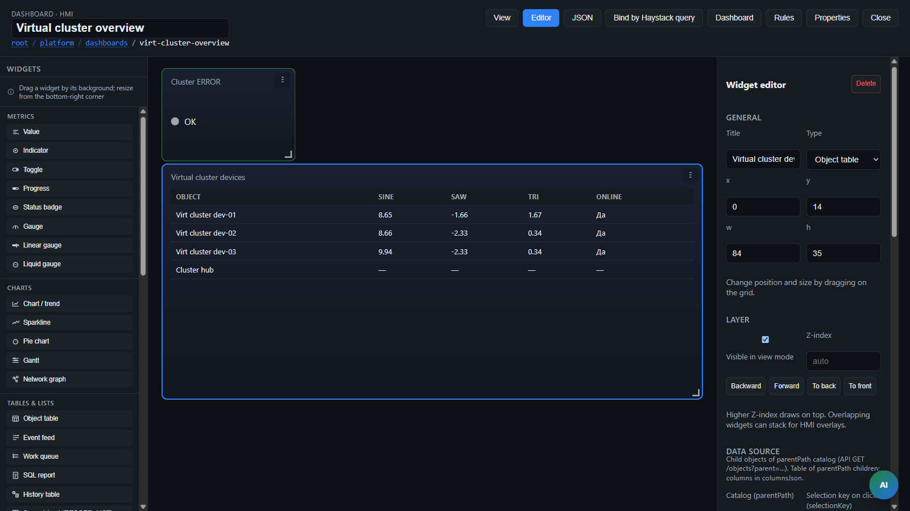

> **Language:** Canonical English. Russian edition: [ru/widgets.md](../ru/widgets.md).

# Dashboard widget reference

> **Status:** Stable — All widget types. Hub: [doc-status.md](doc-status.md).

Complete description of all ISPF widget types: purpose, HMI usage, layout fields, and examples.

**See also:** [dashboards](dashboards.md) (grid, `selectionKey`, navigation), [operator-guide](operator-guide.md) (operator role), [bindings](bindings.md) (platform bindings in variables), [spreadsheet-widget](spreadsheet-widget.md) (formulas and grids).



---

## Common fields (all widgets)

Every widget in `layout.widgets[]` has a grid position and optional data binding.

| Field | Type | Description |
|-------|------|-------------|
| `id` | string | Unique ID in layout (e.g. `temp-value`) |
| `type` | string | Widget type (`value`, `chart`, …) |
| `title` | string | Card title on HMI |
| `x`, `y` | number | Grid position (0-based) |
| `w`, `h` | number | Width and height on the **84×8** fine grid (full width = `w: 84`; see [dashboards](dashboards.md)) |
| `objectPath` | string | Static object path (`root.platform.devices.foo`) |
| `selectionKey` | string | Selection slot name; path from `selection[key]` (see [dashboards](dashboards.md)) |
| `variableName` | string | Variable name on the object |
| `valueField` | string | `DataRecord` field: `value` (default), `raw`, `online`, `unit`, `int`, `string` |
| `paramKey` | string | Read value from `session.params[key]` |
| `contextPathKey` | string | Object path from `session.params[key]` |
| `modelHintPath` | string | Editor only: sample object for variable dropdown |
| `stylesJson` | string | JSON styles for card elements (see [dashboards.md § stylesJson](dashboards.md)) |
| `demoPreviewJson` | string | Editor preview without live data |

**Object path priority:** if `selectionKey` is set and session has a selection → use selected path; otherwise `objectPath`.

### JSON fields (always strings in layout)

| Field | Contents |
|-------|----------|
| `columnsJson` | `object-table` columns |
| `variablesJson` | Array of variable names |
| `fieldsJson` | `function-form` / `input-form` fields |
| `childrenJson` | Nested widgets |
| `tabsJson` | `tab-panel` tabs |
| `slidesJson` | `carousel` slides |
| `stepsJson` | `steps-panel` steps |
| `itemsJson` | `nav-menu` items |
| `eventNamesJson` | Event name filter |
| `contextSelectionJson` / `contextParamsJson` | Context when opening dashboard |
| `rowParamsJson` / `cardParamsJson` | Params on row/card click |
| `sheetConfigJson` | Spreadsheet config |
| `stylesJson` | Inline CSS per card element |

---

## Widget categories

| Category | Data binding | Examples |
|----------|--------------|----------|
| object-variable | Variables on one object | value, chart, gauge |
| object-only | Object for invoke/write | function, function-form, input-form |
| parent-catalog | Children of folder `parentPath` | object-table, map, card-grid |
| external | Reports, events, rotation, other dashboards | report, work-queue, dashboard-link |
| session / static | Session or static content | label, image, breadcrumbs |
| composition | Nested widgets | panel, tab-panel, nav-menu |

---

## object-variable — metrics and charts

### `value` — Value

**Purpose:** large numeric or text value from an object variable.

**Operator:** view only (configure writes elsewhere).

| Field | Description |
|-------|-------------|
| `variableName` | **Required.** Variable name |
| `valueField` | Record field (default `value`) |
| `decimals` | Decimal places for numbers |
| `unit` | Static unit (`°C`, `%`) |
| `unitField` | Take unit from variable field (e.g. `unit`) |

**Example:** temperature sensor

```json
{
  "id": "temp",
  "type": "value",
  "title": "Temperature",
  "x": 0, "y": 0, "w": 21, "h": 14,
  "objectPath": "root.platform.devices.demo-sensor-01",
  "variableName": "temperature",
  "valueField": "value",
  "decimals": 1,
  "unit": "°C"
}
```

**Scenario:** SNMP monitoring — `selectionKey: "device"` + `variableName: "sysName"` for selected host name.

---

### `indicator` — Indicator (lamp)

**Purpose:** boolean or string state (ON/OFF, alarm).

**Operator:** view; color and label per configuration.

| Field | Description |
|-------|-------------|
| `variableName` | **Required.** |
| `valueField` | For online status: `variableName: status`, `valueField: online` |
| `trueLabel` / `falseLabel` | State labels |
| `trueColor` / `falseColor` | CSS colors |
| `alarmMode` | `true` = true means alarm (red); otherwise true = OK (green) |

**Example:**

```json
{
  "type": "indicator",
  "title": "Link",
  "variableName": "status",
  "valueField": "online",
  "trueLabel": "Online",
  "falseLabel": "Offline"
}
```

---

### `toggle` — Toggle

**Purpose:** write a writable bool variable on operator click.

**Operator:** click toggles value.

| Field | Description |
|-------|-------------|
| `variableName` | **Required.** Writable bool |
| `trueLabel` / `falseLabel` | ON/OFF labels |

---

### `chart` — Chart / trend

**Purpose:** variable history (line/area/bar etc.) or multi-axis `bubble` / `radar` modes.

**Operator:** view; toggle chart type on widget if enabled in UI.

| Field | Description |
|-------|-------------|
| `variableName` | **Required** for line/area/bar/range/candlestick. Variable needs `historyEnabled: true` |
| `chartStyle` | `line` \| `area` (not for bubble/radar) |
| `chartType` | `line`, `area`, `bar`, `candlestick`, `bubble`, `radar`, `range` |
| `historyRange` | `live` (sliding window), `1h`, `6h`, `24h`, `7d`, `all` |
| `maxPoints` | Max points (~120 default) |
| `color` | Line color |
| `decimals`, `unit`, `unitField` | Axis/label format |
| `bubbleXVariable`, `bubbleYVariable` | **bubble:** X/Y trajectory from live/history trends |
| `bubbleSizeVariable`, `bubbleDefaultSize` | **bubble:** marker size (Z); default 80 |
| `bubblePointsJson` | **bubble:** snapshot JSON `[{label,xVariable,yVariable,sizeVariable?}]` — overrides trajectory |
| `radarAxesJson` | **radar:** JSON `[{label,variableName,valueField?,max?}]`, minimum 3 axes |

**Bubble/radar limits:** trajectory zips by point index (no timestamp merge); radar shows latest snapshot only, not history.

**Example:**

```json
{
  "type": "chart",
  "title": "Temperature",
  "w": 56, "h": 4,
  "selectionKey": "device",
  "variableName": "temperature",
  "historyRange": "24h",
  "chartStyle": "area",
  "decimals": 1,
  "unit": "°C"
}
```

---

### `sparkline` — Sparkline

**Purpose:** compact mini-trend without axes (in a metric card).

| Field | Description |
|-------|-------------|
| `variableName` | **Required.** + `historyEnabled` |
| `historyRange`, `maxPoints`, `color`, `decimals` | Same as `chart` |

---

### `gauge` — Radial gauge

**Purpose:** value on a min–max scale.

| Field | Description |
|-------|-------------|
| `variableName` | **Required.** Current value |
| `minValue` / `maxValue` | Fixed bounds |
| `minVariable` / `maxVariable` | Or bounds from other variables on same object |
| `unit`, `decimals` | Label and precision |

**Error:** set only `minValue` without `maxValue` — gauge will not render.

---

### `linear-gauge` — Linear gauge

**Purpose:** horizontal scale; same fields as `gauge`.

---

### `liquid-gauge` — Liquid gauge

**Purpose:** vertical "liquid" level; same fields as `gauge` (`minValue`/`maxValue` or variables).

---

### `progress` — Progress bar

**Purpose:** ratio of current value to maximum (load, completion).

| Field | Description |
|-------|-------------|
| `currentVariable` | **Required.** Not `variableName`! |
| `maxVariable` | **Required.** |
| `unit`, `decimals` | Label and precision |

**Example:**

```json
{
  "type": "progress",
  "title": "Completion",
  "objectPath": "root.platform.orders.o-1",
  "currentVariable": "doneQty",
  "maxVariable": "orderQty",
  "unit": "pcs"
}
```

---

### `status-badge` — Status badge

**Purpose:** compact text/color status (driver, phase).

| Field | Description |
|-------|-------------|
| `variableName` | Default `status` |
| `valueField` | Default `value` |

---

### `pie-chart` — Pie chart

**Purpose:** shares from `RECORD_LIST` (multiple rows = sectors).

| Field | Description |
|-------|-------------|
| `variableName` | **Required.** RECORD_LIST |
| `labelField` | Sector label field |
| `valueField` | Value field (if not `value`) |
| `decimals` | Precision |

---

### `history-table` — History table (5 min)

**Purpose:** latest variable samples + average over window.

| Field | Description |
|-------|-------------|
| `variableName` | **Required.** + `historyEnabled` |
| `valueField`, `decimals` | Format |

---

### `timer` — Timer

**Purpose:** countdown or elapsed time.

| Field | Description |
|-------|-------------|
| `mode` | `countdown` — from `durationSeconds`; `elapsed` — from timestamp in `variableName` |
| `durationSeconds` | For countdown |
| `variableName` | For elapsed — start time variable |

**Operator:** countdown shows remaining time; elapsed shows time since variable timestamp.

---

### `gantt-chart` — Gantt chart

**Purpose:** horizontal bars from `RECORD_LIST` (tasks, intervals).

| Field | Description |
|-------|-------------|
| `variableName` | **Required.** RECORD_LIST |
| `labelField` | Row label |
| `startField` / `endField` | Start and end fields (epoch ms, epoch s, or numeric scale) |
| `interactive` | Pan/zoom in operator mode (default `true`; disabled in editor) |
| `allowBarDrag` | Drag bars when RECORD_LIST is writable (default `true`) |

**Operator:** wheel zoom, drag timeline pan, double-click reset viewport; drag bars to change start/end via `setVariable`.

---

### `network-graph` — Network graph

**Purpose:** nodes and edges from two RECORD_LIST functions.

| Field | Description |
|-------|-------------|
| `nodesVariable` | Node RECORD_LIST |
| `edgesVariable` | Edge RECORD_LIST |
| `labelField` | Node label |

---

### `svg-widget` — SVG button

**Purpose:** interactive SVG icon (lab, mimic).

**Operator:** click invokes function or toggles variable.

| Field | Description |
|-------|-------------|
| `svgUrl` | **Required.** SVG URL |
| `clickAction` | `function` \| `toggle` |
| `functionName` | When `function` |
| `toggleVariable` | When `toggle` |
| `confirmMessage` | Confirm before action |

---

### `spreadsheet` — Spreadsheet

**Purpose:** A1 grid with formulas (built-in ISPF engine).

**Full reference:** [spreadsheet-widget](spreadsheet-widget.md). Operator workflow — [operator-guide](operator-guide.md).

| Field | Description |
|-------|-------------|
| `sheetMode` | `free` (default) \| `configured` |
| `sheetConfigJson` | rows, cols, cells, filters, dataRegion |
| `persistMode` | `session` \| `variable` |
| `valuesVariable` | RECORD_LIST variable when `variable` persist |
| `sessionKey` | Session key (default `sheet:{id}`) |
| `editable` | `false` — view only |

---

### `mini-tec-sld` — mini-TEC single-line diagram *(removed)*

**Status:** widget removed. Use [`scada-mimic`](#scada-mimic--scada-mimic-diagram) + `MIMIC` object or embedded `diagramJson`. See [scada](scada.md).

---

### `scada-mimic` — SCADA mimic diagram

**Purpose:** configurable mimic / P&ID / single-line diagram with symbol catalog and live variable bindings.

**Operator:** view state; pan/zoom; click element with `actions` — control (toggle/setVariable/invokeFunction).

| Field | Description |
|-------|-------------|
| `diagramJson` | Diagram document JSON (if `mimicPath` not set) |
| `mimicPath` | `MIMIC` object path — diagram loaded from server |
| `defaultZoom` | Zoom (default `1`) |
| `panEnabled` | Wheel zoom (default `true`) |
| `showGrid` | Grid in preview (reserved) |

**Create MIMIC:** Explorer → `root.platform.mimics` → "Create mimic".

**Editor:** Dashboard Builder → "Open mimic editor"; Explorer → `MIMIC` object. Tools: select/place/connect, **align and distribute**, flip/rotate, **resize handles**, smart snap, grid toggle, multi-select (Shift), Del to delete. Details — [scada.md § Editor](scada.md).

**See:** [scada](scada.md), [scada-mimic](scada-mimic.md).

---

## object-only — actions and forms

### `function` — Invoke button

**Purpose:** single click → `POST .../functions/{name}/invoke`.

**Operator:** press button; with `confirmMessage` — confirm dialog.

| Field | Description |
|-------|-------------|
| `functionName` | **Required.** |
| `buttonLabel` | Button text |
| `confirmMessage` | Confirmation dialog |
| `inputJson` | Static input rows for invoke |
| `workflowPath` | Alternative: start workflow instead of function |
| `objectPath` / `selectionKey` | Object for invoke |

**Example:**

```json
{
  "type": "function",
  "title": "Reset",
  "objectPath": "root.platform.devices.demo-sensor-01",
  "functionName": "resetAlarm",
  "buttonLabel": "Reset alarm"
}
```

---

### `function-form` — Form → function

**Purpose:** field input + button → invoke with form arguments.

**Operator:** fill fields → Submit; multi-step wizard actions.

| Field | Description |
|-------|-------------|
| `functionName` | **Required.** |
| `fieldsJson` | Field array (see below) |
| `buttonLabel` | Button text |
| `wizardStepsJson` | `[{ "id", "label" }]` — wizard steps |
| `validateFunctionName` | BFF validation on Next |
| `paramBindingsJson` | Form field ← session param |
| `requireSessionParamsJson` | Required params before submit |
| `syncFieldsToSessionJson` | Sync fields to session |
| `clearSessionParamsJson` | Clear params after success |
| `closeModalOnSuccess` | Close modal (default true in modal) |

**`fieldsJson` properties:**

| Property | Description |
|----------|-------------|
| `name` | Function argument name |
| `label` | Form label |
| `type` | `text`, `number`, `select`, `multiselect`, `time`, `checkbox`, `textarea` |
| `optionsFrom` | parentPath — options = catalog children |
| `optionsFromReport` | Options from SQL report |
| `staticOptions` | Fixed list |
| `defaultValue` | Default value |
| `required`, `hidden`, `hint` | UX |
| `step` | wizard step id |
| `showWhenJson` | Conditional display |
| `colSpan` | 1 = half row, 2 = full |

**Example (lab append row):**

```json
{
  "type": "function-form",
  "title": "Append row",
  "objectPath": "root.platform.devices.lab-userA-01",
  "functionName": "appendTableRow",
  "buttonLabel": "Append",
  "fieldsJson": "[{\"name\":\"int\",\"label\":\"Int\",\"type\":\"number\"},{\"name\":\"string\",\"label\":\"String\",\"type\":\"text\"}]"
}
```

---

### `input-form` — Variable write form

**Purpose:** operator enters values → `setVariable` on object (HMI form without function).

| Field | Description |
|-------|-------------|
| `fieldsJson` | Form fields |
| `buttonLabel` | Save button |

**Fields:** `name`, `label`, `type` (`text`, `number`, `textarea`, `select`, `slider`, `checkbox`, `radio`, `datetime`, `time`), `variableName` (write target), `optionsFrom`, `min`/`max`/`step`, `defaultValue`.

---

### `variable-editor` — Variable editor

**Purpose:** list object variables with inline editing of writable fields.

**Operator:** change value in table → saved on server.

| Field | Description |
|-------|-------------|
| `variablesJson` | JSON array of names; empty = all object variables |
| `objectPath` / `selectionKey` | Object |

---

## parent-catalog — managed objects

### `object-table` — Object table

**Purpose:** table of **child** objects under folder `parentPath`.

**Operator:** view; click row → selection (`selectionKey`) and/or navigate to another dashboard.

| Field | Description |
|-------|-------------|
| `parentPath` | **Required.** Folder, not device |
| `columnsJson` | Columns (see below) |
| `selectionKey` | Publish `selection[key]=path` on click |
| `namePattern` | Name glob (`gpu-*`) |
| `objectType` | Type filter (`DEVICE`, …) |
| `rowTargetDashboard` | Open dashboard on click |
| `rowOpenMode` | `navigate` \| `modal` |
| `rowSelectionKey` | Selection key in target dashboard |
| `rowParamsJson` | Extra params on click |

**`columnsJson` column:**

```json
[
  { "variable": "sysName", "label": "Name" },
  { "variable": "status", "label": "On", "field": "online", "trueLabel": "OK", "falseLabel": "—" },
  { "objectField": "displayName", "label": "Object" }
]
```

| Column props | Description |
|--------------|-------------|
| `variable` | Variable name on row object |
| `label` | Header |
| `field` | DataRecord field (default `value`) |
| `objectField` | `displayName` or `path` without variable |

---

### `card-grid` — Object cards

**Purpose:** tiles of child objects with multiple variables per card.

**Operator:** card click → selection/navigation.

| Field | Description |
|-------|-------------|
| `parentPath` | **Required.** |
| `variablesJson` | `["temperature","status"]` — what to show |
| `cardTargetDashboard`, `cardOpenMode` | Navigation |
| `cardSelectionKey`, `cardParamsJson` | Context on click |

---

### `map` — Map

**Purpose:** markers for each child of `parentPath` (MapLibre + OSM).

**Operator:** marker click → selection / dashboard.

| Field | Description |
|-------|-------------|
| `parentPath` | **Required.** |
| `latVariable` | Geo variable on child |
| `latField` / `lonField` | Coordinate fields (default `lat`/`lon`) |
| `labelVariable` | Marker label |
| `zoom`, `centerLat`, `centerLon` | Map view |
| `tileUrl`, `mapStyleUrl`, `tileAttribution` | Custom tiles |
| `rowTargetDashboard`, `rowOpenMode`, `rowSelectionKey`, `rowParamsJson` | Same as table |

---

### `object-tree` — Object tree

**Purpose:** hierarchy under `parentPath` for navigation/selection.

| Field | Description |
|-------|-------------|
| `parentPath` | **Required.** |
| `selectionKey` | Node selection |
| `maxDepth` | Traversal depth |

---

## external — platform and navigation

### `dashboard-link` — Dashboard link

**Purpose:** button opens another dashboard (tab or modal panel).

**Operator:** press button; with `requireSessionParamsJson` button is disabled without required context.

| Field | Description |
|-------|-------------|
| `targetDashboardPath` | **Required.** |
| `openMode` | `navigate` \| `modal` |
| `buttonLabel` | Button text |
| `modalTitle` | Modal title |
| `confirmMessage` | Confirmation |
| `contextSelectionJson` | Pass selection |
| `contextParamsJson` | Pass params |
| `requireSessionParamsJson` | JSON array of required keys |

---

### `sub-dashboard` — Embedded dashboard

**Purpose:** embed another layout inside the widget.

| Field | Description |
|-------|-------------|
| `targetDashboardPath` | Static path |
| `targetDashboardPathKey` | Path from `session.params[key]` |
| `inheritContext` | `true` — pass parent selection |

---

### `report` — SQL report

**Purpose:** table from platform REPORT.

**Operator:** view; CSV/PDF/XLSX export; optional row selection.

| Field | Description |
|-------|-------------|
| `reportPath` | **Required.** |
| `emptyMessage` | Text when result empty |
| `parametersJson` | Static run parameters |
| `contextParamsJson` | session param → report param |
| `showCsv`, `showPdf`, `showXlsx`, `showHtml` | Export buttons |
| `selectable` | Row click → session |
| `rowSelectionKey`, `rowParamsFromRowJson` | Map columns to params |
| `autoSelectFirstRow` | Select first row on load |
| `statusDotColumnsJson` | Columns with status-dot |

---

### `event-feed` — Event feed

**Purpose:** recent platform events (automation journal).

| Field | Description |
|-------|-------------|
| `objectPathPrefix` | Path prefix filter |
| `eventNamesJson` | `["thresholdExceeded", …]` |
| `payloadFilterExpr` | Client-side payload filter |
| `maxItems` | Row limit |

---

### `work-queue` — BPMN task queue

**Purpose:** user tasks for operator (claim/complete).

**Operator:** Claim → Resume action → Complete.

| Field | Description |
|-------|-------------|
| `operatorId` | Filter by operator |
| `operatorAppId` | Filter by operator app |
| `maxItems` | Task limit |

---

## session/static — decoration

### `label` — Label

**Purpose:** static or templated text.

| Field | Description |
|-------|-------------|
| `text` | Fixed text |
| `textJson` | Template JSON |
| `paramKey` | Substitute `session.params[key]` |

---

### `breadcrumbs` — Breadcrumbs

**Purpose:** path from session (selection or params).

| Field | Description |
|-------|-------------|
| `pathKey` | Key in selection/params |
| `separator` | Separator (default `/`) |

---

### `context-list` — Context (debug)

**Purpose:** shows dashboard `selection` and `params`. For HMI development.

---

### `image` — Image

| Field | Description |
|-------|-------------|
| `imageUrl` | Image URL |
| `alt` | Alt text |

---

### `html-snippet` — HTML snippet

| Field | Description |
|-------|-------------|
| `htmlJson` | HTML (XSS caution — trusted content only) |

---

## composition — screen composition

### `panel` — Panel container

**Purpose:** group of nested widgets with shared title.

| Field | Description |
|-------|-------------|
| `childrenJson` | Widget array |
| `collapsible` | Collapsible panel |
| `variant` | `simple` |

---

### `tab-panel` — Tabs

**Purpose:** multiple tabs, each with its own widget set.

| Field | Description |
|-------|-------------|
| `tabsJson` | `[{ "id", "label", "children": [ …widgets ] }]` |

**Operator:** switch tabs by click.

---

### `drawer-panel` — Drawer panel

| Field | Description |
|-------|-------------|
| `drawerLabel` | Open button label |
| `childrenJson` | Drawer contents |

---

### `carousel` — Carousel

| Field | Description |
|-------|-------------|
| `slidesJson` | `[{ "title", "children": [ … ] }]` |
| `autoplayMs` | Autoplay (0 = off) |

---

### `steps-panel` — Step panel

| Field | Description |
|-------|-------------|
| `stepsJson` | `[{ "id", "label", "children": [ … ] }]` |
| `activeStepKey` | Active step (or from session) |

---

### `composite-widget` — Composite widget

**Purpose:** flat list of nested widgets without panel wrapper.

| Field | Description |
|-------|-------------|
| `childrenJson` | Widget array |

---

### `nav-menu` — Navigation menu

**Purpose:** list of dashboard links within the screen.

| Field | Description |
|-------|-------------|
| `itemsJson` | `[{ "label", "dashboardPath" }]` |

---

## Common mistakes

| Mistake | Fix |
|---------|-----|
| `progress` with `variableName` | Use `currentVariable` + `maxVariable` |
| `object-table` with `objectPath` | Need `parentPath` (folder) |
| Empty `chart` | Enable `historyEnabled` on variable |
| `gauge` without max | Set `maxValue` or `maxVariable` |
| `pie-chart` not RECORD_LIST | Variable must be table of rows |
| Column shows "—" | Variable name does not match model |
| Two widgets with same `selectionKey` | OK for detail view; different keys for different selections |
| `columnsJson` as object in API | In layout — **escaped string** |

---

## Recommended sizes (w × h)

| Widget | Size (84-grid) |
|--------|------|
| value, indicator, toggle | w=14–28, h=2 |
| chart | w=42–84, h=4–6 |
| object-table | w=84, h=4–6 |
| function-form | w=28–42, h=4 |
| spreadsheet | w=56–84, h=5–8 |
| map | w=56–84, h=6–8 |

---

## Source code

| What | Where |
|------|-------|
| TypeScript types | `apps/web-console/src/types/dashboard.ts` |
| View components | `apps/web-console/src/components/dashboard/widgets/` |
| Property editor | `widgetEditorFields.tsx`, `WidgetEditorPanel` |
| Palette samples | `widgetSamples.ts` |
| AI / agent spec | `AgentWidgetPropertiesGuide.java` |
