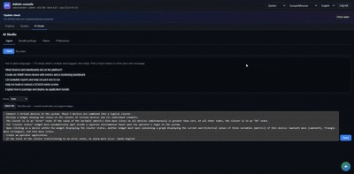

> **Язык:** русская версия (вычитка). Канонический английский: [en/ai-development.md](../en/ai-development.md).

# Уровень разработки искусственного интеллекта (REQ-FW-40…44)

> **Статус:** Beta — ContextPack, Studio; BL-178 live ≥95% выполнен (52/52 @100%, 2026-07-19). Теги: [doc-status](../en/doc-status.md).

Инфраструктура разработки на стороне платформы для разработчиков решений. ИИ считывает курируемый контекст, генерирует **декларативный пакет JSON**, запускает шлюзы проверки и публикует через существующий API развертывания. **Агент с приоритетом дерева** (FW-44) работает с деревом живых объектов шаг за шагом.

**Target approach:** ИИ не пишет Java/React в `main`; только проверенные артефакты (пакеты, модели, дашборды, функции, события) и узлы дерева с помощью инструментов платформы.

См. [0004-ai-artifact-generation-gates](decisions/0004-ai-artifact-generation-gates.md), [0005-tree-first-ai-agent](decisions/0005-tree-first-ai-agent.md) и [0051-poka-yoke-constraints-over-guards](decisions/0051-poka-yoke-constraints-over-guards.md) (prevention вместо эвристических гвардов).

---

## Компоненты

| ID | Компонент | Расположение |
|----|-----------|----------|
| FW-40 | `LlmProvider` SPI | `packages/ispf-ai-api`, adapters `ispf-ai-openai-compatible`, `ispf-ai-ollama` |
| FW-41 | ContextPack | `ai/context/`, `tools/ai-pack/build.py`, classpath `ai/context-pack.json` |
| FW-42 | ToolRegistry | `com.ispf.server.ai.tool.AiToolRegistry`, REST `/api/v1/ai/tools/**` |
| FW-43 | Platform Studio | Web Console tab **AI Studio** (`apps/web-console`) |
| FW-44 | Tree-first agent | `com.ispf.server.ai.agent.*`, REST `/api/v1/ai/agent/**` |
| FW-44b | MCP adapter | `com.ispf.server.ai.mcp.*`, profile `mcp`, REST `/api/v1/ai/mcp` |
| FW-45 | Platform knowledge briefing | `PlatformBriefingService`, `ContextPackSearchService`, agent tools |
| FW-46 | База знаний агента | [agent-knowledge](agent-knowledge.md) — подходы к приложениям, карточная документация |
| FW-47 | Agent discovery tools | `AgentDiscoveryTools` — functions, events, variable schemas |
| FW-48 | Инструменты автоматизации агентов | `AgentAutomationTools` — оповещения, корреляторы, пользовательский интерфейс оператора, `create_variable`, кластерные сценарии |

---

## Контекстный пакет (FW-41)

Build from docs and `examples/*/bundle.json`:

```bash
python tools/ai-pack/build.py
```

Выходы:

- `ai/context/generated/ispf-context-pack.json`
- `packages/ispf-server/src/main/resources/ai/context-pack.json`

Пакет включает поля схемы пакета, шаги сценария, типы виджетов, фрагменты документации API, справочные примеры, **driverCatalog**, **featureIndex**, **exampleSummaries**, **docCatalog** (индекс всех `docs/*.md`), **docChunks** для оцениваемого поиска и **competitiveGapIndex** (индекс readiness gaps — BL-182).

Primary agent router doc: [agent-knowledge](agent-knowledge.md) (`search_context topic=agent-knowledge`). Gaps: `search_context topic=gaps`.

### Context pack v2 (BL-182)

| Поверхность | Поведение |
|---------|----------|
| `GET /api/v1/ai/tools/context-pack` | Метаданные + `competitiveGapCount` / `topReadinessGaps` + `livePlatform` |
| `POST /api/v1/ai/tools/context-pack/refresh` | Admin: сброс кэша пакета + bump live epoch |
| `search_context topic=gaps\|readiness` | Поиск по `competitiveGapIndex` |
| AI Studio Status | Счётчик gaps, live drivers/apps, кнопка refresh |

Classpath JSON остаётся build-time (ADR-0004); live state — overlay, не runtime-rebuild docs/examples.

Рабочие процессы CI и выпуска выполняются `python tools/ai-pack/build.py` перед тестированием/сборкой сервера (`ISPF_VERSION` из тега в выпуске).

---

## Брифинг по платформе (FW-45)

Каждый чат агента вводит компактный блок **Знание платформы (авто)** в системную подсказку через `PlatformBriefingService`:

| Блокировать | Источник |
|-------|--------|
| Drivers | Live `DriverCatalog` + maturity |
| Виртуальные профили | Встроенная шпаргалка |
| Reference examples | ContextPack `exampleSummaries` |
| Features | ContextPack `featureIndex` |
| Readiness gaps | Топ строк из `competitiveGapIndex` |
| Живой снимок | Развернутые приложения + версии пакета + дочерние элементы дерева в сеансе `rootPath` |

Конфигурация:

```yaml
ispf:
  ai:
    briefing-max-chars: 12000
    briefing-every-turn: false   # true = full static briefing every turn; default first turn only + live always
```

На последующих turn'ах (по умолчанию): статические драйверы/примеры/функции опущены; **живой снимок** все еще обновлен.

---

## Регистр инструментов (FW-42)

REST API только для администратора:

| Конечная точка | Цель |
|----------|---------|
| `GET /api/v1/ai/tools/context-pack` | Context pack metadata + readiness gaps + live overlay |
| `POST /api/v1/ai/tools/context-pack/refresh` | Evict pack cache + refresh live overlay (admin) |
| `POST /api/v1/ai/tools/validate-bundle` | Semantic bundle validation (no DB writes) |
| `POST /api/v1/ai/tools/dry-run-deploy` | Validate + list `wouldApply` sections |
| `GET /api/v1/ai/models` | List models from active LLM provider |
| `POST /api/v1/ai/bundles/generate` | Prompt → bundle → validate → dry-run |

Тело запроса для проверки/пробного прогона:

```json
{
  "appId": "warehouse",
  "manifest": { "version": "1.0.0", "...": "..." }
}
```

**Acceptance path:** prompt → generated JSON → `validate-bundle` → CI green → `POST /api/v1/platform/packages/import`.

Audit log: table `ai_tool_audit` (migration `V37__ai_tool_audit.sql`).

**Сохранение:** строки доступны только для добавления; нет автоматической очистки в OSS. Сессия сворачивается через `agent_sessions` / `agent_turns` после `ispf.ai.agent-session-ttl-hours` (24 часа по умолчанию). Для соблюдения требований экспортируйте через `GET .../audit?format=csv` перед выселением TTL. В столбце `app_id` хранится агент `sessionId` для запуска по принципу «сначала дерево».

---

## Агент «Дерево прежде всего» (FW-44)

Петля ReAct на платформе с жёстким лимитом шагов (**по умолчанию 256**, `ispf.ai.agent-max-steps` / `ISPF_AI_AGENT_MAX_STEPS`). Агент работает до завершения или лимита — **без пауз mid-run**. Кооперативный **cancel** (`POST .../cancel`); live steps через `GET .../progress` (UI ~1 с). Только admin.

**Multi-turn sessions:** каждый чат — сессия в **PostgreSQL** (`agent_sessions` / `agent_turns`, TTL `ispf.ai.agent-session-ttl-hours`, по умолчанию 24ч). История ходов replay в LLM (компактные user/assistant summaries). `AgentRunState` (validate → import) живёт на весь чат; после рестарта JVM история сохраняется до TTL.

| Конечная точка | Цель |
|----------|---------|
| `GET /api/v1/ai/agent/tools` | Catalog of platform tools |
| `POST /api/v1/ai/agent/sessions` | Create empty session `{ sessionId, title: "New chat", ... }` |
| `GET /api/v1/ai/agent/sessions/{id}` | Restore chat turns for UI |
| `GET /api/v1/ai/agent/sessions/{id}/progress` | Live steps while a turn is running (`running`, `steps[]`) |
| `POST /api/v1/ai/agent/sessions/{id}/messages` | Send message → run until finish/cancel/limit |
| `POST /api/v1/ai/agent/sessions/{id}/cancel` | Request cooperative cancel of in-flight turn |
| `DELETE /api/v1/ai/agent/sessions/{id}` | Delete session (clear context) |
| `GET /api/v1/ai/agent/sessions/{id}/audit` | Admin-only audit export (`format=json` default, `format=csv` for compliance) |
| `GET /api/v1/ai/agent/sessions/{id}/trace` | Turn trace: steps + audit metrics (latency, tokens) |
| `GET /api/v1/ai/agent/metrics` | Aggregated agent metrics (`days` query param) |
| `POST/GET/DELETE /api/v1/ai/agent/sessions/{id}/documents` | Session-scoped knowledge files |
| `POST /api/v1/ai/agent/run` | **Deprecated** one-shot run (no session store); prefer sessions API |

См. [0034-agent-observability-and-session-knowledge](decisions/0034-agent-observability-and-session-knowledge.md) (FW-49…53).

---

## Наблюдаемость агента (FW-49…53)

| ID | Особенность | Расположение |
|----|---------|----------|
| FW-49 | Audit metrics + trace API + `AgentTracePanel` | `AiToolAuditStore`, `AgentTraceService`, Web Console |
| FW-50 | `agent_session_documents`, `search_session_context` | `AgentSessionDocumentService` |
| FW-51 | Turn graph tab | `AgentTurnGraph.tsx` |
| FW-52 | `GET /agent/metrics`, `AgentPromptVersions` | `AgentMetricsService`, AI Studio |
| FW-53 | `PlanDepth.LITE` default | `AgentSpecPlanValidator`, `AgentPlanPromptSection` |

В **режиме запроса** используется выделенный [`AgentAskPromptBuilder`](../../packages/ispf-server/src/main/java/com/ispf/server/ai/agent/AgentAskPromptBuilder.java) — конвейер планирования отсутствует.

Audit columns (migration `V67__ai_tool_audit_metrics.sql`): `latency_ms`, `prompt_tokens`, `completion_tokens`, `turn_id`, `step_no`, `interaction_mode`, `prompt_profile`.

Создать сеанс:

```json
{ "rootPath": "root" }
```

Отправить сообщение:

```json
{
  "message": "Создай SNMP localhost и дашборд с CPU",
  "rootPath": "root"
}
```

Устаревший одноразовый запуск (все еще поддерживается):

```json
{
  "goal": "List devices under root.platform.devices and create lab-sensor-1",
  "rootPath": "root"
}
```

Ответ включает `steps[]` (вызовы инструментов + результаты), `summary` и `status` (`OK`, когда модель выдает `finish`; `CANCELLED` при прекращении работы пользователя; `ERROR` при сбое анализа или ограничении шага).

Инструменты платформы (обработчики Java, поддержка ACL):

| Инструмент | Цель |
|------|---------|
| `search_context` | Оценочный поиск по docChunks, драйверам, функциям, примерам (`topic` необязательно) |
| `list_drivers` | Live driver catalog filter by query/maturity |
| `get_driver_help` | Driver config slice from context pack |
| `list_examples` | Reference bundle index |
| `get_example_bundle` | Manifest subset for appId (e.g. mes-reference) |
| `list_applications` | Registered apps + active bundle versions |
| `list_functions` | Callable functions on object (tree + deployed BFF) |
| `get_function` | Function input/output schema |
| `list_event_catalog` | Bundle event catalog for appId |
| `get_event_schema` | Event payload schema for fire_event |
| `describe_variables` | Variable field schemas (writable, history) |
| `invoke_bff` | Application BFF function (`mes_listOrders`, …) with wire result |
| `invoke_tree_function` | Invoke function on object path (raw rows) |
| `search_objects` | Search tree by query, optional type/parentPrefix |
| `list_object_models` | Platform model templates (`templateId` for create_object) |
| `fire_event` | Fire object event (optional appId for catalog schema) |
| `list_events` | Recent event journal entries |
| `list_objects` | List tree children |
| `get_object` | Read one node |
| `create_object` | Create DEVICE, DASHBOARD, CUSTOM, … |
| `delete_object` | Delete tree node by path (stops device driver if running) |
| `get_dashboard_layout` | Read layout JSON from dashboard path or built-in template |
| `set_dashboard_layout` | Replace layout from JSON or template (`snmp-host-monitoring`, `virtual-cluster-overview`, …) |
| `add_dashboard_widget` | Append one widget to `layout.widgets[]` |
| `configure_alert` | Create/update ALERT rule (CEL condition → event) |
| `configure_correlator` | Create/update event correlator |
| `configure_operator_ui` | Operator HMI default dashboard + menu |
| `create_variable` | Новая переменная с PlatformRef binding (предпочтительно SINGLETON-хаб для логики приложения) |
| `list_automation` | List alert rules and correlators |
| `get_automation_schema` | Reference for alert/correlator/dashboard/binding/operator fields |
| `list_variables` | Read object variables + values |
| `set_variable` | Update variable (config, dashboard layout, …) |
| `configure_driver` | SNMP/driver config + mappings + optional start |
| `driver_control` | start / stop / poll / status |
| `validate_bundle` | 0004 gate (no DB writes) |
| `dry_run_deploy` | Validate + `wouldApply` |
| `import_package` | Deploy bundle (requires prior validate/dry-run OK in same run) |

LLM replies with one JSON object per turn: `{"type":"tool","name":"...","arguments":{...}}` or `{"type":"finish","summary":"...","result":{...}}`.

### Надежность агента (режимы сбоя)

| Неудача | смягчение последствий |
|---------|------------|
| Модель возвращает прозу/уценку | `AgentLlmActionResolver` повторных попыток с подталкиванием только в формате JSON (`ispf.ai.agent-parse-retries`, по умолчанию **5**) |
| `type:function` / missing `type` / nested `function` | `AgentJsonProtocol` normalizes common LLM variants |
| Виджет JSON выбран вместо действия | Парсер оценивает только `tool`/`finish` (и псевдонимы); игнорирует `type:DASHBOARD` в аргументах |
| Playbook `%s` авария (`Format specifier`) | В сборниках пьес используется только конкатенация; `AgentPromptStartupValidator` не загружается, если `%s` остается |
| `search_context` петля | `AgentLoopGuard` вводит подсказки о остановке после 3 повторений; инструменты дашборда, документированные в строке |
| Достигнут предел шага | Turn завершается на `OK` + `stepLimitReached` + предложение «Продолжить» (`agent-max-steps`, по умолчанию 256) |
| Неразбираемый ответ после повторных попыток | Ход возвращает `status: ERROR` + человеческое резюме (сессия сохранена); аудит `agent_parse_error` |

История сеансов воспроизводит компактные сводки помощника (максимум 800 символов за ход).

Настройте ограничение шага и выходные токены:

```yaml
ispf:
  ai:
    timeout-seconds: 600
    agent-max-steps: 256
    agent-max-tokens: 131072   # ~50% of 256k context for completion; prompt uses the rest
    agent-parse-retries: 5
    agent-max-text-inject-chars: 524288   # ~512 KB TZ/spec inline
    agent-max-attachment-bytes: 33554432  # 32 MB upload
    agent-session-ttl-hours: 24
    agent-max-history-turns: 128
    max-tokens: 65536   # bundle generation completion cap
```

Env: `ISPF_AI_TIMEOUT_SECONDS`, `ISPF_AI_AGENT_MAX_STEPS`, `ISPF_AI_AGENT_MAX_TOKENS`, `ISPF_AI_AGENT_MAX_TEXT_INJECT_CHARS`, `ISPF_AI_AGENT_MAX_ATTACHMENT_BYTES`, `ISPF_AI_AGENT_MAX_HISTORY_TURNS`.

`max-tokens` (default **65536**, env `ISPF_AI_MAX_TOKENS`) — лимит **ответа** для bundle generation.

`agent-max-tokens` (default **131072**, env `ISPF_AI_AGENT_MAX_TOKENS`) — лимит **ответа** на один ход агента.

256k у Qwen/vLLM — **окно контекста** (подсказка + завершение). По умолчанию выше рассчитаны под `max-model-len=262144`: до ~512 КБ ТЗ + система/инструменты/история в командной строке, до 128 тыс. токенов при завершении. Не ставьте `agent-max-tokens=262144` — подсказка не оставляет места. vLLM на хосте-выводе должен разрешить `max_tokens` ≥ 131072.

Сеансы **сохраняются в PostgreSQL** (`agent_sessions`, `agent_turns`) с вытеснением TTL (по умолчанию 24 часа, `ispf.ai.agent-session-ttl-hours`). Перезапуск JVM сохраняет историю чата до TTL; Веб-консоль сохраняет индекс чата в `localStorage` и повторно загружает ходы через `GET session`.

---

## Адаптер MCP (0006)

Дополнительный профиль **`mcp`** предоставляет те же инструменты агента платформы внешним клиентам MCP (Cursor, CI) без дублирования обработчиков.

| Транспорт | Конечная точка/режим | Авторизация |
|-----------|-----------------|------|
| HTTP JSON-RPC | `POST /api/v1/ai/mcp` | То же, что и API агента: admin **Bearer** после `POST /api/v1/auth/login` (`X-ISPF-Role` выключен по умолчанию) |
| stdio | `ispf.mcp.stdio-enabled=true` | Actor `mcp-stdio` (local dev only) |

Давать возможность:

```yaml
spring:
  profiles:
    active: local,mcp

ispf:
  mcp:
    enabled: true
    server-name: ispf-platform
    stdio-enabled: false   # true for Cursor stdio subprocess
```

Методы: `initialize`, `tools/list`, `tools/call`, `resources/list`, `resources/read`, `ping`. Инструмент вызывает делегата на номер `PlatformAgentToolRegistry`; необязательный `sessionId` в аргументах привязывается к сеансам агента БД. Записи аудита используют `source=mcp` и префикс инструмента `mcp_<name>`.

### Ресурсы ContextPack (фаза 17.3)

Клиенты MCP могут читать статические фрагменты ContextPack без обращения к инструментам:

| УРИ | Содержание |
|-----|---------|
| `contextpack://info` | Version, counts |
| `contextpack://bundle-manifest` | Bundle fields and rules |
| `contextpack://script-steps` | Script step names |
| `contextpack://widget-types` | Widget catalog |
| `contextpack://driver-catalog` | Driver index |
| `contextpack://feature-index` | Platform features |
| `contextpack://example-summaries` | Reference bundles |
| `contextpack://competitive-gap-index` | Readiness / competitive gap index |
| `contextpack://live-platform` | Live drivers, apps, object counts |
| `contextpack://doc-chunks` | Documentation chunks |

Example: `{"method":"resources/read","params":{"uri":"contextpack://script-steps"}}`

Пример курсора (HTTP на локальный сервер):

```json
{
  "mcpServers": {
    "ispf": {
      "url": "http://localhost:8080/api/v1/ai/mcp",
      "headers": { "Authorization": "Bearer <admin-token>" }
    }
  }
}
```

См. [0006-mcp-agent-tool-adapter](decisions/0006-mcp-agent-tool-adapter.md).

---

## SPI LlmProvider (FW-40)

Configure via `application.yml` or env:

```yaml
ispf:
  ai:
    enabled: true
    provider: noop            # noop | openai-compatible | ollama | custom-url
    base-url: https://api.openai.com/v1
    model: gpt-4o-mini
    api-key-env: OPENAI_API_KEY
    timeout-seconds: 60
    max-tokens: 16384
    temperature: 0.2
    agent-max-concurrent-turns-per-user: 2
    agent-max-turns-per-hour-per-user: 120
    agent-require-approval-for-mutate: true   # BL-106; set false in dev profile
```

**Утверждение инструментов изменения (BL-106):** когда `ispf.ai.agent-require-approval-for-mutate` равно `true` (по умолчанию на продукте/локальном VPS), инструменты агента, доступные не только для чтения (`create_object`, `deploy_bundle`, …), блокируются до тех пор, пока пользователь не утвердит план. Утверждение записывается в `ai_tool_audit` как `agent_plan_approved` с именем пользователя утверждающего. Пользовательский интерфейс: прикрепленный баннер **Утвердить план** при нажатии `planPhase=awaiting_approval`.

**Справочные сценарии (BL-108):** `docs/agent-scenarios/`, путь к классам `agent-scenarios/catalog.json`, API `GET /api/v1/ai/agent/scenarios`, вкладка «Состояние AI Studio».

Прометей (когда микрометр включен): `ispf.agent.turns.started.total`, `ispf.agent.turns.rate_limited.total`, `ispf.agent.turns.completed.total`, `ispf.agent.guard.blocks.total` (тег `guard`), датчики `ispf.agent.turns.last_hour`, `ispf.agent.turn.steps.avg`.

**Панель управления SLO агента (BL-110):** при `ispf.ai.enabled=true` Система → Показатели включает раздел **AI Agent SLO** (`turnsLastHour`, `turnsRateLimitedTotal`, `guardBlocksByType`, `avgStepsPerTurn`).

| Provider | `base-url` example |
|----------|-------------------|
| `openai-compatible` | `https://api.openai.com/v1` |
| `ollama` | `http://localhost:11434` |
| `custom-url` | Any OpenAI-compatible endpoint |
| `noop` | Default — validate/dry-run work; generate returns 503 |

API keys are read from env var name in `api-key-env`; never stored in audit log.

---

## Платформа-Студия (FW-43)

Веб-консоль → вкладка **AI Studio** (только администратор). Интерфейс на английском языке; разделы: **Агент** | **Пакет** | ** Настройки**.



**Admin Copilot (плавающая кнопка):** у конфигуратора справа внизу кнопка **AI** — **отдельно от AI Studio**: свои сессии (`ispf-agent-chats-copilot`), режим **ask**, `clientChannel: copilot`. Это помощник **здесь и сейчас**: глубокая история чата в модель не подаётся (новый session на каждый вопрос), ответ строится по живому **focus trail** (`clientFocus.detail.trail` / правила / выражение). AI Studio остаётся multi-turn workspace (`ispf-agent-chats`, `clientChannel: studio`). В редакторе выражений: **Спросить Copilot** открывает FAB; **Debugger** — в отдельной модалке.

**Первоначальный агент** (вкладка «Агент»):

1. Боковая панель: горизонтальная полоса чатов + «+ Новый»; список инструментов — вкладка «Настройки»
2. Оставьте задачу обычным языком — последующие сообщения сохраняют контекст в том же чате.
3. Агент выполняет действия на платформе и отвечает понятным текстом.
4. В «Подробности (N шагов)» — нумерованный список с `<code>` наименованием инструмента и значком последствия; ссылки «Открыть устройство» / «Открыть дашборд»
5. Удаление чата — кнопка × на таблеточном чате.
6. Чат не размонтируется при переключении вкладок AI Studio или раздела «Обозреватель»; HTTP-запрос продолжается на расстоянии
7. При закрытии вкладки браузера во время запроса — восстановление ответа при следующем открытии (опрос `GET /agent/sessions/{id}`)
8. На телефоне: компактная панель инструментов, поле ввода на всех компонентах.

** Настройки**: статус провайдера и Context Pack, `defaultRootPath`, `defaultAppId`, восстановление последнего чата, список инструментов агента.

Пример: *«Создай SNMP localhost, метрики CPU/RAM/сеть и дашборд»* — устройство `snmp-localhost`, драйвер `snmp`, дашборд `snmp-host-monitoring`.

**Сгенерировать пакет** (вкладка «Пакет Bundle»):

1. Укажите `appId`
2. Подсказка → **Сгенерировать** (требуется настроенный LLM)
3. **Проверить** / **Пробный развертывание**
4. **Опубликовать** → `POST /api/v1/platform/packages/import`
5. **Предпросмотр оператора** → `?mode=operator&app={appId}`

Studio не добавляет новые разделы пакета; он использует тот же контракт манифеста, что и импорт вручную.

**Федерация** (отдельный раздел `root.platform.federation`): вкладки Узлы / Токены / Туннель / Проверка — см. [web-console](web-console.md).

---

## Пакетный контракт

Выходные данные AI должны соответствовать [solution-developer-public-api](solution-developer-public-api.md). Дополнительное происхождение в `metadata`:

```json
{
  "metadata": {
    "generatedBy": "ai-studio",
    "contextPackVersion": "ispf-0.1.0-SNAPSHOT",
    "promptId": "..."
  }
}
```

Commercial bundles: sign **after** AI edits (`contentSha256` covers manifest body).

---

## Связанные документы

- [agent-knowledge](agent-knowledge.md) — подходы к заявкам, полный индекс документации для агента
- [plugins](plugins.md) — внешний поставщик LLM (например, драйверы)
- [applications](applications.md) — развернуть API
- [dashboards](dashboards.md) — реестр виджетов для сгенерированных дашбордов.
- [ROADMAP.md § Часть B (FW-40…48)](roadmap.md)
