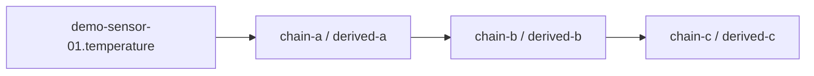
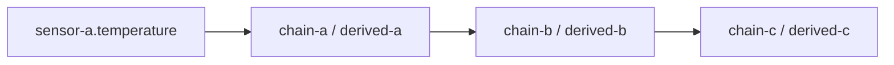

> **Язык:** русская версия (вычитка). Канонический английский: [en/analytics-historian-cookbook.md](../en/analytics-historian-cookbook.md).

# Cookbook: historian-вычисления

Рецепты для **historian binding rules** (`kind: historian` в `@bindingRules`). Одно правило = один analytics-тег со своей выходной переменной, расписанием и выражением.

См. [ADR-0041](decisions/0041-multi-tag-historian-computations.md) и [analytics-tag-catalog.md](analytics-tag-catalog.md).

**Дорожная карта (как в PI AF):** единый каталог формул, плагины и свои формулы — [ADR-0042](decisions/0042-analytics-function-catalog.md) (BL-212–215). Сейчас в UI и API — только встроенный набор; браузер каталога и «сохранить как формулу» в работе.

---

## Модель

| Понятие | Значение |
|---------|----------|
| Хранение | `@bindingRules` на **целевом устройстве** (тот же JSON-массив, что и реактивные правила) |
| Kind | `"historian"` — `BindingRuleEngine` пропускает; analytics engine компилирует и считает |
| Путь тега | `objectPath#ruleId` (напр. `root.devices.sensor-a#avg-temp-5m`) |
| Live-значение | `target.variableName` на устройстве (любое имя, не только `derivedValue`) |
| Метаданные | `@historianRuleMeta` — quality и last eval **по id правила** (см. ниже) |
| Reactive vs historian | Reactive — мгновенный CEL; historian — окна historian и DAG |

---

## Форма правила

```json
{
  "id": "avg-temp-5m",
  "name": "Скользящее среднее 5m",
  "enabled": true,
  "order": 10,
  "kind": "historian",
  "activators": {
    "onStartup": false,
    "onVariableChange": [
      { "objectPath": "root.platform.devices.sensor-a", "variableName": "temperature" }
    ],
    "onEvent": null,
    "periodicMs": 60000
  },
  "condition": "",
  "expression": "rollingAvg(root.platform.devices.sensor-a.temperature, 5m)",
  "windowBucket": "5m",
  "target": { "kind": "variable", "variableName": "avgTemp5m", "field": "value" }
}
```

### Виды выражений

| Форма | Пример | Helper |
|-------|--------|--------|
| Builtin | `rollingAvg(path.var, 5m)` | `rollingAvg` |
| Builtin | `rateOfChange(path.var, 1h)` | `rateOfChange` |
| Builtin | `oee('path', 'avail', 'perf', 'qual', 8h)` | `oee` |
| CEL + historian | `hist.avg('path', 'var', '5m')` | `cel` |
| CEL-композит | `(hist.avg('a', 't', '5m') + hist.avg('b', 't', '5m')) / 2.0` | `cel` |

В CEL используйте **литералы double** (`2.0`, не `2`) при смешении с развёрткой `hist.*`.

---

## Сохранение (REST)

```http
GET  /api/v1/objects/by-path/binding-rules?path={devicePath}
PUT  /api/v1/objects/by-path/binding-rules?path={devicePath}
```

Historian-правила автоматически создают целевую переменную, если её нет.

**UI:** инспектор объекта → **Вычисления** → **+ Правило** → тип **Historian** → модальный редактор выражения (кнопки **Проверить** / **Применить**). Встроенные функции (`rollingAvg`, `hist.avg`, …) — в каталоге редактора, не отдельные кнопки пресетов на панели.

---

## Встроенные пресеты (сервер / редактор)

Статические рецепты в коде (`HistorianComputationPresets`). **Не** объекты в дереве и **не** кнопки на панели «Вычисления» — только подсказки в каталоге функций модального редактора выражения и в API/cookbook.

| id | Выход (по умолчанию) | Шаблон |
|----|----------------------|--------|
| `rollingAvg` | `avgValue` | `hist.avg(…)` или `rollingAvg(…)` |
| `rateOfChange` | `rocValue` | `rateOfChange(…)` |
| `oee` | `oeePct` | `oee(…)` |
| `customCel` | `computedValue` | CEL с `hist.*` |

---

## Рецепт 1 — скользящее среднее {#recipe-rolling-avg}

**Цель:** среднее `temperature` за 5m на `sensor-a` → переменная `avgTemp5m`.

```json
{
  "id": "avg-temp-5m",
  "kind": "historian",
  "expression": "rollingAvg(root.platform.devices.sensor-a.temperature, 5m)",
  "windowBucket": "5m",
  "target": { "kind": "variable", "variableName": "avgTemp5m", "field": "value" }
}
```

(Добавьте `activators`, `enabled`, `order` как в полном примере выше.)

**Путь тега:** `root.platform.devices.sensor-a#avg-temp-5m`

---

## Рецепт: скорость изменения {#recipe-rate-of-change}

Builtin `rateOfChange(path.var, window)` — дельта между первым и последним средним bucket за окно.

```json
"expression": "rateOfChange(root.platform.devices.sensor-a.temperature, 1h)",
"windowBucket": "1h"
```

---

## Рецепт: минимум за окно {#recipe-min}

Builtin `min(path.var, window)` — минимум bucket `min` за окно.

```json
"expression": "min(root.platform.devices.sensor-a.temperature, 1h)",
"windowBucket": "1h"
```

---

## Рецепт: максимум за окно {#recipe-max}

Builtin `max(path.var, window)` — максимум bucket `max` за окно.

```json
"expression": "max(root.platform.devices.sensor-a.temperature, 1h)",
"windowBucket": "1h"
```

---

## Рецепт: totalizer {#recipe-totalizer}

Builtin `totalizer(path.var, window)` — сумма средних bucket × число сэмплов за окно.

```json
"expression": "totalizer(root.platform.devices.sensor-a.flow, 1h)",
"windowBucket": "1h"
```

---

## Рецепт: последний сэмпл {#recipe-last}

Builtin `last(path.var, window)` — последний сэмпл historian (lookback 24h), иначе live value.

```json
"expression": "last(root.platform.devices.sensor-a.temperature, 1h)",
"windowBucket": "1h"
```

---

## Рецепт 2 — OEE (A × P × Q)

**Цель:** OEE смены на линии из `availabilityPct`, `performancePct`, `qualityPct` (0–100, с historian).

```json
{
  "id": "shift-oee",
  "kind": "historian",
  "expression": "oee('root.platform.devices.line-01', 'availabilityPct', 'performancePct', 'qualityPct', '8h')",
  "windowBucket": "8h",
  "activators": { "periodicMs": 300000, "onVariableChange": [ … три переменные … ] },
  "target": { "kind": "variable", "variableName": "oeePct", "field": "value" }
}
```

**Формула:** `oeePct = (A/100) × (P/100) × (Q/100) × 100` по buckets в `windowBucket`.

**Тег:** `root.platform.devices.line-01#shift-oee`

---

## Рецепт 3 — цепочка из трёх тегов

**Цель:** сырой сенсор → сглаживание → ещё сглаживание → финальный KPI.



1. **analytics-chain-a:** `rollingAvg(demo-sensor-01.temperature, 1h)` → `derived-a`
2. **analytics-chain-b:** источник `analytics-chain-a.derived-a` → `derived-b`
3. **analytics-chain-c:** источник `analytics-chain-b.derived-b` → `derived-c`

Каждое правило на **своём** устройстве; id правила уникален в `@bindingRules` этого устройства.

> **Имена в тестах:** `analytics-chain-a` / `demo-sensor-01`. **На prod:** `root.platform.devices.analytics-demo.chain-a` и `sensor-a` — см. [рецепт 5](#рецепт-5--полный-пример-на-prod-analytics-demo).

**Проверка lineage:**

```http
GET /api/v1/platform/analytics/tags/by-path?path=root.platform.devices.analytics-chain-c#analytics-chain-c-rule
```

В ответе: `upstreamTagPaths`, `downstreamTagPaths`, `lineage`.

---

## Рецепт 4 — CEL-композит между устройствами {#recipe-cel}

**Цель:** среднее температур двух сенсоров на третьем устройстве.

```json
{
  "id": "avg-ab-5m",
  "kind": "historian",
  "expression": "(hist.avg('root.platform.devices.analytics-demo.sensor-a', 'temperature', '5m') + hist.avg('root.platform.devices.analytics-demo.sensor-b', 'temperature', '5m')) / 2.0",
  "windowBucket": "5m",
  "target": { "kind": "variable", "variableName": "temperature", "field": "value" }
}
```

Валидация: `POST /api/v1/platform/analytics/expression/validate`.

---

## `@historianRuleMeta` — что это и чего не делать

На каждом устройстве с historian-правилами платформа ведёт системную переменную `@historianRuleMeta` — JSON-объект **по id правила**:

```json
{
  "chain-a-rule": {
    "quality": "ok",
    "lastEvalAt": "2026-07-09T15:19:14.477Z",
    "lastEvalStatus": "ok"
  }
}
```

| Поле | Смысл |
|------|--------|
| `quality` | `ok`, `uncertain`, `error`, `disabled` — для каталога и downstream propagation |
| `lastEvalAt` | Когда analytics engine последний раз считал правило |
| `lastEvalStatus` | `ok`, `error`, `skipped` |

**Важно:** `@historianRuleMeta` — **не источник данных** для `hist.avg(...)` и не подставляйте её в шаблоны выражений. Источник — обычные переменные (`temperature`, `derived-a`, …) на путях устройств. Метаданные только для диагностики и quality в каталоге.

---

## Рецепт 5 — полный пример на prod: `analytics-demo`

Развёрнутый эталон на https://ispf.iot-solutions.ru (скрипты в репозитории). Демонстрирует цепочку ADR-0041 + дашборд + multi-tag query.

### Дерево объектов

| Путь | Тип | Назначение |
|------|-----|------------|
| `root.platform.devices.analytics-demo` | CUSTOM | Папка примера |
| `…analytics-demo.sensor-a` | DEVICE | Виртуальный датчик (`virtual-lab-v1`, `temperature`) |
| `…analytics-demo.chain-a` | DEVICE | Правило `chain-a-rule` → `derived-a` |
| `…analytics-demo.chain-b` | DEVICE | Правило `chain-b-rule` → `derived-b` |
| `…analytics-demo.chain-c` | DEVICE | Правило `chain-c-rule` → `derived-c` |
| `root.platform.dashboards.analytics-demo` | DASHBOARD | Виджеты цепочки |

### Схема цепочки



Каждый hop — отдельное устройство, своё правило в `@bindingRules`, окно **5m**:

```text
rollingAvg(root.platform.devices.analytics-demo.sensor-a.temperature, 5m)  → derived-a
rollingAvg(root.platform.devices.analytics-demo.chain-a.derived-a, 5m)   → derived-b
rollingAvg(root.platform.devices.analytics-demo.chain-b.derived-b, 5m)     → derived-c
```

Альтернатива в CEL: `hist.avg('…chain-a', 'derived-a', '5m')` — эквивалент по смыслу, другой синтаксис.

### Пути тегов каталога

- `…chain-a#chain-a-rule`
- `…chain-b#chain-b-rule` (upstream: chain-a)
- `…chain-c#chain-c-rule` (upstream: chain-b)

Проверка: `GET /api/v1/platform/analytics/tags?path=root.platform.devices.analytics-demo`

### Historian: что включить

| Переменная | `historyEnabled` | Зачем |
|------------|------------------|--------|
| `sensor-a.temperature` | да | Сырой ряд для `rollingAvg` и графиков |
| `chain-a.derived-a` | да | После создания правила (переменная появляется автоматически) |
| `chain-b.derived-b` | да | то же |
| `chain-c.derived-c` | да | то же |

Historian на выходных переменных включается **после** сохранения правил — иначе PATCH history вернёт «Unknown variable».

### Скрипты развёртывания

Из корня репозитория:

```powershell
# Устройства, binding rules, historian, smoke-проверка
python deploy/tools/setup-historian-chain-example.py https://ispf.iot-solutions.ru

# Дашборд с виджетами
python deploy/tools/setup-historian-chain-dashboard.py https://ispf.iot-solutions.ru
```

Логин по умолчанию: `admin` / `admin` (только для lab/prod с этими учётными данными).

### Дашборд `analytics-demo`

| Виджет | Привязка |
|--------|----------|
| 4× **value** | live: `temperature`, `derived-a`, `derived-b`, `derived-c` |
| **chart** (multi-tag) | `analyticsQueryTagsJson` — четыре ряда, `chartStyle: line`, `historyRange: 6h` |
| 2× **chart** (area) | сырой `temperature` и финальный `derived-c`, `historyRange: live` |

Пример `analyticsQueryTagsJson`:

```json
[
  {"path": "root.platform.devices.analytics-demo.sensor-a", "variable": "temperature", "field": "value", "label": "raw"},
  {"path": "root.platform.devices.analytics-demo.chain-a", "variable": "derived-a", "field": "value", "label": "chain-a"},
  {"path": "root.platform.devices.analytics-demo.chain-b", "variable": "derived-b", "field": "value", "label": "chain-b"},
  {"path": "root.platform.devices.analytics-demo.chain-c", "variable": "derived-c", "field": "value", "label": "chain-c"}
]
```

Запрос уходит в `POST /api/v1/platform/analytics/query` (BL-206). Обновление не чаще ~30 с (rate limiter).

**Почему на multi-tag графике сначала одна линия:** API отдаёт все серии, но у `derived-*` в historian мало точек (правила и `historyEnabled` включены недавно). При крупном bucket (`1h` на окне `6h`) у производных рядов долго только один ненулевой bucket — линия с `connectNulls: false` почти не видна. **Что делать:** подождать накопления истории (периодический расчёт `periodicMs: 60000`), включить historian на всех выходах, для отладки — отдельные chart-виджеты на каждую переменную или окно `1h` / bucket `5m`.

---

## Сверка с планом (ADR-0040 / ADR-0041)

| План | Статус | Примечание |
|------|--------|------------|
| `kind: historian` в `@bindingRules` | ✅ | `BindingRuleKind`, REST PUT/GET |
| Несколько правил и имён переменных на DEVICE | ✅ | `derived-a` / `derived-b` / … |
| Путь тега `objectPath#ruleId` | ✅ | Каталог, lineage, DAG |
| Единая вкладка **Вычисления** | ✅ | `ObjectComputationsPanel`, reactive + historian |
| Reactive engine пропускает historian | ✅ | `BindingRuleEngine` |
| Analytics engine считает historian | ✅ | `AnalyticsEngineService`, periodic tick |
| `@historianRuleMeta` по rule id | ✅ | Не использовать как источник `hist.*` |
| Убрать bootstrap `ANALYTICS_TEMPLATE` | ✅ | Новые конфигурации — только binding rules |
| Пресеты в коде, не в дереве | ✅ | `HistorianComputationPresets`; UI — каталог в редакторе, без toolbar пресетов |
| Модальный редактор выражений | ✅ | `BindingExpressionEditorModal` |
| Валидация historian vs CEL | ✅ | `validateBindingRuleExpression` / analytics validate API |
| Оператор может сохранять правила | ✅ | ACL `binding-rules` PUT для read-ролей |
| JSON `kind: "historian"` (lowercase) | ✅ | `@JsonCreator` на `BindingRuleKind` |
| Multi-tag charts (`/analytics/query`) | ✅ | `analyticsQueryTagsJson` на chart widget |
| Эталон на prod | ✅ | `analytics-demo` + скрипты deploy/tools |
| OEE / cross-device CEL на prod | 📋 | Описано в рецептах 2 и 4, не развёрнуто на VPS |
| API `/templates/*` | ⚠️ устарело | Оставлено для совместимости; новые проекты не используют |
| Легенда / несколько линий на sparse data | 🔧 UX | Данные есть в API; UI дорабатывается при короткой истории derived |

---

## Catalog API

| Метод | Путь | Описание |
|-------|------|----------|
| GET | `/api/v1/platform/analytics/tags?path=` | Список тегов |
| GET | `/api/v1/platform/analytics/tags/by-path?path=` | Один тег (`objectPath#ruleId`) |
| POST | `/api/v1/platform/analytics/query` | Мультитеговый запрос для графиков |

Полная таблица — в [английской версии](../en/analytics-historian-cookbook.md).

---

## Дашборды

- **Live:** путь устройства + **имя выходной переменной** правила (`derived-a`, не `derivedValue`).
- **Один ряд historian:** chart/sparkline → `objectPath` + `variableName` + `historyRange`.
- **Несколько рядов:** chart с `chartStyle: line` + `analyticsQueryTagsJson` → `POST /api/v1/platform/analytics/query`.
- Эталон: [Рецепт 5](#рецепт-5--полный-пример-на-prod-analytics-demo), дашборд `root.platform.dashboards.analytics-demo`.
- Не ссылайтесь на `root.platform.analytics.*` и `analyticsTemplateId` — снято с поддержки (ADR-0041).

---

## Устарело: `ANALYTICS_TEMPLATE`

Поток «шаблон в `root.platform.analytics` → Apply → `derivedValue`» **снят с поддержки** для новых конфигураций (ADR-0041). Используйте binding rules и этот cookbook.

---

## См. также

- [bindings.md](bindings.md)
- [ADR-0040](decisions/0040-unified-computations-ui.md), [ADR-0041](decisions/0041-multi-tag-historian-computations.md)
