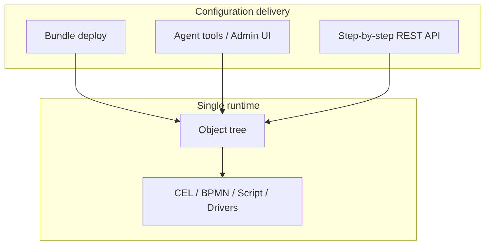

> **Язык:** русская версия (вычитка). Канонический английский: [en/application-principles.md](../en/application-principles.md).

# Принципы разработки приложений ISPF

> **Статус:** Stable — Target approach P1–P10. Теги: [doc-status](doc-status.md).

Канонические правила для **разработчиков решений** и **AI-агентов** (tree-first agent, AI Studio, MCP). Хаб-ссылки: [architecture.md](architecture.md), [ADR-0001](decisions/0001-app-platform-boundary.md), [solution-developer-guide.md](solution-developer-guide.md), [agent-knowledge.md](agent-knowledge.md), [platform-logic.md](platform-logic.md).

Детали API и виджетов — в связанных документах ниже.

**Агент:** `search_context(query=..., topic=application-principles)`.

---

## Target approach

**Бизнес-логика приложения живёт в декларативной конфигурации дерева объектов; платформа поставляет generic-движки; bundle deploy — упаковка и доставка конфигурации, а не отдельный runtime.**

---

## Принципы P1–P10

У каждого принципа два уровня: повествование для людей и действенные правила для агентов.

### P1. Дерево объектов — единственный runtime

**Для людей:** После deploy всё выполняется через узлы дерева (`root.platform.devices.*`, `{appId}.functions.*`, `DASHBOARD`, `WORKFLOW`, `ALERT`). Строка в `applications` — **реестр + изолированная SQL-схема**, не отдельный движок. Invoke, alerts, dashboards, bindings — через tree API и WebSocket.

**Для агентов:**

- Адресуйте функции по tree path: `{appId}.functions.{name}`; используйте `invoke_bff` / `invoke_tree_function` — не выдумывайте REST.
- `list_applications` — только для appId/schema; runtime — `list_objects`, `get_object`, `list_variables`.



---

### P2. Платформа — движки; решение — конфигурация

**Для людей:** ISPF — middleware/framework. Платформа (`main`) реализует generic-механизмы **один раз**: CEL, bindings, historian, BPMN, script runtime, drivers, event bus. Ваше решение **наполняет** их декларативным JSON: модели, переменные, события, функции, workflows, dashboards.

**Для агентов:**

- **Запрещено:** Java в `ispf-server`, React в `apps/web-console`, platform Flyway для app-таблиц, hardcoded BFF routes.
- Новая возможность платформы — только REQ-PF, не обходной путь в bundle.

См. [0001-app-platform-boundary](decisions/0001-app-platform-boundary.md), [plugins](plugins.md).

Manufacturing depth следует той же границе: traceability DAG, BoM, CTO, QMS lite, operations DAG и Level 4 outbox — [паттерны решений](manufacturing-patterns.md), а не Java-домены платформы. См. [ADR-0050](decisions/0050-manufacturing-patterns-as-solutions.md).

---

### P3. Декларативное вместо кастомного кода

**Для людей:** Если задачу можно выразить CEL, binding rule, BPMN, script function или mapping драйвера — **не пишите** custom Java. Чем больше логики в дереве объектов, тем проще deploy, аудит и AI-редактирование.

**Для агентов:**

- Перед script function: проверьте CEL / `create_variable` / binding rules / `configure_alert`.
- Script steps — для CRUD по app schema (`selectMany`, `insert`, `update`), не для UI-логики.

---

### P4. Bundle = упаковка, не параллельный runtime

**Для людей:** Манифест bundle — **способ доставить** конфигурацию в дерево и app schema. После импорта всё адресуется по tree paths; bundle не «живёт отдельно» от платформы.

**Для агентов:**

- Production path: `validate_bundle` → `dry_run_deploy` → `import_package` (в одном run).
- Deploy API: `POST /api/v1/applications/{appId}/deploy` с JSON-телом (`Content-Type: application/json`); multipart ZIP не поддерживается.
- POC/lab: tree-first tools без bundle — разрешено; импорт bundle только после gates OK.

Секции манифеста: `objects[]`, `models[]`, `dashboards[]`, `workflows[]`, `migrations[]`, `functions[]`, `bindings[]`, `operatorUi`, … — см. [solution-developer-public-api](solution-developer-public-api.md).

---

### P5. Одна модель логики: Platform Rule

**Для людей:** Вся реактивная логика следует одному workflow:

```text
WHEN (activator)  →  IF (CEL condition)  →  THEN (effect)
```

Три эффекта (`target.kind`): `variable`, `context` (`@dashboardContext`), `event` (журнал/workflow). Не добавляйте параллельные DSL на виджетах (`showWhen`, `behaviorJson`, `visibleWhen`).

**Для агентов:**

- Dashboard show/hide → rules с `target.kind=context`, path `widgets.{id}.visible`.
- UI mode/selection → `context.params.*`, `context.selection.*`.
- Activators: `onVariableChange`, `onContextChange`, `onEvent`, `onStartup`, `periodicMs`.
- `search_context topic=platform-logic`.

См. [platform-logic](platform-logic.md), [0019-platform-rule-unification](decisions/0019-platform-rule-unification.md).

---

### P6. Одна задача — один механизм

**Для людей:** Не дублируйте логику в нескольких местах.

| Задача | Механизм | Не использовать |
|--------|----------|-----------------|
| Вычисление переменной | CEL / binding rules | Java handler |
| UI show/hide, режим HMI | Platform Rule → `@dashboardContext` | Поля виджета |
| Порог → событие | ALERT + CEL | Custom polling |
| Шаблон событий | Correlator | Ad-hoc scripts |
| Процесс с задачами | BPMN WORKFLOW | Императивная цепочка |
| SQL CRUD | Script function | Platform Java |
| SQL → live variable | `sqlBinding` / bindings[] | Manual sync |
| Телеметрия | Driver + mappings | Fake variables |

**Для агентов:** `get_automation_schema` перед `configure_alert` / `configure_correlator`; layout только в variable `layout`, не `set_variable name=widgets`.

---

### P7. Один стек творения — четыре слоя, один default path

**Для людей:** Blueprint, bundle, change set, агент и Admin UI — это **не пять альтернативных способов** собрать приложение. Они отвечают на **четыре разных вопроса**. Считать их ровнями — главный когнитивный налог для новичка и для слабой модели.

| Слой | Вопрос | Механизм | Документ |
|------|--------|----------|----------|
| **AUTHOR** | Кто и чем правит прямо сейчас? | Admin UI **или** Agent (AI Studio / MCP) | [ai-development](ai-development.md) |
| **SHAPE** | Какая структура у типизированного объекта? | **Blueprint** (mixin / singleton / intrinsic) | [blueprints](blueprints.md) |
| **SHIP** | Что является durable-артефактом повторяемой поставки? | **Bundle** (manifest + migrations + gates) | [solution-developer-guide](solution-developer-guide.md), P4 |
| **PROMOTE** | Как сделать preview/apply пачки уже созданных ops? | **Change set** | [collaboration](collaboration.md) § change-sets |

```text
AUTHOR  = UI | Agent      → пишет в дерево и/или черновик bundle
SHAPE   = Blueprint       → задаёт структуру типизированного объекта
SHIP    = Bundle          → канон повторяемой поставки (+ app SQL / CI)
PROMOTE = Change set      → preview/apply уже существующих ops (не greenfield)
DONE    = validate → dry-run/preview → apply  (P10)
```

**Жёсткое правило:** не выбирайте механизм, пока не ясно, на каком вы слое.

- UI и Agent — два **клиента** одних и тех же контрактов дерева/bundle, не две платформы.
- Blueprint — это **форма (SHAPE)**, никогда «ещё один способ поставить приложение».
- Change set — это **промоут/ревью (PROMOTE)**, никогда «ещё один способ создать с нуля».
- Bundle — это **упаковка в единственный runtime** (P1, P4), не параллельный движок.

#### Intent → default path

| Intent | Default | Допустимо | Не то же самое |
|--------|---------|-----------|----------------|
| Lab / SNMP / мониторинг **без** app schema | **AUTHOR** tree-first (UI или Agent) | Только Platform HMI | Bundle «потому что bundle есть» |
| Production-решение с **SQL** и/или **CI** | **SHIP** bundle: `validate → dry_run → import` | AUTHOR только как черновик до gates | Только live-дерево без packaging |
| Черновик из естественного языка | Agent / AI Studio → **bundle gates** | Короткий tree-first POC, затем export/import | Import без validate |
| Старт с известного baseline (MES / lab / commercial) | Reference или commercial **bundle** | Адаптация после import | Ручное копирование десятков объектов |
| Дать типизированному объекту variables / events / functions | **SHAPE** — blueprint apply / instantiate (или `models[]` в bundle) | — | Каждый раз заново руками те же переменные |
| Ревью или промоут пачки уже существующих tree ops | **PROMOTE** — change set `preview → apply` | `force` только явно | Change set как greenfield bootstrap приложения |
| Итеративный HMI без релизного конвейера | **AUTHOR** Admin UI на дереве | Agent в ask/plan | Change set вместо Explorer |

#### Decision flow (один проход)

```text
Нужна изолированная app SQL и/или повторяемый релиз?
  ДА → SHIP = bundle
       (reference/commercial bundle — если есть baseline)
  НЕТ → AUTHOR = tree-first (UI или Agent)
        SHAPE  = blueprints для типизированных объектов

Перенос или ревью уже созданных ops (люди / среды)?
  → PROMOTE = change set (preview → apply)

Перед любым shipping-mutate: validate → dry-run/preview → apply (P10)
```

Метки A–H (tree-first, console, bundle, REST, AI Studio, reference, platform HMI, commercial) — это **варианты AUTHOR/SHIP** внутри этого стека: детали tools и Operator UI. Канон выбора — этот раздел; расширенная таблица — в [agent-knowledge § Approaches](agent-knowledge.md).

Доктрина качества для этого стека (prevention вместо гвардов): [ADR-0051](decisions/0051-poka-yoke-constraints-over-guards.md).

**Для агентов:**

1. Сначала слой (AUTHOR / SHAPE / SHIP / PROMOTE), потом tools.
2. Если `needAppSchema` или `needCi` → путь **SHIP** bundle; иначе **AUTHOR** tree-first.
3. Создание типизированных объектов → предпочитайте blueprint / model apply для **SHAPE**; не изобретайте параллельные наборы переменных.
4. Никогда не предлагайте blueprint или change set как ровню bundle для greenfield-решений.
5. Выбор пути: `search_context topic=application-principles` (этот раздел), затем `topic=agent-knowledge` для деталей A–H; `get_example_bundle` / playbooks — когда default = baseline bundle.

---

### P8. Tree-first convergence

**Для людей:** После deploy функции живут на `{appId}.functions.*`; redeploy **обновляет** существующие узлы (reconcile); SQL bindings — через `sqlBinding('appId','var')` на переменной.

**Для агентов:**

- Legacy `POST .../functions/invoke` по appId — deprecated; предпочитайте `invoke_bff` / tree path.
- `operatorUi` в манифесте, не legacy `operatorManifest`.
- Reconcile: redeploy обновляет узлы, а не только create.

| Было (legacy) | Стало (target approach) |
|---------------|-------------------------|
| Только `POST .../functions/invoke` по appId | `POST /bff/invoke` или tree path `{appId}.functions.*` |
| `screens[]` в operator manifest | `operatorUi` + dashboards |
| Новые `objects[]` только create | Reconcile при redeploy |
| Imperative sync Java → variables | CEL, `sqlBinding()`, script steps |

---

### P9. Operator UI — декларативный, из bundle или tools

**Для людей:** Operator HMI: `?mode=operator&app={appId}`. Меню и default dashboard — из `operatorUi` в bundle или `configure_operator_ui`. Приоритет: БД `operator_app_ui` → bundle `operatorUi` → autogen из dashboards.

**Для агентов:** После tree-first POC — `configure_operator_ui`; в `finish` — URL с `?mode=operator&app=...&dashboard=...`.

---

### P10. Validate before mutate

**Для людей:** Любой deploy проходит семантическую валидацию. CI: validate → dry-run → import. CEL: `POST /api/v1/expressions/validate`.

**Для агентов:**

- `import_package` только после `validate_bundle` + `dry_run_deploy` OK **в том же run**.
- Не выдумывайте REST paths — только документированные tools/endpoints.
- Commercial bundle: подпись после правок — [commercial-licensing](commercial-licensing.md).

См. [0004-ai-artifact-generation-gates](decisions/0004-ai-artifact-generation-gates.md).

---

## Где выражать логику

| Задача | Механизм | Документ |
|--------|----------|----------|
| Вычисление переменной | CEL / platform bindings / binding rules | [bindings](bindings.md) |
| Dashboard UI (show/hide, mode) | Platform Rule → `@dashboardContext` | [platform-logic](platform-logic.md), [dashboards](dashboards.md) |
| Порог → событие | Узел ALERT + CEL | [automation](automation.md) |
| Шаблон событий → workflow | Correlator | [automation](automation.md) |
| Процесс с задачами оператора | BPMN WORKFLOW | [workflows](workflows.md) |
| SQL CRUD по app schema | Script function (steps) | [applications](applications.md), [object-functions](object-functions.md) |
| SQL → poll переменной | sqlBinding / bindings[] | [applications](applications.md) |
| Телеметрия устройства | Driver + point mappings | [drivers](drivers.md) |
| HMI-таблица | Виджет `object-table` + `selectionKey` | [dashboards](dashboards.md), [widgets](widgets.md) |
| Legacy mini-DSL на виджете | **Deprecated** → Platform rules | [platform-logic](platform-logic.md) § legacy |

---

## Антипаттерны

| Антипаттерн | Почему плохо | Правильный подход |
|-------------|--------------|-------------------|
| Отраслевой Java в сервере | Ломает границу platform/solution | Script function + tree |
| App layer как runtime | Дублирует object tree | Tree paths |
| Логика на виджете | N mini-DSL, AI/люди путаются | Platform Rule |
| sessionStorage-only context | Не durable, не multi-client | `@dashboardContext` + WS |
| Bundle без validate | Тихие поломки | Gates [0004-ai-artifact-generation-gates](decisions/0004-ai-artifact-generation-gates.md) |
| Platform Flyway для app tables | Смешивает schemas | `migrations[]` в app schema |
| Blueprint / change set / UI / агент как ровни «способы собрать приложение» | Пять дверей без правил игры (P7) | Слои: AUTHOR → SHAPE → SHIP → PROMOTE |
| Change set для greenfield bootstrap | Неверный слой; нет durable ship-артефакта | Bundle (SHIP) или tree-first AUTHOR |
| Ручное дублирование структуры blueprint | Ломает SHAPE; drift между инстансами | Blueprint apply / `models[]` |

---

## Чеклисты для агента

### «Создай приложение / решение» (с SQL)

1. P7: слой = **SHIP** (app schema / релиз). Предпочитайте reference/commercial bundle, если есть baseline.
2. Уточнить appId, нужен ли operator UI.
3. `search_context topic=application-principles` + `topic=agent-knowledge`; `get_example_bundle` если похоже на MES/lab.
4. register (или bundle) → migrations → functions → objects/dashboards; **SHAPE** через blueprints / `models[]`.
5. `validate_bundle` → `dry_run_deploy` → `import_package`.
6. `configure_operator_ui`, если нет в манифесте.
7. `finish` с `?mode=operator&app=...` и путями dashboard.

### «Создай мониторинг / SNMP / dashboard» (без app schema)

1. P7: слой = **AUTHOR** tree-first (не bundle «ради bundle»); **SHAPE** через blueprints для типизированных devices.
2. Tree-first playbook (SNMP / virtual cluster).
3. Driver + dashboard template.
4. Platform rules по необходимости (detail mode, видимость виджетов).
5. `configure_operator_ui` для platform app.

### «Не ломай платформу» (P2, P10)

- Не выдумывайте REST paths — только tools.
- Импорт bundle только после validate + dry_run OK в том же run.
- Нет platform Flyway для app tables.
- Предпочитайте `operatorUi` вместо legacy `operatorManifest`.

---

## Связанные документы

| Документ | Назначение |
|----------|------------|
| [solution-developer-guide](solution-developer-guide.md) | Жизненный цикл: register → migrate → deploy → operator |
| [agent-knowledge](agent-knowledge.md) | Варианты AUTHOR/SHIP A–H, карта docs, topics search_context |
| [blueprints](blueprints.md) | SHAPE — шаблоны структуры объектов |
| [collaboration](collaboration.md) | PROMOTE — change sets, preview/apply |
| [architecture](architecture.md) | Слои платформы, доменная модель |
| [platform-logic](platform-logic.md) | Platform Rule, `@dashboardContext` |
| [ai-development](ai-development.md) | Agent tools, ContextPack, MCP |
| [manufacturing-patterns](manufacturing-patterns.md) | MES-паттерны решений и граница |
| [mes-capability-mcp](mes-capability-mcp.md) | Capability агента → MES-функции |
| [solution-developer-public-api](solution-developer-public-api.md) | Стабильный контракт манифеста |
| [decisions/readme.md](decisions/readme.md) | ADR-0001, 0004, 0005, 0019, **0051** (poka-yoke) |
| [0051-poka-yoke-constraints-over-guards](decisions/0051-poka-yoke-constraints-over-guards.md) | Constraints вместо гвардов; inventory демонтажа |

---

*Обновлять при изменении target approach (ADR, REQ-PF) и расширении agent tools.*
