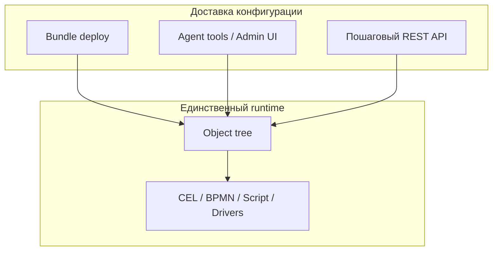

> **Язык:** русская версия (вычитка). Канонический английский: [en/application-principles.md](../en/application-principles.md).

# Принципы создания приложений на ISPF

Канонические правила для **разработчиков решений** и **AI-агентов** (агент Tree-First, AI Studio, MCP). Сводит воедино Target approach из [ARCHITECTURE.md](architecture.md), границу platform/solution ([ADR-0001](decisions/0001-app-platform-boundary.md)), жизненный цикл из [SOLUTION_DEVELOPER_GUIDE.md](solution-developer-guide.md), подходы A–H из [AGENT_KNOWLEDGE.md](agent-knowledge.md) и единую модель логики из [PLATFORM_LOGIC.md](platform-logic.md).

**Для деталей API и виджетов** — специализированные документы; этот файл — хаб «как создать приложение».

**Агент:** `search_context(query=..., topic=application-principles)`.

---

## Target approach

**Бизнес-логика прикладного решения живёт в declarative-конфигурации дерева объектов; платформа поставляет generic-движки; bundle deploy — упаковка и доставка конфигурации, не отдельный runtime.**

---

## Принципы P1–P10

Каждый принцип — два уровня: повествование для человека и действенные правила для агента.

### П1. Дерево объектов — единственная среда выполнения

**Для человека:** После развертывания всё выполняется через узлы дерева (`root.platform.devices.*`, `{appId}.functions.*`, `DASHBOARD`, `WORKFLOW`, `ALERT`). Запись в таблицу `applications` — **реестр + изолированная SQL-схема**, не отдельный движок. Вызов, оповещения, дашборды, привязки — через API дерева и WebSocket.

**Для агента:**

- Адресовать функции по tree path: `{appId}.functions.{name}`; `invoke_bff` / `invoke_tree_function` — не выдумывать REST.
- `list_applications` — только для appId/schema; runtime — `list_objects`, `get_object`, `list_variables`.



---

### П2. Платформа — движки; решение — изменить

**Для человека:** ISPF — промежуточное программное обеспечение/фреймворк. Платформа (`main`) реализует общие механизмы **один раз**: CEL, привязки, архиватор, BPMN, среда выполнения сценариев, драйверы, шина событий. Ваше решение **наполняет** их декларативный JSON: модели, переменные, события, функции, рабочие процессы, дашборды.

**Для агента:**

- **Запрещено:** Java в `ispf-server`, React в `apps/web-console`, платформа Flyway для приложений-таблиц, жестко закодированные маршруты BFF.
- Новые возможности платформы — только REQ-PF, без обходного пути в комплекте.

См. [ADR-0001](decisions/0001-app-platform-boundary.md), [PLUGINS.md](plugins.md).

---

### П3. Декларативная версия пользовательского кода

**Для человека:** Если задачу можно описать CEL, правилом привязки, BPMN, функцией сценария или сопоставлением драйверов — **не пишите** пользовательскую Java. Чем больше логики в дереве объектов, тем проще развертывание, аудит и редактирование с помощью ИИ.

**Для агента:**

- Перед script function: проверить CEL / `create_variable` / binding rules / `configure_alert`.
- Script steps — для CRUD по app schema (`selectMany`, `insert`, `update`), не для UI-логики.

---

### П4. Bundle = упаковка, непараллельная среда выполнения

**Для человека:** Манифест пакета — **способ доставить** конфигурацию в дерево и схему приложения. После импорта всё адрес делается в дереве путей; Комплект не «живет отдельно» от платформы.

**Для агента:**

- Production path: `validate_bundle` → `dry_run_deploy` → `import_package` (в одном run).
- POC/lab: инструменты Tree-First без пакета — разрешено; Импорт пакета только после того, как gates OK.

Секции манифестируют: `objects[]`, `models[]`, `dashboards[]`, `workflows[]`, `migrations[]`, `functions[]`, `bindings[]`, `operatorUi`, … — см. [SOLUTION_DEVELOPER_PUBLIC_API.md](solution-developer-public-api.md).

---

### П5. Одна модель логики: Правило платформы

**Для человека:** Вся реактивная логика — одна ментальная модель:

```text
КОГДА (activator)  →  ЕСЛИ (CEL condition)  →  ТОГДА (effect)
```

Три эффекта (`target.kind`): `variable` (переменная), `context` (`@dashboardContext`), `event` (журнал/рабочий процесс). Не внешнее параллельное DSL на виджетах (`showWhen`, `behaviorJson`, `visibleWhen`).

**Для агента:**

- Dashboard show/hide → rules с `target.kind=context`, path `widgets.{id}.visible`.
- UI mode/selection → `context.params.*`, `context.selection.*`.
- Activators: `onVariableChange`, `onContextChange`, `onEvent`, `onStartup`, `periodicMs`.
- `search_context topic=platform-logic`.

См. [PLATFORM_LOGIC.md](platform-logic.md), [ADR-0019](decisions/0019-platform-rule-unification.md).

---

### П6. Одна задача — один механизм

**Для человека:** Не дублируйте логику в нескольких местах.

| Задача | Механизм | Не использовать |
|--------|----------|-----------------|
| Вычисление переменных | CEL / обязательные правила | Java-обработчик |
| UI show/hide, режим HMI | Platform Rule → `@dashboardContext` | Поля на виджете |
| Порог → событие | ПРЕДУПРЕЖДЕНИЕ + CEL | Пользовательский опрос |
| Шаблон событий | Коррелятор | Специальные сценарии |
| Процесс с задачами | РАБОЧИЙ ПРОЦЕСС BPMN | Императивная цепочка |
| CRUD по SQL | Функция сценария | Платформа Java |
| SQL → live variable | `sqlBinding` / bindings[] | Manual sync |
| Телеметрия | Драйвер + сопоставления | Поддельные переменные |

**Для агента:** `get_automation_schema` перед `configure_alert` / `configure_correlator`; layout только в variable `layout`, не `set_variable name=widgets`.

---

### П7. Выбор пути доставки по потребностям

**Для человека:** Нет «единственного пути» — есть **подход по контексту**:

```text
Нужна изолированная SQL-schema (orders, batches)?
  ├─ ДА → Bundle (C) / REST по шагам (D) / AI generate (E) / reference (F)
  └─ НЕТ → Tree-first (A) / Admin Console (B) / Platform HMI only (G)

Нужен CI/CD и повторяемый релиз?
  └─ Bundle + validate gates (C/E)

Интерактивная сессия в AI Studio?
  └─ Tree-first tools (A), bundle — в конце после validate
```

| # | Подход | Когда |
|---|--------|-------|
| А | Tree-first (инструменты агента/Проводник) | POC, SNMP, лаборатория, интерактив с пользователем |
| Б | Консоль администратора | Инженер без пакета, итеративный HMI |
| С | Развертывание пакета | Производство, CI/CD |
| Д | Пошаговый REST API | Автоматизация без ZIP |
| Е | AI Studio генерировать → проверять → импортировать | Черновик манифест из промпта |
| Ф | Справочный пример | Обучение, MES/шаблон лаборатории |
| г | Только платформа HMI | Мониторинг без схемы приложения |
| Ч | Коммерческий пакет | Лицензируемое решение |

Полная таблица с доставкой и пользовательским интерфейсом оператора — [AGENT_KNOWLEDGE.md § Подходы](agent-knowledge.md).

**Для агента:** `search_context topic=agent-knowledge`; `get_example_bundle` для MES/лаборатории; playbooks SNMP/виртуальный кластер/MES — в системной подсказке.

---

### П8. Древовидная сходимость

**Для человека:** После развертывания функции остаются на `{appId}.functions.*`; повторный развертывание **обновляет** подключение узлов (согласовать); Привязки SQL — через `sqlBinding('appId','var')` на переменную.

**Для агента:**

- Legacy `POST .../functions/invoke` по appId — deprecated; prefer `invoke_bff` / tree path.
- `operatorUi` в manifest, не legacy `operatorManifest`.
- Согласование: повторное развертывание обновляет узлы, а не только создание.

| Было (наследие) | Стало (Target approach) |
|---------------|-------------------|
| Только `POST .../functions/invoke` по appId | `POST /bff/invoke` или tree path `{appId}.functions.*` |
| `screens[]` в operator manifest | `operatorUi` + dashboards |
| Новые `objects[]` только create | Reconcile при redeploy |
| Imperative sync Java → variables | CEL, `sqlBinding()`, script steps |

---

### Р9. Пользовательский интерфейс оператора — декларативный, из пакета или инструментов.

**Для человека:** Оператор HMI: `?mode=operator&app={appId}`. Меню и панель управления по умолчанию — из `operatorUi` в комплекте или `configure_operator_ui`. Приоритет: БД `operator_app_ui` → пакет `operatorUi` → автоген из дашбордов.

**Для агента:** После tree-first POC — `configure_operator_ui`; в `finish` — URL с `?mode=operator&app=...&dashboard=...`.

---

### Р10. Подтвердить перед изменением

**Для человека:** Любой развертывание проходит семантическую проверку. CI: проверка → пробный прогон → импорт. CEL: `POST /api/v1/expressions/validate`.

**Для агента:**

- `import_package` только после `validate_bundle` + `dry_run_deploy` OK **в том же run**.
- Не изобретать пути REST — только документированные инструменты/конечные точки.
- Коммерческий пакет: подпись после правок — [COMMERCIAL_LICENSING.md](commercial-licensing.md).

См. [ADR-0004](decisions/0004-ai-artifact-generation-gates.md).

---

## Где выражать логику

| Задача | Механизм | Документ |
|--------|----------|----------|
| Вычисление переменных | CEL / привязки платформы / правила привязки | [BINDINGS.md](bindings.md) |
| Пользовательский интерфейс дашборда (показать/скрыть, режим) | Правило платформы → `@dashboardContext` | [PLATFORM_LOGIC.md](platform-logic.md), [DASHBOARDS.md](dashboards.md) |
| Порог → событие | узел ALERT + CEL | [АВТОМАТИЗАЦИЯ.md](automation.md) |
| Шаблоны событий → рабочий процесс | Коррелятор | [АВТОМАТИЗАЦИЯ.md](automation.md) |
| Процесс с задачами оператора | РАБОЧИЙ ПРОЦЕСС BPMN | [WORKFLOWS.md](workflows.md) |
| CRUD по схеме приложения SQL | Функция сценария (шаги) | [APPLICATIONS.md](applications.md), [OBJECT_FUNCTIONS.md](object-functions.md) |
| SQL → опрос переменных | sqlBinding/привязки[] | [APPLICATIONS.md](applications.md) |
| Телеметрия устройства | Драйвер + сопоставления точек | [DRIVERS.md](drivers.md) |
| Таблица HMI | Виджет `object-table` + `selectionKey` | [DASHBOARDS.md](dashboards.md), [WIDGETS.md](widgets.md) |
| Legacy mini-DSL на виджете | **Устарело** → Правила платформы | [PLATFORM_LOGIC.md](platform-logic.md) § наследие |

---

## Антипаттерны

| Антипаттерн | Почему плохо | Правильно |
|--------------|--------------|-----------|
| Отраслевой Java на сервере | Ломает платформу/решение для границ | Функция скрипта + дерево |
| Уровень приложения как среда выполнения | Дублирует дерево объектов | Дорожки к деревьям |
| Логика на виджете | N mini-DSL, AI/люди путаются | Правило платформы |
| sessionStorage-only context | Не durable, не multi-client | `@dashboardContext` + WS |
| Пакет без проверки | Тихая поломка | Гейтс [0004](decisions/0004-ai-artifact-generation-gates.md) |
| Platform Flyway для app tables | Смешивает schemas | `migrations[]` в app schema |

---

## Чеклисты для агента

### «Создание приложения/решения» (с SQL)

1. Уточнить appId, нужен ли пользовательский интерфейс оператора.
2. `search_context topic=application-principles` + `topic=agent-knowledge`; `get_example_bundle` если похоже на MES/лаб.
3. зарегистрировать (или связать) → миграции → функции → объекты/панели.
4. `validate_bundle` → `dry_run_deploy` → `import_package`.
5. `configure_operator_ui`, если нет в манифесте.
6. `finish` с `?mode=operator&app=...` и путями приборной панели.

### «Создай мониторинг / SNMP / дашборд» (без схемы приложения)

1. Схема с приоритетом дерева (SNMP/виртуальный кластер).
2. Драйвер + шаблон приборной панели.
3. Правила платформы по необходимости (режим детализации, видимость виджета).
4. `configure_operator_ui` для приложения платформы.

### «Не ломай платформа» (P2, P10)

- Не придумывайте пути REST — только инструменты.
- Импорт пакета только после проверки + Dry_run OK в том же запуске.
- Нет платформы Flyway для столов приложений.
- Prefer `operatorUi` over legacy `operatorManifest`.

---

## Связанные документы

| Документ | Назначение |
|----------|------------|
| [SOLUTION_DEVELOPER_GUIDE.md](solution-developer-guide.md) | Жизненный цикл: регистрация → миграция → развертывание → оператор |
| [AGENT_KNOWLEDGE.md](agent-knowledge.md) | Подходы A–H, документы карт, темы search_context |
| [АРХИТЕКТУРА.md](architecture.md) | Платформа Слои, базовая доменная модель |
| [PLATFORM_LOGIC.md](platform-logic.md) | Platform Rule, `@dashboardContext` |
| [AI_DEVELOPMENT.md](ai-development.md) | Инструменты агента, ContextPack, MCP |
| [SOLUTION_DEVELOPER_PUBLIC_API.md](solution-developer-public-api.md) | Манифест стабильного контракта |
| [решения/README.md](decisions/readme.md) | АДР-0001, 0004, 0005, 0019 |

---

*Обновить при поддержке North Star (ADR, REQ-PF) и расширении инструментов агента.*
