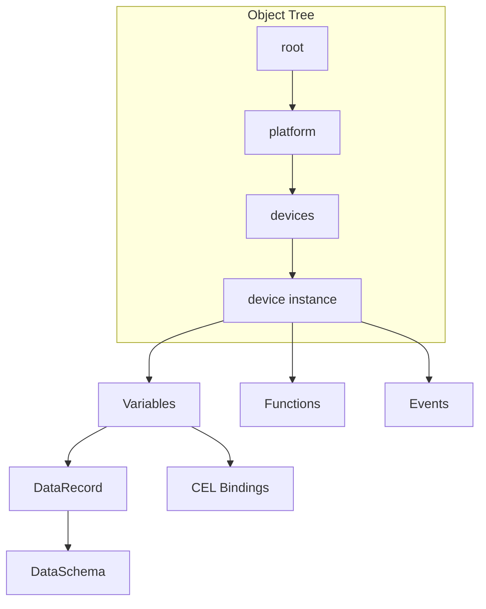

> **Язык:** русская версия (вычитка). Канонический английский: [en/architecture.md](../en/architecture.md).

# Архитектура ISPF

## Зрение

**IoT Solutions Platform Framework (ISPF)** — middleware-платформа для IoT, промышленной автоматизации и IT-операций. Единая модель данных и API для устройств, HMI-дашбордов, алертов и BPMN-автоматизации.

## Основной принцип: бизнес-логика в механизмах платформы

Бизнес-логика прикладного решения **живёт на платформе** — в declarative-конфигурации **дерева объектов**, а не в отраслевом Java-коде сервера.

| Механизм | Что описывает |
|----------|---------------|
| **Модели** | Blueprint: переменные, события, функции, bindings |
| **Переменные** | Состояние, вычисления (CEL, platform bindings), historian |
| **События** | Типы событий; alert rules и correlators — узлы дерева |
| **Функции** | Вызываемая логика на объекте (script, `INVOKE_FUNCTION`) |
| **Workflow** | BPMN-процессы, user tasks, эскалация |

**Платформа (framework)** реализует **generic-движки один раз**: CEL, bindings, historian, BPMN, script runtime, drivers, event bus.

**Решение (solution)** наполняет эти механизмы конфигурацией: модели, пороги, процессы, функции, дашборды.

Bundle deploy ([APPLICATIONS.md](applications.md)) — **упаковка и доставка** конфигурации в дерево объектов и app schema, а не отдельный runtime вне платформы.

**Запрещено в `main`:** отраслевой Java в `ispf-server`, hardcoded BFF routes, дублирование логики вне object tree. См. [0001](decisions/0001-app-platform-boundary.md).

**Развитие platform:** усиление выразительности механизмов object tree (Phase 5). См. [ROADMAP.md § Phase 5](roadmap.md).

## Базовая модель предметной области



Подробнее: [OBJECT_MODEL.md](object-model.md).

### Объект платформы

Адресуемый узел: `root.platform.devices.pump-01`. Типы: `DEVICE`, `DASHBOARD`, `WORKFLOW`, `ALERT`, `CORRELATOR`, `PLATFORM`, `ALERT_RULES`, … Системные каталоги имеют семантический `ObjectType`, не `CUSTOM`.

### DataRecord

- `DataSchema` — поля (`FieldType`)
- `DataRecord` — строки с валидацией

### Модели (Templates)

`BlueprintDefinition` — blueprint: variables, events, functions, bindings.  
См. [BLUEPRINTS.md](blueprints.md).

### Выражения

Google CEL для bindings, alert rules, workflow gateways. Переменные объектов также поддерживают **platform bindings** (`counterRate`, `scale`, `clamp`, …) — см. [BINDINGS.md](bindings.md).

```
self.temperature.value > self.threshold.value
counterRate(ifInOctets)
```

## Слои runtime

```
┌─────────────────────────────────────────────────────────┐
│  Web Console (React 19 + Vite + TanStack Query)         │
│  Admin │ Operator HMI │ Dashboard/Workflow builders     │
├─────────────────────────────────────────────────────────┤
│  API Layer (Spring Boot 4.0, Java 25)                   │
│  REST / WebSocket / OAuth2 JWT / RBAC                   │
├─────────────────────────────────────────────────────────┤
│  Domain Services                                        │
│  ObjectManager │ EventService │ WorkflowService         │
│  DashboardService │ AlertRuleService │ CorrelatorService│
│  DriverRuntimeService │ BlueprintEngine                     │
│  ApplicationPlatform (functions, data, BFF, scheduler)  │
├─────────────────────────────────────────────────────────┤
│  Plugins & Libraries                                    │
│  ispf-core │ ispf-expression │ ispf-plugin-blueprint         │
│  ispf-plugin-workflow                                   │
├─────────────────────────────────────────────────────────┤
│  Driver SPI                                             │
│  virtual │ mqtt │ modbus-tcp │ snmp                     │
├─────────────────────────────────────────────────────────┤
│  Persistence & Messaging                                │
│  PostgreSQL/H2 │ Flyway │ NATS* │ MQTT*                 │
└─────────────────────────────────────────────────────────┘
```

## Карта пакетов

| Package | Role |
|---------|------|
| `ispf-core` | ObjectTree, PlatformObject, DataRecord |
| `ispf-expression` | CEL engine, BindingExpressionEvaluator |
| `ispf-driver-*` | Device protocol adapters |
| `ispf-plugin-blueprint` | Model registry & engine |
| `ispf-plugin-workflow` | BPMN parser & executor |
| `ispf-server` | Spring Boot wiring, REST, JPA, security |

## Модель безопасности

OAuth2 JWT (Keycloak) или header-based RBAC (`local`).  
Roles: `admin`, `operator`.  
См. [SECURITY.md](security.md).

## Поток данных: телеметрия

```
DeviceDriver.readPoints()
  → DriverRuntimeService
  → ObjectManager.setVariableValue() / setDriverTelemetryValue()
  → BindingPropagationListener → BindingRuleEngine
  → AlertRuleListener
  → ObjectChangeEvent → WebSocket → Web Console
```

## Поток данных: автоматизация

```
Event fire → event_history
  → EventCorrelatorListener → WorkflowService.run
  → UserTask → WorkQueue → Operator HMI
```

## Топология развёртывания

**Development:** `docker compose` + Gradle bootRun + Vite dev server.

**Production (target):**

- `ispf-server` — stateless replicas
- Managed PostgreSQL, Redis, NATS
- Keycloak / OIDC
- Static web-console behind CDN/ingress

**Горизонтальное масштабирование ≠ федерация:** реплики делят одну БД и одно дерево `root.platform.*`. Multi-replica: driver ownership, NATS live mirror — см. **[CLUSTER.md](cluster.md)**. Несколько площадок / edge-агентов — [FEDERATION.md](federation.md), [ROADMAP.md § Phase 4–8](roadmap.md).

См. [DEPLOYMENT.md](deployment.md).

## Точки расширения

1. **DeviceDriver** — новый протокол ([DRIVERS.md](drivers.md))
2. **BlueprintDefinition** — шаблон устройства/процесса ([BLUEPRINTS.md](blueprints.md))
3. **FunctionHandler** — бизнес-операции на объектах
4. **Dashboard widgets** — новые типы в web-console ([DASHBOARDS.md](dashboards.md))
5. **REST / Webhook** — внешние интеграции ([API.md](api.md))
6. **NATS subjects** — messageTask в BPMN ([WORKFLOWS.md](workflows.md))
7. **Application bundle** — deploy функций и миграций **вне** ядра ([APPLICATIONS.md](applications.md), [PLUGINS.md](plugins.md))

Коммерческие и отраслевые расширения **не** входят в Apache 2.0-дерево `main`.

## Эталонные стенды

| Stand | Branch | Description |
|-------|--------|-------------|
| Demo sensor | `main` | virtual driver, alert, workflow |

## Указатель документации

Полный комплект: [docs/en/readme.md](readme.md).
