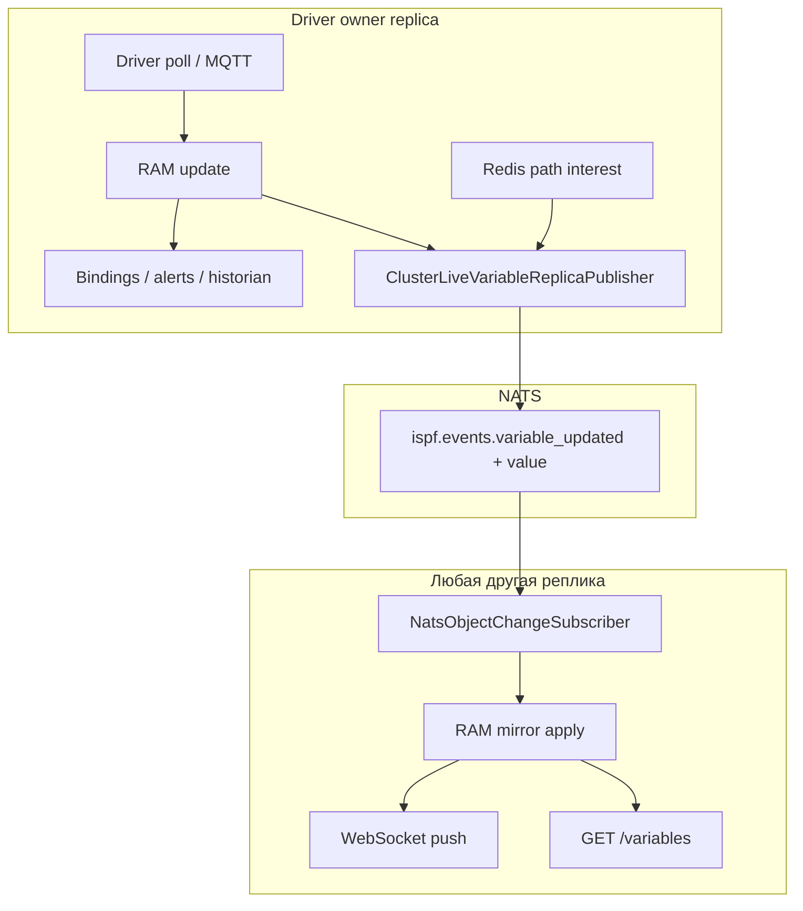

> **Язык:** русская версия (вычитка). Канонический английский: [en/cluster.md](../en/cluster.md).

# Кластер ISPF (мультиреплика)

Руководство по горизонтальному масштабированию API: несколько JVM-репликов, одно дерево объектов в PostgreSQL, синхронизация живых значений через NATS ([ADR-0029](decisions/0029-cluster-live-variable-replica-sync.md)).

См. также: [ADR-0028](decisions/0028-horizontal-active-active-cluster.md), [DEPLOYMENT.md](deployment.md), [MESSAGING.md](messaging.md), [BINDINGS.md](bindings.md).

## Кластер ≠ федерация

| | **Кластер** | **Федерация** |
|---|-------------|---------------|
| Дерево объектов | Одно `root.platform.*` в одной БД | Несколько площадок / edge-агентов |
| Реплики | N JVM без гражданства за LB | Коммуникационный хаб ↔ говорил |
| Драйвер | Ровно один опрос на устройстве | См. [ФЕДЕРАЦИЯ.md](federation.md) |

## Топология (пример VPS/лаб)

```text
                    nginx :8080
           REST ip_hash  │  WS ip_hash (одна реплика на клиента)
        ┌──────────┬───────┴───────┬──────────┐
        ▼          ▼               ▼          │
   replica-1   replica-2      replica-3      │
   :8081       :8082           :8083          │
        └──────────┴───────┬───┴──────────────┘
                           │
              PostgreSQL (одно дерево)
              NATS (fan-out между репликами)
              Redis (path interest, ACL, correlator)
```

Создайте: [`deploy/docker-compose.cluster.yml`](../deploy/docker-compose.cluster.yml), VPS: [`deploy/docker-compose.vps-cluster.yml`](../deploy/docker-compose.vps-cluster.yml).

каждая реплика при старте:

1. Пролётный путь (один раз на БД).
2. `loadFromDatabase()` — одинаковое дерево на всех узлах.
3. Регистрация в `platform_cluster_replicas` + пульс.
4. Захватите `platform_driver_locks` для устройств, назначенных на этот узлу.

## Где живут данные

| Данные | Хранение | Кластерное поведение |
|--------|----------|----------------------|
| Структура объектов, конфигурации, привязки | PostgreSQL | Запись на любую реплику → разветвление NATS → перезагрузка на пирах ([ADR-0030](decisions/0030-cluster-config-structure-replica-sync.md): `reloadPathFromDatabase`, переменные конфигурации: `syncVariableFromDatabase`) |
| **Телеметрия в реальном времени** (`ifInOctets`, `temperature`, …) | **ОЗУ на реплике-владельце** | Не пишется в PG на каждом тике |
| **Живое зеркало на подписчике** | RAM (снимок копии) | ADR-0029: Полезная нагрузка NATS с `value` |
| Историк / журнал событий | PG/ClickHouse/Кассандра | Пишет **только владелец** |
| Привязки/оповещения/функции каскадные | ОЗУ + конвейер автоматизации | Выполняется **только на владельца** |

### Владение драйвером

Ровно одна реплика опрашивает каждое УСТРОЙСТВО (`platform_driver_locks`, TTL + обновление). При падении блокировки узла исчезает, другая реплика забирает устройство.

Проверка: `GET /api/v1/platform/cluster/health` (admin) — поле `heldDevicePaths` на каждом узле.

## Привязки, переменные, функции, дашборды

### Переменные

- **Raw telemetry** приходит с драйвера на owner → `setDriverTelemetryValue()` → RAM.
- **REST** `GET /api/v1/objects/{path}/variables` читает **локальный RAM** реплики, обслужившей запрос.
- **WebSocket** `/ws/objects` — push `VARIABLE_UPDATED` клиентам, подписанным на path.

До ADR-0029 оперативная память для телеметрии была пуста → циклический REST мог вернуть `null`/устаревшее значение.

### Привязки

**Локальные** (на том же УСТРОЙСТВЕ):

```cel
counterRate(ifInOctets)   → переменная ifInOctetsRate
```

**Кросс-объект** (на хабе-объекте):

```cel
refAt("root.platform.devices.snmp-router-01", ifInOctetsRate)   → routerNetDown
```

Цепочка на реплике **owner**, где живёт исходное устройство:

```text
SNMP poll → ifInOctets (RAM)
         → binding counterRate → ifInOctetsRate (RAM)
         → (если hub на том же owner или ref читается с owner RAM) → derived vars
```

Follower **не пересчитывает** привязки — получает уже вычисленные значения через зеркало NATS (41 событий без автоматизации).

### Функции

`INVOKE_FUNCTION`, обработчики скриптов, функции платформы — выполняются на реплике, принятой HTTP-запросом. Для побочных эффектов наблюдайте идемпотентность. Устройство чтения в реальном времени — с любыми репликами после ADR-0029.

### Панели мониторинга

Дашборд — объект `DASHBOARD` с layout JSON. Виджеты ссылаются на `objectPath` / bindings. HMI:

1. WS подписываемся на пути таблиц/графиков.
2. Нажмите `VARIABLE_UPDATED` (локально или после зеркала NATS).
3. Иногда повторная выборка REST — должна выполняться репликация с актуальным RAM (после ADR-0029 — любая).

## ADR-0029: синхронизация реплики активной переменной

### Проблема (до 0029)

| Механизм | Пробел |
|----------|--------|
| NATS `ispf.events.*` | Только `path` + `variableName`, **без value** |
| `NatsEventBridge` | Пропускал `telemetry=true` |
| REST против WS LB | `ip_hash` на REST и WS — один клиент (IP) → одна JVM; аварийное переключение через `max_fails` + `proxy_next_upstream` |
| WS путь интерес | Только для JVM — владелец не знал о подписчиках на другую реплику |

### Решение

```text
Owner (driver)
  → RAM update
  → automation (bindings, alerts, historian) — только здесь
  → ClusterLiveVariableReplicaPublisher (coalesced NATS + full DataRecord)

Follower
  → ClusterVariableReplicaApplier → RAM mirror
  → ObjectChangeEvent(replicaIngress=true) → WS push
  → REST GET /variables — свежее значение
```



### репликаIngress

События с `replicaIngress=true` на follower:

| Потребитель | Поведение |
|----------|-----------|
| NATS / `ClusterLiveVariableReplicaPublisher` | Пропуск (нет loop) |
| Привязки/историк/оповещения | Пропуск |
| Вебсокет | Нажмите на клиентов |

### Интерес к пути в масштабе всего кластера (Redis)

При `ispf.cluster.cluster-path-interest-enabled=true` и Redis:

- WS `subscribe` / `unsubscribe` обновляет ref-count в Redis (`ispf:cluster:ws:interest:{path}`).
- Владелец публикует NATS-синхронизацию, даже если все браузеры на других репликах.

Без Redis — только локальный интерес; рекомендуется закрепить REST+WS или включить Redis.

## Пример: мониторинг парка SNMP (3 реплики)

### Объекты

| Путь | Тип | Назначение |
|------|-----|------------|
| `root.platform.devices.snmp-router-01` | DEVICE | SNMP router, model `snmp-agent-v1` |
| `root.platform.devices.snmp-switch-02` | DEVICE | SNMP switch |
| `root.platform.devices.snmp-fleet.hub` | CUSTOM | Cross-object агрегатор |
| `root.platform.dashboards.snmp-host-monitoring` | DASHBOARD | btop-таблица + графики |

### Привязки

На каждом УСТРОЙСТВЕ (локальные):

```json
{
  "targetVariable": "ifInOctetsRate",
  "expression": "counterRate(ifInOctets)"
}
```

На хабе (кросс-объекте):

```json
{
  "targetVariable": "routerNetDown",
  "expression": "refAt(\"root.platform.devices.snmp-router-01\", ifInOctetsRate)"
}
```

```json
{
  "targetVariable": "totalNetDown",
  "expression": "routerNetDown + switchNetDown"
}
```

### Сценарий по шагам

**T0 — старт:** R1, R2, R3 загружают одно дерево из PG. R1 захватывает блокировку на `snmp-router-01`, R2 — на `snmp-switch-02`.

**T1 — оператор открывает HMI:**браузер → nginx → WS на R3 (`ip_hash`), подписывайтесь по путям дашборда. Redis фиксирует глобальный интерес → владельцы R1/R2 начинают публиковать обновления.

**T2 — SNMP-опрос на R1:** `ifInOctets` обновляется → `counterRate` привязка → `ifInOctetsRate`. Ориентированность на спрос: есть интерес → `ObjectChangeEvent` → объединены NATS с полным `value`.

**T3 — обновление REST на R2:** `GET .../snmp-router-01/variables/ifInOctetsRate` — подписчик уже применил снимок NATS → актуальное значение (без липкого REST).

**T4 — хаб `totalNetDown`:** сохраняется на владельца хаба-объекта (или владельца исходного устройства). Производное значение тоже уходит в NATS → все реплики показывают одну величину на дашборде.

**T5 — падение R1:** замок раскрывается → R2/R3 перераспределяют устройство; краткий разрыв телеметрии до возврата; структура и конфигурация не требуются (PG).

## Настройки

### Обязательные (каждая реплика)

```bash
# /opt/ispf/ispf-server.env
ISPF_CLUSTER_ENABLED=true
ISPF_REPLICA_ID=replica-1          # уникально на узел
ISPF_DB_URL=jdbc:postgresql://postgres:5432/ispf
ISPF_NATS_ENABLED=true
ISPF_NATS_REPLICA_EVENTS=true
ISPF_REDIS_ENABLED=true
ISPF_CLUSTER_LIVE_VARIABLE_SYNC=true
ISPF_CLUSTER_PATH_INTEREST=true
```

### Объединение: два разных параметра

| Параметр | Окружение | По умолчанию | Где применить |
|----------|-----|---------|-----------------|
| `ispf.runtime-telemetry.coalesce-ms` | `ISPF_RUNTIME_TELEMETRY_COALESCE_MS` | **250** | Ingress на owner: слияние tick'ов драйвера |
| `ispf.cluster.live-variable-sync-coalesce-ms` | `ISPF_CLUSTER_LIVE_VARIABLE_SYNC_COALESCE_MS` | **500** | NATS fan-out owner → followers |

**Зачем раздельно:** Объединение телеметрии оптимизирует ЦП/автоматизацию владельца; объединение кластеров — **межрепликовый трафик NATS**. Для HMI часто достаточно 500–1000 мс на кластере, оставив 250 мс на входе.

Пример агрессивного проникновения + экономный NATS:

```bash
ISPF_RUNTIME_TELEMETRY_COALESCE_MS=250
ISPF_CLUSTER_LIVE_VARIABLE_SYNC_COALESCE_MS=1000
```

Переопределение для каждого устройства (только вход, **не** NATS):

```json
{
  "host": "192.168.1.1",
  "community": "public",
  "telemetryCoalesceMs": 1000
}
```

### Пользовательский интерфейс настроек времени выполнения

Администратор → Платформа → Настройки выполнения → секция **Кластер**:

- `cluster.live-variable-sync-coalesce-ms` — hot-reloadable
- `cluster.live-variable-sync`, `cluster.path-interest`, driver lock TTL

### Отключение live sync (отладка)

```bash
ISPF_CLUSTER_LIVE_VARIABLE_SYNC=false
```

Подписчики снова без зеркала RAM; нужна липкая сессия для REST+WS или чтение только с владельцем.

## Нагрузка и настройка

### По требованию (ADR-0024)

Синхронизация NATS только в том случае, если есть подписчики: архиватор, привязки, оповещения, пользовательский интерфейс (локальный или глобальный интерес Redis). «Мёртвый» телеметрия без истории и без открытой дашборды — **0 NATS**.

### Оценка сообщений/с

```text
NATS_msg_per_sec ≈ (N_variables_with_interest × replicas_followers) / cluster_coalesce_ms × 1000
```

Пример: 200 обращений на экран, 2 повторителя, объединение 500 мс:

```text
200 × 2 / 0.5 ≈ 800 msg/s  (worst case, все vars меняются каждый coalesce window)
```

На практике counterRate/SNMP меняется реже; объединить выигрыши последнего значения с сильным снижением пика.

### Когда беспокоюсь

- Более 10 тысяч исторических переменных с интересом и объединением &lt; 250 мс.
- Очень большие `DataRecord` (wide tables) в каждом NATS message.

Смягчение: увеличить `ISPF_CLUSTER_LIVE_VARIABLE_SYNC_COALESCE_MS`, сузить флаги истории, проверить JetStream и ядро ​​NATS.

## Профили реплик и вакансии платформы (ADR-0031/ADR-0032)

По умолчанию **unified** (`ISPF_REPLICA_PROFILE=unified` или `ISPF_REPLICA_ROLE=all`): полный стек на одной JVM.

### Профили (ADR-0032)

| Профиль | Окружение | API/WS | Конфиг написать | Драйверы | Вакансии | Планировщики |
|---------|-----|--------|--------------|---------|------|------------|
| unified | `ISPF_REPLICA_PROFILE=unified` | да | да | да | да | да |
| edge-api | `edge-api` (alias: `api`) | да | да | нет | нет | да |

Профиль **edge-api** без локальных драйверов — см. [DEMOSTANDS.md § Край B](demostands.md). Локальные драйверы на слабом процессоре — унифицированные + [DEMOSTANDS.md § Edge A](demostands.md).
| hmi-read | `hmi-read` | да | нет | нет | нет | нет |
| io | `io` | нет | нет | да | нет | да |
| compute | `compute` (alias: `worker`) | internal | нет | нет | да | нет |

Явный override: `ISPF_REPLICA_CAPABILITIES=http-public,ws,replica-sync`.

```bash
# edge tier (за nginx)
ISPF_REPLICA_PROFILE=edge-api

# driver I/O (internal, не в LB)
ISPF_REPLICA_PROFILE=io

# async reports worker
ISPF_REPLICA_PROFILE=compute
ISPF_CLUSTER_JOB_MAX_CONCURRENT=4
```

### Асинхронные отчеты

```http
POST /api/v1/reports/by-path/run-async?path=root.platform.reports.daily
→ 202 { "jobId": "…", "status": "QUEUED" }

GET /api/v1/platform/jobs/{jobId}
→ { "status": "COMPLETED", "result": { … same as sync run … } }
```

Web console вызывает `run-async` и poll до `COMPLETED`. Sync `POST …/run` сохранён для тестов.

Хранение заданий в `platform_jobs` (PostgreSQL). Worker claim: `FOR UPDATE SKIP LOCKED`. Просроченный `RUNNING` возвращается в `QUEUED`.

Подробнее: [ADR-0031](decisions/0031-cluster-replica-roles-platform-jobs.md), [ADR-0032](decisions/0032-replica-profiles-and-capabilities.md).

### VPS prod (единый унифицированный узел)

> **Профили:** производство / пропускная способность / демо-простой / край — [DEMOSTANDS.md](demostands.md). Ниже — пример **demo-idle** для одного узла.

```text
Internet → nginx :8080 → replica-1 (unified / role all, :8081)
```

`ISPF_CLUSTER_ENABLED=false` — одна JVM со всеми возможностями (драйверы + задания + HTTP/WS). ADR-0032 запрещает `unified` при `cluster.enabled=true`.

| Артефакт | Путь |
|----------|------|
| Compose | [`deploy/docker-compose.vps-single.yml`](../deploy/docker-compose.vps-single.yml) |
| Nginx | [`deploy/nginx-vps-single.conf`](../deploy/nginx-vps-single.conf) |
| Rollout | [`deploy/vps-single-rollout.sh`](../deploy/vps-single-rollout.sh) |
| Prod-idle env | [`deploy/ispf-server.prod-idle.env`](../deploy/ispf-server.prod-idle.env) + [`vps-apply-prod-idle-env.sh`](../deploy/vps-apply-prod-idle-env.sh) |
| Driver tuning | [`deploy/vps-demostand-tune-drivers.sh`](../deploy/vps-demostand-tune-drivers.sh) |

Проверка: `curl -sf https://ispf.iot-solutions.ru/api/v1/info` → `clusterEnabled=false`, `replicaRole=all`.

**Мультиреплика** (лаборатория/высокая доступность): [`deploy/docker-compose.vps-cluster.yml`](../deploy/docker-compose.vps-cluster.yml), `vps-cluster-rollout.sh`, `vps-cluster-verify.sh`.

## Операции

### API здоровья

```http
GET /api/v1/platform/cluster/health
GET /api/v1/platform/cluster/diagnostics
Authorization: Bearer …
```

Ответ health: `liveVariableSyncEnabled`, `liveVariableSyncCoalesceMs`, `clusterPathInterestEnabled`, список узлов, driver locks.

Диагностика ответов: CPU по репликам, `clusterTopSuspect`, детализация (потоки, привязки драйверов, задания, рабочие процессы).

**Детализация (развернуть ноды):**

| Блок | Поля |
|------|------|
| Suspects | `kind` (subsystem/driver/thread/job/workflow), `severity`, `score` |
| Thread groups | `ispf-driver-io`, `driver-ingress`, `object-change`, …; CPU Δ за окно ~20s |
| Drivers | `ingressPending`, `pressureScore` (≥100 — горячий драйвер) |
| Jobs / workflows | `RUNNING` на этой реплике, `runningSeconds` |

Интерфейс: Администратор → Система → Метрики → **«Диагностика нагрузки»** (ЦП) и карточка «Кластер» (здоровье). Опционально: чекбокс **Синхронизировать метрики с устройством проверки** — время выполнения проверки в дереве (см. [OBSERVABILITY.md](observability.md)); выключается при уходе за страницей.

При 100% загрузке ЦП: разверните горячую реплику в диагностике; ЦП первого образца потока — прогрев (обновление ~ 20 с); если все JVM низкие — `docker stats` на хосте (Scylla/CH/Postgres).

```bash
curl -s -H "Authorization: Bearer $TOKEN" http://127.0.0.1:8083/api/v1/platform/metrics | jq '.diagnostics'
```

### Дым / CI

```bash
bash deploy/cluster-smoke-test.sh
bash deploy/cluster-smoke-test.sh --config-sync
python deploy/cluster-scale-load-test.py --scale-factor-floor 1.8
```

### Контрольный список аварийного переключения

1. `curl https://ispf.example/api/v1/info` — 200 с любой живой реплики.
2. Остановить одну реплику — REST через LB без 502.
3. Блокировки драйверов мигрируют в пределах TTL + аварийное сканирование.
4. HMI на других репликах продолжает получать текущие значения (ADR-0029).

### nginx

REST и WS **могут** использовать разные политики LB при включенном ADR-0029 — значения зеркалируются на всех JVM.

REST и WS используют один восходящий поток с `ip_hash` — меньший процент перекрестных реплик NATS, стабильная сессия оператора.

При падении реплики nginx помечает вверх по течению вниз (`max_fails`) и направляет клиента на другой; после развертывания все реплики перезапускаются с новой марки — достаточно Ctrl+F5.

## Устранение неполадок (рассинхронизация)

| Симптом | Вероятная причина | Действие |
|--------|-------------------|----------|
| Объект удален, но снова виден в дереве | Follower RAM не получил `DELETED` (до v0.9.93 — управляемый по требованию вентиль) | Обновить до 0.9.93+; Ctrl+Ф5; **не** сброс настроек |
| Мнемосхема/диаграмма пуста после сохранения | Конфигурация не синхронизирована с подписчиком | 0.9.92+ исправление; проверить `bash deploy/vps-cluster-verify.sh --config-sync` |
| Разные значения REST при обновлении | Круговой алгоритм до ADR-0029 по телеметрии | Убедиться что `liveVariableSyncEnabled=true` в кластере здоровья |
| «Всё сломано» после экспериментов | Накопившийся RAM drift | `bash /opt/ispf/bin/vps-cluster-factory-reset.sh --no-fixtures` (prod) |

### Развертывание VPS

**Одноузловой демостанд (текущий продукт):** см. [VPS_DEMOSTAND.md](vps-demostand.md). Банка исправления: SCP + `docker-compose` воссоздать, а не `apply-platform-update.sh`.

**Кластер с несколькими репликами:**

```powershell
.\deploy\vps-deploy-direct.ps1 -Version 0.9.93 -SkipTests -Cluster
```

Развертывание использует [`vps-cluster-rollout.sh`](../deploy/vps-cluster-rollout.sh) (перезапуск реплики, без `docker-compose --force-recreate`).

Первичная установка кластера: [`vps-cluster-bootstrap.sh`](../deploy/vps-cluster-bootstrap.sh).

Обнулить БД: [`vps-cluster-factory-reset.sh`](../deploy/vps-cluster-factory-reset.sh).

## Связанные ADR и бэклог

- [ADR-0028](decisions/0028-horizontal-active-active-cluster.md) — топология, блокировки драйверов
- [ADR-0029](decisions/0029-cluster-live-variable-replica-sync.md) — зеркало оперативной памяти
- [ADR-0030](decisions/0030-cluster-config-structure-replica-sync.md) — синхронизация конфигурации/структуры CRUD
- [ADR-0024](decisions/0024-demand-driven-variable-change-pubsub.md) — публикация по требованию
- ДОРОЖНАЯ КАРТА БЛ-134…143
