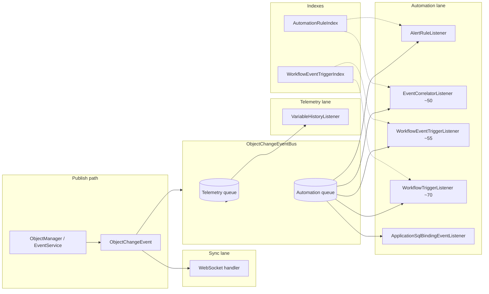

> **Язык:** русская версия (вычитка). Канонический английский: [en/decisions/0014-automation-pipeline-evolution.md](../../en/decisions/0014-automation-pipeline-evolution.md).

# ADR-0014: Эволюция automation pipeline

## Статус

Принято (25 июня 2026 г.)

## Контекст

ISPF реагирует на изменения объектов (обновления переменных, fired events) через растущий набор listener'ов: alert rules, event correlators, workflow triggers, SQL bindings, variable history и WebSocket fan-out. По мере роста числа устройств и частоты событий линейный перебор определений workflow/correlator на каждое событие становится дорогим, а запись телеметрии может «забивать» обработчики автоматизации в общей async-очереди.

## Решение

Развивать automation pipeline слоями:

1. **Dual-lane object-change bus** — при `ispf.object-change.split-lanes-enabled=true` маршрутизировать high-volume telemetry handler'ы (`VariableHistoryListener`, lane `TELEMETRY`) в отдельную очередь/pool worker'ов, отдельно от automation handler'ов (lane `AUTOMATION`). Обновления телеметрии по-прежнему могут coalesce'иться по `(path, variable)`.
2. **Async journal** — `ObjectChangeEventBus` отделяет publisher'ов от тяжёлых handler'ов; при переполнении очереди — fallback на синхронный dispatch в потоке publisher'а с предупреждением.
3. **In-memory indexes** — automation rules и workflow triggers индексируются при старте и перестраиваются при изменении конфигурации:
   - `AutomationRuleIndex` — alert rules по `(objectPath, watchVariable)`, correlators по `eventName`
   - `WorkflowEventTriggerIndex` — ACTIVE workflows по `(objectPath, eventName)` и `(objectPath, variableName)`, разобранным из `triggerJson`
4. **Workflow event triggers** — расширить `triggerJson` значением `{"triggerType":"event","objectPath":"...","eventName":"..."}` наряду с legacy variable triggers; `WorkflowEventTriggerListener` (порядок async handler ~55) запускает сопоставление workflows при `EVENT_FIRED`.
5. **Metrics** — Micrometer gauges на глубину очереди и число обработанных событий (`ispf.object_change.*`); расширить per-lane metrics по мере полного внедрения split-lane bus.
6. **Future transport** — JetStream (NATS) или Redis Streams как опциональный durable fan-out для межузловой автоматизации; текущая in-process bus остаётся default для single-node deployment'ов.

## Схема pipeline

## Схема triggerJson

| triggerType | Обязательные поля | Опционально |
|-------------|-------------------|-------------|
| *(legacy / variable)* | `objectPath`, `variableName` | `expectedValue`, `valueField` |
| `variable` | `objectPath`, `variableName` | `expectedValue`, `valueField` |
| `event` | `objectPath`, `eventName` | — |

Legacy-объекты без `triggerType`, но с `variableName`, продолжают работать как variable triggers.

## Последствия

- Поиск workflow и correlator — O(1) по ключу вместо сканирования всех определений.
- Event-triggered workflows могут стартовать без промежуточного correlator или alert rule.
- Перестройка index требуется после изменений workflow `triggerJson` / `status` (`WorkflowTriggerIndexListener`, `WorkflowService.updateStatus`).
- Split-lane bus и внешний journal (JetStream/Redis) внедряются инкрементально; ADR фиксирует направление без обязательной немедленной миграции.
- Timescale tier event journal — [0015-event-history-timescale](0015-event-history-timescale.md) (P3a); ClickHouse backend — [0016-clickhouse-event-journal](0016-clickhouse-event-journal.md) (P3b, prod default).
- High-rate telemetry ingest — [0017-telemetry-ingest-pipeline](0017-telemetry-ingest-pipeline.md) (MQTT gateway, JDBC historian).

## Связанные материалы

- [AutomationRuleIndex](../../../packages/ispf-server/src/main/java/com/ispf/server/automation/AutomationRuleIndex.java)
- [WorkflowEventTriggerIndex](../../../packages/ispf-server/src/main/java/com/ispf/server/workflow/WorkflowEventTriggerIndex.java)
- [ObjectChangeEventBus](../../../packages/ispf-server/src/main/java/com/ispf/server/object/bus/ObjectChangeEventBus.java)
