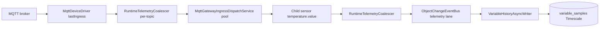

> **Язык:** русская версия (вычитка). Канонический английский: [en/decisions/0017-telemetry-ingest-pipeline.md](../../en/decisions/0017-telemetry-ingest-pipeline.md).

# ADR-0017: Telemetry ingest pipeline (MQTT gateway, thread pools, JDBC historian)

## Статус

Принято (25 июня 2026 г.)

## Контекст

High-rate MQTT telemetry выявила узкие места на пути automation/historian:

1. **N×MQTT driver'ы** — одно broker-соединение на устройство.
2. **Single-thread binding executor'ы** — async rules не масштабировались.
3. **Gateway `lastIngress`** — один coalesce slot ограничивал dispatch rate (~20/s).
4. **JPA `saveAll` на `variable_samples`** — `IDENTITY` id мешал JDBC batching (~300 samples/s ceiling на prod VPS).

Event journal уже использует `JdbcTemplate.batchUpdate` ([ADR-0016](0016-clickhouse-event-journal.md)); historian по-прежнему использовал JPA.

## Решение

### MQTT gateway orchestrator (`mqtt-gateway-v1`, fixture)

Fixture RELATIVE-модель (регистрируется при `ispf.bootstrap.fixtures-enabled=true`). См. [ADR-0018](0018-fixture-models-and-cel-applicability.md).

- Одно MQTT-соединение; driver пишет ingress в `lastIngress` (`topic` + `raw`).
- Driver config: `ingressVariable=lastIngress`, `ingressTopicLanes=true` — per-topic coalesce keys в `RuntimeTelemetryCoalescer`.
- `MqttGatewayIngressDispatchService` — fixed thread pool (`ispf.mqtt-gateway.ingress-dispatch-threads`, default 8) вызывает `dispatchTelemetry` → `setDriverTelemetryValue` на child sensor'ах (parsed `temperature.value`, без лишнего parse-binding hop на hot path).
- Legacy path: binding `dispatch-on-ingress` с `activators.async: true` при `ingressTopicLanes=false`.

### Thread pools (shared, не per-rule single-thread)

| Компонент | Config | Роль |
|-----------|--------|------|
| `BindingRuleAsyncExecutor` | `ispf.binding.async-threads` (16) | Shared pool; per-rule burst coalesce |
| `RuntimeTelemetryCoalescer` | `coalesce-scheduler-threads` (4) | Per `(path\|variable\|topic)` debounce |
| `MqttGatewayIngressDispatchService` | `ingress-dispatch-threads` (8) | Parallel gateway dispatch |
| `ObjectChangeEventBus` | elastic workers + coalesce/scale schedulers | Telemetry vs automation lanes |
| `VariableHistoryAsyncWriter` | `writer-threads`, `batch-size`, `flush-interval-ms` | Async batch enqueue |

**Sync by design:** `BindingPropagationListener` — ordering перед historian enqueue.

**Bus coalesce off by default:** `ispf.object-change.coalesce-telemetry-updates=false` — избежать double coalesce с `RuntimeTelemetryCoalescer`.

### Historian write path (`ispf.variable-history.store`)

| Store | Implementation | Use |
|-------|----------------|-----|
| `jdbc` (default) | `JdbcVariableHistoryWriteStore` — `JdbcTemplate.batchUpdate` | Prod high throughput |
| `jpa` | `JpaVariableHistoryWriteStore` — `saveAll` | Legacy / debug |
| `clickhouse` | Planned | Future ADR |

Defaults: `batch-size=500`, `flush-interval-ms=50`, `writer-threads=4`.  
PostgreSQL URL: `reWriteBatchedInserts=true`.

Timescale: hypertable `variable_samples`, retention 90d, compression segmentby `(object_path, variable_name, field_name)` after 7d.

### Telemetry publish mode

Per-device `telemetryPublishMode`:

| Mode | Historian | Automation bus | Event journal |
|------|-----------|------------------|---------------|
| `FULL` (default) | yes | yes | via alerts, API, correlators |
| `TELEMETRY_ONLY` | yes (fast path) | telemetry lane only | no |
| `EVENT_JOURNAL_ONLY` | no | skipped | yes (`fireIngress` fast path, [ADR-0027](0027-event-journal-ingress-fast-path.md)) |

Per-device `telemetryCoalesceMs` ограничивает sample/event rate перед downstream tier'ами (loadtest knob).

## Схема pipeline

## Последствия

- Gateway loadtest с JDBC store и minimal coalesce даёт более высокий historian throughput, чем JPA `saveAll` на той же топологии; абсолютные rates зависят от hardware, coalesce и `min-interval-ms`.
- Throughput ограничен `telemetryCoalesceMs`, числом устройств и store I/O; для production dashboards настраивайте coalesce (типично десятки ms).
- Loadtest на prod часто ставит `ISPF_VARIABLE_HISTORY_MIN_INTERVAL_MS=1` (platform debounce default намного выше).
- ClickHouse / Cassandra historian store'ы опциональны; см. [ADR-0025](0025-cassandra-scylla-timeseries-store.md), [variable-history.md](../variable-history.md).

## Связанные материалы

- [load-testing.md](../load-testing.md) — baselines and scripts
- [variable-history.md](../variable-history.md) — configuration
- [bindings.md](../BINDINGS.md) — `activators.async`
- [ADR-0014](0014-automation-pipeline-evolution.md) — dual-lane bus
- [ADR-0009](0009-timescaledb-retention.md) — Timescale retention
