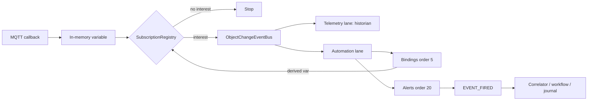

> **Язык:** русская версия (вычитка). Канонический английский: [en/decisions/0024-demand-driven-variable-change-pubsub.md](../../en/decisions/0024-demand-driven-variable-change-pubsub.md).

# ADR-0024: Demand-driven object change pub/sub (single JVM)

## Статус

Принято (2 июля 2026 г.)

## Контекст

High-rate MQTT telemetry выявила узкие места (см. [ADR-0017](0017-telemetry-ingest-pipeline.md)):

- Каждое coalesced variable update публиковало `ObjectChangeEvent` с `telemetry=true`, даже когда historian subscriber отсутствовал.
- `BindingPropagationListener` выполнялся **синхронно** на `HIGHEST_PRECEDENCE` при каждом variable update — блокируя MQTT callback threads перед async event bus.
- Alert / workflow handler'ы получали events, даже когда ни одно rule не подписано на `(path, variable)`.
- Планируемый BL-112 sidecar дублировал process boundaries; product direction — **one dedicated JVM** с core + plugin JAR'ами.

Integrators ожидают broker-like semantics:

1. MQTT → in-memory value update (cheap).
2. **Event materializes only if a subscriber exists** (historian, binding, alert, workflow, UI, federation, …).
3. Async chain: binding → derived variable event → alert → `EVENT_FIRED` (gated) → correlator / workflow / SQL binding.
4. No subscriber → no platform `ObjectChangeEvent` (no CEL, no async handler work). Event journal rows по-прежнему пишутся для explicit `fire()` API calls.

## Решение

### 1. Single JVM, no sidecar

Весь ingress и automation остаётся в `ispf-server`. Horizontal scale = **N stateless JVM replicas**, sharing one PostgreSQL (+ optional Redis/NATS), или larger dedicated host с tuned thread pools — не отдельный ingress worker process. См. [ADR-0028](0028-horizontal-active-active-cluster.md).

### 2. Subscription registries

Все publisher'ы маршрутизируются через `ObjectChangePublicationService` (gate перед `ApplicationEventPublisher`).

**`VariableChangeSubscriptionRegistry`** — `(objectPath, variableName)`:

| Source | Subscriber type |
| ------ | ---------------- |
| `Variable.historyEnabled` | Historian (telemetry lane) |
| `BindingDependencyIndex.consumers` | Platform bindings (automation lane) |
| `AutomationRuleIndex.findAlertRules` | Alert rules (automation lane) |
| `WorkflowEventTriggerIndex.findVariableWorkflows` | BPMN variable triggers (automation lane) |
| Workflow config vars `triggerJson` / `status` | Workflow trigger index rebuild |
| `ObjectWebSocketPathInterestRegistry` | Live UI refresh |
| `FederationExportInterestRegistry` | Outbound tunnel fanout |

**`EventFiredSubscriptionRegistry`** — `(objectPath, eventName)`:

| Source | Subscriber type |
| ------ | ---------------- |
| `BindingDependencyIndex.eventConsumers` | Platform binding `onEvent` activators |
| `AutomationRuleIndex.findCorrelatorsForEvent` | Event correlators |
| `WorkflowEventTriggerIndex.findEventWorkflows` | BPMN event triggers |
| `ApplicationSqlBindingEventIndex` | Application SQL bindings (`refresh_mode=on_event`) |

**`StructureChangeSubscriptionRegistry`** — `CREATED` / `UPDATED` / `DELETED`:

| Source | Subscriber type |
| ------ | ---------------- |
| Platform cache / visual groups | Internal maintenance (always) |
| `ObjectWebSocketPathInterestRegistry` | Live tree UI |
| `FederationExportInterestRegistry` | Outbound tunnel |
| `NatsEventBridge` (when enabled) | Cross-replica fanout |

### 3. Gate before publish

`ObjectChangePublicationService`:

- `publishVariableChange()` — runtime telemetry / binding cascade
- `publishConfigVariableChange()` — API config writes (ObjectManager)
- `publishEventFired()` — `EventService.fire*` (journal enqueue unconditional)
- `publishStructureChange()` — tree CRUD

Для variable updates:

- Публикует **только если** `interest.hasAny()` и хотя бы один lane active (`telemetry`, `automationEligible` или `uiRefresh`).
- Sets `telemetry = interest.historian()`, `automationEligible = policy.automationEligible(path) && interest.automation()`.

Для `EVENT_FIRED`:

- Публикует только когда bindings, correlators, workflows или SQL bindings подписаны.

### 4. Async binding chain

- `BindingPropagationAsyncHandler` (order 5, automation lane) handles `VARIABLE_UPDATED` и `EVENT_FIRED` при demand-driven mode.
- `BindingPropagationListener` retains dashboard context + legacy sync mode only.
- `AlertRuleListener` (order 20) runs after bindings на том же async lane.
- Binding-derived updates re-enter через `ObjectChangePublicationService` (cascade).

### 5. Configuration

```yaml
ispf:
  object-change:
    demand-driven-publication: true   # default true
```

При `false` — legacy behaviour: coalescer всегда ставит `telemetry=true`; sync binding listener handles all variable updates.

## Pipeline (demand-driven)



## Expected throughput impact

| Scenario | Before | After (expected) |
| -------- | ------ | ---------------- |
| MQTT, no rules, no history | Events + sync binding overhead | **~0 platform events** — largest win under fan-in |
| Historian only (`TELEMETRY_ONLY`) | Sync binding + false automation flag | **~160+ samples/s** (no sync CEL on hot path) |
| FULL + alerts + bindings | ~100 events/s (sync CEL + async alerts) | **2–5×** — bindings off hot path; less garbage on bus |
| Alerts on derived binding output | Same event as driver tick | Correct cascade via second gated event |

Exact numbers зависят от coalesce ms, device count и CEL complexity — BL-113 CI gate tracks regression.

## Последствия

**Positive**

- Broker semantics aligned с integrator mental model.
- MQTT hot path больше не blocked sync bindings.
- Zero-subscriber MQTT fan-in avoids useless platform work.

**Negative**

- Live WebSocket UI по-прежнему needs in-memory values (always updated); event-driven UI refresh только когда interest exists (acceptable для HMI polling/WebSocket variable subscriptions).
- Subscription index must stay consistent при изменении rules/workflows/history flags (rebuild hooks already exist).

## Связанные материалы

- [ADR-0017](0017-telemetry-ingest-pipeline.md)
- [ADR-0014](0014-automation-pipeline-evolution.md)
- BL-111…113 (EX-SCALE, sidecar superseded этим ADR)
