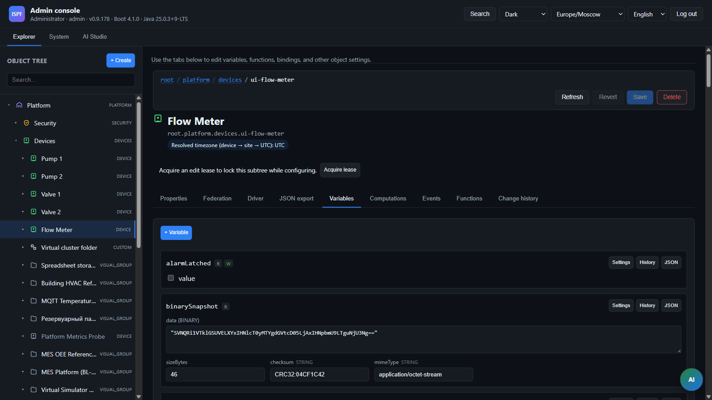

> **Язык:** русская версия (вычитка). Канонический английский: [en/drivers.md](../en/drivers.md).

# Драйверы устройств

> **Статус:** Beta — каталог pack реален; зрелость различается (см. матрицу PRODUCTION / [driver-promotion](driver-promotion.md)). Хаб: [doc-status.md](doc-status.md).

Каталог кандидатов на новые драйверы (roadmap.md): [roadmap](roadmap.md), полный список ниже (REQ-PF-14).

## Зрелость драйверов



| Уровень | Значение |
|---------|----------|
| **production** | Полный poll/read/write, тесты, документированный config |
| **beta** | Рабочее подключение, ограниченный набор функций |
| **stub** | Проверка TCP/сессии или оболочка подключения (v0.1) |
| **simulator** | Виртуальный / на основе профиля (см. PF-09) |

Многие записи каталога REQ-PF-14 помечены как stub (заглушка) — см. таблицу ниже и [driver-promotion](driver-promotion.md).

Матрица production readiness — [0022-driver-production-matrix](decisions/0022-driver-production-matrix.md), `DriverProductionMatrix` + CI gate `DriverProductionMatrixTest`. Interop lab — [driver-interop-lab](driver-interop-lab.md) (BL-141).

### Top-20 industrial (BL-140, Phase 25)

В `DriverProductionMatrix` — **36** драйверов **PRODUCTION** (включая `cwmp` вне top-20) и **9** **BETA**. Top-20 industrial: **16** **PRODUCTION** + **4** **BETA** (`iec104-server`, `ethernet-ip`, `opc-da`, `opc-bridge`). Список: `DriverProductionMatrix.TOP_20_INDUSTRIAL`.

> **Честность (BL-191):** оболочки и неполные стеки в реестре — **BETA**: `opc-da` / `opc-bridge` (оболочка + тесты парсера), `ethernet-ip` (только CIP session). Метка **PRODUCTION** всё ещё ≠ ready-for-field; продвижение через [driver-promotion](driver-promotion.md). См. OT-измерение [competitive-scorecard](competitive-scorecard.md).

| `driverId` | Зрелость (реестр) | Примечания / interop |
| ---------- | ------------------- | --------------- |
| `virtual`, `mqtt`, `modbus-tcp`, `modbus-rtu`, `modbus-udp` | PRODUCTION | см. interop lab |
| `opcua`, `opcua-server`, `snmp`, `bacnet`, `s7`, `http`, `flexible` | PRODUCTION | см. interop lab; OPC UA в lab часто SecurityPolicy None |
| `iec104`, `dlms`, `gps-tracker` | PRODUCTION | см. interop lab |
| `cwmp` | PRODUCTION | вне top-20; Inform + Get/SetParameterValues |
| `dnp3` | PRODUCTION | **Только poll/read** — `writePoint` не реализован |
| `haystack`, `kafka`, `coap` | PRODUCTION | poll-only клиенты; loopback-тесты |
| `icmp`, `ip-host`, `telnet`, `ssh`, `modem-at` | PRODUCTION | IT/remote-проверки; read-only |
| `file`, `folder`, `application` | PRODUCTION | мониторинг локального хоста; read-only |
| `imap`, `pop3`, `jms` | PRODUCTION | mail/messaging-клиенты; read-only |
| `soap`, `web-transaction`, `http-server` | PRODUCTION | на базе HTTP; read-only |
| `jdbc`, `graph-db` | PRODUCTION | только SELECT / query read; read-only |
| `ethernet-ip` | BETA | регистрация CIP session; tag path — placeholder |
| `opc-da`, `opc-bridge` | BETA | **Оболочка / тесты маппинга** — не полный DA-стек |
| `iec104-server` | BETA | interop partner для `iec104` |

### observedAt (source timestamps, BL-79)

Poll-драйверы передают `updateVariable(name, value, observedAt)` в historian ([0020-time-and-timezones](decisions/0020-time-and-timezones.md)):

| ID драйвера | observedAt | Источник |
| --------- | ---------- | -------- |
| virtual | yes | единый poll tick |
| mqtt | yes | JSON `observedAt` / `timestamp` / epoch |
| modbus-tcp/rtu/udp | yes | общий instant на poll tick |
| opcua | yes | OPC UA SourceTime / ServerTime |
| s7 | yes | poll tick |
| snmp | yes | poll tick |
| bacnet | yes | poll tick |

## Архитектура

Драйверы реализуют SPI `DeviceDriver` (`packages/ispf-driver-api`):

```java
public interface DeviceDriver {
    DriverMetadata metadata();
    void initialize(DriverObject driverObject);
    void connect() throws DriverException;
    void disconnect();
    boolean isConnected();
    void readPoints(Map<String, String> pointMappings) throws DriverException;
    void writePoint(String pointId, DataRecord value) throws DriverException;

    interface DriverObject {
        PlatformObject deviceObject();
        void updateVariable(String name, DataRecord value);
        default void updateVariable(String name, DataRecord value, Instant observedAt) { … }
        Optional<DataRecord> getVariable(String name);
        void log(DriverLogLevel level, String message);
        default Map<String, String> configuration() { return Map.of(); }
    }
}
```

**Ingress contract:** hot path `updateVariable` не должен писать в DB/historian/disk — долговременное хранение асинхронно на стороне сервера. Полный исходник: [`DeviceDriver.java`](../../packages/ispf-driver-api/src/main/java/com/ispf/driver/DeviceDriver.java). SDK, пошаговое руководство: [driver-ddk](driver-ddk.md).

Регистрация через **driver packs** в `${ISPF_DRIVER_PACKS_DIR}` (`LicensedDriverPackLoader` → `LicensedDriverRegistry` → `DriverCatalog`). Runtime — `DriverRuntimeService`: poll loop по `pollIntervalMs`.

Сборка packs: `./gradlew syncAllDriverPacks` → `build/driver-packs/<packId>/`. См. [licensed-driver-packs](licensed-driver-packs.md).

## Переменные устройства (driver group)

На объекте `DEVICE` переменные группы `driver` появляются при **провизионировании драйвера** (`POST /objects` с `driverId` или `PUT .../drivers/runtime/configure`), а не через автоприменение RELATIVE-моделей.

### Автозапуск при старте сервера

По умолчанию сконфигурированные драйверы **стартуют автоматически** после `ApplicationReady`:

| Уровень | Настройка | По умолчанию |
|---------|-----------|---------|
| Глобально | `ispf.driver.auto-start-on-boot` / `ISPF_DRIVER_AUTO_START_ON_BOOT` (Platform Settings → Drivers) | `true` |
| На DEVICE | переменная `driverAutoStart` (чекбокс в инспекторе драйвера) | `true` |

Выключить автозапуск одного устройства: `driverAutoStart=false`. Выключить для всех: глобально `false` (нужен рестарт сервера). Остановка драйвера в runtime **не** сбрасывает `driverAutoStart` — после перезагрузки драйвер снова стартует, если настройка включена.

При создании устройства: `autoStartDriver` по умолчанию `true` (старт сразу + сохранение настройки).

`DeviceProvisioningService` → `SystemObjectStructureService.ensureDeviceDriverStructure()` встраивает схему (`driverId`, `driverStatus`, `driverPollIntervalMs`, `driverConfigJson`, `driverPointMappingsJson`, `status`) из blueprint без записи в каталог моделей и без `appliedBlueprintIds`.

Fixture RELATIVE-модель `device-driver-v1` (при `fixtures-enabled`) — для demo/lab и явного apply; см. [0018-fixture-models-and-cel-applicability](decisions/0018-fixture-models-and-cel-applicability.md).

| Переменная | Описание |
|------------|----------|
| `driverId` | ID драйвера — полный список см. таблицу ниже |
| `driverStatus` | `STOPPED` / `RUNNING` / `ERROR` |
| `driverPollIntervalMs` | Интервал опроса |
| `driverConfigJson` | JSON конфигурации |
| `driverPointMappingsJson` | JSON: `variableName → pointId` (legacy string) или extended object с Haystack metadata (BL-59) |

### Extended point mappings (BL-59)

Legacy-формат — строка с адресом протокола на переменную:

```json
{
  "temperature": "HOLDING:1:40001",
  "status": "COIL:1:0"
}
```

Extended object добавляет Haystack-теги для экспорта (`GET /api/v1/platform/haystack/export`) без отдельных переменных на каждую точку:

```json
{
  "sineWave": {
    "point": "sim",
    "haystackTags": ["point", "sensor", "temp"],
    "unit": "°C",
    "dis": "Sine wave"
  },
  "status": "sim"
}
```

| Поле | Алиасы | Назначение |
|------|--------|------------|
| `point` | `address`, `pointId` | Адрес протокола (как в legacy-строке) |
| `haystackTags` | `tags` | Маркерные теги для Haystack export |
| `unit` | — | Единица измерения (`°C`, `kW`, …) |
| `dis` | — | Отображаемое имя точки в export |

Runtime poll/write использует только адрес протокола; поля Haystack игнорируются драйвером, но попадают в semantic export. Переменные с `historyEnabled` экспортируются всегда; без history — только если в маппинге есть метаданные Haystack.

**Пример BACnet** (`analog-value:1:present-value`):

```json
{
  "supplyTemp": {
    "address": "analog-value:1:present-value",
    "haystackTags": ["point", "sensor", "temp", "supply"],
    "unit": "°C",
    "dis": "Supply air temperature"
  }
}
```

**Пример OPC UA** (`ns=2;s=TagName`):

```json
{
  "chillerKw": {
    "point": "ns=2;s=Chiller/ElectricPower",
    "tags": ["point", "sensor", "power"],
    "unit": "kW",
    "dis": "Chiller electric power"
  }
}
```

Demo: `root.platform.devices.lab-userA-01` (`HaystackBlueprintBootstrap.DEMO_POINT_MAPPINGS`).

Brick export (BL-60): примените mixin `brick-metadata-v1`, задайте URI `brickClass` на устройстве → `GET /api/v1/platform/brick/export?format=jsonld|turtle`. `brick:hasPoint` формируется из тех же маппингов точек.

## REST Runtime API

```http
POST /api/v1/drivers/runtime/start?devicePath=root.platform.devices.demo-sensor-01
POST /api/v1/drivers/runtime/stop?devicePath=...
POST /api/v1/drivers/runtime/poll?devicePath=...&pointId=<optional>
POST /api/v1/drivers/runtime/write?devicePath=...&pointId=<variableName>
PUT  /api/v1/drivers/runtime/configure?devicePath=...
GET  /api/v1/drivers/runtime/status?devicePath=...
GET  /api/v1/drivers/runtime/browse?devicePath=...&nodeId=<optional>
```

`poll` без `pointId` обновляет все привязанные точки; с `pointId` — только один ключ маппинга (BL-84).

`write` body — `DataRecord` с полем `value` (число, boolean или string). `pointId` — ключ из `driverPointMappingsJson` (имя переменной).

## Driver packs (не встроены в server JAR)

Каждый протокол — отдельный pack (`ispf-driver-*`). Без установленных packs `GET /api/v1/drivers` пуст.

### virtual (`ispf-driver-virtual`)

Симулятор «из коробки» для стендов без железа. **Без профилей** — один poll записывает многотипную телеметрию
(`temperature`+quality, волны, meter/flow, geo, таблицы, binary, boolean, `status`). Амплитуды и период задаются в
`driverConfigJson`. Доменные стенды (Mini-TEC, tank-farm, OGP) обогащают объект через
**относительные blueprint** (переменные + binding rules / functions), а не через `driverConfigJson.profile`.

Пример конфига:

```json
{
  "baseTemperature": "22.0",
  "amplitude": "15.0",
  "periodSec": "60",
  "sineAmplitude": "10.0",
  "sawtoothAmplitude": "5.0",
  "litersPerSecond": "120",
  "filling": "true"
}
```

Рекомендуемая модель: `virtual-unified-v1` (или более узкая `virtual-lab-v1` для волн). Агент: `create_virtual_device`.

### mqtt (`ispf-driver-mqtt`)

Eclipse Paho, подписка на топики.

Конфиг: `brokerUrl`, `topicPrefix`, `clientId`, credentials.

Маппинг точек: `variableName → mqttTopicSuffix`.

Loopback-тест: `MqttDeviceDriverTest` (встроенный moquette broker, subscribe + publish write).

### modbus-tcp (`ispf-driver-modbus`)

j2mod, Modbus TCP. Poll/read/write через `readPoints` / `writePoint`.

Формат точки: `slaveId:registerType:address[:count]`

Типы регистров: `HOLDING`, `INPUT`, `COIL`, `DISCRETE`.

Write (`writePoint`):

| Тип | Modbus function | Поле в `DataRecord` |
|-----|-----------------|---------------------|
| `HOLDING` | Write Single Register (FC6) | `raw` или `value` (число) |
| `COIL` | Write Single Coil (FC5) | `value` (boolean) |
| `INPUT`, `DISCRETE` | — | только чтение, ошибка |

Конфиг: `host`, `port`, `timeoutMs`, `pollIntervalMs`.

### modbus-rtu (`ispf-driver-modbus-rtu`)

j2mod, Modbus RTU serial. Тот же формат точек и матрица записи, что у `modbus-tcp`.

Write: `HOLDING` (FC6), `COIL` (FC5); `INPUT`/`DISCRETE` — только чтение.

Конфиг: `serialPort`, `baudRate`, `dataBits`, `stopBits`, `parity`, `timeoutMs`, `pollIntervalMs`.

### snmp (`ispf-driver-snmp`)

SNMP4J, v1/v2c/v3 GET/SET (v3: USM MD5/SHA + DES/AES128).

Формат точки: `oid`, `oid:VALUE_KIND` (`STRING`, `INTEGER`, …), или `oid:VALUE_KIND:optional` — последний вариант не прерывает poll при отсутствии OID (например `hrProcessorLoad` на Windows SNMP agent).

Loopback-тест: `SnmpDeviceDriverTest` + in-process `SnmpLoopbackAgent` (GET/SET v2c).

Демо `snmp-localhost`: MIB-II + HOST-RESOURCES-MIB + IF-MIB (см. модель `snmp-agent-v1` и дашборд `snmp-host-monitoring`):

| Переменная | OID |
|------------|-----|
| `sysName` | 1.3.6.1.2.1.1.5.0 |
| `sysDescr` | 1.3.6.1.2.1.1.1.0 |
| `sysUpTime` | 1.3.6.1.2.1.1.3.0 |
| `sysLocation` | 1.3.6.1.2.1.1.6.0 |
| `sysContact` | 1.3.6.1.2.1.1.4.0 |
| `hrMemorySize` | 1.3.6.1.2.1.25.2.2.0 |
| `hrSystemProcesses` | 1.3.6.1.2.1.25.1.6.0 |
| `hrSystemNumUsers` | 1.3.6.1.2.1.25.1.5.0 |
| `ifNumber` | 1.3.6.1.2.1.2.1.0 |
| `ifInOctets` | 1.3.6.1.2.1.2.2.1.10.2 (типичный индекс Linux NIC — 2) |
| `ifOutOctets` | 1.3.6.1.2.1.2.2.1.16.2 |
| `hrProcessorLoad` | 1.3.6.1.2.1.25.3.3.1.2.196608 (опционально — индекс hrDevice в Linux) |

Конфиг v2c:

```json
{
  "host": "127.0.0.1",
  "port": "161",
  "community": "public",
  "version": "2c",
  "timeoutMs": "3000",
  "retries": "1"
}
```

Конфиг v3 (дополнительно; по умолчанию `authProtocol: SHA`, `privProtocol: AES` — устаревшие `MD5`/`DES` доступны явной настройкой):

```json
{
  "version": "3",
  "securityName": "snmpuser",
  "authProtocol": "SHA",
  "authPassphrase": "authpass",
  "privProtocol": "AES",
  "privPassphrase": "privpass"
}
```

### http (`ispf-driver-http`)

HTTP/HTTPS client (Java HttpClient). Опрос REST-эндпоинтов.

Маппинг точек: `path`, `GET:path`, `HEAD:path`, полный URL, суффикс `:json` для JSON-скаляра в виде строки.

```json
{
  "baseUrl": "http://127.0.0.1:8080",
  "timeoutMs": "5000"
}
```

Пример маппингов: `{"platformVersion": "GET:/api/v1/info:json"}`

### haystack (`ispf-driver-haystack`)

Project Haystack HTTP JSON client (SkySpark, FIN, Haxall). Только poll v0.1: batch `read` по ref, проверка подключения через `about`.

Маппинг точек: Haystack ref id (`site.equip.supplyTemp` или `@site.equip.supplyTemp`).

```json
{
  "baseUrl": "https://skyspark.example.com",
  "project": "demo",
  "username": "su",
  "password": "secret",
  "timeoutMs": "5000"
}
```

Альтернатива: `authToken` (Bearer) вместо username/password.

Пример маппингов:

```json
{
  "supplyTemp": "site.mainAhu.supplyTemp",
  "runStatus": "@site.mainAhu.run"
}
```

Переменная: `value` (число), `valueText` (bool/string), `ref`, `unit`, `dis`. Только чтение (v0.1).

Loopback-тест: `HaystackDeviceDriverTest` (встроенный `HttpServer` + JSON grid).

Зрелость: **production** (poll/read). Вне scope v0.1: `watch`/subscribe, `pointWrite`, `hisRead`, Zinc codec.

### icmp (`ispf-driver-icmp`)

Доступность хоста (ICMP / `InetAddress.isReachable`).

Маппинг точек: hostname или IP на переменную; пустое значение — `host` из конфига.

```json
{
  "host": "127.0.0.1",
  "timeoutMs": "3000"
}
```

Переменная получает: `reachable`, `latencyMs`, `host`.

Зрелость: **production**. Loopback-тест: `IcmpDeviceDriverTest` (localhost-доступность).

### ssh (`ispf-driver-ssh`)

Удалённое выполнение shell-команды (JSch).

Маппинг точек: команда на переменную, например `uptime`.

```json
{
  "host": "10.0.0.10",
  "port": "22",
  "username": "admin",
  "password": "secret",
  "timeoutMs": "10000"
}
```

Переменная: `value` (stdout), `exitCode`, `stderr`.

Зрелость: **production**. Loopback-тест: `SshDeviceDriverTest` (встроенный Apache MINA SSHD server). Ограничение: `StrictHostKeyChecking=no` — для production-хостов ключи проверяйте вне драйвера (host keys не верифицируются).

### coap (`ispf-driver-coap`)

CoAP client (Eclipse Californium), GET ресурсов IoT-устройств.

Маппинг точек: путь `/sensor/temp` или полный `coap://host:5683/...`

```json
{
  "host": "127.0.0.1",
  "port": "5683",
  "timeoutMs": "5000"
}
```

Loopback-тест: `CoapDeviceDriverTest` (in-process Californium CoAP server).

Зрелость: **production** (poll/read; Observe не поддерживается).

## Каталог зарегистрированных драйверов (58)

Поле `maturity` в `GET /api/v1/drivers`: `PRODUCTION` (по умолчанию), `BETA`, `STUB`. Метки задаются в `DriverMaturityRegistry` на сервере и отображаются в Web Console при выборе драйвера.

Поле `capabilities` — строковый набор из `DriverProductionMatrix` (ADR-0022): `read`, `write`, `subscribe`, `discovery`, `observed_at`, `quality`. Пример: `opcua` → `read`, `write`, `subscribe`, `discovery`, `observed_at`.

### Продвижение stub (по запросу)

58 значений `driverId` зарегистрированы; часть — **STUB** или **BETA** (оболочка подключения без полного протокола). Продвижение до **PRODUCTION** — **не** по расписанию roadmap, а **по запросу команды приложения** через gate [0002-dogfooding-gate](decisions/0002-dogfooding-gate.md):

1. Команда приложения описывает сценарий (устройство, маппинг точек, приёмочный тест).
2. PR платформы добавляет протокольную логику в существующий модуль `ispf-driver-*`.
3. Обновляется `DriverMaturityRegistry`; документация в этом файле.

Текущие кандидаты STUB/BETA (июнь 2026):

| `driverId` | Зрелость | Примечание |
|------------|----------|---------|
| `corba` | BETA | CORBA IIOP TCP shell |
| `vmware` | BETA | vSphere SOAP stub |
| `smi-s` | BETA | SMI-S CIM-XML stub |

Loopback-тесты (BL-26): `EthernetIpDeviceDriverTest`, `OpcDaDeviceDriverTest`, `OpcBridgeDeviceDriverTest`, `CorbaDeviceDriverTest`, `VmwareDeviceDriverTest` (`useHttp`), `SmisDeviceDriverTest` (`useHttp`).

Отдельный хвост: продвижение native STUB — см. § Продвижение stub ниже.

См. [ROADMAP.md § Phase 17.4](roadmap.md).

Полный список `driverId` в `DriverCatalog`:

| `driverId` | Модуль | Назначение |
|------------|--------|------------|
| `virtual` | `ispf-driver-virtual` | Симулятор |
| `mqtt` | `ispf-driver-mqtt` | Подписка MQTT |
| `modbus-tcp` | `ispf-driver-modbus` | Modbus TCP |
| `modbus-rtu` | `ispf-driver-modbus-rtu` | Modbus RTU (serial) |
| `modbus-udp` | `ispf-driver-modbus-udp` | Modbus UDP |
| `snmp` | `ispf-driver-snmp` | SNMP v1/v2c/v3 |
| `http` | `ispf-driver-http` | HTTP/HTTPS клиент |
| `haystack` | `ispf-driver-haystack` | Project Haystack HTTP JSON клиент |
| `http-server` | `ispf-driver-http-server` | Встроенный HTTP-сервер |
| `icmp` | `ispf-driver-icmp` | Ping |
| `ssh` | `ispf-driver-ssh` | SSH-команда |
| `coap` | `ispf-driver-coap` | CoAP GET |
| `opcua` | `ispf-driver-opcua` | OPC UA client (Milo) |
| `opcua-server` | `ispf-driver-opcua-server` | OPC UA server (Milo) |
| `opc-da` | `ispf-driver-opc-da` | OPC DA (DCOM/native bridge) |
| `opc-bridge` | `ispf-driver-opc-bridge` | OPC/LON bridge TCP |
| `s7` | `ispf-driver-s7` | Siemens S7 |
| `iec104` | `ispf-driver-iec104` | IEC 104 client |
| `iec104-server` | `ispf-driver-iec104-server` | IEC 104 server/slave |
| `bacnet` | `ispf-driver-bacnet` | BACnet/IP |
| `dnp3` | `ispf-driver-dnp3` | DNP3 TCP master (Class 0/1/2/3 poll) |
| `ethernet-ip` | `ispf-driver-ethernet-ip` | EtherNet/IP CIP session + tag path |
| `dlms` | `ispf-driver-dlms` | DLMS/COSEM master (Gurux read/write) |
| `jmx` | `ispf-driver-jmx` | JMX local/remote |
| `jdbc` | `ispf-driver-jdbc` | SQL JDBC |
| `odbc` | `ispf-driver-odbc` | ODBC через JDBC bridge JAR |
| `file` | `ispf-driver-file` | Метаданные/содержимое файла |
| `folder` | `ispf-driver-folder` | Листинг каталога |
| `application` | `ispf-driver-application` | Shell/script |
| `message-stream` | `ispf-driver-message-stream` | TCP/UDP stream |
| `nmea` | `ispf-driver-nmea` | NMEA 0183 |
| `telnet` | `ispf-driver-telnet` | Telnet |
| `soap` | `ispf-driver-soap` | SOAP |
| `ip-host` | `ispf-driver-ip-host` | PING, HTTP, TCP, DNS, SMTP, FTP |
| `ldap` | `ispf-driver-ldap` | LDAP search |
| `dhcp` | `ispf-driver-dhcp` | DHCP discover |
| `imap` | `ispf-driver-imap` | IMAP mailbox |
| `pop3` | `ispf-driver-pop3` | POP3 mailbox |
| `radius` | `ispf-driver-radius` | RADIUS auth check |
| `ipmi` | `ispf-driver-ipmi` | IPMI LAN |
| `wmi` | `ispf-driver-wmi` | WMI (PowerShell, Windows) |
| `kafka` | `ispf-driver-kafka` | Kafka |
| `jms` | `ispf-driver-jms` | JMS (ActiveMQ) |
| `cwmp` | `ispf-driver-cwmp` | TR-069 Inform client |
| `web-transaction` | `ispf-driver-web-transaction` | Многошаговый HTTP |
| `graph-db` | `ispf-driver-graph-db` | Neo4j / Gremlin |
| `vmware` | `ispf-driver-vmware` | vSphere SOAP stub |
| `smi-s` | `ispf-driver-smis` | SMI-S CIM-XML stub |
| `gps-tracker` | `ispf-driver-gps-tracker` | GPS/M2M TCP-сервер |
| `flexible` | `ispf-driver-flexible` | Универсальный TCP/UDP |
| `mbus` | `ispf-driver-mbus` | M-Bus |
| `modem-at` | `ispf-driver-modem-at` | GSM AT-команды |
| `omron-fins` | `ispf-driver-omron-fins` | Omron FINS |
| `asterisk` | `ispf-driver-asterisk` | Asterisk AMI |
| `sip` | `ispf-driver-sip` | SIP OPTIONS/REGISTER |
| `xmpp` | `ispf-driver-xmpp` | XMPP (Smack) |
| `smpp` | `ispf-driver-smpp` | SMPP |
| `smb` | `ispf-driver-smb` | SMB/CIFS |
| `corba` | `ispf-driver-corba` | CORBA IIOP TCP stub |

Подробные конфиги для базовых драйверов — в секциях ниже. Остальные следуют тому же паттерну: `driverConfigJson` + `driverPointMappingsJson`, см. `DriverMetadata` в модуле.

### Ограничения v0.1 (нужен native / полный стек)

| `driverId` | Что есть сейчас | Для production |
|------------|-----------------|----------------|
| `ethernet-ip` | Register Session | CIP tag read/write library |
| `dlms` | TCP WRAPPER + read/write | Gurux association (auth NONE v0.2) |
| `opc-da` | status / proxy TCP | Windows DCOM bridge |
| `corba` | IIOP TCP | JDK CORBA удалён; используйте bridge |
| `wmi` | PowerShell | Только Windows |

### Примеры (кратко)

### opcua (`ispf-driver-opcua`)

Клиент OPC UA (Eclipse Milo). Poll/read/write через `readPoints` / `writePoint`; опциональный push через subscriptions.

Маппинг точек: `ns=2;s=TagName` (NodeId).

Write (`writePoint`): Milo `writeValue` на Value attribute; тип Variant подбирается по текущему значению узла (boolean, numeric, string, unsigned). Поля `value` или `raw`.

Конфиг:

| Ключ | По умолчанию | Описание |
|-----|---------|----------|
| `endpointUrl` | `opc.tcp://localhost:4840` | OPC UA endpoint |
| `timeoutMs` | `5000` | Таймаут connect/read/write |
| `pollIntervalMs` | `1000` | Интервал poll планировщика |
| `readMode` | `poll` | `poll` — синхронное чтение; `subscribe` — push через ManagedSubscription с fallback на poll при ошибке |

**Browse / discovery:** `GET /api/v1/drivers/runtime/browse?devicePath=…&nodeId=` (опционально). Драйвер реализует `DriverDiscovery`; инспектор Web Console — «Browse OPC UA» на подключённом устройстве.

**Security (v0.2):** в production-развёртываниях следует использовать Sign/SignAndEncrypt с клиентским сертификатом и trust store. Текущий драйвер подключается только с **SecurityPolicy None** (lab/loopback).

Зрелость: **production**. Loopback-тесты: `OpcUaDeviceDriverTest` (browse, write, `readMode=subscribe`).

### s7 (`ispf-driver-s7`)

Siemens S7 по ISO-on-TCP. Poll/read/write через `readPoints` / `writePoint`.

Маппинг точек: `area:dbNumber:offset:type` (например `DB:1:0:REAL`).

Поддерживаемые типы: `BOOL`, `BYTE`, `SINT`, `USINT`, `INT`, `UINT`, `WORD`, `DINT`, `UDINT`, `DWORD`, `REAL`, `LREAL`.

Write (`writePoint`):

| Тип | Поле в `DataRecord` |
|-----|---------------------|
| `BOOL` | `value` (boolean); read-modify-write бита 0 в байте offset |
| целочисленные | `raw` или `value` (число) |
| `REAL`, `LREAL` | `value` или `raw` (число) |

Конфиг: `host`, `port` (102), `rack`, `slot`, `timeoutMs`.

### iec104 (`ispf-driver-iec104`)

IEC 60870-5-104 master. Конфиг: `host`, `port` (2404), `commonAddress`, `timeoutMs`.

Маппинг точек: `ioa:dataType` (например `2001:BOOL`, `3001:FLOAT`, `1001:M_ME_NA_1`).

**Write (BL-23):** `BOOL` / `M_SP_NA_1` → `singleCommand`; `FLOAT` / `M_ME_NC_1` → `setShortFloatCommand`; `INT` / `M_ME_NA_1` → `setNormalizedValueCommand`. После write переменная обновляется локально (`quality=GOOD`); poll read может вернуть `NOT_AVAILABLE`, если outstation не отвечает на read command.

Loopback-тест: `Iec104DeviceDriverTest` против `iec104-server`.

Зрелость: **production** (BL-140).

### bacnet (`ispf-driver-bacnet`)

BACnet/IP read/write property (`present-value`). Конфиг:

| Ключ | По умолчанию | Описание |
|-----|---------|----------|
| `host` | `127.0.0.1` | IP удалённого устройства (обязателен при `discoveryMode=static`) |
| `port` | `47808` | UDP-порт удалённого BACnet/IP |
| `localDeviceId` | `1234` | Instance локального BACnet-устройства |
| `remoteDeviceId` | `1001` | Instance целевого удалённого устройства |
| `discoveryMode` | `static` | `static` — использовать `host`/`port`; `whoIs` — обнаружение через Who-Is/I-Am (`host` опционален на loopback) |
| `timeoutMs` | `5000` | Таймаут connect/read |
| `bindAddress` | `0.0.0.0` | Локальный UDP bind address |
| `bindPort` | как `port` | Локальный UDP bind port, если отличается от удалённого |

Маппинг точек: `objectType:instance:property` (например `analog-output:1:present-value`).

**Выход read:** `value` (типизированная строка: analog float, binary `active`/`inactive`, multi-state integer), `property`, опционально `unit` (Haystack-friendly, из BACnet `units` на analog present-value).

**Write:** `analog-output`/`analog-value` → `Real`; `binary-output`/`binary-value` → `BinaryPV`; `multi-state-output`/`multi-state-value` → `UnsignedInteger`. Только чтение: `analog-input`, `binary-input`, `multi-state-input`.

Зрелость: **production**. Тесты: guard-rails + `BacnetLoopbackServer` Who-Is smoke (`BacnetDeviceDriverTest`); property read/write + discovery — `BacnetDeviceDriverNetworkTest` (bacnet4j in-memory `TestNetwork`, CI-safe). Loopback-подсеть (`127.0.0.0/8`) выбирается автоматически для `127.0.0.1` / режима Who-Is.

### dnp3 (`ispf-driver-dnp3`)

DNP3 TCP **master** с integrity poll Class 0/1/2/3 (`io.stepfunc:dnp3` 1.6.0).

Конфиг: `host`, `port`, `localAddress` (master link address, по умолчанию `1`), `outstationAddress` (по умолчанию `1024`), `timeoutMs`.

Маппинг точек: `index:dataType` — `BINARY_INPUT`, `BINARY_OUTPUT`, `ANALOG_INPUT`, `ANALOG_OUTPUT`, `COUNTER` (например `0:ANALOG_INPUT`).

На каждый `readPoints` выполняется `Request.classRequest(0,1,2,3)`; значения и DNP3 flags (`status`) обновляются в переменных объекта.

Зрелость: **production** в реестре для Class 0/1/2/3 **poll/read** (loopback `Dnp3DeviceDriverTest`, BL-140). **`writePoint` не реализован** — не планируйте полевые пилоты control/write на DNP3, пока запись не появится; для сценариев записи считайте **BETA**.

### dlms (`ispf-driver-dlms`)

DLMS/COSEM **master** over TCP **WRAPPER** (`gurux.dlms` + `gurux.net`).

Конфиг: `host`, `port` (по умолчанию `4059`), `clientAddress` (по умолчанию `16`), `logicalDevice` (по умолчанию `1`), `timeoutMs`.

Маппинг точек: `logicalDevice:obis[:objectType[:attribute]]` — по умолчанию `REGISTER`, атрибут `2`.  
Примеры: `1:1.0.1.8.0.255`, `1:0.0.42.0.0.255:DATA:2`.

`readPoints` / `writePoint`: SNRM + AARQ association, Gurux GET/SET. Write: поля `value` или `raw` (число для REGISTER).

Зрелость: **production** (auth NONE; loopback `DlmsDeviceDriverTest`, BL-140).

### jmx (`ispf-driver-jmx`)

JMX remote или local. Конфиг: `serviceUrl` (`service:jmx:rmi:///jndi/rmi://host:port/jmxrmi`) или пусто для local.

Маппинг точек: `ObjectName:attribute` (например `java.lang:type=Memory:HeapMemoryUsage`).

### jdbc (`ispf-driver-jdbc`)

SQL-чтение скаляра/строки через любой JDBC-драйвер. Конфиг: `jdbcUrl`, `username`, `password`, `timeoutMs`.

Маппинг точек: **полный SELECT на точку** (guard `SELECT` без учёта регистра; соединение открывается с `setReadOnly(true)`). Конфиг-ключа `query` нет.

Переменная: одна колонка → `value` (первая строка); несколько колонок первой строки → по строковому полю на колонку (санитизация `[^a-zA-Z0-9_]` → `_`).

Зрелость: **production**. Loopback-тест: `JdbcDeviceDriverTest` (H2 in-memory). Только чтение (`writePoint` бросает).

### graph-db (`ispf-driver-graph-db`)

Клиент графовых запросов: Neo4j Bolt (`bolt://` URI, официальный neo4j-java-driver) или Gremlin-over-HTTP (`http(s)://` URI) — ветка выбирается по схеме URI. Конфиг: `uri`, `username`, `password`, `timeoutMs`.

Маппинг точек: скрипт запроса (Cypher или Gremlin в зависимости от ветки). Переменная: `value` — Bolt-ветка: первая колонка первой записи; Gremlin-HTTP-ветка: сырой ответ целиком (Gremlin JSON разбирает вызывающая сторона).

Зрелость: **production** для Gremlin-HTTP-ветки (loopback `GraphDbDeviceDriverTest` против встроенного HttpServer); Bolt-ветка требует живой Neo4j и loopback-тестами не покрыта. Только чтение.

### file / folder

`file`: маппинг точек — путь к файлу (относительно `basePath` из конфига или абсолютный). Переменная: `exists`, `size`, `lastModified`, `value` (текстовый превью, первые 4 КБ).  
`folder`: маппинг точек — путь к каталогу. Переменная: `exists`, `fileCount`, `totalBytes`.

Зрелость: **production**. Loopback-тесты: `FileDeviceDriverTest`, `FolderDeviceDriverTest` (JUnit temp dirs).

### application (`ispf-driver-application`)

Запуск локального процесса (ProcessBuilder; `cmd.exe /c` на Windows, `sh -c` на остальных).

Конфиг: `workingDir`, `timeoutMs`. **Команда — это маппинг точки**, а не ключ конфига: значение маппинга — полная командная строка на переменную.

Переменная: `value` (stdout), `exitCode`, `stderr`.

Зрелость: **production**. Loopback-тест: `ApplicationDeviceDriverTest`. Ограничение: `timeoutMs` ограничивает ожидание завершения процесса; молча зависший дочерний процесс убивается по таймауту, но выведенное до этого теряется.

### message-stream (`ispf-driver-message-stream`)

TCP client/server или UDP. Конфиг: `mode`, `host`, `port`, `encoding`.

Маппинг точек: `feed` — последнее сообщение.

### nmea (`ispf-driver-nmea`)

NMEA 0183. Конфиг: `mode` (tcp/serial), `host`/`port` или `serialPort`.

Маппинг точек: тип предложения (`GGA`, `RMC`) или `raw`.

### telnet / soap

`telnet` (`ispf-driver-telnet`): конфиг `host`, `port`, `username`, `password`, `timeoutMs`; маппинг точек — shell-команда на переменную. Переменная: `value` (вывод), `exitCode`, `stderr`. Зрелость: **production** — loopback `TelnetDeviceDriverTest`. Ограничение: код завершения всегда `0` для завершённых сессий (у Telnet нет канала exit-status).  
`soap` (`ispf-driver-soap`): конфиг `endpointUrl`, `soapAction`, `timeoutMs`; маппинг точек — **полный XML-конверт SOAP**, отправляется как есть (`Content-Type: text/xml`; заголовок `SOAPAction` — только когда задан в конфиге). Переменная: `value` (весь ответ), `statusCode`. HTTP 500 маппится как `statusCode` + fault body, а не бросается. Зрелость: **production** — loopback `SoapDeviceDriverTest` (встроенный HttpServer). Только чтение.

### web-transaction (`ispf-driver-web-transaction`)

Многошаговый HTTP-сценарий. Конфиг: `stepsJson` (шаги по умолчанию), `timeoutMs`.

Маппинг точек: pipe-строка `name:METHOD:url[:body]` или JSON-массив `[{"name","method","url","body"}]`; пустой маппинг — fallback на `stepsJson` из конфига.

Переменная: `statusCode`, `latencyMs`, `value` (тело финального шага). Ограничения: нет cookies/сессии между шагами, нет assertions/извлечения по промежуточным ответам, нет auth, нет per-step заголовков.

Зрелость: **production**. Loopback-тест: `WebTransactionDeviceDriverTest` (2-шаговый сценарий против встроенного HttpServer). Только чтение.

### http-server (`ispf-driver-http-server`)

Встроенный HTTP-сервер — внешние системы шлют POST в платформу. Конфиг: `listenPort`, `contextPath`.

Маппинг точек: `requests` (общий счётчик), `lastPath`, `lastBody`. Переменная: `value`, `count`. Запросы вне `contextPath` получают 404 и не считаются.

Зрелость: **production**. Loopback-тест: `HttpServerDeviceDriverTest`. Только чтение — ранее заявленная через legacy-реестр capability `write` убрана (в матрице только `POLL`).

### modem-at (`ispf-driver-modem-at`)

AT-команды GSM-модема по serial-порту или TCP (мост в стиле RFC2217).

Конфиг: `mode` (`tcp`/`serial`), `host`, `port` (TCP-режим) или `serialPort`, `baudRate` (serial-режим), `timeoutMs`.

Маппинг точек: AT-команда на переменную (`AT+CSQ`, `AT+COPS?`, …). Переменная: `value` (разобранное значение), `response` (сырой ответ модема), `success`.

Зрелость: **production**. Loopback-тест: `ModemAtDeviceDriverTest` (TCP AT-заглушка).

### ip-host (`ispf-driver-ip-host`)

Единый IT-мониторинг. Конфиг: `defaultHost`, `timeoutMs`. Префиксы маппинга точек:

| Префикс | Пример | Проверка |
|---------|--------|----------|
| `PING:` | `PING:8.8.8.8` | ICMP |
| `HTTP:` | `HTTP:https://host/` | HTTP HEAD |
| `TCP:` | `TCP:host:443` | TCP connect |
| `DNS:` | `DNS:example.com` | DNS resolve |
| `SMTP:` | `SMTP:host:25` | SMTP banner |
| `FTP:` | `FTP:host:21` | FTP connect |

Зрелость: **production**. Loopback-тест: `IpHostDeviceDriverTest` (локальные listener'ы + DNS/PING loopback).

### kafka (`ispf-driver-kafka`)

Конфиг: `bootstrapServers`, `topic`, `groupId`, `timeoutMs`, `eventToVariable`.

Маппинг точек: `consume` (последнее сообщение) или `produce:payload`.

Зрелость: **production** (poll/read; `writePoint` — read-only, продюсирование через маппинги `produce:`). Loopback-тест: `KafkaDeviceDriverTest`.

### jms (`ispf-driver-jms`)

JMS-клиент очередей/топиков (ActiveMQ Classic client). Конфиг: `brokerUrl`, `destination`, `destinationType` (`queue`/`topic`), `timeoutMs`.

Маппинг точек: `consume` (receive с таймаутом, деструктивно — AUTO_ACK) или `browse[:depth]` (глубина очереди, скан с ограничением; только очереди — для топика browse отклоняется).

Переменная: `value` (payload / глубина строкой), `depth`.

Зрелость: **production**. Loopback-тест: `JmsDeviceDriverTest` (встроенный ActiveMQ `vm://` broker). Только чтение (`writePoint` бросает).

### imap (`ispf-driver-imap`)

Мониторинг IMAP-ящика (Jakarta Mail / angus-mail). Конфиг: `host`, `port` (993), `username`, `password`, `folder` (`INBOX`), `useSsl` (`true`).

Маппинг точек: `messageCount`, `unseen`, `subject:N` (1-based номер сообщения). Переменная: `value`, `count`.

Зрелость: **production**. Loopback-тест: `ImapDeviceDriverTest` (GreenMail IMAP server). Только чтение. Примечание: store открывается заново на каждый poll.

### pop3 (`ispf-driver-pop3`)

Мониторинг POP3-ящика (Jakarta Mail / angus-mail). Конфиг: `host`, `port` (110), `username`, `password`.

Маппинг точек: `stat` (количество + общий размер) или `retr:N` (1-based номер сообщения). Переменная: `value`, `count`, `sizeBytes`. Примечание: `retr:N` возвращает декодированное содержимое (тело письма), заголовки не включаются.

Зрелость: **production**. Loopback-тест: `Pop3DeviceDriverTest` (GreenMail POP3 server). Только чтение.

### cwmp (`ispf-driver-cwmp`) — PRODUCTION

TR-069 CPE client: Periodic Inform к ACS, обработка `GetParameterValues` RPC.

Конфиг (`driverConfigJson`):

```json
{
  "acsUrl": "http://acs.example:7547/",
  "deviceId": "000000-000000000000",
  "timeoutMs": "5000",
  "informParameters": "Device.DeviceInfo.SoftwareVersion"
}
```

Маппинг точек: имя параметра TR-069 (например `Device.DeviceInfo.SoftwareVersion`) или `connected` (статус последнего Inform).

Write: `POST /api/v1/drivers/runtime/write` с `pointId` и `{ "rows": [{ "value": "..." }] }` — драйвер применяет `SetParameterValues` локально и отправляет `SetParameterValuesResponse` на ACS. Требуется предварительный poll (маппинг точек в памяти). Псевдо-точка `connected` — только чтение.

### gps-tracker (`ispf-driver-gps-tracker`)

TCP **server** — устройства подключаются к платформе. Конфиг: `listenPort`, `bufferSize`.

Маппинг точек: `feed` — последняя строка/буфер.

### flexible (`ispf-driver-flexible`)

Универсальный TCP/UDP. Версия **0.2.0** — legacy-режим и **exchange pipeline** для framed request/response.

#### Legacy (без изменений)

Конфиг: `protocol`, `host`, `port`, `encoding` (`hex`|`utf8`|`escapes`), `timeoutMs`.

Маппинг точек: `request[:responseRegex]` — отправка и опциональный regex capture group 1.

#### Exchange pipeline

Для ASCII/фреймовых протоколов (SOH/ETX, опциональный checksum, structured extractors). Типичный случай — **serial computer format over TCP**: ASCII function code + ASCII-hex floats; checksum на проводе часто **не проверяют** (`checksumAlgorithm: none`), потому что TCP уже обеспечивает целостность на транспортном уровне.

Конфиг устройства:

| Ключ | Значение | Описание |
|------|----------|----------|
| `readMode` | `idle` (по умолчанию) \| `delimiter` | `idle` — читать пока буфер пуст; `delimiter` — до байта `readUntilHex` |
| `readUntilHex` | `03` | терминатор (hex), при `readMode=delimiter` |
| `readMaxBytes` | `8192` | лимит ответа |
| `checksumAlgorithm` | `none` \| `sum16-complement-hex` | `none` — типично для serial-over-TCP; `sum16-complement-hex` — если шлюз требует проверку |
| `checksumMarker` | `&&` | маркер перед checksum |
| `checksumLength` | `4` | длина checksum (hex-символы) |
| произвольные ключи | | подстановка в `${key}` шаблонах запроса |

Маппинг точек (pipeline):

```
req:{template}|var:{k}={v}|verifyChecksum|extract:{type}:{args}
```

| Сегмент | Пример |
|---------|--------|
| `req:` | `\x01${securityCode}i20101` — `\xHH` escapes, `${var}` из config/point |
| `var:` | `tank=01` — переменные на точку |
| `verifyChecksum` | явная проверка (или автоматически при `checksumAlgorithm`) |
| `extract:regex:{pattern}:{group}` | regex capture |
| `extract:asciiHexFloat:{index}` | N-й 8-nibble IEEE float в payload |
| `extract:asciiHexFloat:{index}:after:{marker}` | floats после ASCII-маркера |
| `extract:slice:{start}:{len}` | подстрока |
| `extract:literal:{text}` | константа |

Точки с одинаковым resolved `req:` **группируются** — один TCP/UDP exchange на poll.

Пример (ASCII serial-over-TCP, без checksum): [examples/framed-serial-tcp](readme.md).

Схема ответа: `value`, `raw`, `bytesRead` (STRING/STRING/INTEGER).

### mbus (`ispf-driver-mbus`)

M-Bus meter read (jmbus 3.x). Конфиг: TCP (`host`, `port`) или serial (`serialPort`).

Маппинг точек: `primary:secondary:register`.

### omron-fins (`ispf-driver-omron-fins`)

FINS/TCP. Конфиг: `host`, `port` (9600), `destNode`, `srcNode`.

Маппинг точек: `DM:100:1` (area:address:count).

### asterisk (`ispf-driver-asterisk`)

AMI. Конфиг: `host`, `port` (5038), `username`, `secret`.

Маппинг точек: блок AMI action (например `Action: Ping`).

### smpp (`ispf-driver-smpp`)

SMPP 3.x (jsmpp). Конфиг: `host`, `port`, `systemId`, `password`.

Маппинг точек: `bind` (статус) или `destination:message` (submit).

### smb (`ispf-driver-smb`)

SMB/CIFS (smbj). Конфиг: `host`, `share`, `username`, `password`, `domain`.

Маппинг точек: путь к файлу в share → `exists`, `size`.

## Добавление своего драйвера

1. Создайте модуль `packages/ispf-driver-xxx`, зависимость на `ispf-driver-api`.
2. Реализуйте `DeviceDriver`.
3. Зарегистрируйте в `DriverCatalog` (`ispf-server`).
4. Добавьте `implementation(project(...))` в `ispf-server/build.gradle.kts`.
5. Определите model с переменными драйвера или примените RELATIVE-модель к `DEVICE`.

## Диагностика

- Логи: `com.ispf.server.driver` (уровень DEBUG в `local`/`dev`)
- `driverStatus` на объекте устройства
- WARN в логе при ошибке poll (SNMP timeout); опциональный OID — один раз DEBUG, poll продолжается
