# ERP-MES: руководство оператора (все модули)

Стенд: **[https://mes.iot-solutions.ru/](https://mes.iot-solutions.ru/)**  
Логин: `admin` / `admin` или `operator` / `operator`  
Режим: `https://mes.iot-solutions.ru/?lang=ru&mode=operator`

Ниже — **как открывать каждый модуль**, какие вкладки смотреть и какие кнопки жать. Скриншоты с demostand (2026-07).

---

## 0. Вход и правила UI

1. Откройте стенд → войдите → **режим оператора** (`?mode=operator`).
2. На сетке клик по **карточке приложения** открывает дашборды.
3. Внутри приложения сверху — **вкладки** (сегментированное меню).
4. В таблицах строку выбирают **радиокнопкой** слева — от этого зависят формы справа.
5. Красные баннеры сверху — алерты: **Подтвердить** / **Отложить 1ч** (можно свернуть, чтобы не мешали работе).
6. Вернуться к сетке: снова `?mode=operator` или уберите `&app=...` из URL.

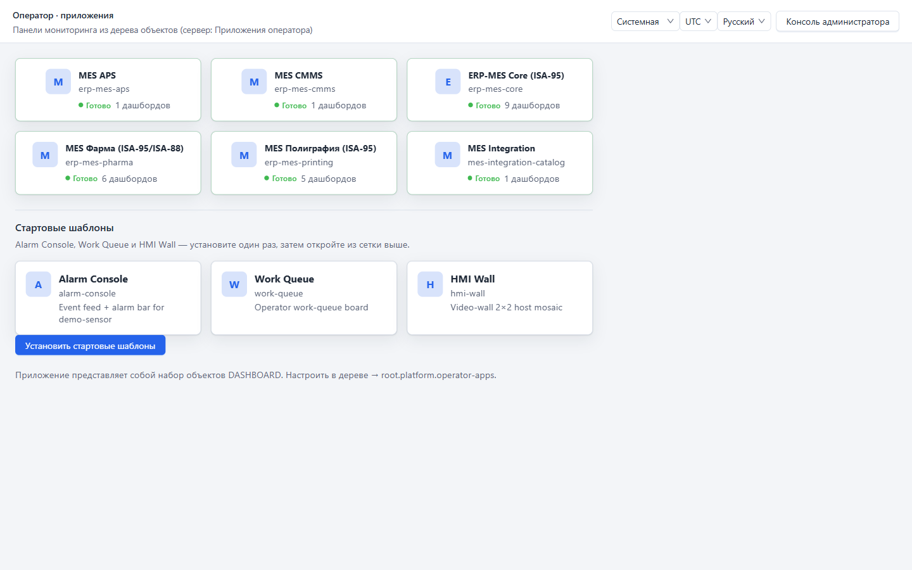

| Карточка | App ID | Для чего |
|----------|--------|----------|
| **ERP-MES Core (ISA-95)** | `erp-mes-core` | Нейтральный контур: диспетчер, склад, качество, ГОСТ, ТОиР, MOM |
| **MES Фарма** | `erp-mes-pharma` | Pharma ISA-88: задания, взвешивание, релиз серии |
| **MES Полиграфия** | `erp-mes-printing` | Печать: диспетчер, простои OGP, рулоны |
| **MES APS** | `erp-mes-aps` | Планирование: board / conflicts / freeze |
| **MES CMMS** | `erp-mes-cmms` | ТОиР: запчасти, PM, заявки |
| **MES Integration** | `mes-integration-catalog` | 1C/SAP/B2MML: коннекторы и Send |

---

## 1. ERP-MES Core — основной контур

Открыть: карточка **ERP-MES Core (ISA-95)**.

### 1.1 Диспетчер — сменные задания

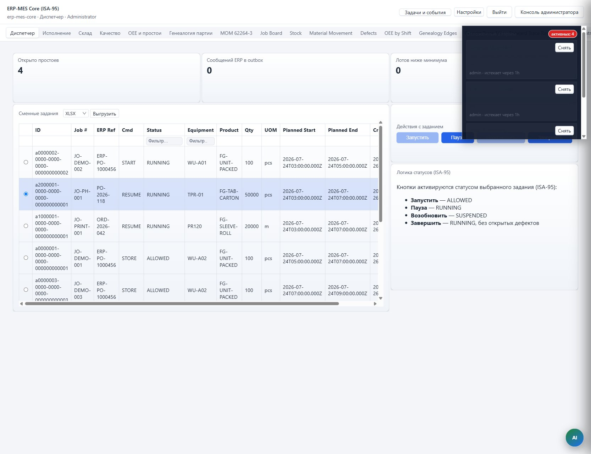

| Шаг | Действие | Ожидание |
|-----|----------|----------|
| 1 | Смотрите KPI сверху | простои / outbox / low stock — числа есть |
| 2 | Таблица «Сменные задания» → радио на строке | выбран `job_no`, статус виден |
| 3 | **Запустить** / **Пауза** / **Возобновить** / **Завершить** | кнопка активна только при подходящем статусе |

| Кнопка | Когда активна |
|--------|----------------|
| Запустить | `ALLOWED` |
| Пауза | `RUNNING` |
| Возобновить | `SUSPENDED` |
| Завершить | `RUNNING` |

Seed: `JO-DEMO-002` (часто `RUNNING` на `WU-A01`).

### 1.2 Исполнение — материалы на линии

Вкладка **Исполнение**: формы «Списать материал», «Поставить лот на линию», «Произвести материал», «Сбор данных».  
Выбирайте штрихкод/job из списков отчётов → кнопка формы → «Выполнено».

### 1.3 Склад — остатки и ERP-документы

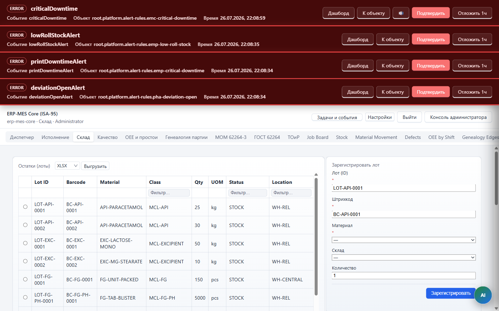

| Процесс | Что нажать |
|---------|------------|
| Остатки | таблица лотов (`LOT-*`, статусы `STOCK` / …) |
| Новый лот | форма «Зарегистрировать лот» |
| На линию | «На линию» + job |
| Документ | «Создать ERP-документ» → в таблице docs |
| Провести | **Submit** → **Accept** для `INV-DEMO-001` (или своего doc) |

### 1.4 Качество — дефекты и QA-тесты

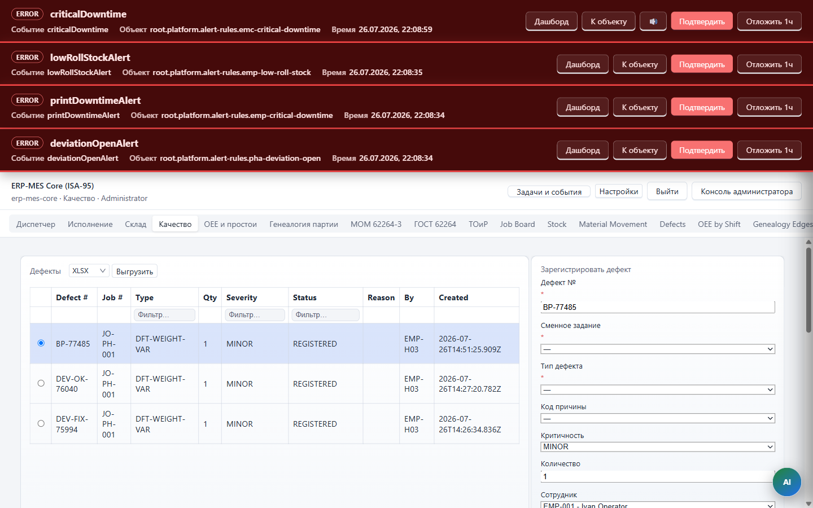

| Процесс | Форма | Пример |
|---------|-------|--------|
| Зарегистрировать дефект | справа | новый `defectNo`, job, тип `DFT-VISUAL` |
| Подтвердить / Закрыть | формы ниже | выбрать `defectNo` из списка |
| QA-тест | «Записать QA-тест» | lot `LOT-FG-0001`, result `PASS` |

### 1.5 OEE и простои

Вкладка **OEE и простои**: зарегистрировать событие (код из каталога) → при необходимости закрыть → «Рассчитать OEE смены».

### 1.6 Генеалогия партии

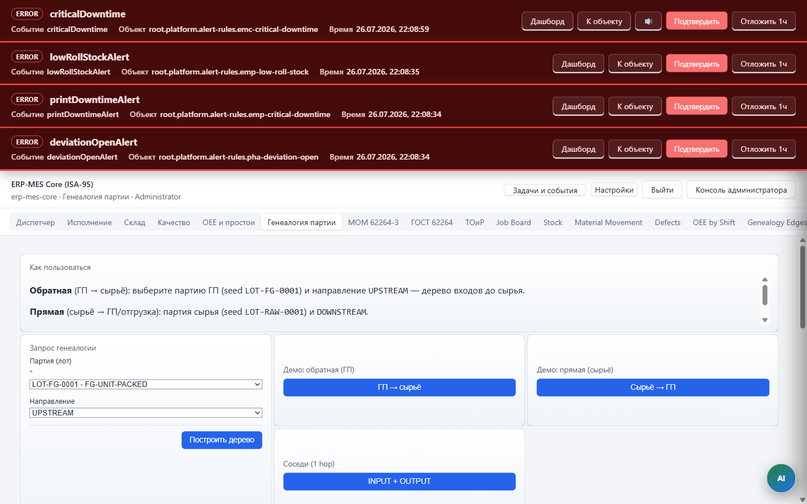

1. Вкладка **Генеалогия партии**.
2. В **каталоге лотов** выберите `LOT-FG-0001` / `0002` / `0003` (радио) — параметр `lotId`.
3. Или в **Job ↔ Lot** выберите заказ (`JO-DEMO-002`→FG-0001, `JO-DEMO-004`→FG-0002, `JO-DEMO-001`→FG-0003).
4. Таблицы **Обратная / Прямая цепочка** и **Рёбра** фильтруются по выбранному `lotId` (только эта партия).
5. Кнопки-демо FG/RAW вызывают BFF-дерево для конкретного лота.

### 1.7 MOM 62264-3 — матрица 4×8

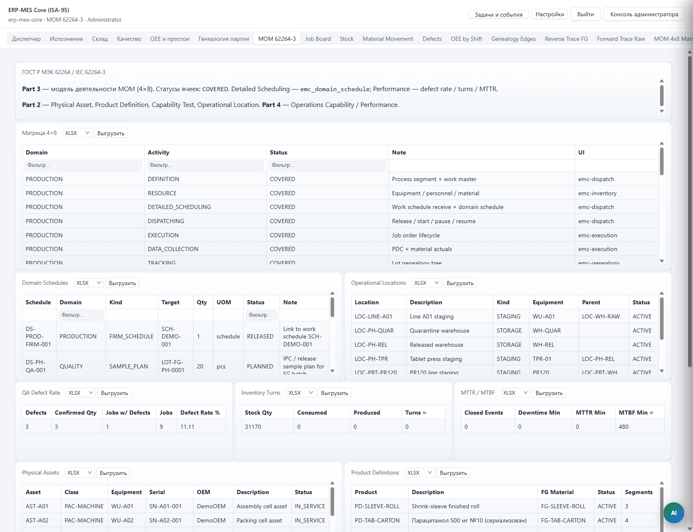

Вкладка **MOM 62264-3**: все ячейки Production / Quality / Inventory / Maintenance × 8 activities = `COVERED`.  
Опционально: upsert domain schedule, capability test result.

### 1.8 ГОСТ 62264 — объектное покрытие M5

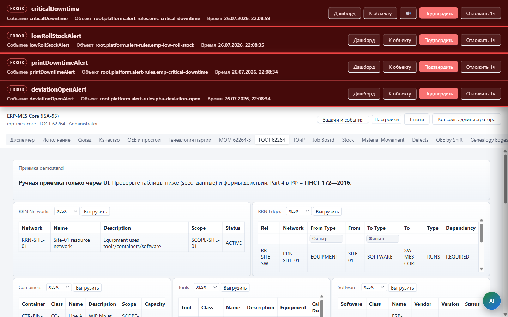

Вкладка **ГОСТ 62264** — ручная приёмка объектов Parts 2+4:

| Блок | Что увидеть / сделать |
|------|------------------------|
| RRN Networks / Edges | сеть `RRN-SITE-01`, рёбра WU↔tool/container, site↔software |
| Containers / Tools / Software | seed `CTR-BIN-A`, `TOOL-FIX-A01`, `SW-MES-CORE` |
| Operations Definitions / Schedules | `OD-ASSEMBLY-01`, `OS-DEMO-001` |
| Work Capability / WMC / KPI | `WC-ASSEMBLE-A01`, связь с `WM-ASSEMBLE` |
| Work Alerts | выбрать `WA-DEMO-001` → **Acknowledge** (`EMP-001`) |
| Ops Definition upsert | форма внизу → «Сохранить» |

Чеклист: [gost-mek-62264-parts-2-3-4.md](gost-mek-62264-parts-2-3-4.md).

### 1.9 ТОиР — заявки maintenance (core)

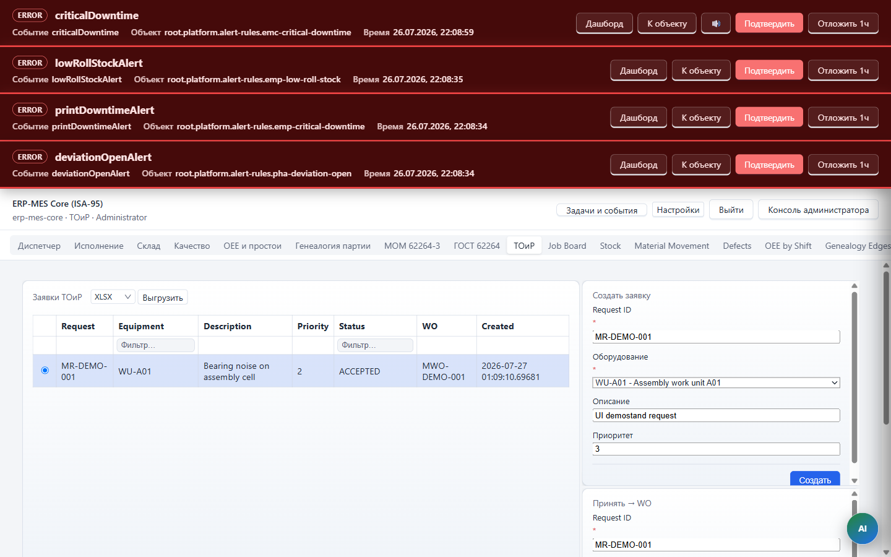

| Шаг | Форма | Пример |
|-----|-------|--------|
| 1 | Смотрите таблицу заявок | `MR-DEMO-001` / `MWO-DEMO-001` |
| 2 | Создать заявку | новый `requestId`, equipment `WU-A01` |
| 3 | Принять → WO | `requestId` + новый `woId` |
| 4 | Завершить WO | `woId` (например `MWO-DEMO-001`) |

Полный CMMS (запчасти/PM) — приложение **MES CMMS** (§5).

---

## 2. MES Фарма (ISA-95 / ISA-88)

Открыть: **MES Фарма**.

### 2.1 Производство — Pause / Resume

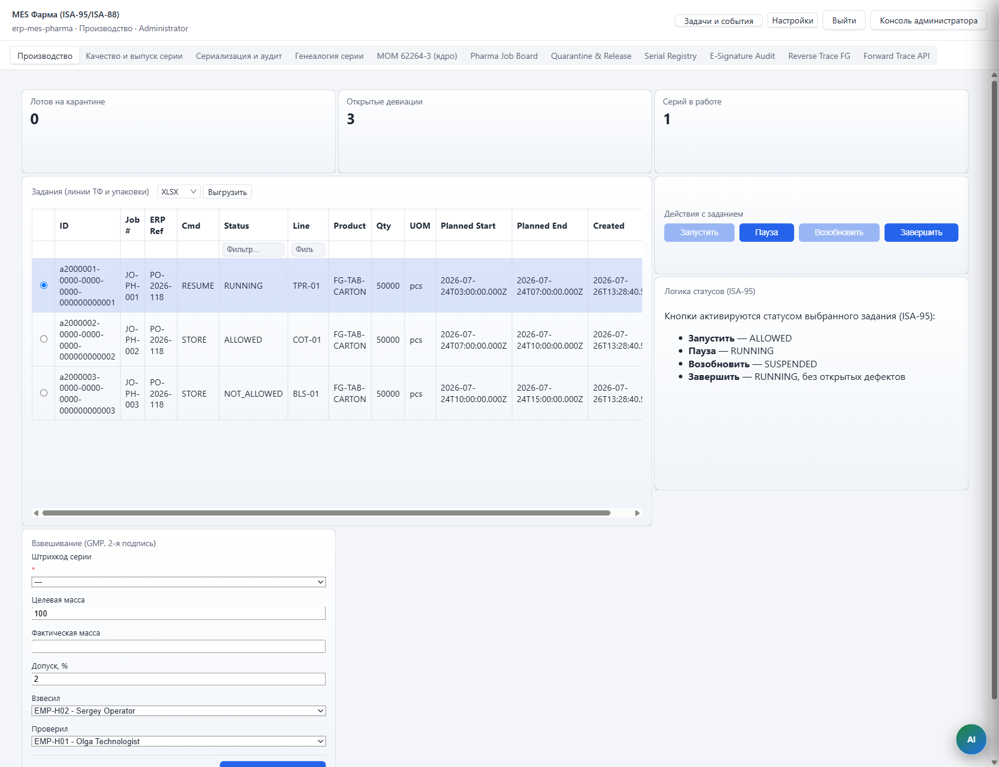

| Шаг | Действие |
|-----|----------|
| 1 | KPI сверху не все нули |
| 2 | Радио **`JO-PH-001`** (`RUNNING` на `TPR-01`) |
| 3 | **Пауза** → Status `SUSPENDED` |
| 4 | **Возобновить** → снова `RUNNING` |

Опционально на той же вкладке — **Взвешивание (GMP, 2-я подпись)**: barcode `BC-API-0002`, массы 100/100, допуск 2%, взвесил `EMP-H02`, проверил `EMP-H01`.

### 2.2 Качество и выпуск серии

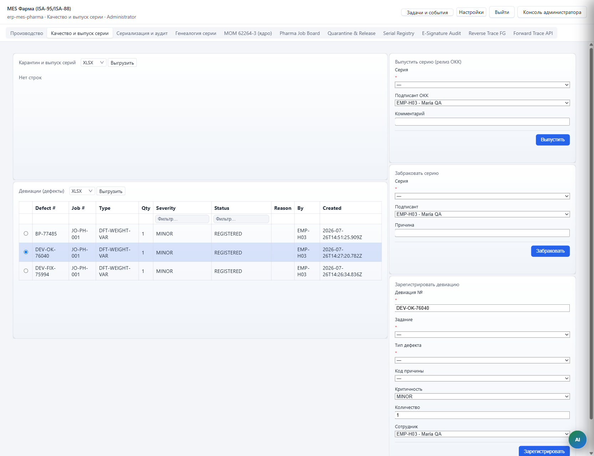

1. Вкладка **Качество и выпуск серии**.
2. Зарегистрировать дефект (новый №, job `JO-PH-001`, тип `DFT-WEIGHT-VAR`).
3. Выпуск серии: строка `QUARANTINE` → форма релиза → disposition `RELEASED` / `WH-REL`.  
   Если карантин пуст — seed уже выпущен (`LOT-FG-PH-0001`).

### 2.3 Генеалогия серии

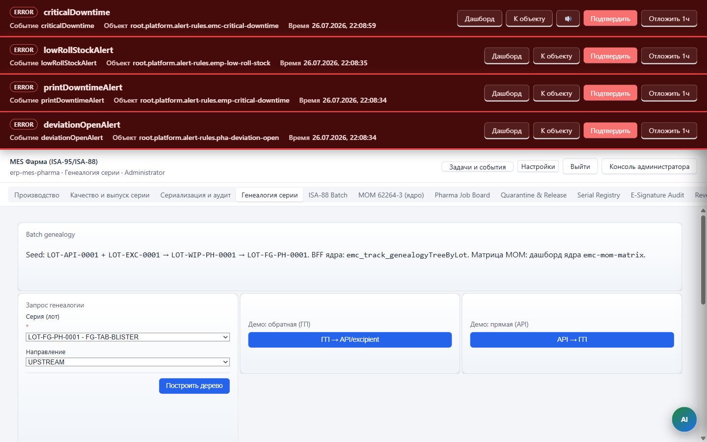

Вкладка **Генеалогия серии** — цепочка для `LOT-FG-PH-0001`.

Дополнительно: **Сериализация и аудит**, **MOM 62264-3 (ядро)**.

---

## 3. MES Полиграфия

Открыть: **MES Полиграфия**.

### 3.1 Диспетчер печати

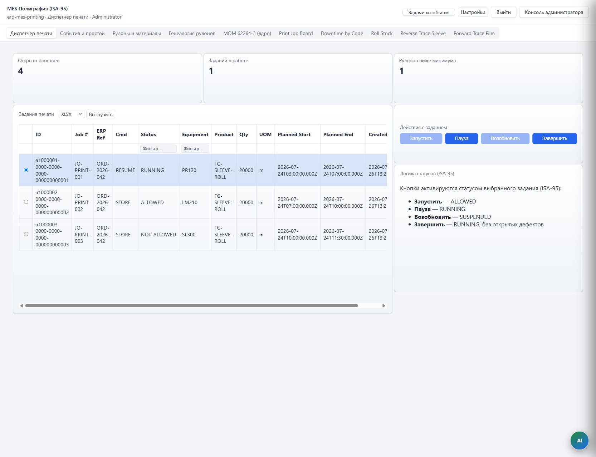

| Шаг | Ожидание |
|-----|----------|
| KPI | простои ≥ 1, low roll = **1** |
| `JO-PRINT-001` | `RUNNING` на `PR120` |
| Пауза → Возобновить | как в Pharma |

### 3.2 События и простои

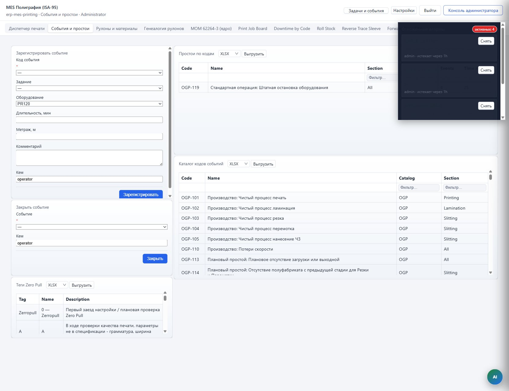

Форма «Зарегистрировать событие»: код **`OGP-119`**, job `JO-PRINT-001`, equipment `PR120`, длительность `5` → **Зарегистрировать**.

Также: вкладки **Рулоны и материалы** (`LOT-FILM-LOW`), **Генеалогия рулонов**.

---

## 4. MES APS — планирование

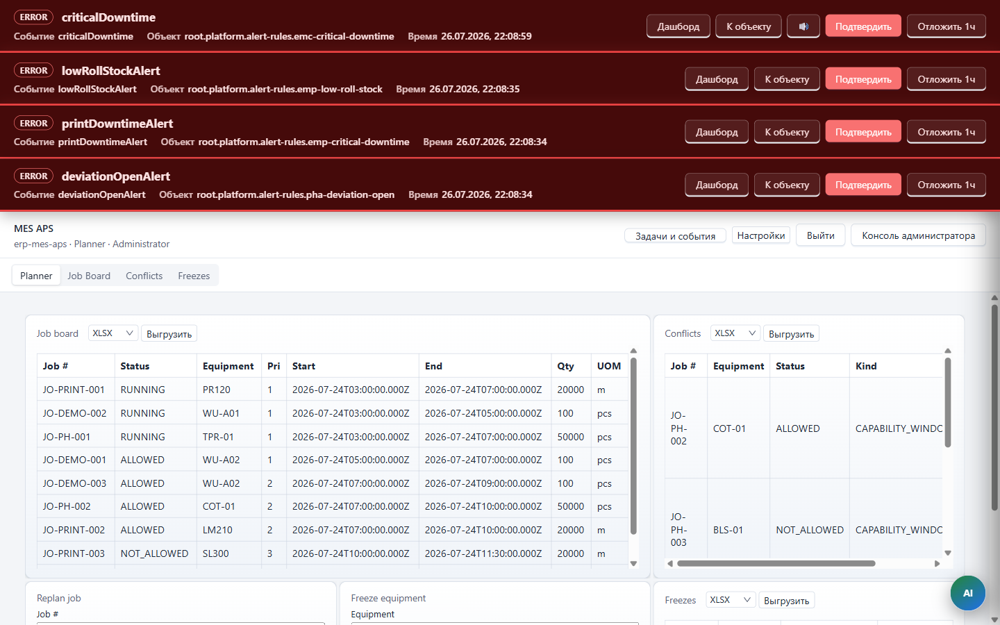

Открыть: **MES APS**.

| Блок | Действие |
|------|----------|
| Job board | таблица заданий JO-* |
| Conflicts | список конфликтов capability |
| Freezes | заморозки плана |
| Replan / forms | формы действий справа (если есть) → «Выполнено» |

---

## 5. MES CMMS — ТОиР product-line

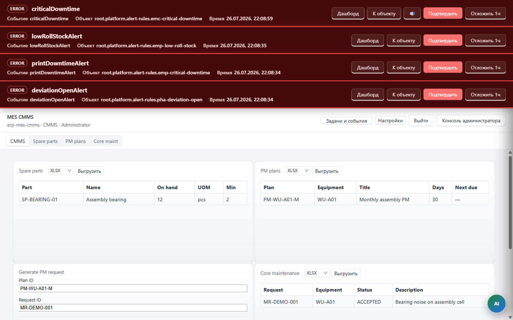

Открыть: **MES CMMS**.

| Блок | Что сделать |
|------|-------------|
| Spare parts | увидеть `SP-BEARING-01`, on hand / min |
| PM plans | `PM-WU-A01-M` на `WU-A01` |
| Generate PM request | Plan `PM-WU-A01-M` → создать/связать request |
| Core maintenance | статус `MR-DEMO-001` (`ACCEPTED` / …) |

Связка с Core **ТОиР**: заявки одни и те же (`emc_maint_*`).

---

## 6. MES Integration — ERP-контур

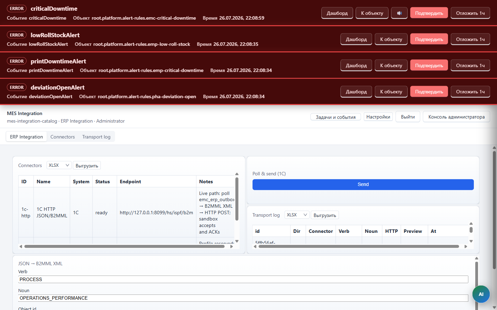

Открыть: **MES Integration**.

| Блок | Действие |
|------|----------|
| Connectors | строки `1c-http`, `sap-idoc` (или аналоги) |
| Transport log | журнал сообщений |
| Send / poll | форма Send (simulate) → **Выполнено** |
| B2MML | toXml / fromXml при наличии форм |

---

## 7. Алерты (все приложения)

Красные полосы сверху — не часть дашборда:

| Кнопка | Смысл |
|--------|--------|
| **Подтвердить** | снять алерт |
| **Отложить 1ч** | временно скрыть |
| **К объекту** | перейти к alert-rule |

На демо часто висят `criticalDowntime`, `lowRollStockAlert`, `printDowntimeAlert`, `deviationOpenAlert` — это нормально для демонстрации.

---

## 8. Чеклист «все модули пройдены»

- [ ] Сетка: 6 карточек приложений видны  
- [ ] Core: Диспетчер Pause/Resume  
- [ ] Core: Склад Submit/Accept  
- [ ] Core: Качество дефект или QA-тест  
- [ ] Core: Генеалогия меняется для `LOT-FG-0001` / `0002` / `0003` (и Job↔Lot)  
- [ ] Core: MOM 4×8  
- [ ] Core: ГОСТ 62264 (RRN + Ack alert)  
- [ ] Core: ТОиР создать/принять/завершить  
- [ ] Pharma: Pause/Resume `JO-PH-001`  
- [ ] Pharma: качество / генеалогия  
- [ ] Printing: Pause/Resume + событие `OGP-119`  
- [ ] APS: board / conflicts  
- [ ] CMMS: spares + PM  
- [ ] Integration: connectors + Send  

---

## 9. Seed-шпаргалка

```
Core jobs:          JO-DEMO-001..005 (ALLOWED / RUNNING / SUSPENDED)
Core FG lots:       LOT-FG-0001, LOT-FG-0002, LOT-FG-0003, LOT-FG-0004 (quarantine)
Core RAW lots:      LOT-RAW-0001..0005
Core WIP lots:      LOT-WIP-0001..0003
Job↔Lot:            JO-DEMO-002→FG-0001, JO-DEMO-004→FG-0002, JO-DEMO-001→FG-0003
Core INV docs:      INV-DEMO-001..003
Core defects:       DEF-DEMO-001..003
Core maint:         MR-DEMO-001..003 / MWO-DEMO-001, MWO-DEMO-003
GOST alerts:        WA-DEMO-001..003
GOST containers:    CTR-BIN-A/B/C
GOST tools:         TOOL-FIX-A01/A02, TOOL-GAUGE-01
Pharma job:         JO-PH-001 / TPR-01
Pharma FG:          LOT-FG-PH-0001
Weigh barcode:      BC-API-0002
Print job:          JO-PRINT-001 / PR120
Event code:         OGP-119
Low roll:           LOT-FILM-LOW
CMMS part / PM:     SP-BEARING-01 / PM-WU-A01-M
```

Генеалогия: на вкладке выберите лот **или** строку Job↔Lot — затем «Построить дерево» / кнопки FG-0001/0002/0003.

---

## 10. Если что-то не так

| Ситуация | Действие |
|----------|----------|
| Кнопка серая | сначала радио по строке; проверьте статус job |
| KPI = 0 | подождите ~30 с, F5 |
| После Паузы Resume мёртв | F5, снова выбрать строку |
| Нет `QUARANTINE` | релиз уже пройден — покажите seed RELEASED |
| Пустая вкладка ГОСТ/ТОиР | сообщите — нужен redeploy layouts |
| Мешают алерты | Подтвердить / Отложить 1ч |
