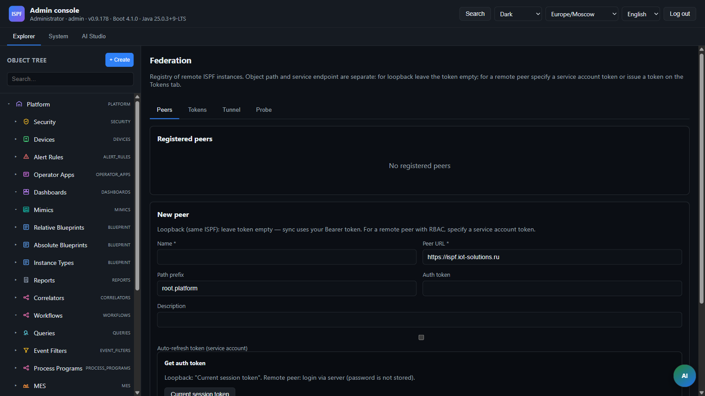

> **Язык:** русская версия (вычитка). Канонический английский: [en/federation.md](../en/federation.md).

# Объединение объектов (шип PF-13)

> **Статус:** Beta — Hub / edge (caveats зрелости). Теги: [doc-status](../en/doc-status.md).

Реализация Spike REQ-PF-13: реестр одноранговых инстансов, чтение/запись прокси-объектов и синхронизация каталога.

Полная концепция — [federation](federation.md), дорожная карта [ROADMAP.md § Phase 4–8](roadmap.md).

## Принцип



**Путь к объекту ≠ конечная точка службы.** Путь `root.platform.devices.x` — стабильный идентификатор в каталоге. URL-адрес удаленного ISPF хранится в реестре одноранговых узлов.

## Компоненты (всплеск)

| Компонент | Описание |
|-----------|----------|
| `federation_peers` (V26, V29) | Таблица однорангового узла: имя, baseUrl, authToken, pathPrefix, включенный, жизненный цикл аутентификации (V29) |
| `federation_inbound_registrations` (V30) | Одноразовые registration codes для inbound tunnel |
| `federation_outbound_agents` (V30) | Конфиг исходящих tunnel-агентов на edge |
| `GET/POST/PUT/DELETE /api/v1/federation/peers` | CRUD (admin) |
| `GET/POST /api/v1/federation/peers/{id}/auth-status`, `refresh-token` | Auth lifecycle для service account peers |
| `POST/GET/DELETE /api/v1/federation/inbound/registrations` | Hub: выпуск registration code |
| `GET /api/v1/federation/tunnels` | Hub: активные tunnel sessions |
| `POST/GET/PUT/DELETE /api/v1/federation/outbound/agents`, `connect` | Edge: CRUD outbound agent |
| `/ws/federation/tunnel` | WebSocket tunnel (registration code или session reconnect) |
| `POST /api/v1/federation/remote-token` | Логин на remote ISPF (server-side), возвращает Bearer для `authToken` |
| `POST /api/v1/security/users/{username}/federation-token` | Выпуск Bearer-сессии для service user на **этом** узле |
| `POST /api/v1/federation/peers/{id}/sync-catalog` | Импортировать список удаленных объектов в локальное дерево (опц. тело: разрешения) |
| `GET /api/v1/federation/peers/{id}/catalog-sync-preview` | Preview: create/update counts + конфликты перед sync |
| Proxy-узлы | AGENT с переменными `federationProxy`, `federationPeerId`, `federationRemotePath` |
| `GET /api/v1/federation/proxy/objects/by-path` | Прямой proxy-read без catalog sync |
| `PATCH /api/v1/federation/proxy/objects/by-path/variables/value` | Proxy-write переменной на remote peer |
| `POST /api/v1/federation/proxy/objects/by-path/functions/invoke` | Proxy-invoke функции на remote peer |
| `GET /api/v1/objects/by-path` | Для proxy-узлов в дереве — прозрачный read через peer |
| `GET /api/v1/dashboards/by-path` | Proxy layout; widget paths remapped на `root.platform.federation.{peer}.*` |
| `PUT /api/v1/dashboards/by-path/layout` | Локальный или федеративный: макет проксируется на удаленном компьютере с возможностью отмены сопоставления путей виджетов |
| `PUT /api/v1/dashboards/by-path/title` | Local или federated: title проксируется на remote |
| `GET /api/v1/objects/by-path/variables/history*` | Proxy historian для federated paths |
| `FederationWebSocketFanoutService` | Развлекательные мероприятия для подписчиков федеративных путей (базовый уведомить) |
| `POST/PATCH/DELETE /api/v1/federation/binds` | Привязка федерации: наложение удаленного узла на **локальный** путь (REQ-PF-13c) |
| `POST /api/v1/federation/binds/probe` | Проверка remote target перед bind |

## Синхронизация каталога и привязка федерации (REQ-PF-13c)

| | Синхронизация каталога | Федерация связывает |
|--|--------------|-----------------|
| Назначение | Массовый обзор всего каталога края | Производственная-структура: объект «свой» по локальному пути |
| Локальный путь | `root.platform.federation.{peer}.*` | Любой путь оператора, напр. `root.platform.devices.edge-pump` |
| Удаленный | Источник данных через метаданные | То же |
| UX | Синхронизация на панели пиров | Инспектор → **Привязка Федерации**; зеркало → **Разместить локально…** |

**Bind** («overlay»): существующий или новый локальный узел получает переменные `federationProxy`, `federationPeerId`, `federationRemotePath`. Чтение, запись, история и дашборд проксируются через `FederationProxyService`. Локальный драйвер (DEVICE) останавливается при bind; локальные переменные остаются, но их bindings скрыты. Перед overlay сохраняется снимок (`displayName`, `description`, `type`, флаг работающего драйвера); **unbind** восстанавливает эти свойства и перезапускает драйвер, если он работал до bind.

```http
POST /api/v1/federation/binds
{
  "localPath": "root.platform.devices.edge-pump",
  "peerId": "<uuid>",
  "remotePath": "root.platform.devices.demo-sensor-01"
}
```

Create + bind: `parentPath` + `name` вместо `localPath`. Rebind: `PATCH /api/v1/federation/binds`. Unbind: `DELETE /api/v1/federation/binds?localPath=...`.

**Одинаковый путь к удаленному узлу (типичный сценарий):** локальный `root.platform.devices.snmp-localhost` можно привязать к удаленному узлу с тем же `remotePath` — данные берутся с Edge, локального драйвера и переменных замороженных. Пути произошли **на разных инстансах**, это нормально.

**Защита от циклов:**

- Запрещено: `localPath` = `remotePath` на **том же** ISPF (loopbackpeer → бесконечный прокси).
- Запрещено: `remotePath` указывает на **локальный** узел, привязанный к федерации (в т.ч. зеркало `root.platform.federation.*`), особенно если его удаленная цель уже равна привязке `localPath`.
- Один переход: нельзя цепочку через другой локальный федеративный путь.

```http
POST /api/v1/federation/binds
{
  "localPath": "root.platform.devices.snmp-localhost",
  "peerId": "<edge-tunnel-peer>",
  "remotePath": "root.platform.devices.snmp-localhost"
}
```

## Синхронизация каталога

### Предварительный просмотр и конфликты (BL-45)

Перед sync Web Console открывает диалог **Catalog sync** (`FederationCatalogSyncDialog`): `GET /api/v1/federation/peers/{peerId}/catalog-sync-preview`.

| Тип конфликта | Когда | Разрешение |
|---------------|-------|------------|
| `LOCAL_NATIVE` | На локальном пути уже есть **не-прокси** объект | `SKIP` (по умолчанию) или `BIND` (перезаписать прокси-метаданными) |
| `PROXY_MISMATCH` | Прокси существует, но `peerId` / `remotePath` не соответствует импорту | `SKIP` или `BIND` |

Применение:

```http
POST /api/v1/federation/peers/{peerId}/sync-catalog
Content-Type: application/json

{
  "resolutions": [
    { "localPath": "root.platform.federation.site-a.devices.pump-01", "action": "BIND" }
  ]
}
```

`action`: `SKIP` | `BIND`. Пустой корпус — синхронизация без разрешения: конфликты **происходят** (безопаснее, чем тихая перезапись).

Ответ: `{ localRoot, created, updated, remoteCount, skipped }`.

### Импорт узлов

`POST /api/v1/federation/peers/{peerId}/sync-catalog` загружает список объектов с peer и создаёт локальные proxy-узлы:

```text
root.platform.federation.{peer-name}.devices.demo-sensor-01
  federationPeerId = <uuid>
  federationRemotePath = root.platform.devices.demo-sensor-01
  federationProxy = true
```

Веб-консоль: нажмите кнопку **Синхронизировать каталог** на панели Пиров Федерации → диалог предварительного просмотра → **Синхронизировать каталог**.

Повторный синхронный **идемпотентен** для совпадающих прокси: узлы с тем же `peerId` + `remotePath` обновляют метаданные (`updated`). При обратной связи одноранговый путь `root.platform.federation.*` на удаленной стороне отключаются, чтобы не создавать вложенные зеркала каталога.

### Выборочная синхронизация поддерева (BL-119, S22)

Синхронизация **части** remote-каталога вместо полного `sync-catalog`:

| Конечная точка | Описание |
|----------|----------|
| `GET /api/v1/federation/peers/{id}/subtree-sync-preview?remoteSubtreePath=…&localParentPath=…` | Preview create/update/conflicts для поддерева |
| `POST /api/v1/federation/peers/{id}/sync-subtree` | Применить sync поддерева |

Body `sync-subtree`:

```json
{
  "remoteSubtreePath": "root.platform.devices",
  "localParentPath": "root.platform.federation.site-a.devices",
  "resolutions": []
}
```

- `remoteSubtreePath` обязателен, должен быть под `pathPrefix` peer (по умолчанию `root.platform`).
- `localParentPath` опционален; по умолчанию зеркало строится под `root.platform.federation.{peer}.*` с тем же suffix.
- Конфликты и разрешения — как при полной синхронизации каталога.

**Веб-консоль:**

- Federation peers → **Sync devices subtree** (быстрый preset `root.platform.devices`).
- Проводник → папка зеркала федерации → вкладка «Федерация» → **Синхронизировать эту папку с одноранговым узлом**.

## Книга восстановления + SLO (BL-120, S22-05)

| Сценарий | Симптом | Действие | СЛО |
|----------|---------|----------|-----|
| Пир отключен | Прокси 400 «Пир отключен» | `PUT /peers/{id}` → `enabled: true` | ≤ 5 минут до повторного включения |
| Вглядеться вниз (КРАСНЫЙ) | Здоровье RED, тайм-аут прокси | Проверить URL/туннель/токен; `refresh-token` для сервисного аккаунта | Среднее время восстановления менее 15 минут (опс) |
| Partial catalog | Нужны только devices | `sync-subtree` вместо full sync | — |
| Отставание по перенаправлению | Туннель в автономном режиме, события с буферизацией | Дождаться повторного подключения или `connect` исходящий агент | Воспроизведение ≤ 60 с после повторного подключения (лаборатория) |

**Покрытие хаоса:** `FederationChaosIntegrationTest` — отключить одноранговый узел → сбой прокси/синхронизации → повторно включить → синхронизация прошла успешно; вариант поддерева (`disabledPeerBlocksSubtreeSyncAndRecoversAfterReEnable`) — `sync-subtree` импортирует только устройства, а не дашборды.

### Бюджет интеграционного теста (S27)

Tunnel and store-forward ITs poll async connect/replay; budgets live in `FederationIntegrationTestSupport`:

| Константа | Местный | КИ | Используется |
| -------- | ----- | -- | ------- |
| `TUNNEL_CONNECT_TIMEOUT_SECONDS` | 60 | 120 | `FederationTunnelIntegrationTest`, `FederationStoreForwardIntegrationTest` |
| `PROXY_READY_TIMEOUT_SECONDS` | 30 | 60 | `FederationTunnelIntegrationTest` |
| `BUFFER_DRAIN_TIMEOUT_SECONDS` | 90 | 120 | `FederationStoreForwardIntegrationTest` |
| `CONNECT_RETRY_INTERVAL_MS` | 5000 | 5000 | tunnel connect retry |

Тесты с пометкой `@Isolated` (`FederationChaosIntegrationTest`, `FederationTunnelIntegrationTest`, `FederationStoreForwardIntegrationTest`) — отсутствие параллельного выполнения с другими ИТ-классами. Nightly gates: [ci-nightly.yml](../../.github/workflows/ci-nightly.yml) задание **Federation integration gates (S27)**. При сбое тайм-аута сортировка выполняется согласно [ci-flaky-triage](ci-flaky-triage.md) (P1, если &lt;1×/неделя).

**Контрольный список операций:**

1. `GET /api/v1/federation/peers` — значок здоровья ЗЕЛЕНЫЙ/ЖЕЛТЫЙ.
2. `GET /api/v1/federation/peers/{id}/health` — `lastProxyError`, латентность.
3. При деградации — отключить одноранговый узел (fail-fast), исправить восходящий поток, повторно включить, `sync-subtree` или `sync-catalog`.
4. Туннельные узлы — `GET /api/v1/federation/tunnels`, статистика исходящего буфера.

## Запись в дашборд через прокси (BL-46)

Федеративный дашборд (`federationProxy=true` под `root.platform.federation.*` или привязка к `DASHBOARD`) раньше возвращала **403** к `PUT layout/title`. Теперь:

1. Клиент сохраняет макет с **локальными** путями виджетов (`root.platform.federation.{peer}.*`).
2. `DashboardController` → `FederationProxyService.proxyDashboardSaveLayout` / `SaveTitle`.
3. `FederationPathRemapper.unremapLayoutJson` переводит путь обратно в удаленный префиксный узел.
4. `PUT` на пульте `/api/v1/dashboards/by-path/layout|title`.
5. Ответ снова remap'ится для локального интерфейса.

`refreshIntervalMs` по-прежнему через переменную PUT на прокси-объекте (как и другие записываемые переменные).

## префикс пути

Если партнер обслуживает ту же иерархию, но консоль передает относительный путь:

- `path=devices.demo-sensor-01` + `pathPrefix=root.platform` → remote `root.platform.devices.demo-sensor-01`

## Авторизация между инстансами

В равноправном состоянии сохраняется `authToken` (учетная запись службы на предъявителя в удаленном ISPF). Токен не возвращается в список API (`hasAuthToken: true/false`).

Если `authToken` не задано, исходящие запросы к одноранговому узлу используют Bearer-токен текущего пользователя (удобно для шлейфа на `127.0.0.1` с включенным RBAC). Для фоновых задач без токена HTTP-контекста на пире обязателен.

### Веб-консоль

Панель **Коллеги федерации** (Проводник → Платформа → Федерация):

1. **Токен для федерации (этот узел)** — выбор пользователя и TTL, кнопка «Выпустить токен». Токен копируется в одноранговый узел другого ISPF.
2. При создании пира:
   - **Текущий сессионный токен** — подставляет носителя вашей сессии (петлевая связь).
   - **Получить токен с удаленного** — `POST /api/v1/federation/remote-token` с `baseUrl` из форм и учётных данных удаленного (пароль не сохраняется в формате).

Токены — обычные токены сеанса платформы (TTL по умолчанию 12 ч, макс. 168 ч), недолгоживущие ключи API. Нужен профиль `local` или `ispf.security.token-auth-enabled: true`.

### Жизненный цикл аутентификации (этап 7.1)

Peer может использовать `authMode`:

| Режим | Описание |
|-------|----------|
| `STATIC_TOKEN` | Bearer вручную (по умолчанию) |
| `SERVICE_ACCOUNT` | Логин/пароль на remote; пароль шифруется (`ispf.security.secrets-key`) |

Для `SERVICE_ACCOUNT`:

- `@Scheduled` refresh за ~20% TTL (мин. 1 ч) до expiry
- При 401 от узла — одна немедленная повторная попытка после обновления.
- `GET /api/v1/federation/peers/{id}/auth-status` — диагностика
- `POST /api/v1/federation/peers/{id}/refresh-token` — ручной refresh

Рекомендуется dedicated user `federation-agent` с role operator/admin и tenant scope.

### Исходящий туннель (граница NAT, этап 7.2)

Локальная граница за NAT **недоступна входящая**. Edge инициирует исходящий WebSocket к публичному хабу:

```text
Edge (NAT) ──WS outbound──► Hub (public)
Hub ──proxy_request──► Edge ──local services──► response
```

**Последовательность действий оператора:**

1. **Хаб:** Федерация → Входящая регистрация → имя + путьПрефикс → **код регистрации** (один раз).
2. **Edge:** Федерация → Исходящий агент → URL-адрес концентратора + код → Подключиться.
3. Хаб автоматически создает узел `connection_mode=TUNNEL_INBOUND`.
4. **Синхронизировать каталог** на хабе → `root.platform.federation.{site}.*`.
5. Чтение/запись/вызов рабочих через туннель; `event_notify` заменяет HTTP-опрос для подписки WS.

Требования к продукту: `ispf.security.secrets-key` на краю (хранение регистрационного кода/сессионного токена); обратный прокси с поддержкой `wss`.

### С промежуточным хранением (BL-117)

При разрыве исходящего края туннеля **не тенденции** события платформы, которые хаб должен получить через `event_notify`:

1. `FederationOutboundEventBufferRegistry` сохраняет буфер в памяти для каждого агента.
2. Пока WS отключен, `FederationTunnelAgentService` кладёт `ObjectChangeEvent` в буфер вместо отправки.
3. После повторного подключения — `replayBufferedEvents()` с заказом защиты на хабе (`lastEventSeqByPeer`).

Конфиг (`application.yml`):

```yaml
ispf.federation:
  outbound-buffer:
    max-bytes: 2097152          # ISPF_FEDERATION_OUTBOUND_BUFFER_MAX_BYTES
    drop-policy: DROP_OLDEST    # или DROP_NEWEST
  health:
    stale-minutes: 15           # ISPF_FEDERATION_HEALTH_STALE_MINUTES
```

| Политика | Поведение при затруднении |
|----------|----------------------------|
| `DROP_OLDEST` | Удаляет старейшие события, принимает новое |
| `DROP_NEWEST` | Отклоняет новое событие, сохраняет очередь |

`event_notify` включает опциональные `seq` и `occurredAt` для детерминированного replay.

Тесты: `FederationOutboundEventBufferTest`, `FederationStoreForwardIntegrationTest`.

### Служба промежуточного хранения агента (BL-145)

`AgentStoreForwardService` (`com.ispf.server.agent`) — именованный фасад над буфером в памяти для краевого исходящего туннеля. Используется `FederationTunnelAgentService` при отключении/повторном подключении.

Конфиг:

```yaml
ispf:
  agent:
    store-forward:
      enabled: true                 # ISPF_AGENT_STORE_FORWARD_ENABLED
      max-bytes: 2097152            # ISPF_AGENT_STORE_FORWARD_MAX_BYTES
      drop-policy: DROP_OLDEST      # ISPF_AGENT_STORE_FORWARD_DROP_POLICY
```

| Ключ | По умолчанию | Описание |
|------|---------|----------|
| `enabled` | `true` | При `false` события не буферизуются и не replay |
| `max-bytes` | 2 MiB | Лимит per-agent (делегирует в `FederationOutboundEventBufferRegistry`) |
| `drop-policy` | `DROP_OLDEST` | Политика переполнения |
| `persist-to-disk` | `true` | JSON snapshot в `{data-dir}/agent/store-forward-buffer.json` |

Устаревший псевдоним: `ispf.federation.outbound-buffer.*` — тот же реестр; Новые периферийные развертывания предпочитают `ispf.agent.store-forward.*`.

**Постоянство (BL-145):** при `persist-to-disk=true` ожидающие события сохраняются в `{ISPF_DATA_DIR}/agent/store-forward-buffer.json` и восстанавливаются при перезапуске.

**Метрика API (BL-145 HARDEN):**

```http
GET /api/v1/agent/store-forward/stats
Authorization: Bearer <read-token>
```

Ответ: `{ enabled, persistToDisk, maxBytes, dropPolicy, agents: { "<agentId>": { pendingCount, pendingBytes, dropped } }, totalPending, totalBytes, totalDropped, capturedAt }`.

Используйте для field/lab soak и алертинга на рост `totalPending` / `totalDropped`.

### Замачивание поля — повтор 30-дневного буфера (BL-145)

Ускоренное лабораторное погружение (30 сим-дней за 30 стено-минут):

```bash
export ISPF_SOAK_BASE_URL=https://edge-site.example
export ISPF_SOAK_TOKEN=<admin-or-read-token>
export ISPF_SOAK_OUTBOUND_AGENT_ID=<uuid>   # optional disconnect/reconnect cycles
export ISPF_DATA_DIR=/var/lib/ispf          # optional persist file check
bash deploy/local/tools/agent-store-forward-soak.sh
```

| Окружение | По умолчанию | Описание |
|-----|---------|----------|
| `ISPF_SOAK_SIM_DAYS` | `30` | Simulated timeline length |
| `ISPF_SOAK_WALL_MINUTES` | `30` | Wall-clock duration (86400× accel vs 30d) |
| `ISPF_SOAK_POLL_SEC` | `10` | Stats poll interval |
| `ISPF_SOAK_OUTBOUND_AGENT_ID` | — | Weekly simulated maintenance disconnect/reconnect |
| `ISPF_SOAK_EVENT_PATH` / `ISPF_SOAK_EVENT_VAR` | demo sensor | Variable patches while tunnel offline |

**Загрузка производственных полей:** запустите один и тот же сценарий с `ISPF_SOAK_WALL_MINUTES=43200` (30 реальных дней) на каждом граничном узле после регистрации концентратора. Обзор `build/agent-store-forward-soak/soak-report.md` + CSV; шлюз GA при нулевой потере данных (204 стабильный, ожидающий сброса после повторного подключения).

**Ограничения (v1):** буфер отслеживает только туннель `event_notify`; Одноранговые узлы только HTTP без исходящего туннеля не буферизуются.

### SLO по здоровью сверстников (BL-118)

Индивидуальная диагностика для оператора и оповещения:

| Сигнал | Источник |
|--------|----------|
| Tunnel connected | `FederationTunnelHubService` |
| Auth status | `FederationPeer.authStatus` |
| Last proxy success / latency / error | `FederationPeerHealthService` (HTTP + tunnel proxy) |
| Ожидающие буферизованные события | реестр исходящих буферов |

**Ограничения (v1):** снимки прокси-сервера и статистика буфера хранятся только в памяти (сбрасываются при перезапуске сервера).

**Автоматическое оповещение (S27):** `FederationPeerHealthMonitor` срабатывает `peerHealthDegraded`/`peerHealthRecovered` на `root.platform.federation`, когда включенный одноранговый узел переходит на КРАСНЫЙ ↔ ЗЕЛЕНЫЙ. Настройте правила оповещений об этих событиях для веб-перехватчика или электронной почты.

**API:**

```http
GET /api/v1/federation/peers/{id}/health
```

Ответ: `{ peerId, level, tunnelConnected, lastProxySuccessAt, lastProxyLatencyMs, lastProxyError, pendingBufferedEvents, summary }`.

`level`: `GREEN` | `YELLOW` | `RED` — устаревший прокси &gt; N мин, туннель отключен, аутентификация не удалась, ожидающий буфер.

List peers (`GET /api/v1/federation/peers`) дополнительно возвращает `healthLevel` и `healthSummary`.

Веб-консоль: значок состояния колонки на панели **Коллеги федерации** (зелёный/желтый/красный).

## Менеджер-менеджеров — оболочка оператора центра федерации (BL-188)

> **Статус: Готово (usable path).** Чеклист хаба + picker пиров оператора (`OperatorFederationPeerSelector`) + pairing ARM edge — реальны. **Не заявлено:** load-proven масштаб 10+ одновременных пиров (нет CI soak gate).

**Менеджер-оф-менеджеров (MoM)** — это центральный экземпляр **хаба** ISPF, который объединяет множество периферийных сайтов для операторов без необходимости входа на каждый сайт отдельно. Граничные узлы работают за NAT; концентратор запускает операторский HMI через пути федеративного прокси.

### Топология

```text
                    ┌─────────────────────────────────────┐
                    │  Hub ISPF (public)                  │
                    │  Operator HMI: ?mode=operator&app=  │
                    │    federation-hub                   │
                    │  root.platform.federation.{site}.*  │
                    └──────────────┬──────────────────────┘
           tunnel WS              │              tunnel WS
     ┌──────────────┐    ┌──────────────┐    ┌──────────────┐
     │ Edge site A  │    │ Edge site B  │    │ Edge site C  │
     │ (ARM / NAT)  │    │ (ARM / NAT)  │    │ (ARM / NAT)  │
     └──────────────┘    └──────────────┘    └──────────────┘
```

Развертывание профилей: хаб использует стандартный стек VPS; края используют [docker-compose.edge-arm.yml](../../deploy/docker-compose.edge-arm.yml) с включенным исходящим туннелем.

### Контрольный список настройки хаба

1. **Входящая регистрация** — Федерация → Входящая регистрация → выдача регистрационного кода для каждого пограничного сайта.
2. **Периферийное соединение** — каждое ребро: Федерация → Исходящий агент → URL-адрес концентратора + код → Подключиться.
3. **Состояние узла** — `GET /api/v1/federation/peers` — все включенные узлы ЗЕЛЕНЫЕ перед развертыванием оператора.
4. **Синхронизация каталога** — Полная синхронизация или `sync-subtree` для `root.platform.devices` на сайт (BL-119).
5. **Приложение оператора** — создайте манифест приложения оператора `federation-hub`:
   - Панели мониторинга ссылаются на 225 путей (переназначенные виджеты).
- `alarmBar` включено — федеративное разветвление событий через `FederationWebSocketFanoutService`.
   - Сообщает о дополнительном BFF для каждого сайта (вызов через прокси-сервер при настройке).

### Пользовательский интерфейс оболочки оператора

| Элемент | Поведение хаба |
|---------|--------------|
| Dashboard tabs | One tab per site or per production area (`site-a-overview`, `site-b-overview`) |
| объект-таблица | Строки из поддерева объединенных устройств; SelectionKey детализирует дашборд сайта |
| Живые ценности | Чтение прокси + разветвление WS; устаревший значок при сверстнике ЖЕЛТЫЙ/КРАСНЫЙ |
| Выбор сайта Федерации | Значки здоровья сверстников (зелёные/желтые/красные) + 2-минутное обновление опроса |
| Журнал событий | Агрегированное ПРЕДУПРЕЖДЕНИЕ+ из всех федеративных префиксов |
| Второй пилот агента | Охватывается только префиксами приложений оператора концентратора ([operator-guide](operator-guide.md)) |

Операторы **никогда** не редактируют узлы федерации или привязки — только в консоли администратора.

### Привязка федерации и зеркало каталога (MoM)

| Узор | Использование в ММ |
|---------|------------|
| **Catalog sync / subtree** | Default — bulk mirror under `root.platform.federation.{peer}.*` |
| **Привязка Федерации** | Когда концентратор должен отображать удаленное устройство по **каноническому локальному пути** (например, тот же путь, что и у Edge для учебных документов) |

Отдайте предпочтение зеркальному каталогу для масштаба MoM; используйте привязку для ≤10 критически важных ресурсов, которым требуются фиксированные пути на общих панелях мониторинга.

### Здоровье и СЛО

Следуйте [Recovery runbook + SLO (BL-120)](#recovery-runbook--slo-bl-120-s22-05):

- Отключить пир при длительном КРАСНОМ → оператор видит последние известные значения + баннер.
- Re-enable after fix → `sync-subtree` if catalog drift suspected.
- Alert on `peerHealthDegraded` events ([Peer health SLO (BL-118)](#peer-health-slo-bl-118)).

### Ограничения (v1)

— Нет межодноранговых вычисляемых привязок на концентраторе (при необходимости агрегируйте в концентраторе CUSTOM Hub вручную).
- Прокси-серверы записи панели управления на удаленный компьютер — изменения макета оператора хаба влияют на **удаленную** панель управления (BL-46).
- Приложение оператора MoM доступно только для чтения для конфигурации; второй пилот агента доступен только для чтения ([roadmap](roadmap.md)).

См. также: [operator-guide](operator-guide.md), [deploy/docker-compose.edge-arm.yml](../../deploy/docker-compose.edge-arm.yml), [roadmap](roadmap.md) BL-188.

## Ограничения скачка/отставания производства

- Запись прокси — патч переменной, вызов функции, **макет/заголовок панели**; Полная двусторонняя синхронизация положения не предусмотрена.
- Синхронизация каталога — импорт + разрешения оператора; без `BIND` конфликтующие несоответствия локального нативного/прокси **не переза ​​решение**.
- ~~Edge store-forward~~ — **Готово (BL-117, S17):** буфер в памяти + воспроизведение; постоянство диска — отставание.
- ~~Peer health SLO~~ — **Выполнено (BL-118, S17):** Health API + значки пользовательского интерфейса; **оповещение (S27):** `peerHealthDegraded` / `peerHealthRecovered` события.
- ~~Объединенные дашборды доступны только для чтения~~ — **Готово (BL-46):** запись макета/заголовка проксируется на удаленном компьютере.
- ~~Синхронизация каталога без слияния критериев~~ — **Готово (BL-45):** предварительный просмотр + SKIP/BIND в пользовательском интерфейсе.
- ~~Scope тенанта в API федерации~~ — **Выполнено v0.3.0** (`FederationAccessService`, одноранговый CRUD только для администратора, область действия прокси).
- ~~подписка WS по пути~~ — **Выполнено v0.3.0** (`ObjectWebSocketHandler` + `FederationSubscribePollService` + перехват веб-консоли).

## Пример

```http
POST /api/v1/federation/peers
{ "name": "site-a", "baseUrl": "https://ispf-site-a.example", "pathPrefix": "root.platform" }

GET /api/v1/federation/proxy/objects/by-path?peerId=<uuid>&path=devices.demo-sensor-01
Authorization: Bearer <admin-token>

PATCH /api/v1/federation/proxy/objects/by-path/variables/value?peerId=<uuid>&path=devices.demo-sensor-01&name=temperature
Authorization: Bearer <admin-token>
{ "schema": { "name": "temperature", "fields": [{"name": "value", "type": "DOUBLE"}] }, "rows": [{"value": 22.5}] }
```
