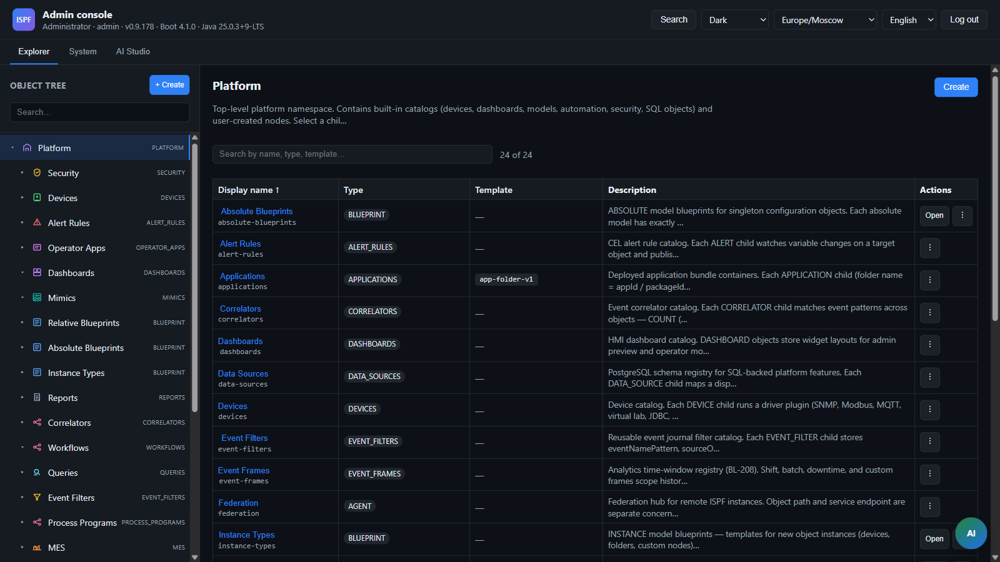

> **Язык:** русская версия (вычитка). Канонический английский: [en/getting-started.md](../en/getting-started.md).

# Быстрый старт

> **Статус:** Stable — Try ISPF + QA для контрибьюторов. Теги: [doc-status](doc-status.md).

Два трека:

1. **[Попробовать ISPF](#попробовать-ispf-15-минут)** — запуск и демо (новички).  
2. **[Контрибут](#контрибут-локальный-dev--qa)** — быстрый local QA / pre-push (контрибьюторы).

---

## Попробовать ISPF (≈15 минут)

### Вариант A — all-in-one JAR (быстрее всего)

Скачайте **`ispf-*-portable.zip`** с [GitHub Releases](https://github.com/iot-solutions-ru/ispf/releases) (JDK **25**). Распакуйте, затем:

```bash
# Windows: двойной клик по start.bat
# Linux / macOS:
./start.sh
```

Отдельный PostgreSQL не нужен — portable использует **встроенный H2** (после первого старта файл `data/ispf-local.mv.db`).

Откройте http://localhost:8080 — логин `admin` / `admin`. Дальше с [§2 Вход](#2-вход-local) (порт 8080 вместо 5173).

### Вариант B — из исходников

### Требования

| Компонент | Версия |
|-----------|--------|
| JDK | **25** (Gradle toolchain; `JavaLanguageVersion.of(25)`) |
| Gradle | Wrapper в репозитории |
| Node.js | 20+ |
| Docker Desktop | Опционально — только для полного стека PostgreSQL / Keycloak / MQTT |

### 1. Запуск API + консоли

```bash
# Терминал 1 — профиль local (H2 file DB; sync небольшого набора dev driver packs)
./gradlew :packages:ispf-server:bootRun --args="--spring.profiles.active=local"

# Терминал 2 — Web Console
cd apps/web-console && npm install && npm run dev
```

| URL | Назначение |
| --- | ---------- |
| http://localhost:8080 | Консоль администратора (all-in-one JAR) |
| http://localhost:5173 | Консоль администратора (Vite dev) |
| http://localhost:8080?mode=operator | Operator HMI (all-in-one JAR) |
| http://localhost:5173?mode=operator | Operator HMI (Vite dev) |
| http://localhost:8080/api/v1/info | Версия / capabilities |
| http://localhost:8080/actuator/health | Health |

`bootRun` по умолчанию вызывает **`syncDevDriverPacks`** (≈8 packs). Полный каталог: `-Dispf.driver.packs=all`.

### 2. Вход (`local`)

Пустая БД создаёт пользователей: **`admin` / `admin`** (также `developer` / `developer`, `operator` / `operator`). Войдите через экран логина Web Console.

API (Bearer — нужен для большинства вызовов):

```bash
TOKEN=$(curl -s -X POST http://localhost:8080/api/v1/auth/login \
  -H "Content-Type: application/json" \
  -d '{"username":"admin","password":"admin"}' | jq -r .token)

curl -H "Authorization: Bearer $TOKEN" http://localhost:8080/api/v1/objects
```

Заголовок `X-ISPF-Role` по умолчанию **выключен** (`ispf.security.local-role-header-enabled=false`). Не рассчитывайте на селектор Role в шапке для обычного local. Подробнее: [security](security.md).

### 3. Первые шаги в UI



1. Откройте дерево объектов — ветка `root.platform`.  
2. Раскройте `devices` → `demo-sensor-01` — temperature, threshold, alarm.  
3. Дважды кликните `dashboards.demo-sensor` — **Dashboard Builder**.  
4. Раскройте `alert-rules` → `temperature-threshold-exceeded` — CEL-правило.  
5. Дважды кликните `workflows.demo-alarm-handler` — демо **BPMN**.  
6. Режим оператора: `http://localhost:8080?mode=operator` (all-in-one JAR) или `http://localhost:5173?mode=operator` (Vite), или вход как `operator`.

Язык: селектор в шапке (**English** удобен для OSS-скриншотов).

### 4. Старт драйвера demo-sensor

```bash
curl -X POST "http://localhost:8080/api/v1/drivers/runtime/start?devicePath=root.platform.devices.demo-sensor-01" \
  -H "Authorization: Bearer $TOKEN"
```

Температура — синусоида; при превышении порога срабатывают `alarmActive` и alert rule.

### Дальше после демо

- [Обзор продукта](product.md) · [Модель объектов](object-model.md) · [Дашборды](dashboards.md) · [Автоматизация](automation.md)  
- [Разработчик решений](solution-developer-guide.md) — реальный bundle  
- [Архитектура](architecture.md) · [API](api.md)

---

## Опционально: полный локальный стек

```bash
docker compose up -d
./gradlew :packages:ispf-server:bootRun --args="--spring.profiles.active=dev"
```

| Сервис | Порт | Назначение |
|--------|------|------------|
| PostgreSQL (TimescaleDB) | 5432 | БД `ispf` |
| Redis | 6379 | Кэш (зарезервировано) |
| NATS JetStream | 4222, 8222 | Messaging |
| Mosquitto | 1883 | MQTT |
| Keycloak | 8180 | OAuth2 (`dev`) |

### Профили Spring

| Профиль | БД | Auth | MQTT/NATS |
|---------|-----|------|-----------|
| *(default)* | PostgreSQL | JWT Keycloak | выкл. |
| `local` | H2 file | Bearer после `POST /api/v1/auth/login` | выкл. |
| `dev` | PostgreSQL | JWT Keycloak localhost:8180 | вкл. |
| `test` | H2 memory | выкл. | выкл. |

Подробнее: [deployment](deployment.md), [security](security.md).

### Driver packs

Драйверы протоколов **не** внутри `ispf-server.jar`. Локальный `bootRun` / тесты сервера синхронизируют **dev packs** автоматически.

```bash
./gradlew syncDevDriverPacks          # по умолчанию — быстро
./gradlew syncAllDriverPacks          # все packs — работа над драйверами / prod
```

Каталог runtime: `./data/drivers` (или `ISPF_DRIVER_PACKS_DIR`). Gradle: `build/driver-packs`.  
Подробно: [licensed-driver-packs](licensed-driver-packs.md).

---

## Контрибут: локальный dev & QA

**Не начинайте** с `./gradlew test` или `syncAllDriverPacks`, если не меняете драйверы и не гоняете полную регрессию. Эти пути собирают **все ~58 driver packs** и могут прогнать **1000+** тестов — на холодной машине часто **часы** ([issue #65](https://github.com/iot-solutions-ru/ispf/issues/65)).

### Проверка перед push (как CI pr-fast)

```bash
# Linux/macOS
./tools/ci/pr-fast.sh

# Windows
.\tools\ci\pr-fast.ps1
```

Backend в Gradle:

```bash
./gradlew testPrFast \
  -Dispf.test.skipLoad=true -Dispf.test.skipFederation=true -Dispf.driver.packs=dev
```

Web console: `cd apps/web-console && npm test && npm run i18n:check && npm run build`.

### Точечная проверка (&lt; 2 мин)

```bash
./gradlew :packages:ispf-core:test --tests com.ispf.core.model.DataRecordTest

./gradlew :packages:ispf-server:test --tests com.ispf.server.alert.AlertRuleLatchTest \
  -Dispf.test.skipLoad=true
```

### Когда нужен полный pipeline

| Цель | Команда |
|------|---------|
| Все driver packs | `./gradlew syncAllDriverPacks` или `-Dispf.driver.packs=all` |
| PR-fast driver packs | `./gradlew testDevDriverPacks syncDevDriverPacks` (CI job `driver-packs`, отдельно от platform `backend`) |
| PR-fast backend | `./gradlew testPrFast -Dispf.test.skipLoad=true -Dispf.test.skipFederation=true -Dispf.driver.packs=dev` |
| Nightly backend | `./tools/ci/nightly.sh` или `./gradlew testNightlyBackend …` |
| Полные тесты сервера | `./gradlew :packages:ispf-server:test` (без `skipLoad`) |
| Всё | `./gradlew build` (медленно — не каждый день) |

**Уровни тестов (issue #65):** PR-fast пропускает `@Tag("load")` и `@Tag("federation")`; nightly гоняет их (`tools/ci/nightly.sh`, [ci-nightly.yml](../../.github/workflows/ci-nightly.yml)). Подпроекты локально параллельны; сериализация: `-Dispf.test.serializeSubprojects=true`. CI разделяет **driver packs** (`testDevDriverPacks` / job `driver-packs`) и **platform backend** (`testPrFast` / job `backend`); packs могут кэшироваться (`ISPF_DRIVER_PACKS_PREBUILT=true`). Protocol loopback — в [driver-interop.yml](../../.github/workflows/driver-interop.yml).

Опционально: [gradle.properties.example](../../gradle.properties.example).

См. также: [testing](testing.md).
