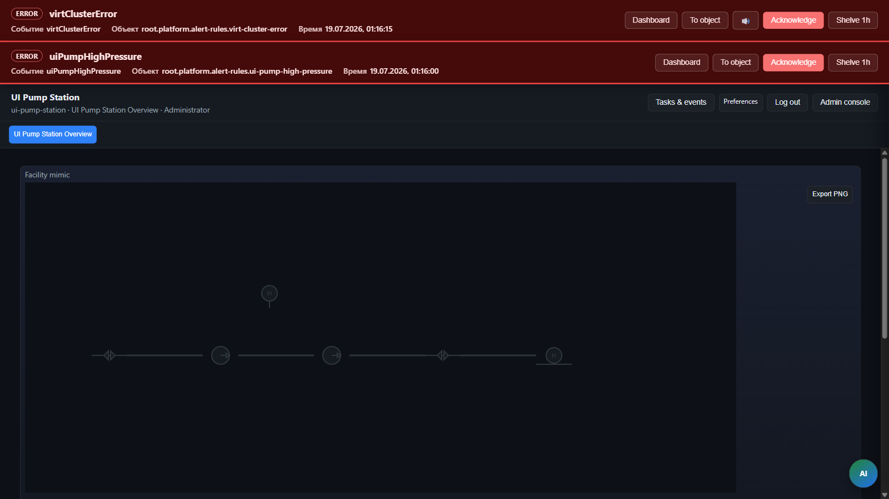

> **Язык:** русская версия (вычитка). Канонический английский: [en/lab-training.md](../en/lab-training.md).

# Лабораторное обучение — 18 упражнений

> **Статус:** Lab — Учебные packs. Теги: [doc-status](../en/doc-status.md).

Пакет **Лабораторное обучение** обеспечивает виртуальное устройство в стиле Ignition, автоматизацию, отчёты и дашборды ISPF. Все объекты импортируются из `examples/lab-training/bundle.json`.

## Быстрый старт



1. Запустите сервер и веб-консоль (профиль `local`).
2. Импортируйте пакет в **Приложение** `lab-training` (`packageId` = `appId`):

```http
POST /api/v1/platform/packages/import?packageId=lab-training
Content-Type: application/json

<содержимое examples/lab-training/bundle.json>
```

Эквивалентный устаревший API:

```http
POST /api/v1/applications/lab-training/deploy
Content-Type: application/json

<тот же bundle.json>
```

Привозная платформа:

| Шаг | Результат |
|-----|-----------|
| Регистрация | запись в реестре приложений (`applications`) |
| Application в дереве | `root.platform.applications.lab-training` (модель `application-v1`) |
| Data source | `root.platform.data-sources.lab-training` |
| Operator HMI | `root.platform.operator-apps.lab-training` (из секции `operatorUi` bundle) |
| Содержимое комплект | дашборды, отчёты, алерты, корреляторы → каталоги `root.platform.*` |

Опционально можно **сначала** зарегистрировать пустое приложение:

```http
POST /api/v1/applications
Content-Type: application/json

{
  "appId": "lab-training",
  "displayName": "Lab Training",
  "schemaName": "app_lab_training"
}
```

Затем импорт с тем же `packageId` применит bundle к уже существующему Application.

3. Откройте оператор-приложение: `?mode=operator&app=lab-training`
4. Учётные записи (создаются при старте сервера):

| Пользователь | Пароль | Роль |
|--------------|--------|------|
| `lab-user-a` | `lab-user-a` | operator |
| `lab-user-b` | `lab-user-b` | operator |

Устройства определения bootstrap-ом: `root.platform.devices.lab-userA-01`, `root.platform.devices.lab-userB-01` (модель `virtual-lab-v1`, профиль драйвера `lab`).

---

## Объекты дерева

| Задание | Объект / дашборд |
|---------|------------------|
| — | Application `root.platform.applications.lab-training`, operator app `root.platform.operator-apps.lab-training` |
| 1 | Пользователи + ACL на `lab-userB-01` |
| 2–4 | Alert rules + correlators под `root.platform.alert-rules.*`, `root.platform.correlators.*` |
| 5–18 | Дашборды `root.platform.dashboards.lab-*` |
| 11 | Отчёт `root.platform.reports.lab-all-devices-table` |

---

## Задания

### 1. Два пользователя и доступ к пользователю A к устройству userB

**Цель:** многопользовательская совместная работа с использованием ACL для каждого объекта.

**Реализация:**
- Пользователи `lab-user-a`, `lab-user-b` — `LabSecurityBootstrap`
- ACL на `root.platform.devices.lab-userB-01`: owner `lab-user-b`, editor `lab-user-a`
- ACL на `root.platform.devices.lab-userA-01`: owner `lab-user-a`, editor `lab-user-b`

**Проверка:** войдите как `lab-user-a`, вход Редактор переменных (`lab-variable-editor`) — редактирование доступности на устройстве B доступно.

---

### 2. Тревога: Event1 → ON, Event2 (Int>20) → OFF

**Цель:** latch через correlator + переменную `alarmLatched`.

**Объекты:**
- Correlator `root.platform.correlators.lab-event1-latch-on` → `SET_VARIABLE alarmLatched=true` на event1
- Correlator `root.platform.correlators.lab-event2-unlatch` → `SET_VARIABLE alarmLatched=false` с `payloadFilterExpr: payload["int"] > 20`

**Проверка:** приборная панель `lab-event-gen` или `lab-fan-composite` (индикатор «Тревога фиксируется»). Вызовите `fireEvent1`, затем `fireEvent2` с int=25.

---

### 3. Тревога через 10 с после sum(Int+Float) ∈ [50, 100]

**Цель:** правило оповещения с задержкой и поддержкой.

**Объект:** `root.platform.alert-rules.lab-sum-range-sustained-alert`
- `watchVariable`: `sumIntFloat`
- `conditionExpr`: `self.sumIntFloat["value"] >= 50 && self.sumIntFloat["value"] <= 100`
- `delaySeconds`: 10, `sustainWhileTrue`: true

**Проверка:** в редакторе переменных задайте `intValue`+`floatValue` так, чтобы наконец было 75, подождите 10 с — событие `labSumRangeAlarm`.

---

### 4. Тревога: sum(table.Int) > 100 + корректирующий отчет

**Цель:** alert + correlator `OPEN_OPERATOR_REPORT`.

**Объекты:**
- Alert `root.platform.alert-rules.lab-table-sum-threshold` на `tableIntSum`
- Correlator `root.platform.correlators.lab-open-corrective-report` → отчёт `root.platform.reports.lab-table-corrective`

**Проверка:** добавьте строки в `table` через Form grid, пока `tableIntSum` > 100.

---

### 5. Фильтр Event2: Int>10 ИЛИ строка содержит "abc"

**Цель:** `payloadFilterExpr` в виджете `event-feed`.

**Дашборд:** `root.platform.dashboards.lab-event-gen` — нижний feed «Event 2 log (filtered)» с выражением `int > 10 || string contains abc`.

**Проверка:** события с int≤10 и без «abc» в строке, не указанной во втором канале.

---

### 6. Макет сетки формы

**Дашборд:** `root.platform.dashboards.lab-form-grid`

**Документация:** пример макета в [dashboards](dashboards.md).

---

### 7. Функция калькулятора → вычислить()

**Модель:** функция `calculate(inputA, inputB)` на `virtual-lab-v1`.

**Проверка:** вызов через API или дашборд Калькулятор (задание 9).

---

### 8. Mixin-модель: сумма Синус + Пила

**Модель:** `virtual-lab-waves-sum-v1` (MIXIN) с binding `sumWaves = sineWave + sawtoothWave`.

**Проверка:** дашборд `lab-virtual-overview` — виджет Sum waves.

---

### 9. Виджет сетки калькулятора

**Дашборд:** `root.platform.dashboards.lab-calculator` — виджет `spreadsheet` в режиме **настроено** (шаблон с подписями и формулами в макете).

**Что попробовать (оператор):**

1. Откройте дашборд **Калькулятор** в приложении «Оператор лаборатории».
2. В ячейках **A2** и **B2** измените числа (Tab — переход между полями).
3. Убедитесь, что **C2** (Сумма) и **D2** (A×110%) пересчитаны.
4. Обновите страницу (**F5**) — значения A2/B2 должны сохраниться (сохранение в переменную `sheetValues` на `lab-userA-01`).

**Режим бесплатный (новые виджеты по умолчанию):** любая ячейка — значение или `=формула`; строковая формула, F2, Ctrl+Z, экспорт CSV. Подробнее: [spreadsheet-widget](spreadsheet-widget.md).

**Проверка:** изменить A2 → пересчёт Sum и A×110%; F5 → значения в `sheetValues`.

---

### 10. Запрос всех функций + редактирование

**Дашборд:** `root.platform.dashboards.lab-variable-editor` — виджеты `variable-editor` для обоих lab devices.

---

### 11. Отчёт tree-variables: таблица всех виртуальных устройств

**Отчёт:** `root.platform.reports.lab-all-devices-table` (тип `tree-variables`, pattern `root.platform.devices.lab-*`, variable `table`).

**Проверка:** `POST /api/v1/reports/by-path/run?path=root.platform.reports.lab-all-devices-table`

---

### 12. Посекундный график Синус + Пила

**Дашборд:** `root.platform.dashboards.lab-charts` — `refreshIntervalMs: 1000`, charts с `historyRange: live`.

**Driver:** profile `lab`, `pollIntervalMs` в конфиге runtime.

---

### 13. Круговая диаграмма по таблице

**Дашборд:** `root.platform.dashboards.lab-pie` — виджет `pie-chart`, source `table`, поля `string` / `int`.

---

### 14. Форма генерации событий + двойной лог

**Дашборд:** `root.platform.dashboards.lab-event-gen` — две формы `fireEvent1`/`fireEvent2`, два `event-feed` с фильтром по имени событий.

---

### 15. Кнопка открытия другого виджета (модально)

**Дашборд:** `root.platform.dashboards.lab-modal` — `dashboard-link` с `openMode: modal` → `lab-charts`.

---

### 16. История sine 5 мин:таблица + среднее

**Дашборд:** `root.platform.dashboards.lab-history` — виджет `history-table` на `sineWave`.

---

### 17. Кнопка SVG + вентилятор (композитный)

**Дашборд:** `root.platform.dashboards.lab-fan-composite` — `composite-widget` с `svg-widget` (`/lab-assets/button.svg` toggle `fanRunning`, `/lab-assets/fan.svg`).

---

### 18. Виртуальные устройства дашборды

**Дашборд:** `root.platform.dashboards.lab-virtual-overview` — chart/value, event-feed, report table.

---

## Устройство виртуальной лаборатории

| Переменная | Тип | Описание |
|----------|-----|----------|
| `sineWave` | DOUBLE | `amplitude * sin(2π t / periodSec)` |
| `sawtoothWave` | DOUBLE | пилообразный сигнал |
| `intValue`, `floatValue` | INTEGER / DOUBLE | конфиг / ручная запись |
| `table` | RECORD_LIST | rows `{int, string}` |
| `sumWaves`, `sumIntFloat`, `tableIntSum` | bindings | вычисляемые |
| `alarmLatched`, `fanRunning` | BOOLEAN | для automation / HMI |

**Events:** `event1`, `event2` (payload `{int, string}`).

**Functions:** `calculate`, `fireEvent1`, `fireEvent2`, `appendTableRow`.

---

## Тесты

| Тест | Назначение |
|------|------------|
| `VirtualLabProfileTest` | driver profile `lab` |
| `LabAutomationTest` | delay alert, correlator payload, SET_VARIABLE |
| `TreeVariablesReportTest` | report type `tree-variables` |
| `LabTrainingBundleTest` | import bundle + key paths |
| `LabSecurityBootstrapTest` | users + ACL |
| `payloadFilter.test.ts` | event-feed OR/AND filter |

Запуск: `./gradlew test` (server), `npm test` в `apps/web-console`.

---

## Связанные документы

- [dashboards](dashboards.md) — виджеты и Grid Layout
- [automation](automation.md) — правила оповещений и корреляторы
- [reports](reports.md) — отчёты по дереву
- [security](security.md) — API ACL
