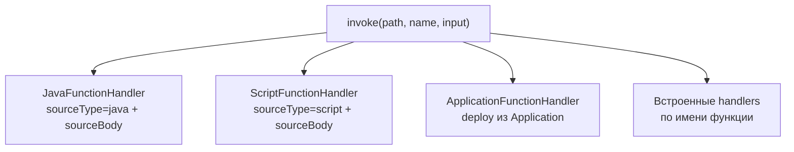

> **Язык:** русская версия (вычитка). Канонический английский: [en/object-functions.md](../en/object-functions.md).

# функции на объектах

Функция — **названный вызываемый** на узле деревьев объектов. Адресация всегда парой:

- **путь объекта** — абсолютный, например `root.platform.devices.test`
- **имя функции** — локальное на объекте, например `calculate`

Глобального пути вида `root/.../myFn` нет.

См. также: [object-model](object-model.md), [applications](applications.md) (развертывание функций приложений), [workflows](workflows.md) (BPMN `invoke_function`).

## Дескриптор `FunctionDescriptor`

| Поле | Назначение |
|------|------------|
| `name` | Идентификатор функции на объекте |
| `description` | Подпись в UI |
| `inputSchema` / `outputSchema` | `DataSchema` для invoke |
| `sourceType` | `null` (встроенный handler), `pulse`, `script`, `java` |
| `sourceBody` | JSON steps (script) или Java-исходник |
| `dataSourcePath` | Опционально: data source приложения для SQL-шагов script |
| `version` | Произвольная строка версии |

Сохранение:

```http
PUT /api/v1/objects/by-path/functions?path=root.platform.devices.test
Content-Type: application/json

{
  "name": "myFn",
  "description": "Example",
  "inputSchema": { "name": "myFnInput", "fields": [] },
  "outputSchema": {
    "name": "myFnOutput",
    "fields": [{ "name": "ok", "type": "BOOLEAN", "nullable": false }]
  },
  "sourceType": "java",
  "sourceBody": "..."
}
```

Вызов:

```http
POST /api/v1/objects/by-path/functions/invoke?path=root.platform.devices.test&name=myFn
Content-Type: application/json

{
  "schema": { "name": "myFnInput", "fields": [{ "name": "value", "type": "STRING" }] },
  "rows": [{ "value": "hello" }]
}
```

Пустой ввод (схема без полей) — тело запроса можно не отправлять.

## Как вы осуществляете реализацию



Порядок: **java** → **script** → **развертывание приложения** → **встроенные** (`AcknowledgeAlarm`, `VirtualLab`, `PulseVariable`, `MqttGateway`, …).

Если дескриптор есть, но ни один handler не подошёл → `No handler registered for function: …`.

---

## 1. Встроенные platform handlers (`sourceType` пустой)

Режим «**встроенный обработчик сервера (по имени)**» в пользовательском интерфейсе. На объекте должен быть **дескриптор с таким именем**, а в коде сервера — зарегистрированный `FunctionHandler`.

`sourceBody` не нужен. Произвольное имя вроде `test` **не срабатывает**, пока для него нет обработчика на платформе.

### 1.1 `acknowledgeAlarm` — сброс аларма

Объект: датчик с переменными `alarmActive`, `alarmAcknowledged` (fixture `demo-sensor-01`).

```json
{
  "name": "acknowledgeAlarm",
  "description": "Acknowledge active alarm",
  "inputSchema": { "name": "voidInput", "fields": [] },
  "outputSchema": {
    "name": "functionResult",
    "fields": [
      { "name": "success", "type": "BOOLEAN" },
      { "name": "message", "type": "STRING" }
    ]
  },
  "sourceType": null,
  "sourceBody": null
}
```

```http
POST /api/v1/objects/by-path/functions/invoke?path=root.platform.devices.demo-sensor-01&name=acknowledgeAlarm
```

Результат: `alarmAcknowledged.value = true`, output `{ "success": true, "message": "Alarm acknowledged" }`.

Привязка к тому же объекту:

```
call(@/fn/acknowledgeAlarm)
```

### 1.2 Pulse commands (`sourceType: "pulse"`)

Универсальный SCADA-паттерн «импульс команды»: запись `true` в bool-переменную (`cmdStart`, `cmdStop`, …).

```json
{
  "name": "gpu_start",
  "description": "Start GPU",
  "sourceType": "pulse",
  "sourceBody": "{\"variable\":\"cmdStart\"}",
  "inputSchema": { "name": "voidInput", "fields": [] },
  "outputSchema": {
    "name": "functionResult",
    "fields": [
      { "name": "success", "type": "BOOLEAN" },
      { "name": "message", "type": "STRING" }
    ]
  }
}
```

Опционально: `"objectPath"` в `sourceBody` для записи на другой объект; `"value": false` для сброса.

Справочное приложение mini-TEC использует `pulse` для запуска/остановки; сложная логика — `script` + `writeVariable` ([`MiniTecFunctionScripts.java`](../../packages/ispf-server/src/main/java/com/ispf/server/application/reference/minitec/MiniTecFunctionScripts.java)).

### 1.3 Virtual Lab — `calculate`, `fireEvent1`, `fireEvent2`, `appendTableRow`

Для объектов virtual-lab (модель с переменными `inputA`, `inputB`, `table`, событиями `event1`, `event2`).

**`calculate`** — сложение двух чисел:

```json
{
  "name": "calculate",
  "inputSchema": {
    "name": "calculateInput",
    "fields": [
      { "name": "inputA", "type": "DOUBLE" },
      { "name": "inputB", "type": "DOUBLE" }
    ]
  },
  "outputSchema": {
    "name": "calculateOutput",
    "fields": [{ "name": "result", "type": "DOUBLE" }]
  }
}
```

```json
POST .../invoke?path=<virtual-lab-object>&name=calculate
{ "schema": {...}, "rows": [{ "inputA": 10, "inputB": 3.5 }] }
→ { "rows": [{ "result": 13.5 }] }
```

**`fireEvent1` / `fireEvent2`** — публикация события с payload `{ int, string }`:

```json
{ "rows": [{ "int": 42, "string": "hello" }] }
```

**`appendTableRow`** — добавить строку в `table` (RECORD_LIST):

```json
{ "rows": [{ "int": 1, "string": "row-a" }] }
```

### 1.3 Мини-ТЭК — операторские команды

Только объекты под `root.platform.mini-tec-plant.*`.

| Имя | Объект | Ввод | Действие |
|-----|--------|-------|----------|
| `gpu_start` | GPU | пустой | импульс `cmdStart` |
| `gpu_stop` | GPU | пустой | импульс `cmdStop` |
| `gpu_sync` | GPU | пустой | импульс `cmdSync` |
| `dgu_start` | DGU | пустой | импульс `cmdStart` |
| `dgu_stop` | DGU | пустой | импульс `cmdStop` |
| `breaker_operate` | RUMB | `{ "action": "close" \| "open" }` | выключатель |
| `grpb_valve_control` | GRPB | `{ "action": "open" \| "close" \| "trip" }` | клапан |
| `grpb_pzk_reset` | GRPB | пустой | сброс PZK |
| `load_module_set_load` | Load module | `{ "loadPct": 75, "millMode": true }` | уставка нагрузки |
| `acknowledge_alarm` | Station hub | пустой | сброс `alarmLatched` |

Пример `breaker_operate`:

```http
POST .../invoke?path=root.platform.mini-tec-plant.rumb-10kv&name=breaker_operate

{
  "schema": {
    "name": "actionInput",
    "fields": [{ "name": "action", "type": "STRING" }]
  },
  "rows": [{ "action": "close" }]
}
```

### 1.4 `dispatchTelemetry` — MQTT gateway

Объект шлюза (модель `mqtt-gateway-v1`). Маршрутизирует ingress MQTT на дочерний датчик.

```json
{
  "name": "dispatchTelemetry",
  "inputSchema": {
    "name": "mqttIngress",
    "fields": [
      { "name": "topic", "type": "STRING" },
      { "name": "raw", "type": "STRING" }
    ]
  },
  "outputSchema": {
    "name": "dispatchTelemetryResult",
    "fields": [
      { "name": "ok", "type": "BOOLEAN" },
      { "name": "message", "type": "STRING" },
      { "name": "routedPath", "type": "STRING" }
    ]
  }
}
```

```json
{
  "rows": [{
    "topic": "ispf/loadtest/7/temperature",
    "raw": "23.5"
  }]
}
```

Часто вызывается из binding: `call(@/fn/dispatchTelemetry, @/lastIngress)`.

---

## 2. Script-функции (`sourceType: "script"`)

Тело — JSON с массивом `steps`. Тот же движок, что у [applications](applications.md), но сохраняется на объект через Inspector / `PUT .../functions`.

Переменные скрипта: `input` (поля вызова), плюс `var` из шагов. Подстановки: `"${input.orderId}"`, `"$row.count"`, `"${item.name}"` в `map`.

Скрипт **обязан** завершиться шагом `return` (или ранним `return` из ветки `when`/`if`).

### 2.1 Минимальное эхо

```json
{
  "name": "echo",
  "sourceType": "script",
  "sourceBody": "{\"steps\":[{\"type\":\"return\",\"fields\":{\"message\":\"${input.text}\",\"ok\":true}}]}",
  "inputSchema": {
    "name": "echoIn",
    "fields": [{ "name": "text", "type": "STRING" }]
  },
  "outputSchema": {
    "name": "echoOut",
    "fields": [
      { "name": "message", "type": "STRING" },
      { "name": "ok", "type": "BOOLEAN" }
    ]
  }
}
```

### 2.2 `setVar` и `buildRecord`

```json
{
  "steps": [
    { "type": "setVar", "var": "greeting", "value": "Hello" },
    { "type": "setVar", "var": "full", "expression": "greeting + ', ' + ${input.name}" },
    {
      "type": "buildRecord",
      "var": "row",
      "fields": { "message": "${full}", "ok": true }
    },
    { "type": "return", "fields": { "message": "${row.message}", "ok": "${row.ok}" } }
  ]
}
```

### 2.3 `when` / `if` — ветвление

```json
{
  "steps": [
    {
      "type": "when",
      "var": "input.value",
      "gt": 100,
      "then": [
        { "type": "return", "fields": { "level": "HIGH", "ok": true } }
      ],
      "else": [
        { "type": "return", "fields": { "level": "NORMAL", "ok": true } }
      ]
    }
  ]
}
```

Условия: `notNull`, `equals`, `notEquals`, `gt`, `lt`, `gte`, `lte`, или truthy `var`.

### 2.4 `readVariable` — чтение переменной другого объекта

```json
{
  "steps": [
    {
      "type": "readVariable",
      "objectPath": "root.platform.devices.demo-sensor-01",
      "variable": "temperature",
      "field": "value",
      "var": "temp"
    },
    {
      "type": "return",
      "fields": { "temperature": "${temp}", "ok": true }
    }
  ]
}
```

`objectPath: "self"` — объект, на котором объявлена функция.

### 2.5 `writeVariable` — запись переменной объекта

```json
{
  "steps": [
    {
      "type": "writeVariable",
      "objectPath": "self",
      "variable": "cmdStart",
      "fields": { "value": true }
    },
    {
      "type": "return",
      "fields": { "success": true, "message": "Command sent" }
    }
  ]
}
```

Для типовых SCADA-команд без скрипта см. **`sourceType: "pulse"`** (§1.2).

### 2.6 `invoke_function` — вложенный вызов

```json
{
  "steps": [
    {
      "type": "invoke_function",
      "objectPath": "root.platform.devices.demo-sensor-01",
      "functionName": "acknowledgeAlarm",
      "var": "ack"
    },
    {
      "type": "return",
      "fields": {
        "success": "${ack.success}",
        "message": "${ack.message}"
      }
    }
  ]
}
```

Если вложенная функция активируется `error_code` ≠ `OK`, скрипт прерывается и выдает эту ошибку.

### 2.6 SQL-шаги (`selectOne`, `selectMany`, `exec`)

Требуется `dataSourcePath` на дескрипторе (путь источник данных приложения) **или** каталог платформы по умолчанию.

```json
{
  "name": "loadOrder",
  "dataSourcePath": "root.platform.data-sources.app_myapp",
  "sourceType": "script",
  "sourceBody": "{\n  \"steps\": [\n    {\n      \"type\": \"selectOne\",\n      \"var\": \"order\",\n      \"sql\": \"SELECT id, status FROM orders WHERE id = ?\",\n      \"params\": [\"${input.orderId}\"]\n    },\n    { \"type\": \"failIfNull\", \"var\": \"order\", \"error_code\": \"NOT_FOUND\", \"error_message\": \"Order missing\" },\n    { \"type\": \"return\", \"fields\": { \"status\": \"${order.status}\", \"error_code\": \"OK\", \"error_message\": \"\" } }\n  ]\n}"
}
```

### 2.7 `map` — преобразование списка

```json
{
  "steps": [
    {
      "type": "selectMany",
      "var": "rows",
      "sql": "SELECT name, value FROM metrics WHERE device_id = ?",
      "params": ["${input.deviceId}"]
    },
    {
      "type": "map",
      "var": "items",
      "source": "${rows}",
      "fields": {
        "label": "${item.name}",
        "value": "${item.value}"
      }
    },
    {
      "type": "return",
      "fields": { "items": "${items}", "count": "${items.size()}" }
    }
  ]
}
```

### 2.8 `jsonParse`

```json
{
  "type": "jsonParse",
  "var": "parsed",
  "source": "${input.payloadJson}",
  "fields": ["temperature", "humidity"]
}
```

### 2.9 `setDriverTelemetry`

Запись телеметрии драйвера (как от устройства):

```json
{
  "type": "setDriverTelemetry",
  "objectPath": "${input.devicePath}",
  "variable": "temperature",
  "fields": { "value": "${input.value}", "unit": "C" }
}
```

### 2.10 `instantiateModelIfMissing`

```json
{
  "type": "instantiateModelIfMissing",
  "var": "instancePath",
  "modelName": "mqtt-sensor-v1",
  "parentPath": "root.platform.devices",
  "instanceName": "sensor-${input.index}"
}
```

### 2.11 `cancel_workflows`

```json
{
  "type": "cancel_workflows",
  "workflowPath": "root.platform.workflows.demo-alarm-handler",
  "statusIn": ["RUNNING", "WAITING"],
  "reason": "superseded",
  "var": "cancelled"
}
```

### 2.12 Ошибки: `failIfNull`, `failIfNotEquals`

Стандартный провод для ошибок в схеме вывода:

```json
{
  "fields": [
    { "name": "error_code", "type": "STRING" },
    { "name": "error_message", "type": "STRING" }
  ]
}
```

```json
{ "type": "failIfNull", "var": "order", "error_code": "NOT_FOUND", "error_message": "No order" }
{ "type": "failIfNotEquals", "var": "order.status", "equals": "OPEN", "error_code": "BAD_STATE" }
```

### 2.13 Полная таблица шагов

| `type` | Назначение |
|--------|------------|
| `return` | Финальный output (`fields`) |
| `setVar` | `var` ← литерал, `${path}` или `expression` (`+`, `==`, …) |
| `buildRecord` | Собрать `Map` в `var` |
| `when`, `if` | Ветвление `then` / `else` |
| `map` | Список → список с `item` в scope |
| `readVariable` | Прочитать поле переменной объекта |
| `writeVariable` | Записать поля переменной объекта (`fields`) |
| `invoke_function` | Вызов другой функции |
| `selectOne` / `selectMany` / `exec` | SQL |
| `jsonParse` | Разбор JSON-строки |
| `setDriverTelemetry` | Запись driver-переменной |
| `instantiateModelIfMissing` | Создать объект из модели |
| `cancel_workflows` | Отмена workflow instances |
| `failIfNull` / `failIfNotEquals` | Контролируемый выход с ошибкой |

---

## 3. Java-функции (`sourceType: "java"`)

`sourceBody` — один общественный класс, реализующий `com.ispf.core.function.ObjectJavaFunction`. **Компиляция при сохранении**; ошибка компиляции → `400`, объект не обновляется.

По умолчанию выключены во всех профилях (`ispf.function.java.enabled=false`): пользовательский код выполняется в процессе сервера, поэтому включайте через `ISPF_FUNCTION_JAVA_ENABLED=true` только на доверенных узлах — denylist ниже не является изоляцией процесса (ADR-0045).

Контекст: `JavaFunctionContext(objectPath, functionName)` — путь вызывающего объекта и имя функции.

Ограничения (`JavaFunctionSecurity`): запрещены `Runtime`, `ProcessBuilder`, `System.exit`, отражение, `java.net.*` (кроме `InetAddress`), `java.io.File`, `java.nio.file`, Пружинные пакеты и др.

### 3.1 Минимальный ОК

```java
import com.ispf.core.function.ObjectJavaFunction;
import com.ispf.core.function.JavaFunctionContext;
import com.ispf.core.model.DataRecord;
import com.ispf.core.model.DataSchema;
import com.ispf.core.model.FieldType;
import java.util.Map;

public class TestFunction implements ObjectJavaFunction {
    @Override
    public DataRecord invoke(DataRecord input, JavaFunctionContext context) {
        DataSchema out = DataSchema.builder("testOutput")
                .field("ok", FieldType.BOOLEAN)
                .build();
        return DataRecord.single(out, Map.of("ok", true));
    }
}
```

### 3.2 Эхо-вход

```java
public class EchoInputFn implements ObjectJavaFunction {
    @Override
    public DataRecord invoke(DataRecord input, JavaFunctionContext context) {
        Object value = input != null && input.rowCount() > 0
                ? input.firstRow().get("value")
                : null;
        DataSchema schema = DataSchema.builder("out")
                .field("value", FieldType.STRING)
                .build();
        return DataRecord.single(schema, Map.of(
                "value", value == null ? "" : String.valueOf(value)
        ));
    }
}
```

Input schema: поле `value` типа `STRING`.

### 3.3 Арифметика при вводе

```java
public class SumFn implements ObjectJavaFunction {
    @Override
    public DataRecord invoke(DataRecord input, JavaFunctionContext context) {
        double a = number(input, "inputA");
        double b = number(input, "inputB");
        DataSchema schema = DataSchema.builder("sumOut")
                .field("result", FieldType.DOUBLE)
                .build();
        return DataRecord.single(schema, Map.of("result", a + b));
    }

    private static double number(DataRecord input, String field) {
        if (input == null || input.rowCount() == 0) return 0;
        Object raw = input.firstRow().get(field);
        return raw instanceof Number n ? n.doubleValue() : Double.parseDouble(String.valueOf(raw));
    }
}
```

### 3.4 Условный результат + метаданные из контекста

```java
public class ThresholdFn implements ObjectJavaFunction {
    @Override
    public DataRecord invoke(DataRecord input, JavaFunctionContext context) {
        double value = number(input, "value");
        boolean alarm = value > 80;
        DataSchema schema = DataSchema.builder("thresholdOut")
                .field("alarm", FieldType.BOOLEAN)
                .field("objectPath", FieldType.STRING)
                .field("functionName", FieldType.STRING)
                .build();
        return DataRecord.single(schema, Map.of(
                "alarm", alarm,
                "objectPath", context.objectPath(),
                "functionName", context.functionName()
        ));
    }
    // number() — как в примере выше
}
```

### 3.5 Когда выбирают Java и Script

| | Ява | Скрипт |
|---|------|--------|
| Компиляция | При сохранении (JDK на расстоянии) | Нет |
| SQL/рабочий процесс/readVariable | Нет (только ввод/вывод) | Да |
| Сложная логика | Удобно | `when` + шаги |
| Чтение переменных дерева | Через input или script | `readVariable` |

Для доступа к переменным объекта без передачи всего во входе используйте **script** или `call(@/fn/...)` в binding.

---

## 4. Приложение функций (развертывание)

Отдельный канал: Функция деплоится из приложения (`POST /api/v1/applications/{appId}/functions/deploy`), дескриптор появляется на объекте дерева, вызов идёт через `ApplicationFunctionHandler`.

Сценарий-тело и шаги — то же самое, что в §2. Подробно: [APPLICATIONS.md § Развертывание функций](applications.md).

```http
POST /api/v1/applications/myapp/functions/deploy
```

Если на объекте уже есть `sourceType=script|java` с телом — обработчик приложения **не перехватывает** вызов.

---

## 5. Возможности вызова

### 5.1 ОТДЫХ

```http
POST /api/v1/objects/by-path/functions/invoke?path={objectPath}&name={functionName}
```

Требуется право вызова на объект (RBAC).

### 5.2 Привязки

На **текущем** объекте:

```
call(@/fn/myFn)
call(@/fn/myFn, @/sourceVar)
read(@/payload/fieldName)
```

С **другого** объекта:

```
call(root.platform.devices.test/fn/myFn)
call(root.platform.devices.test/fn/myFn, @/payloadVar)
read(root.platform.devices.test/temperature)
```

### 5.3 Задача службы рабочего процесса

```xml
<serviceTask ispf:action="invoke_function"
             ispf:objectPath="root.platform.devices.test"
             ispf:functionName="myFn"
             ispf:inputMap="value=${workflow.lastValue}"
             ispf:outputMap="result=ok"/>
```

### 5.4 BPMN (приложение)

```xml
<ispf:serviceTask action="invoke_function"
                  objectPath="root.platform.devices.test"
                  functionName="myapp_ping"
                  inputMap="orderId=${workflow.orderId}"/>
```

### 5.5 Панель управления

| Виджет | Поля |
|--------|------|
| `function` | `objectPath`, `functionName`, `inputJson` |
| `function-form` | `functionName`, `fieldsJson` → собирает input |
| `svg-widget` | `clickAction=function`, `functionName` |

### 5.6 Расписание приложений

```json
{
  "actionType": "invoke_function",
  "action": {
    "objectPath": "root.platform.devices.test",
    "functionName": "myFn"
  }
}
```

### 5.7 Инструмент AI Agent

`invokeFunction` с `objectPath` + `functionName` (+ optional input).

---

## 6. Типичные ошибки

| Симптом | Причина |
|---------|---------|
| `No handler registered` | Пустой `sourceType` и имя не из встроенных handlers |
| `Unknown function` | Нет дескриптора на объекте |
| `Java compilation failed package com.ispf.core…` | Старая версия сервера без fix classpath (нужен jar с `JavaFunctionCompileClasspath`) |
| Сохранить Java без ошибок, но вызвать не работает | Не тот `sourceType` в пользовательском интерфейсе (выбран «встроенный обработчик» вместо Java) |
| Script `must end with return step` | Нет финального `return` |
| `Script function call depth exceeded` | > 8 вложенных `invoke_function` |

---

## 7. Расширение платформы (разработчикам)

Новый встроенный обработчик:

1. `implements FunctionHandler` в `ispf-server`
2. `@Component`, логика в `supports(path, name)` + `invoke(...)`
3. Добавить `FunctionDescriptor` на объекты (модель/бутстрап)

Пользовательские функции без релиза сервера: **script** или **java** на объекте, либо **развертывание приложения**.
