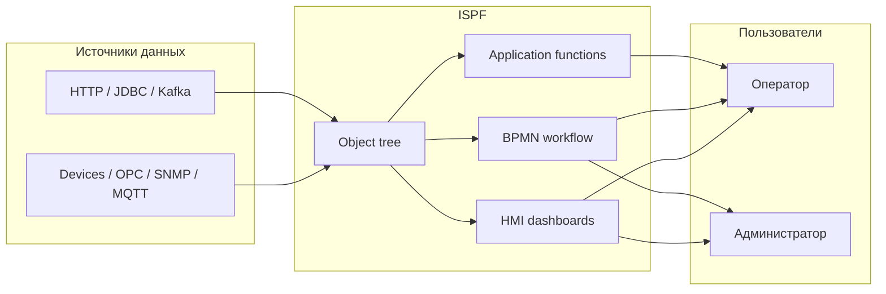
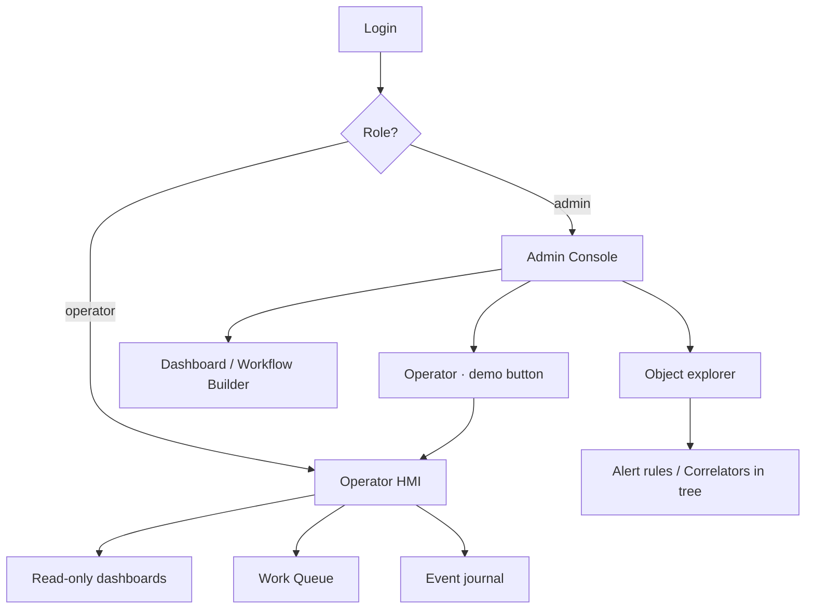

> **Язык:** русская версия (вычитка). Канонический английский: [en/product.md](../en/product.md).

# ISPF — продуктовая документация

> **Статус:** Stable — Возможности, сценарии, карта документации. Теги: [doc-status](../en/doc-status.md).

**IoT Solutions Platform Framework (ISPF)** — middleware для IoT, SCADA и промышленной автоматизации. Единая модель данных, HMI, автоматизация и прикладной слой без отраслевого Java в ядре.

Этот документ — **точка входа для всех ролей**. Детали реализации — в других разделах [docs/ru/readme.md](readme.md) (канон: [docs/en/readme.md](../en/readme.md)).

---

## Для кого продукт

| Роль | Задачи | С чего начать |
|------|--------|---------------|
| **Оператор** | Мониторинг, управление, work queue, отчёты | [Руководство оператора](operator-guide.md) |
| **Администратор** | Дерево объектов, дашборды, workflow, пользователи | [Быстрый старт](getting-started.md) → [Web Console](web-console.md) |
| **Разработчик решений** | Deploy приложений, функции, operator UI, отчёты | [Разработчик решений](solution-developer-guide.md) |
| **Разработчик платформы** | Драйверы, REQ-PF, расширения ядра | [Roadmap](roadmap.md) |
| **DevOps / SRE** | Развёртывание, профили, инфраструктура | [Развёртывание](deployment.md) |

---

## Что решает ISPF

Типичный стек SCADA/MES растёт отдельными модулями: OPC-сервер, historian, HMI, workflow, отчёты. ISPF объединяет их вокруг **одного object tree** с единым API и UI.



### Главный принцип

**Бизнес-логика живёт на платформе** — в моделях, переменных, событиях, функциях и workflow **дерева объектов**. Платформа даёт generic-движки (CEL, bindings, BPMN, script runtime, драйверы); решение конфигурирует их декларативно. Bundle deploy — это упаковка конфигурации, а не отдельный runtime. Кратко: [application-principles](application-principles.md). Детали: [architecture](architecture.md). Бэклог: [roadmap](roadmap.md).

### Ключевые возможности

- **Единая модель** — устройство, дашборд, workflow и правило тревоги — узлы дерева; логика через variables, events, functions и BPMN.
- **Bundles, а не форки ядра** — отраслевые решения деплоятся как конфигурация в механизмы платформы ([applications](applications.md)).
- **Стек** — Spring Boot 4, Java 25, PostgreSQL/TimescaleDB, React 19, REST + WebSocket; опционально NATS/MQTT/Keycloak.
- **~60 driver packs** (не внутри `ispf-server.jar`; maturity разный — см. [drivers](drivers.md)).
- **Платформа AGPL v3** — опционально Enterprise dual-license; driver packs и application bundles могут иметь отдельные условия ([license](license.md), [plugins](plugins.md)).

---

## Возможности продукта

### 1. Object tree

Центральная абстракция. У каждого узла есть путь (`root.platform.devices.pump-01`), тип, переменные, события и функции.

| Тип узла | Назначение |
|----------|------------|
| `PLATFORM`, `DEVICES`, `DASHBOARDS`, … | Системные каталоги (`root.platform.*`) |
| `DEVICE` | Физическое или виртуальное устройство с драйвером |
| `DASHBOARD` | HMI-экран (layout JSON + виджеты) |
| `WORKFLOW` | BPMN-процесс автоматизации |
| `ALERT` / `CORRELATOR` | Правила автоматизации (узлы дерева) |
| `MODEL` | Шаблон (blueprint) для создания объектов |
| `APPLICATION` | Зарегистрированное deploy-приложение |
| `USER` / `ROLE` | Пользователи и роли (зеркало security API) |
| `CUSTOM` | Произвольный контейнер (fallback) |

Подробнее: [object-model](object-model.md), [glossary](glossary.md).

### 2. Модели (шаблоны)

`BlueprintDefinition` описывает набор переменных, событий, функций и CEL-привязок. RELATIVE mixin’ы auto-apply только при непустом *Applicability condition* (CEL). Демо-модель `mqtt-sensor-v1` — fixture через `templateId`.

Подробнее: [blueprints](blueprints.md), [0018-fixture-models-and-cel-applicability](decisions/0018-fixture-models-and-cel-applicability.md).

### 3. Драйверы устройств

SPI `DeviceDriver` связывает протоколы с переменными объектов. Администратор задаёт `driverId`, конфигурацию и point mapping; runtime опрашивает устройство и пишет значения в дерево.

Демо после первого старта:

| Объект | Драйвер | Назначение |
|--------|---------|------------|
| `demo-sensor-01` | virtual | Синусоида температуры + alarm binding |
| `snmp-localhost` | snmp | SNMP-агент localhost |

Подробнее: [drivers](drivers.md).

### 4. Дашборды и HMI

Dashboard Builder (admin) и Operator HMI (read-only) используют одни и те же виджеты:

| Категория | Виджеты |
|-----------|---------|
| Values | `value`, `indicator`, `sparkline`, `chart`, `gauge` |
| Tables | `object-table`, `card-grid`, `work-queue` |
| Navigation | `dashboard-link` (переключение экранов) |
| SCADA | `scada-mimic` (P&ID / однолинейные мнемосхемы) |
| Other | `text`, `iframe`, `image`, `event-log`, `function-button` |

Привязка данных: `objectPath` (статика) или `selectionKey` (выбор строки таблицы). Сетка layout — **84×8** ([dashboards](dashboards.md)).

Подробнее: [dashboards](dashboards.md), [scada](scada.md), справочник виджетов: [widgets](widgets.md).

### 5. Workflow (BPMN)

Визуальный BPMN-редактор в Web Console. Service tasks (в т.ч. вызов application functions), user tasks (очередь оператора), gateway с CEL, параллельные ветки, signals и NATS.

Подробнее: [workflows](workflows.md).

### 6. Автоматизация

- **Events** — типизированные уведомления от объектов; журнал + WebSocket.
- **Alert rules** — CEL-условие на переменной → автоматический fire события. Узлы `ALERT` в `root.platform.alert-rules`.
- **Event correlators** — цепочка событий → старт workflow. Узлы `CORRELATOR` в `root.platform.correlators`.

Подробнее: [automation](automation.md).

### 7. Прикладные решения (Application Platform)

Слой REQ-PF позволяет деплоить отраслевые приложения **без изменения Java-ядра**:

| Этап | API |
|------|-----|
| Регистрация | `POST /api/v1/applications` |
| SQL-миграции | `POST /api/v1/applications/{id}/data/migrate` |
| Функции (JSON script) | `POST /api/v1/applications/{id}/functions/deploy` |
| Bundle deploy | `POST /api/v1/applications/{id}/deploy` |
| BFF для UI | `POST /api/v1/bff/invoke` |
| Schedules | `GET/POST /api/v1/schedules` |
| SQL-отчёты | `GET /api/v1/applications/{id}/reports/{name}` |

Подробнее: [applications](applications.md), [reports](reports.md).

### 8. Operator UI

Полноэкранный HMI для операторов:

```
http://localhost:5173?mode=operator&app=<appId>
```

Конфигурация хранится на сервере (`operator_app_ui`) и редактируется в admin console → `root.platform.operator-apps`. Приоритет загрузки:

1. `GET /api/v1/operator-apps/{appId}/ui`
2. `GET /api/v1/applications/{appId}/operator-ui` (из bundle)
3. Legacy fallback `public/operator-apps/{appId}.ui.json`

Подробнее: [operator-guide](operator-guide.md), [web-console](web-console.md).

### 9. Безопасность

Две роли: **admin** (полный доступ) и **operator** (просмотр, функции, work queue). Профиль `local` — Bearer token после логина; `dev`/prod — OAuth2 JWT через Keycloak.

Подробнее: [security](security.md).

---

## Режимы Web Console



| Режим | URL | Кто видит |
|-------|-----|-----------|
| Admin | `http://localhost:5173` | admin (по умолчанию) |
| Operator HMI | `?mode=operator` | operator; admin по ссылке |
| Operator app | `?mode=operator&app=platform` | конкретное приложение |
| Admin explicit | `?mode=admin` | admin даже при autostart |

---

## Типовые сценарии

### Сценарий 1: мониторинг сенсора

1. Администратор открывает `devices.demo-sensor-01` — temperature, threshold, alarm.
2. Дважды кликает `dashboards.demo-sensor` — правит HMI.
3. Оператор открывает `?mode=operator` — тот же дашборд без редактирования.
4. При превышении порога срабатывает alert rule → событие в журнале → опционально workflow.

### Сценарий 2: задача оператора

1. В BPMN есть **user task** «Confirm action».
2. Задача появляется в **Work Queue** в сайдбаре оператора.
3. Оператор делает **Claim** → действие → **Complete**.
4. Workflow продолжается (service task, gateway и т.д.).

### Сценарий 3: деплой отраслевого приложения

1. Разработчик регистрирует app (`POST /api/v1/applications`).
2. Деплоит SQL-миграции и JSON-функции.
3. Делает `POST …/deploy` с JSON-bundle (`operatorUi`, reports, dashboards).
4. Администратор создаёт operator app в дереве → настраивает дашборды.
5. Операторы работают через `?mode=operator&app=my-terminal`.

Пошагово: [solution-developer-guide](solution-developer-guide.md).

---

## Быстрый старт (≈5 минут)

```bash
# 1. API (H2 + local auth)
./gradlew :packages:ispf-server:bootRun --args="--spring.profiles.active=local"

# 2. Web Console
cd apps/web-console && npm install && npm run dev
```

| URL | Назначение |
|-----|------------|
| http://localhost:5173 | Admin console (логин: `admin` / `admin`) |
| http://localhost:5173?mode=operator | Operator HMI |
| http://localhost:8080/api/v1/info | Версия платформы |
| http://localhost:8080/actuator/health | Health check |

Полная инструкция: [getting-started](getting-started.md).

---

## Архитектура (кратко)

```
Web Console (React)  ←→  REST / WebSocket  ←→  ispf-server (Spring Boot)
                                                      │
                    ObjectManager │ WorkflowService │ DriverRuntime
                    ApplicationPlatform │ EventService │ AlertRules
                                                      │
                    PostgreSQL/H2 │ Flyway │ NATS* │ MQTT*
```

Подробнее: [architecture](architecture.md).

---

## API

Base URL: `http://localhost:8080/api/v1`

| Группа | Примеры |
|--------|---------|
| Objects | `GET /objects`, `PUT /objects/by-path/{path}/variables/{name}` |
| Dashboards | `GET /dashboards/by-path/{path}/layout` |
| Workflow | `POST /workflows/by-path/{path}/run` |
| Applications | `POST /applications/{id}/deploy` |
| Operator apps | `GET /operator-apps/{id}/ui` |
| Drivers | `POST /drivers/runtime/start?devicePath=...` |
| Events | `GET /events`, `POST /events/fire` |

Полный справочник: [api](api.md).

---

## Лицензия и границы

| Компонент | Лицензия |
|-----------|----------|
| Платформа ISPF (`main`) | GNU AGPL v3 (+ опционально Enterprise dual-license) |
| Driver packs / коммерческие плагины / app bundles | Отдельные условия — см. [license](license.md), [plugins](plugins.md) |

Подробнее: [license](license.md), [plugins](plugins.md).

---

## Карта документации

### Продуктовая документация

| Документ | Описание |
|----------|----------|
| **product.md** (этот файл) | Обзор продукта, возможности, сценарии |
| [operator-guide](operator-guide.md) | Работа оператора с HMI |
| [solution-developer-guide](solution-developer-guide.md) | Сборка прикладных решений |
| [glossary](glossary.md) | Термины |

### Техническая документация

| Документ | Описание |
|----------|----------|
| [getting-started](getting-started.md) | Установка и первый запуск |
| [object-model](object-model.md) | Дерево, переменные, CEL |
| [dashboards](dashboards.md) | Layout, selectionKey, builder |
| [scada](scada.md) | Мнемосхемы, MIMIC, редактор |
| [widgets](widgets.md) | Справочник виджетов |
| [workflows](workflows.md) | BPMN-движок |
| [applications](applications.md) | REQ-PF deploy API |
| [drivers](drivers.md) | Каталог драйверов |
| [security](security.md) | RBAC и аутентификация |
| [deployment](deployment.md) | Production |

Полный индекс: [readme](readme.md).
