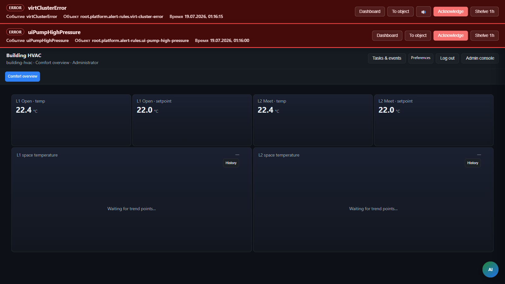

> **Язык:** русская версия (вычитка). Канонический английский: [en/reference-building-hvac-walkthrough.md](../en/reference-building-hvac-walkthrough.md).

# Справочное руководство: HVAC здания

Третье эталонное приложение для разработчиков решений: **зоны офисных этажей**, уставки комфорта и метаданные в стиле Haystack — без custom Java в `ispf-server`.

Артефакты: [examples/building-hvac-app/](../../examples/building-hvac-app/), bundle `appId` = `building-hvac`.

## Домен



| Сущность | Описание |
|--------|-------------|
| **Zone** (`hvac_zone`) | Код зоны этажа, температура в помещении, уставка, режим HVAC |
| **BFF host** | `root.platform.devices.demo-sensor-01` — `hvac_listZones` |
| **Operator shell** | `?mode=operator&app=building-hvac` |

Seed-зоны: `L1-OPEN-01` (охлаждение), `L2-MEET-02` (обогрев).

## Шаги

| # | Действие | API / path |
|---|--------|------------|
| 1 | Deploy bundle | `POST /api/v1/applications/building-hvac/deploy` |
| 2 | List zones | BFF `hvac_listZones` @ `demo-sensor-01` |
| 3 | Solution catalog | System → Solutions → **Install** reference `building-hvac-app` |
| 4 | Operator demo | `/?mode=operator&app=building-hvac` |

## Haystack

Bundle `metadata.haystackTags` документирует ожидаемый словарь тегов (`site`, `equip`, `ahu`, `zone`, `temp`). При расширении walkthrough привязывайте реальные устройства через MIXIN blueprint `haystack-metadata-v1`.

## CI

- `BuildingHvacBundleSmokeTest` — deploy + `hvac_listZones` возвращает 2 строки
- Опционально: шаблон `examples/warehouse-app/.github/workflows/bundle-ci.yml` для CI интегратора

## Команды

```bash
./gradlew :packages:ispf-server:test --tests com.ispf.server.application.BuildingHvacBundleSmokeTest
```
